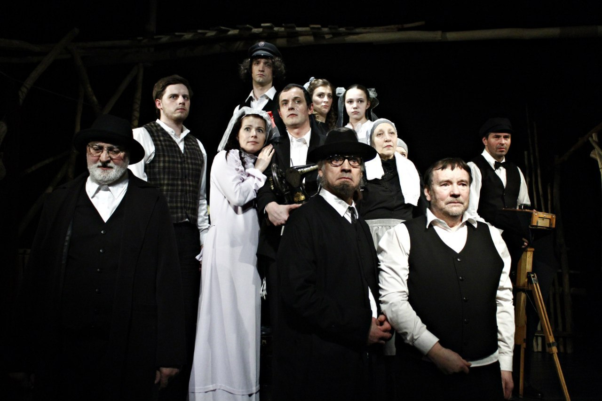

**17** и **18** сентября драматический театр «Комедианты» открывает свой 24-й сезон премьерами 2013 года — <a href="97-pominalnaia-molitva.html">«Поминальная молитва»</a> Г. Горина и <a href="91-les.html">«Лес»</a> А. Островского.

В новом сезоне зрителей ожидают сюрпризы! В театре обновится фойе — роспись стен под руководством главного художника театра Полины Левшиной и оригинальное решение фотогалереи от фотохудожника Светланы Пь. А администрация и литературная часть театра работает над созданием электронного журнала «Комедианты» — о театре и не только (эксклюзивные материалы, фото и видео). Презентация журнала состоится 17 и 18 октября.

В рамках мероприятия художественный руководитель театра з.д.и. России <a href="153-mihail-levshin.html">Михаил Левшин</a> расскажет о планах на следующий сезон и ответит на все, интересующие зрителей и журналистов, вопросы. Первой премьерой 24-го сезона станет спектакль <a href="282-kompromiss-sdovlatov.html">«Компромисс»</a> (С. Довлатов). Эскиз к этому спектаклю с актерами театра стал лауреатом фестиваля-лаборатории ON.ТЕАТР 2012 гг. сразу в двух номинациях «Лучший режиссер» — Глеб Володин и «Лучшая мужская роль» — Евгений Баранов. Второй по дате выхода, но не по значимости, станет премьера спектакля по рассказам Василия Шукшина под рабочим названием <a href="283-zemlyaki.html">«Земляки»</a>. Зрительный зал и сцена театра «Комедианты» ненадолго превратятся в сельский клуб далекой русской глубинки, где, демонстрируя свои музыкальные способности, открывают свои души наши «земляки».

<figure></figure>

9.09.2013г.

