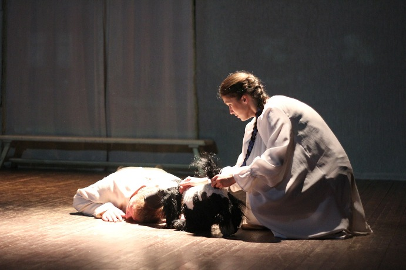
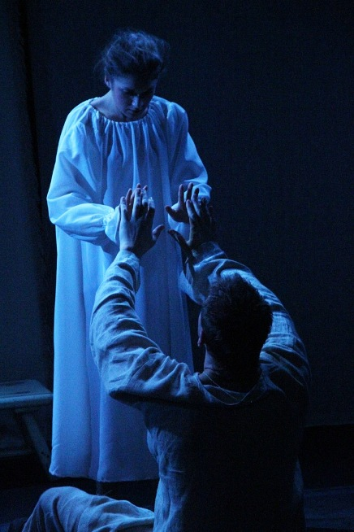

О спектакле драматического театра «Комедианты»

[«Крепостная любовь»](46-mumu.html)

<figure>

</figure>

Танцуют Толстого, Достоевского, Чехова… Несомненно, для лучшего восприятия такой хореографии требуется знание текста, подлинника. Тогда возникает игра между постановщиком и зрителем в предлагаемых обстоятельствах. Искушенные театралы к этому, скажем, адаптировались. Но вот исключить текст в драматическом театре…?!

Михаил Левшин, режиссер и художественный руководитель театра «Комедианты» заявил в афише жанр своей постановки как «пластическая драма». Пластическую линию с ним создавал замечательный хореограф и режиссер по пластике Сергей Грицай. Эта театральная фантазия оказалась действием без текста по рассказу «Муму» не самого последнего стилиста Золотого века И. С. Тургенева. Я, к своему стыду, первый раз оказался в театре «Комедианты», а «Муму», как абсолютное большинство «проходил», то бишь, мимо, в школе. Задержалось в памяти одно: «Почему Герасим…? Зачем Герасим…?» Забегая вперед, скажу, что перечитав «Муму» после просмотра спектакля не понял, почему «Муму» преподают в шестом классе, эта необычная и жуткая повесть достойна глубокого раздумья, а для ее осмысления необходимы зрелость и опыт.

Сегодня для режиссера, который обращается к классику, оный часто является лишь предлогом для осуществления некой идеи, созревшей в режиссерской голове, поводом дать сценическую вольную своим тараканам. Полемики на тему «Руки прочь от вольного прочтения классики» длятся уже десятилетиями. И вся эта говорильня может разрешиться только самим СПЕКТАКЛЕМ, его доказательностью, попыткой разгадать идею художественной формой, в конце концов, истинным художественным откровением.

Меня спектакль М. Левшина «Крепостная любовь» убедил и тронул – своей музыкальностью, пластичностью, простотой сценографии и доступностью режиссерской концепции. Звуковой ряд – уникальные композиции русского народного фольклора. Основой сценического оформления является проекция – на ней сменяют друг друга картины русских художников. Кроме этого – три скамейки, «на которых» строится все основное действие – они становятся то ступенями, то помостом, то кроватью, то горкой. Мера условности, которая принимается зрителем безоговорочно, метаморфозы простых предметов, не дающие вниманию ослабнуть ни на минуту. «Бедный» театр - в хорошем смысле этого слова - вспомним Брука, театр, где важна не мишура, которой пестрит сцена, а то, что ты унесешь со спектакля домой и положишь под подушку. А захочется положить под подушку после спектакля Левшина старенький томик Тургенева, убранный на верхнюю полку в шестом классе, и озвучить увиденное на сцене действие словами великого классика … захочется думать…

<figure>

</figure>

Команде Левшина не подходит расхожее «играют», они виртуозно Работают на сцене. Этот глагол скорее применим к цирковому или же балетному театру. Я, быть может, не побоялся бы назвать то, что актеры создают на сцене «синтетическим спектаклем», где органично соединяются движение – танец, вокал и драматическое действие.

Режиссер обеззвучивает всех персонажей, превращая их в покорные существа, создает атмосферу маразма и жути московской усадьбы, где главный кукловод – Барыня. Она живет прошлым, воспоминаниями о погибшем муже, некоем гусаре. Все, что она делает в настоящем – садистски, немотивированно - диктует окружающим рабское немое существование. Тема этого безусловного подчинения власти выходит на первый план. На фоне созданной кукольно-фольклорной атмосферы режиссер выводит изначально обреченных героев. Они живые, поэтому они обречены. У Левшина это встреча двух душ в бездушном пространстве. Татьяну отнимают у Герасима, отнимают единственное светлое.

По сюжету повести – потеря Татьяны – обретение Муму, смешной и трогательной собачки. С этого момента начинается главное - в атмосфере «смех и слезы», созданной на сцене замечательным ансамблем «дворни», появляется Муму. Муму прежде и в кино, и в театре топили, и вопрос «Зачем?» оставляли открытым. Левшин нашел, если не доказательное, то оригинальное решение – исполнительница роли Татьяны, [Алена Азарова](86-alena-azarova.html), выводит на сцену куклу Муму. О том, как это происходит, скажу словами писательницы Дины Рубиной из ее последнего романа «Синдром Петрушки»: «Кукла ожила, она движется, она совершенно послушна его мысли и той горячей волне, что бежит к ней, бежит по его руке… Вот она доверчиво поднимает к нему лицо, прижимает к сердцу узкую ладонь с тонкими подвижными пальцами… Он чувствует как бьется у нее сердце! Еще мгновение, и она что-то произнесет!»

Татьяна возвращается на сцену и ее игра с куклой – есть прозрачный замысел режиссера: Муму – это душа Татьяны, которая возвратилась к Герасиму. Но возвратившееся счастье – есть иллюзия. В этой атмосфере пляшущих кукол будут отнимать душу. Герасим, не обретя никакой свободы, по Левшину, уходит в себя в ожидании встречи с душой, которую у него отняли, встречу в вечности… И хор – финальный хор, громкий и пронзительный, с русским «Лёли-лёли», о русской судьбинушке…

Борис Шаров / журнал "Невский Театраль" / ноябрь 2013 №2 (02)

<figure>

</figure>