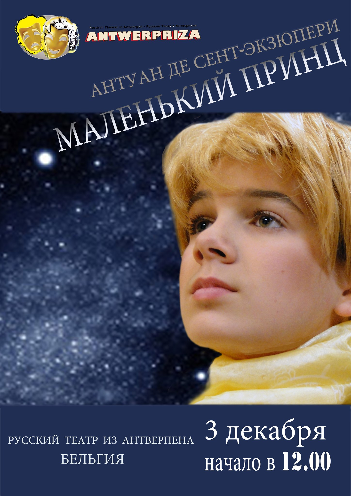

<figure></figure>

3 декабря в 12.00 в рамках благотворительного фестиваля, организованного театром «Комедианты» — «Дворцы Санкт-Петербурга — детям», бельгийская труппа представит спектакль «Маленький принц» (А. Экзюпери) во Дворце Белосельских-Белозерских.

<figure></figure>

Спектакль для взрослых «Летний вечер, половина одиннадцатого» по бестселлеру Маргарет Дюрас для петербургского зрителя будет представлен 6-го декабря в 19.00, а в Ленинградской области, в Лодейном поле — 4 декабря. Это спектакль о двух странах, двух традициях и двух традиционных любовных треугольниках. Восприятие сексуальной революции в разных культурах, в разных реальностях.

