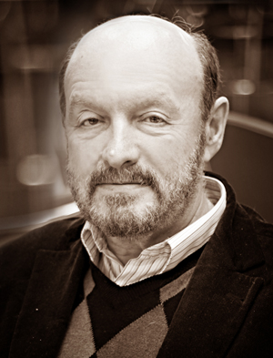
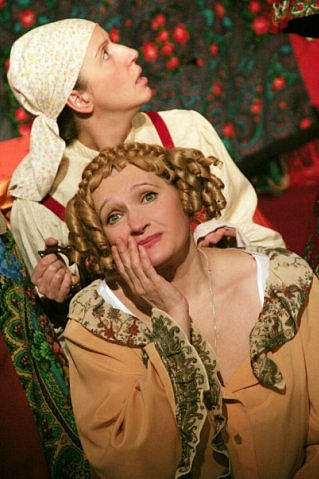

**Театр "КОМЕДИАНТЫ"**

**Интервью Михаила Левшина.**

<figure></figure>

Официально этот театр называется "Комедианты в доме Перцова". Сейчас он занимает солидное пространство, в нем есть настоящий гардероб, буфет, фойе, билетная касса и служебный вход - все как положено. А было время, когда ни о чем подобном даже не мечтали, а если мечтали, не признавались, и всего театра в ту пору было - зал и сцена. А что, собственно, еще может быть нужно для того, чтобы театр был?

Начав отсчет своего существования 25 декабря 1989 года, "Комедианты" - маленький театрик областного подчинения, возглавляемый режиссером Михаилом Левшиным, особенно ни на какие жизненные блага не рассчитывал. Был репертуар из двух спектаклей, была творческая бригада (команда, компания - называй как хочешь), было желание работать дальше, было официальное признание: да, такой театр существует. Перспективы были туманны.

- Я пришел тогда в областное Управление культуры, и мы чуть ли не бартер им предложили: вы нам поможете сделать театр, а мы будем спектакли в области играть. Мы долгое время что-то доказывали, документы приносили, а нам говорили: "Дорогие вы наши, без помещения театров не бывает!" "Бывает, - говорили мы, - вот мы есть, есть, например, Московский областной театр, у них есть репетиционная база, две комнаты, и они работают на выездах." И вот так, на выездах, мы и работали, с начала девяностого и по девяносто четвертый год, пока не въехали в это вот помещение, не открыли сезон и не стали жить на Лиговском, 44, под названием "Театр "Комедианты". В то время мы сделали Островского - <a href="42-volki-i-ovci.html">"Волки и овцы"</a>, премьера состоялась в ноябре девяносто четвертого, и спектакль до сих пор идет. Вообще, надо сказать, что все спектакли у нас живут долго. Это связано с целым рядом причин. Во-первых, они делаются не быстро. То, над чем долго работаешь, как-то сразу, через два-три сезона и в голову не приходит снимать. А во-вторых, они востребованы, не боюсь такого слова - не устаревают. В жизни многое меняется, но общечеловеческие проблемы никуда не исчезают. Большую часть репертуара у нас составляет классика, она таит в себе эти вечные проблемы, и похоже, нам удается так эти проблемы интерпретировать, что они не кажутся сиюминутными. Вот, например, мы взяли пушкинского "Графа Нулина" и сделали откровенно хулиганский, не лишенный эпатажа спектакль. Такая театральная шутка, оправданная тем, что Пушкин сам был большой шутник и хулиган. Но и в шутку, и всерьез все-таки. Потому что в конце исполнительница роли Натальи Павловны читает письмо Анны Керн о том, как она встречалась с Пушкиным, она выходит восхищенная Пушкиным… И когда она это читает, такая в зале тишина стоит! Спектакль шутейный, с провокациями, с предложением в начале, чтобы кто-нибудь из зала сыграл роль, но когда эта игра кончается вот таким письмом и оно так серьезно воспринимается, значит, в спектакле есть та существенная, содержательная часть, ради которой существует и часть шутейная.

Первый спектакль, которым "Комедианты" всерьез заявили о себе Питеру, - это

<figure><a href="42-volki-i-ovci.html">"Волки и овцы"</a>. Знаменитая комедия Александра Островского о хитросплетениях человеческих отношений, о людях, зубами выдирающих уютное и просторное место под солнцем у окружающих. Бесконечно обаятельные люди небрежно выясняли отношения на светлой веранде, в которую превратилась тесная коробочка сцены. Все были настолько милы и приятны, что трудно было заподозрить кого-либо в хищных помыслах. Наивную вдову Евлампию Купавину обводили вокруг пальца все, кому не лень, а она по-прежнему доверчиво улыбалась и верила всему, что</figure>

ей говорили. И была в ее доверчивости пронзительная трогательность, и совершенно не хотелось думать, что человек человеку все-таки волк… На финальных поклонах наибольший аплодисмент срывали двое - <a href="25-mewaninova-nina.html">Нина Мещанинова</a> - Купавина и Сергей Русскин - дворецкий Вукол Чугунов.

- Недавно в нашем театре праздновали получение званий - трех подряд. В том числе заслуженными артистами стали у нас <a href="25-mewaninova-nina.html">Нина Мещанинова</a> и Сергей Русскин. Нине Мещаниновой, конечно, очень помогло то, что у нее состоялась последняя роль - Агафья Тихоновна в <a href="69-genitba.html">"Женитьбе"</a>, убедительная, колоритная, важная составляющая спектакля. И ее концертная деятельность стала уже серьезной, вплоть до гастролей за границей, ее везде прекрасно принимают. Много хороших отзывов. А Сергей Русскин очень удачно начал в нашем театре с "Волков" и дальше был одним из ведущих актеров, и в "Женитьбе" прекрасно себя проявляет. И в холле театра под их фотографиями теперь подписано: "Заслуженный артист России". Раньше казалось: да Бог с ним, да зачем это… А потом понимаешь, что слово "заслуженный" - от "заслужить". То есть надо служить, служить и наконец заслужить.

Пять лет назад Михаил Левшин набрал курс в Академии театрального искусства. Его студенты выросли при "Комедиантах", здесь были и занятия, и репетиции, и дебюты, и полноценное знакомство с настоящей театральной жизнью. Обычно, если художественный руководитель театра берется учить студентов, курс превращается в студию, и, повзрослев, молодые актеры входят в труппу.

<figure></figure>

- Часть моего курса осталась в нашем театре - безусловное приобретение, например, <a href="79-anna-zagrebna.html">Анна Белова</a>, лирическая героиня, дефицитнейшее амплуа, она уже очень много играет у нас: и Роксану в <a href="60-sirano-de-bergerak.html">"Сирано де Бержерак"</a>, и Наталью Павловну в "Графе Нулине", и в <a href="44-dyrochka.html">"Дурочке"</a>…

"Дурочка" ведь изначально была студенческим спектаклем. А теперь спектакль стал репертуарным, а Аня из студенток перешла в артистки и играет главную роль - Финею. Есть еще несколько человек - бывших студентов, которые стали артистами. Остались те, кто нужен театру и кому нужен театр. Часть курса успешно работает в ТЮЗе. Но в этом году мне показалось - набирать новый курс не стоит. Я преклоняюсь перед теми руководителями театров, которые еще и преподают - и Владислав Борисович Пази, и Григорий Михайлович Козлов… Но мне вполне достаточно театра и различных проектов. Я вполне доволен тем, что прошел через это, что-то это дало и студентам, и мне, и театру. Это благополучно завершилось, и больше пока не надо.

Проектов у "Комедиантов" действительно много - начиная от благотворительного фестиваля "Дворцы Санкт-Петербурга - детям" и заканчивая творческими вечерами странных романтиков-менестрелей.

- Ежегодный фестиваль "Дворцы Санкт-Петербурга - детям" мы проводим для детей из детских домов Ленинградской области. Началась эта история с того, что мы приехали как-то во Дворец труда с детским спектаклем, в самом начале существования театра, когда у нас еще помещения не было, и там нам сказали: сегодня спектакля не будет, в зале заседание каких-то чиновников. И я на лестнице долго шумел по поводу того, что все должно быть наоборот, дворцы должны быть не для номенклатуры, а для людей, и для детей особенно. И после этого мы решили что-нибудь сделать, чтобы дети узнали, что это за дворцы, экскурсию послушали и спектакли в интерьерах дворцов посмотрели. Нынешний фестиваль уже десятый, юбилейный, и даже в связи с этим председатель СТД России Александр Калягин прислал благодарственное письмо губернатору области. Мы, конечно, хотим, чтобы губернатор этот фестиваль не забывал: чем больше он его поддерживает, тем больше радости у детей, которые приходят, смотрят спектакли и получают подарки.

Был у нас еще проект, связанный с детьми. Выпущен спектакль "Питер Пэн" Джеймса Барри, он играется по разным школам. Мы кинули клич, собрали детей из разных школ, они с удовольствием репетировали, и можно было бы сделать детскую студию… Пока такой задачи у нас нет. Но энтузиазм детский - это удивительно. Они с таким азартом готовы в эту заразу театра входить! Правда, в этом есть и положительный момент - поэтому и не иссякает актерский рынок, поэтому такой высокий конкурс в театральный институт, альтернативные театральные учебные заведения тоже заполняются, это все, слава Богу, неистребимо - интерес и тяга к театру.

Мы все время что-то придумываем и в чем-то участвуем. Сегодня, например, мне позвонил один композитор и говорит: "В Политехническом университете создается центр, связанный с театром, вы не хотите принять в этом участие?" Первое, что я делаю в таких случаях - говорю: "Хочу". При ближайшем рассмотрении иногда такие вещи оказываются бесперспективными авантюрами, но попробовать всегда стоит. Или еще: вчера мы решили, что хорошо бы на нашей площадке давать бардовские концерты - раз в два месяца хотя бы. Тоже случайно началось: как-то после спектакля тут ночью пели такие неожиданные, интересные люди. Есть такой - Вольмар ибн Кабози, безусловно талантливый автор, соединяет русский фольклор, городской романс и чуть-чуть добавлено тюремной лирики. Завораживающий голос, сидит такой странный человек, про реченьку поет… Второй именуется Валери фон Эргер, тоже очень интересный человек. Наши актеры всю ночь сидели, слушали, общались потом… Из этого может что-то получиться. Все это нужно обязательно, вокруг театра должна быть какая-то творческая жизнь, иначе театр и сам жить не сможет.

Репертуар "Комедиантов" охватывает, наверное, все вкусы и пристрастия. От романтической трагедии "Сирано де Бержерак" Ростана до прелестной детской сказки <a href="45-exala-derevna-mimo-mushika.html">"Ехала деревня мимо мужика"</a>, от озорной "Дурочки" Лопе де Веги до философской "Женитьбы" Гоголя. В ближайших планах камерного театра - материал поистине гигантский. Но, как известно, чем сложнее, тем интереснее.

- Сейчас мы репетируем очень сложное, как всегда в таких случаях говорят режиссеры, "не раскрытое по-настоящему до конца" великое произведение Шекспира "Венецианский купец". Оно полно и трагизма, и юмора, и современных острых проблем, просто сиюминутных, в связи с национальным противостоянием и экстремизмом. И вот это соединение в одном произведении множества категорий оказывается очень интересным для работы, для исследования и для актеров. На роль Шейлока назначен Сергей Русскин, но он сейчас очень занят, его позвали в Театр комедии, и у нас приглашен еще Владимир Матвеев из Театра имени Ленсовета, который недавно получил "Золотой софит" за роль Каренина в спектакле "Каренин. Анна. Вронский.". Мы успешно репетируем, и нам обоим очень нравится. Оформляют спектакль ученики Эдуарда Кочергина Олег Головко и Анна Алексеева, и Эдуард Степанович заходит к нам, посмотреть на макет. Мы с ним делали "Женитьбу", теперь его ученики работают в "Венецианском купце".

Еще наш режиссер Алексей Исполатов ставит "Фауста" Гете. Это риск, о котором мы открыто заявили его участникам, но на риск этот мы пошли. Почему? Да если взять наш репертуар - Лопе де Вега, Гоголь, Эдуардо де Филиппо, Островский, Ростан, Пушкин, репетируется Шекспир… Так почему бы тогда и не Гете?

Проблема формирования репертуара для любого театра главная. Для маленького особенно. Для недавно существующего - просто огромная. На протяжение десятилетия "Комедианты" боролись за зрителя с более именитыми, опытными, увенчанными лаврами и осененными славой театрами. Впрочем, "боролись" - не совсем верное слово. "Комедианты" ни с кем не вступали в полемику и никого не вызывали на соревнование. С самого начала театр выбрал себе дорогу и уверенно пошел по ней. Оказалось, что очень многим зрителям с "Комедиантами" по пути.

- Очень хочется максимально поставить классику. Она для нас остается прерогативой, что бы мы ни затевали. Лопе де Вега - это ведь тоже классика, но спектакль задорный, ритмичный, зрелищный, искрящийся. Сейчас у нас в работе пьеса "Двойная игра" - откровенный, лихо сделанный психологический детектив, с хорошей интригой, сложными характерами. У него есть второе название, более кассовое - "Леди начинает и выигрывает". Для него нужны мощные актерские индивидуальности. Принцип формирования репертуара прост: это интересно, это актуально, это хорошая литература. Вот и все.

Вообще, в театре уже давно работают не за зарплату. Тогда за что? Да за участие в настоящей, качественной драматургии! И с концертов, с елок, с халтур артисты бегут сюда, потому что общение с такой литературой, безусловно, окупает многое. Мы высказываемся по этому поводу так, что это не порочит имя великого драматурга. Можно так сформулировать, наверное? Сейчас интересная ситуация в театрах сложилась. Вот в музыке же не говорят: "Они играют Моцарта - какая отсталость!" А в театре запросто: сыграли Островского по старинке, никто нигде не плавает, ниоткуда не падает, многозначительно не молчит… А вокруг говорят: "Мило, обаятельно, но старомодно… " По-моему, сейчас уже есть схемы, по которым театр может получить "Софит" или "Маску". Нужно просто знать критерии и фамилии: каких режиссеров и художников приглашать. Путь проложенный. Но заниматься этим не хочется. Поэтому мы занимаемся другим. Я помню, как-то один театральный критик сказал: "Вы же понимаете, это спектакль не для людей с улицы". И я тогда подумал: "А ведь по улице ходят очень хорошие, интересные, неожиданные люди!" Мы стараемся работать так, чтобы люди с улицы, зайдя к нам, начали ходить в театр - в наш или в другие, и чтобы они поняли, что их здесь ожидает, что они могут тут найти. Мы хотим, чтобы в нашем театре зрителю было хорошо.

Сейчас уже те, кто покупает билеты в наш театр, - это люди не случайные, они знают, куда идут, и они хотят идти именно к нам. Я не хочу подделываться ни под чрезвычайно умных людей и делать головоломки, ни под ту часть молодежи, которой нравятся яркие и пустые зрелища. Мы работаем для настоящего петербургского театрала, для той прогрессивной части публики, которая считает, что без театра жизнь пуста, который уходит из театра и долго еще вспоминает спектакль, думает о нем, переживает его заново, который умеет соучаствовать…

Солидный репертуар, постоянная публика, служебные помещения, разнообразные мероприятия, яркая афиша, премьеры и гастроли - маленький театрик областного подчинения стал настоящим театром. И не так уж и важно, что зал у него маленький, а сцена узкая и неглубокая. В конце концов, настоящему комедианту нужно совсем немного, чтобы расстелить коврик и начать представление. Главное, чтобы зритель тебя принял. "Комедиантов в Доме Перцова" петербургская публика приняла и полюбила.

Газета "Театральный Петербург" / 15.12.2001 г. / автор: Кира Николаева

<a href="http://www.theart.ru/cgi-bin/programmaterial.cgi?id=332">Ссылка на статью</a>

