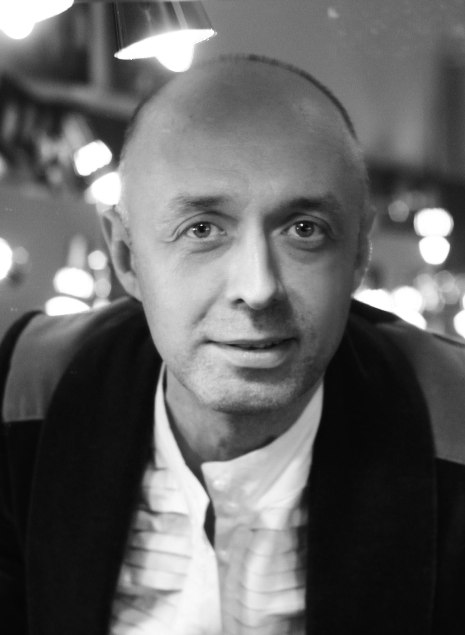

<figure></figure>

Родился 22 августа 1969 года. В 1996 году окончил театральный институт «Школа Русской драмы», курс заслуженного артиста России Семёна Сытника. Играет во многих театрах г. Санкт-Петербурга (Театр Малыщицкого, Молодёжный театр на фонтанке, Александринский театр, Приют Комедианта и т.д. ) С 1997 года по 2005 года работал в труппе Санкт-Петербургского государственного драматического театра "Комедианты". Преподаёт актёрское мастерство в театральном институте «Школа Русской драмы», имеет свой курс. Снимался в фильмах: "Лопухи", "Гадкие лебеди", "Туда, где живёт счастье", "Травести" и др.

С 2005 года сотрудничает с Санкт-Петербургским государственным драматическим театром «КОМЕДИАНТЫ» .

Занят в спектаклях:

<a href="91-les.html">«ЛЕС»</a> А.Островский - роль Несчастливцев

<a href="60-sirano-de-bergerak.html">«Сирано де Бержерак»</a> Э.Ростан - роль Сирано де Бержерак

<figure></figure>

