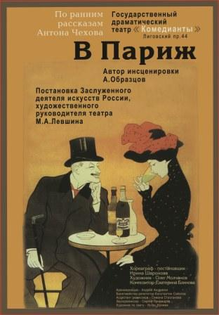

**"МЫ СВЯЗАНЫ, АГНЕШКА, ДАВНО ОДНОЙ СУДЬБОЙ… "**

Санкт-петербургский театр "Комедианты" сотрудничает с театральными коллективами дружественной нам Польши уже давно. Правительство Ленинградской области заключило с Управлением маршала Ниже-Силезского воеводства Республики Польша соглашение о межрегиональном сотрудничестве. Благодаря этому соглашению, руководители театров воеводства и Ленинградской области обменялись дружескими визитами и заключили творческий союз. Самое активное участие в этом принял руководитель Театра "Комедианты" <a href="153-mihail-levshin.html">Михаил Александрович Левшин</a>. Весной 2009 года на сцене театров города Вроцлав и Валжбихе с успехом прошли гастроли "Комедиантов", в рамках которых был показан спектакль по ранним рассказам А. П. Чехова <a href="41-v-paris.html">"В Париж"</a>.

<figure></figure>

Несколько лет назад театр посетил город Вроцлав с бардовским концертом ведущей актрисы театра, заслуженной артистки России <a href="25-mewaninova-nina.html">Нины Мещаниновой</a>. Программа по песням Булата Окуджавы имела невероятный успех у польского зрителя. Мы и не подозревали, что творчество легендарного русского барда так хорошо известно, а главное, любимо поляками. Зрители не просто подпевали на русском языке. "Они ловили каждый нюанс, удивительно чувствовали тонкий юмор и иронические интонации песни, их реакция удивляла и радовала одновременно", - делится впечатлениями Нина Мещанинова.

Актриса гастролировала с бардовской программой по польским городам, среди которых был небольшой городок Кошалин на побережье. Уже пятьдесят лет в этом городе существует Балтийский драматический театр имени Юлиуша Словацкого, названный в честь известного польского поэта и драматурга. В театре 360 мест, его репертуар разнообразен - это и польские, и американские, и немецкие, и конечно, русские пьесы, как классических, так и современных драматургов. С кошалинским театром у "Комедиантов" завязалась долгая и прочная творческая дружба.

В Польше знают и любят Чехова, Толстого, Достоевского и Гоголя, их произведения - частые гости на польской сцене. Однако такой великий русский драматург, как А. Н. Островский, польскому зрителю почти не известен. Последний раз его ставили лет пятьдесят назад. Художественный руководитель и режиссер Театра "Комедианты" Михаил Левшин задумал поставить с польскими актерами пьесу А. Н. Островского "Свои люди, сочтемся". Это первая большая комедия драматурга, имевшая оглушительный успех у современников. Михаил Александрович на польской сцене репетировал классическое прочтение драматурга, в традициях русской психологической школы. Опыт оказался чрезвычайно интересен как для режиссера, так и для польских актеров. Премьера спектакля "Банкрот" на сцене Кошалинского драматического театра с успехом состоялась 27 марта 2010 года, и теперь спектакль идет в основном репертуаре театра. "Мы прекрасно понимали, о чем речь, схожие проблемы волнуют и нас", - рассказывали польские артисты о работе с русским режиссером и драматургией русского классика.

И вот, наконец, 2 мая, во Всемирный день Полонии, и 3 мая, в День Конституции Республики Польша, Балтийский драматический театр приехал в Петербург с гастролями. На сцене "Комедиантов" был показан один из лучших спектаклей театра - "СAFE SAX" (реж. Кесарий

<figure></figure>

Домагала). Это постановка по песням великой польской поэтессы Агнешки Осецкой. В прошлом веке Агнешку Осецкую и нашего легендарного барда Булата Окуджаву связывала долгая творческая и личная дружба. Окуджава переводил на русский ее стихи, а свои посвящал ей:

Мы связаны, Агнешка, давно одной судьбою

В прощанье и в прощенье, и в смехе и в слезах…

Сегодня два театра продолжают начатый ими союз, и во след балладам Булата Окуджавы, исполненным Ниной Мещаниновой для польских зрителей, теперь польские коллеги подарили нам песни Агнешки Осецкой.

**"СAFE SAX"** - музыкальный спектакль, который вводит зрителя в неповторимый климат кафе на Саской Кэмпе в Варшаве. Именно там родились самые прекрасные и любимые всеми песни Агнешки Осецкой. Благодаря актерам Балтийского драматического театра зритель становится свидетелем чудесной повести о чувствах, мечтах, о желаниях и страстях. Декорации вполне достоверно восстанавливают интерьер небольшого кафе, функциональная барная стойка, несколько круглых столиков. Задник представляет собой стеклянную дверь и окно, за которыми - Варшава 60-х годов прошлого века. Звучит музыка, за окном ходят озабоченные интеллигенты в серых пальто и очках - это очкарики, они поют песню об уставших от жизни людях… Прогуливающаяся по тротуару поэтесса, Агнешка Осецкая, слушает уличного музыканта. В кафе зажигается свет, бармен за своими обычными заботами готовится к приходу первых посетителей, он пританцовывает и поет о людях, мечтающих о счастье. Поэтесса за угловым столикам пишет стихи, ее мысли прерываются приходом посетителей, мужчин и женщин, их музыкальными историями. Грустные, даже трагичные воспоминания перемежаются легкими, веселыми мотивами. Ведь жизнь, как поется в одной из песен Осецкой, длится столько, сколько длится бал. Есть там и любовь, и ревность, и слезы… Нужно принять приглашение на бал, чтобы осмелиться и попробовать… жить!

Блюзовые и джазовые композиции, профессиональный вокал и выстроенные под музыку мизансцены - танцы. Все действие, даже диалоги между песнями ритмически четки, песня, начинающаяся с соло, вдруг перерастает в дуэт, к нему присоединяется другой дуэт, а к финалу это уже стройный хор. Одна песня продолжает другую, женский вокал сменяет мужской, переходит в монолог, в действие, в кафе люди пьют кофе, просто разговаривают и слушают музыку, а в это время перед глазами зрителей проплывает вереница людских судеб, их радостей и горестей.

Труппа польского театра поражает умением существовать на сцене одновременно в качестве драматических артистов и эстрадных исполнителей. Как тонко перерастает диалог в песню, в какие-то моменты сложно уловить грань между ними. Малгожата Верчох в роли поэтессы, философски наблюдающей и саркастически комментирующей происходящее в кафе, в момент преображается, становится несчастной и уязвимой, вспоминая историю о девушке, покончившей жизнь самоубийством из-за несчастной любви. Катажина Улицка-Пыда и Жанетта Грушчинска-Огоновска, исполнительницы остальных женских персонажей, через спектакль, через вереницу образов создают своих идеальных Женщин, сильных и сексуальных, слабых и страдающих, но с неисчерпаемым жизнелюбием и юмором, так свойственным творчеству Агнешки Осецкой. Артур Чэрвиньски играет неугомонного бармена, который все действие намешивает коктейли, варит кофе в натуральной кофеварке, не забывая при этом посочувствовать каждому посетителю, спев с ним дуэтом. Главную мужскую роль - пана Чеслава играет Войчех Роговски, талантливый и харизматичный актер. Его пан грузен и важен, он скользок и похотлив, когда поет свой сон об идеальной девушке, и мечтателен и нежен в песнях о несчастье и одиночестве.

С незапамятных времен Польша и Россия, наши страны и народы, соседствуют друг с другом . И никогда политические отношения не имели влияния на контакты культурные. Это замечательно, потому что, когда политика вторгается в культуру, зарождается идеология. Поколения русских людей воспитаны на польском кинематографе, на польском театре, Вайда и Гротовский - это те имена, которые внесли свой вклад в культурное наследие как Польши, так и нашей страны. Продолжение польско-российского культурного диалога может принести удивительные, неожиданные плоды. Знакомство русского зрителя с творчеством польской поэтессы Агнешки Осецкой, женщины, которая играла в жизни польского народа ту же роль, что в нашей играли Булат Окуджава или Владимир Высоцкий, неоценимо. У каждой нации есть такие люди, которые в какой-то исторический момент чувствуют движение времени особенно чутко. Осецкая и Окуджава говорили со своими современниками на понятном им языке, на языке их чувств и эмоций, о том, что их волновало в данный конкретный момент, о том, что болело и что делало счастливыми . Их стихи - как личные письма современнику, теперь они хранят для нас голос той эпохи.

Спектакль посетили много носителей польского языка, представители Генерального консульства Республики Польша в Санкт-Петербурге, представители Польского дома, студенты славянского факультета СПбГУ. Но и русские зрители, не знающие польского языка, прекрасно понимали все, что происходило на сцене, ведь язык музыки интернационален. А смысл диалогов стал доступен благодаря эмоциям и жестам, сопровождающим их. Два дня подряд зрители после спектакля не отпускали актеров бурными овациями, вызывали на бис. "У меня такое ощущение, что я ненадолго попала во время моей молодости" - благодарила театр петербургская зрительница.

Художественный руководитель кошалинского театра Здислав Деребески с надеждой говорит о продолжении творческого сотрудничества с Театром "Комедианты" и о своих планах привезти и показать петербургскому зрителю спектакль М. А. Левшина **"Банкрот"**. Помимо этого в следующем году "Комедианты" в рамках международного сотрудничества планируют гастроли в Польшу с премьерным спектаклем по повести И. С. Тургенева<a href="46-mumu.html"> **"Му-Му"**</a>. Постановка основана на пластических этюдах в сопровождении песен русского народного фольклора, поэтому языковой барьер здесь не будет затруднять восприятия действия.

На прощание Здислав Деребески высказал очень важную мысль, которая вдохновляет нас на продолжение начатого пути:

" В Польше так вышло, что, как только мы присоединились к Европе, все стали смотреть только на Запад… А сейчас начался обратный процесс, мы повернулись на Восток. Мне очень близок театр Германии, но он, как бы это сказать, слишком точный. В России мне дорог именно психологический театр. Поляки сейчас оказались где-то между Востоком и Западом. И нужно обязательно продолжать общаться, создавать новые проекты. Ведь несмотря на то, что не все понимали сегодня слова, они понимали главное - душу. Потому что творчество идет из души. Это прекрасно!"

