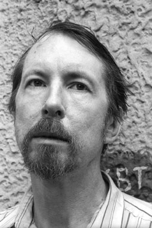

**НИКОЛАЙ ИСПОЛАТОВ**

<figure></figure>

Родился 14 апреля 1951 г. в городе Ленинграде. Детство провел в городе Котельнич Кировской области. В 1974 году окончил Ленинградский театральный институт. Имеет диплом актёра театра и кино. С 1975 г.по1979 г. работал в ТЮЗах Красноярска и Орла. С 1983 актёр много снимается в кино, сыграл в фильмах режиссеров В. Трегубовича, А. Кайдановского, С. Ткачева. Николай Исполатов - актёр глубокого погружения в образ, и очень легко владеет жанром трагикомедии, так же владеет мастерством перевоплощения. Каждая его новая роль не похожа на предыдущую. С 2007 года - член Союза писателей России. Автор книги стихов "Исповедь сокрушённого сердца" и пьесы "Угол Марата" - журнал "Балтийские сезоны". Снимался в фильмах: «Жена керосинщика», т/с «Улицы разбитых фонарей», «Мифы моего детства», «Ветка сирени», «Псы» и др.

С 1990 года актёр Санкт-Петербургского государственного драматического театра «КОМЕДИАНТЫ» .

Занят в спектаклях:

<a href="97-pominalnaia-molitva.html">«Поминальная молитва»</a> Г.Горин - роль Священник

<a href="69-genitba.html">«Женитьба»</a> Н.В.Гоголь - роль Степан

<a href="60-sirano-de-bergerak.html">«Сирано де Бержерак» </a>Э.Ростан - роль Капуцин

<a href="71-anekdoti.html">«Провинциальные анекдоты»</a> В.Вампилов - роль Скрипач Базильский

<figure></figure>

