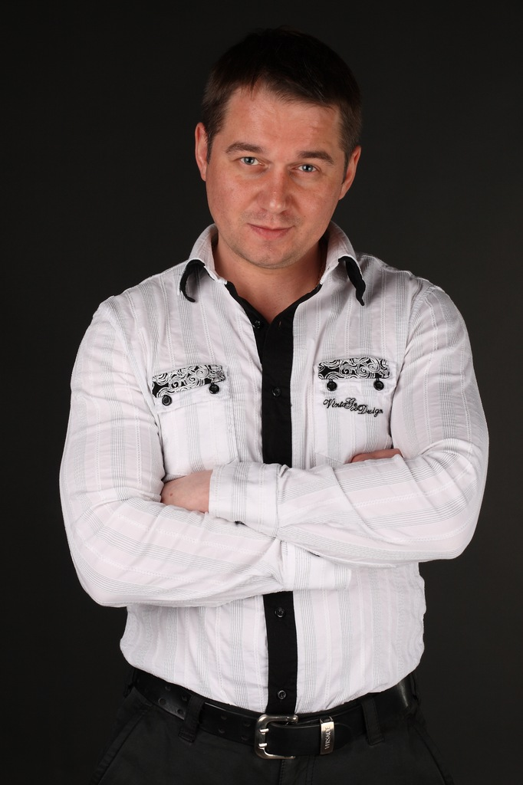

**АНАТОЛИЙ ИЛЬЧЕНКО**

<figure></figure>

Родился 14 июня 1976 года в г.Ноябрьске . В 1998 году окончил Санкт-Петербургскую Академию театрального искусства, класс профессора А.С.Шведерского . Снимался в фильмах: «Аэропорт - 2», «План Б», «Гончие - 3», «Клеймо», «Отставник - 2», «Ментовские войны - 5» и др.

С 2004 года актёр Санкт-Петербургского государственного драматического театра «КОМЕДИАНТЫ».

Занят в спектаклях:

<a href="46-mumu.html">«Крепостная любовь» (МуМу)</a> И.Тургенев - роль Капитон

<a href="60-sirano-de-bergerak.html">«Сирано де Бержерак»</a> Э.Ростан - роль Ле Бре

<a href="71-anekdoti.html">«Провинциальные анекдоты»</a> А.Вампилов - роль Угаров

<a href="72-trigorin.html">«Записные книжки Тригорина» </a>Т.Уильямс - роль Медведенко

<a href="69-genitba.html">«Женитьба»</a> Н.В.Гоголь- роль Жевакин

<a href="41-v-paris.html">«В Париж!» </a>А.П.Чехов - роль Соусов, чиновник

<figure></figure>

<figure></figure>

