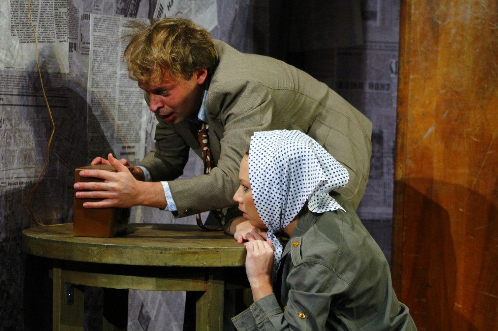
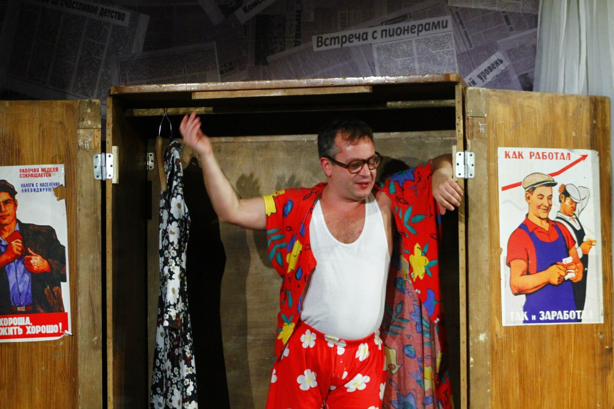
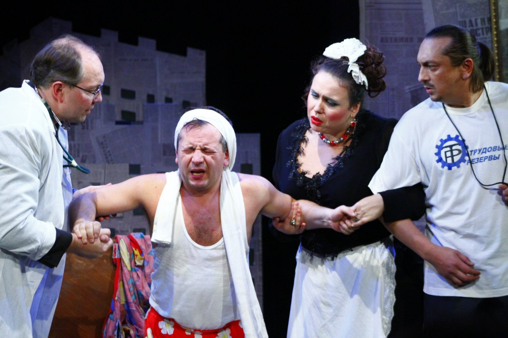
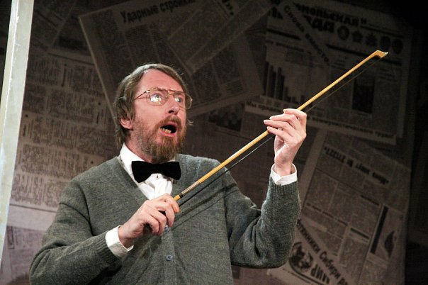
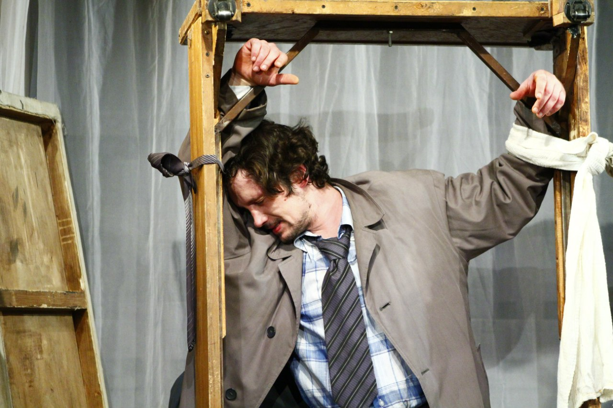

**Александр Вампилов**

**«ПРОВИНЦИАЛЬНЫЕ АНЕКДОТЫ» 16+**

Трагикомедия в 2-х действиях.

Режиссёр - постановщик: <a href="53-aleksei-ispolatov.html">Алексей ИСПОЛАТОВ</a>

Художник: Светлана БУРЯКОВА

"Провинциальные анекдоты" – это два полноценных миниспектакля: "История с метранпажем" и "Двадцать минут с ангелом". Их действие происходит в маленькой провинциальной гостинице "Тайга", куда по разным причинам занесло героев с разных концов Союза. Персонажи спектакля не столько сатиричны, сколько "по-фарсовому" комичны в своей простоте, типичности и заурядности. Какие-то их проблемы кажутся сейчас просто смешными, но анекдотические ситуации, в которые попадают герои, в итоге приводят их к неожиданному и драматическому финалу. Эта пьеса, один из лучших образцов советской сатиры на бюрократию, в трактовке театра «Комедианты» звучит с некоторой ноткой грусти и ностальгии по времени, которого давно уже нет.

Пресса о спектакле "Провинциальные анекдоты":

<a href="268-pressa-anekdoti-2010.html">"Провинциальный анекдоты" в театре "Комедианты": всё не просто так!" (газета "Мой район онлайн")(автор:Т.Морозова)</a>

В спектакле заняты:

**Анекдот 1** **(История с метранпажем)**

Калошин - <a href="52-sergei-nikolaev.html">Сергей НИКОЛАЕВ</a>

Виктория - <a href="23-belova-ekaterina.html">Екатерина БЕЛОВА</a>

Марина (жена Калошина) - <a href="49-ylia-gorshenina.html">Юлия ГОРШЕНИНА</a> / <a href="64-asia-pigel-sergeevna.html">Анастасия ПИЖЕЛЬ</a>

Рукосуев (врач) - <a href="24-blednyh-sergej.html">Сергей БЛЕДНЫХ</a>

Потапов - <a href="51-stas-voronetski.html">Станислав ВОРОНЕЦКИЙ</a> / <a href="22-afendulov-semen.html">Семён АФЕНДУЛОВ</a>

Камаев - <a href="21-fillipp-azarov.html">Филипп АЗАРОВ </a>/ <a href="284-2013-09-08-18-38-31.html">Павел ИВАНОВСКИЙ</a>

**Анекдот 2** **(20 минут с ангелом)**

Хомутов - <a href="66-vitalii-kravchenko.html">Виталий КРАВЧЕНКО</a>

Угаров -<a href="55-anatolii-ilchenko.html"> Анатолий ИЛЬЧЕНКО</a>

Анчугин - <a href="77-ilgiz-bulgakov.html">Ильгиз БУЛГАКОВ</a>

Васюта - <a href="61-galina-saburova.html">Галина САБУРОВА</a> / <a href="80-tatiana-kogevnikova.html">Татьяна КОЖЕВНИКОВА</a>

Фаина - <a href="78-ylia-burceva.html">Юлия БУРЦЕВА</a> / <a href="81-ekaterina-kyltina.html">Екатерина КУЛЬТИНА</a>

Базильский - <a href="54-nikolai-ispolatov.html">Николай ИСПОЛАТОВ</a>

Ступак - <a href="22-afendulov-semen.html">Семён АФЕНДУЛОВ</a> / <a href="83-bezryk-ilya.html">Илья БЕЗРУК</a>

<figure></figure>

<figure></figure>

<figure></figure>

<figure></figure>

<figure></figure>

<figure></figure>

<figure></figure>

Спектакль идёт **3** часа сантрактом.

Премьера состоялась **17** марта **2007** года.

