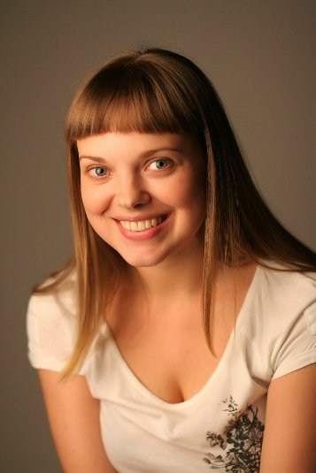

**ОКСАНА СУРНИНА**

<figure></figure>

Родилась 17 августа 1983 года в Ленинграде. В 2004 году окончила СПбГАТИ , курс В.В.Петрова. Снималась в фильмах: «Ветка сирени», «Холмы и равнины», «В сторону от войны», «Робинзон» и др. Так же очень много работает на озвучании и дубляже русского и зарубежного кино.

С 2007 года актриса Санкт-Петербургского государственного драматического театра «КОМЕДИАНТЫ» .

Занята в спектаклях:

<a href="42-volki-i-ovci.html">«Волки и овцы» </a>А.Островский - роль Евлампия Николаевна Купавина

<a href="39-beda-ot-neghnogo-serdca.html">«Беда от нежного сердца»</a> В.Соллогуб - роль Катенька

<a href="41-v-paris.html">«В Париж!»</a> А.П.Чехов - роль Лёля

<a href="74-kot-v-sapogah.html">«Кот в сапогах»</a> Г. Сапгир - роль Принцесса

<a href="147-karlson.html">«Карлсон»</a> А.Линдгрен - роль Мама

<a href="43-dachnici.html">«Дачницы»</a> В.Карасёв - роль Внучка

<figure></figure>

