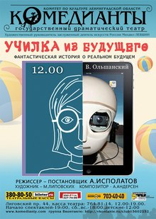

**Театральный фестиваль "ДВОРЦЫ Санкт-Петербурга - ДЕТЯМ" отмечает свой двадцатилетний юбилей!**

Юбилейный фестиваль принесёт немало сюрпризов. В этом году в его программе появится новый для петербургской публики жанр интерактивной экскурсии. В день открытия фестиваля в музее Г.Р. Державина состоится концерт-викторина « Музыкальная шкатулка». Юным зрителям предстоит увлекательное знакомство в игровой форме с классической музыкой — премудрости музыкальных наук они будут постигать вместе с клоуном Дин-Доном. Знакомство с миром литературы и поэзии произойдет в музее Блока: ребята « проживут» один день из детства писателя, увидят его детские рисунки, созданные им рукописные книги и журналы, услышат первые стихи поэта и посмотрят

<figure></figure>

кукольный спектакль « Би-бо- про Сашу Блока». Мероприятия фестиваля пройдут также в Русском музее и Музее театрального и музыкального искусства, в Театре марионеток им. Е.С. Деммени. Торжественное закрытие фестиваля состоится на сцене Драматического театра « Комедианты», где для ребят школьного возраста будет показан премьерный спектакль по пьесе В. Ольшанского « Училка из будущего». И, конечно, по традиции, гостей фестиваля ожидают вкусные призы и подарки!

_Фестиваль «Дворцы Санкт-Петербурга — детям» проводится ежегодно, с 1991 года, по инициативе художественного руководителя театра «Комедианты», заслуженного деятеля искусств России Михаила Левшина, при поддержке Правительства Ленинградской области. Этот проект, адресованный прежде всего воспитанникам детских домов_

<figure></figure>

_и детям из неблагополучных семей, уникален тем, что объединяет в одно целое сценическое действие и знакомство с памятниками архитектуры Петербурга. Фестивальная программа идёт на сценических площадках дворцов и музеев города. Юный зритель получает не только уникальную возможность ознакомиться с историей шедевров городской архитектуры, связанными с ними яркими страницами прошлого, но и яркие незабываемые впечатления от спектаклей. Помимо спектаклей и экскурсий в рамках проекта проводятся творческие встречи артистов со зрителями, конференции, мастер-классы. Уже 20 лет фестиваль даёт детям, попавшим в сложную жизненную ситуацию, возможность прикоснуться к прекрасному, найти новых друзей и получить положительные эмоции._

Ежемесячный журнал для детей "МУРЗИЛКА" / 26.10.2011 /

<a href="murzilka.org/home/news/4265">Ссылка на статью</a>

