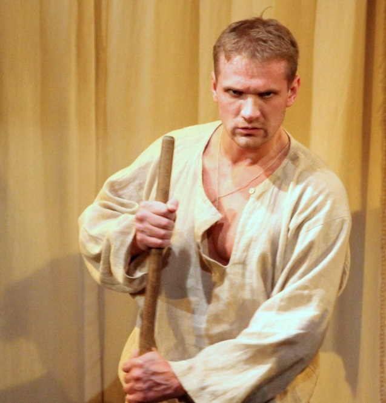

**Крепостное право на фоне "МуМу", или что сказал Герасим…**

Хорошо, что на 150-летний юбилей отмены крепостного права президент Медведев не освятил своим присутствием открытие очередного уродливого новодела. Наподобие монумента отцу русской демократии Ельцину в Екатеринбурге, на котором, если говорить о художественных достоинствах, так и просится надпись: «Ося-Кисе».

СМИ писали о беспрецедентных мерах безопасности, которыми была отмечена скромная научная конференция, посвященная манифесту «О Всемилостивейшем даровании крепостным людям прав состояния свободных сельских обывателей». Но в суете актуальной политики мало кто задался вопросом: а есть ли что праздновать?

Где мы теперь? Изжили ли из себя холопско–барскую психологию, самодурство, липкий, путающий мысли страх угодить, предугадать желание тех, кто право имеет? Или так и движемся по кругу подчинение-восстание-смутное время-подчинение-восстание?

Вот петербургский театр «Комедианты» как раз в эти дни показал премьеру 

<figure></figure>

спектакля по тургеневскому рассказу <a href="46-mumu.html">«Муму»</a>. Интересно, что с юбилеем премьера совпала случайно – или по иронии судьбы, если угодно. Спектакль готовился два года – по причине нехватки денег. Дело в том, что «Комедианты» находятся в ведении правительства Ленинградской области, которое спит и видит, как сбросить с себя обузу финансирования театров. Артисты здесь получают по 10 тысяч (что гораздо ниже вознаграждения даже самого скромного областного чиновника), а деньги на костюмы и постановку театр должен искать сам. В общем, крепостной театр, причем в имении у барина, который искусство Мельпомены в гробу видел.

Вот мяч попинать – другое дело, тут удовольствие понятное. Времена Сергея Мироновича Кирова давно прошли, и наши руководители в театры ходят только, когда не отвертеться. А через какие пытки они проходят, сопровождая какого-нибудь бундесканцлера в Мариинку и слушая Вагнера или Шостаковича, и подумать страшно. Наверное, твердят про себя: «не спать, замерзнешь»…

В отличие от Герасима, современная российская драма многословна и бесчувственна. Но театр, который показывают «Комедианты» - совершенно другой, такой, каким он мог бы быть, каким он должен быть. Актеры «Комедиантов» играют спектакль на одном дыхании, играют очень музыкально, словно песню без слов (хотя есть здесь и песни, и слова).

Известная каждому история про деспотичную барыню, которая заставила немого дворника Герасима убить самое дорогое тому существо, прозвучала у «Комедиантов» совершенно по-новому. Проще всего было изобразить помещицу взбалмошной, жестокой мучительницей. Но постановщик и художественный руководитель театра **Михаил Левшин**, похоже, задал себе вопрос: а если помещица - добрая барыня, которая уверена, что заботится о благе опекаемого ею народа?

Суд барыни (актриса <a href="89-olga-yakovleva.html">**Ольга Яковлева**</a>) строг, но справедлив: пьяниц – сечь, Герасиму, который поймал воров – награду, провинившуюся девку – срочно замуж. Жестко? А как иначе с селянами, которых так и тянет к бутылке? Правовое государство!

Таких, как барыня, в сегодняшней России немало, от Кремля до кабинета директора бани в какой-нибудь Заманиловке. И разговаривают наши боссы так же, как в спектакле – картинными взглядами и междометиями. Помните, как посмотрел Путин на Дерипаску, когда тот ему ручку не отдал? Из взглядов Путина можно составить альбом, который останется в веках как шедевр экспрессионизма.

<figure><imgalt="mymy_foto.4" src="images/stories/random/mymy_foto.4.jpg" /></figure>

Барыня любит народные песни, пляски и забавы – и как благодарным селянам не петь и не танцевать, когда у них такая любящая их хозяйка? Вместе с девками она по-простому ходит в баню – как наши теперешние руководители отстаивают в церкви рядом с простым народом (ну, не совсем рядом, на спецместах, поближе к алтарю).

Вот только за этими народными попевками, плясками и гуляниями стоит страх – страх, атмосфера которого без единого слова передана в спектакле. Страх, который и крутит колесики машинки с марионетками-дворовыми, которые пытаются угадать желания барыни. Гамлет сказал, что на человеке нельзя играть, как на флейте – шутишь, еще как можно! Какой оркестр можно составить, если правильно подойти!

Можно было тогда, можно и сейчас – просто технологии меняются. В Российской империи орудием управления и контроля была церковь и крестьянская община, в теперешней РФ церковь уступила место телевидению, а крестьянский вопрос решен, кажется, окончательно: крестьян в прямом смысле пустили по миру.

Пусть реформы сверху (и тогда, и сегодня) без меры мучают народ, но ведь все для его же блага. Думали же как лучше – и кабы народ еще попался подходящий, была бы в Заманиловке Силиконовая долина! Но народ не понимает своего счастья. Что? На каждом шагу унижается его достоинство?

Какое достоинство? Он же не умеет чувствовать. Какое достоинство может быть у бомжа, одного из тех, кого нынешний мэр Читы Анатолий Михалев предложил отстреливать? У женщины, которая пришла в собес за детским пособием? У шахтера или моряка, ожидающего зарплаты за прошлый год? У найденного лишним офицера, уволенного из армии по сокращению? Сказано - собрать в трехдневный срок манатки и с семьей на выход!

Так вот, <a href="46-mumu.html">«Муму»</a> - как раз история о человеческом достоинстве, и <a href="21-fillipp-azarov.html">**Филипп Азаров**</a> (Герасим) создает образ тонко чувствующего, отзывчивого, я бы сказал, рафинированного человека. Достоинство и страх – вещи несовместные, и в тех условиях, в которые поставлен Герасим, он обречен. Обречен – но не терпит поражение, а даже в последнем унижении доказывает, что он человек.

Вечный русский вопрос: «Почему Герасим утопил Муму, почему не ушел вместе с ней»? Не ушел - как раз из чувства собственного достоинства. Так римские сенаторы бросались на меч и закалывали друг друга, не желая тешить Калигулу.

Калигула, желающий зла, отличается от Калигулы, желающего добра, разве что меньшей степенью лицемерия. «Я же не приказывала утопить Муму, я только спросила: разве вам какая-то собачонка дороже здоровья барыни?» - звучит в конце запись в помещичьем блоге.

«Мы не хотим, чтобы мамы в России из нужды убивали своих детей, но сокращение расходов и бюджетная стабилизация – главные приоритеты, бла-бла-бла»…

_Игорь ШНУРЕНКО_

<figure></figure>

газета "Деловой Петербург"/ 05.03.2011 / журналист Игорь Шнуренко

<a href="http://www.dp.ru/a/2011/03/04/Krepostnoe_pravo_nafone">Ссылка на статью</a>

