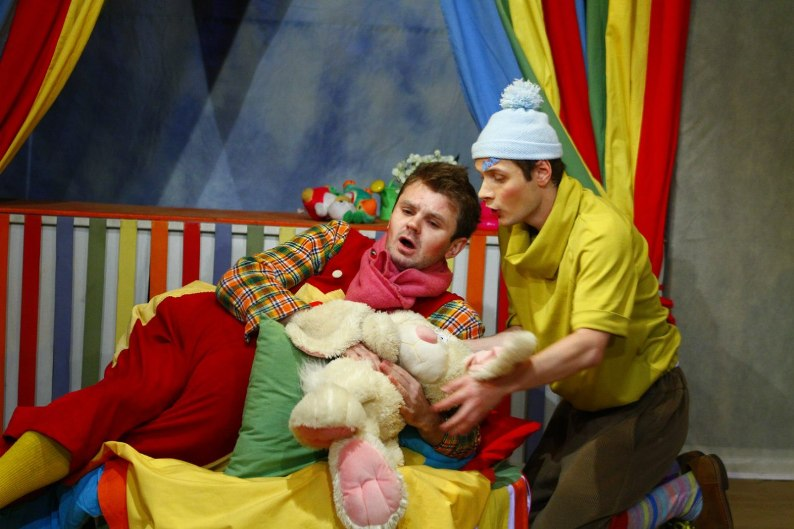
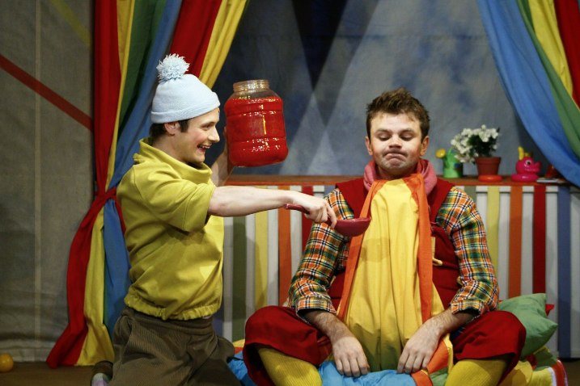
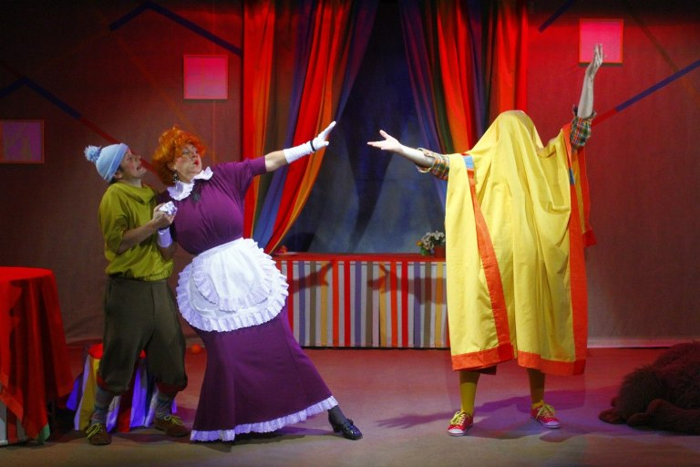
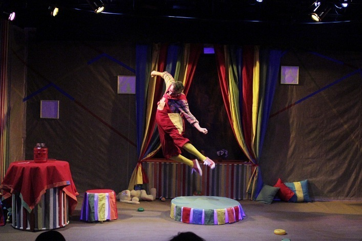

**Астрид Линдгрен**

**«КАРЛСОН» 0+**

Пересказка по мотивам повести Астрид Линдгрен_._

Художественный руководитель постановки: Заслуженный деятель искусств России <a href="153-mihail-levshin.html">Михаил ЛЕВШИН</a>

Режиссёр: Светлана СУХАНОВА (дебют)

Художники-постановщики: Надежда ОСИПОВА, Оксана СТОЛБИНСКАЯ.

Музыка: Сергей ХАЙЛОВ.

В спектакле звучат песни на слова и музыку Нины ТАРАСОВОЙ в аранжировке Юрия БАЛАКШИНА .

В одном самом обыкновенном городе, в самой обыкновенной семье, жил-был самый обыкновенный Малыш. И у него были чудесные Папа и Мама, которые его очень любили. Но, к сожалению, Папа и Мама были настолько погружены в свои взрослые заботы, что Малыш частенько чувствовал себя очень одиноким. Так бы оно всё и продолжалось, если бы в один из самых обыкновенных дней не началась самая необыкновенная в жизни Малыша история - знакомство с бедокуром и озорником Карлсоном, который живёт на крыше! Вот уже много-много лет затейливый чудак Карлсон прилетает на помощь к тем детям, которым так не хватает внимания и понимания взрослых. Свидетелем и соучастником одной из таких историй станет наш зритель - на этот раз сказка Астрид Линдгрен прозвучит в пересказе артистов театра «Комедианты». Малыш, у которого много разноцветных игрушек, но нет настоящего друга; деловые Мама и Папа; весельчак Карлсон и уморительная Фрекен Бок… Актёры театра «Комедианты» разыграют перед зрителем знакомый и любимый всеми сюжет - с новыми акцентами и интонациями. Спектакль полон ярких красок, озорного юмора, музыки и танцев. Специально для спектакля написаны замечательные песни.

Зрителей ожидает чудесная история о дружбе и волшебстве, созданная как для малышей, так и для их родителей, которые ещё не забыли о том, что сами когда-то были детьми.

Призы и награды:

Светлана СУХАНОВАполучила премию и диплом ХХI фестиваля "Театры Санкт-Петербурга - детям" в номинации "Лучший режиссёрский дебют" за постановку спектакля "КАРЛСОН". (2012)

<a href="50-roman-pritula.html">Роман ПРИТУЛА </a> получил премию и диплом ХХI фестиваля "Театры Санкт-Петербурга - детям" в номинации "Лучший дебют" за роль Карлсона. (2012)

В спектакле заняты:

Карлсон - <a href="50-roman-pritula.html">Роман ПРИТУЛА</a>

Малыш - <a href="84-talashmanovevgenii.html">Евгений ТАЛАШМАНОВ</a>

Фрекен Бок - Заслуженный артист России <a href="27--gennadij-spiridenkov-za-rf.html">Геннадий СПИРИДЕНКОВ</a>

Фрекен Бок -<a href="23-belova-ekaterina.html">Екатерина БЕЛОВА</a>

Папа - <a href="67-leonid-zabkin.html">Леонид ЗЯБКИН</a> / <a href="83-bezryk-ilya.html">Илья БЕЗРУК</a>

Мама - <a href="85-oksana-surnina.html">Оксана СУРНИНА</a> / <a href="301-mariaosipova.html">Мария ОСИПОВА</a>

Пресса о спектакле "Карлсон":

<a href="273-karlsonpriletel-vo-vsevologsk.html">"Карлсон, который прилетел во Всеволожск" (газета "Всеволожские вести" №27 (1846)17.04.13) (автор: В.Демянская) </a>

<a href="47-y-kajdogo-svoi-karlson.html">- "У каждого из нас свой КАРЛСОН… " о ПРЕМЬЕРЕ спектакля рассказывает исполнитель роли</a><a href="47-y-kajdogo-svoi-karlson.html">Карлсона - Роман ПРИТУЛА. (газета "ВЕСТИ") (автор:Лейла Галактионова)</a>

<figure>{youtube:www.youtube.com/watch?v=j5ko5TxBnn0&amp;feature=related 480 353}</figure>

<figure></figure>

<figure></figure>

<figure></figure>

<figure></figure>

<figure></figure>

<figure></figure>

<figure></figure>

<figure></figure>

<figure></figure>

Спектакль идёт **1** час **5** мин. без антракта.

Премьера спектакля состоялась **11** декабря **2011** года.

