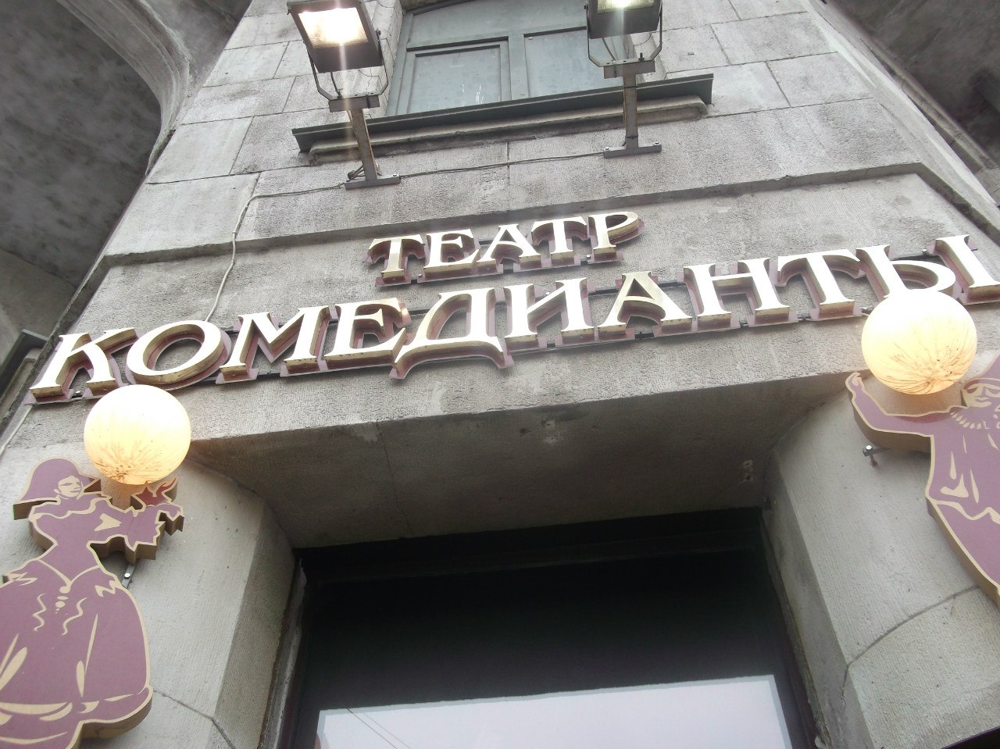

**История Санкт-Петербургского Государственного драматического театра "КОМЕДИАНТЫ"**

<figure></figure>

История нашего театра началась в конце 80-х годов, когда в Молодежном центре Ленинского района образовалась небольшая труппа из шести человек под руководством Михаила Левшина. Первым спектаклем молодого актерского коллектива стала комедия классика итальянской драматургии Эдуардо де Филиппо «Страсти по-итальянски». Спектакль состоял из 3-х маленьких пьес, которые разыгрывали перед зрителями бродячие комедианты. Искрометный юмор, обаяние,

<figure></figure>

жизнерадостность, а главное мастерство юных артистов сразу завоевали любовь зрителей. С тех пор, если быть точными, то с 25-го декабря 1989 года, в Санкт-Петербурге появился новый драматический театр - «Комедианты». Спектакль «Страсти по-итальянски» стал визитной карточкой труппы и с успехом идёт и сейчас. В 2009 г. нам исполнилось 20 лет. А эмблемой и символом театра с тех самых пор является маленькая фигурка комедианта, так издревле называли бродячего артиста любых жанров.

Первые несколько лет театр скитался по разным площадкам города и области, пока в 1993 году артисты не получили помещение в здании известном как «дом Перцова» на Лиговском проспекте. Зал театра невелик – всего 100 мест, но именно это дает нам возможность быть ближе к тем, для кого мы создали театр – к нашим зрителям. В камерном театре на первый план выдвигается актерская индивидуальность, искусство переживания, здесь нельзя солгать или «перегнуть палку». И каждое произведение, будь то классика – основа репертуара театра, или современная драматургия, звучит здесь по-особому искренне.

Творческая программа художественного руководителя театра М.А. Левшина соединила в себе новаторский поиск в постановочных средствах, мизансценических решениях с развитием идей и традиций российского актёрского театра, где все выразительные средства сценического искусства аккомпанируют главному: актёрскому перевоплощению, психологической разработке роли, живому действенному способу существования. Наш зритель обязательно найдет спектакли любимых ему жанров – и водевили, и героические драмы, и лирические мелодрамы, и даже спектакль-романс, ну и, конечно же, комедии.

Театр не боится новых и экспериментальных форм. Так в 2009 году состоялась премьера спектакля «Прогулка в Лю-Блё» по пьесе молодого драматурга К. Рубиной. Спектакль прошёл в форме открытой репетиции. Цель эксперимента – дать возможность зрителю поучаствовать в процессе создания спектакля. Есть в репертуаре спектакли музыкальные, а в ноябре 2010 года успешно состоялась долгожданная премьера пластической драмы "МУМУ" по И.Тургеневу (новый эксперимент) – представлен чередой пластических этюдов. Музыкальным фоном режиссер избрал песни русского народного фольклора, которые исполнят артисты театра.

По утрам театр с радостью открывает двери и для маленьких зрителей - детей Петербурга и области. Особая гордость театра «Комедианты» - проведение благотворительного театрального фестиваля «Дворцы Санкт-Петербурга – детям». С

<figure></figure>

1992-го года мы каждую осень приглашаем детей-сирот Санкт-Петербурга и области в различные особняки и дворцы города, в интерьерах которых показывается специально выбранный в соответствии с интерьером, спектакль.

«Комедианты» много гастролируют по России и миру, являются лауреатами престижных российских и международных театральных фестивалей. В 2007 году экстравагантная комедия «В Париж!» по ранним рассказам А.П.Чехова представляла Санкт-Петербург на ежегодном Интернет-фестивале «Театральная паутина». В 2012 году спектакль "МуМу" (пластическая драма) учавствовал в "13 - ом Междунородном Черноморском театральном фестивале" в г.Трабзоне - Турция, где театр "Комедианты" с постановкой "МуМу" был единственным представителем России и был признан оргкомитетом фестиваля, во главе с его председателем, самым лучшим из всех представленных на фестивале театров из разных стран (Италия, Турция, Румыния, Австрия и др.) , спекталь получил приз фестиваля "Хрустальный Трабзон".

В разные годы спектакли театра были номинантами и лауреатами высшей театральной премии Санкт-Петербурга «Золотой софит», многократно становились участниками и дипломантами разных театральных фестивалей.

Сейчас в репертуаре театра идут 20 спектаклей по произведениям отечественной и мировой драматургии, представляющих широкое разнообразие жанров и эстетических направлений, для зрителей всех возрастных категорий. В камерном зале театра «Комедианты», всего сто мест, благодаря чему, создаётся домашняя и уютная атмосфера и зрители испытывают в театре особое эмоциональное воздействие атмосферы творчества, сопричастности к происходящему на сцене. Зачастую и сами зрители в некоторых спектаклях становятся актерами. В репертуаре театра,есть и классика: И.Тургенев, А. Пушкин, Н. Гоголь, А.Чехов, А. Островский, Э. Ростан, В. Шекспир, Л. Де Вега, Т.Уильямс, и произведения современных драматургов, как российских : С. Кочнев, В. Карасев, так и зарубежных : Дарио Фо, Э. де Филиппо.

Своим кредо «Комедианты» считают «искренность, доверие и любовь к публике и людям, неравнодушным к театру и искусству в целом».

<figure></figure>

_фото: Светлана Пь_

Санкт-Петербург 191040 Лиговский проспект, 44

2008 - 2014 © ТЕАТР «КОМЕДИАНТЫ»

<figure></figure>

