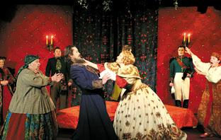

**Понедельник по традиции – день тяжелый. Однако для тех, кто пришел 15 февраля в Дом актера на Невском проспекте, чтобы чествовать юбиляра – Ленинградский областной театр «Комедианты», этот день оказался легким и теплым, несмотря на нешуточный мороз. Потому что зал тогда не мог вместить всех желающих поздравить любимый театр – лауреата престижных фестивалей – с 20-летием. Со сцены звучали добрые пожелания от друзей из Выборга, Лодейного Поля, а также представителей областного Правительства. Капустнику «Комедиантов» с пародиями, цыганскими мотивами и «приколами» аплодировали благодарные зрители из Ленинградской области и Санкт-Петербурга.**

<figure></figure>

АРТИСТ – НА ПЕРВОМ МЕСТЕ

В конце 1980-х годов началась история «Комедиантов».

— Тогда наш молодой актерский коллектив поставил итальянскую комедию «Страсти по-итальянски» (спектакль до сих пор в репертуаре), завоевавшую такую любовь зрителей, о которой мы и не мечтали. Теперь это визитная карточка труппы, – признается художественный руководитель театра, заслуженный деятель искусств России Михаил Левшин. – Останавливаться, как мы поняли, нельзя. Хотя до этого шесть лет я работал в Ленинграде режиссером в театре имени Ленинского комсомола, сейчас это «Балтийский дом», ставил спектакли в театре Комедии и Малом драматическом. Со «Страстями» мы поездили по Прибалтике, и расставаться уже не хотелось. Наконец, 20 лет назад мы пришли в Областное управление культуры к В.Пахомовой, и она в нас поверила. Потом уже вышел приказ о создании нового государственного учреждения культуры.

— Дать театру именно такое название – ваша идея?

— Да, давняя, потому что комедиантами издавна официально на Руси назывались актеры, бродячие артисты, а не те, кто играет комедии. Правда, в XYIII веке к ним «примазалось» ироническое значение: уже считалось, что комедиант не слишком серьезен, даже в словаре Даля упоминается в смысле «не очень хороший артист». Вот мы и решили вернуть первоначальное значение. Таким образом, в «переводе» наш театр называется «Актеры», что было бы странно. А «Комедианты» – название хорошее, веселое.

Вы же знаете, что есть в Петербурге театр «Приют комедианта», но приют – это место, а комедианты – это люди. Получилась другая идея. Все у нас строится на актере. Существует немало примеров, когда художественный язык связан с другими средствами выразительности: свет, звук, пластика и декорации … и внутри всего этого находится артист. А у нас он на первом месте, все остальное сопровождает его творчество.

ПЕРВЫЙ ОПЫТ – ХИМТИМ

— Михаил Александрович, хотя вниманием публики и критики ваш театр не обижен, о вашей судьбе знают мало. Расскажите о себе. Из какой вы семьи?

— Я питерский. Родители были инженерами-автодорожниками, то есть с театром никак не связаны. Отец работал начальником транспортного цеха. Во время войны мы уехали в эвакуацию в Омск, потом вернулись сюда…

Помню, как в 5 классе я ждал того дня, когда пойду в ТЮЗ: билет держал даже под подушкой. Атмосфера театра буквально завораживала, и специально меня к театральному искусству никто не приучал, видимо, было уже что-то заложено. А когда я посмотрел фильм с Райкиным «Мы с вами где-то встречались», то немедленно стал воспроизводить его роль: показывал и дома, и ребятам в гостях. Сидела во мне вот такая «бацилла» – безумно тянуло к лицедейству еще со школы. Придумывал разные смешные номера, выступал с ними, читал басни от разных лиц…

Потом – Лесотехническая академия, где я, в общем-то, не учился, а занимался самодеятельностью. Преподаватели на экзамене спрашивали, что я делал, к примеру, на недавнем вечере, и я тут же импровизировал. Они смеялись и ставили мне оценки. Кто был построже, приходилось, конечно, учить, но в принципе все сходило с рук. Там на 3 курсе я создал факультетский театр ХИМТИМ, то есть Химический театр интермедий и миниатюр. До сих пор помню студенческие обозрения, могу процитировать наши спектакли в стихах, к примеру, про действующие лица элементов таблицы Менделеева.

Позже поехал в Министерство, ведь три года надо было отрабатывать, но все-таки, видя иные мои склонности, отпустили. И поступил я на 1 курс режиссерского отделения Театрального института (ЛГИТМиК), курс А.А.Музиля – известная театральная фамилия, он был режиссером Александринки, преподавал у нас А.И.Кацман, пускали, конечно, и на занятия к Товстоногову. Атмосфера была интереснейшая, творческая.

БУДЬТЕ КАК ДОМА

— Но когда вы мечтали о своем театре, то, вероятно, не думали, что будет он вмещать всего-то сотню зрителей?

— Знаете, у меня «сидело» где-то внутри, что театр должен быть небольшим, потому что важным казался феномен малого пространства, ведь небольшой театр – это интимная атмосфера, актер крупным планом, настоящее драматическое проживание. Сюда приходили разные известные режиссеры, и один из них сказал: «Вот маленький французский театр – моя мечта». То есть желание работать именно так было не только у меня.

Сейчас-то я, может быть, и не против большого помещения. На гастролях мы играем на больших сценах, и некоторые спектакли приобретают новое звучание. Иногда хочется другого пространства. Но поймите, что мы создаем особый театр. Это наша судьба, и мы счастливы. Вот выхожу я кланяться и вижу глаза зрителей, физически чувствую их состояние. Здесь – ощущение гостиной, а в большом зале – некой массы зрителей.

— В репертуаре «Комедиантов» всегда была классика, пьесы современных и зарубежных драматургов, водевили, мелодрамы…Такая широкая «амплитуда колебаний» и сегодня необходима?

— Безусловно. Пусть зритель выбирает. Да и артистам это интересно. А вообще-то, в основном, у нас классика. Существует же инерция отношения к ней: будто это что-то тяжеловесное, скучное. А мы стараемся зрителей разубедить. К примеру, идет у нас спектакль «Записные книжки Тригорина» – Т.Уильямс написал свою версию по пьесе Чехова «Чайка». Зритель на «нашу» классику идет.

ЛЮБИМЫЕ ДЕТИ

— Один петербургский режиссер в интервью говорил мне, что у него собрались люди особой группы крови. Что вы можете сказать о труппе своего театра?

— Какие красивые слова…У меня собралась команда, которой я очень доволен. Труппа сложилась, пусть она такой и будет. Идет, правда, небольшое пополнение, некоторое движение существует всегда. И есть те, кто работает здесь давно и занят в репертуаре: Максим Сергеев, Алексей Исполатов, Валерий Полетаев, Вадим Прохоров, заслуженная артистка России Нина Мещанинова, Лариса Климова. Зрители посмотрели в дни празднования юбилея их бенефисы. Хотя издавна средства, собранные от бенефиса артиста, шли в его пользу, у нас они идут на пользу

театра … Удивляюсь, как мы выкручиваемся?

Моя труппа – дети, которых надо любить. Система отношений у нас – как у отца и детей. А любимых детей, конечно, надо уметь и любить, и наказывать…

— Зрители ваш театр называют домашним, настоящим очагом культуры, критики отмечают развитие лучших традиций русского психологического театра, происходящее на сцене трактуют как человековедение. Можно ли сказать, что зрители оправдывают ваши ожидания?

— Можно. У нас есть книга отзывов – наша главная поддержка… Вот нас поздравил с юбилеем глава Союза театральных деятелей Александр Калягин. Там примерно такие строки: «Мы знаем, как непросто, сохраняя русский психологический театр, соединять его с экспериментом или новой формой. Но тем не менее вам это удается».

Есть у театра и награды. Так, заслуженный артист России Виктор Костецкий за роль Дорна («Записные книжки Тригорина») стал лауреатом петербургской премии «Золотой софит».

ОСОБЕННЫЙ ЗРИТЕЛЬ

— Как складываются ваши отношения со зрителями из Ленинградской области?

— Складываются хорошо. Нас давно знают и ждут. Теперь у нас есть прекрасный импортный автобус для таких поездок (благодаря встрече с Губернатором). В конце минувшего года мы ездили в Лодейное Поле, играли «Чайку», «Венецианского купца» возили в Кириши… Все спектакли воспринимаются зрителями области с благодарностью, просто прекрасно. Просят приезжать еще. И мы едем с удовольствием, привозим и детские спектакли.

— В каких городах и весях знают ваш театр? И куда вы любите приезжать?

— Знают нас, кажется, повсюду. Вот скоро поедем в Пикалево, где давно не были, повезем Островского («Волки и овцы»). Периодически выбираемся в Лугу, Кириши, Выборг, Приозерск, Тихвин… Вот посмотрите нашу афишу на март: в Подпорожье везем старинный русский водевиль «Беда от нежного сердца», в Лугу – фарс в двойном ключе «Не всякий вор – грабитель», в Светогорск – фарс-детектив «Дачницы», в Сланцы – комедию «Дурочка», в Выборг – «Провинциальные анекдоты».

А приезжать мы любим больше всего в Лодейное Поле. Просто так сложилось. Там живут наши друзья. У них есть замечательный профессиональный театр «Апрель», про который надо непременно писать. Мы давно с ним подружились.

Но пусть не обижаются другие зрители: мы рады видеть всех и с удовольствием, повторяю, приезжаем в любой город.

— Более 15 лет вы проводите благотворительный театральный фестиваль «Дворцы Санкт-Петербурга – детям»

<figure></figure>

для детей-сирот и воспитанников детских домов и школ-интернатов области. Зачем вам это нужно?

— Для их душевной поддержки, конечно. Когда идет по улице потерянный ребенок и плачет, вы же ему поможете найти маму? Зачем это нужно? Потому что после этого легче на душе. В разных дворцах мы играем для наших детей из Ленинградской области. Находим спонсоров для небольших подарочков…

— Какое время было лучшим в вашей режиссерской биографии?

— Думаю, что все-таки сейчас лучшее время для творчества. Вот если мы выпустим «Му-му» в этом сезо не, то будет совсем хорошо. Хотя в смысле финансов…

— А как помогает вам Правительство Ленинградской области?

— Все знают, что кризис продолжается, коснулся он, разумеется, и театров. Но мы верим, что преодолеем его с помощью Правительства, что оно понимает, как важна культура и театр. Чего уж скрывать, сейчас для театра нелучшие времена. Деньги выделяются нам только на зарплату. На противопожарную безопасность средства дали немалые. А на спектакли, костюмы, отопление средства нужны тоже. Скажите, как при нашем небольшом зале прожить? Раньше помощь была более существенной. Но мы верим, что это временный этап. Хотелось бы хоть иногда творческой интеллигенции встречаться с Губернатором, потому что ничто не заменит живого общения.

БЕНЕФИС НА БИС!

Для любого артиста во все времена бенефис – как награда. В рамках юбилейных торжеств, посвященных 20-летию «Комедиантов», в театре прошла Неделя бенефисов его ведущих артистов. Причем каждому бенефицианту М.А. Левшин вручал фигурку комедианта – своеобразного театрального Оскара.

Мне довелось побывать на двух бенефисных спектаклях – классическом и современном. Бессмертная гоголевская «Женитьба» здесь – круговерть колоритных персонажей, на чьи чуть ли не каждые реплики сразу же следует сочувствующий отклик зала. Бенефис Валерия Полетаева в спектакле из золотого фонда мировой классики – звездный час актера с огромным потенциалом и невероятной пластикой. Его капризный и мнительный барин (Подколесин, конечно) точен и ве-ли-ко-ле-пен. После комедии уходишь с ощущением, что другого Подколесина уже и представить себе невозможно.

Комедия «Прогулка в ЛЮ – БЛЕ» (бенефис Вадима Прохорова) заявлена как актерские импровизации в присутствии режиссера. Однако «пугаться» этого не стоит: никакого занудства нет. Зрители впервые попадают еще и на некоторые мгновения репетиции. Действие порой на секунды останавливается и повторяется по-иному после вмешательства режиссера.

Еще до начала спектакля Вадим ответил на вопросы «Вестей»:

— Служу я в этом театре уже 15 лет. Учился в Театральном институте на Моховой у А.Н.Куницына и Г.А.Барышевой. На 2-м курсе познакомился с режиссерами курса В.С.Голикова, где преподавал М.А.Левшин. Он увидел меня в некоторых работах, потом наблюдал и пригласил на главную роль в спектакле «Граф Нулин» (по Пушкину). Для меня, мальчишки – поступил-то я в 16 лет, в 20 уже закончил – вдруг главная роль! Позже было два предложения: Москва, театр «Современник» Г.Б.Волчек и Санкт-Петербург, М.А Левшин. Но так как не получилось в Москве – а для меня-то получилось, потому что, вероятно, нужно было пройти путь ученика, чтобы, может быть, теперь сыграть свой бенефис – то я появился здесь.

А.Н. Куницын говорил: «Всегда будьте честными, предельно искренними и разговаривайте по-человечески». Это меня как раз и привлекло в театре «Комедианты». Здесь я пытаюсь оставаться самим собой. Это мой дом, моя любимая семья…

Моей мечтой была роль Треплева. В «Записных книжках Тригорина» (интерпретация чеховской «Чайки» Т. Уильямса) она осуществилась, потому что «Чайка» со студенческих лет для меня была камертоном человеческих отношений. Я сыграл Треплева, и на гастролях в Москве переводчик с английского В.Вульф сказал немало хороших слов не только о моей роли, но и о спектакле в целом.

О чем еще я мечтаю? О роли Чацкого. Может быть, когда-нибудь сыграю Звездича в «Маскараде», а потом Арбенина. Безусловно, моя мечта – это и роль князя Мышкина в «Идиоте»…

Чем дорога «Прогулка в ЛЮ-БЛЕ»? Мой персонаж – герой современный, живой человек, который настолько хочет быть любимым (а кто-то разбил его сердце), что защищается цинизмом, прибаутками, но при этом надеется полюбить вновь и скоро теряет голову, влюбляется как мальчишка… Для меня эта роль – подарок. Как только появилась Катя Рубина (автор, драматург из Москвы) с этой пьесой (2-я премия на всероссийском конкурсе), мы сразу в пьесу влюбились.

Добавим от себя, что в забавной пьесе об одиночестве и эгоизме, надежде и любви актерский ансамбль достоин высшей оценки. А герой Вадима Прохорова покоряет видимой легкостью отношения к жизни и ироничностью, неповторимым обаянием и трогательностью. Это живой и как будто знакомый тип нашего современника. Конечно же, все сомнения и тревоги здесь разрешаются благополучно. Словом, сказка, которая всем нам сегодня нужна. Хоть поверьте – хоть проверьте.

Ирина КОРОЛЕВА

Газета ленинградской области "Вести" / 25.02.10 / автор: И.Королёва

<a href="http://www.vesty.spb.ru/modules.php?name=News&amp;file=article&amp;sid=17604">ссылка на статью</a>

