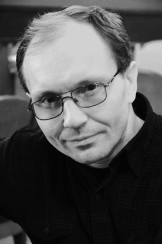

**СЕРГЕЙ БЛЕДНЫХ**

<figure></figure>

Родился 12 ноября 1964 года в городе Львове. В 1989 году окончил Львовское театральное училище при театре им. Марии Заньковецкой, учился в Литературном институте Москвы. Работал в Львовском кукольном театре. Снимался в фильмах: т/с «Улицы разбитых фонарей», «Катерина.Возвращение любви», т/с «Литейный», «Предел. Кровь с молоком», «Любовь под грифом "Совершенно секретно" - 3» и др.

С 2004 года актёр Санкт-Петербургского государственного драматического театра «КОМЕДИАНТЫ».

Занят в спектаклях:

<a href="42-volki-i-ovci.html">«Волки и овцы»</a> А.Островский - роль Беркутов Василий Иванович

<a href="46-mumu.html">«Крепостная любовь» (МуМу)</a> И.Тургенев - роль Гаврила

<a href="71-anekdoti.html">«Провинциальные анекдоты»</a> А. Вампилов - роль Рукосуев (врач)

<a href="41-v-paris.html">«В Париж!»</a> А.П.Чехов - роль Лампадкин, чиновник

<a href="43-dachnici.html">«Дачницы»</a> В. Карасёв

<a href="90-ychilka.html">«Училка из будущего»</a> В.Ольшанский - роль Папа (Джон Трайвер)

<figure></figure>

