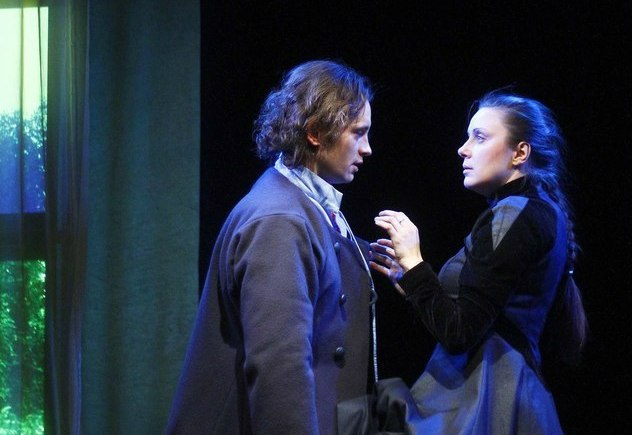

**ПЁТР и АКСИНЬЯ**

**

<figure></figure>

**

**Журналист:** Хочется спросить, как для Вас начиналась работа над этим спектаклем.

**Юлия Бурцева:** На сборе труппы нам сказали, что будет ставиться спектакль Лес, он будет музыкальный. В роли Аксиньи будет Юлия Бурцева…

**Виталий Кравченко:** Ерунда, что мы однокурсники, друг друга уже знаем много лет, а играть любовь.

**Журналист:** И как оно играется?

**Юлия Бурцева:** Прекрасно. Очень хорошо.

**Виталий Кравченко**: Спасибо мастерам, педагогам.

**Журналист:** Вы ученики одного мастера? А кто Ваш мастер?

**Юлия Бурцева:** Шведерский Анатолий Самойлович.

**Журналист:** И всё-таки со знакомым человеком легче играется?

**Виталий Кравченко:** Не знаю как ей, мне - да, гораздо.

**Юлия Бурцева:** Наверное, да.

**Журналист:** Сегодня какой был спектакль?

**Юлия Бурцева:** Тяжёлый.

**Журналист:** С чем это связано?

**Юлия Бурцева:** Не знаю. Так как у нас маленький зал и зритель очень близко, очень много зависит от восприятия зрителя. Мне кажется, что у нас единственный театр, который качает зал…

**Виталий Кравченко:** Или зал качает нас.

**Юлия Бурцева:** Да. Сегодня был достаточно странный, тяжёлый зал, на мой взгляд. Мы сыграли только два спектакля и прошлый, 15-го числа был на много легче. Зал смеялся, он начал смеяться почти сразу, реагировал и мы… понеслись.

**Виталий Кравченко:** Дело даже не в смехе, а дыхание зала - чувствуется отдача, и понимаешь - туда или не туда.

**Юлия Бурцева:** Сегодня зал был тяжелей. Может быть это связано с тем, что педагоги пришли, что какая-то ответственность…

**Журналист:** Какая это Ваша по счёту роль?

**Юлия Бурцева:** Не знаю, я не считала. У нас много ролей. Чем у нас хорошо, тем, что ты приходишь, молодой артист, и ты можешь играть, сколько тебе влезет. Куда хочешь вводиться. Можешь подойти к режиссёру и сказать: - Знаете, я хочу ввестись в этот спектакль. Он говорит: - Ну, попробуй. И ролей очень много, разных.

**Виталий Кравченко:** А что, можно было?

**Юлия Бурцева:** А ты не знал?

**Журналист:** Вы такой на сцене лирический, упёртый в одну единственную идею этой девушки, на которой вы хотите жениться.

**Виталий Кравченко:** Кажется, об этом как раз и история наша, что надо «переломить» отца и , несмотря на все препятствия, бороться за счастье.

**Журналист:** В отрицательных ролях актёры ищут что-то положительное. У Вас положительная роль, а есть ли в нём что-нибудь отрицательное?

**Виталий Кравченко:** Самая отрицательная черта та, которую озвучивает отец вначале: - Сынок - овца овцой. Когда нужно бороться… Здесь, мне кажется, Островский молодец, что он настолько это прописал. В принципе, в первой редакции Леса персонажа Петра не было.

**Журналист:** А Аксинья действительно решилась покончить счёты с жизнью?

**Юлия Бурцева:** Да, действительно. Иначе это ничего не стоит.

**Виталий Кравченко:** Иначе она одна из этих…

**Юлия Бурцева:** Иначе, она - одна из них, из этих масок. Так построен спектакль: есть маски, люди, которые живут по одним канонам и люди, которые живут по другим канонам. И мы, Пётр и Аксинья, Несчастливцев, Счастливцев, мы честные. Если мы топимся, то топимся; если любим, так любим. Мы должны быть положительные. У нас могут быть отрицательные качества…

**Виталий Кравченко:** С ними нужно бороться.

**Юлия Бурцева:** Может быть это трусость, может быть где-то малодушие, слабость, но мы с ними боремся, иначе не будет контраста, потому что они с ними не борются… И об этом был спектакль. По крайней мере, я думаю, что он должен быть об этом.

**Журналист:** Спасибо.

Театральный видеожурнал "Подмостки в Петербурге" / 6 января 2013 г.

<a href="http://theatre.inspb.ru/Interviews_with_the_actors/292.html">ссылка на статью (видео)</a>

