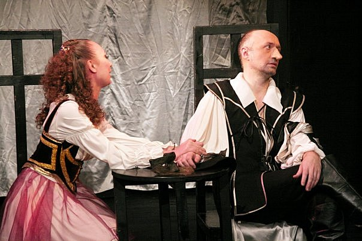

<figure></figure>

**Э. Ростан. «Сирано де Бержерак». Театр «Комедианты». Режиссер Михаил Левшин, художник Александр Орлов**

Снова «Комедианты». Спектакль «Сирано де Бержерак» идет уже 10 лет, но жив. Маленькая сцена театра использована с умом и со вкусом. Легкие занавеси, несколько стульев, две ложи, обвитые какой-то искусственной растительностью и театральные маски на стенах. А. Шимко очень хорош в роли Сирано. У него замечательно выразительные, умные, злые глаза. Он, действительно, гениальный поэт, «бретер и забияка». Он непритворно любит. Тут, правда, начинаешь сомневаться в его уме. Потому что такую Роксану такой Сирано любить как будто не должен. Она красивая, но дура. Роксана, а не актриса Е. Культина. Про актрису понять что-либо трудно, кроме того, что она очень гордится своими волосами.

Спектакль не неприятный, но многое обескураживает. Например, в программке указан перевод Щепкиной-Куперник, а добрую половину текста, произносимого со сцены, составляет перевод В. Соловьева. Многие персонажи вымараны, а их текст отдан другим. Например, Сирано в начале устраивает взбучку не бездарному актеру Монфлери, а доброму Рагно, который пробует себя на сцене. О том, что Сирано пишет Роксане письма вместо Кристиана, знают все, ну, то есть Ле Бре и Рагно, которые здесь постоянно рядом с поэтом. Сирано в этом спектакле вовсе не одинок. Де Гиш не мерзавец. Роксана, опять же, простите, дура. Но стихи прекрасные. И актеры, особенно Шимко, умеют их красиво и осмысленно читать. И хотя «режиссерский крой» остался мне лично неясен, спектакль произвел хорошее впечатление, прежде всего, потому, что спустя 10 лет его все еще играют искренне, страстно, с полной отдачей, без усталости и цинизма. В театре подобные случаи — огромная редкость.

Вывод.

Новое задание «Петербургского театрального журнала» оказалось для меня крайне полезным. Я поняла, во-первых, что я безнадежный интеллектуальный сноб, во-вторых, что реальный театр это не то, что я думала раньше, и, в-третьих, что моя профессия народу в принципе не нужна. Ему и без меня в театре хорошо. А уж актерам с режиссерами и подавно.

Екатерина Гороховская

"Петербургский театральный журнал" №1 (47) 2007 г.

