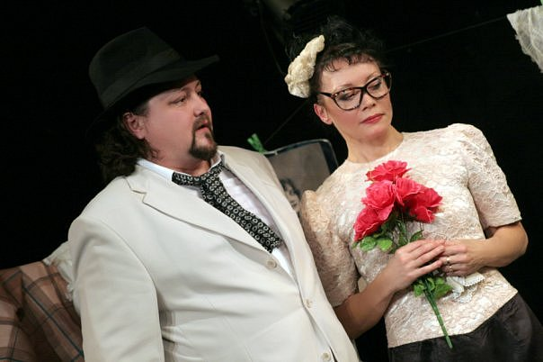

**Pro артиста**

**Максим Сергеев: портрет комедианта в драматических тонах.**

<figure></figure>

Артист <a href="57-maxsim-sergeev.html">Максим Сергеев </a>работает в Государственном драматическом театре «Комедианты» 15 лет. Пройдя школу Владимира Петрова, поучившись у Льва Додина, он пришёл в театр, где прежде всего ценится актёрская индивидуальность и яркое дарование – и, пройдя вместе с ним путь профессионального взросления, стал одним из ведущих артистов.

За эти годы <a href="57-maxsim-sergeev.html">Максим Сергеев</a> сыграл в театре 12 ролей. Параллельно он снимается в кино (роли в фильмах Александра Сокурова «Молох», «Петр I», «Русский ковчег»), активно работает на телевидении, оттачивает навыки сценречи, озвучивая зарубежное кино и мультфильмы. На сегодняшний день он играет в ведущих спектаклях театра, основанных на классическом репертуаре – <a href="60-sirano-de-bergerak.html">«Сирано де Бержерак»</a> (Э. Ростан). <a href="72-trigorin.html">«Записные книжки Тригорина»</a> (Т.Уильямс по пьесе А.П. Чехова «Чайка»), <a href="41-v-paris.html">«В Париж!»</a> (по ранним рассказам А.П. Чехова). В его актерском багаже такие «кассовые» спектакли, как <a href="59-strasti-po-italianski.html">«Страсти по-итальянски»</a> (Э.де Филиппо) и <a href="70-vor.html">«Не всякий вор – грабитель»</a> (Д.Фо), много лет любимые зрителем. Не все роли Сергеева главные. Но этот артист умеет играть эпизод. В каждый свой выход на сцену он вкладывает – в соответствии с лучшими традициями русского театра – четкое понимание персонажа, продуманную и «прожитую» биографию, характер, объём.

В каждом его герое неизменно одно качество – основательность. Это может быть Гордый человек из спектакля<a href="41-v-paris.html"> «В Париж!»</a>, у которого и слов-то почти нет, зато какая стать!.. Или неверный муж из фарса Дарио Фо «Не всякий вор - грабитель». Или Шамраев из «Тригорина», своим зычным пением вторгающийся в размеренную жизнь обитателей поместья Аркадиной. Благодаря проработке каждой детали образа, крупным штрихам, которыми он рисует своих героев, артист Сергеев узнаваем в любой роли.

Но есть ещё одна особенность актерской манеры Сергеева. Это ирония. Каждый пассаж он проделывает со скрытым смехом. Порой неясно – смех ли это самого персонажа или же артиста, использующего прием остранения (еще по одной великой театральной традиции). И дело не в том, что в «Комедиантах» трагедий не ставят. Просто через комическое, через смех, фарс, игру, нелепость и абсурд жизнь познается во всем ее объёме, вскрываются не только ее чарующие, но и ужасающие стороны.

В недавней премьере театра, <a href="72-trigorin.html">«Записных книжках Тригорина»</a>, у всех персонажей есть одна и та же страсть – все, и стар, и млад, мечтают оказаться на сцене. Это касается и Шамраева в исполнении Максима Сергеева. Грубоватый, наглый, он всё же подвержен всеобщему настроению и, как может, развлекает утомлённых господ своими песнями. Он тоже хочет оставить свой неуклюжий след в этой истории, именно это оказывается его сквозной нотой.

<a href="70-vor.html"> «Не всякий вор – грабитель»</a> - лишь вначале искромётная комедия положений с традиционными приёмами этого жанра (знаменитое qui

<figure></figure>

pro quo). В финале же под растаявшим налётом балаганного смеха мы видим обнаженную правду о том, что нет любви между супругами, нет нравственных законов ни для кого, что можно лгать, изменять. Лишь вор – настоящий, квартирный - оказывается любящим и верным мужем и, по странному стечению обстоятельств, расплачивается вовсе не за то, что обчистил пару-тройку домов, а за грехи своих случайных знакомых. Здесь Сергеев в роли Хозяина дома играет постепенное разоблачение своего героя.

С Графом де Гишем Сергеева (<a href="60-sirano-de-bergerak.html">«Сирано де Бержерак»</a>) происходит обратное: отрицательный персонаж обретает «положительную динамику». Человек высокого положения, для которого собственная воля – единственный закон, который одержим чувством мести, холоден и расчетлив, вдруг меняется, не испытав даже, а лишь увидев настоящую любовь, и решает вместе с Кристианом, Роксаной и Сирано встречать смерть. В этот момент – момент принятия переломного решения – в глазах Сергеева-де Гиша вся его внутренняя борьба и, наконец, – просветление. В человеке, которого мы только что ненавидели вместе со всеми, мы, зрители, вдруг узнаем того влюбленного Кристиана, которого играл артист Сергеев в этом же спектакле несколько лет назад…

Жанр комедии покорен дарованием артиста Сергеева бесповоротно. Территория от фарсов, комедии дель арте до самых драматических эпизодов – его территория. Сергеев, играющий по большей части не очень-то славных типов, интересен в каждой роли. А для артиста не это ли самое важное? Особенно если он работает на небольшой сцене, вплотную подвинутой к зрителям, когда не спрятаться ни за мощную декорацию, ни за ребусы режиссерского построения действия (режиссура здесь всегда деликатна). В одном интервью <a href="57-maxsim-sergeev.html">Максим Сергеев</a> сказал, что мечтает (именно мечтает!) сыграть Лира. Несмотря на то, что роль эта далека от его сегодняшнего репертуара и уже лежит в плоскости совсем другого театра – театра Трагедии – нет сомнений, что таланту актёра подвластно и это превращение.

Мария Максимычева

Газета "Pro-сцениум" / 2008 год / автор: Мария Максимычева

<a href="http://www.mtfontanka.spb.ru/pro_stceniym/57_58_19_20/06.htm">Ссылка на статью</a>

