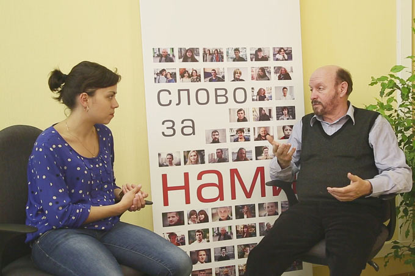

**Михаил Левшин: «Актер – это кровоточащая рана»**

<h4>Худрук театра «Комедианты» рассказал W, как относится к идее Минкульта об аттестации творческих работников, и почему работу актера опасно формализовывать.</h4>

**Творческие работники неоднозначно воспринимают реформу Министерства культуры, согласно которой они должны будут раз в пять лет подтверждать свою профессиональную пригодность. Как рассказал OK-inform заслуженный деятель искусств, театральный режиссер Михаил Левшин, основная проблема заключается в том, что с помощью обязательной переаттестации не самые честные руководители смогут избавляться от неугодных им сотрудников - по личным причинам, а не потому, что те плохо работают. Минкульт объяснил необходимость внесения в Трудовой кодекс статьи по «регулированию труда творческих работников организаций кинематографии, театров, театральных и концертных организаций, цирков и иных лиц, участвующих в создании и (или) исполнении (экспонировании) произведений» тем, что в творческих коллективах часто случаются скандалы.**

<figure></figure>

- Самые благие, полезные и насущные идеи порой приводят к негативным последствиям из-за их неправильного воплощения, - считает художественный руководитель театра «Комедианты».

Михаил Левшин говорит, что невостребованных артистов до сих пор довольно трудно уволить из театра при условии, что они не нарушают трудовой дисциплины. С введением обязательной переаттестации творческих работников, которая предполагается начаться уже в следующем году, распрощаться с артистами, у которых нет своего зрителя, будет проще.

- Необходимо грамотно продумать конкурсную процедуру и правила отбора, - говорит Михаил Александрович. - Нужно понимать, что разным театрам нужны разные артисты, и что нельзя всех аттестовать по одним и тем же критериям.

Однако механизма, который бы позволял объективно оценивать эффективность деятельности творческих работников, до сих пор не разработано.

- Отбор артистов с помощью голосования, чем в свое время занимались худсоветы, себя дискредитировал, - считает Михаил Левшин. - Какой инструмент разработают сейчас - неизвестно, но хотелось бы, чтобы чиновники прислушались к мнению творческой братии.

Михаил Александрович говорит, что актер - «это вечно кровоточащая рана» и необходимо, чтобы новые правила были справедливыми, чтобы человек понимал, что его «отсеивают» по объективным причинам. Кроме того, необходимо продумать, что предложить тем, кто не пройдет переаттестацию. Если будут предоставлять иные вакансии, то они должны быть из смежной сферы. Бывший актер вряд ли согласится быть водителем учреждения культуры. Здесь и до суицида недалеко, предостерегает Михаил Левшин.

- В нашей стране возможность использования закона во вред не является поводом для того, чтобы его не принимать. Потому что предполагается, что закон всегда вводится с благими намерениями, - объясняет худрук петербургского театра «Комедианты».

По его словам, есть еще один очень важный момент, который волнует руководителей бюджетных театров: если в процессе переаттестации будет сокращена театральная труппа, то будут ли сокращать субсидирование театра?

- Сейчас субсидии хватает на то, чтобы заплатить зарплаты штатным сотрудникам. Средства на декорации, костюмы, рекламу и прочее мы выкраиваем из того, что нам удается заработать от продажи билетов. Суммы эти небольшие, поскольку театр «Комедианты» - камерный, на сто мест. Так вот сейчас нам говорят, что работникам культуры необходимо увеличивать зарплату, и предлагают это делать за счет заработанных средств. Но мы-то их тратим на содержание театра. Если после сокращения труппы субсидирование не уменьшат, тогда и зарплаты прошедшим аттестацию актерам можно будет поднимать. Но тут много неясностей. Нужно не только Трудовой кодекс менять, но и другие документы, поскольку реформа затронет все стороны творческой деятельности, - уверен Михаил Левшин.

Беседу вела Елизавета Садкова.

Интернет-газета "Ок-inform" / 13.06.2013 / Е.Садкова

<a href="http://ok-inform.ru/rubriki/47-double-you/2895-mikhail-levshin-akter-eto-krovotochashchaya-rana-video.html">Ссылка на статью</a>

<figure></figure>

