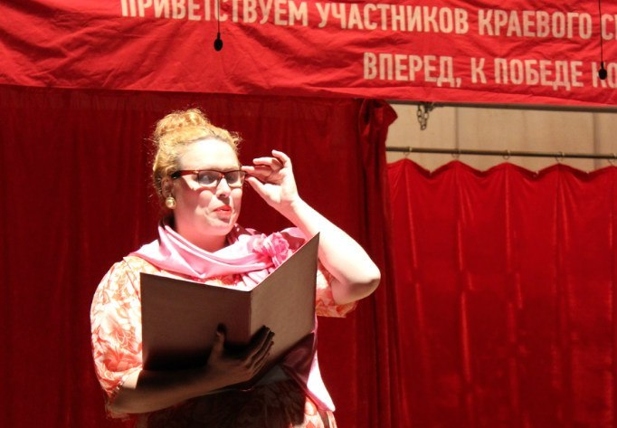
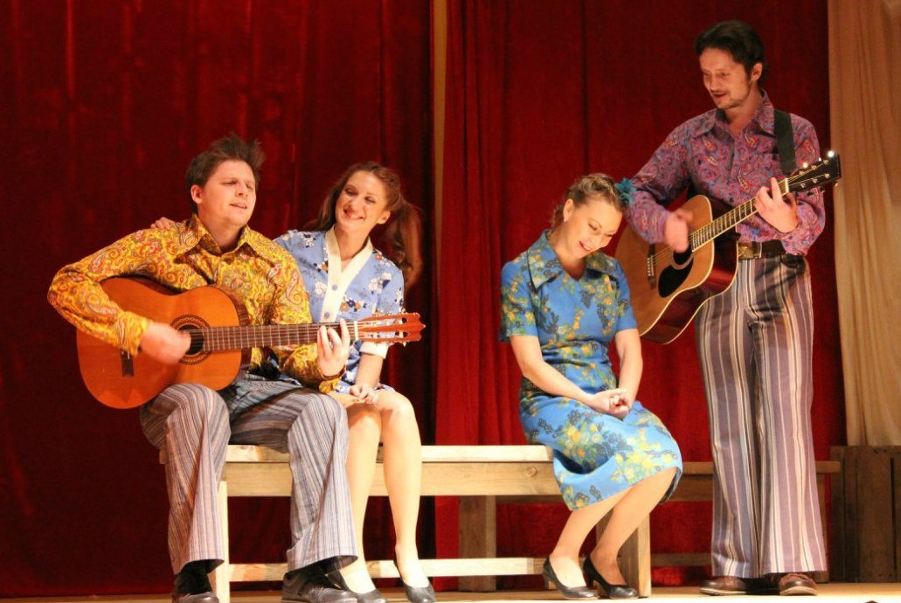

<figure></figure>

**Василий Шукшин**

**«ЗЕМЛЯКИ»**

Режиссёр-постановщик - з.д.и. России <a href="153-mihail-levshin.html">Михаил ЛЕВШИН</a>

Художник-постановщик - Мария СМИРНОВА - НЕСВИЦКАЯ

Музыкальное оформление - Вера ТРОШНЕВА

Хореограф – Айгуль ГИЛЬМЕТДИНОВА

«В рассказах Шукшина гармонично сочетаются три потока –

драматизма, юмора и нежности».С. Юрский

Приглашаем Вас совершить путешествие в настоящую русскую глубинку 60-х годов ХХ века. На время спектакля сцена и зрительный зал превратятся в сельский клуб, где проходит смотр художественной самодеятельности. Участники, наши «земляки», продемонстрируют свои разносторонние таланты.

Песня испокон веков сопровождает русского человека - и в печали, и в радости. В спектакле песни в исполнении односельчан превращаются в реальные истории – от Ивана Петина жена ушла, да не просто ушла, а сбежала с офицером, а в семье Худяковых родился младенец без отца, а Венька Зяблицкий, тот вообще тещу в туалете заколотил. И каждая такая история оборачивается исповедью. Недаром у русского человека издавна «душа болит». И снова рождается песня, а с ней и веселье, и покой, и сама жизнь.

«Земляки» - это спектакль про нас, про русских людей, которым горе не беда, а печаль в радость. Это спектакль про нашу страну, огромную, прекрасную и непостижимую.

В спектакле используются песни советской эстрады.

В спектакле заняты:

Николай Худяков / Редактор газеты - <a href="24-blednyh-sergej.html">Сергей БЛЕДНЫХ</a>

Нина Ануфриева (зав.клубом) / Мать Игоря - <a href="89-olga-yakovleva.html">Ольга ЯКОВЛЕВА</a>

Костя Худяков - <a href="50-roman-pritula.html">Роман ПРИТУЛА</a>

Клавдия Духанина / Светка - <a href="23-belova-ekaterina.html">Екатерина БЕЛОВА</a>

Сергей Духанин / Зам.дир.совхоза - <a href="55-anatolii-ilchenko.html">Анатолий ИЛЬЧЕНКО</a>

Судья / Продавец - <a href="64-asia-pigel-sergeevna.html">Анастасия ПИЖЕЛЬ</a>

Людмила Ярикова - <a href="62-irina-mityshkina.html">Ирина МИТЮШКИНА</a>

Офицер / Максим Яриков - Виталий ТАКС

Колька / Лапшин / Шофёр / Парень с гитарой - <a href="83-bezryk-ilya.html">Илья БЕЗРУК</a>

Людмила / Соня - <a href="86-alena-azarova.html">Алёна АЗАРОВА</a>

Иван Петин / Тоскливый - <a href="66-vitalii-kravchenko.html">Виталий КРАВЧЕНКО</a>

Веня Зяблицкий - <a href="84-talashmanovevgenii.html">Евгений ТАЛАШМАНОВ</a>

Баянист - Александр ГОНЧАРУК

Представительный мужчина / Отец Игоря - <a href="27--gennadij-spiridenkov-za-rf.html">Геннадий СПИРИДЕНКОВ </a>

Груша / Алевтина Худякова - <a href="48-chernovaelizaveta.html">Елизавета ЧЕРНОВА</a>

Елизавета Киселёва / Лариса Худякова - <a href="80-tatiana-kogevnikova.html">Татьяна КОЖЕВНИКОВА</a>

Михайло Кузнецов / Поп - Юрий АГЕЙКИН

Пресса о спектакле "Компромисс":

<a href="310-premiera-zemlyki-shukshin-pikalovo-1.html">Премьера в Ленинградской области / спектакль "ЗЕМЛЯКИ" / Газета "ВЕСТИ" (автор: Б.Шарова)</a>

<figure></figure>

<figure></figure>

<figure></figure>

<figure></figure>

<figure></figure>

Премьера состоялась **27** марта **2014** года.

Продолжительность спектакля **2** часа **40** минут с антрактом.

