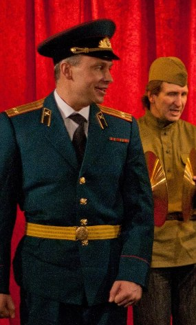
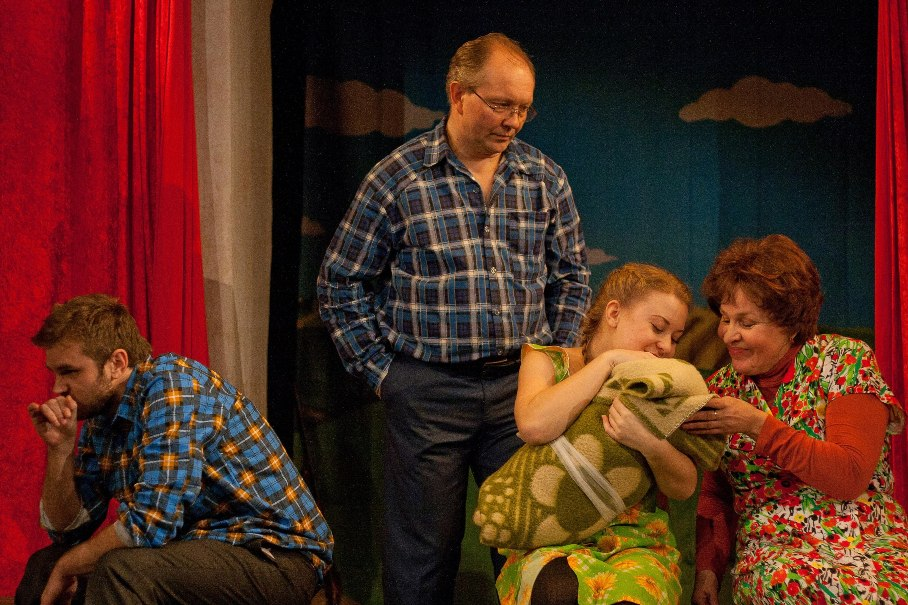

**27 и 29 марта - ПРЕМЬЕРА!!!**

<a href="283-zemlyaki.html">**«ЗЕМЛЯКИ»**</a>

лирическая комедия

по рассказам Василия Шукшина

Режиссёр-постановщик - з.д.и. России <a href="153-mihail-levshin.html">Михаил ЛЕВШИН</a>

Художник-постановщик - Мария Смирнова-Несвицкая

Музыкальное оформление - Вера Трошнева

«В рассказах Шукшина гармонично сочетаются три потока –

драматизма, юмора и нежности».

С. Юрский

<figure></figure>

Приглашаем Вас совершить путешествие в настоящую русскую глубинку 60-х годов ХХ века. На время спектакля сцена и зрительный зал превратятся в сельский клуб, где проходит смотр художественной самодеятельности. Участники, наши «земляки», продемонстрируют свои разносторонние таланты.

Песня испокон веков сопровождает русского человека - и в печали, и в радости. В спектакле песни в исполнении односельчан превращаются в реальные истории – от Ивана Петина жена ушла, да не просто ушла, а сбежала с офицером, а в семье Худяковых родился младенец без отца, а Венька Зяблицкий, тот вообще тещу в туалете заколотил. И каждая такая история оборачивается исповедью. Недаром у русского человека издавна «душа болит». И снова рождается песня, а с ней и веселье, и покой, и сама жизнь.

«Земляки» - это спектакль про нас, про русских людей, которым горе не беда, а печаль в радость. Это спектакль про нашу страну, огромную, прекрасную и непостижимую.

В спектакле используются песни советской эстрады.

В ролях: <a href="27--gennadij-spiridenkov-za-rf.html">Заслуженный артист России Геннадий Спириденков</a>, <a href="86-alena-azarova.html">Алена Азарова</a>, <a href="23-belova-ekaterina.html">Екатерина Белова</a>, <a href="80-tatiana-kogevnikova.html">Татьяна Кожевникова</a>, <a href="62-irina-mityshkina.html">Ирина Митюшкина</a>, <a href="64-asia-pigel-sergeevna.html">Анастасия Пижель</a>, <a href="48-chernovaelizaveta.html">Елизавета Чернова</a>, <a href="89-olga-yakovleva.html">Ольга Яковлева</a>, <a href="83-bezryk-ilya.html">Илья Безрук</a>, <a href="24-blednyh-sergej.html">Сергей Бледных</a>, Александр Гончарук, <a href="55-anatolii-ilchenko.html">Анатолий Ильченко</a>, <a href="66-vitalii-kravchenko.html">Виталий Кравченко</a>, Виталий Такс, <a href="50-roman-pritula.html">Роман Притула</a>, <a href="84-talashmanovevgenii.html">Евгений Талашманов</a> , Юрий Агейкин.

<figure></figure>

Фото Анны Захаровой

7.02.2014

