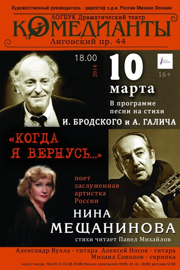

**10 марта в 18.00**

**на сцене Драматического театра «Комедианты»**

<h3>Концерт з.а. России Нины Мещаниновой</h3>

<h2>«Когда я вернусь… »</h2>

_В программе песни на стихи И.Бродского и А. Галича._

<figure></figure>

Сегодня хочется вновь обратиться к творчеству великих поэтов ХХ века Иосифа Бродского и Александра Галича через жанр актерской песни. Имя Иосифа Бродского, к счастью, сегодня часто появляется на театральных афишах. Мы готовы снова и снова возвращаться к творчеству тех людей, которые создавали нашу российскую культуру, подлинную историю нашей страны, к тем, кто бумерангом возвращают нас к самим себе. Порой сложные для восприятия стихи Иосифа Бродского могут стать доступнее и понятнее благодаря такому особому жанру, как актерская песня. А песни Галича, которые, к сожалению, на театральных афишах редкость, и вовсе можно отнести к произведениям драматическим. Это своеобразные песни-монологи, песни-диалоги. Сам автор имел прямое отношение к театру, Галич был драматургом, прошел всю войну со спектаклями и концертами в составе фронтового театра Валентина Плучека. Этот поэт своей эпохи соединил в своем творчестве сатиру, бесконечный юмор и любовь и отчаянный дух сопротивления, народность, стремление к правде.

Исполнит песни на стихи И. Бродского и А. Галича заслуженная артистка России Нина Мещанинова, получившая признание как исполнительница русских бардовских песен, современных романсов и романсов на стихи поэтов Серебряного века. Когда-то актриса выступала с программой «Я никогда не буду француженкой» — это был моноспектакль по песням российских бардов. Она исполняла песни из репертуара Бродского, Высоцкого, Визбора, Галича. Позже эти композиции закрепились в концертной программе актрисы. За исполнение песни на стихи А. Галича — «Караганда» Нина Мещанинова получила престижную Премию актерской песни имени Андрея Миронова. Профессиональный вокал позволяет актрисе точно чувствовать ритм и мелодию музыкального драматического произведения. За трехминутный номер Нина Мещанинова раскрывает судьбу человека ХХ столетия.

Концерт пройдет в сопровождении инструментального ансамбля.

17.02.2014

