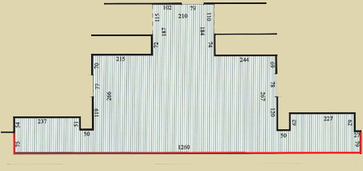

<figure></figure>

_**Все размеры даны в сантиметрах**_

**Высота помоста сцены - 48**

**Высота центральной ниши - 269**

**Расстояние от верхнего края ниши до ступеньки потолка - 63**

**Высота от помоста сцены до ступеньки потолка - 332**

**Высота боковых дверных проемов - 137**

**Площадь сцен с порталами ~ 60 кв.м.**

