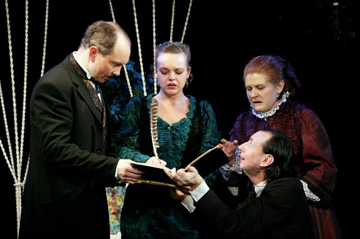

**А.Н. Островский**

**«ВОЛКИ И ОВЦЫ»**

Комедия в 2-х действиях

Режиссер-постановщик – заслуженный деятель искусств России

<a href="153-mihail-levshin.html">Михаил ЛЕВШИН </a>

Сценография – народный художник России Март КИТАЕВ

Композитор – Владлен ЧИСТЯКОВ

Почтенная «волчица» крепко держит бразды правления в маленьком сонном губернском городке… Она вершит судьбы покорных ей «овечек» по законам собственной выгоды, надежно прикрываясь общественной моралью. Женить непутевого племянника на богатой молоденькой вдове, напугав ее несуществующим долгом покойного мужа, и забрать в свои руки ее имение – все складывается успешно… Но, неожиданно, в ее планы вмешивается новый персонаж – деловой перспективный «волк» - жених безутешной вдовы. Накинув искусно скроенные овечьи шкуры, «волки» с легкостью пускают пыль в глаза доверчивым, неприспособленным к волчьим законам, жителям городка. Овцы кротки, и, кажется, исход предсказуем… но, не перегрызут ли волки друг другу глотки в борьбе за очередную заблудившуюся овцу?!

Людям так свойственна страсть к деньгам, власти и к легкой наживе. Поэтому Островский не перестает быть актуальным. Вы не найдете в спектакле безнадёжно-мемориального и фольклорно-обрядового театра, где вкусно пьют и особенным манером разговаривают. Напротив, на сцене Вас ожидает созвучное нашему времени действо, наполненное юмором и цинизмом, с узнаваемыми характерами и неоднозначным финалом.

Пресса о спектакле "Волки и овцы":

<a href="269-pressa-vjlki-i-ovci.html">"Живая классика на маленькой сцене" о спектакле "Волки и овцы" А.Островский (издание "BlogSlov")(автор:Мария Кингисепп)</a>

В спектакле заняты:

Мурзавецкая - Светлана СУХАНОВА

Беркутов - <a href="24-blednyh-sergej.html">Сергей БЛЕДНЫХ </a>

Купавина - <a href="85-oksana-surnina.html">Оксана СУРНИНА </a>

Мурзавецкий - <a href="50-roman-pritula.html">Роман ПРИТУЛА</a>

Глафира - <a href="81-ekaterina-kyltina.html">Екатерина КУЛЬТИНА </a>

Анфуса Тихоновна - <a href="23-belova-ekaterina.html">Екатерина БЕЛОВА </a>

Горецкий - <a href="22-afendulov-semen.html">Семен АФЕНДУЛОВ </a>

Лыняев - <a href="281-kirilldateshidze.html">Кирилл ДАТЕШИДЗЕ</a>

Чугунов - <a href="53-aleksei-ispolatov.html">Алексей ИСПОЛАТОВ</a>

Павлин - <a href="66-vitalii-kravchenko.html">Виталий КРАВЧЕНКО</a>

<figure></figure>

<figure></figure>

<figure></figure>

<figure></figure>

<figure></figure>

<figure></figure>

Спектакль идет **3** часа **30** минут с одним антрактом.

Премьера спектакля в новом составе состоялась **19** ноября **2008** года.

