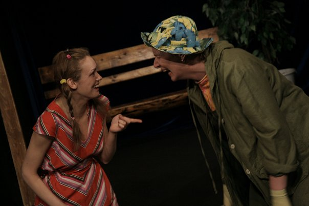
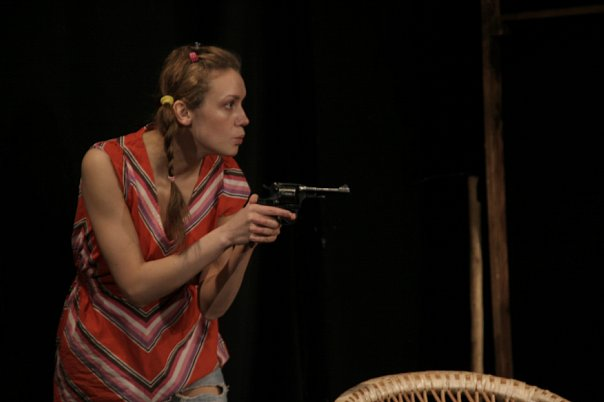
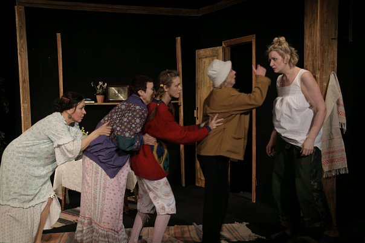
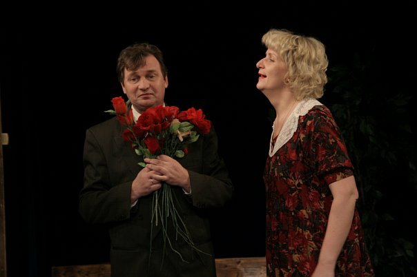

**В. Карасёв**

**«ДАЧНИЦЫ»**

Фарс-детектив в двух частях

Автор сценической версии театра и

режиссёр-постановщик – Борис ВОЙЦЕХОВСКИЙ

Современная семья - Бабушка, Мама, Дочка и Домработница - однажды решились и сняли за городом дачу для того, чтобы отдохнуть от сумасшедшей городской жизни. И захотели они хотя бы на короткий срок отпуска пожить совершенно по-новому: «без мужиков и без телевизоров», «стать, наконец, женщинами!»

Героини спектакля не имеют имён! Даже Хозяйка, у которой героини сняли дачу, тоже зовётся просто - Хозяйка. Но все они объединены одним общим именем - Женщины. Современные женщины, которые сами себе зарабатывают деньги; сами покупают себе цветы, духи и одежду; сами воспитывают детей, но втайне все равно мечтают о том единственном и желанном, который никогда не появится на горизонте. Так и проходит жизнь. И все бы снова было как всегда, привычно, спокойно и скучно, если бы на той самой даче, которую сняли героини подальше от мужиков, ими не было бы обнаружено Мужское Тело. Мёртвое!

В спектакле заняты:

Мужик - Заслуженный артист России <a href="27--gennadij-spiridenkov-za-rf.html">Геннадий СПИРИДЕНКОВ</a> / <a href="24-blednyh-sergej.html">Сергей БЛЕДНЫХ</a>

Бабушка - <a href="89-olga-yakovleva.html">Ольга ЯКОВЛЕВА </a>

Мама - Заслуженная артистка России <a href="26-popenko-taisija.html">Таисия ПОПЕНКО </a>

Хозяйка дачи - <a href="65-larisa-klimova.html">Лариса КЛИМОВА </a>

Внучка - <a href="56-natasha-terehova.html">Наталья ТЕРЕХОВА</a> / <a href="79-anna-zagrebna.html">Анна ЗАГРЕБНА</a> / <a href="85-oksana-surnina.html">Оксана СУРНИНА</a>

Домработница Дуся - <a href="80-tatiana-kogevnikova.html">Татьяна КОЖЕВНИКОВА</a> / <a href="61-galina-saburova.html">Галина САБУРОВА</a>

<figure></figure>

<figure></figure>

<figure></figure>

<figure></figure>

<figure></figure>

<figure></figure>

<figure></figure>

Спектакль идет **2** ч. **30** мин. с одним антрактом.

Премьера состоялась **6** марта **2003** года.

