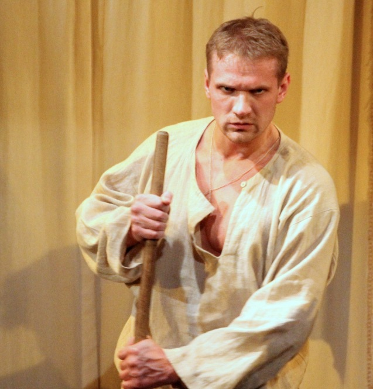
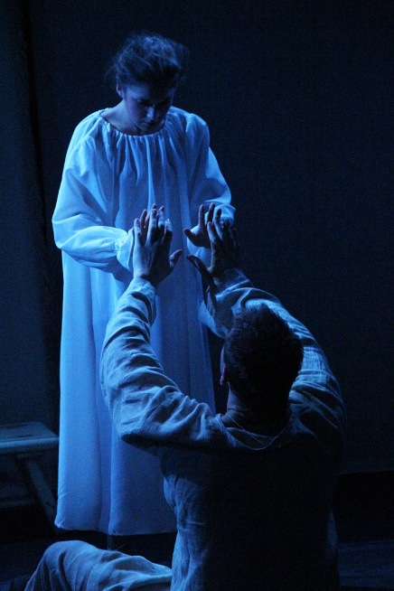

**Иван Тургенев**

**«КРЕПОСТНАЯ ЛЮБОВЬ» 12+**

Пластическая драма по повести И. С. Тургенева "Муму"

Режиссер–постановщик Заслуженный деятель искусств России

<a href="153-mihail-levshin.html">**Михаил ЛЕВШИН**</a>

Хореограф-постановщик Заслуженный деятель искусств России

**Сергей ГРИЦАЙ**

**О спектакле М. А. Левшина «Крепостная любовь».**

Слово – серебро, а молчание – золото…

Спектакль «Крепостная любовь» - это история о любви. События происходят в помещичьей усадьбе, где правит бал своенравная Барыня и ее прислужники. Чувства, возникшие между главными героями пьесы, Герасимом и крепостной Татьяной чисты и трогательны. Но, герои живут в мире, в котором нет свободы и где любовь – всего лишь непозволительная роскошь. И бороться за нее не хватает воли.

«Немногословность» русского мужика, отдававшего всего себя непосильному труду, уходит корнями в сам уклад жизни крестьянской России, формировавшийся веками. Отсюда выбор жанра – «пластическая драма». Спектакль театра «Комедианты» практически без слов. В глухоту и немоту погружаются все обитатели усадьбы, и немота Герасима оказывается самой звенящей и пронзительной.

Песни - народный фольклор – полноценная часть действия. Своеобразный визуальный ряд - проекция картин русских художников. Так возникают изображения усадьбы, реки, военных действий – это есть суть художественного оформления спектакля.

Оригинальная трактовка сочетает в себе современные пластические формы и самобытность и очарование народного фольклора.

**О создателях спектакля:**

Режиссер – постановщик – заслуженный деятель искусств России, основатель и главный режиссер театра «Комедианты» <a href="153-mihail-levshin.html">**Михаил Александрович Левшин**</a>. Автор спектаклей театра «Волки и овцы» по А. Островскому, «Записные книжки Тригорина» по Т. Уильямсу, «В Париж» по А.Чехову и др. Постановки М.А.Левшина вызывают одинаковый интерес и у широкой публики, и у требовательных специалистов, приглашаются на самые престижные фестивали страны.

Хореограф – постановщик - заслуженный деятель искусств России, хореограф, режиссёр по пластике, **Сергей Иванович Грицай**. Лауреат Государственной премии Российской Федерации в области литературы и искусства, лауреат Всесоюзных конкурсов (1984, 1988), лауреат Национальной театральной премии России «Золотая Маска» и других престижных премий.

Страны, где играли "Муму":

Норвегия (г.Осло), Германия (г.Оберкохен), Турция (г.Трабзон), Армения (г. Ереван).

Призы и награды:

«Приз зрительских симпатий - 2010» Санкт-Петербургского общества **«ТЕАТРАЛ»** в номинации - **ЛУЧШИЙ СПЕКТАКЛЬ ГОДА**.

СПЕЦИАЛЬНЫЙ ПРИЗ ЭКСПЕРТНОГО СОВЕТА ЗА **"ЛУЧШИЙ ДЕБЮТ"** высшей театральной премии Санкт-Петербурга **«ЗОЛОТОЙ СОФИТ»** сезона 2010 - 2011 - <a href="86-alena-azarova.html">**Алёна АЗАРОВА**</a> за роль Татьяны.

**Главный приз "Хрустальный Трабзон"** на "13-ом Черноморском Международном Театральном Фестивале" в г.Трабзон (Турция) (2012 г.).

Диплом **"За лучший актёрский ансамбль"** на "1-ом фестивале театральных и музыкальных проектов камерных экспериментальных форм" (Театральный марафон) в г. Выборге. (2013 г.)

В спектакле заняты:

Герасим - <a href="21-fillipp-azarov.html">Филипп АЗАРОВ</a>

Татьяна - <a href="86-alena-kiverskaia.html">Алёна АЗАРОВА </a>

Барыня - <a href="89-olga-yakovleva.html">Ольга ЯКОВЛЕВА </a>

Капион - <a href="55-anatolii-ilchenko.html">Анатолий ИЛЬЧЕНКО</a> / Станислав ОСКОЛКОВ

Любовь Любимовна - <a href="65-larisa-klimova.html">Лариса КЛИМОВА</a>

Антипка - <a href="50-roman-pritula.html">Роман ПРИТУЛА</a>

Гаврила - <a href="24-blednyh-sergej.html">Сергей БЛЕДНЫХ</a>

Фимка - <a href="23-belova-ekaterina.html">Екатерина БЕЛОВА </a>

Улька - <a href="78-ylia-burceva.html">Юлия БУРЦЕВА</a>

Кастелянша - <a href="63-lyda-nikitina.html">Людмила НИКИТИНА</a>

Устинья - <a href="64-asia-pigel-sergeevna.html">Анастасия ПИЖЕЛЬ </a>

Ерошка - <a href="51-stas-voronetski.html">Станислав ВОРОНЕЦКИЙ</a>

Степан - <a href="66-vitalii-kravchenko.html">Виталий КРАВЧЕНКО</a>

Харитон - <a href="84-talashmanovevgenii.html">Евгений ТАЛАШМАНОВ</a>

Пресса о спектале "Крепостная любовь" ("МуМу"):

<a href="306-krepostnaialovemumusubkultura.html">О спектакле "Крепостная любовь" (Муму) / "СубКультура" (автор: М.Прошутинский)</a>

<a href="298-talantsilafilippazarovpressakomedianti.html">"Талант+сила=Филипп Азаров" Интервью исполните главной роли Герасима в спектакле "Крепостная любовь" (журнал "Комедианты")(автор:В.Демянская)</a>

<a href="109-mymy-pressa-3.html">Крепостное право на фоне "МуМу", или что сказал Герасим ("Деловой Петербург") (автор: Игорь Шнуренко)</a>

<a href="294-pressa-mymy-2013.html">"Фантазии на трёх скамейках" о спектакле "Крепостная любовь" (МУМУ) (журнал "Невский Театраль" №2 (02)) автор: Борис Шаров</a>

<a href="110-mymy-pressa-5.html">Закрытие 21 сезона "МуМу" в Лодейном Поле (газета "ВЕСТИ") (автор: Борислава Шарова)</a>

<a href="111-mymy-pressa-4.html">Не о МУМУ писал Тургенев - о России (газета "НЕВСКОЕ ВРЕМЯ") (автор:Елена Добрякова)</a>

<a href="107-mymy-pressa.html">"Если спектакль талантлив" (о "МуМу" в "Комедиантах") Электронный театральный журнал "Этажи" (автор: Павел Чердынцев)</a>

<a href="108-mymy-pressa-2.html">"МуМу" в "Комедиантах" Газата Ленинградской области "ВЕСТИ" (автор: Борислава Шарова)</a>

<a href="236-mymy-v-germanii.html">"КОМЕДИАНТЫ" в ОБЕРКОХЕНЕ (Германия) Mymy (издание "Schwäbische Post")(перевод)</a>

<a href="237-mumuv-oberkohene-pressa.html">"КОМЕДИАНТЫ" оставили в Германии двойственное чувство /Mymy(издание "Schwabische.de")(перевод)</a>

<figure>{youtube:http://www.youtube.com/watch?v=GtpdgTMOVDE 510 383}</figure>

<figure></figure>

<figure></figure>

<figure></figure>

<figure></figure>

<figure></figure>

<figure></figure>

<figure></figure>

<figure></figure>

<figure></figure>

Спектакль идёт **2** часа **30** мин. с одним антрактом.

Премьера спектакля состоялась **27** ноября **2010** года.

