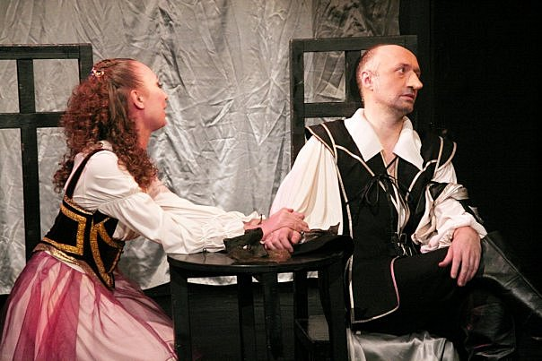

**Эдмон Ростан**

**«СИРАНО ДЕ БЕРЖЕРАК» 16+**

Героическая комедия в 2-х действиях.

Режиссёр: Заслуженный деятель искусств РФ <a href="153-mihail-levshin.html">Михаил ЛЕВШИН </a>

Сценограф: А. ОРЛОВ

Композитор: И. РОГАЛЁВ

Режиссёр по пластике: А.ЧЕРНЫХ

Художник по костюмам: С. НЕСТЕРОВА, А. ШВЕДОВА

Маски: Б. СМИРНОВ

Перевод : Т. ЩЕПКИНОЙ - КУПЕРНИК.

Трепетная , нежная героиня Роксана искренне верит во встречу с "принцем" – красавцем, храбрецом и непременно — с душой поэта. Только вот у красавца и храбреца душа оказывается самая, что ни на есть прозаическая. А редким поэтическим даром, что так дорог сердцу красавицы, обладает не он, а ее странный, нелепый кузен, с огромным уродливым но­сом и такой же огромной гордыней. "Сирано де Бержерак" – это интриги, шпаги, стихи, песни и, конечно, лю­бовь. Здесь пытаются разрешить извечный вопрос – за что мы любим? За ум, красоту? За доброту, талант? Чем можно пожертвовать ради любви, а чем – ради чести?

Номинант премии «Золотой софит» в 1997 году.

Есть такие пьесы, которые было бы чрезвычайно обидно не иметь в своем репертуаре!

В спектакле заняты:

Сирано де Бержерак - <a href="302-andrey-shimko.html">Андрей ШИМКО</a>

Роксана - <a href="78-ylia-burceva.html">Юлия БУРЦЕВА</a> / <a href="81-ekaterina-kyltina.html">Екатерина КУЛЬТИНА</a> / <a href="79-anna-zagrebna.html">Анна ЗАГРЕБНА</a>

Кристиан - <a href="21-fillipp-azarov.html">Филипп АЗАРОВ</a>

Ле-Бре - <a href="55-anatolii-ilchenko.html">Анатолий ИЛЬЧЕНКО </a>

Монашка - <a href="48-chernovaelizaveta.html">Елизавета ЧЕРНОВА</a>

Монашка - <a href="86-alena-kiverskaia.html">Алёна АЗАРОВА</a>

Монашка - <a href="301-mariaosipova.html">Мария ОСИПОВА</a>

Гвардеец - <a href="50-roman-pritula.html">Роман ПРИТУЛА</a>

Гвардеец - <a href="66-vitalii-kravchenko.html">Виталий КРАВЧЕНКО </a>

Гвардеец - <a href="83-bezryk-ilya.html">Илья БЕЗРУК</a>

Вальвер - Сергей СУРЖИН / <a href="67-leonid-zabkin.html">Леонид ЗЯБКИН</a>

Рагно - <a href="284-2013-09-08-18-38-31.html">Павел ИВАНОВСКИЙ</a>

Де-Гиш - <a href="77-ilgiz-bulgakov.html">Ильгиз БУЛГАКОВ</a>

Дуэнья - <a href="62-irina-mityshkina.html">Ирина МИТЮШКИНА </a>

<figure></figure>

<figure></figure>

<figure></figure>

<figure></figure>

<figure></figure>

<figure></figure>

<figure></figure>

Cпектакль идёт **3** часа **30** мин. с антрактом.

Премьера состоялась **12** марта **2000** года.

