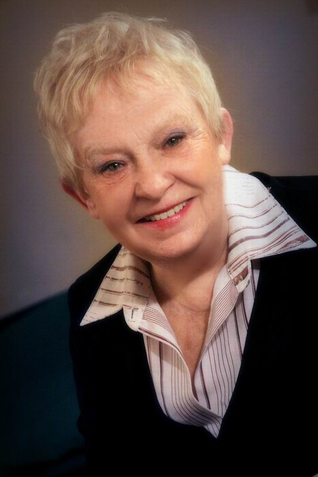

**ГАЛИНА САБУРОВА**

<figure></figure>

Родилась 22 декабря 1937 года в Ленинграде. В 1964 году окончила ЛГИТМиК (СПБГАТИ) курс Л.Макарьева, Ф.М.Никитина. В 1964-1969 годах работала в Красноярском драматическом театре. В 1970-1975 гг. - в "Ленконцерте". В 1976-1984 гг. - на Ленфильме. В 1984-1998 гг. - в "Студии киноактёра". Актриса прошла большой творческий путь, много снималась в кино у таких режиссеров, как Иосиф Хейфиц, Виктор Садовский, Владимир Фетин, Эрнест Ясан, Виктор Титов, Александр Бурцев, Александр Калягин.

С 1999 года актриса Санкт-Петербургского государственного драматического театра «КОМЕДИАНТЫ».

Занята в спектаклях:

<a href="71-anekdoti.html">«Провинциальные анекдоты»</a> А.Вампилов - роль Васюта (2 анекдот)

<a href="97-pominalnaia-molitva.html">«Поминальная молитва»</a> Г.Горин - роль Мама Менахема

<a href="39-beda-ot-neghnogo-serdca.html">«Беда от нежного сердца»</a> В.Соллогуб - роль А.Г.Кубыркина

<a href="43-dachnici.html">«Дачницы»</a> В.Карасёв - роль Дуся

<a href="69-genitba.html">«Женитьба»</a> Н.В.Гоголь - роль Фекла Ивановна

<figure></figure>

<figure></figure>

