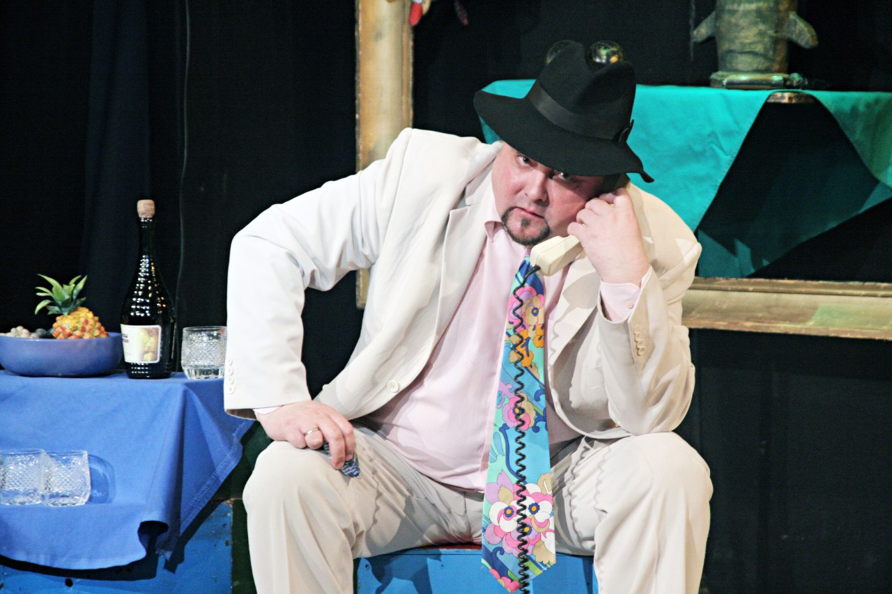
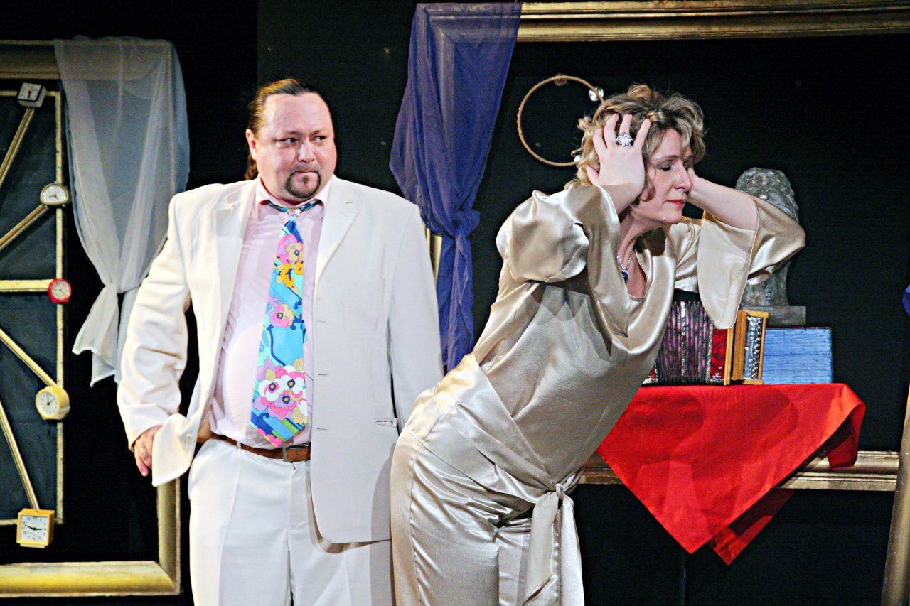
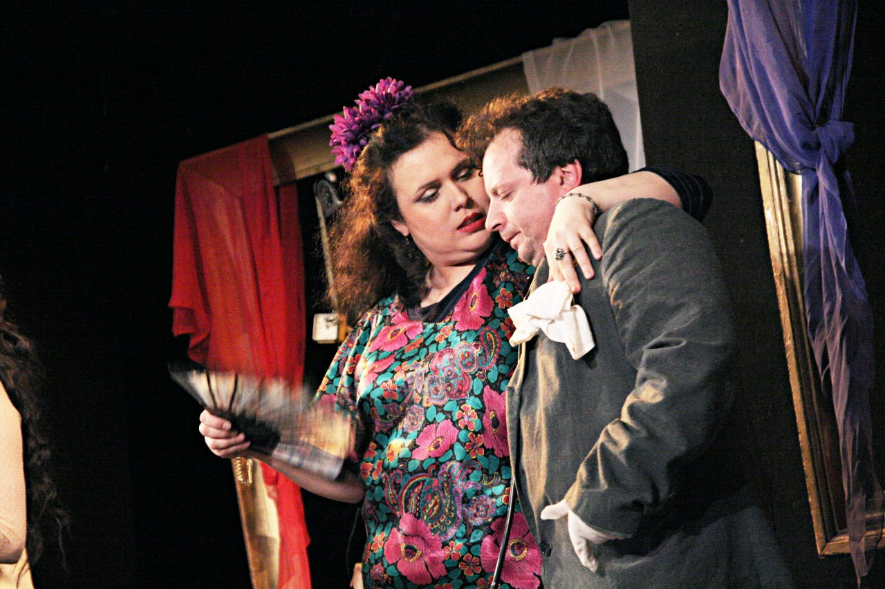
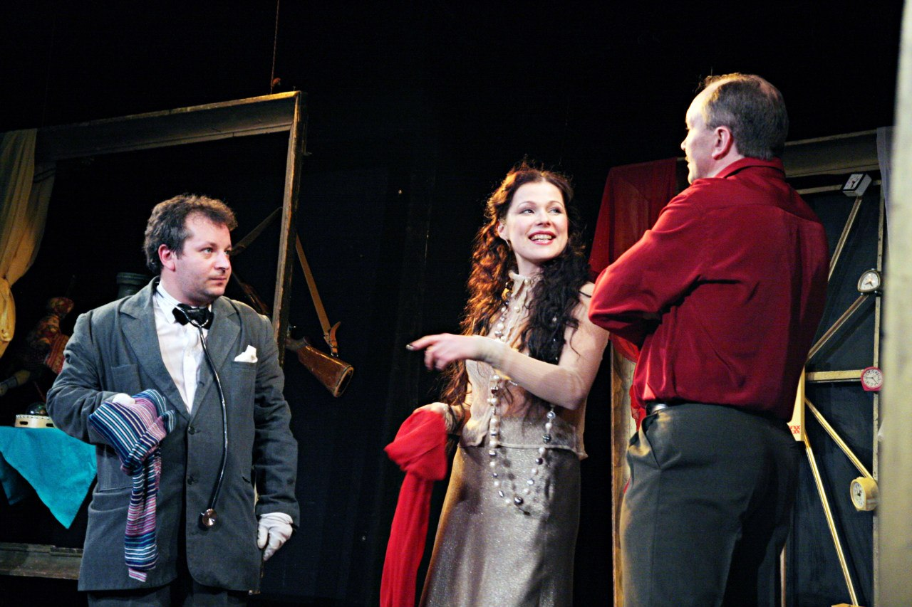
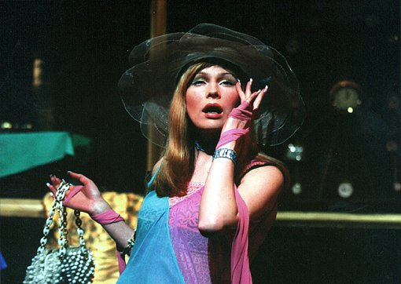
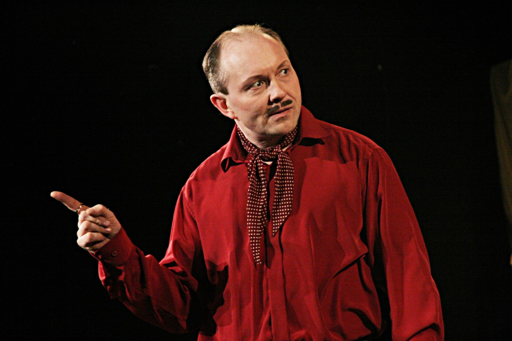

**Дарио Фо**

**«НЕ ВСЯКИЙ ВОР – ГРАБИТЕЛЬ» 16+**

Фарс

Режиссёр: Заслуженный деятель искусств России <a href="153-mihail-levshin.html">Михаил ЛЕВШИН</a>

Сценография и костюмы: Ф.ВОЛОСЕНКОВА

Музыкальное оформление: С.ПОНОМАРЁВА, А.ГАЛИШНИКОВА

Дух свободной, искрометной итальянской комедии и игра настоящих южных страстей, это то, что заставляет незадачливых героев этого фарса попадать в совершенно немыслимые рискованные ситуации, и… с честью выпутываться из них! Вор проникает в богатую квартиру. Он настолько уверен, что хозяева покинули её надолго, что "орудует" не спеша, "с комфортом", успевая даже ссорится с женой по телефону, "с рабочего места". Только вот хозяева этой квартиры – неверные супруги – оказывается, в тайне друг от друга, задумали использовать опустевшую квартиру для своих любовных утех…

Этим спектаклем театр продолжил традиции спектакля «Страсти по-итальянски», снова пригласив зрителей стать соучастниками самых невероятных событий!

В спектакле заняты :

Анна - <a href="49-ylia-gorshenina.html">Юлия ГОРШЕНИНА</a>

Любовница Францози - <a href="65-larisa-klimova.html">Лариса КЛИМОВА</a>

Мария Торнати - <a href="64-asia-pigel-sergeevna.html">Анастасия ПИЖЕЛЬ</a>

Францози - <a href="57-maxsim-sergeev.html">Максим СЕРГЕЕВ</a>

Вор - <a href="52-sergei-nikolaev.html">Сергей НИКОЛАЕВ </a>

Антонио - <a href="24-blednyh-sergej.html">Сергей БЛЕДНЫХ</a> / <a href="67-leonid-zabkin.html">Леонид ЗЯБКИН </a>

<figure></figure>

<figure></figure>

<figure></figure>

<figure></figure>

<figure></figure>

<figure></figure>

Спектакль идёт **1** час **30** мин без антракта.

Премьера спектакля состоялась **17** июня **2003** года.

