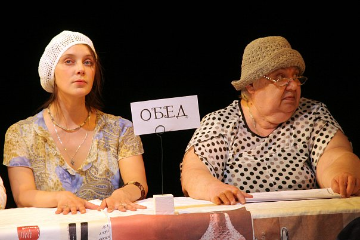

**Катя Рубина**

**«ПРОГУЛКА В ЛЮ-БЛЁ» 16+**

Комедия в 2-х действиях.

актерские импровизации в присутствии режиссера

Режиссёр: заслуженный деятель искусств РФ <a href="153-mihail-levshin.html">Михаил ЛЕВШИН</a>

Сценография: Полина ЛЕВШИНА (дебют)

Предприимчивая энергичная тетя Люля тащит свою неудачливую в любви племянницу Лилю на рижское взморье с одной единственной целью – выдать замуж. Задача не из легких, если учесть, что Лиля – художница по профессии, творческая натура, совершенно не владеющая наукой кокетства. Жениха – грубоватого, если не сказать хамоватого, современного предпринимателя, хозяина мусороперерабатывающего завода, в планы тетушки, естественно, не посвятили… Пьеса Екатерины Рубиной, конечно, в первую очередь про любовь, про то, как все-таки необходимо каждому человеку быть понятым, желанным и нужным.

Актерские импровизации в присутствии режиссера. В спектакле звучит музыка из оперы Моцарта «Волшебная флейта». Зрители присутствуют при увлекательном процессе создания спектакля, где царит дух свободного творчества и импровизации. Причем такая форма не только не рушит целостности истории, но и помогает выявить содержание пьесы, придает ей особенный колорит.

Призы и награды:

**Приз за лучшую женскую роль IX Московского международного Фестиваля Камерных театров и спектаклей малых форм "Славянский венец"** - актриса **Наталья КОНЬКОВА** (роль Ренаты)

В спектакле заняты:

Рута - Заслуженная артистка России <a href="26-popenko-taisija.html">Таисия ПОПЕНКО</a>

Лиля - <a href="78-ylia-burceva.html">Юлия БУРЦЕВА</a>

Люля - <a href="65-larisa-klimova.html">Лариса КЛИМОВА</a>

Хербст Фогель - <a href="77-ilgiz-bulgakov.html">Ильгиз БУЛГАКОВ</a>

Альберт - <a href="112-mark-gavrilov.html">Марк ГАВРИЛОВ</a>

Помощник режиссёра - <a href="64-asia-pigel-sergeevna.html">Анастасия ПИЖЕЛЬ</a>

Режиссёр - Заслуженный деятель искусств РФ <a href="153-mihail-levshin.html">Михаил ЛЕВШИН</a>

Рената - **Наталья КОНЬКОВА**

<figure></figure>

<figure></figure>

<figure></figure>

<figure></figure>

<figure></figure>

<figure></figure>

Спектакль идёт **2** часа с антрактом.

Премьера спектакля состоялась **30** апреля **2009** года.

