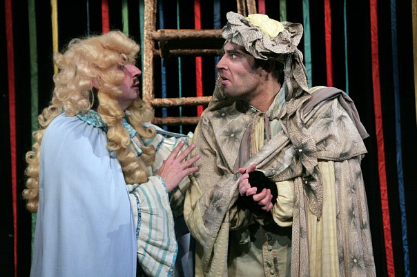

**Г. Сапгир, С. Прокофьева**

**«КОТ В САПОГАХ» 0+**

Сказка

Режиссёр: заслуженный деятель искусств России <a href="153-mihail-levshin.html">Михаил ЛЕВШИН</a>

Композитор: Андрей АНДЕРСЕН

Жил был на свете Жак – простак, и не было у него ничегошеньки, кроме кота, только кота не простого, а самого, что ни на есть волшебного! Встретил Жак в лесу прекрасную Принцессу и влюбился в нее с первого взгляда. А как быть дальше — простаку и невдомек. Но у него есть верный друг – мудрейший говорящий Кот, да еще и в сапогах. Сказка, написанная в 17 веке великим французским сказочником Шарлем Перро, и по сей день радует маленьких читателей. Но ведь гораздо увлекательнее увидеть живого Кота в сапогах и вместе с ним помочь Жаку-простаку завоевать принцессу и победить страшного Людоеда!

Наш любимый прием, когда зритель становится полноправным соучастником театрального действия, в этом спектакле реализован полностью. Юные зрители здесь - настоящие советчики и помощники простака Жака и его умного пушистого друга в сапогах!

Призы и награды:

Спектакль в 1995 году получил Гран-при на ежегодном фестивале **"Театры Санкт-Петербурга - детям".**

В спектакле заняты:

Кот в сапогах - <a href="51-stas-voronetski.html">Станислав ВОРОНЕЦКИЙ</a>

недоПринцесса - <a href="23-belova-ekaterina.html">Екатерина БЕЛОВА</a> / <a href="85-oksana-surnina.html">Оксана СУРНИНА </a>

Людоед - <a href="22-afendulov-semen.html">Семён АФЕНДУЛОВ</a> / <a href="88-roman-yakushov.html">Роман ЯКУШОВ</a>

Король - <a href="53-aleksei-ispolatov.html">Алексей ИСПОЛАТОВ</a>

Жак-Простак - <a href="66-vitalii-kravchenko.html">Виталий КРАВЧЕНКО</a>

<figure></figure>

<figure></figure>

<figure></figure>

<figure></figure>

<figure></figure>

<figure></figure>

<figure></figure>

Спектакль идёт **1** час **15** минут без антракта.

Премьера спектакля состоялась **25** декабря **1989** года.

