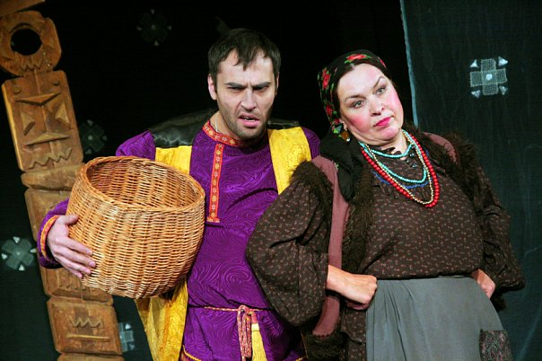
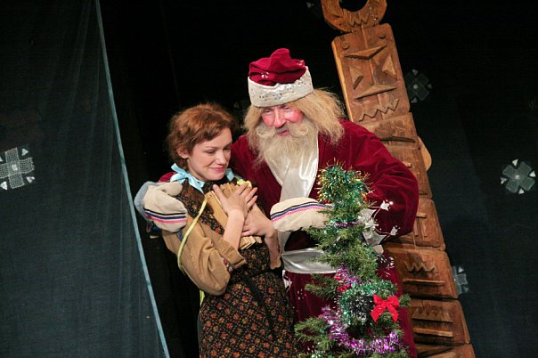
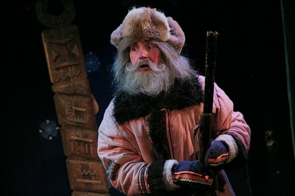

**Михаил Мокиенко**

**«ВОЛШЕБНЫЕ СОСУЛЬКИ» 0+**

Сказка

Театральная фантазия на тему русской сказки "Морозко"

Режиссёр: Алексей ИСПОЛАТОВ (Михаил МОКИЕНКО)

Художник: С.БУРЯКОВА

Композитор: Михаил МОКИЕНКО

Сказочный сюжет о падчерице, которую мачеха старается сжить со света, известен каждому. И, тем не менее, он остается одним из самых любимых и у артистов, и у зрителей. Ведь этот сюжет дает возможность вновь поговорить о прекрасных качествах человека, которые оказываются ценнее, чем золото, бриллианты и изумруды. Известная русская сказка, по-новому осмысленная и с задором разыгранная прекрасными актёрами, доставит массу удовольствия и детям, и их родителям. И актеры нашего театра с удовольствием играют эту пьесу в Новогодние и Рождественские праздники.

В спектакле заняты:

Дед Мороз - <a href="66-vitalii-kravchenko.html">Виталий КРАВЧЕНКО</a> / <a href="83-bezryk-ilya.html">Илья БЕЗРУК </a>

Настенька - <a href="56-natasha-terehova.html">Наталья ТЕРЕХОВА</a> / <a href="81-ekaterina-kyltina.html">Екатерина КУЛЬТИНА</a> / <a href="86-alena-kiverskaia.html">Алёна КИВЕРСКАЯ</a>

Параша Тарасовна - <a href="80-tatiana-kogevnikova.html">Татьяна КОЖЕВНИКОВА</a>

Груня - <a href="78-ylia-burceva.html">Юлия БУРЦЕВА</a> / <a href="64-asia-pigel-sergeevna.html">Анастасия ПИЖЕЛЬ</a> / <a href="49-ylia-gorshenina.html">Юлия ГОРШЕНИНА</a>

Жадюкин - <a href="22-afendulov-semen.html">Семён АФЕНДУЛОВ</a>

<figure></figure>

<figure></figure>

<figure></figure>

<figure></figure>

Спектакль идёт **1** час **10** мин без антракта.

Премьера спектакль состоялась **3** апреля **1999** года.

