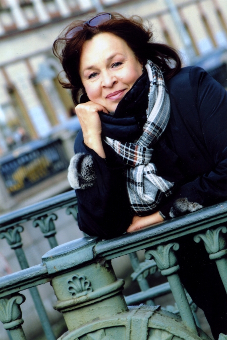

**ТАТЬЯНА КОЖЕВНИКОВА**

<figure></figure>

Родилась 16 июня в Курганской области. В 1979 году в Москве окончила театральное училище им. Б.Щукина, курс М.Р. Тер-Захарова. С 1980 г. по 1993 г. работала в Ленинградском Молодёжном театре на Фонтанке. Снималась в фильмах: «Встретимся в метро» (1983 г.) , «Гений» (1991 г.), «Смерть от любви» (1991 г.), т/с «Улицы разбитых фонарей», «Чёрный ворон» и др.

С 1999 года актриса Санкт-Петербургского Государственного драматического театра "КОМЕДИАНТЫ".

Занята в спектаклях:

<a href="91-les.html">«ЛЕС»</a> А.Островский - роль Улита

<a href="75-volshebnie-sosulki.html">"Волшебные сосульки"</a> М.Мокиенко - роль Мачеха

<a href="39-beda-ot-neghnogo-serdca.html">"Беда от нежного сердца"</a> В.Соллогуб - роль Дарья Семёновна

<a href="43-dachnici.html">"Дачницы"</a> В.Карасёв - роль Дуся

<a href="71-anekdoti.html">"Провинциальные анекдоты"</a> А.Вампилов - роль Васюта

<a href="41-v-paris.html">"В Париж!" </a>А.Чехов - роль Сваха

