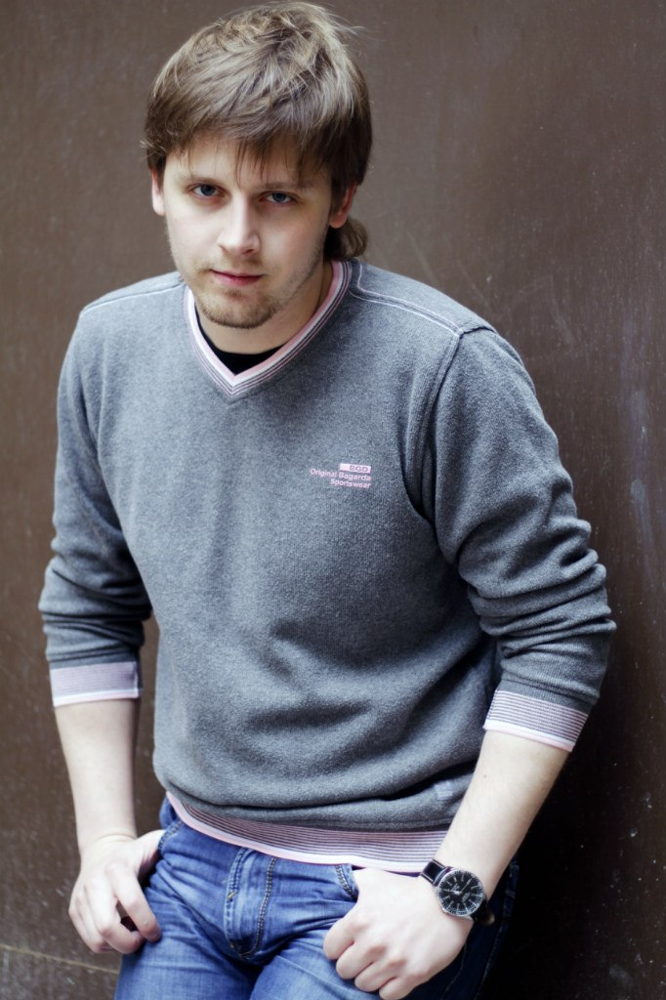

**ИЛЬЯ БЕЗРУК**

<figure></figure>

Родился 8 февраля 1986 года в городе Норильске. В 2007 году окончил Красноярскую Государственную Академию Музыки и Театра. Мастер курса - Ирина Борисовна Калиновская. С 2007 по 2008 год работал в Новгородском Академическом театре драмы имени Ф.М.ДОСТОЕВСКОГО. С 2008 по 2011 год работал в Ленинградском Областном Государственном Театре Юного Зрителя (ЛОГУК ТЮЗ). Снимался в фильмах: т/с "Время и люди", т/с "Счастливчик Пашка", т/ф "Почти весна" и др.

В 2011 году принят в труппу Санкт-Петербургского государственного драматического театра "КОМЕДИАНТЫ".

Занят в спектаклях:

<a href="71-anekdoti.html">«Провинциальные анекдоты»</a> А.Вампилов - роль Ступак

<a href="147-karlson.html">«Карлсон»</a> А.Линдгрен - роль Папа

<a href="97-pominalnaia-molitva.html">«Поминальная молитва»</a> Г.Горин - роль Трактирщик

<a href="60-sirano-de-bergerak.html">«Сирано де Бержерак»</a> Э.Ростан - роль Гвардеец

<a href="44-dyrochka.html">«Дурочка» </a>Лопе де Вега - роль Фенисо

<a href="39-beda-ot-neghnogo-serdca.html">«Беда от нежного сердца»</a> В.Соллогуб - роль Француз

<a href="90-ychilka.html">«Училка из будущего»</a> В.Ольшанский - роль Наладчик

<a href="41-v-paris.html">«В Париж!» </a>А.П.Чехов - роль Миша Бобов

<a href="75-volshebnie-sosulki.html">«Волшебные сосульки» </a>М. Мокиенко - роль Дед Мороз

<a href="45-exala-derevna-mimo-mushika.html">«Ехала деревня мимо мужика»</a> А.Исполатов - скоморох

<a href="282-kompromiss-sdovlatov.html">«Компромисс»</a> С.Довлатова - роли Хуберт, Мельдер

