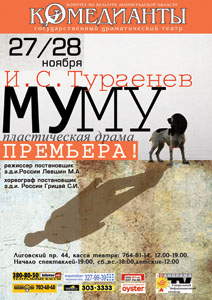

**

<figure></figure>

Театр «КОМЕДИАНТЫ» представляет 27 и 28 ноября в 18.00 ПРЕМЬЕРА! И. Тургенев <a href="46-mumu.html">"МуМу"</a> Пластическая драма.**

_Режиссер – постановщик з.д.и. России М. А. Левшин

Хореограф-постановщик з.д.и. России С.И. Грицай_

Известная всем с детства повесть предстанет в спектакле театра чередой пластических этюдов на фоне художественной инсталляции картин русских художников; музыкальным фоном спектакля режиссер избрал русский народный фольклор. «Немногословность» русского мужика, тяжело и много трудящегося, уходит корнями в сам уклад жизни крестьянской России, формировавшийся веками. Отсюда выбор жанра – «пластическая драма». Спектакль театра «Комедианты» практически без слов. В глухоту и немоту погружаются все обитатели усадьбы, и немота Герасима оказывается самой звенящей и пронзительной. Повесть о печальной судьбе двух одиноких существ – мужика и собаки, в постановке М. А. Левшина, наполнена простым человеческим сопереживанием и грустью. Оригинальная трактовка сочетает в себе современный пластические формы и самобытность и очарование народного фольклора. В спектакле заняты: **<a href="21-fillipp-azarov.html">Филипп Азаров</a>, <a href="86-alena-kiverskaia.html">Алена Киверская</a>, <a href="55-anatolii-ilchenko.html">Анатолий Ильченко</a>, <a href="23-belova-ekaterina.html">Екатерина Белова</a>, <a href="78-ylia-burceva.html">Юлия Бурцева</a>, <a href="65-larisa-klimova.html">Лариса Климова</a>, <a href="63-lyda-nikitina.html">Людмила Никитина</a>, <a href="64-asia-pigel-sergeevna.html">Анастасия Пижель</a>, <a href="89-olga-yakovleva.html">Ольга Яковлева</a>, <a href="24-blednyh-sergej.html">Сергей Бледных</a>, <a href="50-roman-pritula.html">Роман Притула</a>, <a href="51-stas-voronetski.html">Станислав Воронецкий</a>, <a href="66-vitalii-kravchenko.html">Виталий Кравченко</a>, Дмитрий Рудаков.**

20.10.2010

