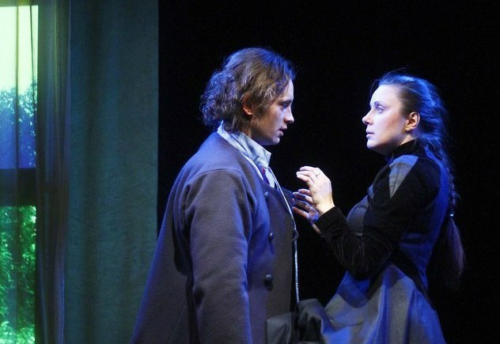
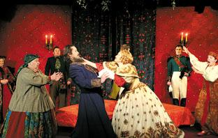
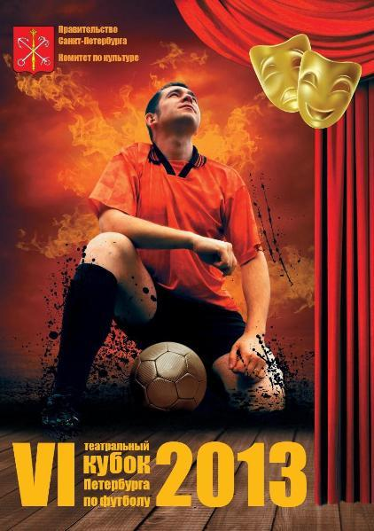
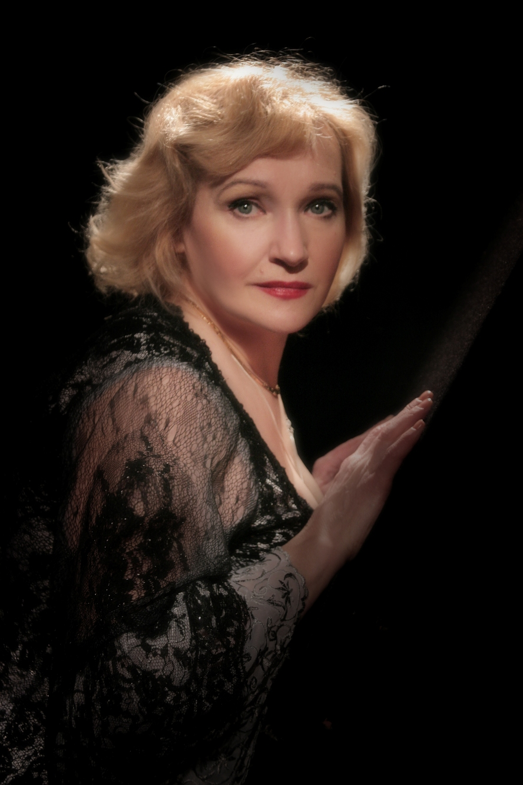
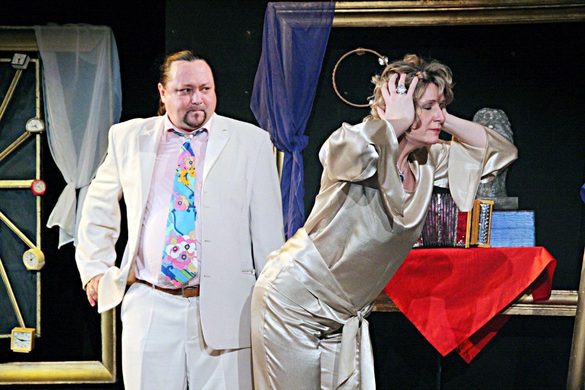
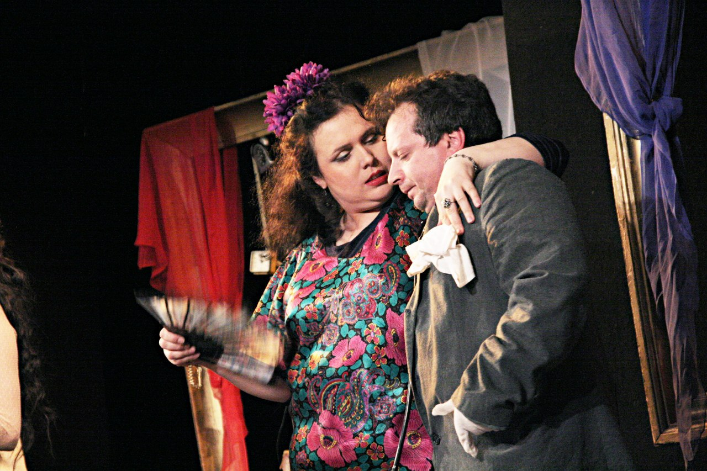
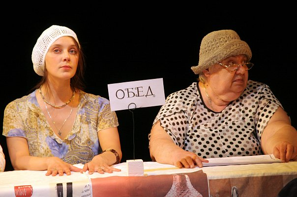
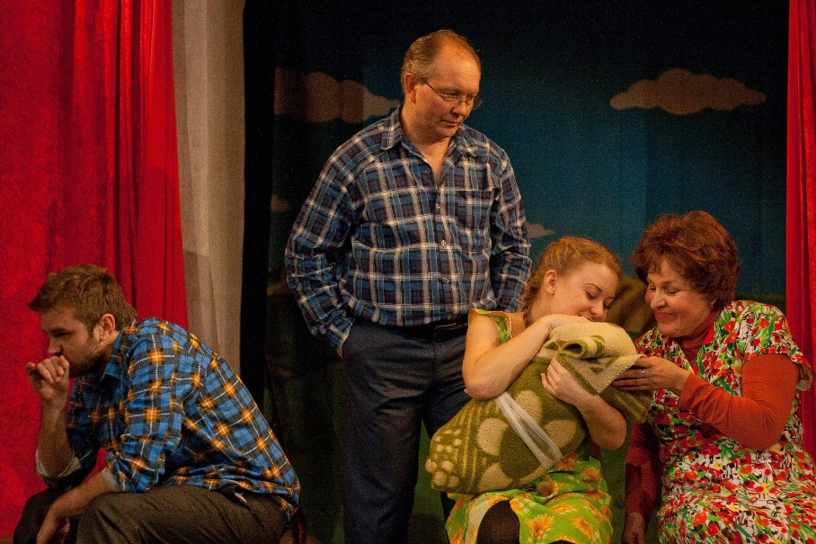
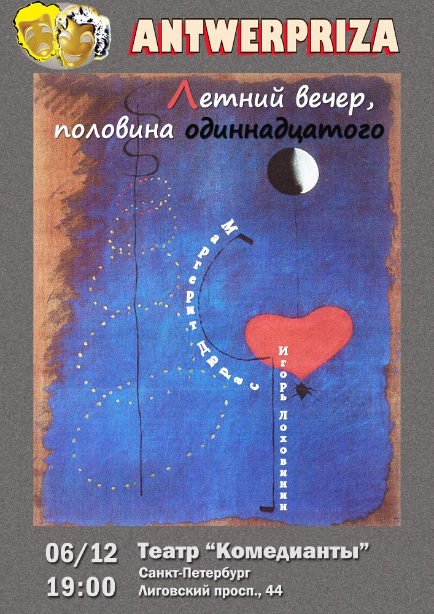
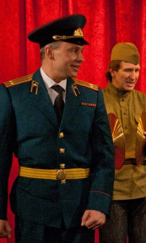

148-oslo.md
---
id: 148
title: МУМУ в Норвегии!
alias: oslo
modified: 2013-01-22 16:09:27
---

<figure></figure>

**21 октября** театр Комедианты показал пластическую драму<a href="46-mumu.html"> "МУМУ"</a> по повести И. Тургенева для норвежских зрителей в **Национальном театре г.Осло (Норвегия)**. Так же для юных зрителей Осло был представлен спектакль <a href="45-exala-derevna-mimo-mushika.html">"Ехала деревня мимо мужика"</a>.

<figure></figure>

<figure></figure>

<a href="152-oslo-viezd.html">ФОТО С ГАСТРОЛЕЙ В НОРВЕГИЮ</a>

25.10.2011

6-contacts.md
---
id: 6
title: Контакты
alias: contacts
modified: 2014-03-11 11:31:34
---

**Адрес:** 191040, г. Санкт-Петербург, Лиговский проспект, д. 44

<figure></figure>

**Касса театра:** 764-81-14

Групповые заявки принимаются по тел. 572-10-04

**Электронная почта:** komedianty.spb@gmail.com

**Администрация:**

adelveis1344@yandex.ru

**Телефоны:** (812) 572-10-04

**Факс:** (812) 764-70-16

Заместитель директора: Михайловцева Ольга Анатольевна

572-47-90

Главный администратор: Половинкина Людмила Алексеевна

572-10-04

Заведующий литературной частью: Шарова Борислава Борисовна

575-57-83

Заместитель директора по хозяйственной части: Ли Аста Моисеевна

764-71-16

Главный инженер: Носуля Валентин Иванович

764-71-16

Главный бухгалтер: Захарова Юлия Валерьевна

764-30-32

Начальник отдела кадров: Кузнецова Наталья Викторовна

764-30-32

Служебный вход: 572-10-03

**Транспорт:** ст.м. Площадь Восстания, ст.м. Лиговский пр.

**Наш адрес на карте:**

7-about.md
---
id: 7
title: О театре
alias: about
modified: 2012-12-21 19:39:27
---

<a href="17-history.html" title="История театра комедианты">ИСТОРИЯ ТЕАТРА</a>

<a href="113-zal.html">План расположения мест и раскладка цен на билеты</a>

<a href="38-2010-09-05-20-35-54.html" title="Технические параметры сцены">ТЕХНИЧЕСКИЕ ПАРАМЕТРЫ СЦЕНЫ</a>

<figure></figure>

8-za-kulisami.md
---
id: 8
title: Закулисье
alias: za-kulisami
modified: 2014-03-11 17:23:00
---

<a href="138-lohanq.html">**Идут репетиции спектакля "ФАРСЫ". Режиссёр - Алексей Исполатов.**</a>

**Идут репетиции спектакля "МАРЛЕН". Режиссёр - Михаил Левшин.**

<figure></figure>

<a href="117-foto-raznoe.html">Фото "РАЗНОЕ"</a>

<a href="288-gastroli-erevan.html">Фотоотчёт с гастролей в Армению (г. Ереван) октябрь 2013</a>

<a href="240-foto-iz-germanii-mymy.html">Фотоотчёт с гастролей в Германию (г. Оберкохен) октябрь 2012</a>

<a href="208-foto-iz-trabzona-mymy.html">Фотоотчёт с гастролей в Турцию (г. Трабзон) май 2012</a>

<a href="152-oslo-viezd.html">Фотоотчёт с гастролей в Норвегию (г. Осло) октябрь 2011</a>

<a href="118-foto-polsha.html">Фотоотчёт с гастролей в Польшу . апрель 2009</a>

<a href="95-2011-06-23-09-15-19.html">Фото с Юбилея театра "Комедианты" 20 лет!</a>

<a href="210-video.html">**ВИДЕО**</a>

306-krepostnaialovemumusubkultura.md
---
id: 306
title: Крепостная любовь (МУМУ) статья / СубКультура""
alias: krepostnaialovemumusubkultura
modified: 2014-02-05 19:15:50
---

**О спектакле <a href="46-mumu.html">"Крепостная любовь"</a> (Муму) театра "Комедианты"**

**"СУБКУЛЬТУРА"**

Субботним вечером в театре «**Комедианты**» вниманию зрителей была представлена **пластическая драма** <a href="46-mumu.html">«**Крепостная любовь**»</a> по мотивам известной абсолютно всем с самого детства повести Ивана Сергеевича **Тургенева** «**Муму**».

<figure></figure>

Государственный драматический театр «**Комедианты**», обладатель многочисленных наград, чьи постановки высоко оцениваются как в нашей стране, так и за рубежом, уже не первый год радует петербургскую публику своими великолепными спектаклями. Благодаря своему удачному расположению в самом центре Петербурга на Лиговском проспекте недалеко от площади Восстания и Московского вокзала зрителями театра являются не только жители, но и гости нашего города. Зал театра небольшой, вытянутый по ширине, и имеет всего лишь 4 ряда в глубину с небольшим проходом между сценой и креслами, что само по себе создаёт ощущение вовлечённости зрителей театра в действие. Такая конфигурация зала позволяет гостям театра стать не только зрителями, но как бы и участниками спектакля, оказавшимися в гуще событий. На мой взгляд, это придаёт постановкам нечто особенное и неординарное, в чём мне и удалось удостовериться 18 января, оказавшись на спектакле «**Крепостная любовь**».

«**Крепостная любовь**» является не просто очередной современной трактовкой повести **Тургенева**. Казалось бы, что ещё можно придумать особенного, о чём сказать на эту досконально изученную тему, о которой уже столько написано? Но, несмотря на кажущуюся простоту изложения и трагизм сюжетной линии повести «**Муму**», режиссёру <a href="153-mihail-levshin.html">Михаилу Александровичу Левшину</a> своей сценической работой удалось доказать, что актуальность повести и её востребованность не угасла и по сей день. Подтверждение тому: к 6-ти часам вечера в зрительском зале не было уже ни одного свободного места. Режиссеру удалось взглянуть на проблему с другого ракурса – он сделал упор на чувства и эмоции героев, что безусловно находит отклик петербургской публики.

<figure></figure>

«Зачем Герасим утопил **Муму**?» Над этим извечным вопросом продолжают ломать головы как уже далеко не первое поколение школьников на уроках литературы, так и современные литературные и театральные критики, историки и другие деятели культуры и искусства, изучающие эпоху крепостничества на Руси. В спектакле поднимаются довольно серьёзные проблемы, которые не решены и поныне. Среди них затронуты и острые социальные вопросы: от алкоголизма и угнетения рядовых граждан власть имущими до упадка морально-этических норм и ценностей в обществе, где подхалимство и желание угодить во всём, превозносится над справедливостью, личным достоинством и честностью. Люди готовы пойти на что угодно вплоть до самоистязания плетью и найти в любой ситуации козла отпущения, чтобы постараться хоть как-то выгородить себя и, не дай-то Бог, остаться виноватым перед своей госпожой.

Жанр **пластической драмы** для спектакля «**Крепостная любовь**» был выбран не случайно. Данное сценическое направление, основоположником которого считается литовский театральный режиссёр и заслуженный артист России Гедрюс Казимирович Мацкявичюс, является гибридным экспериментальным жанром. Данный жанр сочетает в себе, что следует из названия, как драматическую, так и пластическую составляющую, подразумевая практически полное отсутствие словесной передачи. В постановках подобного рода делается акцент не на речевое, а на интуитивное, чувственное восприятие, отдавая предпочтение языку жестов и мимике, чем раскрывается как эмоциональная, так и духовная сторона персонажей.

<figure></figure>

Таким образом, повесть **Тургенева** показана зрителям как бы глазами глухонемого Герасима, для которого весь мир состоит лишь из образов и движений, а все диалоги актёров представляют собой по большей части нечленораздельное мычание, и только в редких случаях допускаются отдельные фразы. Единственным исключением остаются песни, сопровождающие спектакль от начала и до самого конца, в которых отражены не только картины жизни простого русского народа, но и некоторые пояснения и даже части сюжета. Более того, являясь неотъемлемой чертой русской фольклорной культуры, песни наряду с танцами настолько гармонично вписываются в «**Крепостную любовь**», что теперь уже даже сложно себе представить, как вообще в этой постановке можно было бы обойтись без них, ведь именно через них передаются чувства и эмоции героев. И самым ярким примером, подтверждающим мои слова, является песня после финальной сцены, в которой Герасим (<a href="21-fillipp-azarov.html">Филипп Азаров</a>) топит **Муму**. В ней чувствуется вся боль и страдания русского народа, угнетённого и лишённого свободы. А во время спектакля она звучала настолько трогательно и пронзительно, что зрители покидали зал с глазами полными слёз.

В спектакле «**Крепостная любовь**» особое внимание уделяется именно крепостному быту и жизненному укладу русского народа середины XIX века, а не сюжетной линии повести, в которую к тому же были внесены некоторые дополнения. В качестве примера можно привести предисловие, повествующее о жизни барского двора до того, как Герасим был выписан из деревни на службу дворником-сторожем. Особый режиссёрский взгляд на повесть «**Муму**» коснулся и образов самих героев пьесы. Например, на мой взгляд, очень интересным решением стало введение в постановку портрета барина, возведённого барыней (<a href="89-olga-yakovleva.html">Ольгой Яковлевой</a>) в ранг святых, на который она молилась ежечасно, почитая её как главную домашнюю святыню, превратив портрет в икону. Её капризы и упования на горькую судьбу после смерти мужа, а также напускная жалость к самой себе, щедро приправленные корыстным участием в её страданиях обитателей двора, делают её не столько причиной всех бед и невзгод жителей двора, сколько, наоборот, являются следствием их бессилия и неспособности хоть что-то изменить. А отсутствие гордости и самоуважения, выраженное в желании угодить и прельстить, лишь только подкрепляет её маленькую власть и усугубляет самодурство. Не зря говорят, что народ достоин той власти, которую он имеет.

<figure></figure>

Дворецкий Гаврила <a href="24-blednyh-sergej.html">(Сергей Бледных</a>) предстаёт перед зрителями в виде отставного офицера с солдатским характером и выправкой. В отличие от героя повести «**Муму**» в «**Крепостной любви**» Гаврила показан скорее суровым надзирателем, строго и беспощадно наказывающим всех (и даже себя), кто попал в немилость к барыне, нежели рассудительным дипломатом, который старается без особого шума и суеты обставить во дворе все дела так, чтобы и барыне угодить, и Герасима усмирить, и самому крайним не остаться. Прачка Татьяна (<a href="86-alena-azarova.html">Алёна Азарова</a>) в сравнении с героиней повести, живущей у барыни по принципу «что воля, что неволя – всё равно», в спектакле предстаёт далеко не безразличной ко всему, а, наоборот, очень чувственной и эмоциональной влюблённой девушкой, безумно страдающей от неминуемой разлуки с милым её сердцу Герасимом. И после таких режиссёрских правок уже никто не удивился, когда в начале второго акта лай куклы-собаки начала озвучивать та же Алёна Азарова. «Реинкарнация» Татьяны в обличии **Муму** стала вполне логичным и символичным решением, выглядевшим как второй шанс, данный Герасиму, чтобы снова обрести свою хрупкую «**Крепостную любовь**».

Также хотелось бы отметить, что в спектакле «**Крепостная любовь**» были впервые использованы видеопроекторы, дополняющие постановку визуальными эффектами и видеорядом картин русской жизни в качестве иллюстраций. Такое нововведение безусловно привнесло в спектакль элемент наглядности, позволив зрителям проникнуться ещё глубже духом той эпохи.

<figure></figure>

Формально постановка поделена антрактом на два действия, как бы разделяющим сюжет на жизнь до и после появления **Муму**. Но если судить по общему построению драмы, то спектакль можно композиционно поделить не на два, а на три акта. В начале спектакля описывается жизнь барского двора до Герасима, указывающая на явные предпосылки его появления, как, например, воровство картины. Во втором действии разыгрывается любовная драма между Герасимом и Татьяной. И, наконец, в заключительном действии разворачивается трагическая история собачки **Муму**, которой, видимо, на роду было написано стать утопленницей. Но по злой иронии судьбы гибель настигла **Муму** не от рук хозяев, бросивших её в мешке в канаву, а от рук её спасителя.

Цифра 3 также фигурирует и в горькой судьбе самого Герасима, разделяя её на три этапа, больше похожих на круги ада, пройдя которые ему удаётся освободиться от рабской службы. Сначала Герасима лишают своего дома и любимого дела, которое он не только любил, но и которое спорилось у него лучше всех, обязав прислуживать барыне и выполнять работу, с которой смог бы справиться в принципе любой. Затем его разлучают с любимой девушкой, выдав её замуж за другого человека просто потому, что так захотелось барыне. И в довершении всего, его лишают последней радости жизни - любимой собаки, вынудив его своими же собственными руками убить существо, единственной виной которого по официальной версии было то, что она лаяла по ночам на прохожих, чем мешала спать барыне. Но по факту за то, что она посмела не подчиниться воле барыни, что на фоне поголовного беспрекословного повиновения выглядело чем-то невообразимым и немыслимым.

<figure></figure>

Прошло более 150 лет после отмены крепостного права, несколько раз в стране менялась власть и политический строй, но изменилось ли что-то с тех пор? Всё так же «барыни» издают законы и отдают приказы, мало задумываясь о том, какие последствия повлечёт за собой их исполнение, не говоря уже про заботу о нуждах народа и учёт интересов своих сограждан. Но в то же время в спектакле в лице Герасима показаны такие черты русского народа, как смирение, терпеливость и выносливость. Одним словом, народный дух и несгибаемая воля. Но у любого терпения есть пределы, и наша история знает немало примеров, когда чаша этого терпения переполнялась, и какие последствия это возымело потом. И после этого вы ещё спрашиваете, зачем Герасим утопил **Муму**?

Литература, как и история, не имеет сослагательного наклонения. Можно сколько угодно размышлять на тему того, что бы произошло, если бы Герасим не утопил **Муму**, а просто ушёл с ней в свою родную деревню. Такие риторические вопросы, как «Кто виноват?» и «Что делать?» безответны по своей сути, и будут извечны, покуда народ будет одурманен «опиумом» настолько, что просто перестанет чувствовать свои беды, виновником которых он сам и является. Но есть вопросы, ответы на которые можно и даже нужно дать хотя бы для самого себя и желательно прямо сейчас. Поэтому после спектакля мы ненадолго задержались, чтобы пообщаться со зрителями и актёрами театра, поделиться с ними впечатлениями от спектакля и узнать их точку зрения как касательно постановки, так и по некоторым общим вопросам.

**Никита, массажист.**

Могу сказать, что мне понравилось. Спектакль очень эмоциональный, очень живой. Удалось почувствовать атмосферу крепостного права. Русские народные песни, звучавшие в спектакле, лучше всего передают дух русского народа, порабощённого многие годы, придают силу спектаклю. Я даже почувствовал некий посыл. И песни – это прямо то, что нужно, чтобы передать этот посыл, мне так кажется.

Такие спектакли нацелены на то, чтобы придать больше русской духовности современному искусству и обратить больше внимания зрителей к нашей истории, нашей культуре. Я не могу сказать, нужны ли такие спектакли людям в сложившейся в последнее время ситуации в России. Так сложно говорить за общество, за массы. Мне кажется, что режиссёр должен решать, нужно это или нет. И, наверное, выдержав проверку временем, будет понятно, насколько это будет нужно и востребовано публикой. Но как зритель могу сказать, что мне нравится, когда есть духовность.

Я думаю, что постановка в жанре **пластической драмы** нисколько не портит, а даже, наоборот, дополняет повесть. Сложилось такое впечатление, что всё хорошо, всё так и должно быть. Ничего ни убрать, ни добавить. Больше песен, меньше слов. Я бы посмотрел ещё какой-нибудь спектакль в таком же жанре.

**Виктория, Олеся, Анна, Александр.**

Мы первый раз в этом театре. Нам всё очень понравилось. Мы под впечатлением и в шоке! Слишком много эмоций, поэтому просто нет слов. Эмоциональность зашкаливала. В конце даже плакали.

Безусловно, театру не хватает возрождения такой традиции, как исполнение русских народных песен! Нам не хватает русской культуры, возрождения. Культуры России не хватает. А это как маленький шажок вперёд к возрождению.

**<a href="78-ylia-burceva.html">Юлия Бурцева</a>, актриса (в спектакле исполняла роль Ульки).**

_- Каково переживать каждый раз на сцене такую трагедию?_

- Нам нужны эмоции. Мы без них не можем. Без них очень скучно. Поэтому переживать для нас эти эмоции нормально. Это необходимая вещь. Как математику решать уравнения, нам необходимо испытывать эмоции. И, конечно, делиться ими со зрителем.

Напоследок мы предлагаем вам вернуться мыслями обратно к спектаклю и посмотреть фотоотчёт Натальи Дубовик: <a href="http://sub-cult.ru/index.php/foto/teatr/1876-18-01-2014-krepostnaya-lubov-spb-dramaticheskiy-teatr-komedianty.html">ссылка</a>

<figure></figure>

"СубКультура" / 18.01.2014 г. / Автор: Михаил Прошутинский aka Parachute

<a href="http://sub-cult.ru/index.php/foto/teatr/1876-18-01-2014-krepostnaya-lubov-spb-dramaticheskiy-teatr-komedianty.html">Ссылка на статью</a>

<figure></figure>

305-v-gostyh-u-komediantov.md
---
id: 305
title: в гостях у Комедиантов театр кураж" и театр "эксперимент"."
alias: v-gostyh-u-komediantov
modified: 2014-01-29 10:15:34
---

<figure></figure>

Дорогие зрители! Представляем Вам дорогих гостей нашего театра - театр "Кураж" и театр "Эксперимент"

12 февраля в 19.00 театр "Эксперимент со спектаклем "«**ТРАНЗИТНЫЙ ПАССАЖИР»** (лирическая комедия по пьесе Л. Исабекова)

Режиссер – з.а. России Виктор Харитонов

Исполнители: н.а. России Татяна Пилецкая, Леонид Зябкин, Игорь Заливалов, Александр Барсуков

В ролях: з.а. России Виктор Харитонов, з.а. России Лариса Пилипенко

Герой пьесы, после отдыха в Крыму, взял обратный билет на авиа-рейс через родной город,чтобы заглянуть в тот дом, в ту квартиру, где 20 лет назад прошли незабываемые годы его жизни.

Хозяйка квартиры, не столь радушная в начале, сменяет гнев на милость и …

13 февраяо в 19.00 спектакль **"ИГРА В ДЖИН"** (Д. Кобурн)

трагифарс

<figure></figure>

Режиссер-постановщик – В. Сиваков

Трудно определить жанр спектакля – комедия ? Трагедия ? Драма ? Фарс ?.. Пожалуй, и то, и другое, и третье, и четвертое… События разворачиваются в американском доме престарелых и , казалось бы, у героев пьесы все в прошлом – семья, работа, друзья, любовь…Но жизнь, как хороший драматург, очень часто преподносит нам такие сюрпризы !… В спектакле заняты петербургские актеры, которых вы могли видеть и на экранах ваших телевизоров и на сценах питерских театров –Юрий Агейкин и Людмила Лубенская.

29.01.2014

299-igra-v-djin.md
---
id: 299
title: Игра в джин
alias: igra-v-djin
modified: 2013-12-12 13:12:55
---

Дорогие зрители! Представляем Вам дорогих гостей нашего театра - театр "Кураж"!

17 декабря и 28 января спектакль **"ИГРА В ДЖИН"** (Д. Кобурн)

трагифарс

Режиссер-постановщик – В. Сиваков

<figure></figure>

Трудно определить жанр спектакля – комедия ? Трагедия ? Драма ? Фарс ?.. Пожалуй, и то, и другое, и третье, и четвертое… События разворачиваются в американском доме престарелых и , казалось бы, у героев пьесы все в прошлом – семья, работа, друзья, любовь…Но жизнь, как хороший драматург, очень часто преподносит нам такие сюрпризы !… В спектакле заняты петербургские актеры, которых вы могли видеть и на экранах ваших телевизоров и на сценах питерских театров –Юрий Агейкин и Людмила Лубенская.

12.12.2013

295-mumu-diplom-viborg-lychshi-ansambl.md
---
id: 295
title: Лучший актёрский ансамбль
alias: mumu-diplom-viborg-lychshi-ansambl
modified: 2013-12-02 11:57:25
---

Спектакль<a href="46-mumu.html"> "Крепостная любовь" (Муму)</a> награждён дипломом **"За лучший актёрский ансамбль"** на "1-ом фестивале театральных и музыкальных проектов камерных экспериментальных форм" (Театральный марафон) в г. Выборге. (2013 г.)

<figure></figure>

1.12.2013 г.

279-reportajspbtv.md
---
id: 279
title: репортаж от телеканала Санкт-Петербург
alias: reportajspbtv
modified: 2013-11-01 20:36:50
---

<figure>{youtube:http://www.youtube.com/watch?v=cTTTQYokETI&amp;feature=related 480 360}</figure>

280-plani.md
---
id: 280
title: Планы на сезон 2013-2014
alias: plani
modified: 2013-07-07 17:48:59
---

**Театр "Комедианты" к театральному сезону 2013-2014.**

Премьеры сезона 2013-2014:

**«Компромисс»** (С. Довлатов). Режиссер – Глеб Володин, художественный руководитель постановки – заслуженный деятель искусств РФ Михаил Левшин, музыкальное оформление - Наталья Высоких, художник - Екатерина Угленко.

**«Земляки»** (В. Шукшин). Режиссер – заслуженный деятель искусств РФ Михаил Левшин, художник - Мария Смирнова-Несвицкая, музыкальное оформление Веры Трошневой - песни советских времен.

Художественный руководитель театра <a href="153-mihail-levshin.html">Михаил Левшин</a>:

<figure></figure>

«Первой премьерой 24-го сезона станет спектакль «Компромисс». Эскиз к этому спектаклю с нашими актерами стал лауреатом фестиваля-лаборатории ON.ТЕАТР 2012 гг. сразу в двух номинациях "Лучший режиссер" - Глеб Володин и "Лучшая мужская роль" - Евгений Баранов. Сейчас мы переносим эскиз на нашу сцену и ожидаем полноценную интересную работу.

Второй по дате выхода, но не по значимости, для нас станет премьера спектакля по рассказам Василия Шукшина под рабочим названием «Земляки». Это сложная длительная работа, мы берем несколько рассказов, без инсценировки, то есть это отдельные истории, которые будут объединены в композицию. Можно не мудрствовать лукаво, а просто ударить в гонг или объявить следующий рассказ по радиотрансляции, но мы пойдем своим путем. Зрительный зал и сцена театра «Комедианты» ненадолго превратятся в сельский клуб далекой русской глубинки, где демонстрируют свои музыкальные способности наши «земляки». Песня всегда сопровождала русского человека, и в печали, и в радости. И вот начинает звучать, например, колыбельная в исполнении участника одного из рассказов - «Спи мой воробушек, спи мой сыночек, спи мой звоночек родной…» И тут спазм подступает к горлу героя от несправедливости - его дочь недавно родила ему внука, только вот кто отец неизвестно, наотрез отказывается говорить… и тут начинается история. И каждый раз мы находим оригинальный способ, когда песня перерастает в диалог, обсуждение и, в конце концов, в историю. Для нас важно найти такое решение – чтобы это получился не литературный театр, а действие, где зритель все время ощущает себя участником некоего представления, чтобы вокруг диалогов нарастала настоящая жизнь.

Шукшин – автор, который сохранил для нас русский характер, тот, который сейчас уходит в небытие, но его безусловная ценность и важность именно сегодня, подвигает нас снова и снова обращаться к его рассказам. Недаром его сборник рассказов назывался «Святые души». Исчезла деревня, но еще живы прекрасные душой, настоящие русские мужики, мы их узнаем, мы хотим их помнить, чудных – «чудаков».

Мы начали однажды – и продолжаем, и будем продолжать ставить спектакли о России. Чехов, Островский, теперь Шукшин и Довлатов – ведь это об одном – кто мы такие? Вопрос осознания себя, русского человека, с нашей историей, с нашими горестями и радостями. Что это такое – современный российский человек – важно понять это, и только поняв это, попытаться научиться жить.

Кроме того есть экспериментальные проекты – спектакли **«Фарсы»** (по средневековым фарсам) и **«Марлен, рожденная для любви»** (о жизни и творчестве Марлен Дитрих), я бы пока назвал это нашими пробами, мы еще находимся в творческом поиске. Как только найдем, сразу подробно расскажем.

В 24-м сезоне мы активизируем международные проекты. Первые гастроли в октябре пройдут в Ереване (Армения) со спектаклем **<a href="46-mumu.html">«Крепостная любовь»</a>** в рамках HIGH FEST International Performing Arts Festival. В начале ноября мы покажем спектакль **<a href="45-exala-derevna-mimo-mushika.html">«Ехала деревня мимо мужика»</a>** и концертную программу в Париже для русскоязычных детей со всех концов Франции, занимающихся театральным искусством в рамках международного фестиваля "Русское слово. Русская душа". А уже в конце ноября мы примем на своей сцене гостей из Бельгии - русскоязычный театр Antwerpriza из города Антверпен.

Так же в следующем сезоне зрителей ожидают сюрпризы! В театре обновится фойе – роспись стен под руководством главного художника театра Полины Левшиной и оригинальное решение фотогалереи от нашего фотохудожника Светланы Пь. А литературная часть театра сейчас работает над созданием журнала «Комедианты» - о нашем театре и не только, эксклюзивные материалы, фото и видео для наших зрителей. Мы расширяем горизонты и осваиваем большие площадки – в следующем сезоне Вы сможете увидеть любимые спектакли на сцене Театра Комедии им. Акимова и Малого Драматического Театра До встречи в новом сезоне!

Ваши «Комедианты».

<figure></figure>

7.07.2013г.

281-kirilldateshidze.md
---
id: 281
title: Кирилл Датешидзе
alias: kirilldateshidze
modified: 2013-07-10 19:23:50
---

**КИРИЛЛ ДАТЕШИДЗЕ**

<figure></figure>

Родился 22 сентября 1946 года. В 1972 году закончил Ленинградский Государственный институт театра, музыки и кинематографии. Играет в разных театрах г. Санкт-Петербурга (Антреприза Миронова, Театр им.Акимова, Приют Комедианта и т.д.). Снимался в фильмах: "Бандитский Петербург", "Настоятель-2", "Попытка к бегству", "Честь", "Третий дубль" и т.д.

С 2008 года сотрудничает с Санкт-Петербургским государственным драматическим театром «КОМЕДИАНТЫ».

Занят в спектаклях:

<a href="44-dyrochka.html">«Дурочка»</a> Лопе де Вега - роль Октавьо

<a href="42-volki-i-ovci.html">«Волки и овцы»</a> А.Островский - роль Лыняев

<a href="72-trigorin.html">«Записные книжки Тригорина»</a> Т.Уильямс - роль Сорин

<a href="97-pominalnaia-molitva.html">«Поминальная молитва»</a> Г.Горин - роль Лейзер Вольф

<figure></figure>

253-sirano-de-berzherak-pressa-2007.md
---
id: 253
title: Сирано де Бержерак в театре КОМЕДИАНТЫ" ("Петербургский театральный журнал" №1 (47) 2007 г.)"
alias: sirano-de-berzherak-pressa-2007
---

<figure></figure>

**Э. Ростан. «Сирано де Бержерак». Театр «Комедианты». Режиссер Михаил Левшин, художник Александр Орлов**

Снова «Комедианты». Спектакль «Сирано де Бержерак» идет уже 10 лет, но жив. Маленькая сцена театра использована с умом и со вкусом. Легкие занавеси, несколько стульев, две ложи, обвитые какой-то искусственной растительностью и театральные маски на стенах. А. Шимко очень хорош в роли Сирано. У него замечательно выразительные, умные, злые глаза. Он, действительно, гениальный поэт, «бретер и забияка». Он непритворно любит. Тут, правда, начинаешь сомневаться в его уме. Потому что такую Роксану такой Сирано любить как будто не должен. Она красивая, но дура. Роксана, а не актриса Е. Культина. Про актрису понять что-либо трудно, кроме того, что она очень гордится своими волосами.

Спектакль не неприятный, но многое обескураживает. Например, в программке указан перевод Щепкиной-Куперник, а добрую половину текста, произносимого со сцены, составляет перевод В. Соловьева. Многие персонажи вымараны, а их текст отдан другим. Например, Сирано в начале устраивает взбучку не бездарному актеру Монфлери, а доброму Рагно, который пробует себя на сцене. О том, что Сирано пишет Роксане письма вместо Кристиана, знают все, ну, то есть Ле Бре и Рагно, которые здесь постоянно рядом с поэтом. Сирано в этом спектакле вовсе не одинок. Де Гиш не мерзавец. Роксана, опять же, простите, дура. Но стихи прекрасные. И актеры, особенно Шимко, умеют их красиво и осмысленно читать. И хотя «режиссерский крой» остался мне лично неясен, спектакль произвел хорошее впечатление, прежде всего, потому, что спустя 10 лет его все еще играют искренне, страстно, с полной отдачей, без усталости и цинизма. В театре подобные случаи — огромная редкость.

Вывод.

Новое задание «Петербургского театрального журнала» оказалось для меня крайне полезным. Я поняла, во-первых, что я безнадежный интеллектуальный сноб, во-вторых, что реальный театр это не то, что я думала раньше, и, в-третьих, что моя профессия народу в принципе не нужна. Ему и без меня в театре хорошо. А уж актерам с режиссерами и подавно.

Екатерина Гороховская

"Петербургский театральный журнал" №1 (47) 2007 г.

255-pressa-premera-les-recenziya.md
---
id: 255
title: Рецензия Людмилы Филатовой на спектакль ЛЕС""
alias: pressa-premera-les-recenziya
modified: 2013-02-20 17:48:48
---

**"В ПЕРВОМ РЯДУ."**

<figure></figure>

Театр обновил не только здание Первая премьера после ремонта в театре «Комедианты» – музыкальная комедия по пьесе А.Н. Островского <a href="91-les.html">«Лес»</a> в постановке <a href="153-mihail-levshin.html">Михаила Левшина</a> – серьёзная заявка на обновление не только здания, но и художественного курса театра. Маленький театр на Лиговке в кругу профессионалов считается консервативным: здесь любят классику, режиссёрские операции над ней всегда осторожны, а роли, напротив, выстраиваются тщательно, в подчёркнуто бенефисной манере а-ля ХIX век. К тому же и размеры зала, и ограниченность бюджета (не секрет, что статус «областных» заставляет несколько петербургских театров не столько жить, сколько выживать) порой не дают возможности воплотить задуманное, отбрасывают вполне достойный коллектив в разряд «провинциальных», «домашних»… Первой ласточкой грядущего обновления стал прошлогодний спектакль <a href="46-mumu.html">«МуМу»</a> (сейчас <a href="46-mumu.html">"Крепостная любовь"</a>), серьёзная и глубокая работа, получившая признание в Европе. И вот теперь – <a href="91-les.html">«Лес»</a>, гимн актёрской профессии, одна из самых репертуарных пьес «русского Шекспира». Сегодня в Петербурге можно увидеть «Лес» романтический (Театр на Литейном), «Лес» концептуальный (Театр им. Ленсовета), «Всё тот же Лес» (театр «Буфф»)… Привозил нашумевший «Лес» Кирилла Серебренникова МХТ им. Чехова, телеканал «Культура» неоднократно демонстрировал вариант московского Театра Сатиры… Но есть смысл посмотреть и <a href="91-les.html">«Лес»</a> Левшина. Поклонники могут быть спокойны: театр верен себе – никаких отчаянно радикальных преобразований пьеса не претерпела. Сохранена главная коллизия, сюжетные линии, система персонажей, знакомые с детства репризы… Однако жанровое переключение (комедия — музыкальная комедия) оказалось важным предлагаемым обстоятельством для трактовки в целом. При всём уважении к автору, режиссёр выстраивает собственную историю, в которой комизм извлекается не из собственно текста, не из вульгарного «осовременивания» и даже

<figure></figure>

не из несоответствия текста картинке, а из законов «опереточного» жанра, где есть обязательная примадонна, герой-любовник, простак, наперсница, резонёр… Автором либретто стал Вадим Жук – поэт, гений капустника, человек редкого дарования и поразительного остроумия. Ему удалось сочинить тексты песен, которые тянет назвать «зонгами» в память о театре, которому была небезразлична судьба страны. О музыке Владимира Дашкевича, композитора именитого, напишут специалисты: скажу лишь, что есть несколько мелодий, которые зритель будет напевать про себя, обдумывая спектакль по дороге домой. В итоге <a href="91-les.html">«Лес»</a> Левшина, с его абсурдистскими куплетами и ариями, во многом ближе каноническому жанру комедии, чем драматургический оригинал.

На сцене (художник Полина Левшина) – простенький, приблизительный антураж условной «гостиной»: столик с резными ножками, кресло, две «старинные» люстры. Справа – чучела лесных животных, слева – вешалка для костюмов. Не сразу видишь четыре экрана за лёгкими занавесками: а на них то вспыхивает манящая зелёная рощица, то падают осенние листья,то сдержанно улыбаются натурщицы. Но Гурмыжской (<a href="25-mewaninova-nina.html">Нина Мещанинова</a>) вообще не важно оформление сцены. Главное для неё – эффектный выход («Раиса Павловна Гурмыжская!» – торжественно объявляет верный старый помреж Карп (Юрий Агейкин). У <a href="25-mewaninova-nina.html">Нины Мещаниновой</a>, известной петербуржцам исполнительницы романсов, очень выразительный, сильный, красивый голос. Тем страннее, как могла её героиня, эта взрослая, талантливая, пышно и роскошно одетая (смена туалетов предусмотрена неоднократно) женщина всерьёз увлечься мальчишкой Алексисом?! Андрей Вергелис («Этюд-театр») точнейшим образом играет сегодняшнего хипстера, завсегдатая кофеен с зоной Wi-Fi, постепенно превращающегося в условного Галкина, обнаглевшего от успеха, но катастрофически несвободного. Линия Аксюши – Петра сыграна, к сожалению, не так интересно, но это не вина молодых актёров <a href="78-ylia-burceva.html">Юлии Бурцевой</a> и <a href="66-vitalii-kravchenko.html">Виталия Кравченко</a>. Однозначно положительные роли самые трудные. Блестящий же дуэт Несчастливцев – Счастливцев (Андрей Шимко – <a href="52-sergei-nikolaev.html">Сергей Николаев</a>) заслуживает отдельного разбора, не в рамках газетной рецензии…

<figure></figure>

Пьеса Островского не стала для театра «Комедианты» ни материалом для прямого социального анализа, ни поводом для модного эксперимента. Но спектакль определённо обозначил действительный этап на пути к остросовременному, актуальному и прежде всего человечному театру.

Автор рецензии: Людмила Филатова

февраль 2013 / автор: Л.Филатова

138-lohanq.md
---
id: 138
title: ФАРСЫ
alias: lohanq
modified: 2013-12-06 19:32:03
---

Идут репетиции

**"ФАРСЫ"**

**Средневековые фарсы**

Режиссёр-постановщик - <a href="53-aleksei-ispolatov.html">Алексей ИСПОЛАТОВ</a>

В спектакле заняты:

<a href="78-ylia-burceva.html">Юлия БУРЦЕВА</a>

<a href="80-tatiana-kogevnikova.html">Татьяна КОЖЕВНИКОВА</a>

Елизавета ЧЕРНОВА

Евгений ТАЛАШМАНОВ

208-foto-iz-trabzona-mymy.md
---
id: 208
title: Фото с гастролей в Турцию (г.Трабзон)
alias: foto-iz-trabzona-mymy
modified: 2012-10-14 19:55:54
---

**Фотоотчёт с гастролей в Турцию (г.Трабзон)**

**<a href="46-mumu.html">"МУМУ"</a> на "13-ом Международном Черноморском театральном фестивале"**

**Май 2012**

<figure></figure>

<figure></figure>

<figure></figure>

<figure></figure>

<figure></figure>

<figure></figure>

<figure></figure>

<figure></figure>

<figure></figure>

<figure></figure>

<figure></figure>

<figure></figure>

<figure></figure>

<figure></figure>

<figure></figure>

<figure></figure>

<figure></figure>

<figure></figure>

<figure></figure>

<figure></figure>

<figure></figure>

48-chernovaelizaveta.md
---
id: 48
title: Елизавета Чернова
alias: chernovaelizaveta
modified: 2013-12-15 23:07:54
---

**ЕЛИЗАВЕТА ЧЕРНОВА**

<figure></figure>

Родилась 17 ноября 1991 года в г. Санкт-Петербург. В 2005 году закончила детскую театральную студию при Санкт-Петербургском театре "Зазеркалье".В 2008 году закончила детскую театральную студию "Дуэт".В 2012 году закончила Санкт-Петербургский Государственный Университет,кафедра "театрального искусства",мастерская нар.артиста России В.В.Лобанова.

С 2012 года занята в спектаклях Санкт-Петербургского государственного драматического театра «КОМЕДИАНТЫ».

Занята в спектаклях:

<a href="97-pominalnaia-molitva.html">«Поминальная молитва»</a> Г.Горин - роль Бейлке

<a href="44-dyrochka.html">«Дурочка»</a> Лопе де Вега - роль Селья

<a href="40-bris-ili-istoria-kota-filifeia.html">«Брысь,или истории кота Филофея»</a> В. Зимин – роль Офелия

<a href="60-sirano-de-bergerak.html">«Сирано де Бержерак» </a>Э.Ростан - роль Монашка

<a href="282-kompromiss-sdovlatov.html">«Компромисс»</a> С.Довлатова - роль Эви Саксон

49-ylia-gorshenina.md
---
id: 49
title: Юлия Горшенина
alias: ylia-gorshenina
modified: 2013-10-20 23:51:52
---

**ЮЛИЯ ГОРШЕНИНА**

<figure></figure>

Родилась 6 октября 1974 года в Ленинграде . В 1982–1992 гг. пела в Ленинградском детском хоре Радио и Телевидения . В 1993–1997 гг. СПГУП, училась на актёрско - режиссёрском курсе З.Я.Корогодского . В 1997 году перевелась в Санкт-Петербургскую Академию культуры и искусств на курс В.П.Маркова по специальности «режиссура драмы» (год окончания 1998г.) Имеет дополнительное образование - аспирантура СПбГАТИ по специальности «актёрское мастерство», курс В.В.Петрова . В 2000-2003 гг. работала на радио «Северная Столица»: автор и ведущая программы «Секретные материалы». Снималась в фильмах : «Чёрный ворон» , «Закон мышеловки» , т/с«Гаишники» , «Цвет пламени» , «Янтарный барон» , «Дубля не будет» , «Груз», х/ф «Ключ Саламандры» и др.

С 1998 года актриса Санкт-Петербургского государственного драматического театра «КОМЕДИАНТЫ» .

Занята в спектаклях:

<a href="97-pominalnaia-molitva.html">«Поминальная молитва»</a> Г.Горин - роль Цейтл

<a href="76-kicik-micik-i-mari.html">«Кыцик,Мыцик и тётушка Мари»</a> Е.Чеповецкий – роль тётушка Мари

<a href="71-anekdoti.html">«Провинциальные анекдоты»</a> А.Вампилов - роль Марина

<a href="70-vor.html">«Не всякий вор - грабитель»</a> Дарио Фо - роль Анна

<a href="40-bris-ili-istoria-kota-filifeia.html">«Брысь!или истории кота Филофея»</a> В.Зимин – роль Офелия

<a href="75-volshebnie-sosulki.html">«Волшебные сосульки»</a> М.Мокиенко – роль Грушенька

<a href="39-beda-ot-neghnogo-serdca.html">«Беда от нежного сердца»</a> В.Соллогуб - роль Машенька

<a href="282-kompromiss-sdovlatov.html">«Компромисс»</a> С.Довлатова - роль Белла Константиновна

<figure></figure>

<figure></figure>

46-mumu.md
---
id: 46
title: КРЕПОСТНАЯ ЛЮБОВЬ (Муму)
alias: mumu
modified: 2014-02-05 19:08:43
---

**Иван Тургенев**

**«КРЕПОСТНАЯ ЛЮБОВЬ» 12+**

Пластическая драма по повести И. С. Тургенева "Муму"

Режиссер–постановщик Заслуженный деятель искусств России

<a href="153-mihail-levshin.html">**Михаил ЛЕВШИН**</a>

Хореограф-постановщик Заслуженный деятель искусств России

**Сергей ГРИЦАЙ**

**О спектакле М. А. Левшина «Крепостная любовь».**

Слово – серебро, а молчание – золото…

Спектакль «Крепостная любовь» - это история о любви. События происходят в помещичьей усадьбе, где правит бал своенравная Барыня и ее прислужники. Чувства, возникшие между главными героями пьесы, Герасимом и крепостной Татьяной чисты и трогательны. Но, герои живут в мире, в котором нет свободы и где любовь – всего лишь непозволительная роскошь. И бороться за нее не хватает воли.

«Немногословность» русского мужика, отдававшего всего себя непосильному труду, уходит корнями в сам уклад жизни крестьянской России, формировавшийся веками. Отсюда выбор жанра – «пластическая драма». Спектакль театра «Комедианты» практически без слов. В глухоту и немоту погружаются все обитатели усадьбы, и немота Герасима оказывается самой звенящей и пронзительной.

Песни - народный фольклор – полноценная часть действия. Своеобразный визуальный ряд - проекция картин русских художников. Так возникают изображения усадьбы, реки, военных действий – это есть суть художественного оформления спектакля.

Оригинальная трактовка сочетает в себе современные пластические формы и самобытность и очарование народного фольклора.

**О создателях спектакля:**

Режиссер – постановщик – заслуженный деятель искусств России, основатель и главный режиссер театра «Комедианты» <a href="153-mihail-levshin.html">**Михаил Александрович Левшин**</a>. Автор спектаклей театра «Волки и овцы» по А. Островскому, «Записные книжки Тригорина» по Т. Уильямсу, «В Париж» по А.Чехову и др. Постановки М.А.Левшина вызывают одинаковый интерес и у широкой публики, и у требовательных специалистов, приглашаются на самые престижные фестивали страны.

Хореограф – постановщик - заслуженный деятель искусств России, хореограф, режиссёр по пластике, **Сергей Иванович Грицай**. Лауреат Государственной премии Российской Федерации в области литературы и искусства, лауреат Всесоюзных конкурсов (1984, 1988), лауреат Национальной театральной премии России «Золотая Маска» и других престижных премий.

Страны, где играли "Муму":

Норвегия (г.Осло), Германия (г.Оберкохен), Турция (г.Трабзон), Армения (г. Ереван).

Призы и награды:

«Приз зрительских симпатий - 2010» Санкт-Петербургского общества **«ТЕАТРАЛ»** в номинации - **ЛУЧШИЙ СПЕКТАКЛЬ ГОДА**.

СПЕЦИАЛЬНЫЙ ПРИЗ ЭКСПЕРТНОГО СОВЕТА ЗА **"ЛУЧШИЙ ДЕБЮТ"** высшей театральной премии Санкт-Петербурга **«ЗОЛОТОЙ СОФИТ»** сезона 2010 - 2011 - <a href="86-alena-azarova.html">**Алёна АЗАРОВА**</a> за роль Татьяны.

**Главный приз "Хрустальный Трабзон"** на "13-ом Черноморском Международном Театральном Фестивале" в г.Трабзон (Турция) (2012 г.).

Диплом **"За лучший актёрский ансамбль"** на "1-ом фестивале театральных и музыкальных проектов камерных экспериментальных форм" (Театральный марафон) в г. Выборге. (2013 г.)

В спектакле заняты:

Герасим - <a href="21-fillipp-azarov.html">Филипп АЗАРОВ</a>

Татьяна - <a href="86-alena-kiverskaia.html">Алёна АЗАРОВА </a>

Барыня - <a href="89-olga-yakovleva.html">Ольга ЯКОВЛЕВА </a>

Капион - <a href="55-anatolii-ilchenko.html">Анатолий ИЛЬЧЕНКО</a> / Станислав ОСКОЛКОВ

Любовь Любимовна - <a href="65-larisa-klimova.html">Лариса КЛИМОВА</a>

Антипка - <a href="50-roman-pritula.html">Роман ПРИТУЛА</a>

Гаврила - <a href="24-blednyh-sergej.html">Сергей БЛЕДНЫХ</a>

Фимка - <a href="23-belova-ekaterina.html">Екатерина БЕЛОВА </a>

Улька - <a href="78-ylia-burceva.html">Юлия БУРЦЕВА</a>

Кастелянша - <a href="63-lyda-nikitina.html">Людмила НИКИТИНА</a>

Устинья - <a href="64-asia-pigel-sergeevna.html">Анастасия ПИЖЕЛЬ </a>

Ерошка - <a href="51-stas-voronetski.html">Станислав ВОРОНЕЦКИЙ</a>

Степан - <a href="66-vitalii-kravchenko.html">Виталий КРАВЧЕНКО</a>

Харитон - <a href="84-talashmanovevgenii.html">Евгений ТАЛАШМАНОВ</a>

Пресса о спектале "Крепостная любовь" ("МуМу"):

<a href="306-krepostnaialovemumusubkultura.html">О спектакле "Крепостная любовь" (Муму) / "СубКультура" (автор: М.Прошутинский)</a>

<a href="298-talantsilafilippazarovpressakomedianti.html">"Талант+сила=Филипп Азаров" Интервью исполните главной роли Герасима в спектакле "Крепостная любовь" (журнал "Комедианты")(автор:В.Демянская)</a>

<a href="109-mymy-pressa-3.html">Крепостное право на фоне "МуМу", или что сказал Герасим ("Деловой Петербург") (автор: Игорь Шнуренко)</a>

<a href="294-pressa-mymy-2013.html">"Фантазии на трёх скамейках" о спектакле "Крепостная любовь" (МУМУ) (журнал "Невский Театраль" №2 (02)) автор: Борис Шаров</a>

<a href="110-mymy-pressa-5.html">Закрытие 21 сезона "МуМу" в Лодейном Поле (газета "ВЕСТИ") (автор: Борислава Шарова)</a>

<a href="111-mymy-pressa-4.html">Не о МУМУ писал Тургенев - о России (газета "НЕВСКОЕ ВРЕМЯ") (автор:Елена Добрякова)</a>

<a href="107-mymy-pressa.html">"Если спектакль талантлив" (о "МуМу" в "Комедиантах") Электронный театральный журнал "Этажи" (автор: Павел Чердынцев)</a>

<a href="108-mymy-pressa-2.html">"МуМу" в "Комедиантах" Газата Ленинградской области "ВЕСТИ" (автор: Борислава Шарова)</a>

<a href="236-mymy-v-germanii.html">"КОМЕДИАНТЫ" в ОБЕРКОХЕНЕ (Германия) Mymy (издание "Schwäbische Post")(перевод)</a>

<a href="237-mumuv-oberkohene-pressa.html">"КОМЕДИАНТЫ" оставили в Германии двойственное чувство /Mymy(издание "Schwabische.de")(перевод)</a>

<figure>{youtube:http://www.youtube.com/watch?v=GtpdgTMOVDE 510 383}</figure>

<figure></figure>

<figure></figure>

<figure></figure>

<figure></figure>

<figure></figure>

<figure></figure>

<figure></figure>

<figure></figure>

<figure></figure>

Спектакль идёт **2** часа **30** мин. с одним антрактом.

Премьера спектакля состоялась **27** ноября **2010** года.

251-interviy-les-aksinia-i-petr.md
---
id: 251
title: интервью Ю.Бурцевой и В.Кравченко о спектакле ЛЕС""
alias: interviy-les-aksinia-i-petr
modified: 2013-01-22 16:32:40
---

**ПЁТР и АКСИНЬЯ**

**

<figure></figure>

**

**Журналист:** Хочется спросить, как для Вас начиналась работа над этим спектаклем.

**Юлия Бурцева:** На сборе труппы нам сказали, что будет ставиться спектакль Лес, он будет музыкальный. В роли Аксиньи будет Юлия Бурцева…

**Виталий Кравченко:** Ерунда, что мы однокурсники, друг друга уже знаем много лет, а играть любовь.

**Журналист:** И как оно играется?

**Юлия Бурцева:** Прекрасно. Очень хорошо.

**Виталий Кравченко**: Спасибо мастерам, педагогам.

**Журналист:** Вы ученики одного мастера? А кто Ваш мастер?

**Юлия Бурцева:** Шведерский Анатолий Самойлович.

**Журналист:** И всё-таки со знакомым человеком легче играется?

**Виталий Кравченко:** Не знаю как ей, мне - да, гораздо.

**Юлия Бурцева:** Наверное, да.

**Журналист:** Сегодня какой был спектакль?

**Юлия Бурцева:** Тяжёлый.

**Журналист:** С чем это связано?

**Юлия Бурцева:** Не знаю. Так как у нас маленький зал и зритель очень близко, очень много зависит от восприятия зрителя. Мне кажется, что у нас единственный театр, который качает зал…

**Виталий Кравченко:** Или зал качает нас.

**Юлия Бурцева:** Да. Сегодня был достаточно странный, тяжёлый зал, на мой взгляд. Мы сыграли только два спектакля и прошлый, 15-го числа был на много легче. Зал смеялся, он начал смеяться почти сразу, реагировал и мы… понеслись.

**Виталий Кравченко:** Дело даже не в смехе, а дыхание зала - чувствуется отдача, и понимаешь - туда или не туда.

**Юлия Бурцева:** Сегодня зал был тяжелей. Может быть это связано с тем, что педагоги пришли, что какая-то ответственность…

**Журналист:** Какая это Ваша по счёту роль?

**Юлия Бурцева:** Не знаю, я не считала. У нас много ролей. Чем у нас хорошо, тем, что ты приходишь, молодой артист, и ты можешь играть, сколько тебе влезет. Куда хочешь вводиться. Можешь подойти к режиссёру и сказать: - Знаете, я хочу ввестись в этот спектакль. Он говорит: - Ну, попробуй. И ролей очень много, разных.

**Виталий Кравченко:** А что, можно было?

**Юлия Бурцева:** А ты не знал?

**Журналист:** Вы такой на сцене лирический, упёртый в одну единственную идею этой девушки, на которой вы хотите жениться.

**Виталий Кравченко:** Кажется, об этом как раз и история наша, что надо «переломить» отца и , несмотря на все препятствия, бороться за счастье.

**Журналист:** В отрицательных ролях актёры ищут что-то положительное. У Вас положительная роль, а есть ли в нём что-нибудь отрицательное?

**Виталий Кравченко:** Самая отрицательная черта та, которую озвучивает отец вначале: - Сынок - овца овцой. Когда нужно бороться… Здесь, мне кажется, Островский молодец, что он настолько это прописал. В принципе, в первой редакции Леса персонажа Петра не было.

**Журналист:** А Аксинья действительно решилась покончить счёты с жизнью?

**Юлия Бурцева:** Да, действительно. Иначе это ничего не стоит.

**Виталий Кравченко:** Иначе она одна из этих…

**Юлия Бурцева:** Иначе, она - одна из них, из этих масок. Так построен спектакль: есть маски, люди, которые живут по одним канонам и люди, которые живут по другим канонам. И мы, Пётр и Аксинья, Несчастливцев, Счастливцев, мы честные. Если мы топимся, то топимся; если любим, так любим. Мы должны быть положительные. У нас могут быть отрицательные качества…

**Виталий Кравченко:** С ними нужно бороться.

**Юлия Бурцева:** Может быть это трусость, может быть где-то малодушие, слабость, но мы с ними боремся, иначе не будет контраста, потому что они с ними не борются… И об этом был спектакль. По крайней мере, я думаю, что он должен быть об этом.

**Журналист:** Спасибо.

Театральный видеожурнал "Подмостки в Петербурге" / 6 января 2013 г.

<a href="http://theatre.inspb.ru/Interviews_with_the_actors/292.html">ссылка на статью (видео)</a>

12-komnews.md
---
id: 12
title: Новости
alias: komnews
modified: 2010-06-25 20:04:19
---

Театр «Комедианты» отпраздновал свой двадцатилетний юбилей!

В рамках юбилейных торжеств прошла "Неделя бенефисов" ведущих артистов театра. 9 февраля открыл праздничную неделю бенефис ведущего артиста театра Максима Сергеева – «Страсти по-итальянски», этим спектаклем 20 лет назад открылся театр «Комедианты». 10 февраля, прошел бенефис актера и режиссера Алексея Исполатова "Воли и овцы" (трагикомедия в 2-х действиях). 11 февраля- бенефис Валерия Полетаева "Женитьба" (совершенно невероятное происшествие), 12 февраля - бенефис Вадима Прохорова, премьера "Прогулка в ЛЮ-БЛЁ" (комедия в 2-х действиях). Завершила "Неделю бенефисов" вечер заслуженной актрисы России Нины Мещаниновой "Записные книжки Тригорина" (интерпретация пьесы «Чайка» А. П. Чехова в 2-х действиях).

15 февраля в Доме Актера прошел творческий юбилейный вечер театра.

Юбиляры принимали поздравления от друзей, коллег, правительства и законодательного собрания Ленинградской области. Зоя Желдина, первый заместитель председателя комитета по культуре, выразила слова благодарности руководству и артистам театра, всем тем, кто на протяжении 20 лет вносил и вносит свой вклад в становление областного драматического театра «Комедианты». Со сцены звучали добрые пожелания от друзей из Выборга, Лодейного Поля, Пикалево, а также представителей областного Правительства.

Так же поздравить театр пришли коллеги из театров города и области. И, конечно, своих зрителей поздравлял сам театр – артисты «Комедиантов» показали оригинальный и остроумный капустник о своем режиссере и учителе – Михаиле Левшине и об основании любимого театра. 

13-komkrikdushi.md
---
id: 13
title: Крик души
alias: komkrikdushi
modified: 2014-01-20 22:09:04
---

Всех меценатов, спонсоров и просто ЧЕЛОВЕКОВ, любящих театр, приглашаем к сотрудничеству!

Подробную информацию о наших проектах Вы можете узнать:

- посетив наш сайт: **www.komedianty.com**
- написав нам письмо по адресу: **komedianty.spb@gmail.com**
- позвонив по тел. **(812) 572-47-90** или **(812)572-10-04**
- группа Вконтакте : <a href="http://vk.com/teatrkomediantispb">**http://vk.com/teatrkomediantispb**</a>

Мы открыты к любому общению. Готовы рассмотреть самые фантастические предложения. Вместе с нами Вы сможете окунуться в загадочный мир театра, его закулисье и зазеркалье. Вы полюбите ТЕАТР, а мы полюбим Вас, и это взаимное чувство обязательно принесет свои плоды.

<figure></figure>

Наши проекты.

Главное и любимое наше детище - благотворительный театральный фестиваль «Дворцы Санкт- Петербурга – детям». С 1992-го года мы каждую осень приглашаем детей-сирот, воспитанников детских домов и школ-интернатов Санкт - Петербурга и области в различные особняки и дворцы города, в интерьерах которых проходят детские спектакли. Нам необходима Ваша поддержка и помощь в проведении этого фестиваля в виде средств на аренду помещений, в которых проходят спектакли или на сладкие подарки детям. Ребята, лишенные родителей, испытывают острый дефицит положительных эмоций и с особой радостью и восторгом откликаются на праздник, который можете подарить им ВЫ!

Наш театр много гастролирует по России. Приобщение зрителей российской глубинки к драматическому искусству культурной столицы – важная часть нашей работы. Если Вы поддержите любые из наших гастролей, мы с радостью пригласим Вас поехать с театром в увлекательное путешествие! Мы гарантируем, что Вы не сможете остаться равнодушными, увидев благодарность в глазах наших зрителей, услышав ее в их аплодисментах!

Участие в театральных фестивалях за рубежом, открывает массу новых путей для культурного сотрудничества. Мы дружим с театральными организациями Германии, Норвегии, Франции, Италии и Испании. Ваша помощь в международных проектах – это неоценимая поддержка в продвижении русской культуры за рубежом!

Мы за внедрение инновационных технологий в творческий процесс. Наши двери всегда открыты для интересных идей и проектов! Например, в 2007 году спектакль «В Париж!» представлял Санкт-Петербург на ежегодном Интернет-фестивале «Театральная паутина». Трансляция спектаклей велась из зрительного зала в Интернет.

Принимая участие в жизни нашего театра, вы приобретете новых друзей и получите массу положительных эмоций! А мы, в свою очередь, расскажем о Вашей поддержке во всех доступных нам информационных ресурсах. Двери нашего театра всегда будут открыты для Вас и ваших детей!

Именно Вы можете проложить путь к новым оригинальным проектам и осуществить самые интересные творческие идеи вместе с нами!

С надеждой и наилучшими пожеланиями,

коллектив театра «КОМЕДИАНТЫ»

<figure></figure>

Санкт-Петербург 191040 Лиговский проспект, 44

2008 - 2014 © ТЕАТР «КОМЕДИАНТЫ»

<figure></figure>

14-komgastroli.md
---
id: 14
title: Гастроли
alias: komgastroli
modified: 2014-02-18 11:49:40
---

Театр "КОМЕДИАНТЫ" часто совершает гастрольные поездки за рубеж (Таллинн, Витебск, Рига, Минск, Брест, Париж, Антверпен, Вроцлав… / **ГЕРМАНИЯ**, **ФРАНЦИЯ**, **НОРВЕГИЯ**, **ТУРЦИЯ** и т.д.) и принимает на своей сцене гостей из других стран в рамках культурного обмена. Из самых ярких визитов можно отметить гастроли Государственного Драматического Центра Стратбурга, вроцлавского Театра Формы и витебского Национального академического драматического театра имени Якуба Коласа. С 2006 года театр активно работает в Провинции Антверпен (Бельгия), где проводит мастер-классы показывает свои спектакли.

**ДАЛЬНЕЕ ЗАРУБЕЖЬЕ**

**2014** февраль - ГЕРМАНИЯ (г. Берлин, г.Гамбург, г.Ессен, г.Ганновер) : спектакль <a href="147-karlson.html">«Карлсон»</a>.

**2013** ноябрь - ФРАНЦИЯ (г. Париж) : спектакль <a href="45-exala-derevna-mimo-mushika.html">"Ехала деревня мимо мужика".</a>

**2013** октябрь - АРМЕНИЯ (г. Ереван) : спектакль <a href="46-mumu.html">«Крепостная Любовь» (МуМу)**.**</a>

**2012** октябрь - ГЕРМАНИЯ (г. Оберкохен) : спектакль <a href="46-mumu.html">«Крепостная Любовь» (МуМу)**.**</a>

**2012** май - ТУРЦИЯ (г. Трабзон) : спектакль <a href="46-mumu.html">«Крепостная Любовь» (МуМу) .</a>

**2011** октябрь - НОРВЕГИЯ (г. Осло) : спектакль <a href="46-mumu.html">«Крепостная Любовь» (МуМу)</a>, спектакль для детей <a href="45-exala-derevna-mimo-mushika.html">«Ехала деревня мимо мужика»</a> , концерт заслуженной артистки России <a href="25-mewaninova-nina.html">Нины Мещаниновой.</a>

**2010** ноябрь - ФРАНЦИЯ (г.Париж) : спектакль <a href="73-progulka-v-ly-blio.html">«Прогулка в Лю-блё»</a> .

**2009** апрель - ПОЛЬША (г.Вроцлав) : спектакль <a href="41-v-paris.html">«В Париж!»</a>.

**2008** апрель - БЕЛЬГИЯ (г.Антверпен, г.Тюрнхаут) : спектакль <a href="41-v-paris.html">«В Париж!»</a>, концерт заслуженной артистки России <a href="25-mewaninova-nina.html">Нины Мещаниновой</a>.

**2006** декабрь - ЛАТВИЯ (г.Рига) : спектакль <a href="44-dyrochka.html">«Дурочка»</a>, спектакль <a href="59-strasti-po-italianski.html">«Страсти по-итальянски»</a>.

**2001** апрель - ФРАНЦИЯ (г.Париж) : спектакль «Чехов на Диване» , «Петербургский романс» .

**СТРАНЫ СНГ**

**2002** октябрь - БЕЛОРУССИЯ (г.Брест, г.Минск) : спектакль <a href="44-dyrochka.html">«Дурочка»</a>, спектакль <a href="59-strasti-po-italianski.html">«Страсти по-итальянски»</a>, спектакль <a href="39-beda-ot-neghnogo-serdca.html">«Беда от нежного сердца»</a>.

**РОССИЯ**

**2013**

НОЯБРЬ - г.Выборг : спектакль <a href="46-mumu.html">"Крепостная любовь" (Муму).</a>

ОКТЯБРЬ - г. Пикалёво : спектакль <a href="97-pominalnaia-molitva.html">"Поминальная молитва".</a>

МАЙ - г. Петрозаводск (р.Карелия): спектакль <a href="41-v-paris.html">«В Париж!»</a>, спектакль <a href="69-genitba.html">«Женитьба»,</a> спектакль для детей <a href="147-karlson.html"> «Карлсон»</a>, спектакль <a href="46-mumu.html">«Крепостная Любовь» (МуМу)**.**</a>

МАРТ - г. Кириши: спектакль <a href="74-kot-v-sapogah.html">«Кот в сапогах»</a>.

МАРТ - г. Пикалёво: спектакль <a href="60-sirano-de-bergerak.html">«Сирано де Бержерак».</a>

ЯНВАРЬ - г.Боровичи: спектакль <a href="44-dyrochka.html">«Дурочка».</a>

**2012**

СЕНТЯБРЬ - г.Пикалёво : спектакль <a href="46-mumu.html">«Крепостная Любовь»(МуМу) .</a>

АПРЕЛЬ - г.Кириши: спектакль для детей <a href="147-karlson.html"> «Карлсон».</a>

**2011**

МАРТ - г. Пикалёво : спектакль <a href="39-beda-ot-neghnogo-serdca.html">«Беда от нежного сердца».</a>

ОКТЯБРЬ - г. Подпорожье : спектакль <a href="43-dachnici.html">«Дачницы».</a>

ОКТЯБРЬ - г. Пикалёво : спектакль <a href="69-genitba.html">«Женитьба».</a>

МАЙ - г. Лодейное поле : спектакль <a href="46-mumu.html">«Крепостная Любовь»(МуМу).</a>

НОЯБРЬ - г.Череповец : спектакль <a href="59-strasti-po-italianski.html">«Страсти по-итальянски».</a>

**2010**

ОКТЯБРЬ - г.Подпорожье : спектакль <a href="44-dyrochka.html">«Дурочка».</a>

ОКТЯБРЬ - г. Луга : спектакль <a href="42-volki-i-ovci.html">«Волки и овцы».</a>

НОЯБРЬ - г. Пикалёво : спектакль <a href="44-dyrochka.html">«Дурочка».</a>

НОЯБРЬ - г. Кириши : спектакль <a href="60-sirano-de-bergerak.html">«Сирано де Бержерак».</a>

ДЕКАБРЬ - г. Тосно : спектакль <a href="44-dyrochka.html">«Дурочка».</a>

**2008**

ИЮНЬ - г. Омск: спектакль <a href="72-trigorin.html">«Записные книжки Тригорина»</a>, спектакль <a href="59-strasti-po-italianski.html">«Страсти по-итальянски»</a>, спектакль <a href="44-dyrochka.html">«Дурочка».</a>

**2005**

ФЕВРАЛЬ - г. Хабаровск: спектакль «Все кошки серы», спектакль <a href="44-dyrochka.html">«Дурочка»</a>, спектакль <a href="70-vor.html">«Не всякий вор - грабитель»</a>, спектакль для детей <a href="45-exala-derevna-mimo-mushika.html">«Ехала деревня мимо мужика»</a>.

**2003**

МАРТ - г. Москва: спектакль «Венецианский купец», спектакль <a href="69-genitba.html">«Женитьба».</a>

**2001**

ДЕКАБРЬ -ЯНВАРЬ - г.Череповец: спектакль «Мешок смеха».

ЯНВАРЬ - Набережные Челны: спектакль <a href="59-strasti-po-italianski.html">«Страсти по-итальянски»</a>, спектакль <a href="39-beda-ot-neghnogo-serdca.html">«Беда от нежного сердца»</a>, спектакль для детей <a href="45-exala-derevna-mimo-mushika.html">«Ехала деревня мимо мужика».</a>

АПРЕЛЬ - Турне по городам Ленинградской области: спектакль <a href="44-dyrochka.html">«Дурочка»</a> , спектакль «Школьная Смехопанорама», спектакль для детей <a href="45-exala-derevna-mimo-mushika.html">«Ехала деревня мимо мужика».</a>

МАЙ - г.Тобольск: спектакль <a href="44-dyrochka.html">«Дурочка»</a>, спектакль <a href="59-strasti-po-italianski.html">«Страсти по-итальянски»</a> , спектакль для детей <a href="74-kot-v-sapogah.html">«Кот в сапогах».</a>

ИЮНЬ - г.Ростов-на-Дону: спектакль <a href="59-strasti-po-italianski.html">«Страсти по-итальянски».</a>

**2000**

АПРЕЛЬ - г.Кандалакша: спектакль для детей <a href="45-exala-derevna-mimo-mushika.html">«Ехала деревня мимо мужика»</a>.

МАЙ - г.Нижний Новгород: спектакль <a href="59-strasti-po-italianski.html">«Страсти по-итальянски»</a>, спектакль <a href="39-beda-ot-neghnogo-serdca.html">«Беда от нежного сердца»</a>, спектакль для детей <a href="45-exala-derevna-mimo-mushika.html">«Ехала деревня мимо мужика»</a>, спектакль для детей <a href="75-volshebnie-sosulki.html">«Волшебные сосульки»</a>.

ОКТЯБРЬ - города Подмосковья: спектакль <a href="59-strasti-po-italianski.html">«Страсти по-итальянски».</a>

ДЕКАБРЬ - г.Выборг: спектакли <a href="60-sirano-de-bergerak.html">«Сирано де Бержерак»</a>, спектакль <a href="59-strasti-po-italianski.html">«Страсти по-итальянски»</a> , спектакль для детей <a href="45-exala-derevna-mimo-mushika.html">«Ехала деревня мимо мужика»</a> , «Школьная Смехопанорама».

**1999**

ФЕВРАЛЬ - Березники, Пермь: спектакли <a href="39-beda-ot-neghnogo-serdca.html">«Беда от нежного сердца»</a> , «Барская спесь, или Анютины глазки», <a href="60-sirano-de-bergerak.html">«Сирано де Бержерак»</a>, <a href="59-strasti-po-italianski.html">«Страсти по-итальянски»</a>, <a href="45-exala-derevna-mimo-mushika.html">«Ехала деревня мимо мужика»</a> , «Сказка о четырёх близнецах».

АПРЕЛЬ - МАЙ - Тобольск, Ноябрьск, Когалым, Нижневартовск : <a href="59-strasti-po-italianski.html">«Страсти по-итальянски»</a> , <a href="39-beda-ot-neghnogo-serdca.html">«Беда от нежного сердца»</a> , <a href="45-exala-derevna-mimo-mushika.html">«Ехала деревня мимо мужика»</a>, «Сказка о четырёх близнецах», <a href="75-volshebnie-sosulki.html">«Волшебные сосульки»</a>.

ИЮНЬ - Великий Новгород: <a href="59-strasti-po-italianski.html"> «Страсти по-итальянски»</a>, <a href="39-beda-ot-neghnogo-serdca.html">«Беда от нежного сердца»</a>, «Барская спесь, или Анютины глазки» , <a href="45-exala-derevna-mimo-mushika.html">«Ехала деревня мимо мужика»</a>, <a href="75-volshebnie-sosulki.html">«Волшебные сосульки»</a>.

ИЮЛЬ - Вольск (Саратовская обл.), Ульяновск

**1998**

МАЙ - Кострома, Июнь Самара, Июль Астрахань

**1997**

ФЕВРАЛЬ - г. Архангельск: <a href="59-strasti-po-italianski.html">«Страсти по-итальянски»</a>, <a href="39-beda-ot-neghnogo-serdca.html">«Беда от нежного сердца»</a>, «Барская спесь, или Анютины глазки», <a href="60-sirano-de-bergerak.html">«Сирано де Бержерак»</a>, <a href="45-exala-derevna-mimo-mushika.html">«Ехала деревня мимо мужика»</a>, «Калиф-аист» .

МАЙ - ИЮНЬ - Ставропольский край: Невинномысск, Ставрополь, Ессентуки, Пятигорск, Кисловодск, Ростов-на-Дону: <a href="59-strasti-po-italianski.html">«Страсти по-итальянски»</a>, <a href="39-beda-ot-neghnogo-serdca.html">«Беда от нежного сердца»</a>, «Барская спесь, или Анютины глазки», <a href="60-sirano-de-bergerak.html">«Сирано де Бержерак»</a>, <a href="45-exala-derevna-mimo-mushika.html">«Ехала деревня мимо мужика»</a>, «Калиф-аист», «Петербургский романс» .

ДЕКАБРЬ - Нижний Новгород, Чебоксары: <a href="59-strasti-po-italianski.html">«Страсти по-итальянски»</a>, <a href="39-beda-ot-neghnogo-serdca.html">«Беда от нежного сердца»</a>, «Барская спесь, или Анютины глазки», <a href="60-sirano-de-bergerak.html">«Сирано де Бержерак»</a>, <a href="45-exala-derevna-mimo-mushika.html">«Ехала деревня мимо мужика»</a>, «Сказка о четырёх близнецах».

**1996**

НОЯБРЬ - г. Северодвинск: <a href="59-strasti-po-italianski.html">«Страсти по-итальянски»</a>, <a href="39-beda-ot-neghnogo-serdca.html">«Беда от нежного сердца.</a>

Санкт-Петербург 191040 Лиговский проспект, 44

2008 - 2014 © ТЕАТР «КОМЕДИАНТЫ»

<figure></figure>

15-komfestivals.md
---
id: 15
title: Фестивали
alias: komfestivals
modified: 2013-12-05 20:43:12
---

<figure></figure>

Каждый год с 1992 года, по традиции в последнюю неделю ноября, театр «Комедианты» при поддержке Правительства Ленинградской области проводит благотворительный фестиваль **«Дворцы Санкт-Петербурга – детям»**.

**2013** Спектакль <a href="46-mumu.html">"Крепостная любовь" (Муму) </a>участвовал в Театральном Марафоне "1-ом фестивале театральных и музыкальных проектов камерных экспериментальных форм" и награждён дипломом в номинации "За лучший актёрский ансамбль" (г.Выборг).

**2013** Спектакль <a href="45-exala-derevna-mimo-mushika.html">"Ехала деревня мимо мужика"</a> участвовал в международном фестивале “Русское слово, русская душа” в городе Париже (Франция).

**2013** Спектакль <a href="46-mumu.html">«Крепостная любовь» (МуМу)</a> участвовал в международном фестивале под названием "HIGH FEST International Performing Arts Festival" в городе Ереване (Армения).

**2013** Спектакль <a href="147-karlson.html">«Карлсон»</a> учавствовал в VII театральном фестивале «Всеволожская весна» (г.Всеволожск).

**2012** Спектакль <a href="46-mumu.html">«Крепостная любовь» (МуМу)</a> участвовал в "13 Международном Черноморском театральном фестивале" в г. Трабзон - Турция ("13.Uluslararasi Karadeniz Tiyatro Festivali").Театр "Комедианты" с постановкой <a href="46-mumu.html">«Крепостная любовь» (МуМу)</a> признан Оргкомитетом самым лучшим из всех представленных на фестивале театров из разных стран и ПОЛУЧИЛ ПРИЗ ФЕСТИВАЛЯ "ХРУСТАЛЬНЫЙ ТРАБЗОН" (Турция).

**2012** На ХХI фестивале «Театры Санкт-Петербурга –детям» получили премию и дипломы Светлана Суханова в номинации "Лучший режиссёрский дебют" за постановку спектакля <a href="147-karlson.html">«Карлсон»</a> и <a href="50-roman-pritula.html">Роман Притула</a> в номинации "Лучший дебют" сразу за две роли, за роль Карлсона в спектакле <a href="147-karlson.html">«Карлсон» </a>и за роль Марка Трайвера в спектакле <a href="90-ychilka.html">«Училка из будущего»</a> (г. Санкт-Петербург).

**2012** Спектакль <a href="90-ychilka.html">«Училка из будущего»</a> и спектакль <a href="44-dyrochka.html">«Дурочка»</a> учавствовал в VI театральном фестивале «Всеволожская весна» (г.Всеволожск).

**2011** <a href="86-alena-azarova.html">Алёна Азарова</a> (Киверская) стала лауреатом специального приза экспертного совета высшей театральной премии Санкт-Петербурга «Золотой софит» сезона 2010-2011, в номинации "Лучший дебют" за роль Татьяны в спектакле <a href="46-mumu.html">«Крепостная любовь» (МуМу)</a>. (г.Санкт-Петербург)

**2011** Спектакль <a href="46-mumu.html">«Крепостная любовь» (МуМу)</a> стал лауреатом «Приза зрительских симпатий» Санкт-Петербургского общества «Театрал**»** в номинации "Лучший спектакль года" (г. Санкт-Петербург).

**2011** Спектакль <a href="73-progulka-v-ly-blio.html">«Прогулка в Лю-блё»</a> участвовал в Международном фестивале Камерных Театров «Славянский венец», на котором Наталья Конькова получила приз за лучшую женскую роль - роль Ренаты (г. Москва).

**2010** Спектакль <a href="73-progulka-v-ly-blio.html">«Прогулка в Лю-блё»</a> участвовал в XVIII международном фестивале «Славянские театральные встречи» (г.Брянск).

**2009** Спектаклю <a href="76-kicik-micik-i-mari.html">«Кыцик, Мыцик и тетушка Мари»</a> присвоен Диплом за игровое общение с маленьким зрителем на XIX фестивале «Театры Санкт-Петербурга - детям» (г.Санкт-Петербург).

**2009** Спектакль <a href="72-trigorin.html">«Записные книжки Тригорина»</a> - участвовал в международном фестивале театрального искусства «Панорама» (г.Минск).

**2009** Спектакль <a href="45-exala-derevna-mimo-mushika.html">«Ехала деревня мимо мужика»</a> - стал дипломантом III православного театрального пасхального фестиваля. (г.Санкт-Петербург)

**2008** Заслуженный артист РФ <a href="58-viktor-kostetskii.html">Виктор Костецкий </a>стал лауреатом высшей театральной премии Санкт-Петербурга «Золотой софит-2008» в номинации "Лучшая мужская роль второго плана" в спектакле <a href="72-trigorin.html">«Записные книжки Тригорина»</a> Т.Уильямс за роль Дорна . (г.Санкт-Петербург)

**2008** Светлана Суханова стала лауреатом «Приза зрительских симпатий » Санкт-Петербургского общества «Театрал» за исполнение роли Маши в спектакле <a href="72-trigorin.html">«Записные книжки Тригорина»</a> по пьесе Т.Уильямса (г. Санкт-Петербург).

**2007** Спектакль <a href="41-v-paris.html">«В Париж!»</a> по ранним рассказам А.П.Чехова представляла Санкт-Петербург на ежегодном Интернет-фестивале «Театральная паутина», специфика которого в Интернет-трансляции спектаклей из зрительного зала в Интернет.

**2004** Спектакль «Все кошки серы» участвовал в международном фестивале театрального искусства «Панорама» (г.Минск).

**2004** Спектакль <a href="45-exala-derevna-mimo-mushika.html">«Ехала деревня мимо мужика»</a> - стал дипломантом первого Всероссийского театрального фестиваля для детей «Арлекин» (г. Санкт-Петербург).

**2002** Спектакль театра <a href="40-bris-ili-istoria-kota-filifeia.html">«Брысь или История кота Филофея»</a> стал лауреатом фестиваля «Театры Санкт-Петербурга –детям» в номинации «Приз за лучший актерский ансамбль» (г. Санкт-Петербург).

**2002** Спектакль «Венецианский купец» получил гран-при в номинации «Лучший спектакль» на III-ем театральном фестивале на Волге «Наш Шекспир».

**1999** Спектакль «Граф Нулин» по пьесе А.С. Пушкина - дипломант VI – го театрального фестиваля «Русская классика. Пушкин. Тургенев» (г.Орел).

**1998** Спектакльпо пьесе А.Н. Островского <a href="42-volki-i-ovci.html">«Волки и овцы»</a> стал дипломантом фестиваля, посвященного 175-летия со дня рождения А.Н. Островского (г. Кострома).

**1992** Спектакль <a href="45-exala-derevna-mimo-mushika.html">«Ехала деревня мимо мужика»</a> стал победителем 1-го театрального фестиваля «Дворцы Санкт-Петербурга — детям» (г. Санкт-Петербург).

За время работы в театре звания заслуженных артистов России получили актеры – Нина Мещанинова, Сергей Русскин, Юрий Каменев.

16-pressa-komedianty.md
---
id: 16
title: О нас пишут (Пресса,Интернет издания,Рецензии)
alias: pressa-komedianty
modified: 2014-03-07 22:10:38
---

**2014 год**

<a href="310-premiera-zemlyki-shukshin-pikalovo-1.html">Премьера в Ленинградской области / спектакль **"ЗЕМЛЯКИ"** / Газета **"ВЕСТИ"** (автор: Б.Шарова)</a>

<a href="306-krepostnaialovemumusubkultura.html">О спектакле "**Крепостная любовь" (Муму)** / **"СубКультура"** (автор: М.Прошутинский)</a>

**2013 год**

<a href="290-pressakompromiss1.html">"В Санкт-Петербурге состоится премьера спектакля о работе Довлатова в газете СОВЕТСКАЯ ЭСТОНИЯ" о спектакле **"КОМПРОМИСС"** (интернет-издание **ERR**)</a>

<a href="298-talantsilafilippazarovpressakomedianti.html">**"Талант+сила=Филипп Азаров"** Интервью исполните главной роли Герасима в спектакле **"Крепостная любовь"** (журнал **"Комедианты"**)(автор:В.Демянская)</a>

<a href="154-kompromiss-sdovlatov-pressa-nevskoe-vremia.html">**"Компромисс несвободы и таланта"** о премьерном спектакле "**КОМПРОМИСС**" (**"Невское время"**)(автор:Е.Омецинская)</a>

<a href="294-pressa-mymy-2013.html">**"Фантазии на трёх скамейках"** о спектакле **"Крепостная любовь" (МУМУ)** (журнал **"Невский Театраль"** №2 (02)) автор: Борис Шаров</a>

<a href="156-pressakompromisstrudnadoroga.html">**"Трудна дорога от правды к истене… "** о премьерном спектакле **"КОМПРОМИСС"** (интернет-издание **"MUSECUBEВ"**) автор: Валентина Казакова</a>

<a href="273-karlsonpriletel-vo-vsevologsk.html">**"КАРЛСОН, который прилетел во Всеволожск"** (газета **"Всеволожские вести"** №27 (1846)17.04.13) (автор: В.Демянская) </a>

<a href="278-m-levshin-ok-inform.html">Беседа **Михаила Левшина** с интернет-газетой **"Ok-inform" «Актер – это кровоточащая рана»** (Автор:Е.Садкова)</a>

<a href="265-pressa-premera-pomanalnaya-555.html">"Вот так–без помпы,без ласки критиков – в скромном театре происходят действительно масштабные истории" о спектакле **"Поминальная молитва"** (газета **"Невское время"**)(Автор:Е.Добрякова)</a>

<a href="267-pressa-27marta-teatr.html">**"О больших людях небольшого театра… "** о театре "Комедианты" в день театра! (Интернет-газета **"ОК-inform.ru"**)(Автор:Е.Садкова)</a>

<a href="263------q-q.html">Интервью режиссёра спектакля **"Поминальная молитва" Глеба Володина** - **"Жизнь идёт дальше, и, чтобы ни случилось, продолжать её лучше с улыбкой на лице… "** (Студенческая газета **"Gaudeamus"**)(Автор:Л.Шафранская)</a>

<a href="262-pressa-ptj-pomanalnaya-molitva.html">**"О жизни которая добрее и мудрее нас.."** о спектакле **"Поминальная молитва"** (**Петербургский Театральный Журнал**)(Автор: Е.Омецинская)</a>

<a href="261-q--q---qq-.html"> **"Бродвей на Лиговке"** о спектакле **"ЛЕС"** (**Петербургский Театральный Журнал**)(автор:М.Смирнова-Несвицкая)</a>

<a href="260-prazdnik-pesni-nina-meshaninova.html">"Праздник песни в исполнении **Нины Мещаниновой**" (газета **"ВЕСТИ он-лайн"**)(автор:В.Трошнева)</a>

<a href="259-art-chitka-kompromiss-dovlatov.html">**"В обновлённое прошлое"** арт-читка С.Довлатова **"Компромисс"** на киностудии **"Ленфильм"** (Арт-журнал **"Оkolo.me"**)(автор:Л.Шафранская)</a>

<a href="258-pressa-premera-pomanalnaya-molitva.html">**"Вместе мы не пропадём или "Поминальная молитва" Г.Горина"** (Арт-журнал **"Okolo.me"**)(автор:Е.Приклонская)</a>

<a href="257-recenzia-na-pominalnaya-molitva.html"> Рецензия **Елены Добряковой** о премьерном спектакле **"Поминальная молитва"** Г.Горин </a>

<a href="256-art-chitka-kompromiss.html">**"АРТ-читка с Сергеем Довлатовым"-"КОМПРОМИСС"** на Ленфильме (**Молодёжный журнал Piter.Students**)(автор: О.Солопова) </a>

<a href="255-pressa-premera-les-recenziya.html">Рецензия **Людмилы Филатовой** на спектакль **"ЛЕС"** А.Островского **театра "Комедианты"**</a>

<a href="254-pressa-premera-les.html">**"ВОДЕВИЛЬ XXI ВЕКА"** интервью **з.д.и РФ М.Левшина и з.а.РФ Н.Мещаниновой** о спектакле **"ЛЕС"** (Газета **"ВЕСТИ"**)(автор:В.Трошнева)</a>

<a href="251-interviy-les-aksinia-i-petr.html">Интервью **Юлии Бурцевой** и **Виталия Кравченко** о спектакле **"ЛЕС"** и не только! Театральный видеожурнал **"Подмостки в Петербурге"**</a>

**2012 год**

<a href="249-pressa-premera-les-ishnurenko-.html">**"Капитализм с алчной блондинкой"**.О премьерном спектакле **"ЛЕС"** (газета **"Деловой Петербург"**)(автор:И.Шнуренко)</a>

<a href="245-pressa-podmostki-peterburga-poletaev.html">**"ТВОРЧЕСКАЯ ЛИЧНОСТЬ"** интервью **В.Полетаева** Театральному видеожурналу **"Подмостки в Петербурге"**</a>

<a href="244-pressa-podmostki-peterburga-kirill-dateshidze.html">**"Пусть расцветают все цветы"** интервью **К.Датешидзе** Театральному видеожурналу **"Подмостки в Петербурге"**</a>

<a href="243-pressa-podmostki-peterburga-nina-meshaninova.html">**"РАЗНЫЕ АРКАДИНЫ"** интервью **Н.Мещаниновой** Театральному видеожурналу **"Подмостки в Петербурге"**</a>

<a href="241-podmostki-peterburga-drygay-gizn.html">**"ДРУГАЯ ЖИЗНЬ"** интервью **М.Левшина** Театральному видеожурналу **"Подмостки в Петербурге"** </a>

<a href="237-mumuv-oberkohene-pressa.html">**"КОМЕДИАНТЫ" оставили в Германии двойственное чувство** /**Mymy**(издание **"Schwabische.de"**)(перевод)</a>

<a href="236-mymy-v-germanii.html">**"КОМЕДИАНТЫ" в ОБЕРКОХЕНЕ (Германия) Mymy** (издание** "Schwäbische Post"**)(перевод)</a>

<a href="234-lr---.html">"**КОМЕДИАНТЫ" В НОВЫХ ИНТЕРЬЕРАХ**" (газета **"ВЕСТИ"**)</a>

<a href="209-pressa-soprotivlenie-hydojnika-oslablo.html">**Михаил Левшин:** "Сопротивление художника режиму ослабло" **О НОВОЙ ПОСТАНОВКЕ "ЛЕС"** (**GaudeAmus**)(автор: Ю.Шубина)</a>

<a href="201-teatr-dom-pressa-levshin.html">**"КОГДА ТЕАТР - ТВОЙ ДОМ"** о творческом вечере **М.Левшина** (газета **"ВЕСТИ"**) (автор: Б.Шарова)</a>

**2011 год**

<a href="242-pressa-podmostki-peterburga-sergeev-i-nikolaev.html">Итервью **Максима Сергеева** и **Сергея Николаева** Театральному видеожурналу **"Подмостки в Петербурге"**</a>

<a href="100-dvorci-spb.html">Благотворительному фестивалю **"ДВОРЦЫ Санкт-Петербурга - ДЕТЯМ" - 20 лет! (**журнал **"МУРЗИЛКА")**</a>

<a href="47-y-kajdogo-svoi-karlson.html">- "**У каждого из нас свой КАРЛСОН**… " о ПРЕМЬЕРЕ спектакля рассказывает исполнитель роли</a><a href="47-y-kajdogo-svoi-karlson.html">Карлсона - **Роман ПРИТУЛА**. (газета **"ВЕСТИ"**) (автор:Лейла Галактионова)</a>

<a href="120-ych.html">**Рецензия на спектакль "Училка из будущего"** театра "Комедианты" (интернет-журнал **"KidsReview.ru"**)(автор:Владимир Несторович)</a>

<a href="115-gazeta-vesti-2011.html">**"К открытию нового сезона",** **Михаил ЛЕВШИН** рассказал о том, что было, что есть и что ожидает зрителей в новом **22-ом сезоне** (газета **"ВЕСТИ"**)(автор: Борислава Шарова)</a>

<a href="110-mymy-pressa-5.html">Закрытие 21 сезона **"МуМу"** **в Лодейном Поле** (газета **"ВЕСТИ"**) (автор: Борислава Шарова)</a>

<a href="105-ychilka-pressa.html">О спектакле **"УЧИЛКА из БУДУЩЕГО"** (автор: Б.Шарова) (интервью **А.Исполатова** и **Р.Притулы**)</a>

<a href="106-ychilka-pressa1.html">**"До чего дошёл прогресс?!"** о спектакле **"УЧИЛКА из БУДУЩЕГО"** (газета **"ВЕСТИ"**) (автор: Борислава Шарова)</a>

<a href="111-mymy-pressa-4.html">**Не о МУМУ писал Тургенев - о России** (газета **"НЕВСКОЕ ВРЕМЯ"**) (автор:Елена Добрякова)</a>

<a href="107-mymy-pressa.html">**"Если спектакль талантлив"** (о **"МуМу"** в "Комедиантах") Электронный театральный журнал **"Этажи"** (автор: Павел Чердынцев)</a>

<a href="33-recenzia-na-ehala-derevna-mimo-mujika.html">**Рецензия на спектакль "Ехала деревня мимо мужика"** театра "Комедианты" (интернет-журнал **"KidsReview.ru"**)(автор: Владимир Несторович)</a>

<a href="109-mymy-pressa-3.html">**Крепостное право на фоне "МуМу", или что сказал Герасим** (**"Деловой Петербург"**) (автор: Игорь Шнуренко)</a>

**2010 год**

<a href="268-pressa-anekdoti-2010.html">**"Провинциальный анекдоты" в театре "Комедианты": всё не просто так!"** (газета **"Мой район онлайн"**)(автор:Т.Морозова)</a>

<a href="108-mymy-pressa-2.html">**"МуМу" в "Комедиантах"** Газата Ленинградской области **"ВЕСТИ"** (автор: Борислава Шарова)</a>

<a href="32-2010-07-13-08-01-33.html">**НЕБАКАЛЕЙНОЕ ЖЕЛАНИЕ, КАК СЛЕДСТВИЕ СОПРИКОСНОВЕНИЯ С ДУШОЙ** (спектакль **"ДАЧНИЦЫ"**) Электронный Театральный Авторский Журнал **"ЭТАЖИ"** </a><a href="32-2010-07-13-08-01-33.html">(автор: П. Чердынцев)</a>

<a href="114-tereh.html">Интервью актрисы театра "Комедианты" **Натальи Тереховой** телеканалу **"Россия 1"**(автор: Дарья Майорова)</a>

<a href="34--lr.html">**БРАВО, "КОМЕДИАНТЫ"!** Петербургский дневник №7 (271) (автор: Татьяна Майская)</a>

<a href="18--lr.html">**Правильный суп театра "Комедианты"** **"Pro-сцениум"** №1-2 (81-82) (Интервью с режиссёром А.Н.Исполатовым) Беседу вела Борислава Шарова</a>

<a href="36-2010-07-13-08-05-53.html">**"КАМЕРНЫЙ ТЕАТР НА ЛИГОВСКОМ"** зима 2009-2010 **"Target"** (автор: Борислава Шарова)</a>

<a href="162-pressa-20-let-.html">**"Счастье быть необходимым"** о юбилее театра "Комедианты" **Роскультура.ru** (автор: Н.Алексютина)</a>

<a href="19-20-lr-l-pressa.html">**20-летним "КОМЕДИАНТАМ" - "Многая лета"!** газета **"ВЕСТИ"** (автор:И.Королева)</a>

**Разные года:**

<a href="272-pressa-trigorin-v-moskve.html">**"Средний актёр стал гораздо выше"** о гастролях спектакля **"Записные книжки Тригорина"** в Москве (**"Литературная газета"**)(Автор:К.Рубина) 2009г.</a>

<a href="271-pressa-viktor-kostetskii.html">"Умный компромисс **Виктора Костецкого**" (газета **"Pro-сцениум"** 2009г.) (автор:О.Бурлэдян)</a>

<a href="270-q-----q.html">"**Максим Сергеев:** портрет комедианта в драматических тонах" (газета **"Pro-сцениум"**2008г.) (автор:М.Максимычева)</a>

<a href="269-pressa-vjlki-i-ovci.html">**"Живая классика на маленькой сцене"** о спектакле **"Волки и овцы"** А.Островский (издание **"BlogSlov"**2005г.)(автор:Мария Кингисепп)</a>

<a href="253-sirano-de-berzherak-pressa-2007.html">**"СИРАНО де БЕРЖЕРАК"** театра "КОМЕДИАНТЫ" (**"Петербургский театральный журнал"** №1 (47) 2007 г**.**)(автор: Е.Гороховская)</a>

<a href="28-vizit-qkomediantovq-gazeta-lkulturar-9-7368-6-12-marta-2003-g.html">**ВИЗИТ "КОМЕДИАНТОВ" (Газета "КУЛЬТУРА")**</a>

<a href="31-q-q-.html">**"МЫ СВЯЗАНЫ , АГНЕШКА, ДАВНО ОДНОЙ СУДЬБОЙ"** Польша-Россия</a>

<a href="30-mihail-levshin-lteatralnyj-peterburgr-15122001-kira-nikolaeva.html">**Михаил ЛЕВШИН "Театальный Петербург"** ( выпуск - 15.12.2001 год)(автор: Кира Николавева)</a>

<a href="250-chehov-yehal-na-pmj.html">**"ДОКТОР ЧЕХОВ УЕХАЛ НА ПМЖ"** О спектакле "Чехов на диване" (**"НАВАЯ ГАЗЕТА"**) (выпуск 21.02.2000 года.)</a>

17-history.md
---
id: 17
title: История театра «КОМЕДИАНТЫ»
alias: history
modified: 2014-01-20 22:08:01
---

**История Санкт-Петербургского Государственного драматического театра "КОМЕДИАНТЫ"**

<figure></figure>

История нашего театра началась в конце 80-х годов, когда в Молодежном центре Ленинского района образовалась небольшая труппа из шести человек под руководством Михаила Левшина. Первым спектаклем молодого актерского коллектива стала комедия классика итальянской драматургии Эдуардо де Филиппо «Страсти по-итальянски». Спектакль состоял из 3-х маленьких пьес, которые разыгрывали перед зрителями бродячие комедианты. Искрометный юмор, обаяние,

<figure></figure>

жизнерадостность, а главное мастерство юных артистов сразу завоевали любовь зрителей. С тех пор, если быть точными, то с 25-го декабря 1989 года, в Санкт-Петербурге появился новый драматический театр - «Комедианты». Спектакль «Страсти по-итальянски» стал визитной карточкой труппы и с успехом идёт и сейчас. В 2009 г. нам исполнилось 20 лет. А эмблемой и символом театра с тех самых пор является маленькая фигурка комедианта, так издревле называли бродячего артиста любых жанров.

Первые несколько лет театр скитался по разным площадкам города и области, пока в 1993 году артисты не получили помещение в здании известном как «дом Перцова» на Лиговском проспекте. Зал театра невелик – всего 100 мест, но именно это дает нам возможность быть ближе к тем, для кого мы создали театр – к нашим зрителям. В камерном театре на первый план выдвигается актерская индивидуальность, искусство переживания, здесь нельзя солгать или «перегнуть палку». И каждое произведение, будь то классика – основа репертуара театра, или современная драматургия, звучит здесь по-особому искренне.

Творческая программа художественного руководителя театра М.А. Левшина соединила в себе новаторский поиск в постановочных средствах, мизансценических решениях с развитием идей и традиций российского актёрского театра, где все выразительные средства сценического искусства аккомпанируют главному: актёрскому перевоплощению, психологической разработке роли, живому действенному способу существования. Наш зритель обязательно найдет спектакли любимых ему жанров – и водевили, и героические драмы, и лирические мелодрамы, и даже спектакль-романс, ну и, конечно же, комедии.

Театр не боится новых и экспериментальных форм. Так в 2009 году состоялась премьера спектакля «Прогулка в Лю-Блё» по пьесе молодого драматурга К. Рубиной. Спектакль прошёл в форме открытой репетиции. Цель эксперимента – дать возможность зрителю поучаствовать в процессе создания спектакля. Есть в репертуаре спектакли музыкальные, а в ноябре 2010 года успешно состоялась долгожданная премьера пластической драмы "МУМУ" по И.Тургеневу (новый эксперимент) – представлен чередой пластических этюдов. Музыкальным фоном режиссер избрал песни русского народного фольклора, которые исполнят артисты театра.

По утрам театр с радостью открывает двери и для маленьких зрителей - детей Петербурга и области. Особая гордость театра «Комедианты» - проведение благотворительного театрального фестиваля «Дворцы Санкт-Петербурга – детям». С

<figure></figure>

1992-го года мы каждую осень приглашаем детей-сирот Санкт-Петербурга и области в различные особняки и дворцы города, в интерьерах которых показывается специально выбранный в соответствии с интерьером, спектакль.

«Комедианты» много гастролируют по России и миру, являются лауреатами престижных российских и международных театральных фестивалей. В 2007 году экстравагантная комедия «В Париж!» по ранним рассказам А.П.Чехова представляла Санкт-Петербург на ежегодном Интернет-фестивале «Театральная паутина». В 2012 году спектакль "МуМу" (пластическая драма) учавствовал в "13 - ом Междунородном Черноморском театральном фестивале" в г.Трабзоне - Турция, где театр "Комедианты" с постановкой "МуМу" был единственным представителем России и был признан оргкомитетом фестиваля, во главе с его председателем, самым лучшим из всех представленных на фестивале театров из разных стран (Италия, Турция, Румыния, Австрия и др.) , спекталь получил приз фестиваля "Хрустальный Трабзон".

В разные годы спектакли театра были номинантами и лауреатами высшей театральной премии Санкт-Петербурга «Золотой софит», многократно становились участниками и дипломантами разных театральных фестивалей.

Сейчас в репертуаре театра идут 20 спектаклей по произведениям отечественной и мировой драматургии, представляющих широкое разнообразие жанров и эстетических направлений, для зрителей всех возрастных категорий. В камерном зале театра «Комедианты», всего сто мест, благодаря чему, создаётся домашняя и уютная атмосфера и зрители испытывают в театре особое эмоциональное воздействие атмосферы творчества, сопричастности к происходящему на сцене. Зачастую и сами зрители в некоторых спектаклях становятся актерами. В репертуаре театра,есть и классика: И.Тургенев, А. Пушкин, Н. Гоголь, А.Чехов, А. Островский, Э. Ростан, В. Шекспир, Л. Де Вега, Т.Уильямс, и произведения современных драматургов, как российских : С. Кочнев, В. Карасев, так и зарубежных : Дарио Фо, Э. де Филиппо.

Своим кредо «Комедианты» считают «искренность, доверие и любовь к публике и людям, неравнодушным к театру и искусству в целом».

<figure></figure>

_фото: Светлана Пь_

Санкт-Петербург 191040 Лиговский проспект, 44

2008 - 2014 © ТЕАТР «КОМЕДИАНТЫ»

<figure></figure>

261-q-q-qq-.md
---
id: 261
title: Бродвей на Лиговке о спектакле ЛЕС" (ПТЖ)"
alias: q-q-qq-
modified: 2013-03-11 15:32:24
---

**О спектакле "ЛЕС" А.Островского (ПТЖ)**

**"БРОДВЕЙ НА ЛИГОВКЕ"**

Музыкальная комедия «Лес» по пьесе А. Островского.

Театр «Комедианты».

Музыка В. Дашкевича, либретто и тексты песен В. Жука.

Постановка Михаила Левшина, сценография Полины Левшиной.

Автор музыки к сотне спектаклей и кинофильмов, в том числе к «Собачьему сердцу», «Приключениям Шерлока Холмса» и некогда популярнейшему «Бумбарашу», феноменальный композитор Владимир Дашкевич своим участием автоматически придает действию статус классики жанра. Однако определять этот самый жанр и следить за доскональным соблюдением его законов вовсе не возникает желания, — не все ли равно, как это называется: оперетта ли, водевиль или мюзикл по-нашему, эх, да по-лиговски! Долговязый баянист Вася — Василий Шабров — по первому зову выбегает на подмогу барыне, проникновенно исполняющей душещипательный романс, или персонажам попроще с их танцами и куплетами, и, надо сказать, и баян, и сам Вася — весомая поддержка фонограмме с музыкой, под которую все артисты поют вживую.

Музыка Дашкевича заряжена эмоционально и энергична, тексты Вадима Жука — заряжены интеллектуально и ироничны, а в устах молодящейся помещицы порой пикантно-двусмысленны:

«Ну а пока я как свеча сгораю,
и все слабее язычки огня,
никто меня не понимает,
никто меня, никто — меня…»

Но внезапно отбросив лирические интонации, Гурмыжская со значением произносит текст Островского: «Понимают меня только наш губернатор… да отец Григорий…».

<figure></figure>

Так впрямую остро заявляется надсюжетный мотив, который сегодня волнует и постановщиков, и зрителей, пожалуй, больше, чем сердечные перипетии сластолюбивой помещицы — мотив власти как таковой, ее сущность взбалмошной бабенки, владеющей лесом и оставляющей после себя лишь пеньки. Черты «Тартюфа в юбке и короне» неконкретны, хотя финальный, свадебный, туалет явно намекает на амбициозное сходство, разумеется, не с самой персоной императрицы, а с символом. «Любите, любите, любите, любите мужика! Отдайте, отдайте, отдайте, отдайте ему капитал!» — поет хор помещиков, а Гурмыжская радушно предлагает публике конфеты из коробки. Только угоститься не получится — стоит протянуть руку, коробка отодвигается, это у Гурмыжской срабатывает инстинкт: не отдавать без выгоды. Впрочем, благодеяние напоказ бывает очень выгодно — и тогда в зал летят горсти конфеток под торжественный гимн: «К дружбе с народом всегда я стремилась!» В такие мгновенья включается стробоскоп, имитирующий магниевую вспышку, а Гурмыжская позирует для фотографий, улыбаясь в зал. Подчеркнуть искусственность обстановки призваны и два софтбокса по краям сцены, но точного смысла или настроения они не добавляют, игра с ними быстро иссякает, и оттого они кажутся лишними. А вот опереточного антуража явно не хватает, ведь Раиса Павловна Гурмыжская здесь — прима во всех смыслах, и соседи — отставной кавалерист Бодаев (<a href="77-ilgiz-bulgakov.html">Ильгиз Булгаков</a>), и особенно помещик с роковой для Петербурга фамилией Милонов — могут, без сомнения, об этом свидетельствовать. Особенно душка Милонов в исполнении <a href="67-leonid-zabkin.html">Леонида Зябкина</a>: он медово улыбается, жеманно грассирует и уверяет мяукающим голосом, что вся нравственная атмосфера губернии благоухает добродетелями Раисы Павловны. Сама же Раиса Павловна обладает столь мощной витальностью и женским обаянием, что сомнений не остается — эта дама получит все, что пожелает, не сразу, так позже, не мытьем, так катаньем: где силой взять нельзя, там надобна ухватка… Ухватки ей не занимать — лицемерие ее естественно, как природный дар, она купается в нем, обескураживая бесстыдством и артистизмом. Вдобавок она то и дело призывает в помощь высшие силы, нисколько не сомневаясь в их благосклонности: то хватает икону и крестит ею обидчика, то брызгает святой водой, тараторя заговор от неприятностей.

Гурмыжская-примадонна в исполнении <a href="25-mewaninova-nina.html">Нины Мещаниновой</a> так харизматична, так талантливо делится с нами своими бедами, признаваясь в женских слабостях и заблуждениях, так очаровательна и виртуозна в своих грехах и злодействах, что, кажется, в какой- то момент — совершенно по-опереточному — к зрителю подкрадывается крамольная мыслишка: да и ну ее, эту справедливость, пусть только еще попоет! Но симпатии на стороне талантливой злодейки — «издержка» легкомысленного жанра, и она, несомненно, будет ликвидирована, ибо к усадьбе приближается парочка благородных бомжей, лучших в истории гидов по маршруту Вологда — Керчь. Знаковых для русского театра персонажей играют Андрей Шимко — трагик, и <a href="52-sergei-nikolaev.html">Сергей Николаев</a> — мрачный комик с серьгой в ухе, босыми ногами и «библиотекой» в драной котомке. Дуэт сыгрался, актеры чувствуют и дополняют друг друга, хотя по способу существования на площадке, и в соответствии с характерами героев, они принадлежат разным мирам. Аркашка — современен и по реакциям, и по интонациям, и по мышлению, он из сегодняшнего дня. Его комплексы, приспособления и «фишки» — тоже: ему скучно без актерствования, и он втайне думает, что может заставить толпу рукоплескать… Но вместо этого перехрюкивается с Улитой, пока та носит ему борщи.

<figure></figure>

А вот Несчастливцеву Шимко необходимо явное усилие, чтобы оставаться в реальности, язык Шиллера и Шекспира, на котором он мыслит и изъясняется (а иногда и заговаривается), кажется ему единственно правильным и понятным, и когда приходится переходить на «местный диалект», он делает это с трудом, еле скрываемой растерянностью и грустью. Ощущение «нездешности», способность «улететь» посреди разговора, «не быть» здесь, среди порождений крокодилов — эти черты роли, быть может, делают ее несколько глубже, чем может выдержать конструкция музыкальной комедии. Но положительным героям с их высокими чувствами, как известно, всегда приходится туго, а уж рядом с колоритной темпераментной Гурмыжской, на стороне которой и музыка, и гротеск, и народ, — и вовсе несладко. Ну каким таким благородством можно перешибить танцевальное трио мужиков-эксгибиционистов в ушанках, зазывно-коротко распахивающих тулупы? Потому вдвойне жалко бедную Аксинью — для полноценного счастья ей не хватает как финансовых, так и эксцентрических средств. Хотя актриса <a href="78-ylia-burceva.html">Юлия Бурцева</a> — это известно по другим ее ролям — способна блестяще справляться и с фарсовыми задачами. Как и все остальные артисты, занятые в «Лесе»: <a href="57-maxsim-sergeev.html">Максим Сергеев</a> с таким вальяжным Восьмибратовым, <a href="66-vitalii-kravchenko.html">Виталий Кравченко</a> в роли его сына, Юрий Агейкин в роли Карпа, Андрей Вергелис в роли Буланова, <a href="80-tatiana-kogevnikova.html">Татьяна Кожевникова</a> — Улита. Их всех объединит финальный марш — на прощание уходящим благородству и великодушию.

Мария Смирнова - Несвицкая

Петербургский Театральный Журнал / 7.03.2013 г. / автор: М.Смирнова-Несвицкая

<a href="http://ptj.spb.ru/blog/brodvej-naligovke/">Ссылка на статью</a>

<figure></figure>

262-pressa-ptj-pomanalnaya-molitva.md
---
id: 262
title: Жизнь которая добрее и мудрее нас Поминальная молитва (ПТЖ)
alias: pressa-ptj-pomanalnaya-molitva
modified: 2013-03-12 18:22:40
---

**О спектакле "Поминальная молитва" Г.Горин**

**"О ЖИЗНИ КОТОРАЯ ДОБРЕЕ И МУДРЕЕ НАС… "**

Премьерный спектакль <a href="97-pominalnaia-molitva.html">«Поминальная молитва»</a> с трудом умещается на крохотной сцене театра «Комедианты»: в массовых сценах заняты до полутора десятков актёров.

Премьера театра «Комедианты» более чем своевременна: в 2013 году писателю Григорию Горину исполнилось бы пятьдесят лет. Информация для тех, кто захочет со мной поспорить: именно в 1963 году выпускник московского 1-го Меда, завзятый КВНщик Григорий Офштейн взял взаймы часть девичьей фамилии своей матери (Горинская) и стал Гориным. Псевдоним почти сразу сросся с человеком, постепенно эволюционировавшим из доктора в писателя, и последующие за «шестидесятниками» поколения зачастую уже и не подозревали о том, какие именно советские профильные вузы формируют отменное чувство юмора и куют подлинные писательские таланты. Неизвестно, конечно, насколько проиграла отечественная медицина от перехода количества «врач „скорой помощи“ один» в качество «врач душ человеческих многих», но отечественные литература, театр и кинематограф выиграли безмерно. Люди цитируют Горина, сами того не зная — просто потому, что он «сделал им смешно», а «смешно» запоминается на всю жизнь. Счастливую судьбу на сценах конкретных театров (сделав известными не только блестящие тексты, но и театры, отважившиеся на постановку историй, несущих в себе горькую иронию) обрели пьесы «Маленькие комедии большого дома», «Забыть Герострата!», «Самый правдивый», «Королевские игры» и другие. Но самой своей большой удачей автор считал трагикомедию «Поминальная молитва», созданную на основе произведений Шолома Алейхема и поставленную Марком Захаровым в столичном Ленкоме…

<figure></figure>

В спектакле режиссёра Глеба Володина еврейско-русско-украинская деревня Анатовка, в которой живёт Тевье-молочник с семейством, обозначена в чёрном коробе неглубокой сцены «Комедиантов» традиционно — лавки из струганных досок, грубо сколоченные козлы и деревянные щиты, частокол из жердей да кольев (художник Сергей Селиванов). С одной стороны, на такой сцене особо не развернёшься, с другой — а что ещё надо, когда главное здесь — люди… Козлы и пара щитов превращаются то в телегу, которую Тевье тащит сам в гору, то в свадебный стол, то в стол в трактире. Поколению зрителей, «испорченных» игрой Евгения Леонова (в Ленкоме) и Михаила Ульянова (в телепостановке Сергея Евлахишвили по Алейхему «Тевье-молочник») Тевье в исполнении <a href="82-valerii-poletaev.html">Валерия Полетаева</a> поначалу трудно принять: какой-то он «никакой» — бесхарактерно мягкий, тихий, избыточно «городской» и даже современный — словно ни к месту он в своей шумной семье и в явно буйной Анатовке. Но когда появится на сцене <a href="26-popenko-taisija.html">Таисия Попенко</a> в роли Голды, жены Тевье станет ясно, у кого здесь характер и чьё главенство нарочито подчеркнуто, видимо, режиссёрской волей. Последняя сцена Голды — сцена её ухода, сопряжённого с родами Цейтл, которой Голда отдаёт свои последние жизненные силы — по драматизму самая сильная в постановке. Камерность театрика на Лиговском здесь «играет на спектакль»: сила, с которой героиня Попенко обращается к дочери, помогает ей, никого не оставляет в зале равнодушным (в этом сезоне спектаклей, на которых зритель обливается над вымыслом слезами, в Петербурге явно прибыло). За такой мощной Голдой—Попенко, которая хочет проявить заботу о муже и после своей смерти, наказывая Менахему подыскать новую жену для Тевье, можно было оставаться «ни рыбой—ни мясом», мягким да уступчивым…

<figure></figure>

Абсолютной удачей спектакля является и исполнение роли мясника Лейзера Кириллом Датешидзе. Созданный им образ туповатого, а потому обидчивого и зажатого, но невероятно доброго старика — настоящая изюминка постановки Володина, пример актёрской игры, от которой испытываешь подлинное наслаждение. Хочется вновь увидеть и эту вжатую в плечи, чуть наклонённую от упрямства голову, прочувствовать смятение перед безответно любимой женщиной, переданное через несколько попыток поставить на землю чемодан, услышать интонацию, с которой произносится актёром фраза «Я — человек простой», улыбнуться над сценой в трактире, где Лейзер отчаянно выпивает, чтобы заглушить стеснение… Запоминаются также Мотл <a href="88-roman-yakushov.html">Романа Якушова</a> и Годл Марии Осиповой, Степан <a href="87-aleksandr-shevelov.html">Александра Шевелёва</a> и урядник <a href="66-vitalii-kravchenko.html">Виталия Кравченко</a>. Одно плохо: спектакль невероятно затянут из-за желания создателей внести в него дополнительный национальный колорит. Проще говоря, танцуют много, шумно и долго. А и без этого всё ясно: главная примета этого спектакля — кто бы кого и как не играл, все играют доброту, так свойственную людям глубинки и так верно переданную в пьесе Горина. Жизнь играют, а она всегда была мудрее людей.

Автор - Екатерина Омецинская

"Петербургский Театральный Журнал" В любимом городе № 5/6 / 05.03.2013 г. / Автор: Е.Оменицкая

<a href="http://ptj.spb.ru/pressa/o-zhizni-kotoraya-dobree-i-mudree-nas/">Ссылка на статью</a>

<figure></figure>

263--q-q.md
---
id: 263
title: Интервью Глеба Володина о спектакле Поминальная молитва""
alias: -q-q
modified: 2013-03-12 18:21:28
---

О спектакле "Поминальная молитва"

**Глеб Володин : " - Жизнь идёт дальше,и,чтобы не случилось,продолжать её лучше с улыбкой на лице… "**

Глеб Володин, режиссер питерского театра «Комедианты», дважды лауреат Лаборатории «ON-театр», рассказал Gaude о своей февральской премьере. Спектакль <a href="97-pominalnaia-molitva.html">«Поминальная молитва»</a> по пьесе Григория Горина и Шолома-Алейхема – извечный еврейский вопрос, танцы, смех сквозь слезы…

<figure></figure>

**Л.Ф.: Какие ощущения? Что получилось, а что, быть может, пока не очень?**

**Г.В.:** В театре замечательная труппа – <a href="153-mihail-levshin.html">Михаил Александрович Левшин</a>, художественный руководитель «Комедиантов», создал настоящий ансамбль. Партнеры разговаривают на одном языке, хорошо чувствуют друг друга, слышат, видят. Артистам старшего поколения отдельная благодарность – с ними было очень интересно работать.

**Л.Ф.: Два эмоционально контрастных акта – насколько сознательно это было сделано Вами, или же это просто следование за драматургическим текстом?**

**Г.В.:** Да, так написано у Григория Горина. Первый акт проходит в постоянном предощущении того, что счастье скоро будет – «еще чуть-чуть, совсем немного». А во втором акте с каждой новой картиной жизнь семьи Тевье становится все тяжелее: зима, «лошадь хромает, Голда хворает», а затем и вовсе выселение евреев – «исход». Герои ничего не остается кроме как справляться с неудачами через юмор, через любовь к жизни.

**Л.Ф.: Почему Вы взяли именно эту пьесу? Насколько она актуальна сегодня?**

**Г.В.:** Во-первых, это талантливый текст, в основу которого положены замечательные рассказы классика еврейской литературы Шолом-Алейхема о Тевье-молочнике, а горинская пьеса «Поминальная молитва» признана одним из бриллиантов мировой драматургии. Насколько она актуальна? К сожалению, актуальна. Межнациональные конфликты достаточно остро стоят в нашем обществе до сих пор. Но помимо этого нам важно было подчеркнуть умение проходить сложности, которые испокон веков возникают у еврейской нации, с улыбкой и юмором. Всем бы нам так.

**Л.Ф.: Моментами действительно очень смешно, хотя и грустно одновременно. Умение смеяться сквозь слезы

<figure></figure>

очень характерное свойство еврейского народа, вечно скитающегося и гонимого.**

**Г.В.:** Очень хорошее качество. Сам Горин шутил над своей фамилией, представляя ее в виде аббревиатуры «Гриша Офштейн Решил Изменить Национальность».

**Л.Ф.Было какое-то погружение в то время, работали с актерами над психологией образов?**

**Г.В.:** Мы говорили с артистами о срезе годов в пьесе, действие происходит в 1903-1906 годах, когда в России происходили – революция, погром, Конституция. Кроме того, мы ходили в синагогу, общались, задавали вопросы ортодоксальным евреям. Много подсказывал Михаил Александрович Левшин, руководитель театра. Перед уходом на летние каникулы мы показывали второй акт, после которого он сказал: «Основная черта еврейского народа – это умение справляться с трудностями через юмор. Так вот трудности вижу, а юмора пока что нет». После этого стали больше работать над иронией.

**Л.Ф.: В спектакле много танцев. Как они давались артистам, тяжело?**

**Г.В.:** Да нет, скорее наоборот. В танцах герои находят эмоциональный выход, освобождаются от негативных эмоций. Актерам доставляло наслаждение репетировать танцевальные номера. Специально поставленные хореографом, они, может быть, и придают действию некоторую затянутость, но это очень важный контрапункт в спектакле. Мы с хореографом знали, что по еврейским традициям мужчина и женщина не могут танцевать вместе, но, тем не менее, у нас танцуют. Может быть, это и не точно исторически, но зато точно по эмоциональному состоянию персонажей.

**Л.Ф.: Снежным комом накатывающиеся на героев проблемы, гонения и смерть – у многих зрителей это вызывало слезы. Вы ожидали такой реакции?**

**Г.В.:** Это, наверное, показатель того, что наше высказывание дошло до адресата, до зрителя. В самом финале раздается смех, заразительный, смеются все, и зрители, которые только что утирали слезы. И настроение после спектакля должно остаться очень светлым. Ведь жизнь идет дальше, и, что бы ни случилось, продолжать ее лучше с улыбкой на лице. Несмотря ни на что.

Беседу вела Лилия Шафранская

Студенческая газета "Gaudeamus" / 7.03.2013 г. / Автор: Л.Шафранская

<a href="http://gaude.ru/news/23100">Ссылка на статью</a>

<figure></figure>

269-pressa-vjlki-i-ovci.md
---
id: 269
title: Живая классика на маленькой сцене
alias: pressa-vjlki-i-ovci
modified: 2013-03-30 23:03:18
---

**"Живая классика на маленькой сцене… "**

Непростую комедию Островского <a href="42-volki-i-ovci.html">«Волки и овцы»</a> в театре «Комедианты» впервые поставили еще в 1994 году. Спектакль успешно шел несколько сезонов, а этой осенью был возобновлен.

В театре представляют премьеру под девизом «живая классика»,

<figure></figure>

стараются сохранять лучшие традиции русской сцены и не боятся выводить на сцену неопытных молодых актеров. Собственно, «Комедианты» отличаются вниманием к каждому актеру. А уж к талантливой молодежи в театре присматривались давно и поняли, что выпускники курса В.В. Петрова «попадают в материал» и способны сыграть Островского. Старшее поколение поддерживало младшее. И хотя есть еще над чем работать, можно смело сказать, что спектакль получился очень энергичным и позитивным. Сложный текст Островского — много слов, длинные диалоги и сплошные междометия — актеры чувствуют и осознают. И хотя исполнителям основных ролей слегка за двадцать, вчерашние выпускники Театральной академии прекрасно доносят мысли и чувства, вложенные драматургом в пьесу, до каждого зрителя. И зрителю это нравится.

<a href="42-volki-i-ovci.html">«Волки и овцы»</a> — длинная пьеса о деньгах, о власти, об успехе в обществе, о корысти, о карьере. Спектакль идет больше трех часов, но времени и усталости никто не ощущает: в театре «Комедианты» не делали упор на острую и злую социальную сатиру, а показали комедию светлую. Каждый персонаж достоин того, чтобы его поняли и пожалели. Образы не карикатурны, а вполне человечны и узнаваемы, даром что дело происходит 130 лет назад. О политике и экономике с актерами на репетициях, конечно, беседуют, но это не навязанная политинформация, а скорее сравнение эпох и осознание места человека в государстве и в обществе. Известно же: если актер понимает и чувствует, о чем речь, то он способен донести это и до зрителей. Режиссер-постановщик спектакля и художественный руководитель театра <a href="153-mihail-levshin.html">Михаил Левшин</a> уверен, что без живых ассоциаций и вкуса к слову ставить классику нельзя.

<figure></figure>

Любопытные приемы, оригинальная сценография народного художника России Марта Китаева, продуманная пластика каждого героя придают действию легкость и шарм. Забавные физиономии, которые корчит чудный комик Сергей Русскин, и дурацкие ситуации, в которые попадают уездные интриганы, позабавят кого угодно. От души смеются в зале даже малые дети, сопровождающие родителей во время культпохода в театр. Радуются школьники, пришедшие посмотреть Островского в соответствии с программой по литературе. И совершенно очаровательна в своей непосредственности реакция взрослых, когда на сцене говорят о разного рода воровстве. Живейший отклик вызывают у зрителей слова помещика Беркутова (<a href="24-blednyh-sergej.html">Сергей Бледных</a>): «Я думаю, вам случалось читать в газетах, что в последнее время много стало открываться растрат, фальшивых векселей и других бумаг, подлогов и вообще всякого рода хищничества. Ну, а по всем этим операциям находятся и виновные; так вот эти-то продукты мы и будем посылать в Сибирь». Отсмеявшись, зритель, несомненно, задумается. Но дума его не будет тяжела — скорее, он сделает нужные выводы, поймет все намеки и смекнет что-нибудь для себя важное. Да хоть решит, к волкам ли хищным он готов примкнуть, к стаду ли овец прибиться или в сторонке остаться, если у него это получится.

Чтобы никого не обидеть, скажу правду: в спектакле все актеры очень хороши и органичны. Отставной прапорщик-пьянчужка Апполон Мурзавецкий (Александр Плаксин) то и дело переходит на дурной французский, словно подчеркивая свое невежество. Барин Лыняев в исполнении колоритного Евгения Рубана в смущении ли, в радости или в злобе то и дело всхрюкивает. Молодая вдова Евлампия Купавина (Ольга Филимонова) напоминает скромную отличницу, опрятную хорошо воспитанную домашнюю девочку — с внешностью, правда, фотомодели. Колоритны бедная родственница Мурзавецкой Глафира (<a href="81-ekaterina-kyltina.html">Екатерина Культина</a>) с ее косой а-ля Юлия Тимошенко и тетка вдовы Анфуса Тихоновна (<a href="23-belova-ekaterina.html">Екатерина Белова</a>) в уморительном чепце. Но ведут спектакль, умудряясь то и дело переигрывать друг друга, двое — Сергей Русскин в образе Чугунова, бывшего члена уездного суда, и <a href="48-svetlana-suhanova.html">Светлана Суханова</a>, играющая помещицу Меропию Давыдовну Мурзавецкую. И если Русскин — актер опытный, номинант театральных премий и даже телезвезда, то Суханову зритель, можно сказать, для себя открывает. Двадцатидвухлетняя девушка столь убедительна в роли ушлой старухи помещицы (ремарка Островского: «девица лет <nobr>65-ти,</nobr> помещица большого, но расстроенного имения; особа, имеющая большую силу в губернии»), что диву даешься. Откуда

<figure></figure>

взяла она эти властные интонации, эти величественные позы, эту горделивую осанку девицы, ладно сочетающуюся с прихрамывающей походкой и неизбежной одышкой пожилой женщины? Меропия у Светланы слегка шепелявит, размахивает сучковатой палкой-костылем и надменно складывает тонкие губы. Как у помещицы не отнять самодостаточности, так у актрисы — отменного чувства юмора и крепкого, несмотря на юный возраст, владения профессией. Вукол Наумович Чугунов у Русскина потешен до невозможности, и жалок, и лукав, и мерзок, и мил. Он хнычет или рыдает, потирает ручки или передергивает плечиками, стряхивает невидимые пылинки с собеседника, от которого ему что-то нужно, или гладит ладошкой шкуру волка, наброшенную на кресло, в котором любит сидеть Мурзавецкая. На этой шкуре в спектакле и сидят, и лежат, и швыряют ее об пол, и топчут ногами — в зависимости от того, хищником или овцой себя ощущают.

А волки и овцы — это мы с вами. Актеры показывают в зал пальцем и говорят: это, мол, справа — волки, а слева вон — овцы сидят. В уста Лыняева Островский вкладывает ключевые слова своей пьесы: «Да разве кругом нас люди живут? Волки да овцы. Волки кушают овец, а овцы смиренно позволяют себя кушать». Так, под легкую и даже нежную музыку Владлена Чистякова, в спектакле нас всех ведут на заклание, убаюкивая бдительность частушками, церковными песнопениями, перебором балалаечных струн и жалостливой сиротской песней. И заставляют презирать деньги — эту мерзость, которую даже властным особам как-то гадко держать в руках.

издание "BlogSlov" / 14.12.2005 год / автор: Мария Кингисепп

<a href="http://www.blogslov.ru/date.php/2005/12/09/09_01-22-23.xml">Ссылка на статью</a>

<figure></figure>

270-q-q.md
---
id: 270
title: М.Сергеев: портрет комедианта в драматических тонах
alias: q-q
modified: 2013-03-31 15:43:12
---

**Pro артиста**

**Максим Сергеев: портрет комедианта в драматических тонах.**

<figure></figure>

Артист <a href="57-maxsim-sergeev.html">Максим Сергеев </a>работает в Государственном драматическом театре «Комедианты» 15 лет. Пройдя школу Владимира Петрова, поучившись у Льва Додина, он пришёл в театр, где прежде всего ценится актёрская индивидуальность и яркое дарование – и, пройдя вместе с ним путь профессионального взросления, стал одним из ведущих артистов.

За эти годы <a href="57-maxsim-sergeev.html">Максим Сергеев</a> сыграл в театре 12 ролей. Параллельно он снимается в кино (роли в фильмах Александра Сокурова «Молох», «Петр I», «Русский ковчег»), активно работает на телевидении, оттачивает навыки сценречи, озвучивая зарубежное кино и мультфильмы. На сегодняшний день он играет в ведущих спектаклях театра, основанных на классическом репертуаре – <a href="60-sirano-de-bergerak.html">«Сирано де Бержерак»</a> (Э. Ростан). <a href="72-trigorin.html">«Записные книжки Тригорина»</a> (Т.Уильямс по пьесе А.П. Чехова «Чайка»), <a href="41-v-paris.html">«В Париж!»</a> (по ранним рассказам А.П. Чехова). В его актерском багаже такие «кассовые» спектакли, как <a href="59-strasti-po-italianski.html">«Страсти по-итальянски»</a> (Э.де Филиппо) и <a href="70-vor.html">«Не всякий вор – грабитель»</a> (Д.Фо), много лет любимые зрителем. Не все роли Сергеева главные. Но этот артист умеет играть эпизод. В каждый свой выход на сцену он вкладывает – в соответствии с лучшими традициями русского театра – четкое понимание персонажа, продуманную и «прожитую» биографию, характер, объём.

В каждом его герое неизменно одно качество – основательность. Это может быть Гордый человек из спектакля<a href="41-v-paris.html"> «В Париж!»</a>, у которого и слов-то почти нет, зато какая стать!.. Или неверный муж из фарса Дарио Фо «Не всякий вор - грабитель». Или Шамраев из «Тригорина», своим зычным пением вторгающийся в размеренную жизнь обитателей поместья Аркадиной. Благодаря проработке каждой детали образа, крупным штрихам, которыми он рисует своих героев, артист Сергеев узнаваем в любой роли.

Но есть ещё одна особенность актерской манеры Сергеева. Это ирония. Каждый пассаж он проделывает со скрытым смехом. Порой неясно – смех ли это самого персонажа или же артиста, использующего прием остранения (еще по одной великой театральной традиции). И дело не в том, что в «Комедиантах» трагедий не ставят. Просто через комическое, через смех, фарс, игру, нелепость и абсурд жизнь познается во всем ее объёме, вскрываются не только ее чарующие, но и ужасающие стороны.

В недавней премьере театра, <a href="72-trigorin.html">«Записных книжках Тригорина»</a>, у всех персонажей есть одна и та же страсть – все, и стар, и млад, мечтают оказаться на сцене. Это касается и Шамраева в исполнении Максима Сергеева. Грубоватый, наглый, он всё же подвержен всеобщему настроению и, как может, развлекает утомлённых господ своими песнями. Он тоже хочет оставить свой неуклюжий след в этой истории, именно это оказывается его сквозной нотой.

<a href="70-vor.html"> «Не всякий вор – грабитель»</a> - лишь вначале искромётная комедия положений с традиционными приёмами этого жанра (знаменитое qui

<figure></figure>

pro quo). В финале же под растаявшим налётом балаганного смеха мы видим обнаженную правду о том, что нет любви между супругами, нет нравственных законов ни для кого, что можно лгать, изменять. Лишь вор – настоящий, квартирный - оказывается любящим и верным мужем и, по странному стечению обстоятельств, расплачивается вовсе не за то, что обчистил пару-тройку домов, а за грехи своих случайных знакомых. Здесь Сергеев в роли Хозяина дома играет постепенное разоблачение своего героя.

С Графом де Гишем Сергеева (<a href="60-sirano-de-bergerak.html">«Сирано де Бержерак»</a>) происходит обратное: отрицательный персонаж обретает «положительную динамику». Человек высокого положения, для которого собственная воля – единственный закон, который одержим чувством мести, холоден и расчетлив, вдруг меняется, не испытав даже, а лишь увидев настоящую любовь, и решает вместе с Кристианом, Роксаной и Сирано встречать смерть. В этот момент – момент принятия переломного решения – в глазах Сергеева-де Гиша вся его внутренняя борьба и, наконец, – просветление. В человеке, которого мы только что ненавидели вместе со всеми, мы, зрители, вдруг узнаем того влюбленного Кристиана, которого играл артист Сергеев в этом же спектакле несколько лет назад…

Жанр комедии покорен дарованием артиста Сергеева бесповоротно. Территория от фарсов, комедии дель арте до самых драматических эпизодов – его территория. Сергеев, играющий по большей части не очень-то славных типов, интересен в каждой роли. А для артиста не это ли самое важное? Особенно если он работает на небольшой сцене, вплотную подвинутой к зрителям, когда не спрятаться ни за мощную декорацию, ни за ребусы режиссерского построения действия (режиссура здесь всегда деликатна). В одном интервью <a href="57-maxsim-sergeev.html">Максим Сергеев</a> сказал, что мечтает (именно мечтает!) сыграть Лира. Несмотря на то, что роль эта далека от его сегодняшнего репертуара и уже лежит в плоскости совсем другого театра – театра Трагедии – нет сомнений, что таланту актёра подвластно и это превращение.

Мария Максимычева

Газета "Pro-сцениум" / 2008 год / автор: Мария Максимычева

<a href="http://www.mtfontanka.spb.ru/pro_stceniym/57_58_19_20/06.htm">Ссылка на статью</a>

90-ychilka.md
---
id: 90
title: УЧИЛКА из БУДУЩЕГО В.Ольшанский
alias: ychilka
modified: 2013-09-11 15:07:32
---

**Виктор Ольшанский**

**«УЧИЛКА ИЗ БУДУЩЕГО» 12+**

Фэнтези

(по мотивам мировой фантастики ХХ века)

Спектакль предназначен для семейного просмотра.

Рекомендован детям от 12 лет и их родителям.

Режиссёр: <a href="53-aleksei-ispolatov.html">Алексей ИСПОЛАТОВ</a>

Художник: Михаил ЛИПОВСКИХ

Композитор: Андрей АНДЕРСЕН

“До чего дошёл прогресс? До невиданных чудес!” В некотором будущем детям больше не нужно ходить в школу! Обучение проходит на дому под руководством индивидуального работа – училки, в котором заложена информация обо всём на свете. А живые учителя стали просто никому не нужны. И вот одна из бывших учительниц – Нэнси Аллен под видом домашнего обучающего работа устраивается в семью четырнадцатилетнего мальчика Марка. В обыкновенную семью из будущего, где папа сутками пропадает на работе, а мама проводит всё свободное время за просмотром телепередач по “телеглазу”.

Не просто будут складываться отношение живого “робота” и юного представителя века компьютерных технологий. И оказывается, что детям нужен вовсе не робот – информационный носитель, а настоящий учитель, который не просто ответит на всевозможные “Что?” и ”Почему?”, а внесёт в жизнь маленького ученика Марка свой опыт, свои мысли, свои эмоции. Ведь робот никогда не сможет быть другом, советчиком, не сможет помочь ребёнку стать Человеком.

Призы и награды:

<a href="50-roman-pritula.html">Роман ПРИТУЛА</a> получил премию и диплом ХХI фестиваля "Театры Санкт-Петербурга - детям" в номинации "Лучший дебют" за роль Марка Трайвера. (2012 г.)

В спектакле заняты:

Училка №23638/А041 Ненси Аллен - <a href="65-larisa-klimova.html">Лариса КЛИМОВА</a> / <a href="78-ylia-burceva.html">Юлия БУРЦЕВА </a>

Джон Трайвер (папа) - <a href="24-blednyh-sergej.html">Сергей БЛЕДНЫХ</a>

Марк Трайвер - <a href="50-roman-pritula.html">Роман ПРИТУЛА</a> / <a href="51-stas-voronetski.html">Станислав ВОРОНЕЦКИЙ</a>

Миссис Трайвер (мама) - <a href="78-ylia-burceva.html">Юлия БУРЦЕВА</a> / <a href="63-lyda-nikitina.html">Людмила НИКИТИНА</a>

Джекки - <a href="23-belova-ekaterina.html">Екатерина БЕЛОВА</a>

Наладчик - <a href="67-leonid-zabkin.html">Леонид ЗЯБКИН</a> / <a href="83-bezryk-ilya.html">Илья БЕЗРУК</a>

Уэнди Кларк - <a href="86-alena-kiverskaia.html">Алёна АЗАРОВА </a>/ <a href="79-anna-zagrebna.html">Анна ЗАГРЕБНА</a>

Пресса о спектакле "Училка из будущего":

<a href="105-ychilka-pressa.html">О спектакле "УЧИЛКА из БУДУЩЕГО" (автор: Б.Шарова) (интервью А.Исполатова и Р.Притулы)</a>

<a href="106-ychilka-pressa1.html">"До чего дошёл прогресс?!" о спектакле "УЧИЛКА из БУДУЩЕГО" (газета "ВЕСТИ") (автор: Борислава Шарова)</a>

<a href="120-ych.html">Рецензия на спектакль "Училка из будущего" театра "Комедианты" (интернет-журнал "KidsReview.ru")(автор:Владимир Несторович)</a>

<figure></figure>

<figure></figure>

<figure></figure>

<figure></figure>

<figure></figure>

<figure></figure>

<figure></figure>

Спектакль идёт **2** часа с антрактом.

Премьера спектакля состоялась **27** марта **2011** года.

39-beda-ot-neghnogo-serdca.md
---
id: 39
title: БЕДА ОТ НЕЖНОГО СЕРДЦА
alias: beda-ot-neghnogo-serdca
modified: 2013-04-28 11:24:36
---

**Владимир Соллогуб**

**«БЕДА ОТ НЕЖНОГО СЕРДЦА»**

Музыкальная комедия

Режиссёр: Заслуженный деятель искусств РФ<a href="153-mihail-levshin.html"> Михаил ЛЕВШИН </a>

Композитор Д. УХАНЕВ

Художник по костюмам М. ВОРОБЕЙЧИК

Постановщик танцев Ж. САДЫРОВА

Вот, скажите на милость, что делать молодому человеку, симпатичному, доброму, да еще мечтающему жениться?! Скорей всего вы ответите: «Найти невесту, предложить ей руку и сердце»… И будете совершенно правы. Но как поступить юноше, если его сердце буквально тает от любви при виде любой молоденькой девушки?! Здесь и начинаются сложности, поистине, «беда от нежного сердца». Марью Петровну, Катерину Ивановну, Настасью Павловну… всех позвал замуж незадачливый герой!

Русский классический водевиль - один из самых ярких, затейливых и праздничных камешков в богатейшем ожерелье отечественной драматургии ХIХ столетия. Это жанр, полный изящества, прелести, лукавства и неподражаемых любовных перипетий.

Жизнерадостный, остроумный спектакль доставит немало приятных минут зрителям всех поколений.

В спектакле заняты:

Сашенька Золотников - <a href="50-roman-pritula.html">Роман ПРИТУЛА</a> / <a href="67-leonid-zabkin.html">Леонид ЗЯБКИН</a>

Катенька из Тамбова - <a href="23-belova-ekaterina.html">Екатерина БЕЛОВА</a> / <a href="85-oksana-surnina.html">Оксана СУРНИНА</a>

Машенька -<a href="49-ylia-gorshenina.html"> Юлия ГОРШЕНИНА</a> / <a href="56-natasha-terehova.html">Наталья ТЕРЕХОВА</a>

Настенька - <a href="81-ekaterina-kyltina.html">Екатерина КУЛЬТИНА</a> / <a href="79-anna-zagrebna.html">Анна ЗАГРЕБНА</a> / <a href="86-alena-kiverskaia.html">Алёна АЗАРОВА</a>

Бояркина - <a href="80-tatiana-kogevnikova.html">Татьяна КОЖЕВНИКОВА</a> / <a href="89-olga-yakovleva.html">Ольга ЯКОВЛЕВА</a>

Кубыркина - <a href="61-galina-saburova.html">Галина САБУРОВА</a>

Француз - <a href="22-afendulov-semen.html">Семён АФЕНДУЛОВ</a> / <a href="83-bezryk-ilya.html">Илья БЕЗРУК</a>

Папенька - <a href="82-valerii-poletaev.html">Валерий ПОЛЕТАЕВ</a> / <a href="87-aleksandr-shevelov.html">Александр ШЕВЕЛЕВ</a>

<figure></figure>

<figure></figure>

<figure></figure>

<figure></figure>

<figure></figure>

<figure></figure>

<figure></figure>

Спектакль идет **1** час **30** мин без антракта.

Премьера состоялась **14** мая **1992** года.

40-bris-ili-istoria-kota-filofeia.md
---
id: 40
title: БРЫСЬ! или ИСТОРИИ КОТА ФИЛОФЕЯ
alias: bris-ili-istoria-kota-filofeia
modified: 2014-01-28 18:47:34
---

**Валерий Зимин**

**«БРЫСЬ! или ИСТОРИИ КОТА ФИЛОФЕЯ»**

Сказка для детей и взрослых в одном действии.

Режиссёр: Заслуженный деятель искусств РФ <a href="153-mihail-levshin.html">Михаил ЛЕВШИН</a>

Сценография и костюмы: С. МАТВЕЕВА

Композитор: И. ГОНЧАРОВ

Стихи: В. ГИН

Хореограф: А. БЕЛИЧ

«Маленькие жители большой планеты. Любезные четвероногие. Мне кажется…» А вы задумывались о чем думает вот тот рыжий кот, который пытается укрыться от дождя под деревянной лавкой или тот белый котенок, юрко прячущийся под машиной? У всех у них свои истории … и об этих, порой непростых судьбах поведает детям наш спектакль. Стая бездомных кошек, живущая в подвале под покровительством мудрого кота Филофея, расскажет о своих судьбах, в которых, к несчастью, не последнюю роль играло страшное слово «Брысь!!!».

Но не пугайтесь грусти, которую навевают эти истории. Все будет хорошо. Спектакль наполнен теплом и любовью, ведь каждый из его героев сумел сохранить в своем сердце «Огонек добра».

Призы и награды:

Спектакль – лауреат фестиваля **«Театры Санкт-Петербурга – детям»**. Приз за лучший актерский ансамбль.

В спектакле заняты:

ОФелия - <a href="49-ylia-gorshenina.html">Юлия ГОРШЕНИНА</a> / <a href="56-natasha-terehova.html">Наталья ТЕРЕХОВА</a> / <a href="48-chernovaelizaveta.html">Елизавета ЧЕРНОВА </a>

Плутон - <a href="50-roman-pritula.html">Роман ПРИТУЛА</a>

Киса - <a href="301-mariaosipova.html">Мария ОСИПОВА</a> /<a href="48-chernovaelizaveta.html"> Елизавета ЧЕРНОВА</a>

фунтик - <a href="23-belova-ekaterina.html">Екатерина БЕЛОВА</a>

филоФей - <a href="88-roman-yakushov.html">Роман ЯКУШОВ</a> / Станислав ОСКОЛКОВ

Мурзик - <a href="67-leonid-zabkin.html">Леонид ЗЯБКИН</a> / Сергей СУРЖИН

Анфиса - <a href="63-lyda-nikitina.html">Людмила НИКИТИНА </a>/<a href="79-anna-zagrebna.html"> Анна ЗАГРЕБНА</a>

Бабушка Шура - Заслуженная артистка России <a href="26-popenko-taisija.html">Таисия ПОПЕНКО</a>

<figure></figure>

<figure></figure>

<figure></figure>

<figure></figure>

<figure></figure>

<figure></figure>

<figure></figure>

Спектакль идет **1** ч. **20** мин.

Премьера состоялась **30** ноября **2002** года.

41-v-paris.md
---
id: 41
title: В ПАРИЖ!
alias: v-paris
modified: 2014-03-06 12:31:49
---

**А.П.Чехов**

**«В ПАРИЖ!»**

Экстравагантная комедия

Инсценировка Александра Образцова

по ранним рассказам А.П.Чехова

Режиссер-постановщик - заслуженный деятель искусств России

<a href="153-mihail-levshin.html">Михаил ЛЕВШИН</a>

Хореограф – постановщик – Ирина ШАРОНОВА

Художник – Олег МОЛЧАНОВ

Композитор – Екатерина БЛИНОВА

Ранние рассказы А.П.Чехова, впервые напечатанные еще в 1893-1894 годах под псевдонимом «А.Чехонте», на театральную сцену попали лишь теперь.

… Двух чиновников покусала собака, местные дамы-благотворительницы собирают деньги и отправляют «покусанных» лечиться в Париж. Но до Парижа наши герои не добрались. Они загуляли в Курске и дальше «не углублялись». Пришлось снова собирать деньги, но теперь чтобы вернуться из Курска в родной провинциальный городишко.

Словом, перед нами картины из жизни заурядного уездного города N. Вот бал, на котором обязательно сплетничают друг о друге, вот на первый взгляд «образцовая» семейная жизнь с закулисными ссорами и драками, вот влюбленность - естественно, несчастная, вот мечты о будущем - естественно, неосуществимые. «В Париж!» - это история о том, как все мы мечтаем о «Париже», но зачастую дальше «Курска» уехать не способны. Но, если у Чехова лицемерие, малодушие и мелочность – порок, то в ироничном и веселом спектакле М. Левшина это слабость, которая вызывает улыбку и даже жалость.

«В Париж!» построен на непрерывном движении и пластике – это форма, которой в театре «Комедианты» еще не было. Рассказы Чехова оказались буквально станцованными в рамках драматического спектакля.

23 октября спектакль представил Санкт - Петербург на международном Интернет -фестивале «Театральная паутина» и транслировался в сети в режиме on-line для многомиллионной аудитории.

В спектакле заняты:

Пётр Пересолин - Заслуженный артист России <a href="27--gennadij-spiridenkov-za-rf.html">Геннадий СПИРИДЕНКОВ</a>

Маша - Заслуженная артистка России <a href="25-mewaninova-nina.html">Нина МЕЩАНИНОВА</a> / <a href="89-olga-yakovleva.html">Ольга ЯКОВЛЕВА</a>

Мария Денисовна - <a href="65-larisa-klimova.html">Лариса КЛИМОВА</a>

Первая сваха - <a href="80-tatiana-kogevnikova.html">Татьяна КОЖЕВНИКОВА</a>

Вторая сваха, Лукинична - <a href="62-irina-mityshkina.html">Ирина МИТЮШКИНА</a>

Лёля - <a href="56-natasha-terehova.html">Наталья ТЕРЕХОВА</a> / <a href="85-oksana-surnina.html">Оксана СУРНИНА</a>

Грязнов, чиновник - <a href="22-afendulov-semen.html">Семен АФЕНДУЛОВ</a>

Лампадкин, чиновник - <a href="24-blednyh-sergej.html">Сергей БЛЕДНЫХ</a>

Дездемонов, чиновник - <a href="51-stas-voronetski.html">Станислав ВОРОНЕЦКИЙ</a>

Соусов, чиновник - <a href="55-anatolii-ilchenko.html">Анатолий ИЛЬЧЕНКО</a>

Стручков, чиновник -<a href="53-aleksei-ispolatov.html"> Алексей ИСПОЛАТОВ</a>

Брындин, чиновник - <a href="52-sergei-nikolaev.html">Сергей НИКОЛАЕВ</a>

Брюнет, гордый человек - <a href="57-maxsim-sergeev.html">Максим СЕРГЕЕВ</a>

Миша Бобов, поэт - <a href="83-bezryk-ilya.html">Илья БЕЗРУК</a>

<figure></figure>

<figure></figure>

<figure></figure>

<figure></figure>

<figure></figure>

<figure></figure>

<figure></figure>

<figure></figure>

<figure></figure>

Спектакль идёт **3** ч.**00** мин. с одним антрактом.

Премьера состоялась **15** декабря **2006** года.

42-volki-i-ovci.md
---
id: 42
title: ВОЛКИ И ОВЦЫ
alias: volki-i-ovci
modified: 2013-11-05 10:55:41
---

**А.Н. Островский**

**«ВОЛКИ И ОВЦЫ»**

Комедия в 2-х действиях

Режиссер-постановщик – заслуженный деятель искусств России

<a href="153-mihail-levshin.html">Михаил ЛЕВШИН </a>

Сценография – народный художник России Март КИТАЕВ

Композитор – Владлен ЧИСТЯКОВ

Почтенная «волчица» крепко держит бразды правления в маленьком сонном губернском городке… Она вершит судьбы покорных ей «овечек» по законам собственной выгоды, надежно прикрываясь общественной моралью. Женить непутевого племянника на богатой молоденькой вдове, напугав ее несуществующим долгом покойного мужа, и забрать в свои руки ее имение – все складывается успешно… Но, неожиданно, в ее планы вмешивается новый персонаж – деловой перспективный «волк» - жених безутешной вдовы. Накинув искусно скроенные овечьи шкуры, «волки» с легкостью пускают пыль в глаза доверчивым, неприспособленным к волчьим законам, жителям городка. Овцы кротки, и, кажется, исход предсказуем… но, не перегрызут ли волки друг другу глотки в борьбе за очередную заблудившуюся овцу?!

Людям так свойственна страсть к деньгам, власти и к легкой наживе. Поэтому Островский не перестает быть актуальным. Вы не найдете в спектакле безнадёжно-мемориального и фольклорно-обрядового театра, где вкусно пьют и особенным манером разговаривают. Напротив, на сцене Вас ожидает созвучное нашему времени действо, наполненное юмором и цинизмом, с узнаваемыми характерами и неоднозначным финалом.

Пресса о спектакле "Волки и овцы":

<a href="269-pressa-vjlki-i-ovci.html">"Живая классика на маленькой сцене" о спектакле "Волки и овцы" А.Островский (издание "BlogSlov")(автор:Мария Кингисепп)</a>

В спектакле заняты:

Мурзавецкая - Светлана СУХАНОВА

Беркутов - <a href="24-blednyh-sergej.html">Сергей БЛЕДНЫХ </a>

Купавина - <a href="85-oksana-surnina.html">Оксана СУРНИНА </a>

Мурзавецкий - <a href="50-roman-pritula.html">Роман ПРИТУЛА</a>

Глафира - <a href="81-ekaterina-kyltina.html">Екатерина КУЛЬТИНА </a>

Анфуса Тихоновна - <a href="23-belova-ekaterina.html">Екатерина БЕЛОВА </a>

Горецкий - <a href="22-afendulov-semen.html">Семен АФЕНДУЛОВ </a>

Лыняев - <a href="281-kirilldateshidze.html">Кирилл ДАТЕШИДЗЕ</a>

Чугунов - <a href="53-aleksei-ispolatov.html">Алексей ИСПОЛАТОВ</a>

Павлин - <a href="66-vitalii-kravchenko.html">Виталий КРАВЧЕНКО</a>

<figure></figure>

<figure></figure>

<figure></figure>

<figure></figure>

<figure></figure>

<figure></figure>

Спектакль идет **3** часа **30** минут с одним антрактом.

Премьера спектакля в новом составе состоялась **19** ноября **2008** года.

43-dachnici.md
---
id: 43
title: ДАЧНИЦЫ
alias: dachnici
modified: 2012-10-16 20:42:01
---

**В. Карасёв**

**«ДАЧНИЦЫ»**

Фарс-детектив в двух частях

Автор сценической версии театра и

режиссёр-постановщик – Борис ВОЙЦЕХОВСКИЙ

Современная семья - Бабушка, Мама, Дочка и Домработница - однажды решились и сняли за городом дачу для того, чтобы отдохнуть от сумасшедшей городской жизни. И захотели они хотя бы на короткий срок отпуска пожить совершенно по-новому: «без мужиков и без телевизоров», «стать, наконец, женщинами!»

Героини спектакля не имеют имён! Даже Хозяйка, у которой героини сняли дачу, тоже зовётся просто - Хозяйка. Но все они объединены одним общим именем - Женщины. Современные женщины, которые сами себе зарабатывают деньги; сами покупают себе цветы, духи и одежду; сами воспитывают детей, но втайне все равно мечтают о том единственном и желанном, который никогда не появится на горизонте. Так и проходит жизнь. И все бы снова было как всегда, привычно, спокойно и скучно, если бы на той самой даче, которую сняли героини подальше от мужиков, ими не было бы обнаружено Мужское Тело. Мёртвое!

В спектакле заняты:

Мужик - Заслуженный артист России <a href="27--gennadij-spiridenkov-za-rf.html">Геннадий СПИРИДЕНКОВ</a> / <a href="24-blednyh-sergej.html">Сергей БЛЕДНЫХ</a>

Бабушка - <a href="89-olga-yakovleva.html">Ольга ЯКОВЛЕВА </a>

Мама - Заслуженная артистка России <a href="26-popenko-taisija.html">Таисия ПОПЕНКО </a>

Хозяйка дачи - <a href="65-larisa-klimova.html">Лариса КЛИМОВА </a>

Внучка - <a href="56-natasha-terehova.html">Наталья ТЕРЕХОВА</a> / <a href="79-anna-zagrebna.html">Анна ЗАГРЕБНА</a> / <a href="85-oksana-surnina.html">Оксана СУРНИНА</a>

Домработница Дуся - <a href="80-tatiana-kogevnikova.html">Татьяна КОЖЕВНИКОВА</a> / <a href="61-galina-saburova.html">Галина САБУРОВА</a>

<figure></figure>

<figure></figure>

<figure></figure>

<figure></figure>

<figure></figure>

<figure></figure>

<figure></figure>

Спектакль идет **2** ч. **30** мин. с одним антрактом.

Премьера состоялась **6** марта **2003** года.

18--lr.md
---
id: 18
title: Правильный суп театра «Комедианты» (Pro-сцениум) интервью А.Исполатова (январь 2010)
alias: -lr
modified: 2011-07-04 11:30:13
---

<figure></figure>

**ПРАВИЛЬНЫЙ СУП ТЕАТРА "КОМЕДИАНТЫ"**

(Интервью с режиссёром, актёром Алексеем Исполатовым)

В этом сезоне Санкт-Петербургскому государственному театру «Комедианты» исполняется 20 лет. И все эти годы одним из важнейших направлений в деятельности театра была и остается работа с детьми. Каждые выходные по утрам театр с радостью открывает свои двери для юных зрителей. А в ноябре, уже 18-ый раз, «Комедианты» провели благотворительный фестиваль «Дворцы Санкт-Петербурга - детям» для воспитанников детских домов и интернатов Петербурга и Ленинградской области.

Проект, задуманный в 1992 году художественным руководителем театра **Михаилом Левшиным**, объединяет сценическое действие спектакля и знакомство с памятниками архитектуры Петербурга. Это и экскурсии по старинным особнякам города, и показ в их стенах спектаклей для детей из малоимущих семей и сирот. Сегодня в репертуаре театра шесть детских спектаклей. В ноябре, к юбилею, состоялась премьера – музыкальная постановка <a href="76-kicik-micik-i-mari.html">«Кыцик, Мыцик и тетушка Мари»</a> по пьесе Е.Чеповецкого. Режиссер этого спектакля **<a href="53-aleksei-ispolatov.html">Алексей Николаевич Исполатов</a>** работает в театре с его основания. За это время он поставил целый ряд замечательных взрослых и детских спектаклей по произведениям русской и зарубежной литературы. Его спектакли неоднократно становились лауреатами различных театральных премий и остаются любимыми уже не одним поколением зрителей. **<a href="53-aleksei-ispolatov.html">Алексей Исполатов</a>** большую часть жизни посвятил маленьким жителям нашего города. Помимо режиссерской и актерской деятельности, он — преподаватель детских курсов театрального мастерства, автор нескольких книг — сборников сценариев всевозможных детских праздников, развивающих игр и конкурсов. Сегодня Алексей Николаевич рассказал нам о том, какова специфика профессии режиссера детского спектакля, поведал о своих творческих буднях в театре «Комедианты», о прошлых, настоящих и будущих постановках.

Б. - Театр «Комедианты» начал работать над детскими спектаклями с самого своего основания…

<figure></figure>

А.Н. - Да, в этом театре все началось со спектакля <a href="74-kot-v-sapogah.html">«Кот в сапогах»</a>, который, кстати, до сих пор с успехом идет на сцене «Комедиантов». Это постановка основателя и художественного руководителя театра **Михаила Александровича Левшина**, которая появилась параллельно с первым взрослым спектаклем театра <a href="59-strasti-po-italianski.html">«Страсти по-итальянски»</a> в 1989-м, 20 лет назад. А моя первая постановка состоялась в 1991-ом году — <a href="45-exala-derevna-mimo-mushika.html">«Ехала деревня мимо мужика»</a>. Это спектакль на основе русских народных сказок, потешек и прибауток. Четыре скомороха сидят на авансцене, рассказывают детям сказки и тут же начинают их разыгрывать. У спектакля за плечами долгая история, которая продолжается и сейчас. В нем играли такие замечательные актеры, как **Андрей Шимко**, <a href="57-maxsim-sergeev.html">**Максим Сергеев** </a>и многие другие. Через него проходят все, кто приходит в театр. Спектакль живой, каждый новый артист привносит в него свои краски, новые интонации и трактовки. Сегодня здесь играют молодые талантливые ребята – <a href="50-roman-pritula.html">**Роман Притула**</a>, <a href="83-dmitrii-rudakov.html">**Дмитрий Рудаков**</a>, <a href="66-vitalii-kravchenko.html">**Виталий Кравченко**</a> и <a href="67-leonid-zabkin.html">**Леонид Зябкин**</a>. А аккомпанирует нашим деревенщикам баянист **Александр Гончарук**, причем, с первых дней постановки. Можно сказать, что сейчас «Деревня» стала по-настоящему народным спектаклем.

Б. - Какой аудитории вы предназначаете свои спектакли?

А.Н. - Я считаю, что каждый взрослый в душе ребенок. Часто ограничения по возрасту в наших спектаклях связаны с ужасным словом «культпоход». Дети, даже самые замечательные и послушные, когда идут в театр толпой и с воспитателями, начинают пытаться показать себя свободнее, взрослее. Быть может, влияет невозможность сосредоточиться, потому что мальчики и девочки рядом. Спектакли в такой атмосфере лишаются театральности. Прекрасный человек и талантливейший режиссер _Зиновий_ _Яковлевич Корогодский_ в свое время мощно боролся за смешанный зал. ТЮЗ — это был театр, куда каждый, независимо от возраста, мог прийти и окунуться в детство. Я стремлюсь к высококачественному театру, который рассчитан на разумного маленького человека. Поэтому мы стараемся говорить с детьми об интересных и важных вещах на доступном для них языке, в интересной и увлекательной форме. И как только происходит истинное, серьезное погружение в проблематику материала, тогда становится интересно и ребенку, и взрослому.

Б. - Как вы относитесь к так называемому «синдрому Питера Пэна», нежеланию взрослеть? Должен ли взрослый, ставящий детские спектакли, быть сам немножко ребенком?

<figure></figure>

А. Н. - У каждого ребенка есть страх — страх перед взрослением. Но мощный, прекрасный интерес к жизни, заложенный в каждом человеке, и постоянное преодоление, которое есть движение жизни, как раз и заглушает этот самый синдром. У всех взрослых есть свои страхи - свои синдромы Питера Пэна — мы боимся института, жениться, потом первой работы, потом увольнения. Есть такая чудная пьеса _Теннесси Уильямса_ _«Крик»_, когда люди не могут выйти из своего дома просто потому, что им страшно. А режиссер детского спектакля ни в коем случае не должен бояться быть ребенком. А еще он должен очень любить детей, с уважением относится к личности ребенка и понимать его. Нужно четко осознать, что ты ставишь именно для ребенка, по-настоящему открытого, неиспорченного зрителя, я всегда стараюсь идти навстречу зрителю, а не навстречу своим «тараканам», что порой предпочитают наши режиссеры. Чтобы зрителю не приходилось на каждом шагу разгадывать режиссерские кроссворды — это не для всех взрослых, и уж точно не для детей. «Мы все время должны знать, куда мы мыло трем», - как говорил наш педагог, _Анатолий Самойлович Шведерский._

Б. - Актеры в детских спектаклях всегда были поводом для театральных шуток и баек… Расскажите о соавторах ваших спектаклей – об актерах театра «Комедианты».

А.И. - Повод для шуток, иногда горьких, здесь, к сожалению, есть. Я хорошо знаю, во что часто превращается детский спектакль. Когда создается ощущение, что ни один из актеров, стоящих на сцене, или детей, находящихся в зале, абсолютно не понимают, что происходит. Полная бессмыслица. И сказка может быть известная, но разобрать, кто кому дядя, совершенно невозможно. Декорации старые, замшелые, актеры унылые, и в целом остается ощущение тоски. Я люблю театр «Комедианты», и счастлив, что ставлю свои спектакли именно здесь, потому что на этой сцене такого вы не увидите! В целом, мне кажется, что в детских спектаклях «Комедиантов» все, как в хорошем супе — понемножку и в правильной консистенции. И актерское мастерство, и режиссура, и педагогика, и умение общаться со зрителем, — все в меру. Это живые спектакли, на которых возникает то самое ощущение театрального чуда.

Б. – Как, по-вашему, должны соотноситься педагогический и игровой аспект детского спектакля?

А.Н.- Здесь главное — золотая середина. В погоне за проблематикой я вовсе не отказываюсь от игры со зрителем, я очень люблю игровые моменты. Но важно понимать, что русский театр - это «кафедра, с которой можно сказать много добра». Вот это уже педагогика. Еще, если говорить «Комедиантах», здесь особый камерный зал, который, несомненно, влияет на восприятие. На сцене «Комедиантов» все очень крупно, очень ярко. Ребенок видит артиста рядом с собой, он чувствует каждое его движение, и, естественно, верит ему, доверяет. Возникает чудесная сопричастность.

Б. - Расскажите о вашей новой работе – <a href="76-kicik-micik-i-mari.html">«Мыцик, Кыцик и тетушка Мари»</a>.

<figure></figure>

А. Н. - Жанр спектакля, условно говоря, — мышиная кутерьма. Гротескный, близкий к мультипликационной жизни, это очень яркий водевильный образ поведения и существования актера на сцене. Это чрезвычайно сложно, потому что требует безумной энергетики. В спектакли заняты замечательные актеры нашего театра – <a href="48-svetlana-suhanova.html">**Светлана Суханова**</a>, **<a href="49-ylia-gorshenina.html">Юлия Горшенина</a>**, <a href="79-anna-zagrebna.html">**Анн**</a><a href="79-anna-zagrebna.html">**а Загребна**</a>, <a href="84-simona-stroganova.html">**Маша Строганова**</a>, <a href="50-roman-pritula.html">**Роман Притула**</a> и <a href="88-roman-yakushov.html">**Роман Якушов**</a>. Постепенно мы понимаем, что эта пьеса, вначале казавшаяся нам достаточно простой, — вовсе не проста, во многих диалогах она почти абсурдна. Я бы сказал, что она к некой детской философской пьесе стремится. В ней рассказывается об одиночестве, о том, что одиночество опасно. А движение друг к другу, напротив, — прекрасно. Для меня очень важна здесь темаотношения большого к маленькому и понимание того, что ты маленький, открытие этого для себя. Так же, как впервые вдруг выясняется: ты сильный, а я слабый, или — ты мальчик, а я девочка. И это все открытие … Открытие жизни!

Мне приятно, что каждый мой спектакль, кроме <a href="75-volshebnie-sosulki.html">«Волшебных сосулек»</a>, был участником благотворительного фестиваля _«Дворцы Санкт-Петербурга – детям»_. Я считаю, что всяческое движение театра к ребенку самоценно. Только оно ни в коем случае не должно быть назойливым. Я горд, что театр «Комедианты» — основоположник такого фестиваля, что вместе мы можем сделать этот мир чуточку лучше. Это так важно, чтобы те дети, которые не всегда могут попасть в театр, во дворец, могли там оказаться и почувствовать эту сказку. Эти дети — часто более благодарный зритель, чем дети из благополучных семей. Они очень сочувственно смотрят спектакль, а ведь для существования спектакля именно сочувственное внимание — движущая сила.

_Борислава ШАРОВА_

«Pro-сцениум» № 1-2 (81-82) /январь 2010 /Беседу вела Борислава Шарова

<a href="http://www.mtfontanka.spb.ru/pro_stceniym/81_82_1_2/13.htm">Ссылка на статью</a>

19-20-lr-l-pressa.md
---
id: 19
title: 20-ЛЕТНИМ «КОМЕДИАНТАМ» – «МНОГАЯ ЛЕТА»!
alias: 20-lr-l-pressa
modified: 2012-02-27 19:19:10
---

**Понедельник по традиции – день тяжелый. Однако для тех, кто пришел 15 февраля в Дом актера на Невском проспекте, чтобы чествовать юбиляра – Ленинградский областной театр «Комедианты», этот день оказался легким и теплым, несмотря на нешуточный мороз. Потому что зал тогда не мог вместить всех желающих поздравить любимый театр – лауреата престижных фестивалей – с 20-летием. Со сцены звучали добрые пожелания от друзей из Выборга, Лодейного Поля, а также представителей областного Правительства. Капустнику «Комедиантов» с пародиями, цыганскими мотивами и «приколами» аплодировали благодарные зрители из Ленинградской области и Санкт-Петербурга.**

<figure></figure>

АРТИСТ – НА ПЕРВОМ МЕСТЕ

В конце 1980-х годов началась история «Комедиантов».

— Тогда наш молодой актерский коллектив поставил итальянскую комедию «Страсти по-итальянски» (спектакль до сих пор в репертуаре), завоевавшую такую любовь зрителей, о которой мы и не мечтали. Теперь это визитная карточка труппы, – признается художественный руководитель театра, заслуженный деятель искусств России Михаил Левшин. – Останавливаться, как мы поняли, нельзя. Хотя до этого шесть лет я работал в Ленинграде режиссером в театре имени Ленинского комсомола, сейчас это «Балтийский дом», ставил спектакли в театре Комедии и Малом драматическом. Со «Страстями» мы поездили по Прибалтике, и расставаться уже не хотелось. Наконец, 20 лет назад мы пришли в Областное управление культуры к В.Пахомовой, и она в нас поверила. Потом уже вышел приказ о создании нового государственного учреждения культуры.

— Дать театру именно такое название – ваша идея?

— Да, давняя, потому что комедиантами издавна официально на Руси назывались актеры, бродячие артисты, а не те, кто играет комедии. Правда, в XYIII веке к ним «примазалось» ироническое значение: уже считалось, что комедиант не слишком серьезен, даже в словаре Даля упоминается в смысле «не очень хороший артист». Вот мы и решили вернуть первоначальное значение. Таким образом, в «переводе» наш театр называется «Актеры», что было бы странно. А «Комедианты» – название хорошее, веселое.

Вы же знаете, что есть в Петербурге театр «Приют комедианта», но приют – это место, а комедианты – это люди. Получилась другая идея. Все у нас строится на актере. Существует немало примеров, когда художественный язык связан с другими средствами выразительности: свет, звук, пластика и декорации … и внутри всего этого находится артист. А у нас он на первом месте, все остальное сопровождает его творчество.

ПЕРВЫЙ ОПЫТ – ХИМТИМ

— Михаил Александрович, хотя вниманием публики и критики ваш театр не обижен, о вашей судьбе знают мало. Расскажите о себе. Из какой вы семьи?

— Я питерский. Родители были инженерами-автодорожниками, то есть с театром никак не связаны. Отец работал начальником транспортного цеха. Во время войны мы уехали в эвакуацию в Омск, потом вернулись сюда…

Помню, как в 5 классе я ждал того дня, когда пойду в ТЮЗ: билет держал даже под подушкой. Атмосфера театра буквально завораживала, и специально меня к театральному искусству никто не приучал, видимо, было уже что-то заложено. А когда я посмотрел фильм с Райкиным «Мы с вами где-то встречались», то немедленно стал воспроизводить его роль: показывал и дома, и ребятам в гостях. Сидела во мне вот такая «бацилла» – безумно тянуло к лицедейству еще со школы. Придумывал разные смешные номера, выступал с ними, читал басни от разных лиц…

Потом – Лесотехническая академия, где я, в общем-то, не учился, а занимался самодеятельностью. Преподаватели на экзамене спрашивали, что я делал, к примеру, на недавнем вечере, и я тут же импровизировал. Они смеялись и ставили мне оценки. Кто был построже, приходилось, конечно, учить, но в принципе все сходило с рук. Там на 3 курсе я создал факультетский театр ХИМТИМ, то есть Химический театр интермедий и миниатюр. До сих пор помню студенческие обозрения, могу процитировать наши спектакли в стихах, к примеру, про действующие лица элементов таблицы Менделеева.

Позже поехал в Министерство, ведь три года надо было отрабатывать, но все-таки, видя иные мои склонности, отпустили. И поступил я на 1 курс режиссерского отделения Театрального института (ЛГИТМиК), курс А.А.Музиля – известная театральная фамилия, он был режиссером Александринки, преподавал у нас А.И.Кацман, пускали, конечно, и на занятия к Товстоногову. Атмосфера была интереснейшая, творческая.

БУДЬТЕ КАК ДОМА

— Но когда вы мечтали о своем театре, то, вероятно, не думали, что будет он вмещать всего-то сотню зрителей?

— Знаете, у меня «сидело» где-то внутри, что театр должен быть небольшим, потому что важным казался феномен малого пространства, ведь небольшой театр – это интимная атмосфера, актер крупным планом, настоящее драматическое проживание. Сюда приходили разные известные режиссеры, и один из них сказал: «Вот маленький французский театр – моя мечта». То есть желание работать именно так было не только у меня.

Сейчас-то я, может быть, и не против большого помещения. На гастролях мы играем на больших сценах, и некоторые спектакли приобретают новое звучание. Иногда хочется другого пространства. Но поймите, что мы создаем особый театр. Это наша судьба, и мы счастливы. Вот выхожу я кланяться и вижу глаза зрителей, физически чувствую их состояние. Здесь – ощущение гостиной, а в большом зале – некой массы зрителей.

— В репертуаре «Комедиантов» всегда была классика, пьесы современных и зарубежных драматургов, водевили, мелодрамы…Такая широкая «амплитуда колебаний» и сегодня необходима?

— Безусловно. Пусть зритель выбирает. Да и артистам это интересно. А вообще-то, в основном, у нас классика. Существует же инерция отношения к ней: будто это что-то тяжеловесное, скучное. А мы стараемся зрителей разубедить. К примеру, идет у нас спектакль «Записные книжки Тригорина» – Т.Уильямс написал свою версию по пьесе Чехова «Чайка». Зритель на «нашу» классику идет.

ЛЮБИМЫЕ ДЕТИ

— Один петербургский режиссер в интервью говорил мне, что у него собрались люди особой группы крови. Что вы можете сказать о труппе своего театра?

— Какие красивые слова…У меня собралась команда, которой я очень доволен. Труппа сложилась, пусть она такой и будет. Идет, правда, небольшое пополнение, некоторое движение существует всегда. И есть те, кто работает здесь давно и занят в репертуаре: Максим Сергеев, Алексей Исполатов, Валерий Полетаев, Вадим Прохоров, заслуженная артистка России Нина Мещанинова, Лариса Климова. Зрители посмотрели в дни празднования юбилея их бенефисы. Хотя издавна средства, собранные от бенефиса артиста, шли в его пользу, у нас они идут на пользу

театра … Удивляюсь, как мы выкручиваемся?

Моя труппа – дети, которых надо любить. Система отношений у нас – как у отца и детей. А любимых детей, конечно, надо уметь и любить, и наказывать…

— Зрители ваш театр называют домашним, настоящим очагом культуры, критики отмечают развитие лучших традиций русского психологического театра, происходящее на сцене трактуют как человековедение. Можно ли сказать, что зрители оправдывают ваши ожидания?

— Можно. У нас есть книга отзывов – наша главная поддержка… Вот нас поздравил с юбилеем глава Союза театральных деятелей Александр Калягин. Там примерно такие строки: «Мы знаем, как непросто, сохраняя русский психологический театр, соединять его с экспериментом или новой формой. Но тем не менее вам это удается».

Есть у театра и награды. Так, заслуженный артист России Виктор Костецкий за роль Дорна («Записные книжки Тригорина») стал лауреатом петербургской премии «Золотой софит».

ОСОБЕННЫЙ ЗРИТЕЛЬ

— Как складываются ваши отношения со зрителями из Ленинградской области?

— Складываются хорошо. Нас давно знают и ждут. Теперь у нас есть прекрасный импортный автобус для таких поездок (благодаря встрече с Губернатором). В конце минувшего года мы ездили в Лодейное Поле, играли «Чайку», «Венецианского купца» возили в Кириши… Все спектакли воспринимаются зрителями области с благодарностью, просто прекрасно. Просят приезжать еще. И мы едем с удовольствием, привозим и детские спектакли.

— В каких городах и весях знают ваш театр? И куда вы любите приезжать?

— Знают нас, кажется, повсюду. Вот скоро поедем в Пикалево, где давно не были, повезем Островского («Волки и овцы»). Периодически выбираемся в Лугу, Кириши, Выборг, Приозерск, Тихвин… Вот посмотрите нашу афишу на март: в Подпорожье везем старинный русский водевиль «Беда от нежного сердца», в Лугу – фарс в двойном ключе «Не всякий вор – грабитель», в Светогорск – фарс-детектив «Дачницы», в Сланцы – комедию «Дурочка», в Выборг – «Провинциальные анекдоты».

А приезжать мы любим больше всего в Лодейное Поле. Просто так сложилось. Там живут наши друзья. У них есть замечательный профессиональный театр «Апрель», про который надо непременно писать. Мы давно с ним подружились.

Но пусть не обижаются другие зрители: мы рады видеть всех и с удовольствием, повторяю, приезжаем в любой город.

— Более 15 лет вы проводите благотворительный театральный фестиваль «Дворцы Санкт-Петербурга – детям»

<figure></figure>

для детей-сирот и воспитанников детских домов и школ-интернатов области. Зачем вам это нужно?

— Для их душевной поддержки, конечно. Когда идет по улице потерянный ребенок и плачет, вы же ему поможете найти маму? Зачем это нужно? Потому что после этого легче на душе. В разных дворцах мы играем для наших детей из Ленинградской области. Находим спонсоров для небольших подарочков…

— Какое время было лучшим в вашей режиссерской биографии?

— Думаю, что все-таки сейчас лучшее время для творчества. Вот если мы выпустим «Му-му» в этом сезо не, то будет совсем хорошо. Хотя в смысле финансов…

— А как помогает вам Правительство Ленинградской области?

— Все знают, что кризис продолжается, коснулся он, разумеется, и театров. Но мы верим, что преодолеем его с помощью Правительства, что оно понимает, как важна культура и театр. Чего уж скрывать, сейчас для театра нелучшие времена. Деньги выделяются нам только на зарплату. На противопожарную безопасность средства дали немалые. А на спектакли, костюмы, отопление средства нужны тоже. Скажите, как при нашем небольшом зале прожить? Раньше помощь была более существенной. Но мы верим, что это временный этап. Хотелось бы хоть иногда творческой интеллигенции встречаться с Губернатором, потому что ничто не заменит живого общения.

БЕНЕФИС НА БИС!

Для любого артиста во все времена бенефис – как награда. В рамках юбилейных торжеств, посвященных 20-летию «Комедиантов», в театре прошла Неделя бенефисов его ведущих артистов. Причем каждому бенефицианту М.А. Левшин вручал фигурку комедианта – своеобразного театрального Оскара.

Мне довелось побывать на двух бенефисных спектаклях – классическом и современном. Бессмертная гоголевская «Женитьба» здесь – круговерть колоритных персонажей, на чьи чуть ли не каждые реплики сразу же следует сочувствующий отклик зала. Бенефис Валерия Полетаева в спектакле из золотого фонда мировой классики – звездный час актера с огромным потенциалом и невероятной пластикой. Его капризный и мнительный барин (Подколесин, конечно) точен и ве-ли-ко-ле-пен. После комедии уходишь с ощущением, что другого Подколесина уже и представить себе невозможно.

Комедия «Прогулка в ЛЮ – БЛЕ» (бенефис Вадима Прохорова) заявлена как актерские импровизации в присутствии режиссера. Однако «пугаться» этого не стоит: никакого занудства нет. Зрители впервые попадают еще и на некоторые мгновения репетиции. Действие порой на секунды останавливается и повторяется по-иному после вмешательства режиссера.

Еще до начала спектакля Вадим ответил на вопросы «Вестей»:

— Служу я в этом театре уже 15 лет. Учился в Театральном институте на Моховой у А.Н.Куницына и Г.А.Барышевой. На 2-м курсе познакомился с режиссерами курса В.С.Голикова, где преподавал М.А.Левшин. Он увидел меня в некоторых работах, потом наблюдал и пригласил на главную роль в спектакле «Граф Нулин» (по Пушкину). Для меня, мальчишки – поступил-то я в 16 лет, в 20 уже закончил – вдруг главная роль! Позже было два предложения: Москва, театр «Современник» Г.Б.Волчек и Санкт-Петербург, М.А Левшин. Но так как не получилось в Москве – а для меня-то получилось, потому что, вероятно, нужно было пройти путь ученика, чтобы, может быть, теперь сыграть свой бенефис – то я появился здесь.

А.Н. Куницын говорил: «Всегда будьте честными, предельно искренними и разговаривайте по-человечески». Это меня как раз и привлекло в театре «Комедианты». Здесь я пытаюсь оставаться самим собой. Это мой дом, моя любимая семья…

Моей мечтой была роль Треплева. В «Записных книжках Тригорина» (интерпретация чеховской «Чайки» Т. Уильямса) она осуществилась, потому что «Чайка» со студенческих лет для меня была камертоном человеческих отношений. Я сыграл Треплева, и на гастролях в Москве переводчик с английского В.Вульф сказал немало хороших слов не только о моей роли, но и о спектакле в целом.

О чем еще я мечтаю? О роли Чацкого. Может быть, когда-нибудь сыграю Звездича в «Маскараде», а потом Арбенина. Безусловно, моя мечта – это и роль князя Мышкина в «Идиоте»…

Чем дорога «Прогулка в ЛЮ-БЛЕ»? Мой персонаж – герой современный, живой человек, который настолько хочет быть любимым (а кто-то разбил его сердце), что защищается цинизмом, прибаутками, но при этом надеется полюбить вновь и скоро теряет голову, влюбляется как мальчишка… Для меня эта роль – подарок. Как только появилась Катя Рубина (автор, драматург из Москвы) с этой пьесой (2-я премия на всероссийском конкурсе), мы сразу в пьесу влюбились.

Добавим от себя, что в забавной пьесе об одиночестве и эгоизме, надежде и любви актерский ансамбль достоин высшей оценки. А герой Вадима Прохорова покоряет видимой легкостью отношения к жизни и ироничностью, неповторимым обаянием и трогательностью. Это живой и как будто знакомый тип нашего современника. Конечно же, все сомнения и тревоги здесь разрешаются благополучно. Словом, сказка, которая всем нам сегодня нужна. Хоть поверьте – хоть проверьте.

Ирина КОРОЛЕВА

Газета ленинградской области "Вести" / 25.02.10 / автор: И.Королёва

<a href="http://www.vesty.spb.ru/modules.php?name=News&amp;file=article&amp;sid=17604">ссылка на статью</a>

21-fillipp-azarov.md
---
id: 21
title: Филипп Азаров
alias: fillipp-azarov
modified: 2012-12-08 21:57:00
---

**ФИЛИПП АЗАРОВ**

<figure></figure>

Родился 24 марта 1983 года. Окончил СПбГАТИ в 2004 году, курс В.В. Петрова. Снимался в фильмах: т/с «Морские дьяволы - 3», «Военная разведка», «Не думай про белых обезьян», «Исполнительный лист», «Первая ночь луны» и др.

С 2004 года актер Санкт-Петербургского государственного драматического театра «КОМЕДИАНТЫ».

Занят в спектаклях:

<a href="71-anekdoti.html">«Провинциальные анекдоты»</a> А.Вампилов - роль Камаев

<a href="60-sirano-de-bergerak.html">«Сирано де Бержерак»</a> Э.Ростан - роль Кристиан

<a href="46-mumu.html">«Крепостная любовь» (МуМу)</a> И.Тургенев - роль Герасим

<figure></figure>

<figure></figure>

22-afendulov-semen.md
---
id: 22
title: Семен Афендулов
alias: afendulov-semen
modified: 2012-04-21 17:19:46
---

**СЕМЁН АФЕНДУЛОВ**

<figure></figure>

Родился 14 мая 1977 года.

В 2004 году окончил Санкт-Петербургскую Театральную Академию, курс В.В.Петрова. Снимался в фильмах: т/с «Улицы разбитых фонарей», «Зеркало Фараона», т/с «Литейный», «Мама» (короткометражный) и др.

В 2006 году принят в труппу Санкт-Петербургского государственного драматического театра «КОМЕДИАНТЫ».

Занят в спектаклях:

<a href="41-v-paris.html">«В Париж!»</a> А.П.Чехов

<a href="69-genitba.html">«Женитьба»</a> Н.В.Гоголь

<a href="74-kot-v-sapogah.html">«Кот в сапогах»</a> Г.Сапгир - роль Людоед

<a href="71-anekdoti.html">«Провинциальные анекдоты»</a> А.Вампилов - роль Потапов

<a href="42-volki-i-ovci.html">«Волки и овцы»</a> А.Островский - роль Горецкий

<a href="44-dyrochka.html">«Дурочка»</a> Лопе де Вега - роль Лисео

<figure></figure>

23-belova-ekaterina.md
---
id: 23
title: Белова Екатерина
alias: belova-ekaterina
modified: 2013-10-20 23:43:11
---

**ЕКАТЕРИНА БЕЛОВА**

<figure></figure>

Родилась13 октября 1982 года в Ленинграде. Окончила СПбГАТИ , курс В.В.Петрова. Снималась в фильмах: т/с «Улицы разбитых фонарей» , т/c «Агент особого назначения», «Катерина» , «Эра стрельца»и др.

С 2004 года актриса Санкт-Петербургского государственного драматического театра «КОМЕДИАНТЫ» .

Занята в спектаклях:

<a href="44-dyrochka.html">«Дурочка»</a> Лопе де Вега – роль Финея

<a href="42-volki-i-ovci.html">«Волки и овцы»</a> А.Островский - роль Анфуса Тихоновна

<a href="39-beda-ot-neghnogo-serdca.html">«Беда от нежного сердца»</a> В. Соллогуб - роль Катенька

<a href="74-kot-v-sapogah.html">«Кот в сапогах»</a> Г.Сапгир - роль Принцесса

<a href="71-anekdoti.html">«Провинциальные анекдоты»</a> А.Вампилов - роль Виктория

 <a href="46-mumu.html">«Крепостная любовь» (МуМу) </a>И.Тургенев - роль Фимка

<a href="90-ychilka.html">«Училка из будущего» </a>В.Ольшанский - роль Джекки

<a href="147-karlson.html">«Карлсон»</a> А.Линдгрен - роль Фрекен Бок

<a href="40-bris-ili-istoria-kota-filifeia.html">«Брысь!или истории кота Филофея»</a> В.Зимин - роль Фунтик

<a href="282-kompromiss-sdovlatov.html">«Компромисс»</a> С.Довлатова - роль Галина, жена Буша

<figure></figure>

24-blednyh-sergej.md
---
id: 24
title: Сергей Бледных
alias: blednyh-sergej
modified: 2013-02-02 20:53:17
---

**СЕРГЕЙ БЛЕДНЫХ**

<figure></figure>

Родился 12 ноября 1964 года в городе Львове. В 1989 году окончил Львовское театральное училище при театре им. Марии Заньковецкой, учился в Литературном институте Москвы. Работал в Львовском кукольном театре. Снимался в фильмах: т/с «Улицы разбитых фонарей», «Катерина.Возвращение любви», т/с «Литейный», «Предел. Кровь с молоком», «Любовь под грифом "Совершенно секретно" - 3» и др.

С 2004 года актёр Санкт-Петербургского государственного драматического театра «КОМЕДИАНТЫ».

Занят в спектаклях:

<a href="42-volki-i-ovci.html">«Волки и овцы»</a> А.Островский - роль Беркутов Василий Иванович

<a href="46-mumu.html">«Крепостная любовь» (МуМу)</a> И.Тургенев - роль Гаврила

<a href="71-anekdoti.html">«Провинциальные анекдоты»</a> А. Вампилов - роль Рукосуев (врач)

<a href="41-v-paris.html">«В Париж!»</a> А.П.Чехов - роль Лампадкин, чиновник

<a href="43-dachnici.html">«Дачницы»</a> В. Карасёв

<a href="90-ychilka.html">«Училка из будущего»</a> В.Ольшанский - роль Папа (Джон Трайвер)

<figure></figure>

259-art-chitka-kompromiss-dovlatov.md
---
id: 259
title: В обновлённое прошлое
alias: art-chitka-kompromiss-dovlatov
---

**"В ОБНОВЛЁННОЕ ПРОШЛОЕ… "**

«Ленфильм» пошел на поправку. В давно пустующей киностудии снова зазвучали актерские голоса и зрительские аплодисменты. Первый раз в пространстве «Ленфильма» показали театральный проект, нарушив тем самым затянувшееся творческое молчание. 19 февраля состоялась вторая кинопроба проекта «Кинолофт на Ленфильме». В качестве материала арт-читки был выбран роман Сергея Довлатова «Компромисс». Произведение автора, всегда отличавшегося нежеланием вписываться в какие-либо рамки, на этот раз было представлено в по-советски огромном пространстве конференц-зала киностудии. Холодный и пустой, как в блокадную зиму, он вместил желающих посмотреть арт-читку, поставленную молодым театральным режиссером **Глебом Володиным**, лауреатом Всероссийского фестиваля-лаборатории ON.ТЕАТР 2010 и 2012 гг.

<figure></figure>

Вместе с актерами театра «Комедианты» и приглашенным для роли Довлатова **заслуженным артистом России Евгением Барановым** режиссер создал форму театральной читки с участием кинопроекции.

Проникновение кино в театр и наоборот отнюдь не ново и часто встречается на театральных подмостках. Экран на сцене нынче больше штамп, чем тонкий режиссерский ход. Однако в читке Володина экран выглядел уместно и органично. В действие особо не вмешивался, но четко выделял крупные планы, показывая зрителям малейшие изменения мимики актеров. После спектакля режиссер даже признался, что на экран смотрел чаще, чем на происходящее на сцене.

Лепнины первых героев Ленфильма – Петра I,Чапаева, Максима, которые украшали стены зала, увеличивать на экране не пришлось. Они были настолько велики, что невольно стали участниками читки. Их присутствие было скорее номинальным, чем формальным, но создавало нужную режиссеру киноатмосферу. «Древний мир» ленфильмовского конференц-зала вместе с картинами давно ушедших из жизни героев странным образом сочлись с живыми и жизнерадостными персонажами Довлатова. _«Плохой монтаж»,_ — сказали бы критики после первого просмотра, а потом, подумав, признали бы: _«Точное попадание в поэтику автора»._ Заданные советской системой рамки никогда не были ориентиром для петербургского «неудачника». Скорее наоборот — становились для него материалом для творчества. Так же и у Володина: огромные лица великих стали фоном, на котором происходило грустно-комедийное действие читки.

Пойдя на «компромисс» с предлагаемыми обстоятельствами, режиссер создал нечто из ничего. Хламом для декораций, найденным в костюмерных, Володин по-театральному обозначил советскую журналистику: стол, разбросанные бумаги, бутылки. И редакционная суматоха, происходящая под бдительным взором официальных портретов, висящих под потолком.

**Глеб Володин**: _«Сейчас на Ленфильме нет достаточных средств, чтобы снимать полнометражные картины молодых режиссеров, поэтому мы предложили свой проект, назвав его «Кино без пленки». Молодые артисты, хороший драматургический материал. И есть прицел снять из этого телеспектакль, с невысоким бюджетом, но хорошей зрелищностью. Это могло бы стать возрождением традиции телеспектаклей в обновленном формате, интересном как для зрителей, так и для режиссеров»._ Проект «Кинолофт», в рамках которого проходила арт-читка, был придуман как ответ сложившемуся в городе мнению о невостребованности киномолодежи. Мол, снимать некому, смотреть не на кого. Ответ получился аргументированным и взвешенным – кому снимать есть, что снимать тоже, да и молодым актерам участие в подобных проектах в радость.

<a href="78-ylia-burceva.html">**Юлия Бурцева**</a> (Валентина в читке): «_В театре сегодня много формализма, отсутствуют человеческие взаимоотношения, а здесь есть свобода актеров, свобода отношений, юмора, да и сам материал благостный. Мне, как актрисе, очень хорошо и комфортно в материале»._

<a href="50-roman-pritula.html">**Роман Притула**</a> (Эрнст Леопольдович Буш в читке) – предлагает пойти дальше и создать театр киноактера на базе Ленфильма. Подобный есть в Москве, почему бы не попробовать Санкт- Петербургу?! Может ли «Кинолофт» стать той точкой, которая начнет возрождение почти угасших традиций телеспектаклей, только в гораздо более зрелищном и современном формате? Ведь возможности современной техники со времени расцвета этого жанра («Театр на экране») ушли далеко вперед. Ответ узнаем, и, возможно, совсем скоро.

Автор: Лилия Шафранская

Фото — Сергей Ермохин («Мой район»)

Арт-журнал "OKOLO.me" / 01.03.2013 г. / автор: Л.Шафранская

<a href="http://okolo.me/2013/03/v-obnovlennoe-proshloe/">Ссылка на статью</a>

<figure></figure>

254-pressa-premera-les.md
---
id: 254
title: ВОДЕВИЛЬ XXI ВЕКА
alias: pressa-premera-les
modified: 2013-02-14 18:12:48
---

**"ВОДЕВИЛЬ XXI ВЕКА"**

Наши сегодняшние гости художественный руководитель и режиссер театра «Комедианты» <a href="153-mihail-levshin.html">М.А. Левшин</a> и исполнительница главной роли в спектакле<a href="91-les.html"> «Лес» </a>по пьесе А.Островского Раисы Гурмыжской, заслуженная артистка России <a href="25-mewaninova-nina.html">Н.И. Мещанинова</a>.

<figure></figure>

2012 год в Ленинградском областном театре «Комедианты» завершился премьерой. Настоящим новогодним подарком для зрителей стала постановка пьесы А. Островского «Лес». Спектакль поставил художественный руководитель театра, заслуженный деятель РФ Михаил Александрович Левшин.

Пьеса Островского «Лес», не сходящая со сцен вот уже более полутора столетий, сейчас актуальна, как никогда. Ведь ее герои – простые обыватели, выстраивающие взаимоотношения между собой под всеобъемлющей властью денег. Эта власть так велика, что только с ее помощью может сделать карьеру недоучка¬гимназист Буланов, без них не обрести счастье девушке из бедной семьи Аксюше, купец, нечистый на руку, горд своим умением «обращаться» с чужими деньгами, и только деньги могут заставить 20¬летнего, не слишком разборчивого в средствах, юношу составить счастье богатой помещицы Гурмыжской, которая по возрасту годится ему в матери. Не правда ли, знакомые ситуации?

Островский в середине XIX века точно подметил то, к чему наше общество пришло сегодня. Люди поражены и ведомы собственным эгоизмом, человеческие взаимоотношения подменяются профессиональными технологиями, поменьше дать и побольше взять – стало признаком высшей доблести. Об этом спектакль.

И тем поразительнее и оригинальнее жанр, в котором он решен. Авторы спектакля создали искрометный, очень динамичный

<figure></figure>

и полный юмора водевиль. Несмотря на большую продолжительность (спектакль идет около 4¬х часов с одним антрактом), действие увлекает и радует, совершенно не прессингуя зрителя серьезностью поднимаемых проблем.

**Н.И. Мещанинова**: В «Лесе» нашего театра очень большое влияние на стилистику спектакля в целом оказал неподражаемый Вадим Жук, который своими стихами как бы сделал «инъекцию» юмора и сатиры и вплел музыкальные номера в действие. Островский просто указал, что «Лес» комедия и совершенно не предполагал никаких, а тем более, водевильно¬эстрадных, «дополнений». И все мы, актеры, приложили немало стараний, чтобы это было органично».

В спектакле много музыки, актеры поют песни, романсы, куплеты, дуэты, поют хором и под баян, танцуют вальсы, польки, опереточные каскады, читают стихи и просто шалят. Действие периодически выплескивается в зрительный зал, и публика, то ловит конфеты, которыми их своей «щедрой рукой» осыпает Гурмыжская, то отвечает на рукопожатия действующих лиц, то даже включается в диалог.

**М.А. Левшин:** «Существует такая известная истина: «Каждый спектакль – это свой жанр». Мы поначалу называли наш «Лес» «почти мюзикл», потом мы его определили как «музыкальную комедию». Если у автора написано «комедия», то автор так и «планировал», что его творение будет вызывать смех и соответствующую реакцию зала».

Музыкальной комедией¬водевилем «Лес» стал благодаря знаменитому композитору Владимиру Дашкевичу (автору музыки к фильмам, ставшими золотым фондом советского киноискусства, таким, как «Бумбараш», «Приключения Шерлока Холмса», «Зимняя вишня» и т.д.).

**М.А. Левшин:** «Композитора нам предложил автор текстов песен – Вадим Жук. Он послал тексты в Москву композитору Дашкевичу с просьбой ответить – «противны они ему или не противны». Тот ответил, что «не противны» и взялся написать песни к спектаклю. А тексты – просто замечательные! Вадим Жук абсолютно попал в точку со своим юмором и стилизацией. Сначала у меня было двоякое ощущение от той музыки, которую представил Дашкевич. Будучи автором песен и музыки к фильму «Бумбараш», композитор и в спектакль привнес немного от той мелодики. Да это и понятно, ведь и в фильме, и в нашем спектакле звучат и русский романс, и городская песня, и стилизация под крестьянскую песню. Мы постепенно стали «обживать» и любить эту музыку. Дашкевич сумел написать такую музыку, которая с одной стороны новая, специально написанная, а с другой – узнаваемая, шлягерная».

В спектакле есть и весьма сильно и проникновенно сыгранная серьезная линия, это история трудной любви бедной родственницы Гурмыжской Аксюши (актриса

<figure><a href="78-ylia-burceva.html">Юлия Бурцева</a>) и купеческого сына Петра (актер <a href="66-vitalii-kravchenko.html">Виталий Кравченко</a>). </figure>

**М.А. Левшин:** «Да, мы не подменяли авторских идей, мы провели любовную линию, которая есть в этой комедии честно и всерьез. Да и позицию Несчастливцева мы воспринимаем с уважением и интересом. Ведь юмор нужно «делать» всерьез. Еще Гоголь в своем «Предуведомлении» к актерам, играющим его пьесу «Ревизор» писал: «…надобно опасаться, чтоб не впадать в карикатуру… Чем меньше будет думать актер о том, чтобы смешить и быть смешным, тем более обнаружится смешное взятой им роли».

Образы Несчастливцева (актер Андрей Шимко) и Счастливцева (актер <a href="52-sergei-nikolaev.html">Сергей Николаев</a>) в спектакле «Комедиантов» получились как бы разными гранями одного и того же явления – неудачливости и, современным языком говоря, отсутствия самореализации, а по большому счету – человеческого несчастья. Оба персонажа смешны в своей серьезности, но и серьезны в своей комичности.

**М.А. Левшин:** «Чем сильнее Несчастливцев верит в высокое предназначение своего поступка (отобрать деньги у Гурмыжской и так восстановить справедливость), тем больше будет улыбаться зритель абсурдности этой ситуации, видя в провинциальном актере¬пьянице чуть ли ни Мессию».

**Н.И. Мещанинова:** «Играть нужно серьезно, а юмор должен «выходить» сам по себе, ведь в «Лесе» Островского одни персонажи на грани гибели, а действие других становятся этому причиной. И все происходящее в пьесе было бы веселым, ни будь оно столь грустным».

Большой творческой удачей спектакля «Лес», центром притяжения зрительского интереса стала роль помещицы Гурмыжской, с большим мастерством и органичностью воплощенная заслуженной артисткой России <a href="25-mewaninova-nina.html">Ниной Мещаниновой</a>. Весь спектакль буквально находишься под обаянием и колдовством этой скупой и лицемерной дамочки. Но в том­то и заключается актерское мастерство, чтобы образ, далеко не привлекательный своими человеческими качествами и поступками, становился столь любимым публикой.

**М.А. Левшин:** «В нашем спектакле мы не стремились показывать образы сугубо отрицательные или положительные. Мы старались создать образы людей, которыми овладевает некая стихия. Одни с ней справляются, другим это не удается. Желание себя выразить, продлить свою молодость приобретает у Раисы Гурмыжской характер страсти, идеи, которая всецело ее поглощает. На пути к своей цели она совершает грехи, но ей не остановиться».

**Н.И. Мещанинова:** «Текст пьесы Островского своеобразный и нелегкий. И тяжел он именно своей несовременностью. До начала своей работы над «Лесом» я видела несколько новых постановок этой пьесы, в частности, спектакль театра «Буфф», где все серьезно и ощущения, что это хоть в чем­то современно – нет. Когда началась работа над нашим «Лесом», то роль Гурмыжской мне казалось немного «чужой», я ее не очень понимала. Мне, как представительнице школы З.Я. Корогодского, трудно врать, «представляться».

Все встало на свои места, только когда спектакль полностью был собран, и характер Гурмыжской «проявился» полностью, обнаружилась именно комическая сторона, которая и была заложена автором пьесы. Михаил Александрович вскрыл истинную природу героев Островского, сняв с них преобладающую отрицательность и несимпатичность. Режиссер показал зрителю обычных людей, которые встречаются нам каждый день, в том числе и таких, как Гурмыжская.

Что касается водевильности спектакля, для меня водевиль, как жанр – не новость, я играла водевили много лет и чувствовала себя там очень комфортно. Но воплощение водевильных ролей исчерпывает себя довольно быстро, а классика, Островский – это непреходяще, так как глубоко и всегда современно».

Спектакль «Лес», созданный на сцене «Комедиантов», – это как новая встреча с хорошим старым знакомым, встреча легкая и приятная, ведь он – водевиль, водевиль XXI века.

Материал подготовила

Вера ТРОШНЕВА

Газета "Вести" он-лайн / 12.02.2013 г. / автор: В.Трошнева

<a href="http://www.vesty.spb.ru/apps/novosti/2013/02/12/vodevil-xxi-veka/">Ссылка на статью</a>

61-galina-saburova.md
---
id: 61
title: Галина Субурова
alias: galina-saburova
modified: 2014-01-28 18:49:43
---

**ГАЛИНА САБУРОВА**

<figure></figure>

Родилась 22 декабря 1937 года в Ленинграде. В 1964 году окончила ЛГИТМиК (СПБГАТИ) курс Л.Макарьева, Ф.М.Никитина. В 1964-1969 годах работала в Красноярском драматическом театре. В 1970-1975 гг. - в "Ленконцерте". В 1976-1984 гг. - на Ленфильме. В 1984-1998 гг. - в "Студии киноактёра". Актриса прошла большой творческий путь, много снималась в кино у таких режиссеров, как Иосиф Хейфиц, Виктор Садовский, Владимир Фетин, Эрнест Ясан, Виктор Титов, Александр Бурцев, Александр Калягин.

С 1999 года актриса Санкт-Петербургского государственного драматического театра «КОМЕДИАНТЫ».

Занята в спектаклях:

<a href="71-anekdoti.html">«Провинциальные анекдоты»</a> А.Вампилов - роль Васюта (2 анекдот)

<a href="97-pominalnaia-molitva.html">«Поминальная молитва»</a> Г.Горин - роль Мама Менахема

<a href="39-beda-ot-neghnogo-serdca.html">«Беда от нежного сердца»</a> В.Соллогуб - роль А.Г.Кубыркина

<a href="43-dachnici.html">«Дачницы»</a> В.Карасёв - роль Дуся

<a href="69-genitba.html">«Женитьба»</a> Н.В.Гоголь - роль Фекла Ивановна

<figure></figure>

<figure></figure>

62-irina-mityshkina.md
---
id: 62
title: Ирина Митюшкина
alias: irina-mityshkina
modified: 2012-04-21 19:07:10
---

**ИРИНА МИТЮШКИНА**

<figure></figure>

Родилась 15 июня 1964 года в г. Магнитогорске. В 1988 году окончила ГАКИ, факультет театральной режиссуры, педагог - Л.А. Ящинина. Работала в Уральском муниципальном театре драмы. Снималась в фильмах: «Гоголь. Ближайший", "Пушкин. Последняя Дуэль", "Стерва", «Улицы разбитых фонарей», "Лиговка" и др.

С 2005 года актриса Санкт-Петербургского государственного драматического театра «КОМЕДИАНТЫ» .

Занята в спектаклях:

<a href="60-sirano-de-bergerak.html">«Сирано де Бержерак» </a>Э.Ростан - роль Дуэнья

<a href="41-v-paris.html">«В Париж»</a> А. П. Чехов - роль Сваха

<figure></figure>

63-lyda-nikitina.md
---
id: 63
title: Людмила Никитина
alias: lyda-nikitina
modified: 2013-10-20 23:50:50
---

**ЛЮДМИЛА НИКИТИНА**

<figure></figure>

Родилась 23 апреля 1970 года. В 1989 году ,в городе Львове, окончила Училище культуры, режиссерский факультет. В 1996 году окончила Санкт-Петербургскую Академию Культуры, режиссерский факультет, класс профессора Н.И.Басина. А в 2002 году – Аспирантуру Санкт-Петербургской Государственной Академии Театрального Искусства, факультет педагогики актерского мастерства, класс заслуженного деятеля искусств М.А.Левшина.

В городе Львове руководила детской театральной студией. 1996 год – преподавание в сш№16 пластики и актерского мастерства, г. Великий Новгород.1999-2001 год – педагог на курсе актерского мастерства СПбГАТИ, класс М.А.Левшина. C 2005 года преподаю СПбГУКИ – педагог режиссуры и актерского мастерства на кафедре «Режиссуры и продюсирования театрализованных шоу программ». 2000- 2003 гг. - христианское “Радио Мария” – ведущая передачи “Трамвайчик” в цикле вечерних детских программ.

Создание и продюсирование антрепризных проектов. С 2003 года - организатор проводимого театром «Комедианты» благотворительного фестиваля для детей-сирот Ленинградской области «Дворцы Санкт-Петеребурга – детям». А с 2006 года является директором Автономной Некоммерческой Организации «Центр реализации творческих проектов «АДМИРАЛТЕЙСКИЙ».

С 2008 года организатор и член жюри Международных фестивалей творческих коллективов, проводимых в разных городах России и зарубежья.

Режиссёрские работы: 1989 г. – “Кушетка” по киносценарию Е.Габриловича ; 1996 г. – “Хочу слоника” по стихам С.Я,Маршака, г.Великий Новгород, “Театр Малый” ; 1997 г. – “Реквием” Л. Андреева. Муниципальный драматический театр, г.Санкт-Петербург ; 2000 г. – “Картофельный Эльф” по В.В.Набокову в театре «КОМЕДИАНТЫ» ; 2001 г. – «Приключения Незнайки и его друзей» Н.Носов, театр «Львенок», г.Санкт-Петербург ; 2002 г. – «От судьбы не убежишь» В.Сэф, Г.Эджебия, театр «Львенок», г.Санкт-Петербург ; 2003 г. – «Тайна волшебной книги» Л.Никитина, театр «Львенок», г.Санкт-Петербург ; 2007 г. – «Апчхи! Или Царевна-Лягушка» по мотивам русской народной сказки ; 2009 г. – «Контрабас» Патрик Зюскинд ; 2010 г. – «Госпожа Метелица»…

В 1997 актриса Санкт-Петербургского государственного драматического театра «КОМЕДИАНТЫ» .

Занята в спектаклях:

<a href="97-pominalnaia-molitva.html">«Поминальная молитва»</a> Г.Горин - роль Голда

<a href="46-mumu.html">«Крепостная любовь» (МуМу)</a> И.Тургенев - роль Кастелянша

<a href="69-genitba.html">«Женитьба» </a>Н.В.Гоголь

<a href="40-bris-ili-istoria-kota-filifeia.html">«Брысь!или истории кота Филофея»</a> В.Зимин **-** роль Анфиса

<a href="90-ychilka.html">«Училка из будущего»</a> В.Ольшанский - роль Мама

<a href="282-kompromiss-sdovlatov.html">«Компромисс»</a> С.Довлатова - роль Тина Кару

<figure></figure>

64-asia-pigel-sergeevna.md
---
id: 64
title: Анастасия Пижель
alias: asia-pigel-sergeevna
modified: 2012-12-08 22:06:15
---

**АНАСТАСИЯ ПИЖЕЛЬ**

<figure></figure>

Занята в спектаклях:

<a href="70-vor.html">«Не всякий вор - грабитель»</a> Дарио Фо - роль Жена вора

<a href="46-mumu.html">«Крепостная любовь» (МуМу)</a> И.Тургенев - роль Устинья

<a href="71-anekdoti.html">«Провинциальные анекдоты»</a> В. Вампилов - роль Марина

<a href="75-volshebnie-sosulki.html">«Волшебные сосульки» </a>М. Мокиенко - роль Грушенька

<a href="73-progulka-v-ly-blio.html">«Прогулка в Лю-Блё»</a> К. Рубина - роль Помощник режиссёра

<figure></figure>

65-larisa-klimova.md
---
id: 65
title: Лариса Климова
alias: larisa-klimova
modified: 2013-01-27 11:49:20
---

**ЛАРИСА КЛИМОВА**

<figure></figure>

Родилась 4 октября 1969 года в Воронеже. В 1995 году окончила Институт искусств (Воронеж), факультет театрального искусства , мастер Сисикина И.Б. 1992-1995 г. играла в Воронежском Молодежном театре, 1995-1997 г. в Санкт-Петербургском театре «Причастие».

Снималась в фильмах: т/с «Улицы разбитых фонарей», «Гончие», «Вербное воскресенье», «Государственная защита», т/с «Агент национальной безопасности», «Опера-3. Хроники убойного отдела» и др.

С 1997 года актриса Санкт-Петербургского государственного драматического театра «КОМЕДИАНТЫ».

Занята в спектаклях:

<a href="43-dachnici.html">«Дачницы»</a> В. Карасёв - роль Хозяйка дачи

<a href="70-vor.html">«Не всякий вор-грабитель»</a> Дарио Фо - роль Джулия

<a href="73-progulka-v-ly-blio.html">«Прогулка в Лю-Блё»</a> К.Рубина - роль Люля

<a href="41-v-paris.html">«В Париж!»</a> А.П.Чехов - роль Марья Денисовна

<a href="46-mumu.html">«Крепостная любовь» (МуМу) </a>И. С. Тургенев - роль Любовь Любимовна

<a href="90-ychilka.html">«Училка из будущего»</a> В.Ольшанский - роль Училка Ненси Аллен

<figure></figure>

252-pressa-premera-pomanalnaya1.md
---
id: 252
title: пресса о премьере
alias: pressa-premera-pomanalnaya1
modified: 2013-03-23 12:48:53
---

**ПРЕССА**

**"Поминальная молитва"**

читаем

<a href="265-pressa-premera-pomanalnaya-555.html">"Вот так–без помпы,без ласки критиков – в скромном театре происходят действительно масштабные истории" о спектакле "Поминальная молитва" (газета "Невское время")(Автор:Е.Добрякова)</a>

<a href="263------q-q.html">Интервью режиссёра спектакля "Поминальная молитва" Глеба Володина - "Жизнь идёт дальше, и, чтобы ни случилось, продолжать её лучше с улыбкой на лице… " (Студенческая газета "Gaudeamus")(Автор:Л.Шафранская)</a>

<a href="262-pressa-ptj-pomanalnaya-molitva.html">"О жизни которая добрее и мудрее нас.." о спектакле "Поминальная молитва" (Петербургский Театральный Журнал)(Автор: Е.Омецинская)</a>

<a href="258-pressa-premera-pomanalnaya-molitva.html">"Вместе мы не пропадём или "Поминальная молитва" Г.Горина" (Арт-журнал "Okolo.me")(автор:Е.Приклонская)</a>

<a href="257-recenzia-na-pominalnaya-molitva.html"> Рецензия Елены Добряковой о премьерном спектакле "Поминальная молитва" Г.Горин</a>

<figure></figure>

12.03.2013г.

264-futbol.md
---
id: 264
title: Комедианты сыграют в футбол
alias: futbol
modified: 2013-04-28 15:30:16
---

<figure></figure>

**22 апреля** (понедельник), в **10:00** команда театра **"КОМЕДИАНТЫ"** примет участие в «VI турнире по футболу среди театральных коллективов на кубок Комитета по культуре г. Санкт-Петербурга»! Турнир пройдёт на стадионе «Коломяги-спорт».

Приходите болеть!!!

20.04.2013

265-pressa-premera-pomanalnaya-555.md
---
id: 265
title: «Рампа (газета Невское время») о спектакле «Поминальная молитва»
alias: pressa-premera-pomanalnaya-555
modified: 2013-03-23 12:45:55
---

**"Вот так – без помпы, без ласки критиков – в скромном театре происходят действительно масштабные истории… "**

Главное, к чему стремится современный театр, – подтвердить нам всем, что жизнь отвратительна. В Европе такой театр в большой моде. И в Москве. Но, слава богу, есть ещё и другой театр, который помогает зрителю обрести веру в то, что не напрасно мы живём на свете.

<figure></figure>

Елена Добрякова, театральный обозреватель.

Театральная Москва сходит с ума по «Идеальному мужу» Константина Богомолова, решившего представить во всей неприглядности и уродливости российскую реальность (премьера в МХТ им. Чехова). Кирилл Серебренников под крики и плач оставшихся за бортом артистов запускает выскобленный до красного кирпича «Гоголь-центр», и один из первых в репертуаре центра – убийственный по безнадёге спектакль «Отморозки» по роману Захара Прилепина. А тем временем в Петербурге идёт своя незаметная сценическая жизнь. В частности – премьера в маленьком театре «Комедианты». Приглашённый молодой режиссёр, лауреат Всероссийского фестиваля-лаборатории ON.TEATR Глеб Володин поставил <a href="97-pominalnaia-molitva.html">«Поминальную молитву»</a> Григория Горина.

Этот театр не специализируется на экспериментах, не хватает звёзд с небес и не избалован критиками. И начало «Молитвы» тоже не предвещает ничего хорошего. Всё кажется старомодным, и думаешь: «Ну зачем играть так уж «по Станиславскому»? Лучше бы условнее, мы же всё понимаем, ведь не кальку с жизни требуется снимать, вот тут бы подбавить иронии, здесь плеснуть цинизма, контрастных красок, каких-нибудь необязательных ошмёток всего того, на чём строится современное актуальное искусство. В общем, креативнее надо бы…» Но тут, сперва даже этого не заметив, словно входишь в иной поток. И он увлекает тебя в деревеньку начала прошлого века на Украине, в большую еврейскую семью, которой довелось пережить время погромов, в слом времён, в эпоху революционных предчувствий и водоворот судеб. Слышишь призывы к равенству и братству и понимаешь, как же карикатурно это звучит, будто многократное эхо, всё более добавляющее обертонов и новых смыслов в этом всеобщем заблуждении насчёт справедливого устройства жизни. Да надо ли ради высоких идей погибать человеку чистому и духовно высокому? Ведь по-прежнему рядом человеческая подлость и оголтелость, и ограниченность, и нежелание понимать другого. Все изъяны современного мира вскрыты, и уже очерчен чёткий пунктир, ведущий к тем же ошибкам и заблуждениям, которые повторятся в России спустя век. И не вырваться человеку из этого круга. Казалось бы, тут остаётся лишь горько заплакать от безнадёги и бессмысленности принесённых жертв. И ты действительно плачешь. Но это уже другие слёзы – ты вдруг понимаешь с новой силой, в чём оно, истинное служение искусству. И актёры на сцене плачут по-настоящему, и ты им веришь – веришь в подлинные чувства и любишь этих людей, и сопереживаешь им, как своим родным и близким.

<figure></figure>

…Теперь немодно и совсем непродуктивно ставить спектакли по полтора года, как получилось с <a href="97-pominalnaia-molitva.html">«Поминальной молитвой»</a> в «Комедиантах». По признанию художественного руководителя театра <a href="153-mihail-levshin.html">Михаила Левшина</a>, это время потребовалось, чтобы «глубже проникнуться характерами героев, вжиться в образы», а я бы сказала, чтобы войти в особую сцепку, сродниться и проживать чужую жизнь как свою. Вот так – без помпы, без ласки критиков – в скромном театре происходят действительно масштабные истории. И они-то позволяют человеку оставаться человеком, находить силы жить дальше, не терять веры в лучшее, как не теряет её изгнанный с родной земли, из родного дома молочник Тевье. И когда не только видишь в театре картину страшного мира, когда не только убеждаешься в совпадении ночных кошмаров с мерзкими проявлениями действительности, но и находишь выход, движешься к свету, такой театрощущаешь как драгоценность.

Автор : Елена Добрякова

Газета "Невское время" / 13.03.2013 г. / автор: Е.Добрякова

фото: Светлана Пьянкова (СПь)

<figure></figure>

272-pressa-trigorin-v-moskve.md
---
id: 272
title: Средний актёр стал гораздо выше
alias: pressa-trigorin-v-moskve
modified: 2013-03-31 20:13:30
---

**"Средний актёр стал гораздо выше"**

**Гастроли театра "Комедианты" в Москве со спектаклем <a href="72-trigorin.html">"Записные книжки Тригорина"</a>.**

Молодой петербургский театр «Комедианты» привёз в Москву спектакль по пьесе Теннесси Уильямса The Notebook of Trigorin – <a href="72-trigorin.html">«Записные книжки Тригорина»</a>, о которой сам драматург говорил следующее: «Я пытался достичь такого ощущения, как будто бы Чехов протягивает нам свою руку».

<figure></figure>

Драма, написанная в 1980-м, была переведена с английского Виталием Вульфом и Александром Чеботарём без малого двадцать лет спустя. И хотя вскоре после этого она вошла в репертуар столичного Театра им. Н.В. Гоголя, где с успехом шла на протяжении нескольких сезонов, «Записные книжки» не назовёшь хорошо знакомой отечественному зрителю. Авторская концепция задаётся здесь уже самим названием – Уильямсу захотелось взглянуть на происходящее в одной из главных пьес мирового репертуара, так сказать, «изнутри», глазами одного из её героев, преуспевающего беллетриста. Я бы назвала предъявленное нам чрезвычайно бережное и тонко разобранное воплощение текста «Чайкой» в подробностях». Опираясь в своей постановке прежде всего на актёрский ансамбль и сводя к минимуму внешние постановочные эффекты, режиссёр <a href="153-mihail-levshin.html">Михаил Левшин</a> достигает изрядной степени – психологической – убедительности. Вникая в американскую версию известных драматических событий, он даёт свой внятный ответ на один из «проклятых» русских вопросов: «Почему застрелился Константин?»

В самом начале спектакля сквозь белоснежные занавеси беседки на сцену влетает трепетный Треплев (Вадим Прохоров) и одним своим появлением сразу же расставляет все точки над i. Метафорическая чайка у «Комедиантов» – это не столько Нина, сколько он – Костя… Бедный Константин, так страстно жаждущий дуновения свежего воздуха, пребывает в положении не более чем игрушки и для Заречной, и для своей матери, и, конечно же, для владельца «Записных книжек». А смерть его – лишь занятный финал для небольшого рассказа беллетриста. Роль – безусловная удача артиста. Никакой ходульности, ты целиком веришь, что этот юноша действительно страдает от окружающей пошлости в искусстве и около. Мысль Чехова, можно сказать, доведённая Уильямсом до логического финала, полностью воплощена на сцене.

Рядом очень интересная работа

<figure><a href="25-mewaninova-nina.html">Нины Мещаниновой</a>, играющей Аркадину. Существует, так сказать, уже «классическая»</figure>

трактовка этой роли: без устали рефлектирующая, стареющая актриса, вечно тянущая одеяло на себя, законченная эгоистка, бессовестная мать. В спектакле Левшина мы видим нетрадиционный, едва ли не кардинально иной подход. Располагающая рациональность, лёгкая ирония придают образу истинно тонкое очарование. (В довершение ко всему актриса ещё замечательным образом поёт на сцене, изрядно добавляя себе этим мастерством расположения публики.)

Теперь о заглавном – по Уильямсу – герое. Тригорин <a href="82-valerii-poletaev.html">Валерия Полетаева</a> – абсолютно неотразим. Вот он в полосатом купальном костюме, перетянутом широким борцовским поясом, лежит на полу и рассуждает о сложностях творческого процесса, ни на минуту не переставая при этом реагировать на, как принято говорить, любые движущиеся объекты. Прорисованная автором комичность персонажа доведена актёром до степени сущей абсурдности, и именно в этом гротесковом решении образ вдруг прочитывается самобытно, жизненно и отчётливо современно.

Очень ярок лощёный, но элегантный Дорн. <a href="58-viktor-kostetskii.html">Виктор Костецкий</a> за исполнение этой роли по праву получил высшую театральную премию Санкт-Петербурга – «Золотой софит». Подкупают в игре Костецкого спокойная, отстранённая жёсткость и опять-таки ироничность. А сцена Дорна с Полиной Андреевной (<a href="26-popenko-taisija.html">Таисия Попенко</a>) выстроена режиссёром в особом ключе. Актёры словно бы на музыкальный манер «маркатируют» каждую ноту, придавая сцене подлинный драматизм.

Отчего-то Теннесси Уильямс буквально лютой ненавистью возненавидел чеховскую «бедную» Машу, приписав ей все на свете смертные грехи, она тут мало того что алкоголичка и истеричка, так ещё и человеконенавистница и садистка… Но обаяние молодой актрисы <a href="48-svetlana-suhanova.html">Светланы Сухановой</a> доминирует над замыслом драматурга, и эта работа недаром также была отмечена премией – общественная организация «Театрал», представляющая зрительское сообщество Петербурга, присудила ей свой «Приз зрительских симпатий».

<figure></figure>

Для Сорина постановщик также нашёл необычную яркую краску, вырывающую этот образ из общепринятых театральных традиций. Он у Кирилла Датешидзе – комик-резонёр, мил и смешон. Весьма убедителен и хорош Медведенко (<a href="55-anatolii-ilchenko.html">Анатолий Ильченко</a>). А вот на Шамраева (<a href="57-maxsim-sergeev.html">Максим Сергеев</a>) у режиссёра явно не хватило сил, и он решает его образ в духе сценической архаики, столь противоречащей общей стилистике спектакля. Нина Заречная, сыгранная <a href="81-ekaterina-kyltina.html">Екатериной Культиной</a>, чрезвычайно органично существует в предложенных обстоятельствах, но в соответствии с замыслом драматурга, а вслед за ним и с концепцией спектакля она здесь никак не центральная фигура.

Да, Антон Павлович, мне кажется, был бы премного удивлён, прочитав «пред-постмодернистскую» пьесу Теннесси Уильямса, но, полагаю, увидев её в исполнении «Комедиантов», он, быть может, в конечном итоге согласился бы с возможностью такой интерпретации своего сюжета. И – кто знает – возможно, даже внёс бы в текст «Чайки» некоторые коррективы. Например, хрестоматийную реплику доктора Дорна – «Блестящих дарований теперь мало, это правда, но средний актёр стал гораздо выше» – поправил бы следующим образом: «Блестящих дарований теперь немало, это правда, ибо средний актёр стал гораздо выше».

Катя Рубина

"Литературная газета" №17 (6221)/ 22.04.2009 г./ автор: Катя Рубина

<a href="http://www.lgz.ru/article/8601/">Ссылка на статью</a>

<figure></figure>

266-gastroli.md
---
id: 266
title: ГАСТРОЛИ! - «Комедианты» в Петрозаводске
alias: gastroli
modified: 2013-04-28 15:32:05
---

**На сцене Национального театра Карелии впервые пройдут гастроли Драматического театра "Комедианты" из Санкт-Петербурга.**

<figure></figure>

Зрители увидят спектакли по произведениям русской классической литературы, получившие международное и всероссийское признание.

**22 мая** в 19 час. комедия

<figure><a href="69-genitba.html">"Женитьба"</a> Н. Гоголя. Спектакль, признанный критиками самой поэтической «Женитьбой» в Санкт-Петербурге. **23 мая** в 19 час. проникновенный пластический спектакль <a href="46-mumu.html">"Крепостная любовь"</a> по повести И. Тургенева "Муму". Лауреат премии "Театрал", "Золотой софит", "Хрустальный Трабзон"</figure>

(Турция). **24 мая** в 19 час. <a href="41-v-paris.html">"В Париж!"</a> Экстравагантная комедия по ранним рассказам А. Чехова. Спектакль - участник международного интернет-фестиваля "Театральная паутина". Для юных зрителей **24 мая** в 11 час. театр «Комедианты» представит «переСказку» повести Астрид Линдгрен, яркий музыкальный детский спектакль<a href="147-karlson.html"> "Карлсон"</a>, лауреат премии "Театры Санкт-Петербурга - детям".

<a href="http://gazeta-licey.ru/culture/afisha/item/5436-komedianty-v-petrozavodske"> Ссылка</a>

27.04.2013г.

66-vitalii-kravchenko.md
---
id: 66
title: Виталий Кравченко
alias: vitalii-kravchenko
modified: 2013-07-13 16:18:42
---

**ВИТАЛИЙ КРАВЧЕНКО**

<figure></figure>

Родился 3 октября 1979 года в Ленинграде. В 2007 году окончил СПбГАТИ , курс А.С.Шведерского. Снимался в фильмах: т/с «Улицы разбитых фонарей» , «Свой - чужой» и др.

В 2008 году поступил в труппу Санкт-Петербургского государственного драматического театра «КОМЕДИАНТЫ».

Занят в спектаклях:

<a href="97-pominalnaia-molitva.html">«Поминальная молитва»</a> Г.Горин - роль Урядник

<a href="91-les.html">«ЛЕС»</a> А.Островский - роль Пётр

<a href="60-sirano-de-bergerak.html">«Сирано де Бержерак»</a> Э.Ростан - роль Гвардеец

<a href="42-volki-i-ovci.html">«Волки и овцы»</a> А.Островский - роль Павлин

<a href="71-anekdoti.html">«Провинциальные анекдоты» </a>А.Вампилов - роль Хамутов

<a href="46-mumu.html">«Крепостная любовь» (МуМу)</a> И.Тургенев - роль сторож Степан

<a href="45-exala-derevna-mimo-mushika.html">«Ехала деревня мимо мужика»</a> А.Исполатов - роль Скоморох

<a href="69-genitba.html">«Женитьба»</a> Н.В.Гоголь - роль Купец

<a href="74-kot-v-sapogah.html">«Кот в сапогах»</a> Г.Сапгир - роль Жак-простак

<a href="75-volshebnie-sosulki.html">«Волшебные сосульки»</a> М.Мокиенко - роль Дед Мороз

<figure></figure>

260-prazdnik-pesni-nina-meshaninova.md
---
id: 260
title: Праздник песни в исполнение Нины Мещаниновой
alias: prazdnik-pesni-nina-meshaninova
---

Песни сопровождают человека всю жизнь – и в горе, и в радости, песня в глубоком сродстве с человеческой душой. Есть песни, которые, мимолетно прозвучав, исчезают, а есть такие песенные шедевры, которые передаются из поколения в поколение, не признают государственных границ и существуют независимо от времени. Встреча с такими песнями всегда радостна, ведь, даже имея автора, песни становятся поистине народными, признанными и избранными.

<figure></figure>

Именно такую коллекцию «золотых песен» XX века представила в своей новой программе «Вернись, мелодия любви» заслуженная артистка России, лауреат многих премий, признанный мастер исполнения романсов и песен, актриса Ленинградского областного театра «Комедианты» <a href="25-mewaninova-nina.html">Нина Мещанинова</a>.

Разговаривая со слушателем языком романса или лирической песни, Нина Мещанинова приглашает нас на маленький музыкальный моноспектакль, где все «роли» играет трепетный и проникновенный голос актрисы, где тонкая эмоциональность соседствует с глубокой мудростью, а музыкальность идет об руку с глубоким драматически прочтением темы.

Актриса поет песни известнейших и популярнейших артистов прошлого, таких, как Вертинский, Шульженко, Кристалинская. И здесь очень велика вероятность подражания высоким образцам. Но Мещанинова не подвержена этому. Ее исполнение совершенно не копирует манеру исполнителей прошлого. Она поет по¬своему, только в присущей ей манере, и давно и хорошо известные произведения воспринимаются необычно, их интересно открывать заново.

Но, наверное, самое главное в исполнении Мещаниновой – это непосредственность, теплая, живая и естественная манера общения со слушателями по средствам любимых мелодий. Выступление артистки переносит нас в то время, когда на сцене царил артист, когда он отдавался всецело своему искусству, выкладывался полностью, и ему совершенно не надо было «прятаться» за компьютерные аудио­ и видеоэффекты, «украшаться» многочисленными артистами балета и пользоваться поддержкой бэк­вокалистов.

В программе Нины Мещаниновой «Вернись, мелодия любви», в которой приняли участие артисты театра «Комедианты» и инструментальный ансамбль, прозвучали популярные авторские и народные песни, которые разделяет пространство и время, но объединяет одно – все они посвящены любви и на разных языках воспевают это чувство.

Премьера программы для жителей Санкт¬Петербурга и Ленинградской области с успехом прошла 20 февраля в концертном зале у Финляндского вокзала. 7 марта, в канун Международного женского дня, актриса выступит с этой программой на сцене театра «Комедианты».

Материал подготовила Вера ТРОШНЕВА

Газета "ВЕСТИ он-лайн" / 5.03.2013 г. / Автор: В.Трошнева

<a href="http://www.vesty.spb.ru/apps/novosti/2013/03/05/prazdnik-pesni-v-ispolnenii-niny-meshaninovoj/">Ссылка на статью</a>

67-leonid-zabkin.md
---
id: 67
title: Леонид Зябкин
alias: leonid-zabkin
modified: 2013-02-02 15:27:18
---

**ЛЕОНИД ЗЯБКИН**

<figure></figure>

Родился 31 декабря 1983 года в Ленинграде. В 2008 году окончил БИЭПП , театральный факультет, мастерская Народного артиста России Петра Вельяминова. В 2008 году окончил музыкальную школу им.Римского-Корсакого по классу гитары. Дипломант фестиваля авторской песни "ТОПОС". С 2008 гитарист рок-группы "Где-то рядом".

В 2008 году принят в труппу Санкт-Петербургского государственного драматического театра «КОМЕДИАНТЫ».

Занят в спектаклях:

<a href="97-pominalnaia-molitva.html">«Поминальная молитва»</a> Г.Горин - роль Перчик

<a href="91-les.html">«ЛЕС»</a> А.Островский - роль Милонов

<a href="45-exala-derevna-mimo-mushika.html">«Ехала деревня мимо мужика»</a> А.Исполатов - роль Скоморох

<a href="40-bris-ili-istoria-kota-filifeia.html">«Брысь!или истории кота Филофея»</a> В.Зимин – роль Мурзик

<a href="60-sirano-de-bergerak.html">«Сирано де Бержерак»</a> - роль Гвардеец

<a href="44-dyrochka.html">«Дурочка»</a> Лопе де Вега - роль Дуардо и роль Учитель

<a href="39-beda-ot-neghnogo-serdca.html">«Беда от нежного сердца»</a> В.Соллогуб - роль Саша Золотников

<a href="70-vor.html">«Не всякий вор - грабитель» </a> Дарио Фо - роль Антонио

<a href="90-ychilka.html">«Училка из будущего»</a> В.Ольшанский - роль Наладчик

<a href="147-karlson.html">«Карлсон»</a> А.Линдгрен - роль Папа

25-mewaninova-nina.md
---
id: 25
title: Нина Мещанинова
alias: mewaninova-nina
modified: 2013-02-02 14:51:48
---

**ЗАСЛУЖЕННАЯ АРТИСТКА РОССИИ**

<figure></figure>

**Биография.**

Заслуженная артистка России Мещанинова Нина Ивановна окончила ЛГИТМиК, актерский класс под руководством Народного артиста России профессора З.Я.Корогодского. Будучи студенткой выпускного курса играла на сцене Ленинградского ТЮЗа и уже тогда запомнилась искушенным петербургским театралам как интересная молодая исполнительница. После окончания института Нина Ивановна работала в Челябинском ТЮЗе. После, по приглашению Народного артиста России И. Рахлина, актриса возвращается в Ленинград и играет в Мюзик-холле, где приобретает дальнейший сценический и музыкальный опыт.

В 1989 г. Н.И.Мещанинова была в инициативной группе артистов под руководством Михаила Левшина, благодаря которым в Санкт-Петербурге возник новый драматический театр «Комедианты». Здесь Нина Мещанинова работает со дня основания и по сей день, являясь ведущей актрисой театра. Особое место в актерской работе актрисы занимает вокальная творческая составляющая. Мещанинова Н.И., без преувеличения, одна из самых интересных поющих драматических актрис Санкт-Петербурга. Она регулярно выступает с концертами на лучших площадках города.

**Театральное творчество.**

Нина Мещанинова играла в разных театрах Петербурга и других городов России. Но главной вехой в ее актерской карьере стал театр «Комедианты». В первом спектакле театра по произведениям Э. де Филиппо «Страсти по-итальянски» Мещанинова была единственной женщиной в маленькой «итальянской» труппе и играла разные, очень не похожие характерные женские роли. Комедийный талант актрисы нашел достойное выражение и в водевиле XIX века Д. Ленского «Барская спесь, или Анютины глазки». В 2000 г. Мещанинова Н.И.сыграла Агафью Тихоновну в спектакле «Женитьба» по пьесе Н.В.Гоголя.

В спектакле «Волки и овцы» по пьесе А.Н. Островского (роль Евлампии Купавиной) Мещанинова воплотила светлый, полный достоинства и трогательности русский женский характер. Яркий характер итальянки, созданный актрисой в спектакле «Страсти по-итальянски», приобрел новую драматическую силу и мощь в спектакле «Татуированная Роза». «Нина Мещанинова создает образ женщины с «большим сердцем», настолько большим, что оно «застревает в горле» (Г. Мельник «Невский край»). Удивительно остро и комично актриса сыграла Лампадкину в спектакле «В Париж!» по ранним рассказам А.П.Чехова.

«Татуированная роза» и «В Париж!» «проложили мостик» к другой значимой работе. Это роль Аркадиной в спектакле «Записные книжки Тригорина» (Т. Уильямс). Ее яркая, амбициозная Аркадина понимает, что жизнь ее сына, зависит от ее участия, но не может остановить карьерный бег. Сцена гипнотизирует ее, и ей никак не порвать этот порочный круг.

Сегодняк постановке готовится новый спектакль по мотивам биографии Марлен Дитрих, где Нина Мещанинова воплотит образ выдающейся актрисы и певицы, одной из самых загадочных женщин ХХ столетия.

**Песенное творчество**

Не секрет, что театральное искусство ХХ века уделяет большое внимание музыке, перестав считать ее лишь аккомпанементом действию.Поэтому актерская песня сегодня особенно популярна. А Нина Мещанинова развивает эту тенденцию. Талант певицы позволяет Нине точнее существовать в драматических спектаклях: она слышит сценическое действие, как музыку.

Её талант актрисы и потрясающе нежный голос – яркая смесь, на которой вырос концерт «Весеннее рандеву» и «Петербургский романс» - вечер романсов и трогательных песен на стихи И. Бродского, Е. Раевского, Н. Рубцова. Если есть выражение «сыграть песню», то это про нее. За трехминутный номер актриса раскрывает судьбу человека ХХ столетия. В песнях Александра Дольского и Александра Галича, Джо Дассена и Владимира Высоцкого, Юрия Визбора и Вероники Долиной, Мирей Матье и Адамо «обитают» разные герои. А Нина Мещанинова собирает все типажи воедино, чтобы концерт превратился в музыкально-театральную галерею портретов прошлого века.

С концертами Мещанинова гастролировала в Кёльне, Берлине, Познани, Чикаго, Париже. Она угадывала, что для данной аудитории являлось самым ценным, самым нужным в тот момент, и выступления проходили с успехом. Актриса получила признание как исполнительница французского шансона, русских бардовских песен, современных романсов и романсов на стихи поэтов Серебряного века.

**Награды.**

Нина Мещанинова удостоена звания лауреат на конкурсе «Весна романса»(2004г) за исполнение песни на стихи М. Цветаевой «Вчера еще в глаза глядела»(композитор И. Рогалев).

За исполнение песен Булата Окуджава актриса удостоена петербургской художественной премии «Петрополь». (Среди лауреатов Сергей Юрский, Зинаида Шарко, Алиса Фрейндлих и многие другие известные актеры).

Актриса - дипломант Фестиваль «Актерская песня имени Андрея Миронова» под руководством Валерия Караченцова.

В ранге самостоятельных работ Союза театральных деятелей за создание спектакля по произведению Марины Цветаевой «Повесть о Сонечке» удостоена грамоты московских критиков.

Спектакль по пьесе А.Н.Островского «Волки и овцы», в котором актриса сыграла роль Купавиной стал дипломантом фестиваля, посвященного 175-летия со дня рождения А.Н. Островского в г. Костроме в 1998-ом году.

Роли в театре:

_Театр«КОМЕДИАНТЫ»_

2012 Гурмыжская <a href="91-les.html">«ЛЕС»</a> (А.Островский)

2008 Аркадинав <a href="72-trigorin.html">«Записных книжках Тригорина»</a> (Т.Уильямс)

2007 Лампадкина в <a href="41-v-paris.html">«В Париж!»</a> (по ранним рассказам А. П. Чехова)

2005 Серафинадела Роза в «Татуированной розе» (Т. Уильямс)

2000 Агафья Тихоновна в <a href="69-genitba.html">«Женитьбе»</a> (Н. В. Гоголь)

1999 Соня в «Чехове на Диване» (М. Берман-Цикиновский)

1998 Алена Васильевна в «Пригороде» (А. Образцов)

1997 Мэгги в «Кошке на раскаленной крыше» (Т. Уильямс)

1996 Певица, Шансонетка, Рассказчица в «Весеннем рандеву» (по мотивам ретро-эстрады)

1995 моноспектакль «Петербургский романс» (по произведениям И. Бродского, Н.Травкина, А. Лепехина, М. Мокиенко, М. Ермошкина )

1994 Е.Н.Купавина в «Волках и Овцах» (А.Н. Островский)

1993 моноспектакль «Я никогда не буду француженкой» (по произведениям Б. Окуджавы,В. Высоцкого, А. Галича, Ю. Визбора)

1992 Дарья Петровна, Юлия Чухлымова в «Барской спеси, или Анютиных глазках» (Д. Ленский)

1988 Рита, Женщина, Доротея в «Страстях по-итальянски» (Э. де Филиппо)

_Дом культура им. Дзержинского_

1983 Алина в«Смотрите, кто пришел» (В. Арро)

1982 Инга в «Кукараче» (Н. Думбадзе)

_Ленинградский Мюзик-холл_

1978 Сонечка в «Повести о Сонечке» (М. Цветаева)

1977 Ведущая в «Балтийском вечере»

_Челябинский Театр юного зрителя_

1976 Софья Николаевна в «Бумбараше» (Ю. Ким, В. Дашкевич)

1975 Хохлакова в «Мальчиках» (В. Розов по роману Ф. М. Достоевского «Братья Карамазовы»)

_Ленинградский Театр юного зрителя_

1978 Мать в «Девочка, которая ждет» (А. Шаров)

1975 Лиса в «Наш Чуковский» (по произведениям К. Чуковского)

1975 Жена в «Думах» (по рассказам В. Шукшина )

1974 Глупая жена в «Хороводе» (композиция по сказкам народов СССР)

<figure></figure>

26-popenko-taisija.md
---
id: 26
title: Таисия Попенко
alias: popenko-taisija
modified: 2013-02-02 15:23:15
---

**ЗАСЛУЖЕННАЯ АРТИСТКА РОССИИ**

<figure></figure>

Родилась в 1955 году. Окончила Воронежский Государственный Институт искусств. Работала в Ярославском театре им. Ф.Г.Волкова. Потом в Ярославском ТЮЗе. Всего сыграла более тридцати ролей. Среди них: Ирина («Вечно живые» В. Розова), «Поющая днем» («Ящерица» А. Володина), «Вдова» («Две стрелы» А. Володина), Елена Сергеевна («Дорогая Елена Сергеевна» Л. Разумовской), Анна («На дне» М. Горького), Анхела («Ревнивая к себе самой» Т. де Молины), Кормилица («Ромео и Джульетта» В. Шекспира), Леди Капулетти («Ромео и Джульетта» В. Шекспира и «Чума на оба ваши дома» Г. Горина), миссис Бейкер («Эти свободные бабочки» Л. Герша) и другие.

Трижды лауреат премии им. Федора Волкова за моноспектакль «Шерочка с Машерочкой» (Н. Коляда), моноспектакль «Маленький принц» (А. Экзюпери) и за роль Софьи в «Последних» М. Горького.

Таисия Попенко - неоднократная участница и лауреат международных фестивалей моноспектаклей. Приз «Сенсация» за спектакль «Шерочка с Машерочкой» (Н. Коляды) в Геленджике и Калининграде. Приз за «Самый стильный спектакль» - «Пенелопа» Ю. Волкова в Перми.

В Санкт-Петербургском Государственном драматическом театре «КОМЕДИАНТЫ» с 2003 года .

Занята в спектаклях:

<a href="97-pominalnaia-molitva.html">«Поминальная молитва»</a> Г.Горин - роль Голда

<a href="43-dachnici.html">«Дачницы» </a>В.Карасёв - роль Мама

<a href="72-trigorin.html">«Записные книжки Тригорина» </a>Т. Уильямс - роль Полина Андреевна

<a href="73-progulka-v-ly-blio.html">«Прогулке в Лю-Блё»</a> К.Рубина - роль Рута

<a href="40-bris-ili-istoria-kota-filifeia.html">«Брысь!или истории кота Филофея»</a> В.Зимин - роль Бабушка Шура

<figure></figure>

27--gennadij-spiridenkov-za-rf.md
---
id: 27
title: Геннадий Спириденков
alias: -gennadij-spiridenkov-za-rf
modified: 2013-02-02 14:56:10
---

**ЗАСЛУЖЕННЫЙ АРТИСТ РОССИИ**

<figure></figure>

Родился в 1956-м году. Окончил ЛГИТМиК, факультет драматического искусства (1981), педагог - З. Я. Корогодский. Работал в Санкт-Петербургском Театре юного зрителя им. А.А.Брянцева. Заслуженный артист Российской Федерации (1997г). Артист разговорного жанра "Петербург-концерта". Снимался в фильмах: «Мама» (короткометражный), «Версия», т/с «Тайны следствия-7», т/с «Улицы разбитых фонарей», «Татьяна Ларина», «Синема, синема, или Неотвратимая весна», «Осечка» (фильм-спектакль), «Кабачок "13 стульев"» и др.

В Санкт-Петербургском государственном драматическом театре «КОМЕДИАНТЫ» с 2007 года .

Занят в спектаклях:

<a href="91-les.html">«ЛЕС»</a> А.Островский - роль Восьмибратов

<a href="41-v-paris.html">«В Париж!»</a> А.П.Чехов - роль Петр Федорыч Пересолин

<a href="69-genitba.html">«Женитьба» </a>Н.В.Гоголь - роль Яичница

<a href="43-dachnici.html">«Дачницы»</a> В.Карасёв

<a href="147-karlson.html">«Карлсон»</a> А.Линдгрен - роль Фрекен Бок

<figure></figure>

28-vizit-qkomediantovq-gazeta-lkulturar-9-7368-6-12-marta-2003-g.md
---
id: 28
title: Визит «Комедиантов» Газета «Культура» №9 (7368) 6 - 12 марта 2003 г.
alias: vizit-qkomediantovq-gazeta-lkulturar-9-7368-6-12-marta-2003-g
modified: 2012-12-24 17:06:40
---

**Гастроли в Москве - "Женитьба" и "Венецианский купец"**

В Москве впервые пройдут гастроли Санкт-Петербургского театра"Комедианты". 9 и 10 марта на сцене **Театра Наций** питерские гости представятна суд зрителей два лучших своих спектакля - "Женитьбу" Н.Гоголя и"Шейлока" У.Шекспира. "Комедианты", возникнув в конце 80-х,вскоре прочно встали на ноги, заняв свое особое место в пестром театральноммире Петербурга. Основатель театра и его бессменный художественный руководительМихаил Левшин предпочитает ставить классические пьесы. Внимательное и любовноеотношение к классике в сочетании с острым ощущением современности даетнеожиданный результат. Сценическая версия "Женитьбы", предложенная Михаилом Левшиным, - это самая поэтичная "Женитьба" в Петербурге. А постановка"Венецианского купца" Шекспира в Северной Пальмире осуществленавпервые за всю многовековую историю существования великой пьесы. Как правило,спектакли "Купца" превращались в триумф одного актера - исполнителяроли Шейлока. Здесь же происходит поединок двух сильных личностей, лидеров,идеологов. Не идея национальной или религиозной вражды увлекла Левшина."Вся пьеса - это противостояние двух правд, двух мировоззрений", -считает он. На спектаклях "Комедиантов" москвичи увидят звездпетербургской сцены: Нину Мещанинову, Сергея Русскина, Владимира Матвеева,Виктора Костецкого.

Газата "Культура" №9 (7368 )/ 6-12.03.2003 /

29-doktor-chehov-uehal-na-pmzh-lnovaja-gazetar--7-2000-vera-kobec.md
---
id: 29
title: ДОКТОР ЧЕХОВ УЕХАЛ НА ПМЖ	 «Новая газета» № 7, 2000 Вера КОБЕЦ
alias: doktor-chehov-uehal-na-pmzh-lnovaja-gazetar--7-2000-vera-kobec
---

<a href="http://www.novayagazeta.ru/data/2000/13/39.html">

**Новый спектакль петербургского театра «Комедианты»**

**_Театр_**

**_«Комедианты» в доме Перцова» невелик. Это обстоятельство очень важно. Потому что маленький театр — это не только театр маленького размера, но и театр максимального приближения актерского лица к публике, театр, работающий крупным планом, призванный и обязанный совмещать откровенность кино с особенностями сценической игры…_ **

Как очертить игровое поле репертуара? От только что возобновленной комедии Островского «Волки и овцы» до наисовременнейшей (написана в 1998 году) пьесы русскоязычного американского драматурга Михаила Бермана-Цикиновского «Чехов на Диване».

Афиша «Комедиантов» включает пятнадцать названий. Но, пытаясь определить специфику театра на Лиговке, я позволю себе подробно остановиться всего лишь на одном спектакле.

Отказ от плакатно-графической четкости решения отличает этот спектакль, «Чехов на Диване», поставленный по пьесе эмигранта из бывшего СССР.

Диван (Devon) — это название чикагской улицы, уменьшенного подобия нью-йоркского района Брайтон-Бич. На Диване живут и работают, борются за успех, справляются с трудностями и с удивлением обнаруживают разнообразие и прочность связей с пространственно-временным прошлым.

Например, Чехов, Бунин, Толстой не только прибыли в Америку на дне чемоданов, но и странным образом материализуются в новой стране. Доктор Чехов открывает на Диване свой медицинский офис и в общем-то процветает, но ему мало быть просто преуспевающим врачом, и, может быть, как раз его тяга к «чему-то еще» примагничивает, приводит на Диван тридцатилетнего, в самый счастливый период жизни вступающего Бунина. И, конечно, возникает тема любви, окрашенной в чеховские и бунинские тона, и воплощение этой любви — Соня (Нина Мещанинова). Кто она, Соня? Порождение фантазии? Ассистентка практикующего на Диване доктора? Голос, рассказывающий нам обо всех грустных и забавных приключениях героев, цементирующий парадоксальное смешение фантасмагорического и будничного?

Мистерия в четырех действиях — обозначил свой опус автор, «История одного наваждения» — подзаголовок, данный сценической версии театра. И в том, и в другом случае граница между реальным и воображаемым смыта, и не ее ищут герои.

Антон Павлович Чехов, привезенный в Чикаго взращенным на русской классике поэтом-читателем, превращается в доктора Чехова, который, возможно, и сам нуждается в лечении (воспоминание о «Палате № 6»), а Иван Алексеевич Бунин — то в учителя, то в юного композитора. И уже невозможно распутать, кто кому снится.

И Россия, в которую рвется Соня и о которой говорит в финале доктор Чехов, — это не только и не столько подлинная Россия, сколько страна, дающая нам это чувство. Найти (как и потерять) ее мы можем на любом континенте, в любой точке планеты.

Страна-воспоминание, страна-мечта, страна-искусство — вот что такое эта «родина щегла», и Соня—Нина поет о ней голосом, сочетающим исповедальность и силу, которые, возможно, и составляют главное очарование спектаклей петербургского театра «Комедианты» в доме Перцова», празднующего сейчас свое десятилетие.

30-mihail-levshin-lteatralnyj-peterburgr-15122001-kira-nikolaeva.md
---
id: 30
title: Михаил Левшин «Театральный Петербург» 15.12.2001 Кира Николаева
alias: mihail-levshin-lteatralnyj-peterburgr-15122001-kira-nikolaeva
modified: 2013-04-02 14:25:26
---

**Театр "КОМЕДИАНТЫ"**

**Интервью Михаила Левшина.**

<figure></figure>

Официально этот театр называется "Комедианты в доме Перцова". Сейчас он занимает солидное пространство, в нем есть настоящий гардероб, буфет, фойе, билетная касса и служебный вход - все как положено. А было время, когда ни о чем подобном даже не мечтали, а если мечтали, не признавались, и всего театра в ту пору было - зал и сцена. А что, собственно, еще может быть нужно для того, чтобы театр был?

Начав отсчет своего существования 25 декабря 1989 года, "Комедианты" - маленький театрик областного подчинения, возглавляемый режиссером Михаилом Левшиным, особенно ни на какие жизненные блага не рассчитывал. Был репертуар из двух спектаклей, была творческая бригада (команда, компания - называй как хочешь), было желание работать дальше, было официальное признание: да, такой театр существует. Перспективы были туманны.

- Я пришел тогда в областное Управление культуры, и мы чуть ли не бартер им предложили: вы нам поможете сделать театр, а мы будем спектакли в области играть. Мы долгое время что-то доказывали, документы приносили, а нам говорили: "Дорогие вы наши, без помещения театров не бывает!" "Бывает, - говорили мы, - вот мы есть, есть, например, Московский областной театр, у них есть репетиционная база, две комнаты, и они работают на выездах." И вот так, на выездах, мы и работали, с начала девяностого и по девяносто четвертый год, пока не въехали в это вот помещение, не открыли сезон и не стали жить на Лиговском, 44, под названием "Театр "Комедианты". В то время мы сделали Островского - <a href="42-volki-i-ovci.html">"Волки и овцы"</a>, премьера состоялась в ноябре девяносто четвертого, и спектакль до сих пор идет. Вообще, надо сказать, что все спектакли у нас живут долго. Это связано с целым рядом причин. Во-первых, они делаются не быстро. То, над чем долго работаешь, как-то сразу, через два-три сезона и в голову не приходит снимать. А во-вторых, они востребованы, не боюсь такого слова - не устаревают. В жизни многое меняется, но общечеловеческие проблемы никуда не исчезают. Большую часть репертуара у нас составляет классика, она таит в себе эти вечные проблемы, и похоже, нам удается так эти проблемы интерпретировать, что они не кажутся сиюминутными. Вот, например, мы взяли пушкинского "Графа Нулина" и сделали откровенно хулиганский, не лишенный эпатажа спектакль. Такая театральная шутка, оправданная тем, что Пушкин сам был большой шутник и хулиган. Но и в шутку, и всерьез все-таки. Потому что в конце исполнительница роли Натальи Павловны читает письмо Анны Керн о том, как она встречалась с Пушкиным, она выходит восхищенная Пушкиным… И когда она это читает, такая в зале тишина стоит! Спектакль шутейный, с провокациями, с предложением в начале, чтобы кто-нибудь из зала сыграл роль, но когда эта игра кончается вот таким письмом и оно так серьезно воспринимается, значит, в спектакле есть та существенная, содержательная часть, ради которой существует и часть шутейная.

Первый спектакль, которым "Комедианты" всерьез заявили о себе Питеру, - это

<figure><a href="42-volki-i-ovci.html">"Волки и овцы"</a>. Знаменитая комедия Александра Островского о хитросплетениях человеческих отношений, о людях, зубами выдирающих уютное и просторное место под солнцем у окружающих. Бесконечно обаятельные люди небрежно выясняли отношения на светлой веранде, в которую превратилась тесная коробочка сцены. Все были настолько милы и приятны, что трудно было заподозрить кого-либо в хищных помыслах. Наивную вдову Евлампию Купавину обводили вокруг пальца все, кому не лень, а она по-прежнему доверчиво улыбалась и верила всему, что</figure>

ей говорили. И была в ее доверчивости пронзительная трогательность, и совершенно не хотелось думать, что человек человеку все-таки волк… На финальных поклонах наибольший аплодисмент срывали двое - <a href="25-mewaninova-nina.html">Нина Мещанинова</a> - Купавина и Сергей Русскин - дворецкий Вукол Чугунов.

- Недавно в нашем театре праздновали получение званий - трех подряд. В том числе заслуженными артистами стали у нас <a href="25-mewaninova-nina.html">Нина Мещанинова</a> и Сергей Русскин. Нине Мещаниновой, конечно, очень помогло то, что у нее состоялась последняя роль - Агафья Тихоновна в <a href="69-genitba.html">"Женитьбе"</a>, убедительная, колоритная, важная составляющая спектакля. И ее концертная деятельность стала уже серьезной, вплоть до гастролей за границей, ее везде прекрасно принимают. Много хороших отзывов. А Сергей Русскин очень удачно начал в нашем театре с "Волков" и дальше был одним из ведущих актеров, и в "Женитьбе" прекрасно себя проявляет. И в холле театра под их фотографиями теперь подписано: "Заслуженный артист России". Раньше казалось: да Бог с ним, да зачем это… А потом понимаешь, что слово "заслуженный" - от "заслужить". То есть надо служить, служить и наконец заслужить.

Пять лет назад Михаил Левшин набрал курс в Академии театрального искусства. Его студенты выросли при "Комедиантах", здесь были и занятия, и репетиции, и дебюты, и полноценное знакомство с настоящей театральной жизнью. Обычно, если художественный руководитель театра берется учить студентов, курс превращается в студию, и, повзрослев, молодые актеры входят в труппу.

<figure></figure>

- Часть моего курса осталась в нашем театре - безусловное приобретение, например, <a href="79-anna-zagrebna.html">Анна Белова</a>, лирическая героиня, дефицитнейшее амплуа, она уже очень много играет у нас: и Роксану в <a href="60-sirano-de-bergerak.html">"Сирано де Бержерак"</a>, и Наталью Павловну в "Графе Нулине", и в <a href="44-dyrochka.html">"Дурочке"</a>…

"Дурочка" ведь изначально была студенческим спектаклем. А теперь спектакль стал репертуарным, а Аня из студенток перешла в артистки и играет главную роль - Финею. Есть еще несколько человек - бывших студентов, которые стали артистами. Остались те, кто нужен театру и кому нужен театр. Часть курса успешно работает в ТЮЗе. Но в этом году мне показалось - набирать новый курс не стоит. Я преклоняюсь перед теми руководителями театров, которые еще и преподают - и Владислав Борисович Пази, и Григорий Михайлович Козлов… Но мне вполне достаточно театра и различных проектов. Я вполне доволен тем, что прошел через это, что-то это дало и студентам, и мне, и театру. Это благополучно завершилось, и больше пока не надо.

Проектов у "Комедиантов" действительно много - начиная от благотворительного фестиваля "Дворцы Санкт-Петербурга - детям" и заканчивая творческими вечерами странных романтиков-менестрелей.

- Ежегодный фестиваль "Дворцы Санкт-Петербурга - детям" мы проводим для детей из детских домов Ленинградской области. Началась эта история с того, что мы приехали как-то во Дворец труда с детским спектаклем, в самом начале существования театра, когда у нас еще помещения не было, и там нам сказали: сегодня спектакля не будет, в зале заседание каких-то чиновников. И я на лестнице долго шумел по поводу того, что все должно быть наоборот, дворцы должны быть не для номенклатуры, а для людей, и для детей особенно. И после этого мы решили что-нибудь сделать, чтобы дети узнали, что это за дворцы, экскурсию послушали и спектакли в интерьерах дворцов посмотрели. Нынешний фестиваль уже десятый, юбилейный, и даже в связи с этим председатель СТД России Александр Калягин прислал благодарственное письмо губернатору области. Мы, конечно, хотим, чтобы губернатор этот фестиваль не забывал: чем больше он его поддерживает, тем больше радости у детей, которые приходят, смотрят спектакли и получают подарки.

Был у нас еще проект, связанный с детьми. Выпущен спектакль "Питер Пэн" Джеймса Барри, он играется по разным школам. Мы кинули клич, собрали детей из разных школ, они с удовольствием репетировали, и можно было бы сделать детскую студию… Пока такой задачи у нас нет. Но энтузиазм детский - это удивительно. Они с таким азартом готовы в эту заразу театра входить! Правда, в этом есть и положительный момент - поэтому и не иссякает актерский рынок, поэтому такой высокий конкурс в театральный институт, альтернативные театральные учебные заведения тоже заполняются, это все, слава Богу, неистребимо - интерес и тяга к театру.

Мы все время что-то придумываем и в чем-то участвуем. Сегодня, например, мне позвонил один композитор и говорит: "В Политехническом университете создается центр, связанный с театром, вы не хотите принять в этом участие?" Первое, что я делаю в таких случаях - говорю: "Хочу". При ближайшем рассмотрении иногда такие вещи оказываются бесперспективными авантюрами, но попробовать всегда стоит. Или еще: вчера мы решили, что хорошо бы на нашей площадке давать бардовские концерты - раз в два месяца хотя бы. Тоже случайно началось: как-то после спектакля тут ночью пели такие неожиданные, интересные люди. Есть такой - Вольмар ибн Кабози, безусловно талантливый автор, соединяет русский фольклор, городской романс и чуть-чуть добавлено тюремной лирики. Завораживающий голос, сидит такой странный человек, про реченьку поет… Второй именуется Валери фон Эргер, тоже очень интересный человек. Наши актеры всю ночь сидели, слушали, общались потом… Из этого может что-то получиться. Все это нужно обязательно, вокруг театра должна быть какая-то творческая жизнь, иначе театр и сам жить не сможет.

Репертуар "Комедиантов" охватывает, наверное, все вкусы и пристрастия. От романтической трагедии "Сирано де Бержерак" Ростана до прелестной детской сказки <a href="45-exala-derevna-mimo-mushika.html">"Ехала деревня мимо мужика"</a>, от озорной "Дурочки" Лопе де Веги до философской "Женитьбы" Гоголя. В ближайших планах камерного театра - материал поистине гигантский. Но, как известно, чем сложнее, тем интереснее.

- Сейчас мы репетируем очень сложное, как всегда в таких случаях говорят режиссеры, "не раскрытое по-настоящему до конца" великое произведение Шекспира "Венецианский купец". Оно полно и трагизма, и юмора, и современных острых проблем, просто сиюминутных, в связи с национальным противостоянием и экстремизмом. И вот это соединение в одном произведении множества категорий оказывается очень интересным для работы, для исследования и для актеров. На роль Шейлока назначен Сергей Русскин, но он сейчас очень занят, его позвали в Театр комедии, и у нас приглашен еще Владимир Матвеев из Театра имени Ленсовета, который недавно получил "Золотой софит" за роль Каренина в спектакле "Каренин. Анна. Вронский.". Мы успешно репетируем, и нам обоим очень нравится. Оформляют спектакль ученики Эдуарда Кочергина Олег Головко и Анна Алексеева, и Эдуард Степанович заходит к нам, посмотреть на макет. Мы с ним делали "Женитьбу", теперь его ученики работают в "Венецианском купце".

Еще наш режиссер Алексей Исполатов ставит "Фауста" Гете. Это риск, о котором мы открыто заявили его участникам, но на риск этот мы пошли. Почему? Да если взять наш репертуар - Лопе де Вега, Гоголь, Эдуардо де Филиппо, Островский, Ростан, Пушкин, репетируется Шекспир… Так почему бы тогда и не Гете?

Проблема формирования репертуара для любого театра главная. Для маленького особенно. Для недавно существующего - просто огромная. На протяжение десятилетия "Комедианты" боролись за зрителя с более именитыми, опытными, увенчанными лаврами и осененными славой театрами. Впрочем, "боролись" - не совсем верное слово. "Комедианты" ни с кем не вступали в полемику и никого не вызывали на соревнование. С самого начала театр выбрал себе дорогу и уверенно пошел по ней. Оказалось, что очень многим зрителям с "Комедиантами" по пути.

- Очень хочется максимально поставить классику. Она для нас остается прерогативой, что бы мы ни затевали. Лопе де Вега - это ведь тоже классика, но спектакль задорный, ритмичный, зрелищный, искрящийся. Сейчас у нас в работе пьеса "Двойная игра" - откровенный, лихо сделанный психологический детектив, с хорошей интригой, сложными характерами. У него есть второе название, более кассовое - "Леди начинает и выигрывает". Для него нужны мощные актерские индивидуальности. Принцип формирования репертуара прост: это интересно, это актуально, это хорошая литература. Вот и все.

Вообще, в театре уже давно работают не за зарплату. Тогда за что? Да за участие в настоящей, качественной драматургии! И с концертов, с елок, с халтур артисты бегут сюда, потому что общение с такой литературой, безусловно, окупает многое. Мы высказываемся по этому поводу так, что это не порочит имя великого драматурга. Можно так сформулировать, наверное? Сейчас интересная ситуация в театрах сложилась. Вот в музыке же не говорят: "Они играют Моцарта - какая отсталость!" А в театре запросто: сыграли Островского по старинке, никто нигде не плавает, ниоткуда не падает, многозначительно не молчит… А вокруг говорят: "Мило, обаятельно, но старомодно… " По-моему, сейчас уже есть схемы, по которым театр может получить "Софит" или "Маску". Нужно просто знать критерии и фамилии: каких режиссеров и художников приглашать. Путь проложенный. Но заниматься этим не хочется. Поэтому мы занимаемся другим. Я помню, как-то один театральный критик сказал: "Вы же понимаете, это спектакль не для людей с улицы". И я тогда подумал: "А ведь по улице ходят очень хорошие, интересные, неожиданные люди!" Мы стараемся работать так, чтобы люди с улицы, зайдя к нам, начали ходить в театр - в наш или в другие, и чтобы они поняли, что их здесь ожидает, что они могут тут найти. Мы хотим, чтобы в нашем театре зрителю было хорошо.

Сейчас уже те, кто покупает билеты в наш театр, - это люди не случайные, они знают, куда идут, и они хотят идти именно к нам. Я не хочу подделываться ни под чрезвычайно умных людей и делать головоломки, ни под ту часть молодежи, которой нравятся яркие и пустые зрелища. Мы работаем для настоящего петербургского театрала, для той прогрессивной части публики, которая считает, что без театра жизнь пуста, который уходит из театра и долго еще вспоминает спектакль, думает о нем, переживает его заново, который умеет соучаствовать…

Солидный репертуар, постоянная публика, служебные помещения, разнообразные мероприятия, яркая афиша, премьеры и гастроли - маленький театрик областного подчинения стал настоящим театром. И не так уж и важно, что зал у него маленький, а сцена узкая и неглубокая. В конце концов, настоящему комедианту нужно совсем немного, чтобы расстелить коврик и начать представление. Главное, чтобы зритель тебя принял. "Комедиантов в Доме Перцова" петербургская публика приняла и полюбила.

Газета "Театральный Петербург" / 15.12.2001 г. / автор: Кира Николаева

<a href="http://www.theart.ru/cgi-bin/programmaterial.cgi?id=332">Ссылка на статью</a>

277-komedianty.md
---
id: 277
title: Комедианты на сцене театра Комедии им.Акимова""
alias: komedianty
modified: 2013-05-18 11:44:29
---

<figure></figure>

18.05.2013

273-karlsonpriletel-vo-vsevologsk.md
---
id: 273
title: Карлсон, который прилетел во Всеволожск
alias: karlsonpriletel-vo-vsevologsk
modified: 2013-12-12 23:54:27
---

**"КАРЛСОН, КОТОРЫЙ ПРИЛЕТЕЛ ВО ВСЕВОЛОЖСК"**

14 апреля в рамках театрального фестиваля "Всеволожская весна - 2013" в гости к зрителям города Всеволожска приехал театр "Комедианты". Артисты привезли спектакль <a href="147-karlson.html">"Карлсон"</a> для детей и их родителей, поставленный по мотивам любимой многими поколениями сказки А.Линдгрен.

Постановку в 2011 году под художественным руководством главного режиссёра театра "Комедианты" <a href="153-mihail-levshin.html">Михаила Александровича Левшина</a> осуществила молодой режиссёр Светлана Суханова, награждённая в 2012 году Дипломом XXI фестиваля "Театры Санкт-Петербурга - детям" в номинации "Лучший режиссёрский дебют". На этом же фестивале премию и Диплом в номинации "Лучший актёрский дебют" получил и исполнитель главной роли Карлсона актёр <a href="50-roman-pritula.html">Роман Притула</a>.

В воскресенье, 14 апреля, театральный зал Центра культуры и досуга города Всеволожска был полон, дети разных возрастов и их родители с нетерпением ждали появления на сцене знакомых персонажей. И они появились! Милый и трогательный Малыш в исполнении Е.Тулашманова , забавный и непредсказуемый Карлсон - <a href="50-roman-pritula.html">Роман Притула</a>, Папа и Мама Малыша (которые на некоторое время "перевоплотились" в воров Калле и Рулле) - молодые, талантливые актёры <a href="83-bezryk-ilya.html">Илья Безрук</a> и <a href="23-belova-ekaterina.html">Екатерина Белова</a> и , конечно , экстравагантная "домомучительница" Фрекен Бок, искромётно сыгранная заслуженным артистом России <a href="27--gennadij-spiridenkov-za-rf.html">Геннадием Спириденковым</a>. Спектакль полон ярких красок, озорного юмора, музыки и танцев, которые, с появлением Фрекен Бок, временами со сцены перемещались и в зал, что вызывало восторг и одобрение зрителей.

По окончании спектакля в книге отзывов Центра культуры и досуга появились записи, в которых зрители поблагодарили актёров театра "Комедианты" за прекрасный спектакль и доставленное удовольствие от встречи с любимыми героями.

Районнная муниципальная газета "Всеволожские вести" №27 (1846) / 17.04.2013 / Автор - Вера Демянская.

<figure></figure>

31-q-q-.md
---
id: 31
title: Мы связаны, Агнешка, давно одной судьбой…
alias: q-q-
modified: 2012-12-24 16:53:52
---

**"МЫ СВЯЗАНЫ, АГНЕШКА, ДАВНО ОДНОЙ СУДЬБОЙ… "**

Санкт-петербургский театр "Комедианты" сотрудничает с театральными коллективами дружественной нам Польши уже давно. Правительство Ленинградской области заключило с Управлением маршала Ниже-Силезского воеводства Республики Польша соглашение о межрегиональном сотрудничестве. Благодаря этому соглашению, руководители театров воеводства и Ленинградской области обменялись дружескими визитами и заключили творческий союз. Самое активное участие в этом принял руководитель Театра "Комедианты" <a href="153-mihail-levshin.html">Михаил Александрович Левшин</a>. Весной 2009 года на сцене театров города Вроцлав и Валжбихе с успехом прошли гастроли "Комедиантов", в рамках которых был показан спектакль по ранним рассказам А. П. Чехова <a href="41-v-paris.html">"В Париж"</a>.

<figure></figure>

Несколько лет назад театр посетил город Вроцлав с бардовским концертом ведущей актрисы театра, заслуженной артистки России <a href="25-mewaninova-nina.html">Нины Мещаниновой</a>. Программа по песням Булата Окуджавы имела невероятный успех у польского зрителя. Мы и не подозревали, что творчество легендарного русского барда так хорошо известно, а главное, любимо поляками. Зрители не просто подпевали на русском языке. "Они ловили каждый нюанс, удивительно чувствовали тонкий юмор и иронические интонации песни, их реакция удивляла и радовала одновременно", - делится впечатлениями Нина Мещанинова.

Актриса гастролировала с бардовской программой по польским городам, среди которых был небольшой городок Кошалин на побережье. Уже пятьдесят лет в этом городе существует Балтийский драматический театр имени Юлиуша Словацкого, названный в честь известного польского поэта и драматурга. В театре 360 мест, его репертуар разнообразен - это и польские, и американские, и немецкие, и конечно, русские пьесы, как классических, так и современных драматургов. С кошалинским театром у "Комедиантов" завязалась долгая и прочная творческая дружба.

В Польше знают и любят Чехова, Толстого, Достоевского и Гоголя, их произведения - частые гости на польской сцене. Однако такой великий русский драматург, как А. Н. Островский, польскому зрителю почти не известен. Последний раз его ставили лет пятьдесят назад. Художественный руководитель и режиссер Театра "Комедианты" Михаил Левшин задумал поставить с польскими актерами пьесу А. Н. Островского "Свои люди, сочтемся". Это первая большая комедия драматурга, имевшая оглушительный успех у современников. Михаил Александрович на польской сцене репетировал классическое прочтение драматурга, в традициях русской психологической школы. Опыт оказался чрезвычайно интересен как для режиссера, так и для польских актеров. Премьера спектакля "Банкрот" на сцене Кошалинского драматического театра с успехом состоялась 27 марта 2010 года, и теперь спектакль идет в основном репертуаре театра. "Мы прекрасно понимали, о чем речь, схожие проблемы волнуют и нас", - рассказывали польские артисты о работе с русским режиссером и драматургией русского классика.

И вот, наконец, 2 мая, во Всемирный день Полонии, и 3 мая, в День Конституции Республики Польша, Балтийский драматический театр приехал в Петербург с гастролями. На сцене "Комедиантов" был показан один из лучших спектаклей театра - "СAFE SAX" (реж. Кесарий

<figure></figure>

Домагала). Это постановка по песням великой польской поэтессы Агнешки Осецкой. В прошлом веке Агнешку Осецкую и нашего легендарного барда Булата Окуджаву связывала долгая творческая и личная дружба. Окуджава переводил на русский ее стихи, а свои посвящал ей:

Мы связаны, Агнешка, давно одной судьбою

В прощанье и в прощенье, и в смехе и в слезах…

Сегодня два театра продолжают начатый ими союз, и во след балладам Булата Окуджавы, исполненным Ниной Мещаниновой для польских зрителей, теперь польские коллеги подарили нам песни Агнешки Осецкой.

**"СAFE SAX"** - музыкальный спектакль, который вводит зрителя в неповторимый климат кафе на Саской Кэмпе в Варшаве. Именно там родились самые прекрасные и любимые всеми песни Агнешки Осецкой. Благодаря актерам Балтийского драматического театра зритель становится свидетелем чудесной повести о чувствах, мечтах, о желаниях и страстях. Декорации вполне достоверно восстанавливают интерьер небольшого кафе, функциональная барная стойка, несколько круглых столиков. Задник представляет собой стеклянную дверь и окно, за которыми - Варшава 60-х годов прошлого века. Звучит музыка, за окном ходят озабоченные интеллигенты в серых пальто и очках - это очкарики, они поют песню об уставших от жизни людях… Прогуливающаяся по тротуару поэтесса, Агнешка Осецкая, слушает уличного музыканта. В кафе зажигается свет, бармен за своими обычными заботами готовится к приходу первых посетителей, он пританцовывает и поет о людях, мечтающих о счастье. Поэтесса за угловым столикам пишет стихи, ее мысли прерываются приходом посетителей, мужчин и женщин, их музыкальными историями. Грустные, даже трагичные воспоминания перемежаются легкими, веселыми мотивами. Ведь жизнь, как поется в одной из песен Осецкой, длится столько, сколько длится бал. Есть там и любовь, и ревность, и слезы… Нужно принять приглашение на бал, чтобы осмелиться и попробовать… жить!

Блюзовые и джазовые композиции, профессиональный вокал и выстроенные под музыку мизансцены - танцы. Все действие, даже диалоги между песнями ритмически четки, песня, начинающаяся с соло, вдруг перерастает в дуэт, к нему присоединяется другой дуэт, а к финалу это уже стройный хор. Одна песня продолжает другую, женский вокал сменяет мужской, переходит в монолог, в действие, в кафе люди пьют кофе, просто разговаривают и слушают музыку, а в это время перед глазами зрителей проплывает вереница людских судеб, их радостей и горестей.

Труппа польского театра поражает умением существовать на сцене одновременно в качестве драматических артистов и эстрадных исполнителей. Как тонко перерастает диалог в песню, в какие-то моменты сложно уловить грань между ними. Малгожата Верчох в роли поэтессы, философски наблюдающей и саркастически комментирующей происходящее в кафе, в момент преображается, становится несчастной и уязвимой, вспоминая историю о девушке, покончившей жизнь самоубийством из-за несчастной любви. Катажина Улицка-Пыда и Жанетта Грушчинска-Огоновска, исполнительницы остальных женских персонажей, через спектакль, через вереницу образов создают своих идеальных Женщин, сильных и сексуальных, слабых и страдающих, но с неисчерпаемым жизнелюбием и юмором, так свойственным творчеству Агнешки Осецкой. Артур Чэрвиньски играет неугомонного бармена, который все действие намешивает коктейли, варит кофе в натуральной кофеварке, не забывая при этом посочувствовать каждому посетителю, спев с ним дуэтом. Главную мужскую роль - пана Чеслава играет Войчех Роговски, талантливый и харизматичный актер. Его пан грузен и важен, он скользок и похотлив, когда поет свой сон об идеальной девушке, и мечтателен и нежен в песнях о несчастье и одиночестве.

С незапамятных времен Польша и Россия, наши страны и народы, соседствуют друг с другом . И никогда политические отношения не имели влияния на контакты культурные. Это замечательно, потому что, когда политика вторгается в культуру, зарождается идеология. Поколения русских людей воспитаны на польском кинематографе, на польском театре, Вайда и Гротовский - это те имена, которые внесли свой вклад в культурное наследие как Польши, так и нашей страны. Продолжение польско-российского культурного диалога может принести удивительные, неожиданные плоды. Знакомство русского зрителя с творчеством польской поэтессы Агнешки Осецкой, женщины, которая играла в жизни польского народа ту же роль, что в нашей играли Булат Окуджава или Владимир Высоцкий, неоценимо. У каждой нации есть такие люди, которые в какой-то исторический момент чувствуют движение времени особенно чутко. Осецкая и Окуджава говорили со своими современниками на понятном им языке, на языке их чувств и эмоций, о том, что их волновало в данный конкретный момент, о том, что болело и что делало счастливыми . Их стихи - как личные письма современнику, теперь они хранят для нас голос той эпохи.

Спектакль посетили много носителей польского языка, представители Генерального консульства Республики Польша в Санкт-Петербурге, представители Польского дома, студенты славянского факультета СПбГУ. Но и русские зрители, не знающие польского языка, прекрасно понимали все, что происходило на сцене, ведь язык музыки интернационален. А смысл диалогов стал доступен благодаря эмоциям и жестам, сопровождающим их. Два дня подряд зрители после спектакля не отпускали актеров бурными овациями, вызывали на бис. "У меня такое ощущение, что я ненадолго попала во время моей молодости" - благодарила театр петербургская зрительница.

Художественный руководитель кошалинского театра Здислав Деребески с надеждой говорит о продолжении творческого сотрудничества с Театром "Комедианты" и о своих планах привезти и показать петербургскому зрителю спектакль М. А. Левшина **"Банкрот"**. Помимо этого в следующем году "Комедианты" в рамках международного сотрудничества планируют гастроли в Польшу с премьерным спектаклем по повести И. С. Тургенева<a href="46-mumu.html"> **"Му-Му"**</a>. Постановка основана на пластических этюдах в сопровождении песен русского народного фольклора, поэтому языковой барьер здесь не будет затруднять восприятия действия.

На прощание Здислав Деребески высказал очень важную мысль, которая вдохновляет нас на продолжение начатого пути:

" В Польше так вышло, что, как только мы присоединились к Европе, все стали смотреть только на Запад… А сейчас начался обратный процесс, мы повернулись на Восток. Мне очень близок театр Германии, но он, как бы это сказать, слишком точный. В России мне дорог именно психологический театр. Поляки сейчас оказались где-то между Востоком и Западом. И нужно обязательно продолжать общаться, создавать новые проекты. Ведь несмотря на то, что не все понимали сегодня слова, они понимали главное - душу. Потому что творчество идет из души. Это прекрасно!"

32-2010-07-13-08-01-33.md
---
id: 32
title: НЕБАКАЛЕЙНОЕ ЖЕЛАНИЕ, КАК СЛЕДСТВИЕ СОПРИКОСНОВЕНИЯ С ДУШОЙ (ЭТАЖИ") 09.06.2010 "
alias: 2010-07-13-08-01-33
modified: 2011-07-04 08:50:50
---

**НЕБАКАЛЕЙНОЕ ЖЕЛАНИЕ, КАК СЛЕДСТВИЕ СОПРИКОСНОВЕНИЯ С ДУШОЙ**

Нет, одними шедеврами сыт не будешь. Как это ни печально, высокое искусство тоже способно набить оскомину. Иногда хочется простоты, незатейливости, отдохновения, избавления от мыслительной активности и сердечной боли. Порой домашние картошка с селедкой и борщ с пампушками куда милее изысканных ресторанных кушаний.

Театр не общепит. Однако и на его творческих кухнях сценические блюда изготавливаются разнообразные. Чего только в больших и малых, академических и не очень театрах не изведаешь, чего не вкусишь. Бывает, что отравишься, случается, что не наешься, а порой набьешь полное брюхо художественных кренделей, да таких, что впору облизывать пальцы.

Ну да что там… Ближе к телу.

Спектакль <a href="43-dachnici.html">"Дачницы"</a>, т-р Комедианты.

<figure></figure>

Гурманам не посоветую, а вот рядовым гражданам, не сплошь деликатесами желающим питаться, настоятельно порекомендую.

Незамысловатая, воздушная, обаятельнейшая комедия, не без интриги, лиризма и душещипательности, но без понтов, выпендрежа и поиска несуществующей черной кошки в темной комнате.

Еще в 2007 году, впервые посетив комедиантов, мне довелось познакомиться с "Дачницами". Была замена, как показалось не равнозначная: я и мои товарищи шли на спектакль по Набокову, а тут предложили пьесу никому из нас не известного В.Карасева.

Но остались.

И как потом были довольны, что не поддались первичному желанию: сдать билеты и пропить сэкономленные на театре деньги в ближайшем кафетерии.

Спустя три года, посмотрев "Дачниц" вторично, уже в одиночестве (если не считать полного зала зрителей), я оказался менее щедрым на восторженные эмоции (ведь, сколько за это время видено-перевидено!), но мысль о напрасно потраченном времени не пришла в мою голову ни разу. Единственно, разочаровали некоторые исполнители. Оговорюсь, женский состав (в спектакле занято пять актрис) не претерпел изменений, а вот единственный актер-мужчина поменялся. Замена, увы, оказалась неравнозначной. Если тот, первый для меня исполнитель (к сожалению, не запомнил его именных координат), своей чудаковатой, изобретательной игрой буквально заставил меня и всех остальных корчиться от смеха, то **<a href="24-blednyh-sergej.html">Сергей Бледных</a>** (спасибо работникам театра, что подсказали) лично меня удивил, разве что своим абсолютным фактурным соответствием человеку из простого народа, эдакому всероссийскому соседу-выпивохе, хотя не исключено, что сам актер спиртного отродясь в рот не брал и другим не советовал. Но бывают такие лица – человек сто лет не пьет, а гаишники неизменно нюхают.

Женщины-актрисы, не смотря на отдельные попытки скатиться до уровня драматического кружка при легендарном клубе "Каучук" (именно его упоминал Олег Ефремов при разделе труппы МХАТа), одной фактурой не отделались, на краски в рисунках своих ролей не поскупились. Были в игре исполнительниц ролей дачниц, а особенно хозяйки дачи серьезные и даже очень серьезные огрехи, но т.к. сама драматургия и постановка не требуют актрис уровня Инны Чуриковой или (опустим планку) Чулпан Хаматовой, то уделять им особого внимания не хочется. А вот похвалить стоит. Благо есть, за что.

<figure></figure>

Особо следует отметить самую юную дачницу – **<a href="56-natasha-terehova.html">Наталью Терехову</a>**. Наблюдать за ней на сцене – одно удовольствие. И вовсе не потому, что она моложе и по-женски привлекательнее остальных (что спорно, да и не о красоте речь), а потому, что уж больно точна, естественна, а стало быть – узнаваема. Таких мы – зрители и в своих компаниях встречали, с такими дружили, в таких влюблялись. Девушка – энергия, девушка – живчик, девушка – светлое воспоминание на всю жизнь.

В плане обаяния ближе всех к Тереховой в означенном спектакле **<a href="61-galina-saburova.html">Галина Сабурова</a>**, самая пожилая дачница. Да и к другим – неюным – актрисам зрительская симпатия благоволит. Но все же – побеждает молодость. Притом, что старшее поколение не проигрывает. Все уместны, лишних на сцене нет.

А фабула "Дачниц" такова: три одиноких женщины плюс, следует думать, девушка – бабушка, мама, домработница, внучка – снимают на выходные дни дачу, в одной из комнат которой, уже очень скоро, обнаруживают, как им кажется, мертвое тело.

Вокруг данного "происшествия" и кружится все действие пьесы. Ситуация, разыгрываемая в спектакле, надуманная, абсолютно неестественная, абсурдная. Но главенствуют и привлекают внимание в "Дачницах" не сюжет, не нелепость происходящего, не страсти по живому трупу, а человеческая взаимосвязь, общение героинь, конфликт поколений, обличаемый при гротесковых обстоятельствах, преподносимый в остроумной, понятной всем и каждому форме.

Перед зрителем – простые русские люди – истинно русские бабы: трогательные, смешные, добросердечные, язвительные, одновременно тупые и умные, наив-вный-е-е – разные, но одинаково и неизменно сильно любящие своих близких и чуть-чуть все окружающее их мироздание, всякую тварь божью.

Селедка с картошкой… Должно быть, не самое удачное сравнение. Но не скрою, после подобных спектаклей хочется посидеть в кругу семьи, с верными товарищами, предварительно сбегав в нужный отдел гастронома. От "Дачниц" веет домом – тем далеким, из детства, теплотой, в них душа русская. Соприкосновение с которой вызывает исконно отечественное, традиционное, небакалейное желание. Желание выпить рюмку-другую.

Рюмку-другую, без последствий…

_Павел ЧЕРДЫНЦЕВ_

<figure></figure>

Электронный Театральный Авторский Журнал Павла Чердынцева / 09.06.2010 / автор: Павел Чердынцев

<a href="http://zhizn-teatr.ru/rubric/performance/7/40">Ссылка на статью</a>

33-recenzia-na-ehala-derevna-mimo-mujika.md
---
id: 33
title: Рецензия спектакля Ехала деревня мимо мужика" интернет-журнал"KidsReview.ru" (автор:В.Несторович) "
alias: recenzia-na-ehala-derevna-mimo-mujika
modified: 2013-01-01 21:09:37
---

**Рецензия на спектакль "Ехала деревня мимо мужика"**

**для детей 4-12 лет.**

Театр "КОМЕДИАНТЫ"— это еще один взрослый театр, в репертуаре которого есть несколько детских спектаклей, а это всегда вызывает во мне особый интерес. Видимо, во мне сидит застарелый и не раз практикой опровергнутый стереотип, что во взрослые театры идут более амбициозные, а следовательно, более интересные актеры. Для первого посещения мы выбрали с детьми спектакль <a href="45-exala-derevna-mimo-mushika.html">**«Ехала деревня мимо мужика»**</a>, который нам рекомендовали как подходящий для очень широкого детского возрастного диапазона.

<figure></figure>

И верно, любой ребенок возрастом от четырех до двенадцати лет найдет в этом спектакле что-то свое. Ну, а что не найдут дети, достанется их папам и мамам, для которых этот спектакль также будет весьма интересен. Но обо всем по порядку. «Деревня» играется четырьмя молодыми актерами-скоморохами и дядькой с баяном. Как легко понять из названия, весь спектакль представляет собой одно сплошное скоморошество. Все играется так, как могло бы играться в старину где-нибудь на городской площади в ярмарочный день. В стремительном темпе, с шутками и прибаутками, песнями и плясками скоморохи потешают публику небывальщинами. Небывальщинами да неслыхальщинами, как уточнил бы дядька с баяном. Впрочем, сам-то дядька во все неслыхальщины верит. Чего, говорит, мол, только на свете не быват.

Вдоволь напотешавшись, но не прекращая общего стремительно-балаганного настроя, скоморохи начинают разыгрывать русские народные сказки. С одной стороны, это сказки, которые хорошо знают маленькие дети, чему они будут несказанно рады. А с другой стороны, разыграны они оригинально и остроумно, что вызовет интерес у детей постарше и их родителей.

Сказок будет три: про то, как петушок подавился зернышком, а курочка бегает по инстанциям, про то, как мужик волка от охотников спас, да потом сам чуть за то не поплатился, и про то, как лисица зайца из избушки выселила.

Четверо скоморохов, постоянно переоблачаясь, сменяя друг друга и не давая зрителям перевести дух, разыгрывают все роли в сказках. Я насчитал двадцать пять одних только основных ролей, при этом возникло впечатление, что актеры решили воплотить в своих персонажах все переживающие нынче пик популярности соционические психотипы (не путать с психопатами): от «Джека Лондона» (лиса во второй сказке) до «Дон Кихота» (петух в третьей).

<figure></figure>

Некоторые персонажи, вроде знающих восточные единоборства собак-рэпперов, а также кое-какие шутки (про ипотеку, например) рассчитаны исключительно на пап и мам, но ни один ребенок не уйдет со спектакля с ощущением, что он чего-то не понял. Потому что сказки останутся сказками, а добро победит зло при минимуме пострадавших.

Дядька с баяном (Александр Гончарук) самостоятельно осуществляет музыкальное сопровождение всего происходящего на сцене, аккомпанируя песням скоморохов и вставляя музыкальные фразы во все сцены спектакля. Не то чтобы прямо человек-оркестр, но детям живое музыкальное сопровождение понравилось.

Помимо баяна в спектакле звучат народные инструменты: балалайка, бубен, трещотка. Некоторым детям из зала даже повезет постучать в бубен или потрещать, поэтому не садитесь сильно далеко от сцены — вдруг это будет именно ваш ребенок. Дома-то вы ему вряд ли разрешаете стучать в бубен.

Вообще, по мере развития действия спектакль становится все более и более интерактивным. К примеру, в сказке про заячью избушку немалую роль в зачистке избушки от лисы играют самые маленькие зрители, пришедшие на спектакль. Часть из них будет отмобилизована на сцену и превращена в грозного вида чудовище о двенадцати ногах, один малыш предстанет перед лисой в виде палача в красном колпаке, а остальные (в том числе и вы) будут расстреливать ее из воображаемых автоматов, а потом сфотографируют и захоронят в море. Ну как в таких условиях добру не победить?

* * *

<figure></figure>

Небольшой зал театра "КОМЕДИАНТЫ"довольно необычен. Сцена очень непривычных параметров: она невысокая и неглубокая, зато длинная. Ее можно назвать широкоформатной, наподобие современных телевизоров. Реквизит и декорации спектакля <a href="45-exala-derevna-mimo-mushika.html">**«Ехала деревня мимо мужика»**</a> довольно простые. Пестрый ковер на фоне, многофункциональная стремянка, мешок, веревка, пара лавок да пара палок. Да и много ли балаганным артистам надо, чтобы сделать веселый озорной спектакль? Чай, не «Борис Годунов» в Мариинке. Главное, чтобы весело. Главное, чтобы душевно.

Резюмирую. Если слова «балаган», «шутовство» и «скоморошество» не являются для вас обозначением чего-то, что претит вашему тонкому вкусу, то вам, безусловно, понравится этот симпатичный веселый спектакль.

_Автор: Владимир Несторович_

Интернет издание, журнал "KidsReview.ru" /13.05.2011 /автор:В.Несторович

<a href="http://www.kidsreview.ru/reviews/retsenziya-na-spektakl-ekhala-derevnya-mimo-muzhika-teatra-komedianty-dlya-detei-4-12-let">ссылка на рецензию</a>

34--lr.md
---
id: 34
title: Браво, «Комедианты»! Петербургский дневник 2010
alias: -lr
modified: 2012-12-24 17:07:28
---

**БРАВО , "КОМЕДИАНТЫ"!**

Недавно Санкт-Петербургский областной драматический театр «Комедианты» отпраздновал свое 20-летие. В рамках юбилейных торжеств прошла неделя бенефисов, звездами которой стали ведущие артисты театра.

<figure></figure>

<a href="57-maxsim-sergeev.html">**Максим Сергеев**</a> блеснул в комедии Эдуардо де Филиппо <a href="59-strasti-po-italianski.html">«Страсти по-итальянски»</a>, режиссер и актер <a href="53-aleksei-ispolatov.html">**Алексей Исполатов**</a> – в <a href="42-volki-i-ovci.html">«Волках и овцах»</a> А. Островского, <a href="82-valerii-poletaev.html">**Валерий Полетаев**</a> – в гоголевской <a href="69-genitba.html">«Женитьбе»</a>, **Вадим Прохоров** – в премьерном спектакле <a href="73-progulka-v-ly-blio.html">«Прогулка в Лю-Бле»</a>, а завершил неделю бенефис заслуженной артистки России <a href="25-mewaninova-nina.html">**Нины Мещаниновой**</a> в спектакле <a href="72-trigorin.html">«Записные книжки Тригорина»</a> по пьесе Т. Уильямса.

История «Комедиантов» началась на излете 1980-х, когда в Молодежном центре Ленин¬ского района собралась актерская труппа из шести человек под руководством **Михаила Левшина**. Их театральным дебютом стала комедия классика итальянской драматургии Эдуардо де Филиппо «Страсти по-итальянски». Спектакль состоял из трех маленьких пьес, которые разыгрывали перед зрителями бродячие комедианты. Молодой задор, юмор, обаяние и растущее мастерство юных артистов быстро покорили зрителей. Так в 1989 году в Санкт-Петербурге появился новый драматический театр «Комедианты». Сначала у труппы не было своего дома. Но через четыре года «Комедианты» обосновались в известном доме Перцова на Лиговском проспекте.

– Пусть наш зал невелик – всего сто мест, – говорят о театре его обитатели, – но именно это дает нам возможность быть ближе к тем, для кого мы создали театр, – к нашим зрителям. В камерном театре на

<figure></figure>

первый план выдвигаются актерская индивидуальность, искусство переживания, и каждое произведение звучит здесь по-особому искренне.

Творческий эксперимент – привычная форма существования театра. Так, последняя премьера, <a href="73-progulka-v-ly-blio.html">«Прогулка в Лю-Бле»</a> по пьесе молодого драматурга **Е. Рубиной**, прошла в форме открытой репетиции. Создатели спектакля дали зрителю возможность принять участие в творческом процессе. В афише театра много музыкальных постановок, а одна из премьер этого сезона – серия пластических этюдов. Музыкальным фоном спектакля станут русские народные песни в исполнении артистов театра.

Именно «Комедианты», между прочим, основали традицию благотворительного фестиваля _«Дворцы Санкт-Петербурга – детям»_. Уже на протяжении 18 лет каждую осень они играют спектакли для детей-сирот в знаменитых особняках северной столицы, используя их интерьер как естественную декорацию. Театр много гастролирует, его постановки не раз получали престижные профессиональные премии. И в двадцатом, юбилейном, сезоне в репертуаре «Комедиантов» числятся 20 спектаклей, способных заинтересовать зрителей всех возрастов и вкусов. Ведь два десятилетия для театра – это возраст зрелости.

_Татьяна МАЙСКАЯ_

Петербургский дневник №7 (271) / 01.03. 2010 /автор: Татьяна Майская

35---qq.md
---
id: 35
title: Юбилей театра Комедианты""
alias: --qq
---

Юбиляры принимали поздравления от друзей, коллег, правительства и законодательного собрания Ленинградской области. Зоя Желдина, первый заместитель председателя комитета по культуре, выразила слова благодарности руководству и артистам театра, всем тем, кто на протяжении 20 лет вносил и вносит свой вклад в становление областного драматического театра "Комедианты". Обращаясь к художественному руководителю Михаилу Левшину, она отметила, что в преддверии дня рождения театра была принята программа, в которой запланированы средства на гастроли. Работники театра получили почетные грамоты правительства и Законодательного собрания Ленинградской области за большой вклад в развитие драматического искусства.

Театр "Комедианты" был создан в 1989 году распоряжением правительства Ленинградской области. Начиналось все в Молодежном центре Ленинского района, где образовалась труппа из шести человек под руководством Михаила Левшина. Первым спектаклем молодого коллектива стала комедия Эдуардо де Филиппо "Страсти по-итальянски". Спектакль состоял из трех маленьких пьес, которые разыгрывали перед зрителями бродячие комедианты. Искрометный юмор, обаяние, жизнерадостность и мастерство артистов быстро завоевали любовь зрителей.

Первые несколько лет театр скитался по разным площадкам города и области, а в 1993 году артисты получили помещение в здании известном как "дом Перцова" на Лиговском проспекте.

Театр не боится экспериментировать. Последняя премьера "Прогулка в Лю-Блё" прошла в форме открытой репетиции, чтобы дать возможность зрителю поучаствовать в процессе создания спектакля. В репертуаре есть и музыкальные спектакли, намеченная в этом сезоне премьера - спектакль, представляющий собой череду пластических этюдов. Музыкальным фоном режиссер избрал русские народные песни, которые исполнят артисты театра.

"Комедианты" много гастролируют по России и за границей, являются лауреатами престижных фестивалей. В разные годы спектакли театра были номинантами и лауреатами премии "Золотой софит".

В 20-м юбилейном сезоне в репертуаре театра 20 спектаклей по произведениям отечественной и мировой драматургии для зрителей всех возрастных категорий. За годы работы труппа театра сыграла около 5 тысяч спектаклей.

36-2010-07-13-08-05-53.md
---
id: 36
title: Камерный театр на Лиговском Target" зима 2009-2010 "
alias: 2010-07-13-08-05-53
modified: 2011-07-04 12:25:24
---

**"КАМЕРНЫЙ ТЕАТР НА ЛИГОВСКОМ"**

Город Санкт-Петербург всегда был знаменит на весь мир своими академическими театрами. Мариинский, Александринский, Большой драматический – эти названия знают и ценят далеко за пределами нашей Родины. Но есть в городе и небольшие камерные сцены. Здесь моментально откликаются на реакцию публики и спектакль, который ты видел сегодня, может вновь удивить тебя завтра. Вы не найдете здесь огромных золоченых зрительных залов и шикарных фойе, здесь не гремят оркестры и не выезжают на сцену автобусы. Здесь рождается рождается подлинное драматическое искусство, главное в котором – «жизнь человеческого духа».

Камерный – означает предназначенный для небольшого, узкого круга слушателей, зрителей. Камерное искусство самоценно своей интимностью, доверительностью. Здесь не имеет право на существование ни одна неверная фальшивая нотка. Слишком все близко, сцена и зрительный зал – на расстоянии вытянутой руки друг от друга.

Один из таких театров расположился в самом центре Петербурга, на Лиговском проспекте 44 – в доме Перцова. История этого дома сама по себе заслуживает внимания. Это один из самых больших домов дореволюционной застройки. Здесь была последняя квартира В. Г. Белинского (он скончался в 1848 году). В 1915—1917 годах в доме Перцова располагалось литературное общество «Аре». Оно имело целью «поддерживать и развивать интерес к литературе и театру и доставлять своим членам возможность выступать в печати и на сцене». Общество издавало журнал «На берегах Невы», редакция которого помещалась здесь же.

<figure></figure>

С 1993 года в доме Перцова размещается театр «Комедианты», который в декабре 2009 года празднует свой юбилей – 20 лет творческой жизни. Все 20 лет бессменный руководитель и главный режиссер этого театра – заслуженный деятель искусств, Михаил Александрович Левшин. Спектакли М. А. Левшина всегда отличаются выстроенностью композиции и цельностью режиссёрской концепции. Пользуясь большим успехом у зрителей, они подолгу сохраняются в репертуаре, выдерживая сотни представлений. Так спектакль, открывший этот театр 20 лет назад – «Страсти по-итальянски» по пьесе Э. де Филлиппо, с успехом идее на сцене театра до сих пор. Постановки режиссера вызывают одинаковый интерес и у широкой публики, и у требовательных специалистов, и у критики, приглашаются на самые престижные фестивали страны и ближнего зарубежья. «Комедианты» в своем камерном пространстве создают непохожий ни на какой другой, удивительный и уютный театральный мир, где правят бал Шекспир и Островский, Лопе де Вега и Гоголь, Т. Уильямс и А. Чехов. Сегодня режиссер театра Михаил Александрович рассказал нам о самом театре, о своей творческой позиции и о камерном искусстве как таковом.

М. А. Левшин:

«Долгое время мы жили с представлениями о том, что «театр уж полон, ложи блещут!» Что драматические и музыкальные театры – это непременно красивые здания с колоннами, с огромными залами и шикарной люстрой под потолком. Мы жили и не знали, что в городе Париже помимо десяти больших театральных площадок, есть еще и более пятиста маленьких. Со временем, постепенно, вид искусства – драматический театр, где очень важны контакт партнера с партнером и доверительное общение с залом, потребовал принципиально нового пространства. Тогда возникла волна малых сцен. В театрах стали появляться новые сцены, которые использовались как репетиционные, студийные, экспериментальные площадки. Это было, с моей точки зрения, очень важно и своевременно. Любопытнейшие театральные постановки рождались на малых площадках, и, постепенно, складывались в отдельные небольшие театры.

Наступило такое время, когда камерные сцены, как самостоятельные театры прочно вошли в инфраструктуру нашего города. Вот есть дом, где живут люди, в нем же расположился продмаг, в соседней парадной мастерская какого-нибудь художника, и в нем же, рядом – маленький театр – на 50 - 100 мест. Этот театр подобен гостиной, в которой светло и уютно. Когда человек заходит в такой зал, он, быть может, удивится… Но, когда появляется сценический свет, музыка, выходит артист и просто начинает говорить – «Вот как начнешь эдак один на досуге подумывать, так видишь, что наконец нужно жениться»… Этими словами начинается пьеса Гоголя «Женитьба», одна из лучших постановок «Комедиантов». И вот тут как раз начинается театр, настоящий актерский театр, и зритель забывает о том, что еще недавно он принимал это помещение за гостиную, а за стенкой люди озабочены выбором пищи насущной в продмаге, и где-то рядом за дверьми шумит Лиговский проспект».

Именно таков - театр «Комедианты». Здесь выросло уже не одно поколение замечательных талантливых артистов. Это и те, кто стояли у его истоков – з.а. России Нина Мещанинова, одна из самых интересных поющих драматических актрис Санкт-Петербурга , замечательный актер и режиссер Алексей Исполатов. Валерий Полетаев, з.а. России, Геннадий Спириденков, з. а. России Таисия Попенко – список можно продолжать долго. Сегодня в театре играют интересные молодые дарования – Вадим Прохоров, Светлана Суханова, Юлия Горшенина.

«Комедианты» - театр от Актера и театр для Зрителя. За время существования многое менялось – названия спектаклей в репертуаре, актерские составы, идеи и способы их воплощения, но курс оставался неизменным. И, как в день своего основания, так и сейчас – сцена театра «Комедианты» - это кафедра, с которой каждый вечер говорят добро. Зритель обязательно найдет спектакли любимых ему жанров – и водевили, и героические драмы, и лирические мелодрамы, и даже спектакль-романс, и, конечно же, комедии.

«Наша установка, наша творческая позиция – живая классика» - говорит художественный руководитель театра. «Мы берем произведения классиков отечественной и зарубежной драматургии, и, не изменяя их существо, стараемся проникнуть в материал, прочувствовать его. Они гении, они знали про жизнь порой больше, чем и их, и наши современники. Мы заглядываем в глубины, запрятанные в их произведениях, мы не переворачиваем тексты, не ставим их с ног на голову, просто открываем их для наших современников. Само время нам помогает находить новые ходы и решения, подсказывает интересные интерпретации.

Помимо классики, в общепринятом понимании этого слова, мы ставим и современные пьесы, например, недавно состоялась премьера по пьесе московского драматурга Кати Рубиной - в неожиданной форме – в форме открытой репетиции - зрители участвуют в процессе рождения спектакля. И это не только не мешает познать содержание пьесы, а даже скорее помогает.

Комедианты – это люди, это актеры. Это не признак комедийности жанра, это вообще не признак жанра. Так на Руси называлась профессия. Например, в служебных записках XIX века так и говорится: «Прошу взять меня на службу комедиантом с жалованием таким-то…». Потом появилось более универсальное слово – «артист», от «art» - искусство, артист может быть и музыкального театра, и эстрады, и цирка. «Актер» от слова – «action» - действие, более узкое понятие – оно относится уже именно к драматическому театру».

Искусство драматического актера – это настоящая тайна. Грань между переживаниями, собственными эмоциями, творческой фантазией исполнителя и заветами режиссера стирается в момент рождения Спектакля.. И это искусство по-настоящему прекрасно тогда, когда оно побуждает зрителя к сопереживанию, сочувствию, когда оно заставляет задуматься о чем-то, на что никогда не хватает времени в повседневной будничной жизни.

«Те, кто заглядывает к нам в театр, редко уходят равнодушным, более того, часто становятся нашими постоянными гостями, и приходят снова и снова» - этими словами М. А. Левшина хочется завершить наше маленькое повествование о маленьком театре на Лиговском, 44 под гордым названием «Комедианты».

_Борислава ШАРОВА_

"Target" / зима 2009-2010 / автор: Борислава Шарова

37--qq---.md
---
id: 37
title: ТЕАТР КОМЕДИАНТЫ" ОТМЕТИТ ДВАДЦАТИЛЕТНИЙ ЮБИЛЕЙ"
alias: -qq---
---

В преддверии Нового года, 25 декабря, Ленинградский областной театр "Комедианты" отметит свой 20-летний юбилей постановкой пьесы "Прогулка в Лю-Блё" драматурга Екатерины Рубиной.

История Ленинградского областного театра "Комедианты" началась в конце 80-х годов, когда в Молодежном центре Ленинского района Ленинграда образовалась небольшая труппа из шести человек под руководством Михаила Левшина. Первым спектаклем молодого актерского коллектива стала комедия классика итальянской драматургии Эдуардо де Филиппо "Страсти по-итальянски". Спектакль состоял из 3-х маленьких пьес, которые разыгрывали перед зрителями бродячие комедианты. Искрометный юмор, обаяние, жизнерадостность, а главное, мастерство юных артистов сразу завоевали любовь зрителей. 

38-2010-09-05-20-35-54.md
---
id: 38
title: Технические параметры сцены
alias: 2010-09-05-20-35-54
modified: 2012-05-19 19:16:06
---

<figure></figure>

_**Все размеры даны в сантиметрах**_

**Высота помоста сцены - 48**

**Высота центральной ниши - 269**

**Расстояние от верхнего края ниши до ступеньки потолка - 63**

**Высота от помоста сцены до ступеньки потолка - 332**

**Высота боковых дверных проемов - 137**

**Площадь сцен с порталами ~ 60 кв.м.**

44-dyrochka.md
---
id: 44
title: ДУРОЧКА
alias: dyrochka
modified: 2013-12-12 23:24:24
---

**Лопе де Вега**

«Дурочка»

Комедия в 2-х действиях

Режиссер– Заслуженный деятель искусств России <a href="153-mihail-levshin.html">Михаил ЛЕВШИН</a>

Балетмейстер – Заслуженный деятель искусств России Сергей ГРИЦАЙ Композитор – Валерий ПИГУЗОВ

Сценография – Борис ПЕТРУШАНСКИЙ

Костюмы – Алла СИТКИНА

У богатого испанского гранда две красивые, нежно любимые племянницы на выданье. Одна - умница («учёна так, что оторопь берёт»), к несчастью всех ее обожателей, обделена наследством. Другая богата, но ума в ней, согласно людской молве, как кот наплакал. Дура, и все тут. Интриги опутывают дом старого гранда, как ветви хмельного дикого винограда. Здесь лукавые слуги всюду суют свой любопытный острый нос. Потенциальные женихи обоих невест ведут словесные дуэли, уже готовые перерасти в самые, что ни на есть, настоящие… Но, чувства разуму неподвластны, и в один прекрасный момент у «дуры» обязательно появится удивительный учитель – ЛЮБОВЬ.

Действие «Дурочки» наполнено песнями и танцами, высокопарными стихами и остроумными шутками. Это яркий, праздничный и, по-настоящему, веселый спектакль для широкой аудитории зрителей.

Спектакль «Дурочка» родился из студийного спектакля курса М. А. Левшина. Молодые актеры героически преодолели все сложности, связанные с этой постановкой: во-первых, пьеса в стихах; во-вторых, это настоящая комедия плаща и шпаги, украшенная вокальными и танцевальными номерами. «У этого спектакля есть свое неповторимое дыхание. В нем – сама жизнь и состояние чувства полета. Все это будет неизменно передаваться аудитории! … Дурочка – это состояние души. Ведь у влюбленного всегда его чувства становятся главенствующими, а разум уходит на второй план.»

В спектакле заняты:

Финея - <a href="81-ekaterina-kyltina.html">Екатерина КУЛЬТИНА</a> / <a href="79-anna-zagrebna.html">Анна ЗАГРЕБНА </a>/ <a href="23-belova-ekaterina.html">Екатерина БЕЛОВА</a>

Октавьо - <a href="281-kirilldateshidze.html">Кирилл ДАТЕШИДЗЕ </a>/ <a href="87-aleksandr-shevelov.html">Александр ШЕВЕЛЁВ</a>

Лауренсьо - <a href="284-2013-09-08-18-38-31.html">Павел ИВАНОВСКИЙ </a>

Ниса - <a href="78-ylia-burceva.html">Юлия БУРЦЕВА</a>

Турин - <a href="50-roman-pritula.html">Роман ПРИТУЛА</a>

Селья - <a href="48-chernovaelizaveta.html">Елизавета ЧЕРНОВА</a>

Клара - <a href="85-oksana-surnina.html">Оксана СУРНИНА</a>

Лисео - <a href="22-afendulov-semen.html">Семен АФЕНДУЛОВ</a>

Педро - <a href="51-stas-voronetski.html">Станислав ВОРОНЕЦКИЙ</a>

Дуардо - <a href="84-talashmanovevgenii.html">Евгений ТАЛАШМАНОВ</a> / <a href="67-leonid-zabkin.html">Леонид ЗЯБКИН</a>

Фенисо - <a href="83-bezryk-ilya.html">Илья БЕЗРУК</a>

<figure></figure>

<figure></figure>

<figure></figure>

<figure></figure>

<figure></figure>

<figure></figure>

<figure></figure>

<figure></figure>

<figure></figure>

Спектакль идет **2** ч. **45** мин. с одним антрактом.

Премьера спектакля состоялась **8** мая **2000** года

45-exala-derevna-mimo-mushika.md
---
id: 45
title: ЕХАЛА ДЕРЕВНЯ МИМО МУЖИКА
alias: exala-derevna-mimo-mushika
modified: 2013-12-12 23:26:42
---

**Алексей Исполатов**

**«ЕХАЛА ДЕРЕВНЯ МИМО МУЖИКА» 0+**

Русские сказки, прибаутки, потешки и прочие увеселения для детей и их родителей.

Режиссер-постановщик – <a href="53-aleksei-ispolatov.html">Алексей ИСПОЛАТОВ</a>

Художник – Ирина ЛЕБЕДЕВА

«Невидальщина, неслыхальщина, небывальщина… »— вот с чем встретятся ребята и их родители, если придут на этот веселый спектакль.

Красивый ажурный ковер натянут через всю сцену. На фоне этого чудесного ковра и происходят необыкновенные истории. Молодые актеры азартно и радостно сыграют для зрителей любимые с детства русские народные сказки.

Стремительная смена эпизодов, масса смешных выдумок — «пятьдесят поросят», рождающихся прямо в авоське, сенокосы с залихватской песней «Ах ты, сено, мое сено… »

Смешная, но смелая курочка пройдет через сложные испытания, чтобы спасти своего петушка, подавившегося бобовым зернышком. А в другой сказке герои постараются разрешить вечный вопрос: нужно ли на добро отвечать добром? «Конечно, нужно, — ответите вы, — но не с волками о том толковать». А уж помочь доверчивому и безобидному зайчишке выгнать коварную плутовку-лису из его избушки наверняка захотят очень многие смелые мальчики и девочки, сидящие в зрительном зале…

Здесь звучит много песен и забавных прибауток. Атмосфера спектакля живая, веселая, яркая.

Призы и награды:

В 1992 году пектакль стал победителем на 1-м театральном фестивале **«Дворцы Санкт-Петербурга — детям».**

В 2004 году стал дипломантом первого Всероссийского театрального фестиваля для детей **«АРЛЕКИН»** (г. Санкт-Петербург).

В 2009 году спектакль дипломант **"III православного театрального пасхального фестиваля"**.

В спектакле заняты:

Скоморох - <a href="83-bezryk-ilya.html">Илья БЕЗРУК</a>

Скоморох - <a href="66-vitalii-kravchenko.html">Виталий КРАВЧЕНКО</a>

Скоморох - <a href="67-leonid-zabkin.html">Леонид ЗЯБКИН</a>

Скоморох - <a href="84-talashmanovevgenii.html">Евгений ТАЛАШМАНОВ</a>

Федя (мужик) - Александр ГОНЧАРУК (баян).

<figure></figure>

<figure></figure>

<figure></figure>

<figure></figure>

<figure></figure>

<figure></figure>

Спектакль идет **1** ч. **15** мин. без антракта.

Премьера спектакля состоялась **12** марта **1991** года.

47-y-kajdogo-svoi-karlson.md
---
id: 47
title: У каждого из нас свой Карлсон (Газета ВЕСТИ" 9.12.11)"
alias: y-kajdogo-svoi-karlson
modified: 2013-12-13 00:00:41
---

**О СПЕКТАКЛЕ «КАРЛСОН» ЛЕНИНГРАДСКОГО ОБЛАСТНОГО ГОСУДАРСТВЕННОГО ДРАМАТИЧЕСКОГО ТЕАТРА «КОМЕДИАНТЫ» В канун новогодних праздников драматический театр «Комедианты» приготовил для своих маленьких зрителей чудесный подарок. 11 декабря на сцене театра состоится премьера спектакля <a href="147-karlson.html">«Карлсон»</a>, самой озорной и веселой сказки на свете!**

<figure></figure>

В одном самом обыкновенном городе, в самой обыкновенной семье, жил­был самый обыкновенный Малыш… И у него были чудесные Папа и Мама, которые его очень любили. Но, к сожалению, Папа и Мама были настолько погружены в свои взрослые заботы, что Малыш частенько чувствовал себя очень одиноким. Так бы оно всё и продолжалось, если бы в один из самых обыкновенных дней не началась самая необыкновенная в жизни Малыша история — знакомство с бедокуром и весельчаком Карлсоном, который живёт на крыше! Актёры театра «Комедианты» разыграют перед зрителем этот знакомый и любимый всеми сюжет — с новыми акцентами и интонациями. Спектакль полон ярких красок, юмора, музыки и танцев. Художественный руководитель постановки – заслуженный деятель искусств <a href="153-mihail-levshin.html">Михаил Левшин</a>. Режиссер – актриса театра Светлана Суханова. Специально для спектакля написаны замечательные песни. Зрителей ожидает чудесная история о дружбе и волшебстве, созданная как для малышей, так и для их родителей, которые ещё не забыли о том, что сами когда­то были детьми. В преддверии премьеры о спектакле и о том, почему история о Карлсоне так важна и нужна современному зрителю, рассказал исполнитель роли Карлсона <a href="50-roman-pritula.html">Роман ПРИТУЛА</a>.

– **Расскажите о своей роли, кто он –**

<figure></figure>

**этот озорник Карлсон?**

– Мечта сыграть Карлсона у меня появилась ещё на 1 курсе института. По­этому, когда около года назад у молодой группы актеров возникла идея воплотить это произведение на сцене «Комедиантов», я с радостью включился в работу. Я играю такого Карлсона, какого представлял себе в детстве – доброго балагура и выдумщика, который всегда поступает так, как ему хочется. В этой роли у меня получилось воплотить свою мечту, поэтому она мне, конечно же, близка. Кроме того, Карлсон ведь настоящий актёр – как мастерски он разыгрывает окружающих! Может, ещё и поэтому эта роль меня так привлекает.

**– Театр обозначает жанр спектакля как «пересказка». Что это значит?** – «Карлсон» – произведение, известное каждому с детства, как и мультфильм «Малыш и Карлсон». Жанр «пересказка» указывает на то, что наш спектакль – это, так сказать, пересказ всеми любимой истории языком театра. Мы не изобретаем велосипед, не переиначиваем сюжет – наша трактовка достаточно традиционна. Но, конечно же, есть и новые сюжетные линии. Так, в нашем спектакле появляется дневник папы Малыша, в котором он рассказывает о своем детстве, и в его детстве, оказывается, тоже был Карлсон! Это очень важно для общей концепции спектакля – идеи о том, что для каждого взрослого, в детстве, существовал свой Карлсон.

**– На зрителей какого возраста рассчитан спектакль?** – Спектакль будет интересен и малышам, и ребятам постарше. Кроме того, мне кажется, что наш «Карлсон» будет полезен не только детям, но и взрослым. Очень хочется, чтоб на него приходили именно дети с родителями. Мы поднимаем актуальные проблемы. В современном мире взрослым приходится слишком много времени уделять работе, и слишком мало его остаётся на ребёнка. И не обязательно дарить своему Малышу собаку, достаточно просто проводить с ним больше времени, разделять его увлечения. Ведь почему Малыш мечтает о собаке? Почему к нему прилетает Карлсон? Потому что он одинок – при том, что мама с папой в нем души не чают. Спектакль напомнит родителям о том, что при воспитании детей нельзя забывать своё детство. Нам не хочется, чтоб дети слишком рано взрослели. Нельзя запрещать детям шалить, выдумывать, резвиться, усаживать их насильно за книжки. Ведь детские шалости – это определенный этап становления личности, способ познания мира, развития фантазии и воображения.

<figure></figure>

– **Что для вас Карлсон? Плод воображения Малыша?** – Для меня Карлсон – это чудо. Это воплощенная мечта любого ребенка. Вообще Карлсон – это философское понятие. У каждого человека он свой. Это может быть вымышленный друг, любимая игрушка, а может быть ты сам…

– **Почему Фрекен Бок тоже видит Карлсона? Она же уже далеко не ребенок.** — Да, не ребенок, но она, как и Малыш, очень одинока. Мне кажется, что и у взрослых людей непременно должен быть свой Карлсон. Хотелось бы, чтоб каждый человек сумел «достать» из глубин души своего Карлсона, ну хотя бы наедине с собой, опустошая баночку варенья…

**– Государственный драматический театр «Комедианты» – театр, подведомственный комитету по культуре Ленинградской области. Будет ли возможность увидеть спектакль у детей, проживающих в области?** – Конечно! Спектакль обязательно будет вывозиться, и у наших маленьких зрителей, проживающих в области, будет возможность лично познакомиться с озорником Карлсоном и стать свидетелями всех его проделок. Ждём вас на спектакле!

_Беседу вела Лейла ГАЛАКТИОНОВА_

Газета "ВЕСТИ" / 9.12.2011 / Лейла Галактионова

50-roman-pritula.md
---
id: 50
title: Роман Притула
alias: roman-pritula
modified: 2014-01-28 18:45:13
---

**РОМАН ПРИТУЛА**

<figure></figure>

Родился 25 мая 1987 года в Ленинграде . С 1999 по 2005 год играл в рок–группе “Мёртвые рифы” на барабанах . В 2008 году окончил театральный факультет БИЭПП, мастерская народного артиста России Петра Сергеевича Вельяминова . Снимался в фильмах: т/ф «Настоятель», т/ф «Зимний круиз», т/с «Время Синдбада», т/ф «Одержимый», т/с "Груз", т/ф "Смерч.Судьбы.Последняя охота", х/ф "Бесславные придурки", т/с "Чужой район 3" и др.

В 2008 году принят в труппу Санкт-Петербургского государственного драматического театра «КОМЕДИАНТЫ» .

В 2012 году получил премию и диплом ХХI фестиваля "ТЕАТРЫ САНКТ-ПЕТЕРБУРГА - ДЕТЯМ" в номинации "Лучший дебют" сразу за две роли, за роль Карлсона в спектакле <a href="147-karlson.html">"Карлсон"</a> и за роль Марка Трайвера в спектакле <a href="90-ychilka.html">"Училка из будущего"</a> .

Занят в спектаклях :

<a href="39-beda-ot-neghnogo-serdca.html">«Беда от нежного сердца»</a> В.Соллогуб - роль Сашенька Золотников

<a href="90-ychilka.html">«Училка из будущего»</a> В.Ольшанский - роль Марк Трайвер

<a href="282-kompromiss-sdovlatov.html">«Компромисс»</a> С.Довлатова - Эрнст Леопольдович Буш

<a href="147-karlson.html">«Карлсон»</a> А.Линдгрен - роль Карлсон

<a href="44-dyrochka.html">«Дурочка»</a> Лопе де Вега - роль Турин

<a href="46-mumu.html">«Крепостная любовь» (МуМу)</a> И.Тургенев - роль Антипка

<a href="60-sirano-de-bergerak.html">«Сирано де Бержерак»</a> Э.Ростан - роль Гвардеец

<a href="42-volki-i-ovci.html">«Волки и овцы»</a> А.Островский - роль Мурзавецкий

<a href="40-bris-ili-istoria-kota-filifeia.html">«Брысь!или истории кота Филофея»</a> В.Зимин – роль Плутон

Пресса:

<a href="47-y-kajdogo-svoi-karlson.html">- "У каждого из нас свой КАРЛСОН… " о ПРЕМЬЕРЕ спектакля рассказывает исполнитель роли</a><a href="47-y-kajdogo-svoi-karlson.html">Карлсона - Роман ПРИТУЛА. (газета "ВЕСТИ") (автор:Лейла Галактионова)</a>

<a href="105-ychilka-pressa.html">О спектакле "УЧИЛКА из БУДУЩЕГО" (автор: Б.Шарова) (интервью А.Исполатова и Р.Притулы)</a>

<a href="259-art-chitka-kompromiss-dovlatov.html">"В обновлённое прошлое" арт-читка С.Довлатова "Компромисс" на киностудии "Ленфильм" (Арт-журнал "Оkolo.me")(автор:Л.Шафранская)</a>

<figure></figure>

<figure></figure>

<figure></figure>

**<a href="http://romanpritula.ru">http://romanpritula.ru</a>** **(официальный сайт актёра)**

<figure></figure>

51-stas-voronetski.md
---
id: 51
title: Станислав Воронецкий
alias: stas-voronetski
modified: 2013-10-20 23:48:20
---

**СТАНИСЛАВ ВОРОНЕЦКИЙ**

<figure></figure>

Родился 28 мая 1984 года . В 2005 году окончил Санкт-Петербургскую государственную академию театрального искусства (СПбГАТИ) , курс профессора В.Д. Сошникова . С 2003 по 2005 гг ведущий информационно-развлекательной программы «Солнечный Зайчик» на «Телеканале СТО» . Снимался в фильмах: «Пером и шпагой» , т/с «Дорожный патруль», т/с «Улицы разбитых фонарей», «Формат А4» и др.

В 2005 году поступил в труппу Санкт-Петербургского государственного драматического театра «КОМЕДИАНТЫ» .

Занят в спектаклях:

<a href="97-pominalnaia-molitva.html">«Поминальная молитва»</a> Г.Горин - роль Фёдор

<a href="46-mumu.html">«Крепостная любовь» (МуМу)</a> И.Тургенев - роль Ерошка

<a href="44-dyrochka.html">«Дурочка»</a> Лопе де Вега - роль Педро

<a href="41-v-paris.html">«В Париж!»</a> А.П.Чехов - роль Дездемонов

<a href="74-kot-v-sapogah.html">«Кот в сапогах»</a> Ш.Перро - роль Кот в сапогах

<a href="71-anekdoti.html">«Провинциальные анекдоты»</a> А.Вампилов - роль Потапов

<a href="90-ychilka.html">«Училка из будущего»</a> В.Ольшанский - роль Марк Трайвер

<a href="282-kompromiss-sdovlatov.html">«Компромисс»</a> С.Довлатова - роли Ося Чернов, жокей Анатолий Иванов, официант, Логинов

<figure></figure>

52-sergei-nikolaev.md
---
id: 52
title: Сергей Николаев
alias: sergei-nikolaev
modified: 2013-10-20 23:45:33
---

**СЕРГЕЙ НИКОЛАЕВ**

<figure></figure>

Родился 20 мая 1976 года . В 1998 году окончил Санкт-Петербургскую Академию Культуры, режиссёрский факультет . В 1998-2001 гг. работал автором и ведущим музыкальных программ на радиостанции «Северная столица» (105 FM ) .Снимался в фильмах: «Лабиринты разума» , «Мечта» , «Час пик», «Свой - чужой», т/с «Морские дьяволы - 4», «Дорогой мой человек» и др.

С 1998 года работает в Санкт-Петербургском государственном драматическом театре «КОМЕДИАНТЫ» .

Занят в спектаклях:

<a href="91-les.html">«ЛЕС»</a> А.Островский - роль Счастливцев

<a href="41-v-paris.html">«В Париж!»</a> А.П.Чехов - роль Брындин

<a href="71-anekdoti.html">«Провинциальные анекдоты»</a> А.Вампилов - роль Калошин

<a href="70-vor.html">«Не всякий вор - грабитель»</a> Дарио Фо - роль Вор

<a href="59-strasti-po-italianski.html">«Страсти по-итальянски»</a> Э.де Филиппо - роль Атнонио

<a href="69-genitba.html">«Женитьба»</a> Н. Гоголь - роль Анучкин

<a href="282-kompromiss-sdovlatov.html">«Компромисс»</a> С.Довлатова - роль Турунок Генрих Францевич

<figure></figure>

<figure></figure>

53-aleksei-ispolatov.md
---
id: 53
title: Алексей Исполатов
alias: aleksei-ispolatov
modified: 2013-10-20 23:46:59
---

**АЛЕКСЕЙ ИСПОЛАТОВ**

<figure></figure>

Петербургский актер, режиссер . В 1977 году окончил ЛГУ (Болгарская Филология), а в 1985 году Ленинградский Государственный Институт Театра, Музыки и Кинематографии, факультет режиссура драмы. 1984-1985 г. работал в Норильском драматическом театре, 1985-1987 г. – в Новосибирском ТЮЗе, 1987-1989 г. – в Пермском театре драмы. Предпочтение в своей работе отдает созданию спектаклей для детей, и это не случайно - в ранний период своей творческой деятельности А.Н. Исполатов немало сил вложил в эстетическое воспитание младшего поколения, работая в художественной самодеятельности. Список его режиссерских работ разнообразен: "Аленький цветочек", "Бумажный патефон", мюзикл "День рождения кота Леопольда", "Серебряное копытце", "Золушка" Е.Шварца и "Неожиданный случай" К.Гольдони.

Поставил целый ряд спектаклей в театре "КОМЕДИАНТЫ": в 1991 г. <a href="45-exala-derevna-mimo-mushika.html">«Ехала деревня мимо мужика»</a> (по мотивам русских народных сказок),<a href="71-anekdoti.html">«Провинциальные анекдоты»</a> (А. Вампилов), в 1996 г. «Сказка о четырёх близнецах» (П. Панчев),в 2004 году - «Все кошки серы» (А. Образцов), в 2000 г. «Питер Пэн» (мюзикл по сказке Дж. Браун), в 2009<a href="76-kicik-micik-i-mari.html"> "Кыцик, Мыцик и тетушка Мари"</a> по Е. Чеповецкому, и последняя громкая премьера для ребят школьного возраста <a href="90-ychilka.html">«Училка из будущего»</a> по пьесе В.Ольшанского «Училка XXI века».

Снимался в фильмах: т/с «Улицы разбитых фонарей», «Ленинградец», «Фаворит» , «Как пройти в библиотеку?» и др.

В Санкт-Петербургском государственном драматическом театре «КОМЕДИАНТЫ» работает практически со дня его основания (c 1989 г.).

Занят в спектаклях :

<a href="74-kot-v-sapogah.html">«Кот в сапогах» </a>Г.Сапгир , С.Прокофьева ****-** **роль Король

<a href="41-v-paris.html">«В Париж!»</a> А.П.Чехов

<a href="42-volki-i-ovci.html">«Волки и овцы»</a> А.Островский - Чугунов

<a href="282-kompromiss-sdovlatov.html">«Компромисс»</a> С.Довлатова - роли Сотрудник КГБ Сорокин, Михкель Теппе, Иван Трулль, Лийвак

<figure></figure>

256-art-chitka-kompromiss.md
---
id: 256
title: Арт-читка Компромисс" на Ленфильме"
alias: art-chitka-kompromiss
modified: 2013-02-26 18:31:34
---

**"АРТ-ЧИТКА" с СЕРГЕЕМ ДОВЛАТОВЫМ**

Кто из нас не мечтал узнать, как создается кино. Побывать на киностудии. Увидеть съемочный процесс. Окунуться в мир, где люди примеряют на себя чужие жизни, убеждая зрителя, что это вовсе не роль, а их истинный образ. Еще больше людей мечтают сами стать актерами, но не всем дан талант проживать перед камерой чужие судьбы.

<figure></figure>

У жителей Петербурга в конце февраля появилась возможность на пару часов прикоснуться к миру кино и побывать на Ленфильме, куда в обычный день проход посторонним закрыт. Молодежная творческая организация «Кинолофт» на **«Ленфильме»** провела, как они сами это назвали, публичную «арт-читку». **«Кинолофт»** - это группа молодых кинодеятелей, занятые развитием отечественного кинематографа через поиск новых средств выражения.

Зрителям, которые пожелали посетить их необычный показ, была представлена постановка «Компромисс» по одноименной повести С. Довлатова. Актеры играли вживую, но все их действия транслировались на экране. Таким образом, пришедшие могли увидеть разницу между тем, что происходит в студии и тем, что отображается на записи. Подобный способ подачи помогает оценить, насколько искажается то, что пытается передать актер. Режиссёр: Глеб Володин. В постановке приняли участия следующие актёры: Евгений Баранов, заслуженный артист России; <a href="50-roman-pritula.html">Роман Притула</a>; <a href="23-belova-ekaterina.html">Екатерина Белова</a>; <a href="52-sergei-nikolaev.html">Сергей Николаев</a>; <a href="53-aleksei-ispolatov.html">Алексей Исполатов</a>; <a href="51-stas-voronetski.html">Станислав Воронецкий</a>; Наталья Бояренок; <a href="78-ylia-burceva.html">Юлия Бурцева</a>; <a href="63-lyda-nikitina.html">Людмила Никитина</a>; <a href="83-bezryk-ilya.html">Илья Безрук</a> и другие.

Несмотря на то, что все это происходило в полузаброшенной, плохо отапливаемой студии, все зрители досидели до конца «арт-читки», спасаясь теплыми пуховиками. Но от этого их впечатления не испортились. Эмоций пришедшие проявляли немало. Не одна волна смеха прокатилась по зрительному залу в течение всего выступления.

<figure></figure>

Перед началом показа перед зрителями выступил с небольшой речью Николай Дрейден, идеолог объединения **«Кинолофт»**. Помимо стандартных приветствий в его речи прозвучало самое главное: ему и его коллегам важно увидеть реакцию зрителей на то, что им сейчас покажут. После завершения всего действия я решила побеседовать людьми, посетившими мероприятие, и узнать их мнение по поводу увиденного.

«Не хочется начинать свой ответ с банальной фразы, но все-таки: мне очень понравилось! Актеры играли бесподобно. То, что мы видели, отличалось от театральной постановки, и дело тут не только в наличии камеры, которая передавала нам происходящее, здесь совсем другая атмосфера, мне сложно подобрать сейчас нужные слова, так как я все еще под впечатлением. Все было здорово, не жалею, что пришла сюда! У меня такое чувство возникло, будто это действительно люди из другого века, я воспринимала их вовсе не как актеров», - поделилась своими впечатлениями Ольга Кузьмина.

<figure></figure>

А вот что думает еще один зритель, Юрий Волков: «Меня сюда привела подруга. Сам я не особо рвался на какое-то непонятное мне мероприятие. Но после увиденного я считаю, что не зря поддался на уговоры своей девушки. Все было довольно интересно и в необычном формате, по крайней мере, для меня. Я высоко оценил игру актеров. Я читал произведение и могу сказать, что этот показ был намного смешнее того, что прочитал, хотя слова вроде бы те же. Не знаю, в чем тут причина, но так мне показалось. Если подвести какой-то итог всему вышесказанному, то необычно, ярко, интересно».

Можно сделать вывод, что «арт-читка» прошла удачно. Мне остается только пожелать «Кинолофту» успеха в их нелегком деле и новых результативных «читок».

Автор - Оксана Солопова

Фото - Сергей Ермохин ("Мой район")

Молодёжный журнал Piter.Students / 21.02.2013 / автор:О.Солопова

258-pressa-premera-pomanalnaya-molitva.md
---
id: 258
title: Вместе мы не пропадём или Поминальная молитва" Г.Горина"
alias: pressa-premera-pomanalnaya-molitva
modified: 2013-02-26 20:20:08
---

23 февраля, когда добрая половина горожан отмечала День Защитника Отечества, состоялась премьера спектакля <a href="97-pominalnaia-molitva.html">«Поминальная молитва»</a> по одноимённой пьесе Григория Горина (режиссёр-постановщик Глеб Володин, лауреат Всероссийского фестиваля-лаборатории ON.ТЕАТР 2010 и 2012 г). В камерном театре "Комедианты" был аншлаг, все билеты раскуплены, а зрители завалили цветами актёров.

<figure></figure>

Действие спектакля погружает нас в самое начало XX века — тревожное для России время: война с Японией, Первая русская революция 1905—1907, во время которой шли еврейские погромы, Манифест 17 октября, принятие Конституции — дух перемен в душах и умах многих людей того времени. Но у молочника Тевье (<a href="82-valerii-poletaev.html">Валерий Полетаев</a>) свои заботы – большое семейство: пять дочерей, три из которых на выданье. А как их пристроить, если воле отца подчиняться не хотят? Старшая дочь Цейтл (Наталья Боярёнок) влюблена в бедного портного Мотла (<a href="88-roman-yakushov.html">Роман Якушов</a>), Годл (Мария Осипова) уезжает вслед за арестованным революционером Перчиком (<a href="67-leonid-zabkin.html">Леонид Зябкин</a>), а примерная, тихая и начитанная Хава (<a href="48-svetlana-suhanova.html">Светлана Суханова</a>) встречает Фёдора (<a href="51-stas-voronetski.html">Станислав Воронецкий</a>), влюбляется и принимает его веру, обретая новое имя при крещении.

На сцене деревянные столы, двери, лестница – антураж переносит нас в деревню. В спектакле крупным планом показана религиозная тематика, а точнее проблема взаимопонимания людей разных религий и разных обычаев. _«В деревне Анатовка с давних пор жили русские, украинцы и евреи. Жили вместе, работали вместе, только умирать ходили каждый на своё кладбище…Таков обычай»_, — это слова молочника Тевье. Он был рупором всех житейских проблем его семьи и деревни, а также связующей ниточкой всего спектакля — всегда находил к любой ситуации слова из Писания. Один из артистов задаёт православному Попу и иудейскому Ребе вопросы: _«отчего петух по утрам поет?»_ или _«а почему курица не летает?»_ и получает на то соответствующие религии ответы, сталкивая их лбами ещё в самом начале действа. Позднее, в разговоре с попом Тевье скажет: _«Бог один! Это верно! Бог один, да дороги к нему разные…»._ Так и выходит, что людей разделяет то, где они родились, как их нарекли и какую веру они имеют.

Следующей проблемой становится, главная для Тевье и Голды (<a href="26-popenko-taisija.html">з.а. РФ Таисия Попенко</a>), выдача дочерей замуж. Но так ли всё просто, когда времена меняются, и дух свободы витает вокруг нас? Согласно обычаям жить не хотят, подчиняясь воле отца в выборе жениха, а жить хотят по любви, хоть и в бедности_. «С милым рай и в шалаше», —_ гласит русская народная пословица, но в ответ на это есть и еврейская поговорка: _«Бедность не позор, но и не большая честь»._ Мнение отца семейства скорее таково.

В Киеве неспокойно, Революция на носу, и вот уже она проникает в отчий дом. Учитель дочек Перчик (<a href="67-leonid-zabkin.html">Леонид Зябкин</a>) уезжает в столицу и несёт красный флаг по Крещатику, а одна из дочерей уже готова страдать вместе с ним за последствия.

Дом пустеет, и неспокойно на душе у отца и матери, тогда же и болезнь настигла их семейство, ведь «беда не приходит одна». Здесь нельзя не отметить великолепную игру <a href="26-popenko-taisija.html">заслуженной артистки Таисии Попенко</a>: она духом своим помогает старшенькой родить, а сама отходит в мир иной. Её голос разносится по залу и отдаётся энергией от стен, от каждого сидящего в зале. Умирает Голда, и в доме как будто становится пусто… но появляется на свет новая жизнь, и во что бы то ни стало жить нужно дальше.

<figure></figure>

Историческая часть спектакля – еврейский погром, который случается прямо на свадьбе Цейтлы и Мотла. За что? Почему? На эти вопросы сложно ответить. Это всё Революция – массовая сила и массовый разум. Жестокость и бессмысленная агрессия. Картины этой жестокости на сцене показывать не стали, заменив меняющимися мизансценами актёров в корчащихся от боли позах, записью криков и мигающим светом. На мой взгляд, здесь не хватило живости происходящего – настоящего нападения. Но на маленькой сцене сложно уместиться большой семье молочника и погромщикам одновременно. Наверное, все повалились бы в зал.

Хоть народы и жили в деревне разные, но власть на всех была одна – Урядник (<a href="66-vitalii-kravchenko.html">Виталий Кравченко</a>), чью игру тоже стоит отметить. Он не еврей, но он друг семейства молочника. Урядник всегда болел за них, и все грустные вести, которые был вынужден приносить в этот дом, он пропускал через себя: страдал, как за родных, и сердце сжималось. Он предупредил семейство о погроме, он же оповестил их, когда пришёл губернский указ о выселении евреев. Пусть на него кричали и спорили с ним, но знали, что указы эти не его рукой писаны, а он лишь на службе, и дело своё знать должен.

<figure></figure>

Композитору Наталье Высоких можно аплодировать стоя! И хочется аплодировать снова и снова, потому что музыка незабываема, хорошо подобрана под время в спектакле и под суть происходящего.

Нельзя сказать, что в <a href="97-pominalnaia-molitva.html">«Поминальной молитве»</a> только плакали и страдали. Это же трагикомедия, поэтому наполовину спектакль был наполнен неподражаемым юмором. Особенно ловили каждую фразу Лейзера Волфа (Кирилл Датешидзе), от которых хохотал весь зал, на что тот был серьёзен и спокоен, как и подобает деловому предпринимателю. Одна из лучших юмористических сцен связана с тем же Лейзером и Тевье, точнее с их разговором в трактире: Лейзер говорит о сватовстве к Цейтле, а Тевье о продаже своей бурой коровы. Непонимания ситуации, умопомрачительный диалог и, наконец, разрешение спора — хохотали все: и артисты, и зал.

Хочется отдать дань похвалы и хореографу Анне Чеботарёвой за проработку народных и свадебных танцев — заводные, шумные, праздничные, хотелось сплясать вместе с артистами. Это погружало в эпоху так же, как и реквизит на сцене вместе с одеждой актёров.

Зрители после просмотра этого спектакля немало знаний почерпнули о еврейском народе: привычках, поговорках, набожности, обрядах, в частности о том, как они готовятся к субботе (Шаббат). На свадьбах, когда выпивали, все кричали тост: «Лехаим!» (в переводе означает «За жизнь»). В еврейской общине это понимается за «жизнь высшую», что опять указывает на их набожность.

Концовка грустная. Конечно, уходить всегда тяжело, особенно, когда гонят. Но нельзя унывать. Играет скрипач. Все смеются и плачут!

Арт-журнал "OKOLO.me" / 24.02.2013 г. / автор: Екатерина Приклонская

<a href="http://okolo.me/2013/02/vmeste-my-ne-propadyom-ili-pominalnaya-molitva-g-gorina/">Ссылка на статью</a>

257-recenzia-na-pominalnaya-molitva.md
---
id: 257
title: Рецензия Елены Добряковой о премьерном спектакле Поминальная молитва" "
alias: recenzia-na-pominalnaya-molitva
modified: 2013-03-12 18:24:17
---

**Рецензия Елены Добряковой о спектакле "Поминальная молитва"**

Конечно, это не всех захвативший с потрохами "Идеальный муж", но вот побывала я вчера на премьере в малоизвестном питерском театре "Комедианты". Смотрела спекаткль по Григорию Горину <a href="97-pominalnaia-molitva.html">"Поминальная молитва"</a>. Нет там ничего суперноваторского. Но есть свежий взгляд молодого режиссера, известного мне по ON.лаборатории Глеба Володина. Особо ничего не ждала, более того, думала, как выдержать три с половиной часа, а в итоге получила такое очищение, такую радость глубокую! И от игры, и от искренности, и от юмора, и от вдруг заново заигравшего текста горинского. Там и о революции речь, и призывы к равенству и братству, и разведенные по разные стороны религии, и национальная рознь, и много с высоты нашего времени выглядит карикатурным… Но рядом-то живые человеческие судьбы, и простые тихие радости, и доброта! В сцене, когда Голда уходит, и перед смертью мысленно, на расстоянии помогает своей дочери родить девочку, и тем самым будто освобождает путь новой жизни, ну поверите, я просто чуть не в голос плакать стала. Боялась, что из зала меня выведут - так от слез хлюпала носом… Столько в этом человеческого и понятного! И актеры, актеры сами плакали - я же видела это. Поклон театру "Комедианты". Думаю, по традиции отзывов критиков премьера соберет мало. И так в России всегда - что-то ценное, драгоценное скромно где-то в уголочке сверкает. Без помпы и славы… "

<figure></figure>

26.02.2013 г. / автор: Елена Добрякова

54-nikolai-ispolatov.md
---
id: 54
title: Николай Исполатов
alias: nikolai-ispolatov
modified: 2013-02-02 15:29:18
---

**НИКОЛАЙ ИСПОЛАТОВ**

<figure></figure>

Родился 14 апреля 1951 г. в городе Ленинграде. Детство провел в городе Котельнич Кировской области. В 1974 году окончил Ленинградский театральный институт. Имеет диплом актёра театра и кино. С 1975 г.по1979 г. работал в ТЮЗах Красноярска и Орла. С 1983 актёр много снимается в кино, сыграл в фильмах режиссеров В. Трегубовича, А. Кайдановского, С. Ткачева. Николай Исполатов - актёр глубокого погружения в образ, и очень легко владеет жанром трагикомедии, так же владеет мастерством перевоплощения. Каждая его новая роль не похожа на предыдущую. С 2007 года - член Союза писателей России. Автор книги стихов "Исповедь сокрушённого сердца" и пьесы "Угол Марата" - журнал "Балтийские сезоны". Снимался в фильмах: «Жена керосинщика», т/с «Улицы разбитых фонарей», «Мифы моего детства», «Ветка сирени», «Псы» и др.

С 1990 года актёр Санкт-Петербургского государственного драматического театра «КОМЕДИАНТЫ» .

Занят в спектаклях:

<a href="97-pominalnaia-molitva.html">«Поминальная молитва»</a> Г.Горин - роль Священник

<a href="69-genitba.html">«Женитьба»</a> Н.В.Гоголь - роль Степан

<a href="60-sirano-de-bergerak.html">«Сирано де Бержерак» </a>Э.Ростан - роль Капуцин

<a href="71-anekdoti.html">«Провинциальные анекдоты»</a> В.Вампилов - роль Скрипач Базильский

<figure></figure>

55-anatolii-ilchenko.md
---
id: 55
title: Анатолий Ильченко
alias: anatolii-ilchenko
modified: 2013-02-07 16:56:58
---

**АНАТОЛИЙ ИЛЬЧЕНКО**

<figure></figure>

Родился 14 июня 1976 года в г.Ноябрьске . В 1998 году окончил Санкт-Петербургскую Академию театрального искусства, класс профессора А.С.Шведерского . Снимался в фильмах: «Аэропорт - 2», «План Б», «Гончие - 3», «Клеймо», «Отставник - 2», «Ментовские войны - 5» и др.

С 2004 года актёр Санкт-Петербургского государственного драматического театра «КОМЕДИАНТЫ».

Занят в спектаклях:

<a href="46-mumu.html">«Крепостная любовь» (МуМу)</a> И.Тургенев - роль Капитон

<a href="60-sirano-de-bergerak.html">«Сирано де Бержерак»</a> Э.Ростан - роль Ле Бре

<a href="71-anekdoti.html">«Провинциальные анекдоты»</a> А.Вампилов - роль Угаров

<a href="72-trigorin.html">«Записные книжки Тригорина» </a>Т.Уильямс - роль Медведенко

<a href="69-genitba.html">«Женитьба»</a> Н.В.Гоголь- роль Жевакин

<a href="41-v-paris.html">«В Париж!» </a>А.П.Чехов - роль Соусов, чиновник

<figure></figure>

<figure></figure>

56-natasha-terehova.md
---
id: 56
title: Наталья Терехова
alias: natasha-terehova
modified: 2013-10-20 23:52:33
---

**НАТАЛЬЯ ТЕРЕХОВА**

<figure></figure>

Родилась 6 сентября 1982 года в Ленинграде . В 2004 году окончила СПбГАТИ, курс А.Куницына и Г.Барышевой . С 2001 года активно снимается в кино . Снималась в фильмах: «Ключи от счастья», «Как же быть сердцу», «Колдовская любовь», «Алька», «Тронутые», «Золушка в сапогах», «Петя Великолепный» , «Снайпер» , «Ключи от счастья - 2» , «История зечки» и др.

В 2006 году принята в труппу Санкт-Петербургского государственного драматического театра «КОМЕДИАНТЫ» .

Занята в спектаклях:

<a href="97-pominalnaia-molitva.html">«Поминальная молитва»</a> Г.Горин - роль Годл

<a href="43-dachnici.html">«Дачницы»</a> В.Карасёв - роль Внучка

<a href="40-bris-ili-istoria-kota-filifeia.html">«Брысь!или истории кота Филофея»</a> В.Зимин - роль Офелия

<a href="41-v-paris.html">«В Париж!»</a> А.П.Чехов - роль Лёля

<a href="39-beda-ot-neghnogo-serdca.html">«Беда от нежного сердца»</a> В.Соллогуб - роль Машенька

<a href="75-volshebnie-sosulki.html">«Волшебные сосульки»</a> М.Мокиенко - роль Настенька

<a href="282-kompromiss-sdovlatov.html">«Компромисс»</a> С.Довлатова - роль Белла Константиновна

Пресса:

<a href="114-tereh.html">Интервью актрисы театра "Комедианты" Натальи Тереховой телеканалу "Россия 1"(автор: Дарья Майорова)</a>

<figure></figure>

<figure></figure>

57-maxsim-sergeev.md
---
id: 57
title: Максим Сергеев
alias: maxsim-sergeev
modified: 2013-10-20 23:55:12
---

**МАКСИМ СЕРГЕЕВ**

<figure></figure>

Родился 21 марта 1968 года . В 1991 году окончил ЛГИТМиК (СПбГАТИ), драматического искусства , педагог - Петров В.В. Имеет дополнительное образование - ассистентура СПбГАТИ, кафедра речи. Активно снимается в кино и принимает участие в дубляже зарубежных фильмов. Знаменитый голос «Микки Мауса» в России (Disney). Озвучание фильмов и мультфильмов: «Тачки» (2006), «Сезон охоты 2» (2008), «Три икса 2» (2005), «Сокровище нации» (2004), «Человек паук 2» (2004), «Послезавтра» (2004), «Плохие парни 2» (2003), «Пункт назначения» (2000), "Люди в черном 3". Снимался в фильмах: "Васька Немешаев" (главная роль, фильм удостоен Гран-при фестиваля «Будапешт-95», приз зрительских симпатий фестиваля в Чикаго, национальное представление на «Оскар»; режиссёр П. Готар), «Молох» (роль Адъютанта Гитлера; реж. А Сокуров), «Телец» (Офицер; реж. А Сокуров), «Русский ковчег» (Пётр I ; реж. А Сокуров), т/с «Улицы разбитых фонарей», т/с "Тайны следствия", "Чёрный ворон", «Свой - чужой», «Эхо из прошлого» , т/с «Литейный, 4», "Анна Каренина" , т/с "Военная разведка".

С 1990 года актер Санкт-Петербургского государственного драматического театра «КОМЕДИАНТЫ» .

Занят в спектаклях:

<a href="91-les.html">«ЛЕС»</a> А.Островский - роль Восьмибратов

<a href="59-strasti-po-italianski.html">«Страсти по-итальянски»</a> Э.де Филиппо - роль Джованни

<a href="41-v-paris.html">«В Париж!» </a>А.П.Чехов - роль Брюнет, гордый человек

<a href="70-vor.html">«Не всякий вор - грабитель»</a> Дарио Фо - роль Фрацози

<a href="72-trigorin.html">«Записные книжки Тригорина»</a> Т.Уильямс - роль Шамраев

<a href="282-kompromiss-sdovlatov.html">«Компромисс»</a> С.Довлатова - роль фотохудожник Жбанков

Пресса:

<a href="242-pressa-podmostki-peterburga-sergeev-i-nikolaev.html">Итервью Максима Сергеева и Сергея Николаева Театральному видеожурналу "Подмостки в Петербурге"</a>

<a href="270-q-----q.html">"Максим Сергеев: портрет комедианта в драматических тонах" (газета "Pro-сцениум"2006г.) (автор:М.Максимычева)</a>

<figure></figure>

<figure></figure>

271-pressa-viktor-kostetskii.md
---
id: 271
title: Умный компромисс Виктора Костецкого
alias: pressa-viktor-kostetskii
modified: 2013-03-31 16:10:14
---

<h2 class="rubrika">"УМНЫЙ КОМПРОМИСС ВИКТОРА КОСТЕЦКОГО"</h2>

<figure></figure>

<a href="58-viktor-kostetskii.html">Виктор Костецкий</a>. Биографическая справка. Родился 12 апреля 1941 года в Жмеринке (Украина). Окончил ЛГИТМиК (1965, курс Б.В. Зона, основателя нового Ленинградского ТЮЗа). После института играл в Ленинградском театре им. Ленинского комсомола, с 1972 года – в Ленинградском театре музыкальной комедии. Здесь вместе с режиссером Владимиром Воробьевым и его командой они совершили "революцию", принеся на сцену свободный и раскрепощенный дух творчества.

Именно Владимир Воробьев открыл зрителям и киноактера<a href="58-viktor-kostetskii.html"> Виктора Костецкого</a>. К актеру пришла известность после музыкального телефильма середины 70-х годов «Свадьба Кречинского», снятого по мотивам одноименной пьесы А. В. Сухово-Кобылина (Виктор Костецкий сыграл в нем главную роль). Затем была роль Флориндо в музыкальной комедии «Труффальдино из Бергамо», а в 1982 году - доктора Ливси в экранизации «Острова сокровищ» того же В.Воробьева.

Виктор Костецкий быстро становится одним из ведущих актеров Александринского театра, куда приходит по приглашению Игоря Горбачева. Сейчас он занят в спектаклях театра «Комедианты» («Венецианский купец», <a href="72-trigorin.html">«Записные книжки Тригорина»</a>), преподает актерское мастерство в Петербургской Консерватории, ведет телеэфир на канале «100 ТВ».

В этом сезоне заслуженный артист России <a href="58-viktor-kostetskii.html">Виктор Костецкий</a> выдвинут на высшую театральную премии Петербурга «Золотой софит» за роль доктора Дорна в премьере театра «Комедианты» <a href="72-trigorin.html">«Записные книжки Тригорина»</a>. Номинация – «Лучшая мужская роль второго плана».

- Виктор Александрович, вы в профессии давно. Удалось ли вам сыграть ту роль, которую хотелось?
- Мне всегда хотелось заниматься этой профессией. Просто быть на сцене – и всё! А так, чтобы со студенчества мечтать о роли, скажем, Сирано или Гамлета – такого никогда не было. Ну не сыграл я Гамлета в спектакле по Шекспиру, зато сыграл его в других ролях. Главное – быть человеком и исследовать человеческий характер, потому что формулу «инженеры человеческих душ» никто не отменяет, и к ним относятся не только писатели, как сказал товарищ Сталин, но и мы, актеры. Вот это и интересно – исследовать человеческий характер!
- Антона Павловича Чехова с его «исследованиями человеческих душ» и подводными камнями очень трудно ставить и не менее трудно играть. Как вы восприняли предложение роли Дорна, причем даже не чеховского, а его интерпретацию?
- Идея этой истории возникла у Михаила Левшина три года назад. Тогда он мне и предложил эту роль. Значит, Михаил Александрович увидел во мне какие-то предпосылки именно для нее! И слава Богу! Работать было очень интересно, потому что Левшин - человек достаточно восприимчивый. Ведь сейчас очень много режиссеров, в которых режиссерская дурь и гонор настолько сильны, что не позволяют слушать кого-то другого, кроме себя самого. Левшин слушает! И поэтому высекались очень интересные вещи! Мне кажется, мы все-таки смогли пробиться к настоящему Антону Павловичу.
- Михаил Александрович решил пойти к Чехову через Теннесси Уильямса…
- Он более характерен! Может быть, Уильямс даже приоткрыл Чехова немножко с другой стороны. И, может быть, это даже немножко облегчило нам задачу. Уильямс тоже пытался постичь, что же такое А.П.Чехов. И тоже пытался избежать такого вот «уважительного» отношения, скрупулезности, где не дай Бог передвинуть запятую – и кончается писатель, кончается драматург, кончается искусство. У Чехова очень много жизни за словами! Нужно найти, как это называется в футболе: что я делаю, когда у меня нет мяча. Как раз это чаще всего в театрах играть не умеют. А люди в этот момент ухаживают друг за другом, утешают или что-то говорят, или выпивают втихаря. Вот это и есть Чехов!
Я никогда не мог понять, когда горделиво стоящий режиссер требует беспрекословного выполнения того, что он сказал, а артист, в свою очередь, думает: ну и черт с тобой, а у меня своя линия - и продолжает делать свое. И что в результате? Ну да, видим, что и режиссер, вроде, хороший, и актер ничего… А дальше что? Знаменитая фраза Константина Сергеевича: режиссер должен умереть в актере (и, кстати, наоборот) - гениальна! Всегда должен быть тот самый компромисс! И великий принципиальный человек Иван Бунин тоже не зря говорил, что теплота жизни – все-таки именно в компромиссе! Но только

<figure></figure>

если это компромисс умных людей, которые понимают, во имя какой цели все делается. Именно тогда начинает что-то получается и в итоге получается все!

- А сложно было найти себя в Дорне? Или Дорна в себе?
- Конечно, непросто. Вспомним, что есть еще и такие вещи, как штамп. Раз доктор – значит, обязательно нужно лекарство! Мне дали саквояж, дали от излишнего рвения настоящую валерьянку… Получалась глупость! И в результате мы пришли к тому, что у Дорна с собой просто фляжка коньяка и больше ничего! Ну, может быть, нашатырный спирт для чересчур нервных дамочек. И все! Дорн - веселый человек, живой, играющий! Но при этом профессионал и хороший врач. Но это вовсе не значит, что он таскает с собой мешок лекарств! Ведь если я артист, я же не таскаю с собой маску Панталоне! Это и есть основной закон – не играть впрямую!
Мне интересен сам процесс работы. Поэтому я пришел именно в театр «Комедианты» Мой Антонио (спектакль «Венецианский купец» У.Шекспир – прим. О.Б.) тоже не такой, каким его привыкли видеть! Самое сложное играть «голубого героя», а Антонио именно «рыцарь без страха и упрека». Я его стал расширять, искать характер. Здесь интересен именно процесс, путь, поиск. С Дорном в «Чайке» - то же самое. И если получилось – я рад. Рад, что доставил удовольствие критикам, и что они выдвинули меня на «Золотой софит»

- Что значит для вас эта номинация?
- Приятно, что тебя заметили. Отметили то, что ты делаешь в театре, и что это кому-то понятно. Вот в этом и вся история! Я два раза получал премию, только тогда она называлась иначе. Теперь это «Золотой софит». Приятно понимать: то, что ты делаешь – не напрасно.

Беседу вела Олеся Бурлэдян

Газета "Pro-сцениум" / 2009 год / автор: Олеся Бурлэдян

<a href="http://www.mtfontanka.spb.ru/pro_stceniym/53_54_15_16/07.htm">Ссылка на статью</a>

274-sto-k-odnomy.md
---
id: 274
title: «Комедианты» в телеигре «СТО к ОДНОМУ»
alias: sto-k-odnomy
modified: 2013-11-01 19:37:39
---

<figure></figure>

**5 мая** в воскресенье на <a href="http://russia.tv/">телекана</a><a href="http://russia.tv/">ле</a><a href="http://russia.tv/">"Россия"</a>состоится эфир телеигры **«СТО к ОДНОМУ»**, где учавствовала команда театра "КОМЕДИАНТЫ".

Команда состояла из пяти актеров театра – <a href="51-stas-voronetski.html">Станислав ВОРОНЕЦКИЙ</a>, <a href="23-belova-ekaterina.html">Екатерина БЕЛОВА</a>, <a href="50-roman-pritula.html">Роман ПРИТУЛА</a>, <a href="86-alena-azarova.html">Алена АЗАРОВА</a> и <a href="81-ekaterina-kyltina.html">Екатерина КУЛЬТИНА</a>.

Начало в **9:30**!

И так - **5 мая - воскресенье - 9:30 - канал** <a href="http://russia.tv/">**«Россия»**</a>! Ждём всех у голубых экранов страны!)))

<figure></figure>

Эфир:

<figure>{youtube:http://www.youtube.com/watch?v=ZKGuEQIBWfw&amp;feature=related 460 367}</figure>

29.04.2013

275-trigorin100komedianti.md
---
id: 275
title: 10 мая - Записные книжки Тригорина" 100-ый спектакль"
alias: trigorin100komedianti
modified: 2013-12-13 00:04:04
---

<figure></figure>

Казалось, совсем недавно у нас в театре состоялась премьера первой петербургской постановки пьесы Теннесси Уильямса <a href="72-trigorin.html">"Записные книжки Тригорина"</a>. И вот 10 мая театр покажет сотый одноименный спектакль з.д.и. РФ <a href="153-mihail-levshin.html">М. Левшина</a>, полюбившийся зрителям оригинальным исполнением роли Аркадиной з.а. РФ <a href="25-mewaninova-nina.html">Ниной Мещаниновой</a>,тонкой психологической игрой з.а. РФ <a href="58-viktor-kostetskii.html">Виктора Костецкого</a> в роли доктора Дорна (Золотой софит), удивительно светлым исполнением Светланы Сухановой (приз зрительских симпатий за роль Маши). Действие спектакля разворачивается в усадьбе, где так и не состоялась премьера новаторской пьесы Константина Треплева. Но главным героем становится не он, а писатель Тригорин (<a href="82-valerii-poletaev.html">Валерий Полетаев</a>), содержание записных книжек которого разыгрывается на сцене. «Записные книжки Тригорина» добавляют к чеховскому тексту еще один пуд иронии и полпуда цинизма.

Приглашаем Вас отметить юбилей спектакля в пятницу, **10-го мая**, в теплой компании "Комедиантов"!

<figure></figure>

6.05.2013г.

58-viktor-kostetskii.md
---
id: 58
title: Виктор Костецкий
alias: viktor-kostetskii
modified: 2013-03-31 16:04:09
---

**ЗАСЛУЖЕННЫЙ АРТИСТ РОССИИ**

<figure></figure>

Родился 12 апреля 1941 года в Жмеринке (Украина) . В 1965 году окончил Ленинградский государственный институт театра, музыки и кинематографии, курс Бориса Зона . Работал в Ленинградском театре имени Ленинского комсомола, а с 1972 году стал выступать на сцене Ленинградского театра музыкальной комедии. С 1960-х годов очень много снимается в кино . Принимает участие в дубляже зарубежных фильмов . Лауреат высшей театральной премии Санкт-Петербурга «Золотой софит-2008» в номинации "Лучшая мужская роль второго плана" в спектакле «Записные книжки Тригорина» Т.Уильямс за роль Дорна . Снимался в фильмах: «Труффальдино из Бергамо», «Убойная сила» (все сезоны), «Свадьба Кречинского», «Крот», «Секретные поручения», «Там, где живёт любовь», «Бандитский Петербург», «Русский транзит», «Гений», «Счастливый конец»и др.

С 1995 актёр Санкт-Петербургского государственного драматического театра «КОМЕДИАНТЫ».

Занят в спектаклях:

<a href="72-trigorin.html">«Записные книжки Тригорина» </a>Т.Уильямс - роль Дорн

Пресса:

<a href="271-pressa-viktor-kostetskii.html">"Умный компромисс Виктора Костецкого" (газета "Pro-сцениум" 2009г.) (автор:О.Бурлэдян)</a>

<figure></figure>

<figure></figure>

59-strasti-po-italianski.md
---
id: 59
title: СТРАСТИ ПО-ИТАЛЬЯНСКИ
alias: strasti-po-italianski
modified: 2013-12-06 19:32:53
---

**Эдуардо де Филиппо**

**«СТРАСТИ ПО-ИТАЛЬЯНСКИ» 16+**

Комедия в одном действии.

Режиссёр-постановщик: Заслуженный деятель искусств РФ <a href="153-mihail-levshin.html">Михаил ЛЕВШИН </a>

Художник по костюмам: И.НОВИКОВА

Композитор: Михаил ВАСИЛЬЕВ

Тексты песен: Ю.БОРИСОВ

Один любитель бесцельно побродить по улицам околдован женщиной, любительницей каждое утро понежиться в ванной прямо на балконе своей квартиры. А та оказывается вовсе не против провести с ним ночь, но что бы вы думали?! За 10000 лир! И… возле трупа своего мужа… А на соседней улочке скучает фотограф в своем маленьком фотоателье. Удача забредает к нему в обличие влюбленной парочки, желающей воспользоваться его услугами, но отличающейся весьма странным поведением… И, не успевает фотограф найти нужное освещение, как Амур ранит его прямо в нежное итальянское сердце!

«Почти невероятные истории из жизни неаполитанцев, описанные великим итальянским комедиографом», идут на сцене «Комедиантов» уже 20 лет. Этот спектакль наша «Чайка». Сменив 6 составов, постановка, сотканная из трех одноактных пьес, продолжает удивлять зрителя искрометным юмором и уникальным способом общения с залом.

В спектакле заняты:

Рита-Доротея-Женщина - <a href="89-olga-yakovleva.html">Ольга ЯКОВЛЕВА</a> / Наталья БОЯРЕНОК

Джованни - <a href="57-maxsim-sergeev.html">Максим СЕРГЕЕВ</a> / <a href="112-mark-gavrilov.html">Марк ГАВРИЛОВ</a>

Атнонио - <a href="52-sergei-nikolaev.html">Сергей НИКОЛАЕВ</a> / <a href="67-leonid-zabkin.html">Леонид ЗЯБКИН</a>

<figure></figure>

<figure></figure>

<figure></figure>

<figure></figure>

Спектакль идёт **1** час **25** минут без антракта.

Премьера спектакля состоялась **14** мая **1990** года.

<h2> </h2>

60-sirano-de-bergerak.md
---
id: 60
title: СИРАНО де БЕРЖЕРАК Э.Ростан
alias: sirano-de-bergerak
modified: 2013-12-15 23:34:55
---

**Эдмон Ростан**

**«СИРАНО ДЕ БЕРЖЕРАК» 16+**

Героическая комедия в 2-х действиях.

Режиссёр: Заслуженный деятель искусств РФ <a href="153-mihail-levshin.html">Михаил ЛЕВШИН </a>

Сценограф: А. ОРЛОВ

Композитор: И. РОГАЛЁВ

Режиссёр по пластике: А.ЧЕРНЫХ

Художник по костюмам: С. НЕСТЕРОВА, А. ШВЕДОВА

Маски: Б. СМИРНОВ

Перевод : Т. ЩЕПКИНОЙ - КУПЕРНИК.

Трепетная , нежная героиня Роксана искренне верит во встречу с "принцем" – красавцем, храбрецом и непременно — с душой поэта. Только вот у красавца и храбреца душа оказывается самая, что ни на есть прозаическая. А редким поэтическим даром, что так дорог сердцу красавицы, обладает не он, а ее странный, нелепый кузен, с огромным уродливым но­сом и такой же огромной гордыней. "Сирано де Бержерак" – это интриги, шпаги, стихи, песни и, конечно, лю­бовь. Здесь пытаются разрешить извечный вопрос – за что мы любим? За ум, красоту? За доброту, талант? Чем можно пожертвовать ради любви, а чем – ради чести?

Номинант премии «Золотой софит» в 1997 году.

Есть такие пьесы, которые было бы чрезвычайно обидно не иметь в своем репертуаре!

В спектакле заняты:

Сирано де Бержерак - <a href="302-andrey-shimko.html">Андрей ШИМКО</a>

Роксана - <a href="78-ylia-burceva.html">Юлия БУРЦЕВА</a> / <a href="81-ekaterina-kyltina.html">Екатерина КУЛЬТИНА</a> / <a href="79-anna-zagrebna.html">Анна ЗАГРЕБНА</a>

Кристиан - <a href="21-fillipp-azarov.html">Филипп АЗАРОВ</a>

Ле-Бре - <a href="55-anatolii-ilchenko.html">Анатолий ИЛЬЧЕНКО </a>

Монашка - <a href="48-chernovaelizaveta.html">Елизавета ЧЕРНОВА</a>

Монашка - <a href="86-alena-kiverskaia.html">Алёна АЗАРОВА</a>

Монашка - <a href="301-mariaosipova.html">Мария ОСИПОВА</a>

Гвардеец - <a href="50-roman-pritula.html">Роман ПРИТУЛА</a>

Гвардеец - <a href="66-vitalii-kravchenko.html">Виталий КРАВЧЕНКО </a>

Гвардеец - <a href="83-bezryk-ilya.html">Илья БЕЗРУК</a>

Вальвер - Сергей СУРЖИН / <a href="67-leonid-zabkin.html">Леонид ЗЯБКИН</a>

Рагно - <a href="284-2013-09-08-18-38-31.html">Павел ИВАНОВСКИЙ</a>

Де-Гиш - <a href="77-ilgiz-bulgakov.html">Ильгиз БУЛГАКОВ</a>

Дуэнья - <a href="62-irina-mityshkina.html">Ирина МИТЮШКИНА </a>

<figure></figure>

<figure></figure>

<figure></figure>

<figure></figure>

<figure></figure>

<figure></figure>

<figure></figure>

Cпектакль идёт **3** часа **30** мин. с антрактом.

Премьера состоялась **12** марта **2000** года.

68-2011-03-09-18-36-43.md
---
id: 68
title: СТАРАЯ ЗАЙЧИХА Н.Коляда
alias: 2011-03-09-18-36-43
modified: 2013-03-15 08:43:33
---

**Н.Коляда**

**«СТАРАЯ ЗАЙЧИХА» 16+**

Трагикомедия в одном действии.

Режиссёр - постановщик : Борис ВОЙЦЕХОВСКИЙ

Художник: Константин СОЛОВЬЁВ

Композитор: В.ОРЛОВ

В трактовке театра «Комедианты» современная трагикомедия прозвучала трогательным и светлым повествованием о неожиданной встрече двух одиноких, потерявшихся, но по-прежнему любящих друг друга людей.

_В спектакле заняты:_

Заслуженный артист России Виктор ШАГИН , Галина САБУРОВА

<figure></figure>

Спектакль идёт **1** час **30** мин. без антракта.

Премьера спектакля состоялась **28** мая **2009** года_._

69-genitba.md
---
id: 69
title: ЖЕНИТЬБА Н.Гоголь
alias: genitba
modified: 2013-06-14 09:13:54
---

**Н. Гоголь**

**«ЖЕНИТЬБА» 16+**

Комедия в 2-х действиях.

Режиссёр-постановщик: Михаил ЛЕВШИН

Сценография: народный художник России Э.КОЧЕРГИНА, О.ГОЛОВКО

Костюмы: А.АЛЕКСЕЕВА

Музыкальное оформление : Е.КИРИЧЕНКО

"Если бы губы Никанора Ивановича да приставить к носу Ивана Кузьмича, да взять сколько-нибудь развязности, какая у Балтазара Балтазарыча, да, пожалуй, прибавить к этому еще дородности Ивана Павловича… " – эх, вот бы вышел муж для засидевшейся в невестах купеческой дочки Агафьи Тихоновны…. Все женихи – как на подбор. Один – моряк, другой – отставной офицер, третий, страшно подумать – экзекутор! И все, хоть сегодня под венец! Выбор невесты в конце концов падает на надворного советника Подколесина, который, в свою очередь, тоже терзается неразрешимыми сомнениями… холостяцкая свобода или полный дом маленьких кричащих Подколесиных.

Внимательное и любовное отношение к классике в сочетании с острым ощущением современности дает неожиданный результат. Сценическая версия «Женитьбы», предложенная режиссером – это «самая поэтическая “Женитьба” в Петербурге.

_В спектакле заняты:_

Заслуженная артистка России Нина МЕЩАНИНОВА, Заслуженный артист России Геннадий СПИРИДЕНКОВ, Людмила НИКИТИНА, Галина САБУРОВА, Семён АФЕНДУЛОВ, Анатолий ИЛЬЧЕНКО, Николай ИСПОЛАТОВ, Виталий КРАВЧЕНКО, Сергей НИКОЛАЕВ, Валерий ПОЛЕТАЕВ.

<figure></figure>

<figure></figure>

<figure></figure>

<figure></figure>

<figure></figure>

<figure></figure>

Премьера состоялась **12** марта **2000** года.

Спектакль идет 3 часа с 1-м антрактом.

70-vor.md
---
id: 70
title: НЕ ВСЯКИЙ ВОР-ГРАБИТЕЛЬ
alias: vor
modified: 2013-12-03 09:58:02
---

**Дарио Фо**

**«НЕ ВСЯКИЙ ВОР – ГРАБИТЕЛЬ» 16+**

Фарс

Режиссёр: Заслуженный деятель искусств России <a href="153-mihail-levshin.html">Михаил ЛЕВШИН</a>

Сценография и костюмы: Ф.ВОЛОСЕНКОВА

Музыкальное оформление: С.ПОНОМАРЁВА, А.ГАЛИШНИКОВА

Дух свободной, искрометной итальянской комедии и игра настоящих южных страстей, это то, что заставляет незадачливых героев этого фарса попадать в совершенно немыслимые рискованные ситуации, и… с честью выпутываться из них! Вор проникает в богатую квартиру. Он настолько уверен, что хозяева покинули её надолго, что "орудует" не спеша, "с комфортом", успевая даже ссорится с женой по телефону, "с рабочего места". Только вот хозяева этой квартиры – неверные супруги – оказывается, в тайне друг от друга, задумали использовать опустевшую квартиру для своих любовных утех…

Этим спектаклем театр продолжил традиции спектакля «Страсти по-итальянски», снова пригласив зрителей стать соучастниками самых невероятных событий!

В спектакле заняты :

Анна - <a href="49-ylia-gorshenina.html">Юлия ГОРШЕНИНА</a>

Любовница Францози - <a href="65-larisa-klimova.html">Лариса КЛИМОВА</a>

Мария Торнати - <a href="64-asia-pigel-sergeevna.html">Анастасия ПИЖЕЛЬ</a>

Францози - <a href="57-maxsim-sergeev.html">Максим СЕРГЕЕВ</a>

Вор - <a href="52-sergei-nikolaev.html">Сергей НИКОЛАЕВ </a>

Антонио - <a href="24-blednyh-sergej.html">Сергей БЛЕДНЫХ</a> / <a href="67-leonid-zabkin.html">Леонид ЗЯБКИН </a>

<figure></figure>

<figure></figure>

<figure></figure>

<figure></figure>

<figure></figure>

<figure></figure>

Спектакль идёт **1** час **30** мин без антракта.

Премьера спектакля состоялась **17** июня **2003** года.

71-anekdoti.md
---
id: 71
title: ПРОВИНЦИАЛЬНЫЕ АНЕКДОТЫ А.Вампилов
alias: anekdoti
modified: 2013-12-12 13:45:47
---

**Александр Вампилов**

**«ПРОВИНЦИАЛЬНЫЕ АНЕКДОТЫ» 16+**

Трагикомедия в 2-х действиях.

Режиссёр - постановщик: <a href="53-aleksei-ispolatov.html">Алексей ИСПОЛАТОВ</a>

Художник: Светлана БУРЯКОВА

"Провинциальные анекдоты" – это два полноценных миниспектакля: "История с метранпажем" и "Двадцать минут с ангелом". Их действие происходит в маленькой провинциальной гостинице "Тайга", куда по разным причинам занесло героев с разных концов Союза. Персонажи спектакля не столько сатиричны, сколько "по-фарсовому" комичны в своей простоте, типичности и заурядности. Какие-то их проблемы кажутся сейчас просто смешными, но анекдотические ситуации, в которые попадают герои, в итоге приводят их к неожиданному и драматическому финалу. Эта пьеса, один из лучших образцов советской сатиры на бюрократию, в трактовке театра «Комедианты» звучит с некоторой ноткой грусти и ностальгии по времени, которого давно уже нет.

Пресса о спектакле "Провинциальные анекдоты":

<a href="268-pressa-anekdoti-2010.html">"Провинциальный анекдоты" в театре "Комедианты": всё не просто так!" (газета "Мой район онлайн")(автор:Т.Морозова)</a>

В спектакле заняты:

**Анекдот 1** **(История с метранпажем)**

Калошин - <a href="52-sergei-nikolaev.html">Сергей НИКОЛАЕВ</a>

Виктория - <a href="23-belova-ekaterina.html">Екатерина БЕЛОВА</a>

Марина (жена Калошина) - <a href="49-ylia-gorshenina.html">Юлия ГОРШЕНИНА</a> / <a href="64-asia-pigel-sergeevna.html">Анастасия ПИЖЕЛЬ</a>

Рукосуев (врач) - <a href="24-blednyh-sergej.html">Сергей БЛЕДНЫХ</a>

Потапов - <a href="51-stas-voronetski.html">Станислав ВОРОНЕЦКИЙ</a> / <a href="22-afendulov-semen.html">Семён АФЕНДУЛОВ</a>

Камаев - <a href="21-fillipp-azarov.html">Филипп АЗАРОВ </a>/ <a href="284-2013-09-08-18-38-31.html">Павел ИВАНОВСКИЙ</a>

**Анекдот 2** **(20 минут с ангелом)**

Хомутов - <a href="66-vitalii-kravchenko.html">Виталий КРАВЧЕНКО</a>

Угаров -<a href="55-anatolii-ilchenko.html"> Анатолий ИЛЬЧЕНКО</a>

Анчугин - <a href="77-ilgiz-bulgakov.html">Ильгиз БУЛГАКОВ</a>

Васюта - <a href="61-galina-saburova.html">Галина САБУРОВА</a> / <a href="80-tatiana-kogevnikova.html">Татьяна КОЖЕВНИКОВА</a>

Фаина - <a href="78-ylia-burceva.html">Юлия БУРЦЕВА</a> / <a href="81-ekaterina-kyltina.html">Екатерина КУЛЬТИНА</a>

Базильский - <a href="54-nikolai-ispolatov.html">Николай ИСПОЛАТОВ</a>

Ступак - <a href="22-afendulov-semen.html">Семён АФЕНДУЛОВ</a> / <a href="83-bezryk-ilya.html">Илья БЕЗРУК</a>

<figure></figure>

<figure></figure>

<figure></figure>

<figure></figure>

<figure></figure>

<figure></figure>

<figure></figure>

Спектакль идёт **3** часа сантрактом.

Премьера состоялась **17** марта **2007** года.

267-pressa-27marta-teatr.md
---
id: 267
title: О больших людях небольшого театра (OK-inform)
alias: pressa-27marta-teatr
modified: 2013-03-27 19:24:40
---

<h4>"О БОЛЬШИХ ЛЮДЯХ НЕБОЛЬШОГО ТЕАТРА… "</h4>

<figure></figure>

<h4>В Международный день театра OK-inform побывал за кулисами государственного драматического театра «Комедианты» на Лиговском, 44, где пообщался с людьми, которых зрители никогда не видят, но без которых театр существовать не может. **В «театральный день» мы решили наведаться в один из камерных театров, которыми Петербург славится не меньше, чем крупными и знаменитыми. Экскурсию по театру «Комедианты» для OK-inform провел актер Роман Притула. Начали, как и полагается, с вешалки, то есть с гардероба. Он сейчас пустует, но это ненадолго…**</h4>

**

<figure></figure>

**

<h3>«Зритель любит нас, а мы – зрителя»</h3>

- Наш театр рассчитан на 100 зрителей, - говорит Роман. - Но часто бывает, что народу приходит гораздо больше. На <a href="60-sirano-de-bergerak.html">«Сирано де Бержерак»</a>, например, или на <a href="44-dyrochka.html">«Дурочку»</a>. Тогда мы выносим дополнительные стулья и пуфы, молодежь не стесняется сидеть на ступеньках, кто-то и стоя смотрит.

Рома считает, что прелесть камерного театра состоит в том, что актеры и зрители находятся очень близко друг к другу.

<figure></figure>

- В камерном театре не соврешь, - объясняет актер. - От первого ряда до сцены – расстояние в полтора метра, зритель видит все эмоции, которые у тебя возникают, видит, как у тебя по щекам слеза бежит.

Небольшая сцена «Комедиантов» безмолвствует в ожидании вечернего показа. Сегодня в 19.00 здесь начнется спектакль «Дачницы».

- Вообще сегодня должны были показывать другой спектакль «Прогулка в Лю-блё», но актриса заболела, поэтому пришлось сделать такую вот замену, - говорит Рома. - Но «Дачницы» - не менее достойный спектакль. У нас вообще замечательный репертуар, зритель любит наш театр, а мы любим нашего зрителя.

Работать в театре очень интересно, даже вахтером.

<figure></figure>

- Я сюда попала совсем недавно и очень счастлива, - говорит Наталья Васильевна, чей дежурный пост находится по соседству со зрительным залом. - Такая хорошая суета, теплая атмосфера, приятные люди.

<h3>Монтер, который был актером, и гример, который будет режиссером</h3>

В репетиционной комнате идет читка новой пьесы по рассказам Шукшина. В отсутствии худрука <a href="153-mihail-levshin.html">Михаила Левшина</a> ею руководит заслуженный артист России <a href="27--gennadij-spiridenkov-za-rf.html">Геннадий Спиреденков</a>.

Зато монтировщики на месте. Один из них, Евгений – в прошлом актер. Работал в разных театрах: в Харьковском 13-м театре, в Белгородском театре кукол, в самарском «Самарте», в саратовском «Теремке», в московском «Театре на Юго-Западе» и в Театре русской антрепризы имени Андрея Миронова в Петербурге.

<figure></figure>

- Я перешел из актерского цеха в технический в Москве, потому что мне тогда негде было жить, и худрук разрешил мне жить за сценой при условии, что я буду помогать поддерживать театр в хорошем состоянии, - рассказал Женя. - И тогда я понял, что техническая работа приносит мне большее удовольствие. В «Комедиантах» я не только монтер, но и рабочий по зданию, и сотрудник бутафорского цеха. Это очень крутой театр. Здесь потрясающая позитивная атмосфера.

Здесь работает и гримерша Кристина, которая сейчас оканчивает режиссерские курсы и ставит дипломный спектакль, в котором задействованы местные актеры.

- У нас здесь все сотрудники - личности разносторонние, - говорит заведующая литературной частью Борислава или Бася, как ее называют друзья в театре.

<figure></figure>

Она окончила театроведческий факультет СПб ГАТИ. По сути, занимается пиаром «Комедиантов». Говорит, что в вузе ее этому не учили, все пришлось осваивать в процессе.

- Я выросла в театре, поэтому быть актрисой никогда не хотела, - говорит она. - Хотела пойти учиться на режиссера, но меня не взяли из-за возраста. Тогда подалась в театральные критики, но вскоре поняла, что и это не мое. В общем, сейчас я зав. лит. Работаю с прессой, занимаюсь всей театральной полиграфией, привлекаю зрителей, слежу за внутренними процессами в театре. И мне нравится.

<h3>«Театры теперь оказывают услуги населению»</h3>

Административная часть театра находится на втором этаже здания. Там OK-inform встретила замдиректора театра «Комедианты» Ольга Михайловцева.

- У нас небольшой коллектив и все друг друга знают, мы не делимся на два лагеря творческих людей и административно-технического персонала, мы одна большая семья, поэтому наш театр - это театр-дом, а наш худрук Михаил Левшин - всем нам отец, - говорит Ольга. - Недавно мы, кстати, возродили замечательную театральную традицию - проведение капустников, и все в них принимают активное участие.

<figure></figure>

Ольге Анатольевне довелось поработать не только в «Комедиантах». В ее послужном списке есть и Театр балета Бориса Эйфмана, и Интерьерный театр.

- Петербург перестал быть театральной столицей, - считает Ольга Михайловцева. - Зритель не такой активный, как десятки лет назад, да и современные режиссеры в своих поисках новых форм порой заходят так далеко, что людям становятся непонятны и неинтересны. Общий уровень культуры упал. Кроме того, по решению федеральных чиновников, театры теперь оказывают услуги населению… Но мы же не развлекательная структура, мы не шоу-бизнес с бешеными прибылями. Театр, особенно такой небольшой, как у нас, нуждается в господдержке, потому что он не может быть самоокупаемым. А в Петербурге почти год не назначают председателя комитета по культуре. Искусство в нашем городе находится в свободном плавании.

В «Комедиантах» не увидишь катающегося на коньках Онегина или полуголого Гамлета, здесь классический отечественный и зарубежный репертуар.

- Потому что классика актуальна во все времена, - говорит замдиректора театра. - Поэтому две наши последние постановки - <a href="91-les.html">«Лес»</a> Островского и <a href="97-pominalnaia-molitva.html">«Поминальная молитва»</a> Горина - столь востребованы театралами.

<h3>90% театральных людей - шизофреники</h3>

Старший администратор Давыд говорит, что основная его работа - это принимать гостей, всем своим видом демонстрируя, что ты рад их видеть, и рассаживать зрителей по местам.

<figure></figure>

- Принеси-подай, иди на фиг, не мешай - вот функциональные обязанности администратора, - шутит Давыд.

При этом он имеет кандидатскую степень по психологии и параллельно работает в детском реабилитационном центре.

- Попал в театр совершенно случайно, мне предложили, я согласился, - говорит он. - Здесь замечательный коллектив, очень милые люди, с которыми интересно общаться и втихаря ставить им диагнозы. 90% театральных людей - шизофреники в большой или меньшей степени, но я не скажу, что это плохо. А если серьезно, то только здесь, в театре, вспоминаешь, что Петербург - культурная столица. Хотя этот статус у города, я считаю, сохраняется по инерции, ведь люди сейчас, приходя в театр, даже мобильные телефоны не выключают.

Интернет-газета "OK-inform" / 27.03.2013г. / Автор: Елизавета Садкова

<a href="http://ok-inform.ru/prazdnik-zhizni/1613-o-bolshikh-lyudyakh-nebolshogo-teatra.html">Ссылка на статью</a>

<figure></figure>

72-trigorin.md
---
id: 72
title: ЗАПИСНЫЕ КНИЖКИ ТРИГОРИНА
alias: trigorin
modified: 2013-11-05 10:54:48
---

**Теннесси Уильямс**

**«ЗАПИСНЫЕ КНИЖКИ ТРИГОРИНА» 16 +**

Интерпретация пьесы А.П.Чехова "Чайка"

Режиссёр: заслуженный деятель искусств России <a href="153-mihail-levshin.html">Михаил ЛЕВШИН</a>

Художник: О.МОЛЧАНОВ

Композитор: И.РОГАЛЁВ

Первая постановка пьесы в Санкт-Петербурге.

У всех героев спектакля есть своя светлая история, ради которой они пытаются жить, которую они стараются укрыть от разрушения за белоснежными занавесками беседки, ставшей однажды сценой для никем не понятого спектакля Нины и Треплева о "людях, львах, орлах и куропатках". Но их мечтам не суждено осуществиться. Их жизнь становится лишь материалом для очередного рассказа знаменитого писателя… А чайка превращается в нелепую, ироничную тряпичную куклу.

Чехов писал, что в "Чайке" есть пять пудов любви. Уильямс добавил туда один пуд иронии и полпуда цинизма.

Призы и награды:

<a href="58-viktor-kostetskii.html">Виктор КОСТЕЦКИЙ</a> (Заслуженный артист России) - лауреат Санкт-Петербургской премии **«Золотой софит - 2008»** за роль "Дорна".

Светлана СУХАНОВА - «Приз зрительских симпатий - 2008» Санкт-Петербургского общества **«ТЕАТРАЛ»** за роль "Маши".

В спектакле заняты:

Аркадина - Заслуженная артистка России <a href="25-mewaninova-nina.html">Нина МЕЩАНИНОВА</a>

Доктор Дорн - Заслуженный артист России <a href="58-viktor-kostetskii.html">Виктор КОСТЕЦКИЙ</a>

Полина Андреевна - Заслуженная артистка России <a href="26-popenko-taisija.html">Таисия ПОПЕНКО</a> / <a href="89-olga-yakovleva.html">Ольга ЯКОВЛЕВА</a>

Маша - Светлана СУХАНОВА

Тригорин - <a href="82-valerii-poletaev.html">Валерий ПОЛЕТАЕВ </a>

Треплев - <a href="88-roman-yakushov.html">Роман ЯКУШОВ</a>

Сорин - <a href="281-kirilldateshidze.html">Кирилл ДАТЕШИДЗЕ</a>

Нина Заречная - <a href="81-ekaterina-kyltina.html">Екатерина КУЛЬТИНА</a>

Медведенко - <a href="55-anatolii-ilchenko.html">Анатолий ИЛЬЧЕНКО</a>

Шамраев - <a href="57-maxsim-sergeev.html">Максим СЕРГЕЕВ</a>

Пресса о спектакле "Записные книжки Тригорина":

<a href="245-pressa-podmostki-peterburga-poletaev.html">"ТВОРЧЕСКАЯ ЛИЧНОСТЬ" интервью В.Полетаева Театральному видеожурналу "Подмостки в Петербурге"</a>

<a href="244-pressa-podmostki-peterburga-kirill-dateshidze.html">"Пусть расцветают все цветы" интервью К.Датешидзе Театральному видеожурналу "Подмостки в Петербурге"</a>

<a href="243-pressa-podmostki-peterburga-nina-meshaninova.html">"РАЗНЫЕ АРКАДИНЫ" интервью Н.Мещаниновой Театральному видеожурналу "Подмостки в Петербурге"</a>

<a href="272-pressa-trigorin-v-moskve.html">"Средний актёр стал гораздо выше" о гастролях спектакля "Записные книжки Тригорина" в Москве ("Литературная газета")(Автор:К.Рубина)</a>

<figure></figure>

<figure></figure>

<figure></figure>

<figure></figure>

<figure></figure>

_Премьера спектакля состоялась 17 апреля 2008 года._

73-progulka-v-ly-blio.md
---
id: 73
title: ПРОГУЛКА В ЛЮ-БЛЁ Рубина
alias: progulka-v-ly-blio
modified: 2013-09-08 18:45:51
---

**Катя Рубина**

**«ПРОГУЛКА В ЛЮ-БЛЁ» 16+**

Комедия в 2-х действиях.

актерские импровизации в присутствии режиссера

Режиссёр: заслуженный деятель искусств РФ <a href="153-mihail-levshin.html">Михаил ЛЕВШИН</a>

Сценография: Полина ЛЕВШИНА (дебют)

Предприимчивая энергичная тетя Люля тащит свою неудачливую в любви племянницу Лилю на рижское взморье с одной единственной целью – выдать замуж. Задача не из легких, если учесть, что Лиля – художница по профессии, творческая натура, совершенно не владеющая наукой кокетства. Жениха – грубоватого, если не сказать хамоватого, современного предпринимателя, хозяина мусороперерабатывающего завода, в планы тетушки, естественно, не посвятили… Пьеса Екатерины Рубиной, конечно, в первую очередь про любовь, про то, как все-таки необходимо каждому человеку быть понятым, желанным и нужным.

Актерские импровизации в присутствии режиссера. В спектакле звучит музыка из оперы Моцарта «Волшебная флейта». Зрители присутствуют при увлекательном процессе создания спектакля, где царит дух свободного творчества и импровизации. Причем такая форма не только не рушит целостности истории, но и помогает выявить содержание пьесы, придает ей особенный колорит.

Призы и награды:

**Приз за лучшую женскую роль IX Московского международного Фестиваля Камерных театров и спектаклей малых форм "Славянский венец"** - актриса **Наталья КОНЬКОВА** (роль Ренаты)

В спектакле заняты:

Рута - Заслуженная артистка России <a href="26-popenko-taisija.html">Таисия ПОПЕНКО</a>

Лиля - <a href="78-ylia-burceva.html">Юлия БУРЦЕВА</a>

Люля - <a href="65-larisa-klimova.html">Лариса КЛИМОВА</a>

Хербст Фогель - <a href="77-ilgiz-bulgakov.html">Ильгиз БУЛГАКОВ</a>

Альберт - <a href="112-mark-gavrilov.html">Марк ГАВРИЛОВ</a>

Помощник режиссёра - <a href="64-asia-pigel-sergeevna.html">Анастасия ПИЖЕЛЬ</a>

Режиссёр - Заслуженный деятель искусств РФ <a href="153-mihail-levshin.html">Михаил ЛЕВШИН</a>

Рената - **Наталья КОНЬКОВА**

<figure></figure>

<figure></figure>

<figure></figure>

<figure></figure>

<figure></figure>

<figure></figure>

Спектакль идёт **2** часа с антрактом.

Премьера спектакля состоялась **30** апреля **2009** года.

74-kot-v-sapogah.md
---
id: 74
title: КОТ В САПОГАХ
alias: kot-v-sapogah
modified: 2014-02-05 20:28:11
---

**Г. Сапгир, С. Прокофьева**

**«КОТ В САПОГАХ» 0+**

Сказка

Режиссёр: заслуженный деятель искусств России <a href="153-mihail-levshin.html">Михаил ЛЕВШИН</a>

Композитор: Андрей АНДЕРСЕН

Жил был на свете Жак – простак, и не было у него ничегошеньки, кроме кота, только кота не простого, а самого, что ни на есть волшебного! Встретил Жак в лесу прекрасную Принцессу и влюбился в нее с первого взгляда. А как быть дальше — простаку и невдомек. Но у него есть верный друг – мудрейший говорящий Кот, да еще и в сапогах. Сказка, написанная в 17 веке великим французским сказочником Шарлем Перро, и по сей день радует маленьких читателей. Но ведь гораздо увлекательнее увидеть живого Кота в сапогах и вместе с ним помочь Жаку-простаку завоевать принцессу и победить страшного Людоеда!

Наш любимый прием, когда зритель становится полноправным соучастником театрального действия, в этом спектакле реализован полностью. Юные зрители здесь - настоящие советчики и помощники простака Жака и его умного пушистого друга в сапогах!

Призы и награды:

Спектакль в 1995 году получил Гран-при на ежегодном фестивале **"Театры Санкт-Петербурга - детям".**

В спектакле заняты:

Кот в сапогах - <a href="51-stas-voronetski.html">Станислав ВОРОНЕЦКИЙ</a>

недоПринцесса - <a href="23-belova-ekaterina.html">Екатерина БЕЛОВА</a> / <a href="85-oksana-surnina.html">Оксана СУРНИНА </a>

Людоед - <a href="22-afendulov-semen.html">Семён АФЕНДУЛОВ</a> / <a href="88-roman-yakushov.html">Роман ЯКУШОВ</a>

Король - <a href="53-aleksei-ispolatov.html">Алексей ИСПОЛАТОВ</a>

Жак-Простак - <a href="66-vitalii-kravchenko.html">Виталий КРАВЧЕНКО</a>

<figure></figure>

<figure></figure>

<figure></figure>

<figure></figure>

<figure></figure>

<figure></figure>

<figure></figure>

Спектакль идёт **1** час **15** минут без антракта.

Премьера спектакля состоялась **25** декабря **1989** года.

75-volshebnie-sosulki.md
---
id: 75
title: ВОЛШЕБНЫЕ СОСУЛЬКИ М.Мокиенко
alias: volshebnie-sosulki
modified: 2013-03-15 08:11:16
---

**Михаил Мокиенко**

**«ВОЛШЕБНЫЕ СОСУЛЬКИ» 0+**

Сказка

Театральная фантазия на тему русской сказки "Морозко"

Режиссёр: Алексей ИСПОЛАТОВ (Михаил МОКИЕНКО)

Художник: С.БУРЯКОВА

Композитор: Михаил МОКИЕНКО

Сказочный сюжет о падчерице, которую мачеха старается сжить со света, известен каждому. И, тем не менее, он остается одним из самых любимых и у артистов, и у зрителей. Ведь этот сюжет дает возможность вновь поговорить о прекрасных качествах человека, которые оказываются ценнее, чем золото, бриллианты и изумруды. Известная русская сказка, по-новому осмысленная и с задором разыгранная прекрасными актёрами, доставит массу удовольствия и детям, и их родителям. И актеры нашего театра с удовольствием играют эту пьесу в Новогодние и Рождественские праздники.

В спектакле заняты:

Дед Мороз - <a href="66-vitalii-kravchenko.html">Виталий КРАВЧЕНКО</a> / <a href="83-bezryk-ilya.html">Илья БЕЗРУК </a>

Настенька - <a href="56-natasha-terehova.html">Наталья ТЕРЕХОВА</a> / <a href="81-ekaterina-kyltina.html">Екатерина КУЛЬТИНА</a> / <a href="86-alena-kiverskaia.html">Алёна КИВЕРСКАЯ</a>

Параша Тарасовна - <a href="80-tatiana-kogevnikova.html">Татьяна КОЖЕВНИКОВА</a>

Груня - <a href="78-ylia-burceva.html">Юлия БУРЦЕВА</a> / <a href="64-asia-pigel-sergeevna.html">Анастасия ПИЖЕЛЬ</a> / <a href="49-ylia-gorshenina.html">Юлия ГОРШЕНИНА</a>

Жадюкин - <a href="22-afendulov-semen.html">Семён АФЕНДУЛОВ</a>

<figure></figure>

<figure></figure>

<figure></figure>

<figure></figure>

Спектакль идёт **1** час **10** мин без антракта.

Премьера спектакль состоялась **3** апреля **1999** года.

76-kicik-micik-i-mari.md
---
id: 76
title: КЫЦИК,МЫЦИК и ТЁТУШКА МАРИ Чеповецкий
alias: kicik-micik-i-mari
modified: 2013-12-12 23:20:12
---

**Ефим Чеповецкий**

**«КЫЦИК, МЫЦИК И ТЁТУШКА МАРИ» 0+**

Сказка для детей в одном действии.

Режиссёр - постановщик: <a href="53-aleksei-ispolatov.html">Алексей ИСПОЛАТОВ</a>

Композитор: Андрей АНДЕРСЕН

Художник: Михаил ЛИПОВСКИХ (дебют)

Эта веселая музыкальная история о дружбе мышонка Мыцика, рыжего котенка Кыцика и одинокой тетушке Мари, позабавит маленьких зрителей и заставит задуматься о том, что друг может оказаться совсем непохожим на тебя…

Призы и награды:

Спектакль получил диплом ХIХ фестиваля "Театры Санкт-Петербурга - детям" за игровое общение с маленькими зрителями (2010 г.).

В спектакле заняты :

Мыцик - <a href="79-anna-zagrebna.html">Анна ЗАГРЕБНА </a><a href="79-anna-zagrebna.html">/</a><a href="86-alena-kiverskaia.html"> Алёна АЗАРОВА</a>

Кыцик - <a href="88-roman-yakushov.html">Роман ЯКУШОВ</a>

Тётушка Мари - <a href="49-ylia-gorshenina.html">Юлия ГОРШЕНИНА</a> / Симона СТРОГАНОВА

<figure></figure>

<figure></figure>

<figure></figure>

<figure></figure>

<figure></figure>

Спектакль идёт **1** час **05** мин без антракта.

Премьера спектакля состоялась **4** ноября **2009** года.

77-ilgiz-bulgakov.md
---
id: 77
title: Ильгиз Булгаков
alias: ilgiz-bulgakov
modified: 2011-12-09 21:22:56
---

**ИЛЬГИЗ БУЛГАКОВ**

<figure></figure>

Информация обрабатывается…

78-ylia-burceva.md
---
id: 78
title: Юлия Бурцева
alias: ylia-burceva
modified: 2013-12-12 13:43:41
---

**ЮЛИЯ БУРЦЕВА**

<figure></figure>

Родилась 31 марта в г.Ленинграде. В 2007 году окончил СПбГАТИ , курс А.С.Шведерского. Снималась в фильмах: т/с "Прощай Макаров", т/с "Улицы разбитых фонарей" и др.

С 2009 года актриса Санкт-Петербургского государственного драматического театра «КОМЕДИАНТЫ».

Занята в спектаклях:

<a href="60-sirano-de-bergerak.html">«Сирано де Бержерак»</a> Э.Ростан - роль Роксана

<a href="44-dyrochka.html">«Дурочка»</a> Лопе де Вега - роль Ниса

<a href="91-les.html">«ЛЕС»</a> А.Островский - роль Аксюша

<a href="46-mumu.html">«Крепостная любовь» (МуМу)</a> И.Тургенев - роль Улька

<a href="90-ychilka.html">«Училка из будущего»</a> В.Ольшанский - роль Мама

<a href="75-volshebnie-sosulki.html">«Волшебные сосульки»</a> М.Мокиенко - роль Груня

<a href="73-progulka-v-ly-blio.html">«Прогулка в Лю-Блё»</a> К.Рубина - роль Лиля

<a href="282-kompromiss-sdovlatov.html">«Компромисс»</a> С.Довлатова - роль Валентина, секретарша Турунка

<a href="71-anekdoti.html">«Провинциальные анекдоты»</a> А.Вампилов - роль Финна (второй анекдот)

79-anna-zagrebna.md
---
id: 79
title: Анна Загребна
alias: anna-zagrebna
modified: 2013-09-11 15:04:50
---

**АННА ЗАГРЕБНА**

<figure></figure>

Родилась 16 июля 1976 года, в маленьком волжском городе. 3,5 года в Ярославской театральной академии на кукольном факультете укрепили невозможное желание ехать в Питер. В 2000 году закончила с красным дипломом СПбГАТИ,курс заслуженного деятеля искусств России Михаила Левшина. В 1999 году работала в театре - бенефис М. Боярского, театр "Суббота", 2000-2003 гг. театр "ЛЬвёнок", с 2001 по 2004 год в театре "Встреча". 2008 год театр русской драмы. 2002-2005 гг. преподавала в модельном агентстве актерское мастерство и сценическое движение. С 2000 по 2005 год выступления в составе ансамбля Фламенко Л.Фадеевой. Снималась в фильмах: «Свои», «Улицы разбитых фонарей» и др.

С 1998 года актриса Санкт-Петербургского государственного драматического театра «КОМЕДИАНТЫ» .

Занята в спектаклях:

<a href="60-sirano-de-bergerak.html">«Сирано де Бержерак»</a> Э.Ростан - роль Роксана

<a href="44-dyrochka.html">«Дурочка»</a> Лопе де Вега - роль Финея

<a href="75-volshebnie-sosulki.html">«Волшебные сосульки»</a> М.Мокиенко – роль Настенька

<a href="39-beda-ot-neghnogo-serdca.html">«Беда от нежного сердца»</a> В.Соллогуб - роль Настенька

<a href="43-dachnici.html">«Дачницы»</a> В.Карасёв - роль Внучка

<a href="40-bris-ili-istoria-kota-filifeia.html">«Брысь!или истории кота Филофея»</a> В.Зимин - роль Анфиса

<a href="76-kicik-micik-i-mari.html">«Кыцик, Мыцик и Тетушка Мари»</a> Е.Чеповецкий - роль Мыцик

<a href="90-ychilka.html">«Училк</a><a href="90-ychilka.html">а из будущего»</a> В.Ольшанский - роль Уэнди Кларк

<figure></figure>

80-tatiana-kogevnikova.md
---
id: 80
title: Татьяна Кожевникова
alias: tatiana-kogevnikova
modified: 2013-02-02 15:02:00
---

**ТАТЬЯНА КОЖЕВНИКОВА**

<figure></figure>

Родилась 16 июня в Курганской области. В 1979 году в Москве окончила театральное училище им. Б.Щукина, курс М.Р. Тер-Захарова. С 1980 г. по 1993 г. работала в Ленинградском Молодёжном театре на Фонтанке. Снималась в фильмах: «Встретимся в метро» (1983 г.) , «Гений» (1991 г.), «Смерть от любви» (1991 г.), т/с «Улицы разбитых фонарей», «Чёрный ворон» и др.

С 1999 года актриса Санкт-Петербургского Государственного драматического театра "КОМЕДИАНТЫ".

Занята в спектаклях:

<a href="91-les.html">«ЛЕС»</a> А.Островский - роль Улита

<a href="75-volshebnie-sosulki.html">"Волшебные сосульки"</a> М.Мокиенко - роль Мачеха

<a href="39-beda-ot-neghnogo-serdca.html">"Беда от нежного сердца"</a> В.Соллогуб - роль Дарья Семёновна

<a href="43-dachnici.html">"Дачницы"</a> В.Карасёв - роль Дуся

<a href="71-anekdoti.html">"Провинциальные анекдоты"</a> А.Вампилов - роль Васюта

<a href="41-v-paris.html">"В Париж!" </a>А.Чехов - роль Сваха

81-ekaterina-kyltina.md
---
id: 81
title: Екатерина Культина
alias: ekaterina-kyltina
modified: 2012-04-21 19:05:07
---

**ЕКАТЕРИНА КУЛЬТИНА**

<figure></figure>

Родилась 2 ноября 1983 года в Ленинграде. В 2004 году окончила СПбГАТИ (мастерская В.В.Петрова). После окончиния учёбы с 2004 года актриса Санкт-Петербургского Драматического театра «КОМЕДИАНТЫ».

Снималась в фильмах: «Лабиринты разума», т/с«Улицы разбитых фонарей», «Русалка» (короткометражный), т/с «Тайны следствия», «Опера-3. Хроники убойного отдела» и др.

Занята в спектаклях:

<a href="42-volki-i-ovci.html">«Волки и овцы»</a> А.Островский - роль Глафира

<a href="72-trigorin.html">«Записные книжки Тригорина»</a> Т.Уильямс - роль Нина Заречная

<a href="44-dyrochka.html">«Дурочка»</a> Лопе де Вега – роль Финея

<a href="71-anekdoti.html">«Провинциальные анекдоты»</a> А.Вампилов - роль Финна (второй анекдот)

<a href="60-sirano-de-bergerak.html">«Сирано де Бержерак»</a> Э.Ростан - роль Роксана

<a href="39-beda-ot-neghnogo-serdca.html">«Беда от нежного сердца»</a> В.Соллогуб - роль Настенька

<figure></figure>

82-valerii-poletaev.md
---
id: 82
title: Валерий Полетаев
alias: valerii-poletaev
modified: 2013-07-12 20:06:55
---

**ВАЛЕРИЙ ПОЛЕТАЕВ**

<figure></figure>

Информация обрабатывается…

83-bezryk-ilya.md
---
id: 83
title: Безрук Илья
alias: bezryk-ilya
modified: 2013-10-20 23:49:31
---

**ИЛЬЯ БЕЗРУК**

<figure></figure>

Родился 8 февраля 1986 года в городе Норильске. В 2007 году окончил Красноярскую Государственную Академию Музыки и Театра. Мастер курса - Ирина Борисовна Калиновская. С 2007 по 2008 год работал в Новгородском Академическом театре драмы имени Ф.М.ДОСТОЕВСКОГО. С 2008 по 2011 год работал в Ленинградском Областном Государственном Театре Юного Зрителя (ЛОГУК ТЮЗ). Снимался в фильмах: т/с "Время и люди", т/с "Счастливчик Пашка", т/ф "Почти весна" и др.

В 2011 году принят в труппу Санкт-Петербургского государственного драматического театра "КОМЕДИАНТЫ".

Занят в спектаклях:

<a href="71-anekdoti.html">«Провинциальные анекдоты»</a> А.Вампилов - роль Ступак

<a href="147-karlson.html">«Карлсон»</a> А.Линдгрен - роль Папа

<a href="97-pominalnaia-molitva.html">«Поминальная молитва»</a> Г.Горин - роль Трактирщик

<a href="60-sirano-de-bergerak.html">«Сирано де Бержерак»</a> Э.Ростан - роль Гвардеец

<a href="44-dyrochka.html">«Дурочка» </a>Лопе де Вега - роль Фенисо

<a href="39-beda-ot-neghnogo-serdca.html">«Беда от нежного сердца»</a> В.Соллогуб - роль Француз

<a href="90-ychilka.html">«Училка из будущего»</a> В.Ольшанский - роль Наладчик

<a href="41-v-paris.html">«В Париж!» </a>А.П.Чехов - роль Миша Бобов

<a href="75-volshebnie-sosulki.html">«Волшебные сосульки» </a>М. Мокиенко - роль Дед Мороз

<a href="45-exala-derevna-mimo-mushika.html">«Ехала деревня мимо мужика»</a> А.Исполатов - скоморох

<a href="282-kompromiss-sdovlatov.html">«Компромисс»</a> С.Довлатова - роли Хуберт, Мельдер

84-talashmanovevgenii.md
---
id: 84
title: Евгений Талашманов
alias: talashmanovevgenii
modified: 2013-12-12 23:18:42
---

**ЕВГЕНИЙ ТАЛАШМАНОВ**

Информация обрабатывается…

85-oksana-surnina.md
---
id: 85
title: Оксана Сурнина
alias: oksana-surnina
modified: 2012-04-21 19:31:40
---

**ОКСАНА СУРНИНА**

<figure></figure>

Родилась 17 августа 1983 года в Ленинграде. В 2004 году окончила СПбГАТИ , курс В.В.Петрова. Снималась в фильмах: «Ветка сирени», «Холмы и равнины», «В сторону от войны», «Робинзон» и др. Так же очень много работает на озвучании и дубляже русского и зарубежного кино.

С 2007 года актриса Санкт-Петербургского государственного драматического театра «КОМЕДИАНТЫ» .

Занята в спектаклях:

<a href="42-volki-i-ovci.html">«Волки и овцы» </a>А.Островский - роль Евлампия Николаевна Купавина

<a href="39-beda-ot-neghnogo-serdca.html">«Беда от нежного сердца»</a> В.Соллогуб - роль Катенька

<a href="41-v-paris.html">«В Париж!»</a> А.П.Чехов - роль Лёля

<a href="74-kot-v-sapogah.html">«Кот в сапогах»</a> Г. Сапгир - роль Принцесса

<a href="147-karlson.html">«Карлсон»</a> А.Линдгрен - роль Мама

<a href="43-dachnici.html">«Дачницы»</a> В.Карасёв - роль Внучка

<figure></figure>

86-alena-azarova.md
---
id: 86
title: Алёна Азарова
alias: alena-azarova
modified: 2013-10-20 23:53:31
---

**АЛЁНА АЗАРОВА**

<figure></figure>

Родилась 4 апреля 1988 года в г.Лодейное поле. Окончила детскую театральную школу и играла в Детском Образцовом Драматическом театре "Антрэ". В 2005 году поступила в СПбГАТИ на курс И.А.Зайкина. С 2009 по 2010 г.г. играла в Лодейнопольском Драматическом театре. Снималась в фильмах: т/c «Ментовские войны», т/с «Гаишники», т/ф «Катя 2.Продолжение», «Три дня с придурком».

С 2010 года актриса Санкт-Петербургского государственного драматического театра «КОМЕДИАНТЫ», на его сцене дебютировала в роли Татьяны-прачки в спектакле «МуМу». Лауреат специального приза экспертного совета высшей театральной премии «Золотой софит» сезона 2010-2011, за "ЛУЧШИЙ ДЕБЮТ" в спектакле <a href="46-mumu.html">«МуМу»</a>.

Занята в спектаклях:

<a href="97-pominalnaia-molitva.html">«Поминальная молитва»</a> Г.Горин - Годл

<a href="46-mumu.html">«Крепостная любовь» (МуМу)</a> И.Тургенев - роль Татьяна (дебют)

<a href="39-beda-ot-neghnogo-serdca.html">«Беда от нежного сердца»</a> В.Соллогуб - роль Настенька

<a href="76-kicik-micik-i-mari.html">«Кыцик,Мыцик и тётушка Мари»</a> Е.Чеповецкий – роль Мыцик

<a href="60-sirano-de-bergerak.html">«Сирано де Бержерак» </a>Э.Ростан - роль Монашка

<a href="90-ychilka.html">«Училка из будущего» </a>В.Ольшанский - роль Уэнди Кларк

<a href="282-kompromiss-sdovlatov.html">«Компромисс»</a> С.Довлатова - роль Эви Саксон

<figure></figure>

87-aleksandr-shevelov.md
---
id: 87
title: Александр Шевелёв
alias: aleksandr-shevelov
modified: 2013-06-25 11:24:13
---

**АЛЕКСАНДР ШЕВЕЛЁВ**

<figure></figure>

Родился 5 сентября 1948 года.

Окончил Саратовское театральное училище имени И.А.Слонова (педагог - В.И. Давыдов).

Играл в Ленинградском ТЮЗе.

ТЕАТРАЛЬНЫЕ РАБОТЫ

Диоген ("Диоген" - Константинов В., Рацер Б.)

Малахов ("Остановите Малахова" - Аграновский В.)

Подсекальников ("Самоубийца" - Эрдман Н.Р.)

Счастливцев ("Лес" - Островский А.Н.)

Шмага ("Без вины виноватые" - Островский А.Н.)

Щукарь ("Поднятая целина" - Шолохов М.А., Демин П.)

Актер Санкт-Петербургского театра "Комедианты".

Роли в театре:

«Поминальная молитва» Г. Горин – роль Степана

«Волки и овцы» А. Островский – роль Лыняева

«Сирано де Бержерак» Э. Ростан – роль Рагно

«Дурочка» Лопе де Вега – роль Октавьо

«Беда от нежного сердца» - роль Папеньки

Снимался в кино и телесериалах: <a href="http://www.kino-teatr.ru/kino/movie/ros/120/annot/" title="Агент национальной безопасности - 2">Агент национальной безопасности - 2</a>, <a href="http://www.kino-teatr.ru/kino/movie/ros/82635/annot/" title="Улицы разбитых фонарей-2">Улицы разбитых фонарей-2</a>, <a href="http://www.kino-teatr.ru/kino/movie/ros/88408/annot/" title="Тайны следствия - 9">Тайны следствия - 9</a>, <a href="http://www.kino-teatr.ru/kino/movie/ros/82630/annot/" title="Литейный (4-й сезон)">Литейный (4-й сезон)</a>, <a href="http://www.kino-teatr.ru/kino/movie/ros/7058/annot/" title="Танцор">Танцор</a>, <a href="http://www.kino-teatr.ru/kino/movie/ros/7397/annot/" title="Убойная сила-1">Убойная сила-1</a>, <a href="http://www.kino-teatr.ru/teatr/movie/98960/annot/" title="Школа волшебства">Школа волшебства</a> (фильм-спектакль), <a href="http://www.kino-teatr.ru/teatr/movie/10324/annot/" title="Розабелла и тролль">Розабелла и тролль</a> (фильм-спектакль), <a href="http://www.kino-teatr.ru/teatr/movie/88594/annot/" title="Романс о Санта Крусе">Романс о Санта Крусе</a> (фильм-спектакль), <a href="http://www.kino-teatr.ru/kino/movie/ros/1197/annot/" title="Время печали еще не пришло">Время печали еще не пришло</a>, <a href="http://www.kino-teatr.ru/teatr/movie/17408/annot/" title="Огниво">Огниво</a> (фильм-спектакль), <a href="http://www.kino-teatr.ru/teatr/movie/17360/annot/" title="Заповедник гоблинов">Заповедник гоблинов</a> (фильм-спектакль), <a href="http://www.kino-teatr.ru/kino/movie/sov/7449/annot/" title="Улыбка">Улыбка</a> и др.

88-roman-yakushov.md
---
id: 88
title: Роман Якушов
alias: roman-yakushov
modified: 2013-07-13 21:03:20
---

**РОМАН ЯКУШОВ**

<figure></figure>

Родился 14 августа 1975 года. Окончил СПбГАТИ, факультет драматического искусства в 1998 году, педагог - И.П. Владимиров. Работал в Санкт-Петербургском «Открытом театре», Санкт-Петербургском Новом театре, театре "Старый Петербург". С 2002 работал в "Нашем театре". Дипломант "Золотого софита 2004" в номинации "Лучший актерский ансамбль" (в дуэте с А.Смеловым) за исполнение роли Алексея Ивановича в спектакле "Игрокъ". Снимался в фильмах: «Улицы разбитых фонарей», «Литейный», «Ментовские войны», «Тайны следствия», «Гончие» и др.

С 2010 года актёр Санкт-Петербургского госудрственного драматического театра «КОМЕДИАНТЫ».

Занят в спектаклях:

<a href="40-bris-ili-istoria-kota-filifeia.html">«Брысь! Или история коты Филофея»</a> В. Зимин – роль Филофея

<a href="72-trigorin.html">«Записные книжки Тригорина»</a> Т. Уильямс – роль Константина Треплева

<a href="74-kot-v-sapogah.html">«Кот в сапогах»</a> Г. Андерсон – роль Людоеда

<a href="97-pominalnaia-molitva.html">«Поминальная молитва»</a> Г. Горин – роль Мотла

<a href="76-kicik-micik-i-mari.html">«Кыцик, Мыцик и тётушка Мари»</a> Е.Чеповецкий - Кыцик

<figure></figure>

89-olga-yakovleva.md
---
id: 89
title: Ольга Яковлева
alias: olga-yakovleva
modified: 2013-01-27 11:46:27
---

**ОЛЬГА ЯКОВЛЕВА**

<figure></figure>

Родилась 10 мая 1957г. В 1984 году окончила Ленинградский Государственный институт театра, музыки и кинематографии (курс М. Королева). Работала режиссёром-постановщиком в Рязанском театре кукол (1984-86), театре-студии «Балаганчик» (Санкт-Петербург, 1988-89), детском музыкальном театре «Опера кукол» (Санкт-Петербург, 1997). В 1991-93 годах играла в спектаклях театра им. Ленсовета, а в 1993-95 - в спектаклях театра-студии «Акварель». Принимает участие в спектаклях Центра реализации творческих проектов "Адмиралтейский". Снималась в фильмах: «Катя.Продолжение», «Бездна», «Любовь без правил» и др.

С 2001 года актриса Санкт-Петербургского государственного драматического театра «КОМЕДИАНТЫ».

Занята в спектаклях:

<a href="46-mumu.html">«Крепостная любовь» (МуМу)</a> И.Тургенев - роль Барыня

<a href="59-strasti-po-italianski.html">«Страсти по-итальянски»</a> Э.де Филиппо - роли Рита-Доротея-Женщина

<a href="39-beda-ot-neghnogo-serdca.html">«Беда от нежного сердца»</a> В.Соллогуб - роль Бояркина

<a href="43-dachnici.html">«Дачницы»</a> В.Карасёв - роль Бабушка

<a href="72-trigorin.html">«Записные книжки Тригорина»</a> Т.Уильямс - роль Полина Андреевна

<figure></figure>

<figure></figure>

91-les.md
---
id: 91
title: ЛЕС
alias: les
modified: 2014-03-06 12:27:56
---

**А. Островский**

**«ЛЕС»**

Музыкальная комедия

Режиссер-постановщик - заслуженный деятель искусств России - <a href="153-mihail-levshin.html">Михаил ЛЕВШИН</a>.

Композитор - советский и российский композитор, лауреат Государственной премии СССР - Владимир ДАШКЕВИЧ.

Автор текста песен – актёр, сценарист и поэт - Вадим ЖУК.

Сценография - Полина ЛЕВШИНА.

Художник по костюмам - Анастасия КРИВУШИНА.

Арт-видео - Антип СОКОЛЬСКИЙ.

Ассистент режиссёра - Елена ФЁДОРОВА.

«Лес» А. Н. Островского – очень благодарный материал для театра, ведь это пьеса об актерах, о комедиантах. Причем свой спектакль играют все персонажи пьесы. Помещица Гурмыжская обожает устраивать у себя в имении концерты и музыкальные вечера, где она – примадонна. Здесь она поет, играет и предстает перед своими гостями в главной в своей жизни роли – роли великой благодетельницы.

Все герои в маленьком мирке усадьбы «Пеньки» не живут, а красуются, изображают, строят и поддерживают свое реноме. Это мир, где все чувства и поступки – напоказ, а такие понятия, как благородство и бескорыстие - красивы, театральны, но непременно скрывают под собой корысть и расчет. Ведь и примадонна, и все герои спектакля, буквально, живут, страдают и обретают счастье под слепящим светом софитов, вспышки фотоаппаратов, как будто бы под постоянным пристальным взглядом объектива видеокамеры.

В этом концертно-показном безумии воспитывается юная и чистая племянница Гурмыжской Аксюша и молодой нищий дворянин Буланов. Сюда же попадает племянник помещицы – актер Несчастливцев. Его трагическое благородство заставит действие привычно-фарсового спектакля обитателей именья «Пеньки» прийти к неожиданному финалу.

В спектакле заняты:

Гурмыжская - заслуженная артистка России <a href="25-mewaninova-nina.html">Нина МЕЩАНИНОВА</a>

Аксюша - <a href="78-ylia-burceva.html">Юлия БУРЦЕВА</a>

Буланов - Андрей ВЕРГЕЛИС

Несчастливцев - <a href="302-andrey-shimko.html">Андрей ШИМКО</a>

Счастливцев - <a href="52-sergei-nikolaev.html">Сергей НИКОЛАЕВ</a>

Восьмибратов - заслуженный артист России <a href="27--gennadij-spiridenkov-za-rf.html">Геннадий СПИРИДЕНКОВ</a> / <a href="57-maxsim-sergeev.html">Максим СЕРГЕЕВ </a>

Пётр - <a href="66-vitalii-kravchenko.html">Виталий КРАВЧЕНКО</a>

Карп - Юрий АГЕЙКИН / <a href="87-aleksandr-shevelov.html">Александр ШЕВЕЛЁВ</a>

Улита - <a href="80-tatiana-kogevnikova.html">Татьяна КОЖЕВНИКОВА</a>

Бодаев - <a href="77-ilgiz-bulgakov.html">Ильгиз БУЛГАКОВ</a>

Милонов - <a href="67-leonid-zabkin.html">Леонид ЗЯБКИН</a>

Пресса о спектакле "ЛЕС":

<a href="261-q--q---qq-.html"> "Бродвей на Лиговке" о спектакле "ЛЕС" (Петербургский Театральный Журнал)(автор:М.Смирнова-Несвицкая)</a>

<a href="255-pressa-premera-les-recenziya.html">Рецензия Людмилы Филатовой на спектакль "ЛЕС" А.Островского театра "Комедианты"</a>

<a href="254-pressa-premera-les.html">"ВОДЕВИЛЬ XXI ВЕКА" интервью з.д.и РФ М.Левшина и з.а.РФ Н.Мещаниновой о спектакле "ЛЕС" (Газета "ВЕСТИ")(автор:В.Трошнева)</a>

<a href="251-interviy-les-aksinia-i-petr.html">Интервью Юлии Бурцевой и Виталия Кравченко о спектакле "ЛЕС" и не только! Театральный видеожурнал "Подмостки в Петербурге"</a>

<a href="249-pressa-premera-les-ishnurenko-.html">"Капитализм с алчной блондинкой".О премьерном спектакле "ЛЕС" (газета "Деловой Петербург")(автор:И.Шнуренко)</a>

<figure></figure>

<figure></figure>

<figure></figure>

<figure></figure>

<figure></figure>

<figure></figure>

Спектакль идёт **3** часа **30** минут с антрактом.

Премьера состоялась **8** декабря **2012** года.

92--l-r-.md
---
id: 92
title: Международный фестиваль «Славянские театральные встречи» в г. Брянске
alias: -l-r-
modified: 2013-01-22 16:01:30
---

<figure></figure>

27 мая спектакль по пьесе К. Рубиной <a href="73-progulka-v-ly-blio.html">"Прогулка в Лю-Блё" </a>участвует в XVIII международном фестивале **«Славянские театральные встречи»** в г. Брянске.

28.05.2010

93-2011-06-23-09-09-12.md
---
id: 93
title: Кубок Кирилла Лаврова - 2010
alias: 2011-06-23-09-09-12
modified: 2012-06-24 20:10:16
---

<figure></figure>

**27 сентября 2010** года футбольная команда театра «КОМЕДИАНТЫ» впервые приняла участие в традиционном турнире - **Кубок Кирилла Лаврова**, который прошел в рамках VIII фестиваля "Почетные граждане Санкт-Петербурга". Соревнования прошли на Малой спортивной арене стадиона «Петровский».

28.09.2010

94-2011-06-23-09-10-10.md
---
id: 94
title: Год Франции
alias: 2011-06-23-09-10-10
modified: 2012-12-06 17:46:47
---

<figure></figure>

**2 ноября 2010** года в рамках мероприятий, посвященных Году Франции в России театр «Комедианты» на сцене Российского центра науки и культуры в Париже представит одну из последних работ - спектакль по пьесе (Е. Рубиной) <a href="73-progulka-v-ly-blio.html">**"Прогулка в Лю-Блё"**</a> в постановке Заслуженного деятеля искусств России Михаила Левшина. Спектакль повествует о взаимопонимании людей – разных профессий, разных возрастов, разных национальностей. Отличие менталитетов и жизненных взглядов персонажей велико, но, как выясняется, всем необходимо, в сущности, одно – понимание, любовь, сочувствие. Знакомство наших соотечественников за рубежом с современной русской драматургией, культурный диалог между странами –важнейшее и интереснейшее направление деятельности театра сегодня.

19.10.2010

95-2011-06-23-09-15-19.md
---
id: 95
title: фото с юбилея театра 20 лет!
alias: 2011-06-23-09-15-19
modified: 2012-05-21 17:55:12
---

**Юбилей театра "Комедианты" 20 лет!**

СТД Дом Актёра

**15 февраля 2010 года**

<figure></figure>

<figure></figure>

<figure></figure>

<figure></figure>

<figure></figure>

<figure></figure>

<figure></figure>

<figure></figure>

<figure></figure>

<figure></figure>

<figure></figure>

<figure></figure>

<figure></figure>

<figure></figure>

<figure></figure>

<figure></figure>

<figure></figure>

<figure></figure>

<figure></figure>

<figure></figure>

<figure></figure>

<figure></figure>

<figure></figure>

<figure></figure>

96-2011-06-23-09-16-31.md
---
id: 96
title: Слово – серебро, а молчание – золото…
alias: 2011-06-23-09-16-31
modified: 2012-10-12 19:15:00
---

**

<figure></figure>

Театр «КОМЕДИАНТЫ» представляет 27 и 28 ноября в 18.00 ПРЕМЬЕРА! И. Тургенев <a href="46-mumu.html">"МуМу"</a> Пластическая драма.**

_Режиссер – постановщик з.д.и. России М. А. Левшин

Хореограф-постановщик з.д.и. России С.И. Грицай_

Известная всем с детства повесть предстанет в спектакле театра чередой пластических этюдов на фоне художественной инсталляции картин русских художников; музыкальным фоном спектакля режиссер избрал русский народный фольклор. «Немногословность» русского мужика, тяжело и много трудящегося, уходит корнями в сам уклад жизни крестьянской России, формировавшийся веками. Отсюда выбор жанра – «пластическая драма». Спектакль театра «Комедианты» практически без слов. В глухоту и немоту погружаются все обитатели усадьбы, и немота Герасима оказывается самой звенящей и пронзительной. Повесть о печальной судьбе двух одиноких существ – мужика и собаки, в постановке М. А. Левшина, наполнена простым человеческим сопереживанием и грустью. Оригинальная трактовка сочетает в себе современный пластические формы и самобытность и очарование народного фольклора. В спектакле заняты: **<a href="21-fillipp-azarov.html">Филипп Азаров</a>, <a href="86-alena-kiverskaia.html">Алена Киверская</a>, <a href="55-anatolii-ilchenko.html">Анатолий Ильченко</a>, <a href="23-belova-ekaterina.html">Екатерина Белова</a>, <a href="78-ylia-burceva.html">Юлия Бурцева</a>, <a href="65-larisa-klimova.html">Лариса Климова</a>, <a href="63-lyda-nikitina.html">Людмила Никитина</a>, <a href="64-asia-pigel-sergeevna.html">Анастасия Пижель</a>, <a href="89-olga-yakovleva.html">Ольга Яковлева</a>, <a href="24-blednyh-sergej.html">Сергей Бледных</a>, <a href="50-roman-pritula.html">Роман Притула</a>, <a href="51-stas-voronetski.html">Станислав Воронецкий</a>, <a href="66-vitalii-kravchenko.html">Виталий Кравченко</a>, Дмитрий Рудаков.**

20.10.2010

97-pominalnaia-molitva.md
---
id: 97
title: ПОМИНАЛЬНАЯ МОЛИТВА
alias: pominalnaia-molitva
modified: 2014-03-06 12:30:05
---

**Г. Горин**

**«ПОМИНАЛЬНАЯ МОЛИТВА»**

Режиссёр-постановщик: Глеб ВОЛОДИН

Художественный руководитель постановки: з.д.и. РФ <a href="153-mihail-levshin.html">Михаил ЛЕВШИН</a>

Композитор: Наталья ВЫСОКИХ

Художник: Сергей СЕЛИВАНОВ

Художник по костюмам: Ольга ГРАЧЁВА

Хореограф: Анна ЧЕБОТАРЁВА

1903-1906 годы. Тревожное для России время – русско-японская война, революция, принятие конституции, еврейские погромы, в воздухе витают новые идеи. Но не эти проблемы волнуют молочника Тевье-Тевля из украинской деревушки Анатовка. Ему трех старших дочерей пора выдавать замуж. А дочери с характером, не хотят следовать вековым традициям – подчиниться выбору отца. Хотят замуж по любви выйти.

Нелегко будет принять мудрому Тевье то, что одна его дочь вместо богача выберет бедняка, вторая - революционера, а третья полюбит русского - вопреки вере и традициям. Привычный уютный и знакомый мир рушится на глазах. И нужно сделать выбор – принять эту новую странную меняющуюся действительность или…

На помощь героям приходит любовь и юмор, любовь всепрощающая и юмор печальный, но спасительный. Грусть и веселье идут рука об руку – и в понимании этого рождается истинная мудрость.

«Все смеются и плачут» - так заканчивается пьеса Григория Горина, признанная его лучшим драматическим произведением. «Поминальная молитва» написана по повести «Тевье-Молочник» Шолом-Алейхема, еврейского классика, одного из родоначальников литературы на языке идиш.

В спектакле заняты:

Тевье-молочник - <a href="82-valerii-poletaev.html">Валерий ПОЛЕТАЕВ</a>

Голда - Заслуженная артистка РФ <a href="26-popenko-taisija.html">Таисия ПОПЕНКО</a> / <a href="63-lyda-nikitina.html">Людмила НИКИТИНА</a>

Цейтл - <a href="49-ylia-gorshenina.html">Юлия ГОРШЕНИНА</a> / Наталья БОЯРЁНОК

Бейлке - <a href="48-chernovaelizaveta.html">Елизавета ЧЕРНОВА </a>

Годл - <a href="56-natasha-terehova.html">Наталья ТЕРЕХОВА</a> / <a href="86-alena-azarova.html">Алена АЗАРОВА</a>

Хава - <a href="301-mariaosipova.html">Мария ОСИПОВА</a>

Мотл - <a href="88-roman-yakushov.html">Роман ЯКУШОВ</a>

Перчик- <a href="67-leonid-zabkin.html">Леонид ЗЯБКИН</a>

Менахем - <a href="112-mark-gavrilov.html">Марк ГАВРИЛОВ</a>

Лейзер Вольф - <a href="281-kirilldateshidze.html">Кирилл ДАТЕШИДЗЕ</a>

Федя - <a href="51-stas-voronetski.html">Станислав ВОРОНЕЦКИЙ </a>/ Сергей СУРЖИН

Ребе - <a href="77-ilgiz-bulgakov.html">Ильгиз БУЛГАКОВ</a>

Священник - <a href="54-nikolai-ispolatov.html">Николай ИСПОЛАТОВ</a>

Урядник - <a href="66-vitalii-kravchenko.html">Виталий КРАВЧЕНКО</a>

Мама Менахема - <a href="61-galina-saburova.html">Галина САБУРОВА</a>

Трактирщик - <a href="83-bezryk-ilya.html">Илья БЕЗРУК</a>

Степан - <a href="87-aleksandr-shevelov.html">Александр ШЕВЕЛЁВ</a>

Пресса о спектакле "Поминальная молитва":

<a href="265-pressa-premera-pomanalnaya-555.html">"Вот так–без помпы,без ласки критиков – в скромном театре происходят действительно масштабные истории" о спектакле "Поминальная молитва" (газета "Невское время")(Автор:Е.Добрякова)</a>

<a href="263------q-q.html">Интервью режиссёра спектакля "Поминальная молитва" Глеба Володина - "Жизнь идёт дальше, и, чтобы ни случилось, продолжать её лучше с улыбкой на лице… " (Студенческая газета "Gaudeamus")(Автор:Л.Шафранская)</a>

<a href="262-pressa-ptj-pomanalnaya-molitva.html">"О жизни которая добрее и мудрее нас.." о спектакле "Поминальная молитва" (Петербургский Театральный Журнал)(Автор: Е.Омецинская)</a>

<a href="258-pressa-premera-pomanalnaya-molitva.html">"Вместе мы не пропадём или "Поминальная молитва" Г.Горина" (Арт-журнал "Okolo.me")(автор:Е.Приклонская)</a>

<a href="257-recenzia-na-pominalnaya-molitva.html"> Рецензия Елены Добряковой о премьерном спектакле "Поминальная молитва" Г.Горин</a>

Видео:

<figure>{youtube:http://www.youtube.com/watch?v=GL2_ORjlGp4&amp;feature=related 480 360}</figure>

<figure>{youtube:http://www.youtube.com/watch?v=JBeJ9vvvSH4&amp;feature=related 480 360}</figure>

<figure>{youtube:http://www.youtube.com/watch?v=cTTTQYokETI&amp;feature=related 480 360}</figure>

<figure></figure>

<figure></figure>

<figure></figure>

<figure></figure>

<figure></figure>

<figure></figure>

<figure></figure>

Премьера состоялась **23** февраля **2013** года.

Спектакль идёт **3** часа **40** минут с антрактом.

98--qq-.md
---
id: 98
title: ПОЗДРАВЛЯЕМ МуМу" с первой победой!!!"
alias: -qq-
modified: 2012-06-24 20:04:33
---

Решением Жюри **Санкт-Петербургского общества "Театрал"** в номинации - _Лучший спектакль года_ (по итогам

<figure></figure>

просмотра и обсуждения премьерных спектаклей) "Призом зрительских симпатий - 2010" награждается: спектакль **<a href="46-mumu.html">"МуМу"</a>** И.Тургенев в жанре пластической драмы (режиссер <a href="153-mihail-levshin.html">**Михаил Левшин**</a>, хореограф **Сергей Грицай**, вокал **Екатерина Головкина**).

Торжественная церемония вручения Призов состоялась 28 февраля 2011 года в 19.00 , в Большом зале Дома Актера им. К. С. Станиславского.

<figure>{youtube:http://www.youtube.com/watch?v=GtpdgTMOVDE 480 353}</figure>

1.03.2011

99--xxi-.md
---
id: 99
title: ПРЕМЬЕРА XXI века!!!
alias: -xxi-
modified: 2012-06-24 20:03:21
---

<figure></figure>

**27 марта** **2011** г. в Международный день театра "КОМЕДИАНТЫ" представляют инновационную Премьеру - спектакль <a href="90-ychilka.html">**"УЧИЛКА ИЗ БУДУЩЕГО"**</a> (В. Ольшанский) в постановке Алексея Исполатова. Это спектакль для детей среднего школьного возраста по мотивам зарубежной фантастики ХХ века повествует о недалеком будущем, в котором детям совсем не нужно будет ходить в школу! Роботы, компьютеры, технологии будущего - все это ожидает непосед и озорников города, а так же их родителей. В спектакле заняты: <a href="65-larisa-klimova.html">Лариса Климова</a>, <a href="23-belova-ekaterina.html">Екатерина Белова</a>, <a href="50-roman-pritula.html">Роман Притула</a>, <a href="51-stas-voronetski.html">Станислав Воронецкий</a>, <a href="24-blednyh-sergej.html">Сергей Бледных</a>, <a href="78-ylia-burceva.html">Юлия Бурцева</a>, <a href="63-lyda-nikitina.html">Людмила Никитина</a>, <a href="67-leonid-zabkin.html">Леонид Зябкин</a>, <a href="79-anna-zagrebna.html">Анна Загребна</a>.

2.03.2011

100-dvorci-spb.md
---
id: 100
title: Дворцы Санкт-Петербурга - детям
alias: dvorci-spb
modified: 2012-01-23 21:41:31
---

**Театральный фестиваль "ДВОРЦЫ Санкт-Петербурга - ДЕТЯМ" отмечает свой двадцатилетний юбилей!**

Юбилейный фестиваль принесёт немало сюрпризов. В этом году в его программе появится новый для петербургской публики жанр интерактивной экскурсии. В день открытия фестиваля в музее Г.Р. Державина состоится концерт-викторина « Музыкальная шкатулка». Юным зрителям предстоит увлекательное знакомство в игровой форме с классической музыкой — премудрости музыкальных наук они будут постигать вместе с клоуном Дин-Доном. Знакомство с миром литературы и поэзии произойдет в музее Блока: ребята « проживут» один день из детства писателя, увидят его детские рисунки, созданные им рукописные книги и журналы, услышат первые стихи поэта и посмотрят

<figure></figure>

кукольный спектакль « Би-бо- про Сашу Блока». Мероприятия фестиваля пройдут также в Русском музее и Музее театрального и музыкального искусства, в Театре марионеток им. Е.С. Деммени. Торжественное закрытие фестиваля состоится на сцене Драматического театра « Комедианты», где для ребят школьного возраста будет показан премьерный спектакль по пьесе В. Ольшанского « Училка из будущего». И, конечно, по традиции, гостей фестиваля ожидают вкусные призы и подарки!

_Фестиваль «Дворцы Санкт-Петербурга — детям» проводится ежегодно, с 1991 года, по инициативе художественного руководителя театра «Комедианты», заслуженного деятеля искусств России Михаила Левшина, при поддержке Правительства Ленинградской области. Этот проект, адресованный прежде всего воспитанникам детских домов_

<figure></figure>

_и детям из неблагополучных семей, уникален тем, что объединяет в одно целое сценическое действие и знакомство с памятниками архитектуры Петербурга. Фестивальная программа идёт на сценических площадках дворцов и музеев города. Юный зритель получает не только уникальную возможность ознакомиться с историей шедевров городской архитектуры, связанными с ними яркими страницами прошлого, но и яркие незабываемые впечатления от спектаклей. Помимо спектаклей и экскурсий в рамках проекта проводятся творческие встречи артистов со зрителями, конференции, мастер-классы. Уже 20 лет фестиваль даёт детям, попавшим в сложную жизненную ситуацию, возможность прикоснуться к прекрасному, найти новых друзей и получить положительные эмоции._

Ежемесячный журнал для детей "МУРЗИЛКА" / 26.10.2011 /

<a href="murzilka.org/home/news/4265">Ссылка на статью</a>

101-kingisepp-pro-bedy.md
---
id: 101
title: Кингисепп про Беду от нежного сердца""
alias: kingisepp-pro-bedy
modified: 2012-06-24 20:00:42
---

Репортаж телеканала **ЯМТВ Кингисепп** о спектакле <a href="39-beda-ot-neghnogo-serdca.html">"Беда от нежного сердца"</a>.Выезд в город Кингисепп. Интервью Леонида Зябкина, Екатерины Культиной и др.

<figure>{youtube:http://www.youtube.com/watch?v=LL11ofUnWz8&amp;feature=colike 480 353}</figure>

25.09.2011

102-plani.md
---
id: 102
title: Планы на сезон 2012-2013
alias: plani
modified: 2012-12-15 22:38:36
---

**Планы на сезон 2013-2013**

**** Зрители смогут насладиться спектаклем в обновленных интерьерах, посетить новое кафе в уютном бельэтаже. Новые удобные кресла, новая сцена, инсталляция, посвященная двадцатидвухлетней истории театра – все это ожидает Вас в театре «Комедианты» в новом сезоне. И, конечно, новые спектакли!

Первый – музыкальный спектакль <a href="91-les.html">«Лес»</a>. Это своеобразный эксперимент, но подробности пока хочется оставить в секрете. Скажем только, что автор музыки к спектаклю - советский и российский композитор, лауреат Государственной премии СССР, Владимир Дашкевич, а автор либретто – известный актёр, сценарист и поэт Вадим Жук. В процессе создания спектакля шел очень непростой и длительный кастинг. В итоге в спектакле заняты актеры нашего театра - з.а. России <a href="25-mewaninova-nina.html">Нина Мещанинова</a>, <a href="57-maxsim-sergeev.html">Максим Сергеев</a>, <a href="52-sergei-nikolaev.html">Сергей Николаев</a>, <a href="78-ylia-burceva.html">Юлия Бурцева</a>, <a href="80-tatiana-kogevnikova.html">Татьяна Кожевникова</a>, <a href="66-vitalii-kravchenko.html">Виталий Кравченко</a>, <a href="77-ilgiz-bulgakov.html">Ильгиз Булгаков</a>, <a href="67-leonid-zabkin.html">Леонид Зябкин</a> и три приглашенных актера – Андрей Шимко, Юрий Агейкин и Андрей Вергелис (выпускник Ю.Г. Фельштинского). Режиссер спектакля – художественный руководитель театра «Комедианты» з.д.и. России <a href="153-mihail-levshin.html">Михаил Левшин</a>. Вторая премьера – спектакль молодого, уже заслужившего признание, петербургского режиссера Глеба Володина по пьесе Григория Горина <a href="97-pominalnaia-molitva.html">«Поминальная молитва»</a>. По сути, эта пьеса – философская притча, а по жанру - смех сквозь слезы.

Помимо этого в театре идут репетиции спектакля <a href="138-lohanq.html">«Фарсы»</a> (популярный жанр средневековой драмы). Этот проект для нас долгожданный, потому что он близок нашему театру по своей концепции – жанру народного представления, где идет активное общение с залом, где сама драматургия содержит здоровый народный юмор. Наш первый спектакль <a href="59-strasti-po-italianski.html">«Страсти по-итальянски»</a> таков. Продолжают эту добрую традицию спектакли <a href="70-vor.html">«Не всякий вор - грабитель»</a>, водевиль <a href="39-beda-ot-neghnogo-serdca.html">«Беда от нежного сердца</a>». Ставит спектакль режиссер <a href="53-aleksei-ispolatov.html">Алексей Исполатов</a>, последняя работа которого в нашем театре –<a href="90-ychilka.html">«Училка из будущего»</a> получила в прошлом сезоне премию «Театры Санкт-Петербурга - детям». Еще один проект – «Марлен, рожденная для любви», спектакль-концерт, посвященный жизни и творчеству Марлен Дитрих. И есть еще спектакль, находящийся на стадии задумки – инсценировка повести Сергея Довлатова «Компромисс». Мы с нетерпением ждем Вас, наши дорогие зрители, в новом сезоне на Лиговском,44 – в театре «Комедианты»!

<figure></figure>

115-gazeta-vesti-2011.md
---
id: 115
title: К открытию нового сезона (Комедианты) газета ВЕСТИ" 20/09/2011"
alias: gazeta-vesti-2011
modified: 2011-09-22 20:15:51
---

**"К ОТКРЫТИЮ НОВОГО СЕЗОНА"**

**В преддверие открытия нового 22-го сезона в Ленинградском областном театре «Комедианты» художественный руководитель и главный режиссер заслуженный деятель искусств России Михаил ЛЕВШИН рассказал о том, что было, что есть и что ожидает зрителей в новом сезоне.**

<figure></figure>

Театр «Комедианты» открывает 22-й сезон, уже больше двадцати лет вы его бессменный руководитель и вдохновитель, расскажите, каково это?

– Немирович-Данченко говорил, что театр живет двадцать лет, как единый организм, с одним руководителем и одной идеей, и частенько его слова доказывались театральной практикой. Но у нас столько планов, столько свершений, что сегодня, открывая 22-й сезон, нам в голову не может прийти спокойно почивать на лаврах. В наших планах на этот театральный сезон – три премьеры. Во-первых, это музыкальный спектакль «Лес», работа над которым началась еще в прошлом сезоне. Мы снова беремся за русскую классику, и – это снова эксперимент. Сейчас мы скажем только то, что музыку к этому спектаклю пишет замечательный советский и российский композитор, лауреат Государственной премии СССР, **Владимир Дашкевич** (вспомните хотя бы его Шерлока Холмса и Бумбараша), а либретто – известный актёр, сценарист и поэт **Вадим Жук**. В спектакле заняты ведущие артисты театра – з.а. России <a href="25-mewaninova-nina.html">Нина Мещанинова</a>, з.а. России <a href="27--gennadij-spiridenkov-za-rf.html">Геннадий Спириденков</a>, <a href="57-maxsim-sergeev.html">Максим Сергеев</a>, <a href="52-sergei-nikolaev.html">Сергей Николаев</a>, <a href="80-tatiana-kogevnikova.html">Татьяна Кожевникова</a> и, конечно, наша талантливая молодежь – <a href="78-ylia-burceva.html">Юлия Бурцева</a>, Павел Ивановский, <a href="66-vitalii-kravchenko.html">Виталий Кравченко</a>, <a href="51-stas-voronetski.html">Станислав Воронецкий</a>, <a href="88-roman-yakushov.html">Роман Якушов</a>. Мы начинали работать над музыкальным спектаклем еще в процессе создания «Дурочки» по Лопе де Вега, которой 17 сентября мы и откроем 22-й сезон. Развитие эта тема получала во многих спектаклях театра и окончательно доказала свою состоятельность в пластической драме <a href="46-mumu.html">«Муму»</a> - главной премьере прошлого сезона.
– Расскажите, пожалуйста, про «Муму» подробнее.

– Как сказал журналист Игорь Шнуренко, <a href="46-mumu.html">«Муму»</a> – история о человеческом достоинстве».

<figure></figure>

В спектакле звучат русские народные песни, а в сценическом оформлении, где используется видеопроекция, главную роль играют картины русских художников. Спектакль уже получил премию общества «Театрал» как лучшая премьера прошлого сезона. Мы гордимся именно этим призом, потому что это зрительский приз – он самый искренний. Мы всегда идем навстречу зрителю, а зритель, в свою очередь, навстречу нам – нашим экспериментам и идеям – именно на этом стыке и рождается наше искусство. Премьерой <a href="46-mumu.html">«Муму»</a> в Лодейном Поле мы завершили прошлый сезон, в начале этого мы везем спектакль на гастроли в Норвегию, в планах – гастроли по Ленинградской области и активное участие в международных фестивалях.

– Что еще ожидает зрителей в новом сезоне?
– На сцене театра «Комедианты» начинает репетировать молодой режиссер, победитель режиссёрской лаборатории ON.ТЕАТР 2010 в номинации «Лучший спектакль», **Глеб Володин**. Ждите к концу сезона его спектакль по пьесе Г. Горина _«Поминальная молитва»_. Это удивительный материал для постановки! И потрясающие характеры, и настоящий драматизм, смех сквозь слезы. К тому же в пьесе есть актуальная тема межнациональных отношений.
– А маленькие зрители? Что у вас приготовлено для них?

– Начну с не очень маленьких зрителей – для детей 10-14-ти лет в конце прошлого сезона мы выпустили <a href="90-ychilka.html">«Училку из будущего»</a> по пьесе В. Ольшанского в постановке<a href="53-aleksei-ispolatov.html"> Алексея Исполатова</a>. Получился необычный, яркий и ненавязчиво поучительный спектакль с фэнтезийным сюжетом, рекомендуем брать билеты заранее, на сентябрь их уже нет. А для самых маленьких совсем скоро выйдет спектакль по всеми любимой с детства сказке Астрид Линдгрен **«Карлсон»**. Для нас этот спектакль – уникальное событие. Дело в том, что его задумали и осуществили молодые актеры нашего театра, которые, несмотря на свою занятость как в репертуаре, так и в репетиционном процессе, нашли время, силы и вдохновение для этой постановки. Режиссер спектакля – одна из ведущих актрис театра «Комедианты» Светлана Суханова. Это ее режиссерский дебют, мы благодарны молодым актерам за инициативность и предприимчивость и с нетерпением ждем премьеру! И, конечно, в заключение хочется рассказать о нашем любимом фестивале «Дворцы Санкт-Петербурга – детям», который уже много лет открывает свои двери для детей-сирот и детей из неблагополучных семей Ленинградской области. В ноябре мы снова ждем их в петербургских театрах и дворцах. _Беседу вела Борислава ШАРОВА_

Газета Ленинградской области "ВЕСТИ" / 20.09.2011 /автор: Б.Шарова

<a href="http://www.vesty.spb.ru/modules.php?name=News&amp;file=article&amp;sid=22407">Ссылка на статью</a>

105-ychilka-pressa.md
---
id: 105
title: Премьера!Училка из будущего. (интернет-издание) 19.05.2011."
alias: ychilka-pressa
modified: 2011-07-04 08:15:42
---

**ПРЕМЬЕРА ТЕАТРА «Комедианты» сезона 2010-2011

«УЧИЛКА ИЗ БУДУЩЕГО»

(В. Ольшанский)**

_«… Здесь на земле роботы заменили художников

и конструкторов, ученых и рабочих.

А человек? Человек научился потреблять…»_

Технический прогресс – и человеческие чувства. Какое жизненное пространство остается для существа под названием Homo sapiens? Вот те проблемы, на которые откликается премьерный спектакль Санкт-Петербургского драматического театра «Комедианты» **<a href="90-ychilka.html">«Училка из будущего»</a>**.

Что важнее для входящего в жизнь человека, что нужнее: живой учитель, который умеет думать и принимать решения, ошибаться и признавать свои ошибки или обучающая машина, которая всегда имеет абсолютно верный ответ на любой вопрос, но при этом равнодушна.

Об «Училке из будущего» рассказывают создатели спектакля.

**Режиссер спектакля – <a href="53-aleksei-ispolatov.html">Алексей Исполатов</a>:**

«Для меня очень важно, чтобы этот спектакль приходили смотреть не только дети, подростки, но и их папы и мамы, бабушки и дедушки. Адрес у «Училки из будущего» очень многогранный. Ведь в спектакле поднимаются не только проблемы детей и школы, но и проблемы родителей. Это для подросших детей, а ведь люди порой до последнего вздоха остаются детьми. И взрослым в бесконечной погоней за улучшением условий быта зачастую не хватает живого восприятия, общения. Это пьеса про будущее, здесь все оторвано от быта, от чая и бутербродов, и проблемы решаются социальные – как мы будем жить завтра, насколько мы на фоне развивающегося не по дням, а по часам технического прогресса, способны оставаться людьми».

**Исполнитель одной их главных ролей – актер <a href="50-roman-pritula.html">Роман Притула</a>.**

_Борислава Шарова_: Роман, Ваш герой, Марк Трайвер, мальчик из будущего. Что это значит для Вас?

_Роман Притула_: Наше будущее начинается уже сегодня… К сожалению, люди нашего времени часто забывают о самом человеческом в себе – о чувстве. Происходит подмена – вещи любят, а людей используют, а ведь нужно наоборот! В моём герое, как мне кажется, еще есть чувства, ведь он ребенок, но они где-то очень глубоко. Запрограммированность жизни Марка, где есть ВСЁ, что можно пожелать, скрывает эти чувства от всех и от него самого, он не мечтает, у него нет времени на мечты. И ему повезло – вместо обучающей машины к нему приходит настоящий Учитель, который оказывается способен найти в Марке по-настоящему человеческое, способность любить, бороться с обстоятельствами.

_Борислава Шарова_: В спектакле затрагивается много важных и актуальных тем – технический прогресс, образование, отношения родителей и детей… Что главное в спектакле для Вас?

_Роман Притула_: Для меня это спектакль всё-таки в первую очередь о любви! О любви к человеку и к человечеству. Мой персонаж, Марк, ещё юн и только начинает впитывать в себя, как губка, огромный и беспорядочный поток информации, который сваливается на него со всех сторон. И только настоящий человек, Учитель, способен упорядочить этот поток, научить ценить то, чего завтра может уже не быть.

<figure></figure>

(фото: С.Пьянкова)

<figure></figure>

(фото: С.Пьянкова)

Интернет-издание "Tamgdedeti.ru"/19.05.2011/автор Борислава Шарова

<a href="http://tamgdedeti.ru/news/detail.php?ELEMENT_ID=64">Ссылка на статью</a>

106-ychilka-pressa1.md
---
id: 106
title: До чего дошёл прогресс?! о спектакле Училка из Будущего" (газета "ВЕСТИ") 26.04.2011 "
alias: ychilka-pressa1
modified: 2011-07-04 08:13:42
---

<figure></figure>

**"УЧИЛКА ИЗ БУДУЩЕГО"**

**Интервью с <a href="53-aleksei-ispolatov.html">Алексеем ИСПОЛАТОВЫМ</a>, режиссером премьерного спектакля Ленинградского областного театра «Комедианты» <a href="90-ychilka.html">«Училка из будущего»</a> «… Здесь на земле роботы заменили художников и конструкторов, ученых и рабочих. А человек? Человек научился потреблять …» «Училка из будущего» – так называется новый спектакль театра «Комедианты» по пьесе Виктора Ольшанского, премьера которого состоялась 27, 28 и 29 марта 2011 года. Режиссер спектакля Алексей Николаевич Исполатов рассказал нам о том, что ожидает зрителей, какие проблемы затронуты в этом интригующем действе «из будущего», и о том, «до чего дошел прогресс». Алексей Исполатов полностью посвятил свою жизнь и свое творчество маленьким жителям нашего города. Помимо режиссерской и актерской деятельности, он - преподаватель детских курсов театрального мастерства, автор нескольких книг – сборников сценариев всевозможных детских праздников, развивающих игр и конкурсов. В театре «Комедианты» под предводительством заслуженного деятеля искусств Михаила Левшина Алексей Николаевич работает фактически со дня его основания, около двадцати лет, и за это время создал целый ряд спектаклей для детей на основе русского народного фольклора, русской и зарубежной детской литературы.**

– Алексей Николаевич, расскажите, о чем поведает юному зрителю спектакль <a href="90-ychilka.html">«Училка из будущего»</a>?
– Это спектакль по мотивам фантастики ХХ века. Роботы, современные компьютерные технологии. Мир, в котором компьютер полностью вытесняет живое общение, и школы как таковой больше не существует, ее заменили обучающие машины. Учителя оказались выброшены на улицу. Знаете, приспосабливаются обычно самые нехорошие, а хорошим сложно приспосабливаться к новому. Так и педагоги, настоящие, по призванию, оказываются ни с чем. «Приспособленцы» переквалифицировались в программистов, стали готовить эти самые обучающие программы, а настоящие учителя, которым нужны дети, оказались без дела. Одна из таких учительниц, для которой работа была не способом заработка, а жизнью, под видом домашнего обучающего робота приходит в семью учить ребенка. И в этой ситуации мы ставим простые, но, как мне кажется, очень важные сегодня вопросы – что же важнее для открывающего жизнь маленького человека, что нужнее: живой учитель, который умеет думать и принимать решения, ошибаться и признавать свои ошибки, или обучающая машина, которая всегда имеет абсолютно верный ответ на любой вопрос, но при этом совершенно равнодушна. <a href="90-ychilka.html">«Училка из будущего»</a> – наш голос в поддержку прекрасной профессии Педагог!
– Общеобразовательную школу значительно чаще ругают, чем хвалят… Вы становитесь на ее защиту?
– Школа как обособленный микромир – это не только получение знаний, но и живое человеческое общение. Причем не только между детьми, а именно между поколениями. Часто забывается, что подобный опыт – опыт поколений – вряд ли может быть передан каким-то другим путем. Да, может быть гениальная обучающая программа, в которую вложены все научные знания человечества, но у нее не может быть души. А ведь душа, способность чувствовать, это очень важно в воспитательном процессе. Чувственность – это то, что роднит человека с природой, то, что помогает ему воспринимать искусство – духовный опыт поколений.
– Тема школы и образования сегодня очень актуальна, все боятся и ждут перемен, жалуются, протестуют, дискуссируют…
– Да, и поэтому именно сегодня хочется напомнить о том, что удивительный институт – институт школы - это живой нежный и трогательный организм. И с ним нужно быть крайне осторожным! Когда сегодня снимают фильмы о том, какие страшные и ужасные отношения в школе, я вам скажу – школа, как и любой другой социальный организм, вбирает в себя все добродетели и пороки общества. И главное, о чем хочется напомнить и детям, и взрослым – об Учителе. Это ведь сегодня совершенно святой человек. К нему нужно относиться как к иконе, бить поклоны и постоянно хвалить. Та работа, которую они проводят с нашими детьми, – огромная, трудная, требующая уйму терпения и любви к ближнему. Бывает, что учителя приходят в школу просто так, но чаще это все-таки люди по призванию, потому что деньги там очень маленькие. Берегите учителей, берегите школу, не рубите с плеча, а если и появилась потребность проводить какие-то реформы, то эти реформы должны быть направлены на то, чтобы помочь учителю в его благородном, но часто неблагодарном труде.
– Я знаю, что спектакль <a href="90-ychilka.html">«Училка из будущего»</a> вы рекомендуете именно для семейного просмотра…
– Я бы хотел, чтобы этот спектакль в нашем прекрасном городе приходили смотреть как юные зрители, подростки, так и их папы и мамы, бабушки и дедушки. Адрес у «Училки из будущего» очень многогранный. Здесь поднимаются не только проблемы детей и школы, но и проблемы родителей. Это для подросших детей, а ведь люди порой до последнего вздоха остаются детьми. И родителям в бесконечной погоне за улучшением условий быта зачастую не хватает живого воздуха и живого общения. В спектакле очень интересные актерские работы - <a href="65-larisa-klimova.html">Лариса Климова</a>, <a href="50-roman-pritula.html">Роман Притула</a>, <a href="51-stas-voronetski.html">Станислав Воронецкий</a>, <a href="24-blednyh-sergej.html">Сергей Бледных</a>, <a href="63-lyda-nikitina.html">Людмила Никитина</a>, <a href="79-anna-zagrebna.html">Анна Загребна</a>, <a href="23-belova-ekaterina.html">Екатерина Белова</a>, <a href="67-leonid-zabkin.html">Леонид Зябкин</a>. Я думаю, что любой человек, который придет на этот спектакль, по-новому увидит наших замечательных артистов, ведь пьеса про будущее, здесь все оторвано от бытовухи, от чая и бутербродов, и проблемы решаются символические, социальные – как мы будем жить завтра, насколько мы на фоне развивающегося не по дням, а по часам технического прогресса способны оставаться людьми.

_Борислава ШАРОВА_

Главная газета Ленинградской области "ВЕСТИ"/26.04.2011/автор: Б.Шарова

<a href="http://www.vesty.spb.ru/modules.php?name=News&amp;file=article&amp;sid=21216">Ссылка на статью</a>

107-mymy-pressa.md
---
id: 107
title: Если спектакль талантлив о спектакле МУМУ" интернет-журнал "Жизнь-театр" (автор:П.Чердынцев) 22.12.2010"
alias: mymy-pressa
modified: 2011-07-04 08:11:35
---

**Павел Чердынцев о спектакле <a href="46-mumu.html">"МуМу"</a> в театре "Комедианты"**

<figure></figure>

Разные, конечно, бывают спектакли: смешные, но неглубокие; мудрые, но унылые; громогласные, но бездарные; изобретательные, но неприметные; длинные, но просматриваемые на одном дыхании; короткие, но кажется, что мучают тебя со сцены целую вечность… Есть спектакли для всех (ну почти), для избранных (неведомо кем), для доверчивых, для все подвергающих сомнению, для дураков есть спектакли, для шибко умных, для любителей поглазеть на популярные потрепанные годами и алкоголем лица, для жаждущих везде и во всем новизны, для извращенцев и догматиков, для пуритан и онанистов (физических и духовных), для зрячих, но ни черта не видящих, для глухонемых, но чутких…

Спектакль, о котором пойдет речь в данной статье, как любое талантливое произведение, созданное сверходаренными людьми, ни под одно, даже самое емкое определение не помещается. В двух-трех словах о нем исчерпывающе не скажешь, не хватит и дюжины объемистых предложений, чтобы передать суть предмета и выразить по заданному поводу свои мысли и ощущения.

Хороший спектакль: красивый, трудоемкий, продуманный. Наверное, не для каждого, но сложно сходу кого-либо конкретно предостеречь: _не ходите ни в коем случае, вам это точно не понравится_. Разумеется, имеются в виду те, кто любит театр как таковой, кому по сердцу все нетривиальное, добротное и нескучное.

Но обо всем по порядку.

Пластическая драма <a href="46-mumu.html">"Муму"</a>, театра "Комедианты", по одноименной, с детства всем отлично знакомой повести И.С.Тургенева.

Чтобы не путаться, сразу скажу: пластическая драма – это значит без слов (не напрасно я заикнулся о глухонемых в своем вступлении, не даром глух и нем главный герой драмы, дворник Герасим). Но "без слов", в данном случае, не означает _без звуков_. Звуков, как раз таки в исследуемом спектакле великое множество: от жизнеутверждающих песнопений до предсмертного лая. Персонажи не говорят, но обильно поют, перемежая пение выразительными междометиями. Тургеневская прямая речь всецело заменена действием. Но не в ущерб зрительскому восприятию. Напротив. К чему тут слова? Кто в нашей стране не знает душещипательной истории о бедной собачонке, по велению злой барыни утопленной своим преданно любимым хозяином? Но авторы спектакля не просто убрали лишнее (т.е. текст!) из всем хорошо известного повествования, не только слепо повиновались идее показать мир практически таким, каким его знают глухонемые, они ухитрились сделать так, что трагедия _маленького человека,__слыхал_ еще в начальных классах школы про страдалицу Муму и бедолагу Герасима, и кто не _слыхал_, в виду иных умственных и прочих отклонений, и тем, кто еще, в силу возраста, не успел осведомиться, и тем, кто познавал в детстве сюжеты, в принципе, о том же, но с другими названиями, например "Белый клык" или "Бэмби", то бишь чужеземцам.

Два с половиной часа исключительного (в значениях: "исключающего иное" и "незаурядного") действия – и никакой говорильни: ни диалогов вам, ни монологов, ни членораздельных реплик. Скучно? Ни боже мой. В начале, правда, непонятно.

Как говорится, предупреждать надо. Меня не предупредили: ни рецензией, ни обстоятельным отзывом, ни программкой перед просмотром спектакля никто не побаловал (как-то невнятно торгуют в "Комедиантах" программками; диковина это для них, что ли? стесняются, может? чего?) В результате, я обманулся. Напрасно был раздражен излишней затянутостью "молчаливой" прелюдии. Оказывается, это была вовсе не прелюдия, а полноценная – _починная_ – часть спектакля. Впрочем, действительно, чрезмерно подробная, допускающая сокращения (хотя при купировании резать здесь придется по живому, обливаясь слезами, ведь все в означенной постановке выстрадано, скрупулезно отрепетировано; всякий эпизод имеет свою индивидуальную огранку, каждая сцена подогнана одна к другой с ювелирной точностью).

О чем это я? О том, что у Тургенева весь рассказ посвящен непосредственно пребыванию главного героя в усадьбе московской капризули-барыни. Иван Сергеевич не мыслит своей повести без Герасима. Герасим появляется у него без промедления, без введения в предысторию, без даже кратковременной предварительной _росписи_ барского жития-бытия.

Однако постановщик спектакля в "Комедиантах", по совместительству худрук театра, А.Левшин пошел своим путем, видимо, установив перед собой задачу, максимально полно показать быт и нравы традиционного русского поместья середины позапрошлого века. Возможно, в этом был смысл, т.к. спектакль не книга, тем более _немой_ спектакль, здесь не скажешь в лоб – там-то тогда-то жили-были те-то. Нужно показать, разъяснить, приучить к колориту.

Левшин сотоварищи приучают долго. Достаточно сказать, что виновник всех предлагаемых вниманию публики событий – Герасим – появляется на сцене спустя сорок (!!) минут после начала спектакля. Все драматургические каноны тем самым нарушаются. Не исключено, правда, что неумышленно. Просто, повторю, насочинено авторами много, добротно, старательно, выбрасывать что-либо чрезвычайно жаль.

Подготовительной части сценического <a href="46-mumu.html">"Муму"</a>(всего их три, при наличии одного антракта) отдано времени больше, чем двум основополагающим. Житие скучающей барыньки, то ли праведно вдовствующей (о чем многократно вопиет назидательный портрет почившего мужа), то ли (какой шарман!) не чуждой лесбиянству, показано щедро, густо, обстоятельно.

Когда как знать, что пред тобою именно пластическая драма, нестандартное для драматического театра сценическое произведение, можно изначально наслаждаться картинкой (картинка притягательна), вооружив, прежде ушей, глаза (хоть и послушать здесь есть чего, поют и _пык-мыкают_ все персонажи здорово, сопроводительная музыка, соразмерно с остальным, выверена и точна). Можно (и нужно) со стартовых минут безмятежно взирать на нюансы, смаковать _второплановые_ подробности, а не думать, распаляясь: "Ну когда же, когда же начнется главное? Когда наконец они заговорят? Где главный герой? Где события? Что тут, черт побери, происходит?"

Данный спектакль соткан из мелочей. К счастью, не единственно мелочи стали предметом тщательных раздумий создателей и исполнителей (иначе <a href="46-mumu.html">"Муму"</a> "Комедиантов" стоило бы признать зрелищем восхитительным, но стерильным, бессодержательным). Во второй (условной) части спектакля, что берет исток не с момента появления Герасима, а с зарождения его скупой мужицкой любви к прачке Татьяне, на первый план выходит все же не антураж, а смысл. Дворник полюбил. Вопреки тургеневскому тексту, любовь его оказалась взаимной, а потому истинной, трогательной, но, увы, так же, как у автора литературной основы, драматичной. Вернее, в спектакле уже трагичной, т.к. теряют двое. Не одна любящая душа, в трактовке Левшина, призвана пережить вынужденную разлуку (расставание навсегда), а два, начавших было срастаться сердца, в одночасье, с треском, с кровью, рванули извне в разные стороны. (Тут следует сказать, что возлюбленная дворника на сцене, в отличие от книги, представлена не анемичной и бездушной дурой, а животрепещущим, не чуждым страстей существом, выписанным детально, а не двумя-тремя скупыми штрихами.)

Часть третья. Если главное действующее лицо повести у Левшина появляется на сороковой минуте спектакля (плюс-минус), то непосредственно заглавный персонаж – Муму – после антракта, т.е. еще через час.

Режиссер не просто никуда не спешит – он интригует. Кое у кого из зрителей, после первого действия, возникли сомнения: а найдется ли место в спектакле (_по мотивам_) собаке? Нашлось.

Справедливо считается, что любое животное, будь то кино или сцена, неизменно _переиграет_ даже самого искусного исполнителя – _отцапает_ все внимание на себя (показательный пример – живой шпиц в праудинской "Даме с собачкой", БДТ им. Товстоногова). Любая кукла, напротив, вызовет недостаточную для сопереживания реакцию. Если вообще не явится карикатурой (вспомним плюшевое чучело – кота Бегемота в "Мастере и Маргарите" В.Бортко). Доверить сыграть Муму человеку – тоже не вариант – пахнёт – в рассматриваемом случае категорически неприемлемым –фольклорным мотивом ("Барышня-крестьянка", т-р на Литейном).

Что же делать? Все гениальное, как выясняется, действительно – просто. Просто надо соединить все варианты. Оставить от живой твари – собаки – живой лай (пусть и в имитации – зато какой! – человека), вывести на сцену куклу, но не одну, а вместе с актером – актрисой. Но не кукловодом, а олицетворением.

Алена Киверская, выступающая до антракта в роли возлюбленной Герасима, прачки Татьяны, во втором действии предстает в образе сценического поводыря Муму. И здесь изобильным на выдумки постановщиком единым махом убиваются сразу два _жирных зайца_. И кукла не выглядит бездыханной материей, по форме набитой поролоном (она не только передается из рук в руки, но и самостоятельно двигается), и ассоциация очевидна – всю неизрасходованную на женщину любовь несчастный, ущербный богатырь выплескивает на собаку.

Счастливой развязки не случится – Муму погибнет, став жертвой властительного сумасбродства и осознанного послушания. Герасим сделает свое страшное дело – и уйдет, навсегда. И вот тут-то финальным аккордом и возопит спектакль – заговорит словами человечьими (голосом барыни из динамиков). Что лишний раз разоблачит всю осмысленность представленного театрального священнодействия, подчеркнет не случайность каждого его элемента.

Возвращаясь к вводной части настоящей статьи, мысленно и письменно благодаря всех, без исключения, участников и создателей только что скромно исследованной постановки (выражая персональное восхищение хореографом Сергеем Грицаем и исполнителем роли Герасима <a href="21-fillipp-azarov.html">Филиппом Азаровым</a>), говорю:

Спектакли бывают разными: эпитетами-определениями, при богатом словарном запасе, можно исписать уйму листов.

<a href="46-mumu.html">"Муму"</a> театра "Комедианты" не уместиться ни в какой, даже самой емкой характеристике, ни в одной щедро развернутой рецензии.

Ведь никакое – пусть и преискусное, обширное – слово рецензента не способно ни на малейшую долю заменить спектакля (идите – и смотрите). Разумеется, в том случае, если спектакль талантлив.

Электронный Театральный Авторский Журнал Павла Чердынцева / 22.12.2010 / автор:Павел Чердынцев

<a href="http://zhizn-teatr.ru/rubric/performance/6/102">Ссылка на статью</a>

108-mymy-pressa-2.md
---
id: 108
title: Премьера! МуМу" в "Комедиантах" (газета "ВЕСТИ") 21.12.2010"
alias: mymy-pressa-2
modified: 2013-12-22 19:26:21
---

<figure></figure>

**В конце ноября в театре «Комедианты» состоялась необычная премьера. В первую очередь ее уникальность связана с жанром постановки – это пластическая драма. Не драматический спектакль, включающий в себя пластические, танцевальные интермедии, а спектакль, в котором через движение, танец проводится драматический конфликт. В такой необычной форме «Комедианты» представили известный всем с детства рассказ И. С. Тургенева <a href="46-mumu.html">«Муму»</a>. При этом <a href="46-mumu.html">«Муму»</a> в постановке театра ни в коем случае нельзя назвать спектаклем детским. Это рассказ Тургенева, прочтенный между строк и вновь переосмысленный. О спектакле нам рассказали его создатели.** Режиссер спектакля и художественный руководитель театра «Комедианты» – заслуженный деятель искусств России **Михаил Левшин**: «В усадьбе на окраине Москвы существует заведенный уклад жизни – беспрекословное подчинение. В нашем спектакле оно оказывается чуть ли не армейским. Достаточно одного взгляда, жеста Барыни – и установленная машина жизни начинает работать, не нужно объяснять, слов не надо, нет смысла и потребности говорить. Только на самом деле эта машина дурная – она кашляет, чихает, дает сбои. И такой человек, как Герасим, в усадьбе необходим: не мыслящий себя без работы, честный, совестливый, ответственный – уникальный. Когда он появляется, жизнь налаживается, он работает, он умеет и любит это делать, его начинают слушаться. У Барыни (<a href="89-olga-yakovleva.html">Ольга Яковлева</a>) в ее подходе к управлению есть единственный принцип – некое формальное наведение порядка. Образ – Барыня–командарм, генерал – связан у меня с ответом на тот самый вопрос «Зачем Герасим утопил Муму?», почему не ушел с ней? Потому что у него в генах, как и у огромного населения нашей страны, была заложена иерархия подчинения, та самая, на которой основывается работа государственной машины. Когда под барабанный бой Барыня в присутствии дворни отдает приказ о том, что Муму нужно уничтожить, Герасим не может не подчиниться, иначе что-то разрушится, порядок вещей, складывавшийся веками. Герасим так же покорен, как и все дворовые, как и все подчиненные на Руси. Только выполнив приказ, он чувствует свободу и возвращается в деревню…». Исполнитель главной роли Герасима, артист театра и кино <a href="21-fillipp-azarov.html">Филипп Азаров</a>: «Для меня это тяжелый спектакль. Он надрывный, это рваный ритм, вспышки энергетики. Я постарался сделать другого Герасима, не такого, как, например, у Балуева (фильм «Муму» Ю. Грымова): там он закрытый, собранный, весь в себе – взрослый закрытый мужчина. Я такой только в самом начале спектакля, в момент прощания с Татьяной (Алена Киверская) – я не выдерживаю, появляются слезы, что-то в Герасиме обрывается… Второй акт – это уже совершенно другой человек – человек в состоянии агонии, он отчаянно пытается сохранить Муму, этим он хочет заполнить ту огромную пустоту внутри, которая образовалась после потери Татьяны… Герасим, которого я пытаюсь показать, – это не юродивый, это нормальный здоровый человек со здоровыми мыслями, чувствами, потребностями. В спектакле есть танцевальный дуэт, символизирующий несбывшуюся мечту Татьяны и Герасима: это некий сон, космос. Подлинные человеческие эмоции, которые контрастируют со всей той бессмысленной сумятицей, окружающей главных героев…». <a href="50-roman-pritula.html">Роман Притула</a>, исполнитель роли Антипки из дворни: «За время репетиций сложился потрясающий актерский ансамбль. Есть Барыня, Любовь Любимовна, Гаврила, и есть мы, дворня. Мы следим за каждым жестом Барыни, выполняем все ее капризы и оказываемся сочувствующими наблюдателями драмы Герасима. На сцене большую часть действия мы сопровождаем свои движения песнями, удивительными напевами, которые, благодаря нашему преподавателю по вокалу – Екатерине Головкиной, – у нас, я надеюсь, получаются достойно. Мы необразованны и бессловесны, и, тем не менее, у каждого из дворни, а нас 8 человек, свой характер, линия поведения, своя функция на сцене. Ансамблевость, слаженность исполнения в этом спектакле чрезвычайно важна, ведь мы лишены слова, мы общаемся посредством движения, жеста. Мы создаем атмосферу жизни старой московской усадьбы». Спектакль <a href="46-mumu.html">«Муму»</a>, хотя прошло только несколько представлений, уже можно назвать большой удачей театра. Несмотря на сложность материала – мало кто сегодня хочет вспоминать грустную историю об утопленной в XIX веке собачке, – кажется, получилось по-настоящему достучаться до зрителя, вызвать его на этот непростой разговор… и получить такой необходимый для артиста и режиссера теплый отклик в сердцах публики. В связи с этим мы задали создателям спектакля один важный вопрос: о чем вы хотели поведать спектаклем «Муму» современному зрителю? <a href="50-roman-pritula.html">Роман Притула:</a> «Неважно, где и среди кого ты живешь, дворня ты или барыня, главное, в любой ситуации оставаться Человеком…». <a href="21-fillipp-azarov.html">Филипп Азаров</a>: «Все приходят в театр развлекаться, отвлечься, прийти же после работы посмотреть <a href="46-mumu.html">«Муму»</a> – это сложно… Но именно в этом спектакле, кажется, мы говорим со зрителем о таких важных человеческих ценностях, как доброта, любовь, сострадание… Если ты любишь кого-то, что-то – дорожи, береги!». **Михаил Левшин**: «Знаете, можно много сказать, ведь философский подтекст произведения И. С. Тургенева неисчерпаем, но хочется сказать одно: «Как катастрофически не хватает в России Герасимов!». _Борислава ШАРОВА_

Главная газета Ленинградской области "ВЕСТИ" / 21.12.2010 / автор: Б.Шарова

<a href="http://lenoblast.bezformata.ru/listnews/mumu-v-komediantah/358378">Ссылка на статью</a>

109-mymy-pressa-3.md
---
id: 109
title: Крепостное право на фоне МУМУ,или что сказал Герасим 05.03.2011 (Игорь Шнуренко)
alias: mymy-pressa-3
modified: 2011-07-04 10:21:41
---

**Крепостное право на фоне "МуМу", или что сказал Герасим…**

Хорошо, что на 150-летний юбилей отмены крепостного права президент Медведев не освятил своим присутствием открытие очередного уродливого новодела. Наподобие монумента отцу русской демократии Ельцину в Екатеринбурге, на котором, если говорить о художественных достоинствах, так и просится надпись: «Ося-Кисе».

СМИ писали о беспрецедентных мерах безопасности, которыми была отмечена скромная научная конференция, посвященная манифесту «О Всемилостивейшем даровании крепостным людям прав состояния свободных сельских обывателей». Но в суете актуальной политики мало кто задался вопросом: а есть ли что праздновать?

Где мы теперь? Изжили ли из себя холопско–барскую психологию, самодурство, липкий, путающий мысли страх угодить, предугадать желание тех, кто право имеет? Или так и движемся по кругу подчинение-восстание-смутное время-подчинение-восстание?

Вот петербургский театр «Комедианты» как раз в эти дни показал премьеру 

<figure></figure>

спектакля по тургеневскому рассказу <a href="46-mumu.html">«Муму»</a>. Интересно, что с юбилеем премьера совпала случайно – или по иронии судьбы, если угодно. Спектакль готовился два года – по причине нехватки денег. Дело в том, что «Комедианты» находятся в ведении правительства Ленинградской области, которое спит и видит, как сбросить с себя обузу финансирования театров. Артисты здесь получают по 10 тысяч (что гораздо ниже вознаграждения даже самого скромного областного чиновника), а деньги на костюмы и постановку театр должен искать сам. В общем, крепостной театр, причем в имении у барина, который искусство Мельпомены в гробу видел.

Вот мяч попинать – другое дело, тут удовольствие понятное. Времена Сергея Мироновича Кирова давно прошли, и наши руководители в театры ходят только, когда не отвертеться. А через какие пытки они проходят, сопровождая какого-нибудь бундесканцлера в Мариинку и слушая Вагнера или Шостаковича, и подумать страшно. Наверное, твердят про себя: «не спать, замерзнешь»…

В отличие от Герасима, современная российская драма многословна и бесчувственна. Но театр, который показывают «Комедианты» - совершенно другой, такой, каким он мог бы быть, каким он должен быть. Актеры «Комедиантов» играют спектакль на одном дыхании, играют очень музыкально, словно песню без слов (хотя есть здесь и песни, и слова).

Известная каждому история про деспотичную барыню, которая заставила немого дворника Герасима убить самое дорогое тому существо, прозвучала у «Комедиантов» совершенно по-новому. Проще всего было изобразить помещицу взбалмошной, жестокой мучительницей. Но постановщик и художественный руководитель театра **Михаил Левшин**, похоже, задал себе вопрос: а если помещица - добрая барыня, которая уверена, что заботится о благе опекаемого ею народа?

Суд барыни (актриса <a href="89-olga-yakovleva.html">**Ольга Яковлева**</a>) строг, но справедлив: пьяниц – сечь, Герасиму, который поймал воров – награду, провинившуюся девку – срочно замуж. Жестко? А как иначе с селянами, которых так и тянет к бутылке? Правовое государство!

Таких, как барыня, в сегодняшней России немало, от Кремля до кабинета директора бани в какой-нибудь Заманиловке. И разговаривают наши боссы так же, как в спектакле – картинными взглядами и междометиями. Помните, как посмотрел Путин на Дерипаску, когда тот ему ручку не отдал? Из взглядов Путина можно составить альбом, который останется в веках как шедевр экспрессионизма.

<figure><imgalt="mymy_foto.4" src="images/stories/random/mymy_foto.4.jpg" /></figure>

Барыня любит народные песни, пляски и забавы – и как благодарным селянам не петь и не танцевать, когда у них такая любящая их хозяйка? Вместе с девками она по-простому ходит в баню – как наши теперешние руководители отстаивают в церкви рядом с простым народом (ну, не совсем рядом, на спецместах, поближе к алтарю).

Вот только за этими народными попевками, плясками и гуляниями стоит страх – страх, атмосфера которого без единого слова передана в спектакле. Страх, который и крутит колесики машинки с марионетками-дворовыми, которые пытаются угадать желания барыни. Гамлет сказал, что на человеке нельзя играть, как на флейте – шутишь, еще как можно! Какой оркестр можно составить, если правильно подойти!

Можно было тогда, можно и сейчас – просто технологии меняются. В Российской империи орудием управления и контроля была церковь и крестьянская община, в теперешней РФ церковь уступила место телевидению, а крестьянский вопрос решен, кажется, окончательно: крестьян в прямом смысле пустили по миру.

Пусть реформы сверху (и тогда, и сегодня) без меры мучают народ, но ведь все для его же блага. Думали же как лучше – и кабы народ еще попался подходящий, была бы в Заманиловке Силиконовая долина! Но народ не понимает своего счастья. Что? На каждом шагу унижается его достоинство?

Какое достоинство? Он же не умеет чувствовать. Какое достоинство может быть у бомжа, одного из тех, кого нынешний мэр Читы Анатолий Михалев предложил отстреливать? У женщины, которая пришла в собес за детским пособием? У шахтера или моряка, ожидающего зарплаты за прошлый год? У найденного лишним офицера, уволенного из армии по сокращению? Сказано - собрать в трехдневный срок манатки и с семьей на выход!

Так вот, <a href="46-mumu.html">«Муму»</a> - как раз история о человеческом достоинстве, и <a href="21-fillipp-azarov.html">**Филипп Азаров**</a> (Герасим) создает образ тонко чувствующего, отзывчивого, я бы сказал, рафинированного человека. Достоинство и страх – вещи несовместные, и в тех условиях, в которые поставлен Герасим, он обречен. Обречен – но не терпит поражение, а даже в последнем унижении доказывает, что он человек.

Вечный русский вопрос: «Почему Герасим утопил Муму, почему не ушел вместе с ней»? Не ушел - как раз из чувства собственного достоинства. Так римские сенаторы бросались на меч и закалывали друг друга, не желая тешить Калигулу.

Калигула, желающий зла, отличается от Калигулы, желающего добра, разве что меньшей степенью лицемерия. «Я же не приказывала утопить Муму, я только спросила: разве вам какая-то собачонка дороже здоровья барыни?» - звучит в конце запись в помещичьем блоге.

«Мы не хотим, чтобы мамы в России из нужды убивали своих детей, но сокращение расходов и бюджетная стабилизация – главные приоритеты, бла-бла-бла»…

_Игорь ШНУРЕНКО_

<figure></figure>

газета "Деловой Петербург"/ 05.03.2011 / журналист Игорь Шнуренко

<a href="http://www.dp.ru/a/2011/03/04/Krepostnoe_pravo_nafone">Ссылка на статью</a>

110-mymy-pressa-5.md
---
id: 110
title: МУМУ" в Лодейном Поле / Закрытие 21 сезона (газета "ВЕСТИ") 07.06.2011"
alias: mymy-pressa-5
modified: 2011-07-04 08:20:24
---

**«МУМУ» В ЛОДЕЙНОМ ПОЛЕ**

(Закрытие 21 сезона театра "Комедианты")

**Ленинградский областной театр «Комедианты» закрывает свой 21¬ый сезон премьерным спектаклем <a href="46-mumu.html">«Муму»</a> по повести И. Тургенева на сцене Лодейнопольского Дома театра и кино.**

<figure></figure>

Театр «Комедианты» и Лодейнопольский театр «Апрель», что базируется на сцене Дома театра и кино, связывает долголетняя крепкая дружба. Коллективы регулярно устраивают взаимные гастроли, создают совместные проекты. Так, в прошлом году на сцене театра «Апрель» была показана совместная программа, посвященная Великой Отечественной войне. 30 мая театр «Комедианты» отпраздновал закрытие сезона на сцене у своих друзей. Это событие тем более важно и знаково для обоих театров, что в спектакле <a href="46-mumu.html">«Муму»</a> одну из главных ролей – Татьяну – играет актриса, которая родилась и выросла в Лодейном Поле, **Алена Киверская**. Накануне на сцене Санкт¬Петербургского Дома актера художественный руководитель «Комедиантов», заслуженный деятель искусства России **Михаил Левшин** торжественно посвятил Алену Киверскую «в артисты» (ритуал посвящения проходит по истечении года служения актера на сцене одного театра). Премьерный спектакль этого сезона <a href="46-mumu.html">«Муму»</a>, который «Комедианты» презентовали в Лодейном Поле, уже заслужил любовь публики и положительные отзывы критики, получил приз зрительских симпатий общества «Театрал» за лучший спектакль. Насколько современно может прозвучать сегодня классическое произведение русской литературы? Насколько вопросы, поставленные в позапрошлом веке, могут иметь актуальность в нашем беспрерывно меняющемся мире? На самом деле классика потому таковой и является, что на протяжении веков ее сюжеты приобретают все новые и новые смыслы. Трактовка повести И. С. Тургенева «Муму» заслуженного деятеля искусств Михаила Левшина – яркое тому доказательство. Несмотря на то, что произведение изучают в школе, спектакль театра ни в коем случае нельзя назвать детским. Непонятно, почему «Муму» преподают в шестом классе, эта необычная и жуткая повесть достойна глубокого раздумья, а для ее осмысления необходимы зрелость и опыт. «Немногословность» русского мужика, отдававшего всего себя непосильному труду, уходит корнями в сам уклад жизни крестьянской России, формировавшийся веками. Отсюда выбор жанра – «пластическая драма». Спектакль театра «Комедианты» практически без слов. В глухоту и немоту погружаются все обитатели усадьбы, и немота Герасима оказывается самой звенящей и пронзительной. Свои чувства и эмоции герои выражают жестом, танцем и, конечно, песней. Издавна русский человек сопровождал песней не только свои праздники, но и свои будни, облегчая ею свой труд, поэтому наш русский народный фольклор богат и разнообразен, он есть неисчерпаемая чаша для вдохновения и творчества актеров.

<figure></figure>

Спектакль принимали очень душевно, в награду актерам звучали бурные овации. В этот вечер в зрительном зале были и художественный руководитель Лодейнопольского театра «Апрель» **Александр Байдаков**, и его главный режиссер **Ольга Байдакова**, и совсем юные представители театрального Лодейного Поля, ученики студии¬театра «Антре». Своими впечатлениями о гастролях театра «Комедианты» поделилась заведующая отделом по культуре и спортивно­массовой работе Лодейнопольского района Ольга Юрьевна Леонова: «Мне спектакль очень понравился. Несмотря на то, что совсем нет слов, внимание держится на протяжении всего действия. Мне близок пластический театр, потому что я по образованию режиссер массовых зрелищ, а в них пластическое искусство широко востребовано. Для нас очень важно, что наша выпускница – Алена Киверская, которая в свое время училась в театральной студии Лодейнопольского детского центра эстетического развития, теперь актриса Санкт¬Петербургского театра «Комедианты». Я помню, как она играла у нас в детской студии Чучело в одноименной постановке, сейчас она продолжает участвовать в постановках театра «Апрель» и даже сама преподает детям. Хочется пожелать ей и театру «Комедианты» успехов, и мы, конечно, с нетерпением ждем вас снова!» _Борислава ШАРОВА_

Газета Ленинградской области "ВЕСТИ" / 07.06.2011 /автор: Б.Шарова

<a href="http://www.vesty.spb.ru/modules.php?name=News&amp;file=article&amp;sid=21590">Ссылка на статью</a>

111-mymy-pressa-4.md
---
id: 111
title: Не о Муму писал Тургенев - о России (газета Невское время") 22.03.2011"
alias: mymy-pressa-4
modified: 2011-07-04 10:07:08
---

<figure></figure>

<h1>"Не о Муму писал Тургенев – о России"</h1>

**Так решили в петербургском театре «Комедианты» и поставили спектакль по хрестоматийному рассказу.**

Надо быть смелым человеком, чтобы сегодня взяться за постановку тургеневской <a href="46-mumu.html">«Муму»</a>. То, что для читателя XIX века было трагедией, для нас стало уроком школьной программы, сюжетом, растиражированным в идиотических песенках и заезженных анекдотах. Этим смелым человеком, попытавшимся разбить стереотипы, стал художественный руководитель и режиссер театра «Комедианты» **Михаил Левшин**. Тема «Муму» его не на шутку взволновала, и, как признается сам режиссер, увидел он в этой воспитательно-назидательной литературной вещице повествование о России не только ушедшей, а и ныне существующей. Взялся репетировать, и, кажется, вначале верил в успех постановки только он. <a href="46-mumu.html">«Муму»</a> забрала два года. По его признанию, только перед самой сдачей актеры наконец поверили в то, что спектакль получился.

Сегодня на <a href="46-mumu.html">«Муму»</a> попасть не так просто – небольшой зал театра забит до отказа. Причем публика самая разная. Рядом со мной восседал актер и руководитель Театра эстрады **Юрий Гальцев**. На его свитере крупно было выведено: «_Бандитос_». Начало мне понравилось. Да, в общем, и дальше все, что я видела по ходу спектакля, било не бровь, а прямо в глаз. Ощущение удара наотмашь. На сцене крестьяне в посконных рубахах и скроенных на современный индийский лад свободных штанах, где брючины расходятся где-то пониже колен, подхватывали визгливых девок в холщовых сарафанах, а те при этом отчаянно и громко пели, катались на какой-то доске и пританцовывали (хореография **Сергея Грицая**). Актеры ничего не говорят вразумительного (такова режиссерская задумка – обходиться без слов), лишь что-то лепечут, мычат. Диалоги героям заменяют песни – заунывные, печальные, иногда веселые, но все равно от них ежишься: теребят они, тревожат душу – впечатление, что в тебе застревают занозы и их невозможно вытащить. Барыня (<a href="89-olga-yakovleva.html">**Ольга Яковлева**</a>) капризничает, как маленькая избалованная девочка, а ее компаньонка-приживалка (<a href="65-larisa-klimova.html">**Лариса Климова**</a>) то и дело развлекает хозяйку – водружает на голову кивер и вставляет свое лицо в пустую раму – имитирует портрет покойного мужа барыни. И девки, и парни маршируют, снова поют и танцуют. Этим назойливым рефреном подчеркнут уклад полицейского общества, в котором лучше всего умеют повелевать и наказывать.

<figure></figure>

В зале всего четыре ряда кресел – пространство невеликое, а ощущение, будто здесь, за берегом сцены, – вся наша бескрайняя бедная Россия. Иной раз просто мороз по коже. Чувствуешь, как преуспели самодуры-правители в подавлении всяких нормальных чувств человека. И получился наш народ гораздым не только на сочувствие и милосердие, но и на зависть, зло и невежество. Присовокупите сюда же рабство духа.

И только немой Герасим (<a href="21-fillipp-azarov.html">**Филипп Азаров**</a>) – тот самый светлый луч в темном царстве, он – будто выродок в этом жутком беспросветном обществе. Чистой души Герасима будто и не коснулись все червоточины, будто не вобрала она в себя никаких пороков. Былинный герой, пример мужественного тихого благородства. А уж как умеет любить! Но разлучают чистосердечного искреннего Герасима с его любимой, выдают девушку с благословения барыни замуж за пьяницу. Скажете, примитив? Гляньте окрест себя – таких историй великое множество, разве только барыни в другом обличье, да не замуж выдают, а насильно определяют – кого служить в армию, а кого на ненавистную работу…

Бог в помощь – Герасим спасает в реке собачку и привязывается к ней как к самому драгоценному существу на земле. Муму становится центром любви, даром только, что в спектакле это не живое существо, а кукла. Лает же прямо как живая – это мастерски делает актриса **Алена Киверская**, играющая возлюбленную Герасима, и она же, будто добрый ангел, сопровождает двух беззащитных существ, Герасима и собачку. (Актриса, говорят, тренировалась два месяца, чтобы достичь такого звукового эффекта.)

Кульминация в точности по Тургеневу: укусила Муму барыньку за палец, и рьяные слуги велели Герасиму повесить собачку. Тот ее не повесил, а утопил в реке…

**Михаил Левшин** ловит отзывы зрителей. Главный ценитель для него сегодня – **Юрий Гальцев**. Тот хвалит, но говорит, что надо каждому персонажу придумать свою гримасу, свою мимику – дабы они не сливались в общую серую массу народа, а как-то отличались друг от друга. Можно учесть, почему бы и нет? Только вряд ли это существенным образом способно изменить до боли простую идею тургеневской «Муму» – жизнь жестока, и счастье можно найти, лишь завершив земное существование. Где-то в призрачной дымке, далеко, не здесь, и будет всем счастье.

Но сегодняшние молодые не хотят ждать призрачного, нереального. И, вероятно, по-своему права пришедшая в тот вечер с мамой на спектакль семилетняя девочка, которой больше всех понравилась… барыня.

– Почему?

– Ей все прислуживали, всё для нее делали.

Власть – вот что приглянулось ребенку. А еще – победа, пусть даже такая жестокая. И то верно: зачем дружить с бедными и несчастными? Это ли не итог, к которому мы снова пришли в России… Оказывается, Иван Сергеевич был о-о-чень прозорлив.

_Елена ДОБРЯКОВА, специальный корреспондент «НВ»_

<figure></figure>

Газета "НЕВСКОЕ ВРЕМЯ" / 22.03.2011 / Елена Добрякова, специальный корреспондент «НВ»

<a href="http://www.nvspb.ru/stories/ne-o-mumu-pisal-turgenev-o-rossii-44700">Ссылка на статью</a>

112-mark-gavrilov.md
---
id: 112
title: Марк Гаврилов
alias: mark-gavrilov
modified: 2013-07-13 00:03:46
---

**МАРК ГАВРИЛОВ**

<figure></figure>

Родился 17 апреля 1969 года. В 1991 году окончил ЛГИТМиК (СПБГАТИ) класс профессора А.И.Кацмана и В.М.Фильштинского.  Работал в Театре Сатиры на Васильевском, в Театре На Литейном, Молодежном театре и в Студии "АСБ" под управлением Алексея Янковского.Снимался в фильмах: "Лабиринты разума", "Саквояж с большим будущим", "Двое из ларца", "Тот, кто рядом", "Бомбилы", "Груз 200" и др.

С 2011 года актёр Санкт-Петербургского Государственного драматического театра "КОМЕДИАНТЫ".

Занят в спектаклях:

<a href="73-progulka-v-ly-blio.html">"Прогулка в Лю-Блё"</a> К. Рубина - роль Альберта

<a href="59-strasti-po-italianski.html">"Страсти по-итальянски"</a> Э.де Филиппо - роль Антонио

<a href="97-pominalnaia-molitva.html">"Поминальная молитва"</a> Г. Горин - роль Менахема Мендла

<figure></figure>

114-tereh.md
---
id: 114
title: Интервью Натальи Тереховой (телеканал Россия") 2010 г"
alias: tereh
modified: 2013-04-28 11:34:20
---

**"Ведьма Женька в колдовство не верит"**

(Интервью актрисы театра "Комедианты" Натальи Тереховой телеканалу "Россия 1")

<figure></figure>

Главную героиню в сериале **"КОЛДОВСКАЯ ЛЮБОВЬ"** играет **<a href="56-natasha-terehova.html">Наталья Терехова</a>.** За время съемок фильма молодая актриса успела вжиться как в роль скромной деревенской девушки, так и в загадочный образ ведьмы.

**- Наталья, как вы перевоплощались из одного образа в другой, ведь ваши героини такие разные?**

- Съемки с участием сразу двух героинь шли в одно и то же время, но сцены не пересекались – то есть один день снимали Женьку, один день - Ведьму. У нас было две группы и два режиссера, поэтому снимались параллельно "деревенская история" и гражданская война. Ретроспективу мы сняли одним "куском", за две или три недели. И это хорошо. Благодаря такому расписанию я могла погрузиться в роль, в атмосферу того времени, в магию. А то мне и так нелегко было справиться с ролью Ведьмы.

**- В чем были сложности?**

- Мне трудно понять логику колдуньи. Надо во всем "магическом" хорошо разбираться, я же ни с колдовством, ни с магией незнакома. Я абсолютно не знала до съемок, как ведут себя ведьмы. У меня была сцена, где Ведьма целится в Графа кружкой, кидает и не попадает.То есть она специально загадывает, чтобы кружка полетела не в него, а в стенку. Вот какой должен быть взгляд, когда загадываешь какое-то желание? Я не знала, как ведьмы это делают и как это сыграть – может, как-то щурят глаз или шепчут что-нибудь? Было бы хорошо, конечно, набрать больше материала на эту тему, почитать книги о мистике и колдовстве. Но приходилось все придумывать самой. Это как в детстве – играя, мы много фантазировали и верили, что все наши фантазии – правда. Вот и мне приходилось придумывать себе свою ведьму и верить, что такие они и бывают.

**- То есть в жизни вы никогда не сталкивались с колдунами и ведьмами?**

- Нет, не сталкивалась. Единственное, у меня был случай, связанный с порчей. Когда моя мама жила в деревне, ее сильно сглазили. Не знаю, колдунья или кто там это сделал, но была сильная порча.

**- Удалось ее снять?**

- Нам повезло, что у нас среди знакомых была бабушка, которая в свое время помогла вылечить мне уши. Когда я была маленькой, мне в детском саду простудили уши, в бассейне. Эту ужасную боль помню до сих пор. Все, что делали врачи, не помогало - ни мази, ни уколы. И вот кто-то посоветовал эту бабушку, она сделала какой-то отвар, потом из него оладушки, которые надо было прикладывать к ушам. И все прошло. И с мамой похожая история: она сначала просто была очень вялая, ничего не хотела делать, а потом неожиданно слегла. И точно так же, как и со мной, было, врачи не могли понять: организм вроде здоровый, ничего нет – ни инфекции, ни бактерий. В общем, тоже бабушку позвали. Она, как маму увидела, сразу сказала, что порча это, причем очень серьезная – чуть ли не на смерть. Кто бы мог подумать! Ведь есть не так много людей, которые умеют управлять своей внутренней силой, своим даром, причем с целью причинить кому-нибудь вред.

**- Значит, вы верите в колдовство?**

- Вообще-то нет, мистике я особо не доверяю. Вот гадания – это да. Мне как-то гадали по руке, и все, что напророчили, через три года сбылось. В карточные предсказания тоже верю. Помню, я даже гадала на картах, но так, несерьезно, просто желанья загадывала. И как же без "суженный, ряженный, приди ко мне!" Это гадание на будущего жениха, когда два зеркала друг напротив друга ставят, и получается такая галерея. Было очень страшно, но меня с нетерпением ждали девочки в другой комнате, когда я им расскажу, какого мальчика увидела. Приходилось врать, конечно. Ведь если в одну точку долго смотришь, глаза устают, и кажется, что образуется темное пятно. Фантазия начинала работать хорошо – я выбегала и говорила, что видела такого-то такого-то, с такими-то глазами и волосами. На самом деле, кто мне нравился на тот момент, тот и мерещился.

**- Есть ли у вас какой-то оберег или талисман? Ведь актеры, как правило, люди суеверные.**

- Как такового талисмана нет. Я ношу крестик – это мой главный талисман. Я человек верующий, часто хожу в

<figure></figure>

церковь и разговариваю с батюшкой.Ведь у меня многое в работе связано с мистикой. Например, в "Колдовской любви" мы проводили древний колдовской обряд. Эта сцена очень страшная, и неизвестно, как этот ритуал мог повлиять на человека. Или другой пример: у меня есть спектакль <a href="43-dachnici.html">**"Дачницы"**</a>, там я играю девочку 15 лет, которая очень сильно, по-страшному богохульничает. Я обо всем этом рассказываю батюшке, но он, правда, только руками разводит: "Что я могу поделать, это твоя профессия, ты зарабатываешь деньги и показываешь зрителям тот образ, который, к сожалению, встречается в жизни очень часто. Так что ничего страшного". После этого спектакля всегда стараюсь почти сразу же идти в церковь, чтобы свечку поставить или молебен отстоять.

**- Почти всем актерам так или иначе приходилось на съемочной площадке сталкиваться с животными. А вам? Вот страшный черный ворон – вы с ним сдружились?**

- Дрессированный ворон был, но особо сдружиться мы не успели – совместных эпизодов в общем-то и не было. Однажды только вышло так, что снимали одновременно и мою сцену, и сцену с птицей. И была возможность понаблюдать за этой вороной – кстати, это девочка, ее Изольда зовут. И тут очень интересно – когда ее снимали, режиссер, конечно, хотел, чтоб ворона повернулась клювом к камере. А пернатая актриса почему-то все время сидела спиной к нам, мы видели один хвост. Как ее только не уговаривали: и так, и сяк, и еду какую-то предлагали, чтоб она повернулась к камере. В итоге режиссер махнул рукой, сказал: "Ладно, давайте снимать так, как оно есть". И только крикнули "Мотор! Камера! Начали!", Изольда села, как надо, и начала сниматься. Она показала все, что умела – и покружилась, и крыльями помахала, и поклевала. И все такие ракурсы красивые! Короче, молодец, настоящая актриса! Она, как я слышала, много до этого снималась, в сериалах в частности.

**- А помимо вороны с кем еще приходилось играть?**

- Ну, было много коз, но козы - это было по части Любы Тихомировой, я с ними особо не пересекалась. А вообще я животных очень люблю. Вот куры – казалось бы, что в них интересного? А я люблю за ними наблюдать. На съемках кур было очень много, мне все время хотелось поймать какую-нибудь или попросить: "Дайте мне подержать курочку", но стеснялась – вдруг не поймут. В детстве я часто очень в деревне отдыхала. У меня папа из-под Смоленска, он там родился. Сейчас в Смоленской области остались только бабушки и дедушки, раньше же я в деревню ездила каждое лето, до поступления в Театральную академию. Ну а студенческая жизнь течет, сами понимаете, в другом ритме, и стало совсем не вырваться. А так с деревенской жизнью я знакома не понаслышке: и корову доила, и посла овец. Помню, мне как-то доверили пасти овец одной. Сначала все было хорошо – вверенные мне животные вели себя послушно, солнышко светило, лесок невдалеке – красота! Потом барашки стали спать укладываться, я тоже прилегла и заснула. А когда открыла глаза – никого нет. Думаю, ну все, нагоняй мне будет! Овцы, видимо, просто решили: "А пойдем-ка, ребята, домой, а она пусть тут спит", и ушли. Хорошо еще, что деревенька наша была небольшая, и всех разбежавшихся быстро собрали. Однако потом мне больше пасти овец не доверяли… Да, давно я не отдыхала в деревне.

**- Сейчас, наверное, вообще не до отдыха - сплошная работа?**

- Да, и причем сейчас не съемок даже много, а проб. И все в подвешенном состоянии, часто сижу и просто жду. Нервное такое состояние. У меня на этой почве бывают срывы, кризисы. Если не взяли, у меня начинаются расстройства и самокопание. Я к себе очень строга, часто занимаюсь самоедством. Хотя, как правило, если в личной жизни все хорошо, то и на работе хочется творить, предлагать что-то новое. А если не ладится что-то, например поссорился с кем-то, то и работать лень. Но сейчас все хорошо.

**- А если вернуться к "Колдовской любви", не планируется ли продолжение сериала?**

- Я знаю, что уже пишут сценарий для второй части. Но точно еще неизвестно, что и как. Мне бы очень хотелось сниматься в продолжении, мне в Киеве очень понравилось.

**- А как в итоге сложится судьба Женьки? Ведьма она все же или нет?**

- Ну, это поклонникам фильма станет понятно в скором времени. В любом случае, конец сериала очень интересный. Однако у зрителей наверняка останется еще море вопросов, ответы на которые можно будет найти во второй части "Колдовской любви".

_Дарья_ _МАЙОРОВА , RUTV.ru_

телеканал "Россия" RUTV.ru / 2010год. / автор:Дарья Майорова

<a href="http://russia.tv/article/show/article_id/10171/brand_id/16765/type_id/1">Ссылка на статью</a>

<figure></figure>

117-foto-raznoe.md
---
id: 117
title: Фото РАЗНОЕ""
alias: foto-raznoe
modified: 2013-11-28 20:25:38
---

**РАЗНЫЕ ФОТО**

<figure></figure>

Команда театра "Комедианты" на телеИГРЕ "СТО к ОДНОМУ" (2012 г.)

<figure></figure>

Команда театра "Комедианты" на телеИГРЕ "СТО к ОДНОМУ" (2012 г.)

Екатерина Культина, Алёна Азарова, Станислав Воронецкий, Екатерина Белова и Роман Притула

<figure></figure>

<figure></figure>

Роман Притула и Сергей Мигицко на вручении премии "Театры Санкт-Петербурга - детям" 16.04.12

<figure></figure>

2010 год

<figure></figure>

2010 год

<figure></figure>

<figure></figure>

<figure></figure>

Леонид Зябкин, Борислава Шарова, Виталий Кравченко

<figure></figure>

<figure></figure>

<figure></figure>

<figure></figure>

фестиваль "Театральная паутина"

<figure></figure>

(кубок Кирилла Лаврова 2010)

<figure></figure>

Павел Ивановский, Леонид Зябкин, Дмитрий Рудаков (г.Криши) 4 ноября 2010 г.

<figure></figure>

В Лодейном Поле

<figure></figure>

Спектакль "Дурочка" в городе Волосово

<figure></figure>

Спектакль "Карлсон" в Пушкине (5.01.2012)

118-foto-polsha.md
---
id: 118
title: фотоотчёт с гастролей в Польшу 2009
alias: foto-polsha
modified: 2012-05-21 17:54:02
---

**Гастроли в Польшу**

**Апрель 2009 г.**

**"В Париж!"**

<figure></figure>

<figure></figure>

<figure></figure>

<figure></figure>

<figure></figure>

<figure></figure>

<figure></figure>

<figure></figure>

<figure></figure>

<figure></figure>

<figure></figure>

<figure></figure>

<figure></figure>

<figure></figure>

<figure></figure>

<figure></figure>

<figure></figure>

<figure></figure>

<figure></figure>

120-ych.md
---
id: 120
title: Рецензия спектакля Училка из Будущего (интернет- журнал 13.10.2011 )
alias: ych
modified: 2011-12-10 20:53:01
---

<h1 class="section-label"></h1>

<h1 class="section-label">Рецензия на спектакль «Училка из будущего» театра «Комедианты» (для детей от 10 лет)</h1>

Не так много спектаклей в жанре детской фантастики идет в театрах нашего города. Один из таких спектаклей — «Училка из будущего» театра "Комедианты". Как во всяком хорошем фантастическом произведении, в «Училке» не столько описываются будущие достижения человечества, сколько поднимаются вопросы добра и зла, которые, как ни крути, во все века одни и те же.

Коротко о сюжете. Не сильно далекое будущее. Глава семьи, Джон Трайвер, преуспевающий делец от телевидения, свято верящий в прогресс. Вернее, в то, во что превратился к тому времени прогресс: повсеместная роботизация и нескончаемый поток новых, все более совершенных потребительских товаров. Новая знать человечества, люди высшей категории, представляют собой окончательно сформированное общество потребления. Люди низшей категории, напротив, влачат жалкое существование в отдаленных от Земли поселениях.

<figure></figure>

Жена Трайвера, еще помнящая, как когда-то они жили с мужем и маленьким Марком скромной, но гораздо более счастливой жизнью, ныне представляет из себя печальное зрелище. Все время, не занятое покупками в супермаркетах, она тратит, подключаясь к телеглазу, дальнему потомку нынешнего телевизора, чтобы часами быть полностью оторванной от реальности. Марк, веселый подросток, готовится пойти по стопам отца, то есть стать успешным рекламщиком, продвигающим товары, для чего постоянно рифмует разные слова в глупенькие рекламные стишки, которые, тем не менее, вызывают восторг папаши.

<figure></figure>

На Земле упразднены последние школы. Образование детей отныне доверено домашним роботам-андроидам. Так в семье Трайверов появляется человекоподобный робот последней продвинутой модели «Училка». Трайвер-старший очень доволен приобретением, не подозревая, что под видом робота в его доме поселилась бывшая школьная учительница по имени Нэнси Аллен. Лишенная возможности «трясти седыми прядками над вашими тетрадками» и не нашедшая себе места в новом мире, Нэнси входит в сговор с сотрудницей фирмы-производителя роботов, чтобы попасть в семью к живому ребенку. Потому что для настоящей училки жизнь без всех этих «а голову ты дома не забыл?», «закрываем учебники, достаем двойные листочки» и, конечно, «лес рук!» — разве ж это жизнь? На новом месте Нэнси придется не только преодолевать страх разоблачения, грубость Трайвера-старшего и опасные для здоровья шуточки Трайвера-младшего. Не менее сложной задачей станет попытка растормошить разум и растопить сердца этих людей будущего. Будущего, в котором роботы неотличимы от людей, а люди — от роботов.

*** * ***

Сюжет пьесы В. Ольшанского навеян целым пластом мировой фантастики XX века, затрагивающей вопросы взаимоотношений людей друг с другом и роботами в будущем. Многое слышится от Шекли, что-то от Хайнлайна, местами почти цитируется Азимов. Тем не менее сюжетная линия не кажется заимствованной и выглядит достаточно оригинальной. Нравственные же вопросы, поднимаемые спектаклем, в меру прозрачны, чтобы не пройти незамеченными юными зрителями, и в меру глубоки, чтобы заставить их задуматься. То, как все это воплощено на сцене, оставляет несколько диалогов.

<figure></figure>

Чтобы не вгонять зрителя в тоску и чем-то занять исполнителей во время длительных сцен, им предложено постоянно перемещать на сцене десяток геометрических объектов разной окраски и формы — синие призмы, фиолетовые кубы, оранжевые цилиндры… Бах-бах — и сцена изображает класс, в котором Нэнси ведет занятие. Бах-бах — столовая, семья завтракает. Бах-бах — на сцене темная комната, в которой Марк прячет свою подружку с Луны. Вполне себе сценическое решение, но слегка утомляют объемы передвигаемого материала, и уже к концу первого действия немного жаль становится Марка, который в основном и занимается всей этой логистикой. Зато всяческие футуристические штучки весьма хороши. Неплохо сделаны костюмы и прически героев. Сравнительная скудость оформления сцены компенсируется классными мультимедийными вставками, благодаря которым контекст некоторых сцен подкрепляется эффектным видеорядом на заднем фоне. Главное же богатство всего спектакля — актеры. Уже знакомые нам по спектаклю <a href="http://www.kidsreview.ru/reviews/retsenziya-na-spektakl-ekhala-derevnya-mimo-muzhika-teatra-komedianty-dlya-detei-4-12-let">«Ехала деревня мимо мужика»</a> молодые артисты <a href="50-roman-pritula.html">Роман Притула</a> (Марк) и <a href="67-leonid-zabkin.html">Леонид Зябкин</a> (робот-настройщик) очень хороши, как, впрочем, и всегда. <a href="78-ylia-burceva.html">Юлия Бурцева</a>, играющая мать Марка, более чем убедительна. Если в самом начале она почти незаметно играет зомбированную женщину, подсаженную на свой телеглаз, как на наркотик, то к концу спектакля под влиянием Нэнси ее героиня снова становится воспрянувшей духом, глубоко чувствующей благородной женщиной с большим сердцем. Перевоплощение актрисы происходит на таком глубоком уровне, что после финальной сцены она сама не может сдержать искренних слез. Поверьте, такое не часто встретишь в детских постановках. Вот это по-настоящему тронуло. Дуэт же двух главных героев — Джона Трайвера и Нэнси Аллен — попросту великолепен. <a href="65-larisa-klimova.html">Лариса Климова</a>, играющая Училку, органична в роли несгибаемой женщины, с одной стороны, оказавшейся невостребованной обществом, а с другой стороны, готовой противопоставить собственные идеалы идеалам этого общества, как безнадежно ни выглядело бы это противостояние. Трайвера-старшего, олицетворяющего то самое обезумевшее общество потребления и наживы, играет <a href="24-blednyh-sergej.html">Сергей Бледных</a>. И это абсолютный успех! В моем личном списке негодяйских негодяев из детских спектаклей его Джон Трайвер отныне занимает одно из призовых мест, нисколько не уступая великолепной Мачехе из карамболевской "Белоснежке". Браво, Сергей! Спектакль заканчивается грустно, но не без надежды. Ведь, как неустанно подчеркивается во многих произведениях золотого фонда мировой фантастики, наше будущее таково, каким его сделаем мы сами, а значит, ничего еще не поздно изменить.

<figure></figure>

Резюмирую. Хороший спектакль для среднего школьного возраста. Неплохой сюжет, интересная постановка, прекрасные актеры. Спектакль длится 2 часа с одним антрактом. Подробнее о театре «Комедианты» читайте на <a href="http://www.kidsreview.ru/catalog/kulturnye-otdykh-i-razvlecheniya/detskie-teatry/tsentralnyi/komedianty-gosudarstvennyi-dramaticheskii-teatr">страницах нашего журнала</a>.

_Владимир НЕСТОРОВИЧ_

Интернет издание, журнал "KidsReview.ru" /13.10.2011 /автор:В.Несторович

<a href="http://www.kidsreview.ru/reviews/retsenziya-na-spektakl-uchilka-iz-budushchego-teatra-komedianty-dlya-detei-ot-10-let">Ссылка на рецензию</a>

147-karlson.md
---
id: 147
title: КАРЛСОН
alias: karlson
modified: 2013-12-15 23:23:01
---

**Астрид Линдгрен**

**«КАРЛСОН» 0+**

Пересказка по мотивам повести Астрид Линдгрен_._

Художественный руководитель постановки: Заслуженный деятель искусств России <a href="153-mihail-levshin.html">Михаил ЛЕВШИН</a>

Режиссёр: Светлана СУХАНОВА (дебют)

Художники-постановщики: Надежда ОСИПОВА, Оксана СТОЛБИНСКАЯ.

Музыка: Сергей ХАЙЛОВ.

В спектакле звучат песни на слова и музыку Нины ТАРАСОВОЙ в аранжировке Юрия БАЛАКШИНА .

В одном самом обыкновенном городе, в самой обыкновенной семье, жил-был самый обыкновенный Малыш. И у него были чудесные Папа и Мама, которые его очень любили. Но, к сожалению, Папа и Мама были настолько погружены в свои взрослые заботы, что Малыш частенько чувствовал себя очень одиноким. Так бы оно всё и продолжалось, если бы в один из самых обыкновенных дней не началась самая необыкновенная в жизни Малыша история - знакомство с бедокуром и озорником Карлсоном, который живёт на крыше! Вот уже много-много лет затейливый чудак Карлсон прилетает на помощь к тем детям, которым так не хватает внимания и понимания взрослых. Свидетелем и соучастником одной из таких историй станет наш зритель - на этот раз сказка Астрид Линдгрен прозвучит в пересказе артистов театра «Комедианты». Малыш, у которого много разноцветных игрушек, но нет настоящего друга; деловые Мама и Папа; весельчак Карлсон и уморительная Фрекен Бок… Актёры театра «Комедианты» разыграют перед зрителем знакомый и любимый всеми сюжет - с новыми акцентами и интонациями. Спектакль полон ярких красок, озорного юмора, музыки и танцев. Специально для спектакля написаны замечательные песни.

Зрителей ожидает чудесная история о дружбе и волшебстве, созданная как для малышей, так и для их родителей, которые ещё не забыли о том, что сами когда-то были детьми.

Призы и награды:

Светлана СУХАНОВАполучила премию и диплом ХХI фестиваля "Театры Санкт-Петербурга - детям" в номинации "Лучший режиссёрский дебют" за постановку спектакля "КАРЛСОН". (2012)

<a href="50-roman-pritula.html">Роман ПРИТУЛА </a> получил премию и диплом ХХI фестиваля "Театры Санкт-Петербурга - детям" в номинации "Лучший дебют" за роль Карлсона. (2012)

В спектакле заняты:

Карлсон - <a href="50-roman-pritula.html">Роман ПРИТУЛА</a>

Малыш - <a href="84-talashmanovevgenii.html">Евгений ТАЛАШМАНОВ</a>

Фрекен Бок - Заслуженный артист России <a href="27--gennadij-spiridenkov-za-rf.html">Геннадий СПИРИДЕНКОВ</a>

Фрекен Бок -<a href="23-belova-ekaterina.html">Екатерина БЕЛОВА</a>

Папа - <a href="67-leonid-zabkin.html">Леонид ЗЯБКИН</a> / <a href="83-bezryk-ilya.html">Илья БЕЗРУК</a>

Мама - <a href="85-oksana-surnina.html">Оксана СУРНИНА</a> / <a href="301-mariaosipova.html">Мария ОСИПОВА</a>

Пресса о спектакле "Карлсон":

<a href="273-karlsonpriletel-vo-vsevologsk.html">"Карлсон, который прилетел во Всеволожск" (газета "Всеволожские вести" №27 (1846)17.04.13) (автор: В.Демянская) </a>

<a href="47-y-kajdogo-svoi-karlson.html">- "У каждого из нас свой КАРЛСОН… " о ПРЕМЬЕРЕ спектакля рассказывает исполнитель роли</a><a href="47-y-kajdogo-svoi-karlson.html">Карлсона - Роман ПРИТУЛА. (газета "ВЕСТИ") (автор:Лейла Галактионова)</a>

<figure>{youtube:www.youtube.com/watch?v=j5ko5TxBnn0&amp;feature=related 480 353}</figure>

<figure></figure>

<figure></figure>

<figure></figure>

<figure></figure>

<figure></figure>

<figure></figure>

<figure></figure>

<figure></figure>

<figure></figure>

Спектакль идёт **1** час **5** мин. без антракта.

Премьера спектакля состоялась **11** декабря **2011** года.

149-karlson.md
---
id: 149
title: Премьера! КАРЛСОН" Премьера!"
alias: karlson
modified: 2013-12-13 00:02:13
---

**"КАРЛСОН"**

**11 декабря в 12.00**

Пересказка по мотивам повести Астрид Линдгрен_._

<figure></figure>

В одном самом обыкновенном городе, в самой обыкновенной семье, жил-был самый обыкновенный Малыш. И у него были чудесные Папа и Мама, которые его очень любили. Но, к сожалению, Папа и Мама были настолько погружены в свои взрослые заботы, что Малыш частенько чувствовал себя очень одиноким. Так бы оно всё и продолжалось, если бы в один из самых обыкновенных дней не началась самая необыкновенная в жизни Малыша история - знакомство с бедокуром и озорником Карлсоном, который живёт на крыше! Вот уже много-много лет затейливый чудак Карлсон прилетает на помощь к тем детям, которым так не хватает внимания и понимания взрослых. Свидетелем и соучастником одной из таких историй станет наш зритель - на этот раз сказка Астрид Линдгрен прозвучит в пересказе артистов театра «Комедианты». Малыш, у которого много разноцветных игрушек, но нет настоящего друга; деловые Мама и Папа; весельчак Карлсон и уморительная Фрекен Бок… Актёры театра «Комедианты» разыграют перед зрителем знакомый и любимый всеми сюжет - с новыми акцентами и интонациями. Спектакль полон ярких красок, озорного юмора, музыки и танцев. Специально для спектакля написаны замечательные песни.

Зрителей ожидает чудесная история о дружбе и волшебстве, созданная как для малышей, так и для их родителей, которые ещё не забыли о том, что сами когда-то были детьми.

Режиссер - Светлана Суханова, актриса театра и кино.

Художественный руководитель постановки – Заслуженный деятель искусств России <a href="153-mihail-levshin.html">Михаил Левшин</a>**.**

Художники-постановщики – Надежда Осипова, Оксана Столбинская.

Музыка Сергея Хайлова. В спектакле звучат песни на слова и музыку Нины Тарасовой.

В спектакле заняты:

<a href="50-roman-pritula.html">Роман Притула</a>, Дмитрий Белыш, Заслуженный артист России <a href="23-belova-ekaterina.html">Екатерина Белова</a>, <a href="67-leonid-zabkin.html">Леонид Зябкин</a>, <a href="85-oksana-surnina.html">Оксана Сурнина</a>.

1.11.2011

150-kostetski.md
---
id: 150
title: Творческий вечер з.а. России Виктора Костецкого
alias: kostetski
modified: 2013-01-22 15:59:59
---

**_О ТЕАТРЕ, О КИНО и немного О СЕБЕ…_ **

**17 декабря в 18.00**

<a href="58-viktor-kostetskii.html">Виктор Костецкий</a>, актер театра и кино, известный российскому зрителю по фильмам легендарного режиссера

<figure></figure>

Владимира Воробьева «Свадьба Кречинского», «Труффальдино из Бергамо», «Остров сокровищ» и его спектаклям в Театре музыкальной комедии. Много лет Виктор Костецкий был ведущим артистом Александринского театра. Сегодня он играет в театре «Комедианты». За роль Дорна в спектакле театра <a href="72-trigorin.html">«Записные книжки Тригорина»</a> по Т. Уильямсу артист получил высшую театральную премию Санкт-Петербурга **«_Золотой софит_»**. Кроме того Виктор Александрович – талантливый педагог и великолепный рассказчик.

У зрителей будет уникальная возможность узнать, что происходило в эпоху становления знаменитого на весь мир советского мюзикла, услышать массу театральных и киношных баек и историй, послушать любимые песни и стихи. В завершении актер ответит на все вопросы из зала, так что -продолжительность не установлена, зрители сами станут участниками и сотворцами этого удивительного вечера .

1.11.2011

151-2011-11-16-20-22-04.md
---
id: 151
title: ЗОЛОТОЙ СОФИТ
alias: 2011-11-16-20-22-04
modified: 2013-01-22 15:59:00
---

<figure></figure>

Поздравляем <a href="86-alena-kiverskaia.html">Алёну АЗАРОВУ (Киверскую)</a> с присуждением специального приза экспертных советов за "ЛУЧШИЙ ДЕБЮТ" высшей театральной премии Петербурга "**ЗОЛОТОЙ СОФИТ**" сезона 2010 – 2011 за роль Татьяны в спектакле **<a href="46-mumu.html">"МУМУ"</a>**

<figure></figure>

8.11.2011

152-oslo-viezd.md
---
id: 152
title: Фотоотчёт с гастролей в Норвегию (г. Осло)
alias: oslo-viezd
modified: 2012-10-14 20:31:31
---

**Гастроли в Норвегию. г. Осло**

**Октябрь 2011 г.**

**"МуМу"**

<figure></figure>

<figure></figure>

<figure></figure>

<figure></figure>

<figure></figure>

<figure></figure>

<figure></figure>

<figure></figure>

<figure></figure>

<figure></figure>

<figure></figure>

<figure></figure>

<figure></figure>

<figure></figure>

<figure></figure>

<figure></figure>

<figure></figure>

<figure></figure>

<figure></figure>

<figure></figure>

154-kompromiss-sdovlatov-pressa-nevskoe-vremia.md
---
id: 154
title: Компромисс несвободы и таланта
alias: kompromiss-sdovlatov-pressa-nevskoe-vremia
modified: 2013-11-30 09:48:22
---

<h1>КОМПРОМИСС НЕСВОБОДЫ И ТАЛАНТА</h1>

Явившийся на сцене театра «Комедианты» Сергей Довлатов выглядит настолько реалистично, что воспринять его как реальное лицо никак невозможно.

В спектакле <a href="282-kompromiss-sdovlatov.html">«Компромисс»</a> режиссера Глеба Володина полтора десятка актеров играют почти три десятка персонажей. За основу взят «эстонские» рассказы Довлатова, повествующие о временах, когда Прибалтика, сохраняя присущий ей снобизм независимости, «со всеми вытекающими» была частью «застойного» Советского Союза. И суетливо трусливые редакторы, не шибко умные доярки и работяги, исполнительно непоследовательные администраторы всех ведомств и всех уровней, мятущиеся или, напротив, самоуверенные интеллигенты здесь не столько живые люди, сколько приметы эпохи, экспонаты «советской кунсткамеры», пропущенные через призму восприятия автора. Впрочем, и он сам в исполнении Евгения Баранова — из их числа. Игнорируемый толстыми журналами как литератор, но одобряемый непосредственным начальством за наблюдательность и чувство стиля, корреспондент Довлатов пишет в газете «Советская Эстония» очерки, репортажи, заметки и существует в обстановке среднестатистической редакции 70-х годов.

<figure></figure>

Художник Екатерина Угленко озаботилась, чтобы на сцене было «все, что положено»: типовые столы, шкафы, пишущие машинки, дисковые телефоны, бюстики Ленина и портреты Брежнева.

Явно не причисляя себя к общности «советские люди», Довлатов-Баранов смотрит на прочих граждан (включая дивного редактора Туронка, роль которого исполняет <a href="52-sergei-nikolaev.html">Сергей Николаев</a>) с усмешкой и критичностью, ни при каких обстоятельствах не переходящих в цинизм. Свой журналистский дар и острый ум он постоянно орошает изрядным количеством водки, а «быть в порядке» ему помогает дивное чувство юмора да сангвинический темперамент, не спасающие его от славы человека, у которого, по мнению спортсменки Тины (<a href="63-lyda-nikitina.html">Людмила Никитина</a>), в друзьях только подонки. И даже верная подруга Марина (Наталья Бояренок), мечтающая видеть Довлатова-Баранова сильным, властным, целеустремленным и порядочным, о нем далеко не лучшего мнения. Но быть идеалом — дело нелегкое: «10 лет вранья и притворства» — вот основная характеристика существования Довлатова в Таллине. Тиски выбора отвечающих «требованиям момента» героев для печатных материалов, выверенных идеологически заголовков статей, нужные разговоры для «прослушки» кого угодно с ума сведут…

Евгений Баранов не стремится к созданию копии реального Довлатова, но создает живой образ в своей манере игры, исполненной подробных житейских и характерологических деталей. Досада, выраженная жестом, уходящий в сторону от собеседника взгляд, руки, дрожащие с похмелья, сутулость человека, несущего на своих плечах мучительный груз, растерянность в глазах, возникающая при каждом столкновением с невыполнимыми идеологическими требованиями, общая медлительность и мешковатость — такова мозаика, из которой складывается цельный портрет героя. Его кажущаяся ленца — следствие недоумения интеллектуала перед тупоголовой исполнительностью, его склонность к пьянству — желание загасить зреющую внутри неудовлетворенность жизнью. Собственно, разглядеть в нем идеал тому, кто захочет это сделать, труда не составит: «за» работают чувство юмора, дружелюбие, желание поддержать ближнего и талант — огромный талант любить людей, несмотря на их недостатки, включающие нежелание трезво мыслить (не путать с трезвым образом жизни!). А когда талант суммируется с несвободой, единственным компромиссом может стать только творчество. Тогда-то на свет и рождаются Довлатовы.

<figure></figure>

"Невское время" / 26.11.2013г. / Автор: Екатерина Омецинская

<a href="http://ptj.spb.ru/pressa/kompromiss-nesvobody-i-talanta/">Ссылка на статью</a>

<figure></figure>

155-pozdnie-vstrechi-o-mymy.md
---
id: 155
title: Поздние встречи о МУМУ""
alias: pozdnie-vstrechi-o-mymy
modified: 2012-06-24 19:55:00
---

<figure></figure>

**Канал 100**

Программа "Поздние встречи" с Александром Сениным. В гостях Михаил Левшин рассказывает о спектакле <a href="46-mumu.html">"МуМу"</a>.

Запись передачи 4 марта 2011г.

28.11.2011

156-pressakompromisstrudnadoroga.md
---
id: 156
title: Трудна дорога от правды к истене… (Компромисс)
alias: pressakompromisstrudnadoroga
modified: 2013-10-23 12:57:04
---

За столом сидит человек. Немолодой, в мешковатом толстом свитере, небритый, грузный. На столе – какие-то бумаги, в руке – бутылка и стакан, ряды пустой тары стоят рядом на полу. Наливает одну, вторую, третью. Запой, тяжело, денег нет. Работы тоже. Так начинался эстонский период жизни Сергея Довлатова.

**Спустя каких-то сорок лет Петербургский театр «Комедианты» обратился к этой странице биографии писателя, которая как нельзя лучше описана в книге-автобиографии <a href="282-kompromiss-sdovlatov.html">«Компромисс»</a>. Премьера спектакля состоялась 19 и 20 октября.**

**

<figure></figure>

**

Еще год назад эскиз к этому спектаклю стал лауреатом фестиваля-лаборатории ON.ТЕАТР 2012 г. в двух номинациях «Лучший режиссер» — Глеб Володин и «Лучшая мужская роль» – заслуженный артист России Евгений Баранов, исполнивший роль Сергея Довлатова. И теперь набросок стал полноценной картиной.

Двенадцать новелл о правде и вымысле, о сухих газетных строках газеты «Советская Эстония» и живых историй о людях, судьбах, времени. О том, как под гнетом жесткой, порой жестокой цензуры приходится делать выбор и если не «прогибаться», но уж совершенно точно принимать условия игры советского времени и каждый день делать выбор в пользу совести или подлости. Словом, идти на компромисс…

Печатная машинка, по которой время от времени стучит главный герой, словно отстукивает небольшой эпизод из жизни писателя, каждый из которых отражен в заметке, написанной казенным, скупым языком официоза. Время от времени где-то за стенкой звучит джаз – любимая музыка Довлатова — и композиции Дюка Эллингтона органично вписываются в интерьеры того времени. А в вырезках из газет, которыми обклеен кабинет в редакции, узнается силуэт Таллинна.

В журналистском деле мелочей не бывает. Это было и раньше, так есть и сейчас. Но в Эстонии того времени даже крохотная заметка могла вызвать бурю начальственного гнева. Страны не в той последовательности перечислены? Возмутительно! Непорядок! Переписать! По алфавиту, видите ли они стоят – что за «оппортунистическое слово»? Каждая буква должна быть согласовано с вышестоящими инстанциями. Мелочь, а… неприятно.

Редактор Туронок в исполнении <a href="52-sergei-nikolaev.html">Сергея Николаева</a> – вечно беспокойный, упитанный стремительно-неповоротливый человек, эдакий колобок, и в этом даже несколько обаятельный. Постоянно становясь предметом шуточек сотрудников, он зачастую выступает тем самым цензором, но, впрочем, не всегда таким безжалостным, как вышестоящие инстанции, и возможно поэтому он не вызывает неприятия у зрителей.

Одна статья, другая… Как на самом деле появляются строки, выходящие из-под острого журналистского пера? Откуда появляются люди, которым посвящены очерки или заметки?

<figure></figure>

Перед нами — Тина Кару (<a href="63-lyda-nikitina.html">Людмила Никитина</a>) – спортсменка, красавица, и как указано в заметке о спортивных достижениях молодой девушки – всегда «добьется успеха на своей трудной дистанции». Еще бы – особенно если дело идет о срочном поиске любовника. В книге эта новелла стоит ближе в концу, но режиссер решил по-другому, и еще в самом начале Тина рисует портрет Довлатова. Это и «аморальный человек», у которого можно на время одолжить самиздатовскую брошюру «Технология секса», которая, к слову сказать, появляется из-за портрета Леонида Брежнева. И конечно, только у него есть «друзья-подонки», которые могут помочь Тине в щекотливой ситуации временной замены мужу. Вот такой вот любопытный экземпляр, этот Сергей Довлатов.

_У опушки в день ненастный
Повстречали зверя.
Мы ему сказали: «Здравствуй!»
Зверь ответил: «Тере»
И сейчас же ясный луч
Появился из-за туч…_

<figure></figure>

Отличное стихотворение из Эстонского букваря, и редактору нравится. Но уже почти воплощенная идея — напечатать целую серию таких детских стишков – разбивается о ярость инструктора Центрального Комитета. «Эстонец — звер-рь?» — нервно размахивая руками вопрошает представитель власти, с прилизанной прической и одетый, как и подобает чиновнику — в строгий, абсолютно лишенный всякой элегантности костюм. Строгий цензор увидит подвох там, где и автор не предполагал!

В исполнении талантливого актера <a href="53-aleksei-ispolatov.html">Алексея Исполатова</a>, который играет в спектакле в основном «неприятных» типов, его герои кажутся особенно скользкими и мерзкими. Это и полковник КГБ Сорокин, и секретарь райкома Литвак. Все они представляют собой то, с чем приходится идти на компромисс, именно их положение прочно и непоколебимо.

Следующий эпизод. Идеальная картинка – счастливая эстонская семья с новорожденным на руках встречает День освобождения Таллинна. По счастливой случайности младенец оказывается 400 000-м жителем города. И не беда, что этот счастливо избранный младенец оказался таковым только после тщательного подбора и отсеивания по национальному признаку, и даже расовому признаку. Эфиоп не подходит, и, еврей, разумеется, тоже. Отвечающий всех заданным параметрам ребенок должен быть, по меткому выражению редактора «публикабельным», что немаловажно для праздничных торжеств. Жесткий отбор уже на самой ранней стадии. Такой человек и правда, «обречен на счастье». А куда он денется?

Спокойная ирония Довлатова, которая больше напоминает издевку, то и дело слышится в речах главного героя. Легкая ухмылка соседствует с равнодушно-отсутствующим выражением лица. Другим он становится лишь рядом с Мариной – не женой, а только подругой, и склоняя голову ей на колени ищет приюта, утешения, понимания…

В отличие от оригинала, в постановке «Комедиантов» немного смещены акценты, новеллы плавно перетекают из одной в другую, а иногда и сливаются воедино. Так, задание написать о рекордах по молоку редактор дает, стоя в достаточно двусмысленной позе – необходимо зашить прореху на брюках – и авторский текст самым неожиданным образом приобретает

<figure></figure>

дополнительный оттенок «нетрадиционности». И что удивительно – от этого канонический текст не становится хуже, наоборот – он как нельзя более кстати подходит к современному звучанию постановки.

Да, это комедия. Но комедия – грустная. Нельзя не думать о том, какое сильное влияние оказывали все эти «компромиссы» на судьбы людей. По признанию режиссера в спектакле есть его альтер-эго Сергея Довлатова – Эрнест Буш (<a href="50-roman-pritula.html">Роман Притула</a>). Вот уж кто не смиряется с обстоятельствами, не идет на сделку с совестью. И его опрокинутый поднос – кульминация спектакля — становится ответом, вызовом всему не только начальству, обещавшему ему должность в штате газеты, но и всему обществу.

А что же цензор? Он и сейчас есть. Сидит внутри нас. Чаще помалкивает, но стоит сделать что-то действительно стоящее – и внутренний самокритик сразу же вырывается наружу. И только в наших силах сделать трудный выбор – услышать и понять его или заставить замолчать.

Интернет-издание "MUSECUBE" / Валентина Казакова / 23.10.2013

<a href="http://musecube.org/?p=121170">ссылка на статью</a>

<figure></figure>

161-lot-o-mymy.md
---
id: 161
title: Телеканал ЛОТ о МУМУ""
alias: lot-o-mymy
modified: 2012-12-13 20:22:13
---

Репортажи телеканала ЛОТ о спектакле "МуМу"

<figure>{youtube:http://www.youtube.com/watch?v=kuXsO3MRFJs&amp;feature=colike 480 353}</figure>

<figure>{youtube:http://www.youtube.com/watch?v=uHH9_QBH8d8&amp;feature=colike 480 353}</figure>

24.12.2011

162-pressa-20-let-.md
---
id: 162
title: Счастье быть необходимым (роскультцра.ru)
alias: pressa-20-let-
modified: 2012-02-24 21:57:56
---

«Возраст, когда молодость уже граничит со зрелостью». Так о юбилее своего театра отозвались актеры государственного драматического театра Ленинградской области «Комедианты». Впрочем, это сочетание не помешало труппе отпраздновать свой день рождения с почти юношеским задором. А началась история театра двадцать лет назад.

<figure></figure>

Тогда в Ленинграде в Молодежном центре Ленинского района образовалась небольшая группа из шести творческих энтузиастов под руководством <a href="153-mihail-levshin.html"> Михаила Левшина</a>. Первым спектаклем новорожденного коллектива стала комедия итальянского классика Эдуардо де Филиппо «Страсти по-итальянски». С тех пор спектакль стал визитной карточкой труппы, а эмблемой и символом театра – маленькая фигурка комедианта (так издавна в России называли бродячего артиста). Как рассказал художественный руководитель театра Михаил Левшин, за двадцать лет существования театру пришлось пережить много и радостных и драматических событий. Первые несколько лет у актеров не было своего помещения, и труппа была вынуждена скитаться по разным площадкам города.

И только в 1993-м году «Комедианты» получили свой зал на Лиговском проспекте, в так называемом «доме Перцова». Кстати сказать, в этом историческом здании в последние годы своей жизни обитал «неистовый Виссарион» - критик Виссарион Григорьевич Белинский. -Зал театра невелик, - признается Михаил Левшин, - всего сто мест, но именно это дает нам возможность быть ближе к тем, для кого мы создали театр, - к нашим зрителям. В камерном зале на первый план выдвигается актерская индивидуальность, искусство переживания, здесь нельзя солгать. В репертуаре театра водевили, героические драмы, лирические мелодрамы, комедии и, конечно же, детские спектакли.

Применяя традиционные театральные приемы, коллектив в, то же время, не боится экспериментировать. К примеру, последняя премьера <a href="73-progulka-v-ly-blio.html">«Прогулка в Лю-Блё»</a> по пьесе молодого драматурга Е. Рубиной прошла в форме открытой репетиции, где главной целью было – дать возможность зрителю поучаствовать в процессе создания самого спектакля. В «Комедиантах» работают такие известные петербургские актеры, как заслуженные артисты России <a href="58-viktor-kostetskii.html">Виктор Костецкий</a>, <a href="25-mewaninova-nina.html">Нина Мещанинова</a>, <a href="27--gennadij-spiridenkov-za-rf.html">Геннадий Спириденков</a> и др. Гастрольная жизнь театра это тема отдельного рассказа. «Комедиантов» видели не только множество городов России, но многочисленные города дальнего и ближнего зарубежья.

В 2007-м году экстравагантная комедия <a href="41-v-paris.html">«В Париж!»</a> по ранним рассказам Антона Чехова представляла Санкт-Петербург на ежегодном Интернет-фестивале «Театральная паутина». В разные годы спектакли «Комедиантов» были лауреатами высшей театральной премии Санкт-Петербурга «Золотой софит». Но особая гордость театра – проведение благотворительного театрального фестиваля «Дворцы Санкт-Петербурга – детям». По признанию Михаила Левшина, вот уже восемнадцать лет каждую осень коллектив театра приглашает детей-сирот Санкт-Петербурга и Ленинградской области в различные особняки и дворцы города, где показывается специально выбранный в соответствие с интерьером спектакль.

Сегодня в репертуарном арсенале «Комедиантов» двадцать спектаклей отечественной и мировой драматургии, в том числе, <a href="69-genitba.html">«Женитьба» </a>Гоголя, «Венецианский купец» Шекспира, <a href="68-2011-03-09-18-36-43.html">«Старая зайчиха»</a> Коляды, <a href="71-anekdoti.html">«Провинциальные анекдоты»</a> Вампилова и многое другое. И, несмотря на свой «юношеский» двадцатилетний юбилей, артисты театра давно вывели для себя одну неоспоримую истину: «Счастье – это ощущение собственной необходимости. В нашем случае – необходимости для зрителя».

**Наталья АЛЕКСЮТИНА**

Роскультура.ru / 10.03.2010 / Автор: Н. Алексютина

<a href="http://roskultura.ru/mosaic/item4550/">ссылка на статью</a>

173-on-line-.md
---
id: 173
title: on-line - билет
alias: on-line-
modified: 2012-06-24 19:50:19
---

Дорогие зрители!

Теперь у вас есть возможность приобретения билетов театра "Комедианты" прямо на сайте! Просто нажмите на кнопку!!!

Желаем вам самых светлых театральных впечатлений в наступившем году!

<figure></figure>

15.01.2012

174-aif-mymy.md
---
id: 174
title: муму в гостях у Аргументов и фактов
alias: aif-mymy
modified: 2012-12-13 20:23:54
---

<figure></figure>

**18** **января** **2012 г**. в прямом эфире **с 16.00 до 17.00** в гостях у пресс-центра газеты «Аргументы и Факты-Петербург» художественный руководитель театра «Комедианты» Заслуженный деятель искуств РФ <a href="153-mihail-levshin.html">Михаил Левшин</a> и артисты театра – <a href="89-olga-yakovleva.html">Ольга Яковлева</a>, <a href="25-mewaninova-nina.html">Нина Мещанинова</a>, <a href="64-asia-pigel-sergeevna.html">Анастасия Пижель</a>. Речь пойдет о постановке русской классики на современной сцене, а так же расскажут о последней премьере и новых постановках.

<figure>{youtube:http://www.youtube.com/watch?v=Xpq48ktQIrs&amp;feature=colike 480 353}</figure>

<a href="http://www.spb.aif.ru/onlineconf/300263">www.spb.aif.ru</a>

16.01.2012

183-prostrannosti-love.md
---
id: 183
title: «PROстранности Любви»
alias: prostrannosti-love
modified: 2012-06-24 19:47:44
---

<!--[endif] -->

<figure></figure>

Дорогие друзья! В День всех влюбленных мы запустили уникальный проект и приглашаем Вас к активному участию! Его цель – поиск оригинальных путей взаимоотношения между театром и зрителем. Мы призываем Вас стать нашими соавторами в создании экспериментального спектакля под рабочим названием «ПроСтранности любви». Нам нужны Ваши мысли!!! Официальная группа проекта - **<a href="http://vk.com/prostrannosti">http://vk.com/prostrannosti</a>**. Вступайте и делитесь информацией с друзьями! Всегда Ваши, Комедианты)

<figure></figure>

1.02.2012

184-teatr-spb-detiam.md
---
id: 184
title: «ТЕАТРЫ САНКТ-ПЕТЕРБУРГА - ДЕТЯМ»
alias: teatr-spb-detiam
modified: 2013-12-05 20:38:43
---

<figure></figure>

Друзья!!!На ХХI фестивале **"ТЕАТРЫ САНКТ-ПЕТЕРБУРГА - ДЕТЯМ"** получили премию и дипломы Светлана Суханова в номинации

<figure></figure>

"Лучший дебют" за режиссуру спектакля <a href="147-karlson.html">"Карлсон"</a> и <a href="50-roman-pritula.html">Роман Притула</a> в номинации "Лучший дебют" сразу за две роли, за роль Карлсона в спектакле <a href="147-karlson.html"> "Карлсон"</a> и за роль Марка Трайвера в спектакле <a href="90-ychilka.html">"Училка из будущего"</a>. Мы от всей души поздравляем наших дипломантов и желаем им дальнейших творческих и феерических успехов и премьер!!!УРА!!!УРА!!!УРА!!!ПОЗДРАВЛЯЕМ!!!

Вручение премии состоялось 16 апреля 2012 года в СТД Доме Актёра им.К.С.Станиславского на Невском пр.

Репортаж телеканала Лот

<figure>{youtube:www.youtube.com/watch?v=j5ko5TxBnn0&amp;feature=related 480 353}</figure>

17.04.2012

300-karlos-germani-tyr-2013.md
---
id: 300
title: В феврале Карлсон" улетает в тур по Германии"
alias: karlos-germani-tyr-2013
modified: 2013-12-13 22:14:47
---

<figure>{youtube:www.youtube.com/watch?v=bgXxfiqpJM8&amp;feature=related 480 353}</figure>

13.02.2014 - Ессен

14.02.2014 - Берлин

15.02.2014 - Гамбург

16.02.2014 - Ганновер

14.12.2013

302-andrey-shimko.md
---
id: 302
title: Андрей Шимко
alias: andrey-shimko
---

<figure></figure>

Родился 22 августа 1969 года. В 1996 году окончил театральный институт «Школа Русской драмы», курс заслуженного артиста России Семёна Сытника. Играет во многих театрах г. Санкт-Петербурга (Театр Малыщицкого, Молодёжный театр на фонтанке, Александринский театр, Приют Комедианта и т.д. ) С 1997 года по 2005 года работал в труппе Санкт-Петербургского государственного драматического театра "Комедианты". Преподаёт актёрское мастерство в театральном институте «Школа Русской драмы», имеет свой курс. Снимался в фильмах: "Лопухи", "Гадкие лебеди", "Туда, где живёт счастье", "Травести" и др.

С 2005 года сотрудничает с Санкт-Петербургским государственным драматическим театром «КОМЕДИАНТЫ» .

Занят в спектаклях:

<a href="91-les.html">«ЛЕС»</a> А.Островский - роль Несчастливцев

<a href="60-sirano-de-bergerak.html">«Сирано де Бержерак»</a> Э.Ростан - роль Сирано де Бержерак

<figure></figure>

303-v-nashe-vremy-aktors-komed.md
---
id: 303
title: Актёры театра в передаче Первого канала В наше время
alias: v-nashe-vremy-aktors-komed
modified: 2013-12-24 14:33:30
---

Эфир программы "В наше время" , где принимали участие актёры театра "Комедианты" <a href="50-roman-pritula.html">Роман Притула</a> и <a href="51-stas-voronetski.html">Станислав Воронецкий</a>, состоялся 23 декабря 2013 года на <a href="http://www.1tv.ru/sprojects_edition/si5922/fi28081">Первом канале</a>.

Смотрим!

<figure>{youtube:www.youtube.com/watch?v=uiXBnadUMXk&amp;feature=related 480 353}</figure>

23.12.2013 г.

201-teatr-dom-pressa-levshin.md
---
id: 201
title: КОГДА ТЕАТР — ТВОЙ ДОМ (газета ВЕСТИ") 20/03/12"
alias: teatr-dom-pressa-levshin
modified: 2012-03-20 16:33:52
---

**14 марта на сцене Дома актера состоялся творческий вечер з.д.и. России художественного руководителя Санкт-Петербургского драматического театра «Комедианты» Михаила Левшина. Не юбилейный вечер, хотя хочется отметить, что в позапрошлом году театру Михаила Александровича исполнилось 20 лет, а сам он отпраздновал свой семидесятилетний юбилей в прошлом.**

<figure></figure>

Вечер, не привязанный ни к премьере, ни к фестивалю – так приятно завести разговор просто так – ни о чем конкретном, но обо всем на свете. Получился свободный диалог со зрителями в форме вопрос-ответ, разбавленный любимыми и несправедливо позабытыми песнями-историями Галича («В свое время мы думали, что именно Галич останется в истории и станет народным, мы считали, что он острее, социальнее Высоцкого» — М. Левшин). И, что отметили многие зрители, вечер прошел по-семейному тепло и душевно, «как будто мы зашли в гости к старым друзьям» (зритель).

Вместе с <a href="153-mihail-levshin.html">Михаилом Левшиным</a> в концертной части программы участвовала спутница жизни режиссера, <a href="25-mewaninova-nina.html">з.а. России Нина Мещанинова</a>, известная исполнительница романсов и бардовской песни, и его дочь – Полина Левшина, художник, автор оформления спектакля «Комедиантов» <a href="73-progulka-v-ly-blio.html">«Прогулка в Лю-Бле»</a> и спектакля «Лес», репетиции которого сейчас в самом разгаре. Вместе они спели песню «Думы потаенные» Ю. Кима, которую эта необыкновенная творческая семья, по словам самой юной участницы программы Полины, «исполняет вместе, сколько она себя помнит».

Театр-дом – это явление было распространено в Санкт-Петербурге, но сегодня, к сожалению, все больше теряет свою актуальность. А «Комедианты» именно такой «Дом» – для его артистов, для постоянных зрителей, небольшой и уютный, со своими страстями «по-итальянски»

<figure></figure>

и бедами «от нежного сердца». «Как вы воспитываете своих птенцов?» – прозвучал вопрос в зрительном зале. Режиссер ответил, что «актеры – это те же дети, в первую очередь их нужно очень любить, а только во вторую наказывать».

Михаил Левшин рассказал зрителям о нелегком, но полном смешных курьезных историй, пути появления театра «Комедианты» на театральной карте Петербурга. Рассказал об уникальной особенности – жизнеспособности спектаклей театра. Феномен того, что первые спектакли театра <a href="59-strasti-po-italianski.html">«Страсти по-итальянски»</a>, <a href="42-volki-i-ovci.html">«Волки и овцы»</a>, <a href="60-sirano-de-bergerak.html">«Сирано де Бержерак»</a> и др. до сих пор с успехом идут в репертуаре, режиссер объяснил наполненностью каждого образа и действия в постановке, которая достигается огромным трудом – спектакли репетируются по году, а в рекордном случае (спектакль <a href="46-mumu.html">«Муму»</a>) и два года. Но если решение каждого движения, каждой реплики найдено – тогда роль можно передавать новым актерам, и они смогут легко «ввестись» и повести спектакль дальше без ущерба для его качества.

В финале Михаил Левшин рассказал зрителям о своих задумках, связанных со спектаклем по пьесе А.Н. Островского «Лес», премьера которого состоится в следующем сезоне. Это будет необычный музыкальный спектакль, музыку для которого уже написал замечательный композитор, известный зрителям по фильмам «Шерлок Холмс» и «Бумбараш» В. Дашкевич, а слова – актер, сценарист и поэт Вадим Жук.

Форма творческого вечера – встречи с интересными людьми – это та замечательная традиция, которую возрождает для своих

<figure></figure>

участников Санкт-Петербургское зрительское общество **«Театрал»**. Помимо таких творческих вечеров общество «Театрал» организует свою зрительскую театральную премию, которая вручается в Доме актера каждый год. Последняя премьера театра «Комедианты» – пластическая драма «Муму» по повести И. С. Тургенева <a href="46-mumu.html">«Муму»</a> удостоилась этой премии в номинации «Лучший спектакль года».

_Борислава ШАРОВА_

газета "ВЕСТИ" / 20.03.12 / автор:Б.Шарова

<a href="http://www.vesty.spb.ru/modules.php?name=News&amp;file=article&amp;sid=23864">Ссылка на статью</a>

202-fgfgf.md
---
id: 202
title: fgfg
alias: fgfgf
modified: 2012-03-28 12:23:23
---

cvbffbgfcxcvgfffgfgbcvbcfg

203--qq.md
---
id: 203
title: Елизавета Рогнинская Муму""
alias: -qq
modified: 2012-05-31 20:13:58
---

<figure></figure>

Источник - <a href="http://zhizn-teatr.ru/rubric/performance/6/102">http://zhizn-teatr.ru/rubric/performance/6/102</a>

204--qq.md
---
id: 204
title: Стихи, навеянные Дурочкой""
alias: -qq
modified: 2012-05-31 20:13:39
---

<figure></figure>

Источник -<a href="http://vk.com/topic-15602252_24435188">http://vk.com/topic-15602252_24435188</a>

205-2012-03-28-13-13-54.md
---
id: 205
title: Муму в Киришах
alias: 2012-03-28-13-13-54
modified: 2012-05-31 20:14:57
---

<figure></figure>

206-mymy-v-tyrcii.md
---
id: 206
title: МУМУ на фестивале в ТУРЦИИ!
alias: mymy-v-tyrcii
modified: 2013-10-26 21:04:47
---

<figure></figure>

Спектакль "Крепостная любовь" (МуМу) ПОЛУЧИЛ МЕЖДУНАРОДНОЕ ПРИЗНАНИЕ!!!

**14 мая** спектакль по повести И. С. Тургенева <a href="46-mumu.html">"Крепостная любовь" (МуМу)</a> участвовал в **"13 Международном Черноморском театральном фестивале"** в **г. Трабзон - Турция** ("13.Uluslararasi Karadeniz Tiyatro Festivali")!!! Театр "Комедианты" с постановкой<a href="46-mumu.html"> "Крепостная любовь" (МуМу)</a> признан оргкомитетом фестиваля во главе с его председателем самым лучшим из всех представленных на фестивале театров из разных стран (Италия, Турция, Румыния, Австрия и др.) Спекталь получил **ПРИЗ ФЕСТИВАЛЯ "ХРУСТАЛЬНЫЙ ТРАБЗОН"**!!!УРА!!!УРА!!!УРА!!!

<figure></figure>

<a href="208-foto-iz-trabzona-mymy.html">ФОТО С ГАСТРОЛЕЙ В ТУРЦИЮ</a>

18.05.2012

---
id: 207
title: Планы на сезон 2012-2013
modified: 2013-01-14 15:40:39
---

****

<figure></figure>

Зрители смогут насладиться спектаклем в обновленных интерьерах, посетить новое кафе в уютном бельэтаже. Новые удобные кресла, новая сцена, инсталляция, посвященная двадцатидвухлетней истории театра – все это ожидает Вас в театре «Комедианты» в новом сезоне. И, конечно, новые спектакли!

Первый – музыкальный спектакль <a href="91-les.html">«Лес»</a>. Это своеобразный эксперимент, но подробности пока хочется оставить в секрете. Автор музыки к спектаклю - советский и российский композитор, лауреат Государственной премии СССР, Владимир Дашкевич, а автор либретто – известный актёр, сценарист и поэт Вадим Жук. В процессе создания спектакля шел очень непростой и длительный кастинг. В итоге в спектакле заняты актеры нашего театра - з.а. России <a href="25-mewaninova-nina.html">Нина Мещанинова</a>, з.а. России <a href="27--gennadij-spiridenkov-za-rf.html">Геннадий Спириденков</a>, <a href="57-maxsim-sergeev.html">Максим Сергеев</a>, <a href="52-sergei-nikolaev.html">Сергей Николаев</a>, <a href="78-ylia-burceva.html">Юлия Бурцева</a>, <a href="80-tatiana-kogevnikova.html">Татьяна Кожевникова</a>, <a href="66-vitalii-kravchenko.html">Виталий Кравченко</a>, <a href="77-ilgiz-bulgakov.html">Ильгиз Булгаков</a>, <a href="67-leonid-zabkin.html">Леонид Зябкин</a> и три приглашенных актера – Андрей Шимко, Юрий Агейкин и Андрей Вергелис (выпускник Ю.Г. Фельштинского). Режиссер спектакля – художественный руководитель театра «Комедианты» з.д.и. России <a href="153-mihail-levshin.html">Михаил Левшин</a>. Вторая премьера – спектакль молодого, уже заслужившего признание, петербургского режиссера Глеба Володина по пьесе Григория Горина <a href="97-pominalnaia-molitva.html">«Поминальная молитва»</a>. По сути, эта пьеса – философская притча, а по жанру - смех сквозь слезы.

Помимо этого в театре идут репетиции спектакля <a href="138-lohanq.html">«Фарсы»</a> (популярный жанр средневековой драмы). Этот проект для нас долгожданный, потому что он близок нашему театру по своей концепции – жанру народного представления, где идет активное общение с залом, где сама драматургия содержит здоровый народный юмор. Наш первый спектакль <a href="59-strasti-po-italianski.html">«Страсти по-итальянски»</a> таков. Продолжают эту добрую традицию спектакли <a href="70-vor.html">«Не всякий вор - грабитель»</a>, водевиль <a href="39-beda-ot-neghnogo-serdca.html">«Беда от нежного сердца</a>». Ставит спектакль режиссер <a href="53-aleksei-ispolatov.html">Алексей Исполатов</a>, последняя работа которого в нашем театре –<a href="90-ychilka.html">«Училка из будущего»</a> получила в прошлом сезоне премию «Театры Санкт-Петербурга - детям». Еще один проект – «Марлен, рожденная для любви», спектакль-концерт, посвященный жизни и творчеству Марлен Дитрих. И есть еще спектакль, находящийся на стадии задумки – инсценировка повести Сергея Довлатова «Компромисс». Мы с нетерпением ждем Вас, наши дорогие зрители… До встречи!

209-pressa-soprotivlenie-hydojnika-oslablo.md
---
id: 209
title: М. Левшин: Сопротивление художника режиму ослабло""
alias: pressa-soprotivlenie-hydojnika-oslablo
modified: 2012-05-16 11:51:57
---

<h1>О готовящемся к постановке спектакле "Лес" и не только рассказывает з.д.и. РФ Михаил Левшин</h1>

На бедность в выборе спектаклей зрителю Петербурга грех жаловаться. Среди театральных постановок есть и современные, и

<figure></figure>

экспериментальные. Однако здесь есть некий парадокс.

«Золотой софит» (высшая театральная премия Петербурга) в 2011 голу получили сразу два спектакля «Три сестры» в трех номинациях. Сейчас на театральную сцену выходит «Лес» Островского сразу в трех театрах: была премьера в театре Ленсовета, будет в театре «Буфф».

Театр «Комедианты», в новом сезоне тоже представит зрителям свою версию. Корреспондент Gaude поговорил с Михаилом Левшиным, художественным руководителем «Комедиантов» и о «Лесе», и о цивилизации.

**Gaude:** Как вы можете объяснить такой не прекращающийся интерес к классике?

**Михаил:** Во-первых, все-таки, мы живем в драматургическое безвременье. Понимаете, бывает, что драматургия застопоривается, а все остальное развивается. Это коснулось, во-первых, кино, там со сценариями большая проблема. Коснулось и экономики (_смеется_). Дело в том, что такой шок, когда такое привычное сопротивление художника, драматурга режиму, так скажем, ослабло… Раньше же все на худсоветах принимали, не разрешали играть спектакли. Сейчас такого в помине нет.

**Gaude:** То есть бунтарство исчезло?

**Михаил:** Не то, чтобы бунтарство, именно сопротивление. Бунтарство всегда было внутри. Так сложилось, что когда появляется вседозволенность – теряется некое напряжение. Такое время. А основы драматургии, теория драмы – это сложно. Это никому не нужно. Зато классику стало возможно интерпретировать абсолютно вольно. Поэтому интересно к ней обратиться. Импровизировать на какой-то новой, средней пьеске, даже актуальной – у нее нет истории. Никто не скажет о режиссере: «Вот как интересно он повернул! Так еще не было! Это ж надо, какой он смелый!». Этот пафос того, что «вот, мы такие молодые, переделаем» тоже пододвигает режиссеров к классике и объясняет то, что она так востребована. А то, что сразу три спектакля одновременно выходят – это совпадение.

**Gaude:** Есть мнение, что Малевич в изобразительном искусстве поставил точку своим «Черным квадратом». Не существует ли у вас такого ощущения, что и в драматургии тоже уже все закончилось?

**Михаил:** Дело в том, что закончилось не только для драматургов. Усложнилось, затормозилось, забуксовало само ощущение происходящего. Сейчас непонятно вообще, что происходит. Я иногда удивляюсь, политологам - они порой говорят поверхностные, не сущностные вещи – кто кого сменит, передвижения в правительстве и так далее. Если кто-то сейчас придет и скажет: «Российский народ сейчас переживает смену менталитета». «Как?» - ему скажут. А вот так. Ценности, которые были до сих пор, они себя исчерпали. Я все время жду когда хоть кто-то это скажет. И вдруг приходит драматург. И пишет интереснейшую пьесу. Обычно ни у кого по этому вопросу сомнений нет – а у него есть! Но сейчас открытий этих мало, читаешь пьесу – а там их нет! Вольным стилем пишется то, что на сцене трудно воспроизвести – и трудно воспринять зрителю. Такая вот эпоха. Современный театр нам пытается доказать что вообще это не важно – назначение искусства.

**Gaude:** А какая высшая цель драматического спектакля?

**Михаил:** Дать возможность задуматься. Начиная с этих митингов, становится понятно, что люди идут не за деньгами, а за защитой достоинства, которое попрано. Люди идут, потому что им обидно. И некоторые ученые говорят, что это может произойти – изменение ценностей.

**Gaude:** Я слышала разные отзывы о «Лесе» в театре Ленсовета, премьера которого состоялась совсем недавно. И знаю, что вы тоже на ней были.

**Михаил:** Да. Там есть какие-то неожиданности, какие-то «штуки». Например, неожиданно Гурмыжская почему-то вдруг горит на костре как Жанна Д’Арк. А вы сходите на спектакль, попасть на него - не проблема. Даст Бог, доживем с вами и до нашей премьеры, можем еще и после нее поговорить. Я раньше думал, что нельзя заранее ни о чем говорить – вдруг не получится. Теперь думаю - надо говорить, надо рисковать. В Ленсовета они отойти хотели от того, что Гурмыжская ханжа, злая, «щупальца распустила». Там она милая – и не понятно кто. А я подумал: может она влюбилась, внезапно, в пятьдесят. Я могу даже сказать: мы считаем, что она заболела современной болезнью престижа. Имиджа, к которому обязательно нужен рядом «Галкин». Она Богу душу заложит, чтобы «светиться». И это наш век, в котором главным становится потребление, известность, деньги.

**Gaude:** Ваш «Лес» - музыкальный. При этом, несмотря на то, что это текст изменен – это все-таки Островский.

**Михаил:** Здесь важен и вклад В. Жука и В. Дашкевича, авторов текста и музыки. Да, там очень много поют. Гурмыжская, например. Она все время поет, для нее приход гостей как праздник. У нее так выражается стремление к выступлению, к красованию. Мы не хотим, чтобы это был номер, как вставка, тогда это будет другой жанр – оперетта. Песни – это часть действия.

**Gaude:** О чем ваш «Лес»?

**Михаил:** О том, что наша современная погоня за престижем, средствами и так далее имеет серьезный изъян, который, дай бог, обнаружится. Мы доводим до своего рода гротеска тот факт, что они все туда устремлены. А ведь есть более незыблемые вещи, любовь, например. Теряется главная радость человека в этом мире – помогать ближнему, бескорыстно. Мы не понимаем, как эти модные понятия о современной жизни нас губят. Может быть, в этом ничего революционного нет, но это очень злободневно. Есть такой герой в этом спектакле – Несчастливцев. Это актер, который должен вроде заботиться о своем имидже, а он совершает благородные поступки.

**Gaude:** Значит, ваш спектакль - о том, что от понятий имиджа, потребления, денег – никуда сегодня не деться?

**Михаил:** Спектакль – для того, чтобы человек задумался – можно ли куда-то от этого деться? Я фантазирую: вдруг, кто-то написал статью, в которой скажет: «Вчера посмотрел «Лес» в «Комедиантах». Все продают. Все мишура. Уезжаю в деревню. Буду там учить детей и помогать крестьянам».

Юля ШУБИНА

Студенческая интернет-газета "GaudeAmus" / 13.04.2012 / автор: Юля Шубина

<a href="http://gaude.ru/node/18773">Ссылка на статью</a>

210-video.md
---
id: 210
title: Видео
alias: video
modified: 2013-11-01 21:05:55
---

<figure>{youtube:http://www.youtube.com/watch?v=GL2_ORjlGp4&amp;feature=related 480 360}</figure>

<figure>{youtube:http://www.youtube.com/watch?v=JBeJ9vvvSH4&amp;feature=related 480 360}</figure>

<figure>{youtube:http://www.youtube.com/watch?v=cTTTQYokETI&amp;feature=related 480 353}</figure>

<figure>{youtube:www.youtube.com/watch?v=ZKGuEQIBWfw&amp;feature=related 480 353}</figure>

<figure>{youtube:www.youtube.com/watch?v=j5ko5TxBnn0&amp;feature=related 480 353}</figure>

<figure>{youtube:http://www.youtube.com/watch?v=Xpq48ktQIrs&amp;feature=colike 480 353}</figure>

<figure>{youtube:http://www.youtube.com/watch?v=uHH9_QBH8d8&amp;feature=colike 480 353}</figure>

<figure>{youtube:http://www.youtube.com/watch?v=kuXsO3MRFJs&amp;feature=colike 480 353}</figure>

<figure>{youtube:http://www.youtube.com/watch?v=LL11ofUnWz8&amp;feature=colike 480 353}</figure>

<figure>{youtube:http://www.youtube.com/watch?v=GtpdgTMOVDE 480 353}</figure>

<figure>{youtube:http://www.youtube.com/watch?v=5_45yMug1zI&amp;feature=colike 480 353}</figure>

<figure>{youtube:http://www.youtube.com/watch?v=s2uXSr-7UxE&amp;feature=colike 480 353}</figure>

268-pressa-anekdoti-2010.md
---
id: 268
title: «Провинциальные анекдоты» в театре «Комедианты»: все не просто так!
alias: pressa-anekdoti-2010
modified: 2013-03-30 12:35:56
---

<h1>«Провинциальные анекдоты» в театре «Комедианты»: все не просто так!</h1>

**В театре «Комедианты» снова дают Вампилова. Комедия положений из советского прошлого <a href="71-anekdoti.html">«Провинциальные анекдоты»</a>, заставляет задуматься: а так уж мы изменились за 40 лет?**

<figure></figure>

Гостиница «Тайга» в городе Белореченск, 1960-е годы. Футбольный болельщик, в номере которого сломалось радио, стучится в дверь соседнего номера, к незнакомой девушке, чтобы дослушать передачу о матче. И тут как тут администратор Калошин, намекающий, что за пребывание вместе молодых в номере надо дать взятку.

**Для любителей ностальгировать по советской жизни**

Дальше собственно и начинается первый «Анекдот» - администратор хамски выталкивает непонятливого болельщика из номера, а потом узнает, что тот – из «Метранпажа». Что такое «Метранпаж» – что-то из ОБХСС, а может газета или министерство? Страшные догадки и страх за свою шкуру заставляют его вытворять то, на чем собственно и строится комедия.

Честно говоря, я бы отнеслась к этому анекдоту, как к забавному экскурсу в советское прошлое, и только. Если бы не последний монолог Калошина, который совсем запутался – кто же он сам в этом мире масок? «С одними одно из себя изображаешь, с прочими - другое, и все думаешь, как бы себя не принизить. И не превысить. Принизить нельзя, превысить и того хуже… ».

Жалкий, смешной Калошин благодаря игре актера <a href="52-sergei-nikolaev.html">Сергея Николаева</a> не вызывает ни капли сочувствия, даже в момент желания начать жить по-новому, которое, впрочем, быстро улетучивается. Советская система как-то не тянет на оправдание. Потому что моральная клетка Калошина – хоть и далекая, но такая понятная. И сквозь смех, думается – каждому времени свой «Метранпаж».

Почва для размышления богатая. А получится ли выдавить из себя этот вечный «метранпажевый» страх? Разве у нас в 2010-м меньше страшилок? Тут нужно на другую ступеньку подняться, а это трудно. Ну хотя бы просто посмеяться для начала - и то хорошо.

**Дают - бери?**

Вторая история «Двадцать минут с ангелом» - как сеанс психоанализа. Где это видано – пьяницы просят денег у прохожих на опохмел, клеймя жадных граждан, и вдруг один из них, агроном Хомутов бескорыстно дарит им половину средней зарплаты

<figure></figure>

. Пока герои, сами же выпрашивавшие денег у прохожих, клеймят и подозревают доброхота ( по-комсомольски честно сыгранного <a href="66-vitalii-kravchenko.html">Виталием Кравченко</a>), ты ищешь и в себе крупицы доверия этой ситуации.

Все это – как поиск предела собственной циничности. Люди на сцене и противны в своей злобе, но и близки, и извинительны одновременно. Ответ на вопрос «Верить или нет», что Хомутов и правда бескорыстен, не все, ой не все зрители, судя даже по шепоту в зале, решают однозначно. «Все не просто так, все не просто так! Даже любовь!» - кричит уборщица Фаина (<a href="80-tatiana-kogevnikova.html">Татьяна Кожевникова</a>). Впрочем, концовка дает выдохнуть и героям, и зрителям.

Но осадочек-то остался. И гложат всю обратную дорогу вопросы: а осталось ли место в этой жизни доверию, правда ли за каждой добротой стоит что-то мелочное, свое? Не верь, не бойся, не проси? И как сохранить человеческое в этой паутине осторожности и лжи самим себе?

«Провинциальные анекдоты» Вампилова вышли на сцену «Современника» в 1974 году. И хотя сейчас, в наш 21 век, режиссер <a href="53-aleksei-ispolatov.html">Алексей Исполатов</a> попытался придать спектаклю легкую нотку ностальгии по советскому быту, тематика, если сдунуть пыль, еще как остра. <a href="71-anekdoti.html">«Провинциальные анекдоты»</a>, сквозь смех и иронию над «совком», вдруг жестко ставят вопрос: так ли мы свободны и нынче, в век свободы, от самих себя?

В спектакле заняты: <a href="23-belova-ekaterina.html">Екатерина Белова</a>, <a href="49-ylia-gorshenina.html">Юлия Горшенина</a>,<a href="80-tatiana-kogevnikova.html"> Татьяна Кожевникова</a>, <a href="81-ekaterina-kyltina.html">Екатерина Культина</a>, <a href="64-asia-pigel-sergeevna.html">Анастасия Пижель</a>, <a href="61-galina-saburova.html">Галина Сабурова</a>, <a href="48-svetlana-suhanova.html">Светлана Суханова</a>, <a href="21-fillipp-azarov.html">Филипп Азаров</a>, <a href="22-afendulov-semen.html">Семен Афендулов</a>, <a href="24-blednyh-sergej.html">Сергей Бледных</a>,<a href="77-ilgiz-bulgakov.html"> Ильгиз Булгаков</a>,<a href="51-stas-voronetski.html"> Станислав Воронецкий</a>, <a href="55-anatolii-ilchenko.html">Анатолий Ильченко</a>, <a href="54-nikolai-ispolatov.html">Николай Исполатов</a>, <a href="66-vitalii-kravchenko.html">Виталий Кравченко</a>, <a href="52-sergei-nikolaev.html">Сергей Николаев</a>.

Газета "Мой район онлайн" / 11.10.2010 г. / Автор: Татьяна Морозова

<a href="http://www.mr7.ru/articles/33937/">Ссылка на статью</a>

234-lr-.md
---
id: 234
title: «КОМЕДИАНТЫ» В НОВЫХ ИНТЕРЬЕРАХ!
alias: lr-
modified: 2012-10-01 19:27:06
---

**Интервью с художественным руководителем ЛОГбУК Драматический театр «Комедианты» з.д.и. РФ Михаилом ЛЕВШИНЫМ. – Здравствуйте, Михаил Александрович! В этом году театр «Комедианты» открывается поздно – в октябре… – Да, и это скорее хорошо, нежели плохо. Потому что такая задержка обусловлена реконструкцией зрительного зала, сцены и фойе, которая сейчас находится на заключительном этапе. Все это началось еще в начале лета в рамках ведомственной целевой программы «Развитие театрального искусства Ленинградской области на 2011-2012 год». Уже 13 октяб­ря зрители смогут увидеть обновленные интерьеры, попить кофе в уютном бельэтаже. Ну, а актеры смогут готовиться к спектаклю в новых гримерках и выступать на новой крепкой сцене – сказать по правде, старая слегка поскрипывала и прогибалась под особенно напористыми па. То, что Комитет по культуре Ленинградской области нас поддерживает, бесспорно, очень вдохновляет и подвигает нас к новым свершениям и, конечно, премьерам!**

<figure></figure>

_– А как живет театр сейчас, когда основные помещения на ремонте?_

– Несмотря на ремонт, мы уже начали активную гастрольную деятельность в Ленинградской области.
1 сентября, к празднику, для первоклашек города Кириши мы показали последнюю премьеру нашего театра – спектакль <a href="147-karlson.html">«Карлсон»</a>. Принимали замечательно, для нас это был интересный опыт – первый раз этот музыкальный спектакль игрался с помощью гарнитур. В сентябре мы едем в Сосновый Бор со спектаклем <a href="71-anekdoti.html">«История с метранпажем»</a>, а 26-го числа вывозим один из самых сложных и самых интересных спектаклей театра <a href="46-mumu.html">«Крепостная любовь»</a> по мотивам повести И.С. Тургенева «Муму» в Пикалево. Объемные декорации и большой актерский состав затрудняют гастрольную деятельность этого спектакля, но в прошлом году мы уже показали его в Лодейном Поле и в Киришах, и тот прием, который оказали нам зрители доказал, что нужно, преодолевая все трудности, возить этот спектакль по области. Вот что написал зритель из Киришей о спектакле <a href="46-mumu.html">«Крепостная любовь»</a>: «Ваш театр вчера был у нас на гастролях в Киришах. Ребята, я вроде взрослый мужик и уже много лет не плакал… Но весь спектакль просидел, еле сдерживая слезы, зажав рот рукой и с комком в горле… Спасибо вам всем огромное за эти светлые эмоции!!! Чудно все – от задумки оформления с проецированием картин русских художников и старинными протяжными напевами до бессловесной, но такой самозабвенной игры буквально всех актеров! А Космический Танец Любви Герасима и

Татьяны – это какая-то вершина выражения чувства в пластике! Я в этот момент просто перестал дышать, буквально себя перестал чувствовать!» Такие вот слова стоят для нас дороже, чем все премии критиков и награды. Хотя хочется отметить, что в прошлом году «Крепостная любовь» получила «Золотой софит», премию «Театрал» и специальный приз жюри Международного театрального фестиваля в Трабзоне (Турция). И перед открытием сезона мы в рамках Года Германии в России покажем «Крепостную любовь» в Германии.

_– С такой активной гастрольной деятельностью, ремонтом, успеваете ли вы репетировать, и ожидают ли зрителей премьеры в новом театральном сезоне?_

– Конечно! Репетиции уже активно идут. В 23-м сезоне запланированы две больших премьеры. Первая – музыкальный спектакль <a href="91-les.html">«Лес»</a>. Это своеобразный эксперимент, но подробности пока хочется оставить в секрете. Скажу только, что автор музыки к спектаклю – советский и российский композитор, лауреат Государственной премии СССР, Владимир Дашкевич, а автор либретто – известный актер, сценарист и поэт Вадим Жук. В процессе создания спектакля шел очень непростой и длительный кастинг. В итоге в спектакле заняты актеры нашего театра – з.а. России<a href="25-mewaninova-nina.html"> Нина Мещанинова</a>, <a href="57-maxsim-sergeev.html"> Максим Сергеев</a>, <a href="52-sergei-nikolaev.html">Сергей Николаев</a>, <a href="78-ylia-burceva.html">Юлия Бурцева</a>, <a href="80-tatiana-kogevnikova.html">Татьяна Кожевникова</a>, <a href="66-vitalii-kravchenko.html"> Виталий Кравченко</a>, <a href="77-ilgiz-bulgakov.html">Ильгиз Булгаков</a>, <a href="67-leonid-zabkin.html">Леонид Зябкин</a> и три приглашенных актера – Андрей Шимко, Юрий Агейкин и Андрей Вергелис (выпускник Ю.Г. Фельштинского). Вторая премьера – спектакль молодого, уже заслужившего признание, петербургского режиссера Глеба Володина по пьесе Григория Горина <a href="97-pominalnaia-molitva.html">«Поминальная молитва»</a>. По сути, эта пьеса – философская притча, а по жанру – смех сквозь слезы.
Помимо этого в театре идут репетиции спектакля <a href="138-lohanq.html">«Фарсы»</a> (популярный жанр средневековой драмы). Этот проект для нас долгожданный, потому что он близок нашему театру по своей концепции – жанру народного представления, где идет активное общение с залом, где сама драматургия содержит здоровый народный юмор. Наш первый спектакль <a href="59-strasti-po-italianski.html">«Страсти по-итальянски»</a> таков. Продолжают эту добрую традицию спектакли <a href="70-vor.html">«Не всякий вор – грабитель»</a>, водевиль <a href="39-beda-ot-neghnogo-serdca.html">«Беда от нежного сердца»</a>, и теперь <a href="138-lohanq.html">«Фарсы»</a> . Ставит спектакль режиссер <a href="53-aleksei-ispolatov.html">Алексей Исполатов</a>, последняя работа которого в нашем театре – <a href="90-ychilka.html">«Училка из будущего»</a> получила в прошлом сезоне премию «Театры Санкт-Петербурга – детям». Еще один проект – «Марлен, рожденная для любви» – спектакль­концерт, посвященный жизни и творчеству Марлен Дитрих. И есть еще спектакль, находящийся на стадии задумки – инсценировка повести Сергея Довлатова «Компромисс». Мы с нетерпением ждем открытия сезона и, конечно, вас, наши дорогие зрители, на Лиговском,44 – в театре «Комедианты»!

_Беседу вела Борислава ШАРОВА_

газета "ВЕСТИ"/ 21.09.12 / автор: Б.Шарова

<a href="http://www.vesty.spb.ru/modules.php?name=News&amp;file=article&amp;sid=25335">Ссылка на статью</a>

235-video.md
---
id: 235
title: Провинциальные анекдоты в Сосновом Бору
alias: video
modified: 2013-11-01 20:46:35
---

Репортаж телеканала СТВ (Cосновый Бор):

<figure>{youtube:http://www.youtube.com/watch?v=UfyJsOZamjU#t=37&amp;feature=related 480 360}</figure>

25.09.12

236-mymy-v-germanii.md
---
id: 236
title: Крепостная любовь(МуМу) в Оберкохене.Германия
alias: mymy-v-germanii
modified: 2012-10-10 19:44:14
---

<h1></h1>

<h1>Ergreifendes in bitterer Umgebung</h1>

**Oberkochen dell Arte präsentierte „Mumu“ von Iwan Turgenjew im Oberkochener Bürgersaal**

**Wann kann man schon mal ein russisches Staatstheater live erleben? Am Samstag hatten die Zuschauer im Bürgersaal in Oberkochen das Vergnügen, das Theaterensemble „Komedianty“ aus Sankt Petersburg mit dem Stück „Mumu“ von Iwan Turgenjew zu sehen. Extra nach Oberkochen kamen die Schauspielerinnen und Schauspieler, um diese Sondervorstellung zu geben.**

<figure></figure>

**Oberkochen.** Der russische Schriftsteller Iwan Turgenjew, der bekannt für seine sozialpsychologischen Romane ist, zeigt mit „Mumu“ den Kampf des einsamen hart arbeitenden Bauern Gerasims gegen die Herrschaft der Hofbesitzerin, in deren Augen er wegen seiner unbändigen Kraft hoch angesehen ist. Von Geburt an taub und stumm, verrichtet Gerasims tagtäglich seine Arbeit; unterwirft sich ohne aufzumucken und widersteht den Verführungen der anderen Knechte, die dem Alkohol und der Faulheit frönen. Seine Herrin, launisch und missmutig, lässt alle auf dem Hof nach ihrem Willen springen, unterdrückt und bestraft.

Es ist eine einfache Geschichte, die Turgenjew hier erzählt. Doch gerade wegen ihrer Schlichtheit berührt sie die Menschen. Trotz des spartanischen Bühnenbildes, lässt sich die bittere Umgebung Gerasims erahnen. Mit Gesangseinlagen und wenigen Worten brillierten die Schauspieler, imitieren, parodieren und persiflieren das Geschehen auf dem Hof. Gerasims verliebt sich, erntet bei Tatjana trotz seiner Behinderung ehrliche Zuneigung und wird dennoch enttäuscht. Seine Liebste wird einem anderen versprochen, die Trauer ist zum Greifen nahe und im Oberkochener Bürgersaal leiden alle mit.

Mit Tanzeinlagen gespickt, musikalisch klangvoll untermalt nimmt die Geschichte ihren Lauf. In seiner Verzweiflung durchstreift Gerasim seine Umgebung, düstere Gedanken plagen ihn und ein letzter Traum in dem er mit Tatjana tanzt zerplatzt. Zurück bleibt die Einsamkeit. Bis Mumu auftaucht, ein kleiner Hund, den Gerasim bei sich aufnimmt, verwöhnt und der seinem Leben wieder einen Sinn zu geben scheint.

Aber man ahnt es bereits, auch hier ist das Glück nicht von langer Dauer. Seine Herrin verkauft das Tier und erneute Trauer und Hoffnungslosigkeit überschattet das Leben des armen Bauern. Mumu findet zu seinem Herrn zurück soll aber nun auf Geheiß der Herrin von Gerasim getötet werden.

Ergreifende Szenen auf der Bühne. Selbst die Darstellung des Hundes, auch wenn es sich hier nur um ein Stofftier handelt, wird so lebensecht dargestellt, dass man mit ihm leidet und das Tier am liebsten von der Bühne holen möchte. Kein glückliches Ende, jedoch eine hervorragende Inszenierung, die so manche Frage in den Raum stellt und das Leben mal von einer ganz anderen Seite zeigt.

© Schwäbische Post 07.10.2012

**ПЕРЕВОД:**

**Захватывающее в горьких жизненных условиях.**

**Программа dell Arte города Оберкохен представила спектакль "МуМу" Ивана Тургенева в актовом зале мэрии.**

**Когда еще можно увидеть вживую на сцене русский государственный театр? В субботу зрители Оберкохена имели удовольствие видеть театральный ансамбль "Комедианты" из Санкт-Петербурга со спектаклем "Муму" Ивана Тургенева. Специально в Оберкохен приехали актрисы и актеры, чтобы дать это особенное представление.**

<figure></figure>

**Оберкохен.** Русский писатель Иван Тургенев, который известен своими социально-психологическими романами, показывает в "Муму" борьбу одинокого много и тяжело работающего крестьянина Герасима против господства помещицы, в чьих глазах он высоко ценится за его огромную силу. С самого рождения глухонемой, Герасим делает свою работу каждый день, подчиняется не ропща и противостоит искушениям других слуг, которые увлекается алкоголем и ленятся. Его помещица, капризная и угрюмая, заставляет плясать всех под свою дудку, подавляя и наказывая. Это простая история, которую рассказал нам Тургенев. Но именно своей простотой трогает она людей. Немногочисленные декорации все же указывают на горькие условия жизни Герасима. Актеры играют, блестяще обходясь песнями и немногочисленными словами, имитируя, пародируя и высмеивая происходящее в поместье. Герасим влюбляется, вызывает у Татьяны подлинные чувства, несмотря на свой недостаток, но остается ни с чем. Его любовь обещана другому, горе ощущается на самом деле и все в зале Оберкохена страдают вместе с ним.

Щедро сдобренная танцами, мелодичная история идет дальше. В отчаянии бродит Герасим вокруг, темные мысли мучают его, и последний сон, в котором он танцует с Татьяной, прерывается. Остается одиночество. До того времени, как появляется Муму, маленькая собачка, которую Герасим берет к себе, лелеет, и которая дает его жизни новый смысл.

Однако сразу приходит мысль, что это счастье будет длиться недолго. Его хозяйка продает животное и вновь уныние и безнадежность омрачают жизнь бедного крестьянина. Муму возвращается к своему хозяину, но теперь должна быть убита по приказу хозяйки Герасима.

Захватывающие сцены проходят перед зрителем. Даже внешний вид собаки, хотя если это всего лишь кукла, представлен настолько реалистично, что мы страдаем с ней, и хотим забрать ее со сцены. Печальный конец, однако отличное представление, которое ставит жизненные вопросы перед нами и показывает жизнь с совсем другой стороны.

**© Schwäbische Post 07.10.2012**

**Увэ Гловинке**

**Перевод В. Рипенхаузен**

Немецкое издание Schwäbische Post /07.10.2012

<a href="http://www.schwaebische-post.de/635638?fb_action_ids=476122609094818&amp;fb_action_types=og.recommends&amp;fb_source=aggregation&amp;fb_aggregation_id=288381481237582">Ссылка на статью</a>

237-mumuv-oberkohene-pressa.md
---
id: 237
title: МуМу в Оберкохене (Германия)
alias: mumuv-oberkohene-pressa
modified: 2012-10-10 20:04:17
---

<h1 class="first">„Komedianty“ hinterlässt ein zwiespältiges Gefühl</h1>

**OBERKOCHEN / jo Vielleicht lag es an der traurigen Geschichte, die trotz einiger komödiantischen Einlagen so gar nicht lustig war, vielleicht auch an der speziellen Art des außergewöhnlichen und beeindruckenden Theaters aus Russland. Für einen Auftritt im Bürgersaal war die rund 20-köpfige Erfolgsgruppe „Komedianty“ am Samstag eigens aus Sankt Petersburg angereist und führte die Geschichte <a href="46-mumu.html">„Mumu“</a> von Iwan Turgenjew auf.**

<figure></figure>

Die Geschichte um den taubstummen Gerassim und den kleinen Hund „Mumu“ hat Turgenjew 1852 in seinem abgelegenen Anwesen südwestlich von Moskau geschrieben, als er unter Hausarrest stand, weil er „Aufzeichnungen eines Jägers“ geschrieben hatte, ein implizit gegen die Leibeigenschaft gerichtetes Buch. Turgenjew, ein Zeitgenosse von Karl Marx, sah im Gegensatz zu Marx die Menschen als Individuen, die stets mit einem Gewissen, mit Charakter, Gefühlen, moralischen Stärken und Schwächen ausgestattet sind. Genau das spiegelt auch „Mumu“ wieder. Gerassim ist ein sehr kräftiger aber taubstummer Leibeigener einer alten, tyrannischen und verbitterten Großgrundbesitzerin. Unfähig, sich mit Worten auszudrücken, umwirbt Gerassim linkisch Tatjana, die ebenso der Großgrundbesitzerin gehört. Doch aus einer Laune heraus beschließt die Herrin Tatjana mit einem anderen Leibeigenen zu verheiraten. Nicht lange danach rettet Gerassim einen Welpen, der gerade zu ertrinken droht. Er nennt den Hund Mumu, das Äußerste, was der Taubstumme zu stammeln vermag. Gerassim hängt leidenschaftlich an dem Hund, der sein einziger echter Freund ist. Doch Mumu hat Angst vor der Großgrundbesitzerin, die eine spontane Aversion gegen den Hund entwickelt. Auf ihren Befehl hin verkauft ein Diener den Hund an einen Fremden. Doch Mumu findet von selbst wieder nach Hause zurück und dieses Mal befiehlt die mürrische Herrin den Hund umzubringen. Gerassim fügt sich in das Unvermeidliche und verspricht den Hund selbst umzubringen.

Die Akteure von „Komedianty“ haben die Geschichte in einer sehr modernen Inszenierung umgesetzt, die mit wenigen Requisiten auskam. Die verschiedenen Szenenbilder wurden auf Leintücher projiziert und die Dialoge erfolgten in einer Fantasiesprache. Durch die ausgeprägte Mimik und Gestik der Schauspieler konnten so auch Besucher, die nicht russisch sprachen, der Handlung einigermaßen folgen. Faszinierend war die Leidenschaft, mit der die Mitglieder der Theatergruppe ihre Rollen spielten und auch russische Lieder sangen. Trotz der Traurigkeit des Stücks gab es auch komödiantische Elemente und als im zweiten Akt Mumu als Stoffhund auftauchte und mit viel Gejaule und Gebell an Stäben bewegt wurde, war sicher jeder der nicht allzu vielen Zuschauer im Bürgersaal gerührt.

Für die Bürgerstiftung Oberkochen dell’ Arte war die Aufführung eine besondere Premiere. Der Bürgersaal sei nicht als Theater konzipiert und so habe einiges improvisiert werden müssen, meinte der Kulturbeauftragte Reinhold Hirth. Als beispielhaft und nachahmenswert bezeichnete Hirth das Engagement von Viktoria Riepenhausen, die als Bürgerin von Oberkochen die Initiative für die Vorstellung der Theatergruppe ergriffen und neben der gesamten Kommunikation auch noch die Gästebetreuung und viele andere Aufgaben übernommen habe.

(Erschienen: 08.10.2012 07:50)

- Anzeige -

**ПЕРЕВОД:**

**"Комедианты" оставили двойственное чувство.**

**Оберкохен. Может быть, зависело это от грустной истории, которая, несмотря на некоторые комедийные моменты, была не так уж и весела, а может быть от особенного стиля необычного и впечатляющего театра из России. В актовом зале мэрии Оберкохена в субботу выступала приехавшая из Санкт Петербурга театральная труппа театра «Комедианты», давно пользующая заслуженным успехом и показавшая спектакль «Муму» Ивана Тургенева.**

<figure></figure>

Историю глухонемого Герасима и маленькой собачки Муму Тургенев написал в своем уединенном поместье, расположенном к юго-востоку от Москвы в 1852 году, когда он находился под домашним арестом, потому что он написал "Записки охотника", книгу, завуалированно направленную против крепостного права. Тургенев, современник Карла Маркса, рассматривал, в отличие от Маркса, людей, как индивидуумов - с совестью, с характером, чувствами, моральными достоинствами и недостатками. Как раз это и еще раз отражает "Муму". Герасим - очень сильный, но глухой и немой крепостной старой и ожесточенной тиранщицы-помещицы. Неспособный выразить словами свою любовь, Герасим неуклюже ухаживает за Татьяной, которая также принадлежит помещице. По случайной прихоти решает она выдать замуж Татьяну за другого крепостного. Вскоре после того Герасим спасает щенка, который чуть не утонул. Он называет собаку Муму- самое большее, что глухонемой может произнести. Герасим страстно привязан к собаке, которая является его единственным настоящим другом. Но Муму боится помещицы, которая испытывает сиюминутное отвращение к собаке. По ее команде слуга продает собаку. Но Муму возвращается домой и на этот раз сварливая помещица приказывает убить собаку. Герасим смиряется с неизбежному и обещает убить собаку сам.

Актеры театра "Комедианты" дали истории очень современное прочтение, которое обходится небольшим количеством реквизита. Различные изображения сцены проецировались на экраны и диалоги происходили на фантастическом языке. С помощью ярко выраженной мимики и жестов актеров, даже зрители, которые не говорят на русском, могли следовать повествованию.

Захватывающей была страсть, с которой члены театральной труппы играли свои роли и пели русские песни. Несмотря на печаль произведения там были и комедийные элементы и, когда во втором акте появилась Муму с громким лаем и воем в виде плюшевой собачки на палочках (это я не знаю, как правильно называется – прим. Пер.), можно с уверенностью сказать, что каждый из немногочисленных зрителей зала был тронут до глубины души.

Для местного сообщества города Оберкохена dell'Arte, этот спектакль явился особой премьерой. Актовый зал не был задуман как театр, так что пришлось импровизировать, сказал ответственный за культурные мероприятия Райнхольд Хирт (Reinhold Hirth). В качестве образцовой и достойной подражания назвал господин Хирт Hirth активное участие Виктории Рипенхаузен (Viktoria Riepenhausen), которая как жительница Оберкохена взяла на себя инициативу по представлению театральной группы, а также обеспечила полноценное общение и обслуживание актеров во время пребывания в Оберкохене.

8 октября 2012 года.

<a href="http://www.schwaebische.de/region/ostalb/abtsgmuend/rund-um-abtsgmuend_artikel,-Komedianty-hinterlaesst-ein-zwiespaeltiges-Gefuehl-_arid,5328402.html">Ссылка на статью</a>

238-germani.md
---
id: 238
title: Крепостная любовь(МуМу) в Германии
alias: germani
modified: 2013-10-26 21:04:10
---

<figure></figure>

**6 октября** театр «Комедианты» показал спектакль <a href="46-mumu.html">«Муму»</a> (<a href="46-mumu.html">«Крепостная любовь»</a>) в зале мэрии города **Оберкохена**, округ Швабские Альпы, земля Баден-Вюртемберг, **Германия**. Несмотря на то, что сцена была не приспособлена для показала театральных спектаклей, готовность актеров, сотрудников театра и местной администрации в лице ответсвенного по культуре господина Хирта к кооперации помогла преодолеть все трудности.

"Спектакль произвел на немецких и русских жителей Оберкохена и окрестностей огромное впечатление, талантливая игра актеров вызвала глубокий отклик в сердцах зрителей, многие их которых не понимали русский язык. Местная пресса дала прекрасные отзывы о спектакле, а зрители надеются, что такой первоклассный театр обязательно посетит их еще не раз" - Виктория Рипенхаузен,жительница Оберкохена.

<figure></figure>

<figure></figure>

<a href="240-foto-iz-germanii-mymy.html">ФОТО С ГАСТРОЛЕЙ В ГЕРМАНИЮ</a>

12.10.12

239-dvorci-spb.md
---
id: 239
title: Дворцы Санкт-Петербурга - детям
alias: dvorci-spb
modified: 2013-10-26 21:03:01
---

С 21 по 26 ноября на сценических площадках и в музеях города проходит очередной благотворительный театральный фестиваль

«Дворцы Санкт- Петербурга - детям».

Фестиваль проводится ежегодно, с 1991 года, по инициативе художественного руководителя театра «Комедианты», заслуженного деятеля искусств России Михаила Левшина, при поддержке Правительства Ленинградской области. Этот проект, адресованный прежде всего воспитанникам детских домов и детям из неблагополучных семей, уникален тем, что объединяет в одно целое сценическое действие и знакомство с памятниками архитектуры Петербурга. Фестивальная программа идёт на сценических площадках дворцов и музеев города. Юный зритель получает не только уникальную возможность ознакомиться с историей шедевров городской архитектуры, связанными с ними яркими страницами прошлого, но и яркие незабываемые впечатления от спектаклей. Помимо спектаклей и экскурсий в рамках проекта проводятся творческие встречи артистов со зрителями, конференции, мастер-классы. Уже 20 лет фестиваль даёт детям, попавшим в сложную жизненную ситуацию, возможность прикоснуться к прекрасному, найти новых друзей и получить положительные эмоции.

<figure></figure>

В этот раз помимо драматических и кукольных спектаклей юных зрителей ожидает интересная музыкальная программа от Петербургского Музыкального альянса. По традиции участие в фестивале примут коллективы Большого театра кукол и Театра марионеток имени Е. С. Деммени, спектакль которого пройдет в Русском музее. Зрители посетят Зоопарк, музей Г.Р. Державина и русской словесности, а в Театральном музее увидят спектакль кукольного театра «Без занавеса». Закроется фестиваль в Доме Перцова премьерным спектаклем театра «Комедианты», обладателем премии «Театры Санкт-Петербурга - детям» - <a href="147-karlson.html">«Карлсон»</a>.

20.11.2012

240-foto-iz-germanii-mymy.md
---
id: 240
title: Фотоотчёт с гастролей в Германию (г. Оберкохен)
alias: foto-iz-germanii-mymy
modified: 2012-10-14 20:35:20
---

**Гастроли в Германию. г. Оберкохен**

**Октябрь 2012 г .**

**Спектакль <a href="46-mumu.html">"МуМу"</a> (<a href="46-mumu.html">"Крепостная любовь"</a>)**

<figure></figure>

<figure></figure>

<figure></figure>

<figure></figure>

<figure></figure>

<figure></figure>

Оберкохен

<figure></figure>

Берлин

<figure></figure>

Берлин

<figure></figure>

Берлин

<figure></figure>

<figure></figure>

Берлин

<figure></figure>

<figure></figure>

<figure></figure>

<figure></figure>

<figure></figure>

241-podmostki-peterburga-drygay-gizn.md
---
id: 241
title: другая жизнь Интервью М.Левшина
alias: podmostki-peterburga-drygay-gizn
---

**"ДРУГАЯ ЖИЗНЬ…"**

**Театр "Комедианты" открывает свой 23-й сезон в обновлённых, отремонтированных и светлых интерьерах. Наш разговор с его создателем и художественным руководителем Михаилом Александровичем Левшиным коснулся самых различных насущных для театра тем.**

**Журналист:** Есть в Санкт-Петербурге замечательный камерный театр "Комедианты". Разрешите представить его создателя и художественного руководителя Левшина Михаила Александровича. Поздравляем Вас с открытием 23-го вашего сезона. Расскажите, пожалуйста, с чем театр подходит к этому сезону?

<figure></figure>

**Михаил Левшин:** Театр подходит к премьерам, которые должны вскоре после начала сезона, дай Бог, состояться. Даже подряд, может быть: "Лес" Островского и "Поминальная молитва" Григория Горина по Шолом-Алейхему и ещё репетируется 2 спектакля - про "Марлен Дитрих" и по Довлатову. И ещё, как написали в одной газете: - Комедианты в обновлённых интерьерах. Правительство области нам дало специальные деньги на ремонт, которого давно не было. Конечно, это великое для нас событие и мы благодарны тем людям, которые нам это сделали - правительство области, Комитет по культуре. И у нас теперь будет… когда однажды я дома сделал ремонт и зашла моя сестра, она сказала прекрасные слова: - Другая жизнь! Вот, у нас будет другая жизнь, надеюсь, в самом лучшем смысле этого слова.

**Журналист:** Михаил Александрович, у вас в репертуаре очень разные названия. Что вы считаете кредо, особенностью Вашего театра.

**Михаил Левшин:** Как бы мне уложиться в формат, потому что на эту тему должен быть серьёзный и подробный доклад. Я постараюсь. Я видел по телевизору передачу Цивилизация и культура, в каких они соотношениях, насколько они синонимы, тождественны и насколько они разные по существу. И передача мне, дай Бог здоровья Михаилу Ефимовичу Швыдкому, очень понравилась. Там было разделено, что цивилизация это такое развитие человеческого сообщества: техника, культура быта, культура отношений, коммуникаций, а культура это скорее память национальных традиций, память религиозная, всё, что связано с искусством. Ещё слово культ, в хорошем смысле как то, чему нужно поклоняться. Сейчас мы находимся в процессе, когда цивилизация, она как бы перекрывает культуру. Поскольку она для потребления создана, чтобы было лучше, удобнее, теплее, сытнее жить, то сейчас потребление в культуре тоже… один вид потребления - это когда нечто сверхмодное и новое… и есть другое - чистое развлечение. Это уже не совсем искусство, потому что не каждое зрелище есть искусство. Мы хотим сохранить культуру, мы считаем, что это очень важно. Потому что когда идеология как давление на культуру исчезла, то это ощущение - дайте нам чего-то неожиданного и нового - перешло, мне кажется, разумные границы, как будто главный критерий: этого мы ещё не видели. Не важно, что это не совсем понятно, душа на это не совсем откликается, но зато такого не было, чтобы артист бегал по потолку и не падал, это просто что-то такое необыкновенное. Поэтому мы ставим классику в основном, а главное - зритель, пришедший на спектакль, со-участвует внутренне с тем, что происходит. Это великий и главный закон драматического театра - сопереживание, катарсис. И может это быть совершенно новым взглядом на вещи, абсолютно. Я уже приводил такой пример - Ролан Быков задумал Грозу Островского поставить так, чтобы все сочувствовали не столько Катерине, сколько Кабанихе, потому что она не долюбила в молодости, очень страдает за сына. Он придумал целый новый взгляд. Так вот новизна может быть в этом, а не в том, чтоб Кабаниха делала стриптиз. Сегодня у нас открытие сезона, мы играем версию Уильямса по пьесе Чайка Антона Павловича Чехова. Мы там нашли свой взгляд. Самая лучшая рецензия на спектакль, когда артист Александринского театра, наш друг, сказал: - Наконец-то я понял, о чём Чехов написал пьесу. Женитьба Гоголя, в чём там наш поворот, предположим, почему он выходит и говорит: - Нет, действительно, пора жениться. У Эфроса был такой взгляд - там есть текст: - Поглядишь кругом и такая скверность становится. То есть кругом всё плохо и женитьба это некий выход в лучшую жизнь, она спасёт от этой скверности, появятся заботы, любовь, всё прекрасное, с чем люди наивно связывают слово женитьба. Мы решили по-другому, там есть на это указания, мы просто за них уцепились, что он говорит об этом и не делает. Он говорит: - Какая скверность становится… и дальше текст: - Вот, опять пропустил мясоед. Это значит, он пропустил время, когда женятся, значит опять нужно переждать посты все… А жениться сложно, это перемена жизни, к которой он на самом деле не готов. В этом своя современность - некоторые вещи, не буквально только женитьба, а то, что человек наметил и говорит: - Да, я поставлю Шекспира. И не ставит. Все говорят: - Он болтун, этот Левшин, всё время обещает и не ставит.

**Журналист:** Может быть в этом сезоне поставите?

**Михаил Левшин:** А я уже поставил, я этот долг выполнил. И спектакль " Венецианский купец" жил очень долго. У нас спектакли живут по 10-15 лет.

**Журналист:** Может быть ещё что-нибудь Шекспира?

**Михаил Левшин:** Так получается, что другие интересы. Например, возродить… однажды я ставил спектакль по рассказам Шукшина, Земляки, так мы его называли и сейчас ностальгия по Шукшину. Я вижу, что всё это может быть современно. Возродить этих уникальных русских мужиков.

**Журналист:** Немного об актёрах, которые работают в этом театре. Сейчас, очень интересная мне кажется, приходит молодёжь.

**Михаил Левшин:** Даже если у нас все вакансии заняты, мы смотрим молодых выпускников, удивляя всех остальных. Раз в год устраивается в больших серьёзных театрах просмотр артистов, весной, а мы можем смотреть каждый месяц. Я вижу конъюнктуру актёрскую, приезжают из других городов. Иногда это очень странно - чему же они там, господи, учатся? - иногда интересно. Конечно, смотрим, и бывают хорошие очень… Что сегодня случилось в театре "Комедианты"? Во-первых - открытие сезона, обычно открываемся на месяц раньше, из-за ремонта. И сегодня они придут - нету столов для буфета, нет штор, но они зайдут - гардероб работает, чисто, светло. Так что мы счастливы.

**Журналист:** Они, это ваши зрители? Какие они?

**Михаил Левшин:** Они хорошие. Есть такой режиссёр - Георгий Васильев, и он собирается делать у нас спектакль. Он отсматривал спектакли, знакомился с людьми, с репертуаром и каждый раз после спектакля говорил: - Какие у тебя хорошие зрители! Хотя плохих зрителей не бывает. У нас хорошие интеллигентные люди, которые интересуются театром. Их немного в Петербурге, как и вообще, максимум 10 процентов взрослого населения посещают театр. Это такая… лучшая часть человечества.

**Журналист:** У вас в репертуаре появились спектакли для детей. Это что-то новое или это давняя тема вашего театра?

**Михаил Левшин:** И давняя и новая. Первым нашим спектаклем были спектакль нам поможет продержаться, всё-таки собрать детского зрителя полегче, честно говоря. Нам никак не остановиться, мы проводим фестиваль для детей _"Дворцы Санкт-Петербурга детям"_ как организаторы и участники. Это наш фирменный фестиваль для Детских домов Ленинградской области, мы же областного подчинения. И всё вместе тянет нас к тому, что у нас всё время появляются премьеры, а последняя была знаменательна тем, что её спровоцировали сами артисты, они сами стали репетировать Карлсона. Артист <a href="50-roman-pritula.html">Роман Притула</a> мечтал его сыграть, а его подруга <a href="48-svetlana-suhanova.html">Света Суханова </a> захотела поставить… И сейчас есть спектакль <a href="147-karlson.html">"Карлсон"</a> , очень его любят дети. А до этого появился спектакль <a href="90-ychilka.html">"Училка из будущего"</a> для ребят 12-14-ти лет, не охваченный контингент, которым сказка "Царевна-лягушка" уже не очень интересна, а "Венецианский купец" ещё рановато. На него много заявок и мы вынуждены играть его очень много. С детьми у нас такие серьёзные взаимоотношения.

<figure><a href="59-strasti-po-italianski.html">"Страсти по-итальянски"</a>, следующим был <a href="74-kot-v-sapogah.html">"Кот в сапогах"</a>. Мы понимали, что этот </figure>

**Журналист:** Удачи Вам в воспитании и привлечении своего зрителя. Спасибо.

театральный видеожурнал "Подмостки в Петербурге" / 13.10.2012 г.

<a href="http://theatre.inspb.ru/Theaters/22.html">Ссылка на статью (видео)</a>

242-pressa-podmostki-peterburga-sergeev-i-nikolaev.md
---
id: 242
title: Интервью М.Сергеева и С.Ниоклаева
alias: pressa-podmostki-peterburga-sergeev-i-nikolaev
---

**"Для спектакля достаточно трёх человек и коврика… "**

**Именно так считают актёры театра "Комедианты" <a href="52-sergei-nikolaev.html">Сергей Николаев</a> и <a href="57-maxsim-sergeev.html">Максим Сергеев</a>. И не просто считают, а воплощают на сцене в спектакле <a href="59-strasti-po-italianski.html">"Страсти по-итальянски"</a>. Немного серьёзного и забавного о спектакле-долгожителе актёры рассказали нам сразу после представления.**

**Журналист:** Спасибо за доставленное удовольствие. Я знаю, что этот спектакль идёт двадцать пять лет. Сколько лет вы его играете?

<figure></figure>

**Максим Сергеев:** Трудно сказать, я не считал года. Было несколько разных составов. Было даже время, когда спектакль хотели снять, но оказалось что он актуален и сегодня. Спектакль живой, он построен на том, как артисты могут существовать в этом спектакле, свободно общаясь с залом, реагируя на какие-то реплики.

**Сергей Николаев:** Двадцать пять лет это так, примерно мы говорим. Никто уже не помнит сколько идёт этот спектакль.

**Максим Сергеев:** Михаил Александрович помнит! Потому что он начинал и он играл в этом спектакле твою роль.

**Сергей Николаев:** Да, это самый первый спектакль. Тут составов было… все в нём переиграли. Этот спектакль хорош тем, что там нет ни декораций, ни сценографии, ни, при всём уважении к Эдуардо де Филиппо, драматургия так нами освоена, что она расплылась во всяких наших…

**Максим Сергеев:** Она импровизированная.

**Сергей Николаев:** И всё держится на трёх людях и от этого он получается живой, он не застывает.

**Максим Сергеев:** Все службы наши знают, что для того, чтобы спектакль прошёл максимально успешно, должно быть всё заранее настолько подготовлено… Мы в процессе мало что можем исправить, мы как самолёт, взлетели и летим.

**Сергей Николаев:** Поэтому бывают спектакли, которые относительно ровно проходят, а с этим спектаклем, никогда не знаешь…

**Максим Сергеев:** Может быть большой успех, а может быть супер-успех! Не говори о неудачах!

**Журналист:** А сегодня что было, можете сказать?

**Сергей Николаев:** Сегодня зритель, мне так показалось, был какой-то неоднородный.

**Максим Сергеев:** Серёжа прав - очень многое зависит от зрителя, на что он пришёл посмотреть. Есть люди, которые привыкли видеть спектакль сквозь четвёртую стену. А это спектакль не такой.

**Сергей Николаев:** Причём, если зрители с самого начала начинают хохотать и им всё безумно нравится, то, в большинстве случаев, на конец их уже не

<figure></figure>

хватает, под конец они уже устают.

**Максим Сергеев:** Сам по себе спектакль это как общение. Либо оно возникает, либо оно возникает с трудом. Либо оно возникает настолько слитно друг с другом, что просто получаешь огромное удовольствие и заряд энергии от публики когда ты его играешь.

**Сергей Николаев:** Кацман, по-моему, сказал: - Что для театра нужно? Достаточно человека с ковриком. И здесь это буквально реализовано. Этот спектакль пользуется невероятным спросом на всяческие выезды. Вот, случай в Кондопоге, например…

А ещё из забавных случаев - случайно попался таз из какой-то странной пластмассы и когда Серёжа его пнул, он просто остался у него на ноге, он его пробил. Это было забавно.

**Журналист:** А вам было забавно, Сергей?

**Сергей Николаев:** Мне? Это настолько давно происходит… Я играю с две тысячи первого, уже десять лет я его играю. Таз меня не может удивить. У нас есть спектакль <a href="74-kot-v-sapogah.html">"Кот в сапогах"</a>, вот он рекордсмен по количеству всяких забавных случаев.

**Максим Сергеев:** Иногда падают фонари…

**Журналист:** А вам нравится эта открытая четвёртая стена?

**Сергей Николаев:** Конечно нравится! Было бы странно, если бы мы играли именно такой спектакль и нам это не нравилось. Тут в этом смысл весь.

**Максим Сергеев:** Я хочу сказать, что последнее время сложно даже договориться с нашей администрацией, чтобы кого-то пригласить…

Театральный видеожурнал "Подмостки в Петербурге" / 10.12.2011 г.

<a href="http://theatre.inspb.ru/Interviews_with_the_actors/79.html">Ссылка на статью (видео)</a>

243-pressa-podmostki-peterburga-nina-meshaninova.md
---
id: 243
title: Разные Аркадины (интервью Нины Мещаниновой)
alias: pressa-podmostki-peterburga-nina-meshaninova
---

**"РАЗНЫЕ АРКАДИНЫ"**

**Актриса <a href="25-mewaninova-nina.html">Нина Мещанинова</a> поделилась с нами ощущением от сегодняшнего спектакля и творческими планами на ближайшее будущее.**

**Журналист:** Спасибо Вам за вашу Аркадину. Скажите, чем интересна была для Вас работа над этой ролью? Чем необычна?

<figure></figure>

**Нина Мещанинова:** Необычна, наверное, тем, что в ней можно расти и расти в разные стороны, потому что такой глубокий материал, он позволяет артисту пробовать даже разных людей играть, потому что Аркадины тоже могут быть разными и характер можно сыграть по-разному. Вы знаете, я разных Аркадиных даже играла. У меня есть центральное какое-то ощущение её, но, в зависимости от состояния, от проживаний, я играла по-разному сцены. Именно с ощущением каким-то сегодняшним. Жизнь артиста, наверное, интересна тем, что мы не ожидаем, что с нами сегодня случится. Даже бывают такие тяжёлые состояния, идёшь и думаешь: - Что же сегодня…? Но здесь интересно тем, что это Уильямс и Чехов, глубин, высота - делай что хочешь, работай. Я, например, сегодня поняла, что очень много можно ещё доработать, сделать, потому что там есть такие возможности для сарказма, юмора. Для рождения сцены не так, как она написана, а в доработке, чтобы она была объёмней. Как анекдот: один расскажет анекдот и никто не смеётся, а кто-то сделает его так потрясающе, что все хохочут. К этому надо стремиться, потому что там есть эти моменты. А иногда чувствуешь: - Нет, не совсем…

**Журналист:** А сегодняшний спектакль, он каким был?

**Нина Мещанинова:** Вы знаете, мне кажется, что я так отношусь ко всему, с какой-то требовательностью, и к себе, естественно, что мне всегда кажется: - Ой, что-то мы не то… Бывают такие состояния. Но это не от комплекса, а от какой-то требовательности, которая заложена в школе была. Может быть не совсем правильно, но нас воспитывали так, что вот оно искусство и где-то там мы, такие маленькие, вроде интересные, но такие маленькие. И мы боялись очень и это ощущение в нас осталось.

**Журналист:** Вы прекрасно поёте. У Вас есть какие-то концерты, может быть?

**Нина Мещанинова:** Да. У меня есть диски. Я за Окуджаву получила петербургскую премию Петрополь… И моё счастье, что мне довелось с таким человеком общаться. Я сейчас буду делать диск Исаака Иосифовича Шварца. Он хотел, чтобы я записала его диск, он мне дал эти романсы и я сделаю, потому что я тогда не успела, а сейчас, после его смерти, я понимаю, что это мой внутренний долг. У него всё гениальное, что там долг - пой.

**Журналист:** Ещё один вопрос - ближайшие планы.

**Нина Мещанинова:** Ближайшие? Мне надо сыграть Гурмыжскую в "Лесе" и я с удовольствием работаю. Сначала было очень тяжело потому что текст очень вяз на зубах, он очень сложный и все актёры говорили об этом. А потом постепенно… нам помогла музыка Дашкевича, мы же там поём тоже. Там, конечно, не вокал, а всё смешное, сарказм такой есть внутренний. Текст замечательный Жука Вадима, это петербургский был человек гениальный, потом он уехал в Москву и там он одаривает своим талантом многих людей, и они его очень любят. Мы были на его юбилее и там кого только не было из известных людей Москвы… Мы срастили Островского и его текст. Представляете? Что в Островского можно вплести? Это же невозможно. А он вплёлся. У него такой высокий уровень поэтического дарования, что он смог написать и смешно, и талантливо, и в то же время, на уровне… Удивительно. Счастье, просто счастье. Сейчас думаешь: - Как зритель отнесётся? Это, конечно беспокоит, но я работала с удовольствием, много чего придумала, в отличие от этого спектакля. Здесь меня вёл режиссёр, он мне что-то объяснял, а в том мне нравилось придумывать что-то и хочется сделать так, чтобы это было смешно и в то же время жалко её…

**Журналист:** Будем с нетерпением ждать Вашей премьеры. Спасибо.

**Нина Мещанинова:** Приходите, там все будут прекрасны.

Театральный видеожурнал "Подмостки в Петербурге" / 13.10.2012 г.

<a href="http://theatre.inspb.ru/Interviews_with_the_actors/274.html">Ссылка на статью (видео)</a>

244-pressa-podmostki-peterburga-kirill-dateshidze.md
---
id: 244
title: Интервью Кирилла Датешидзе (Записные книжки Тригорина)
alias: pressa-podmostki-peterburga-kirill-dateshidze
---

**"ПУСТЬ РАСЦВЕТАЮТ ВСЕ ЦВЕТЫ… "**

**О том, что спектакль <a href="72-trigorin.html">"Записные книжки Тригорина"</a>, это всё-таки не чеховская Чайка нам напомнил Кирилл Датешидзе, с которым мы встретились сразу после финальных аплодисментов.**

<figure></figure>

**Журналист:** Поздравляем с открытием сезона. Спасибо Вам за сегодняшний спектакль. О нём можно несколько слов, каким он для Вас был?

**Кирилл Датешидзе:** Сегодняшний? Первый в сезоне, нервный, путанный, со множеством сюрпризов и интересных и досадных.

**Журналист:** Было интересно наблюдать за всеми вами. Хочется спросить: - А это первый Ваш Чехов?

**Кирилл Датешидзе:** Нет, конечно. Как можно работать в русском театре и… Чехов, он начинается со студенческой скамьи, как правило, и периодически к нему возвращаются и возвращаются, в работе актёрской и в работе педагогической, режиссёрской. Правда, это не совсем Чехов. Это американский вариант, в котором очевидно есть свои реалии, которые для нас странны, а для американцев необходимы. Например, намёки Аркадиной на странную ориентацию Тригорина. У Чехова она говорит: - Ты самый гениальный, я без тебя умру. А он ей отвечает: - У меня нет воли, у меня никогда не было воли. И в Чеховском варианте это и есть главный довод. А у Теннеси Уильямса главный довод - шантаж. Так, по-американски. Если она его чем-то прищучит, тогда у него выбора нет.

**Журналист:** Может быть современному зрителю интересно следить за интригой этой.

**Кирилл Датешидзе:** Пусть расцветают все цветы. Мне и с подлинным текстом приходилось работать и с этим. Я считаю, что это всё имеет право на существование, в этом я не упрям, не фанатик. Замечательно на эту тему когда-то говорил Эфрос. Когда он ставил Три сестры, поднял такую критическую волну безумную о том, что это издевательство над Чеховым, издевательство над классикой и кто-то из критиков изобрёл красивую фразу насчёт того, что - как есть общество охраны памятников архитектурных, нужно образовать общество охраны классики. На что, с такими наивными глазами, он замечательно говорил: - Ну какая нужна охрана классиков? Если вам нужен Чехов - идите, возьмите с полки Чехова и почитайте, и будет вам Чехов. Какая ещё тут нужна охрана? А театр имеет право на… даже не то чтобы интерпретацию, а на присвоение. Это уже моя история. Если бы не было этого момента присвоения, то тогда бы был в разных театрах, с разными актёрами один и тот же спектакль, что было бы чудовищно. А так, слава Богу, их великое множество. Попадаются талантливые.

**Журналист:** О ближайших Ваших планах можно узнать?

**Кирилл Датешидзе:** В этом театре я работаю третий или четвёртый год, занят в трёх спектаклях, только в этом я выпускался, остальное вводы. Сейчас ещё два спектакля репетируются - Поминальная молитва Горина по Шолом-Алейхему и пьеса про Марлен Дитрих. Там четыре разных персонажа мужских, одного из них играю я, это Хемингуэй. Поминальная молитва должна выйти в конце ноября. Это пьеса моей мечты. Всю жизнь я мечтал сыграть Тевье-молочника, но жизнь прошла и поэтому я играю не Тевье-молочника, но это материал всё равно сладкий, желанный.

**Журналист:** Будем ждать, спасибо.

Театральный видеожурнал "Подмостки в Петербурге" / 13.10.2012 г.

<a href="http://theatre.inspb.ru/Interviews_with_the_actors/273.html">Ссылка на статью (видео)</a>

245-pressa-podmostki-peterburga-poletaev.md
---
id: 245
title: Интервью валерия Полетаева
alias: pressa-podmostki-peterburga-poletaev
---

**"ТВОРЧЕСКАЯ ЛИЧНОСТЬ… "**

**Сразу по окончанию первого в сезоне спектакля <a href="72-trigorin.html">"Записные книжки Тригорина"</a>, мы встретились с актёром <a href="82-valerii-poletaev.html">Валерием Полетаевым</a>, чтобы задать ему несколько вопросов о спектакле и его роли.**

<figure></figure>

**Журналист:** Спасибо за большое удовольствие от пьесы, от Вашей роли. Скажите, как начиналась для Вас работа над ней?

**Валерий Полетаев:** Вы, наверное, знаете, что Уильямс обожал эту пьесу, он считал её лучшей пьесой всех времён и народов.

**Журналист:** Вы имеете в виду Чайку?

**Валерий Полетаев:** Да, Чайку. И, по большому счёту, написать свою версию Чайки это, конечно… меня это очень грело, мне это очень нравилось. От его любви к Чайке и Чехову у меня родилась какая-то дополнительная тёплая волна к Уильямсу. Он написал пьесу другую. Она, с одной стороны, похожа, но если анализировать внимательно, я для себя выстроил так: если у Чехова главные герои Треплев и Нина Заречная, то Уильямс написал про Тригорина и Аркадину. Два человека и их отношение к искусству. Мы все, конечно, по-разному относимся к искусству, к театру, к литературе и это Уильямсу нужно было, но он свои главные мысли выразил через Аркадину и Тригорина. И Тригорин получился, при всех своих недостатках, а у него масса недостатков, что об этом говорить, но, что мне дорого и для меня это самое важное, при всех своих недостатках человеческих, он - творческая личность, его не выбить из седла. У Чехова Тригорин это тот, который устал, которому всё мешает, он переживает, ищет себя и не находит. А этот Тригорин находит. И сегодня был такой момент - мне всегда кажется, что в финале я всегда пробую разные точки мои, хотя главная там у Нины Ивановны Мещаниновой - у неё сын погиб. Но сегодня мне было особенно дорого, что я так жалел этого глупого её сына, которого она убила, до слёз. Это в принципе и должно быть. Тригорин настолько сочувствует всей этой истории… и через своё драматургическое качество писателя, он для меня становится… положительным героем. Хотя зритель может как угодно осуждать Тригорина. Сегодня у нас вообще был спектакль очень интересный. Вам не сравнить, а у нас сегодня было очень много нового. Действительно, сегодня было открытие сезона, и многие персонажи сегодня по-новому прочитывались. Мы сами за кулисами смотрели друг на друга и много нового видели и интересного. Как я работал над Тригориным? Я его делал положительным персонажем.

**Журналист:** Уместно ли спросить о ближайших творческих планах?

**Валерий Полетаев:** Мы сейчас репетируем пьесу Горина Поминальная молитва по рассказам Шолом-Алейхема. Сначала будет Лес, где играет Нина Мещанинова, а потом Поминальная молитва, где я буду играть молочника Тевье.

**Журналист:** Тогда мы приглашаем зрителей и на этот спектакль и на премьерные.

**Валерий Полетаев:** Да, конечно. У нас там будет много интересного, много музыки, много танцев и свежие свои решения. Должен быть интересный спектакль.

**Журналист:** Спасибо Вам большое.

Театральный видеожурнал "Подмостки в Петербурге" / 13.10.2012г.

<a href="http://theatre.inspb.ru/Interviews_with_the_actors/275.html">Ссылка на статью (видео)</a>

246-dvorci-spb.md
---
id: 246
title: Театр «Комедианты» в телеигре «СТО к ОДНОМУ»
alias: dvorci-spb
modified: 2013-11-01 19:38:08
---

<figure></figure>

**29 ноября** в Москве команда театра «КОМЕДИАНТЫ» участвовала в записи телевизионной игры «СТО к ОДНОМУ». Команда состояла из пяти актеров театра – <a href="51-stas-voronetski.html">Станислав ВОРОНЕЦКИЙ</a>, <a href="23-belova-ekaterina.html">Екатерина БЕЛОВА</a>, <a href="50-roman-pritula.html">Роман ПРИТУЛА</a>, <a href="86-alena-azarova.html">Алена АЗАРОВА</a> и <a href="81-ekaterina-kyltina.html">Екатерина КУЛЬТИНА</a>. «Комедианты» вернулись с победой! Поздравляем участников и с нетерпением ждем эфира на <a href="http://russia.tv/"> телеканале </a><a href="http://russia.tv/">**«Россия»**</a>. Приблизительно эфир запланирован на **12 мая 2013 г.** !Следите за новостями!

<figure></figure>

<figure></figure>

30.11.2012

250-chehov-yehal-na-pmj.md
---
id: 250
title: доктор Чехов уехал на ПМЖ (НОВАЯ ГАЗЕТА", выпуск 2000 года.)"
alias: chehov-yehal-na-pmj
modified: 2012-12-23 18:37:31
---

**ДОКТОР ЧЕХОВ УЕХАЛ НА ПМЖ.**

**О спектакле "Чехов на диване"**

**Новый спектакль петербургского театра «Комедианты»**

_**Театр «Комедианты» в доме Перцова» невелик. Это обстоятельство очень важно. Потому что маленький театр — это не только театр маленького размера, но и театр максимального приближения актерского лица к публике, театр, работающий крупным планом, призванный и обязанный совмещать откровенность кино с особенностями сценической игры…**_

Как очертить игровое поле репертуара? От только что возобновленной комедии Островского <a href="42-volki-i-ovci.html">«Волки и овцы»</a> до наисовременнейшей (написана в 1998 году) пьесы русскоязычного американского драматурга Михаила Бермана-Цикиновского «Чехов на Диване».

Афиша «Комедиантов» включает пятнадцать названий. Но, пытаясь определить специфику театра на Лиговке, я позволю себе подробно остановиться всего лишь на одном спектакле.

Отказ от плакатно-графической четкости решения отличает этот спектакль, «Чехов на Диване», поставленный по пьесе эмигранта из бывшего СССР.

Диван (Devon) — это название чикагской улицы, уменьшенного подобия нью-йоркского района Брайтон-Бич. На Диване живут и работают, борются за успех, справляются с трудностями и с удивлением обнаруживают разнообразие и прочность связей с пространственно-временным прошлым.

Например, Чехов, Бунин, Толстой не только прибыли в Америку на дне чемоданов, но и странным образом материализуются в новой стране. Доктор Чехов открывает на Диване свой медицинский офис и в общем-то процветает, но ему мало быть просто преуспевающим врачом, и, может быть, как раз его тяга к «чему-то еще» примагничивает, приводит на Диван тридцатилетнего, в самый счастливый период жизни вступающего Бунина. И, конечно, возникает тема любви, окрашенной в чеховские и бунинские тона, и воплощение этой любви — Соня (<a href="25-mewaninova-nina.html">Нина Мещанинова</a>). Кто она, Соня? Порождение фантазии? Ассистентка практикующего на Диване доктора? Голос, рассказывающий нам обо всех грустных и забавных приключениях героев, цементирующий парадоксальное смешение фантасмагорического и будничного?

Мистерия в четырех действиях — обозначил свой опус автор, «История одного наваждения» — подзаголовок, данный сценической версии театра. И в том, и в другом случае граница между реальным и воображаемым смыта, и не ее ищут герои.

Антон Павлович Чехов, привезенный в Чикаго взращенным на русской классике поэтом-читателем, превращается в доктора Чехова, который, возможно, и сам нуждается в лечении (воспоминание о «Палате № 6»), а Иван Алексеевич Бунин — то в учителя, то в юного композитора. И уже невозможно распутать, кто кому снится.

И Россия, в которую рвется Соня и о которой говорит в финале доктор Чехов, — это не только и не столько подлинная Россия, сколько страна, дающая нам это чувство. Найти (как и потерять) ее мы можем на любом континенте, в любой точке планеты.

Страна-воспоминание, страна-мечта, страна-искусство — вот что такое эта «родина щегла», и Соня—Нина поет о ней голосом, сочетающим исповедальность и силу, которые, возможно, и составляют главное очарование спектаклей петербургского театра «Комедианты» в доме Перцова», празднующего сейчас свое десятилетие.

"Новая Газета" / выпуск - 21.02.2000 года / автор: Вера Кобец

<a href="http://www.novayagazeta.ru/society/11500.html">Ссылка на статью </a>

247-100-k-1.md
---
id: 247
title: ЛЕС - ПРЕМЬЕРА !!!
alias: 100-k-1
modified: 2012-12-17 18:51:05
---

**Драматический театр «КОМЕДИАНТЫ»**

**ПЕРВАЯ ПРЕМЬЕРА В НОВЫХ ИНТЕРЬЕРАХ!**

**Состоялась 8 и 15 декабря**

**А.Н.Островский**

**«ЛЕС»**

**+16**

Постановщик - заслуженный деятель искусствт РФ Михаил ЛЕВШИН.

Автор музыки - советский и российский композитор , лауреат Государственной премии СССР Владимир ДАШКЕВИЧ.

Автор текста песен - сценарист и поэт Вадим ЖУК.

Художник - постановщик - Полина ЛЕВШИНА.

**_В добрых традициях театра «Комедианты» на сцене снова живая классика!_**

<figure></figure>

«Лес» А. Н. Островского – очень благодарный материал для театра, ведь это пьеса об актерах, о комедиантах. Причем свой спектакль играют все персонажи пьесы. Помещица Гурмыжская обожает устраивать у себя в имении концерты и музыкальные вечера, где она – примадонна. Здесь она поет, играет и предстает перед своими гостями в главной в своей жизни роли – роли великой благодетельницы.

Все герои в маленьком мирке усадьбы «Пеньки» не живут, а красуются, изображают, строят и поддерживают свое реноме. Это мир, где все чувства и поступки – напоказ, а такие понятия, как благородство и бескорыстие - красивы, театральны, но непременно скрывают под собой корысть и расчет. Ведь и примадонна, и все герои спектакля, буквально, живут, страдают и обретают счастье под слепящим светом софитов, вспышки фотоаппаратов, как будто бы под постоянным пристальным взглядом объектива видеокамеры.

В этом концертно-показном безумии воспитывается юная и чистая племянница Гурмыжской Аксюша и молодой нищий дворянин Буланов. Сюда же попадает племянник помещицы – актер Несчастливцев. Его трагическое благородство заставит действие привычно-фарсового спектакля обитателей именья «Пеньки» придти к неожиданному финалу.

В спектакле заняты : __ з.а. России <a href="25-mewaninova-nina.html">Нина Мещанинова</a>, з.а. России<a href="27--gennadij-spiridenkov-za-rf.html"> Геннадий Спириденков</a>, <a href="78-ylia-burceva.html">Юлия Бурцева</a>, Андрей Вергелис, Андрей Шимко, <a href="52-sergei-nikolaev.html">Сергей Николаев</a>, <a href="57-maxsim-sergeev.html">Максим Сергеев</a>, <a href="66-vitalii-kravchenko.html">Виталий Кравченко</a>, Юрий Агейкин, <a href="80-tatiana-kogevnikova.html">Татьяна Кожевникова</a>, <a href="77-ilgiz-bulgakov.html">Ильгиз Булгаков</a>, <a href="67-leonid-zabkin.html">Леонид Зябкин</a>.

Продолжительность спектакля 3 часа 20 минут.

15.12.2012

248-premera-molitva.md
---
id: 248
title: Премьера!!!
alias: premera-molitva
modified: 2013-02-20 17:52:13
---

**23 и 24 февраля в 18.00**

**«ПОМИНАЛЬНАЯ МОЛИТВА»**

**Григорий Горин**

_Трагикомедия_

Режиссер-постановщик – Глеб ВОЛОДИН,

лауреат Всероссийского фестиваля-лаборатории ON.ТЕАТР 2010 и 2012 гг.

Худ. руководитель постановки – Заслуженный деятель искусств РФ <a href="153-mihail-levshin.html">Михаил ЛЕВШИН</a>

Художник-постановщик – Сергей СЕЛИВАНОВ

Художник по костюмам – Ольга ГРАЧЁВА

Композитор – Наталья ВЫСОКИХ

Хореограф - Анна ЧЕБОТАРЁВА

1903-1906 годы. Тревожное для России время – русско-японская война, революция, принятие конституции, еврейские погромы, в воздухе витают новые идеи. Но не эти проблемы волнуют молочника Тевье-Тевля из украинской деревушки Анатовка.

<figure></figure>

Ему трех старших дочерей пора выдавать замуж. А дочери с характером, не хотят следовать вековым традициям – подчиниться выбору отца. Хотят замуж по любви выйти. Нелегко будет принять мудрому Тевье то, что одна его дочь вместо богача выберет бедняка, вторая - революционера, а третья полюбит русского - вопреки вере и традициям. Привычный уютный и знакомый мир рушится на глазах. И нужно сделать выбор – принять эту новую странную меняющуюся действительность или..На помощь героям приходит любовь и юмор, любовь всепрощающая и юмор печальный, но спасительный. Грусть и веселье идут рука об руку – и в понимание этого рождается истинная мудрость. «Все смеются и плачут» - так заканчивается пьеса Григория Горина, признанная его лучшим драматическим произведением. «Поминальная молитва» написана по повести «Тевье-Молочник» Шолом-Алейхема, еврейского классика, одного из родоначальников литературы на языке идиш.

В спектакле заняты: <a href="011-03-14-08-02-00.html">Валерий ПОЛЕТАЕВ</a>, <a href="63-lyda-nikitina.html">Людмила НИКИТИНА</a>,<a href="49-ylia-gorshenina.html"> Юлия ГОРШЕНИНА</a> / Наталья БОЯРЁНОК, <a href="86-alena-azarova.html">Алена АЗАРОВА</a>, <a href="48-svetlana-suhanova.html">Светлана СУХАНОВА</a>, <a href="88-roman-yakushov.html">Роман ЯКУШОВ</a>, <a href="67-leonid-zabkin.html">Леонид ЗЯБКИН</a>, <a href="112-mark-gavrilov.html">Марк ГАВРИЛОВ</a>, Кирилл ДАТЕШИДЗЕ, <a href="51-stas-voronetski.html">Станислав ВОРОНЕЦКИЙ</a>, <a href="77-ilgiz-bulgakov.html">Ильгиз БУЛГАКОВ</a>, <a href="54-nikolai-ispolatov.html">Николай ИСПОЛАТОВ</a>, <a href="66-vitalii-kravchenko.html">Виталий КРАВЧЕНКО</a>, <a href="87-aleksandr-shevelov.html">Александр ШЕВЕЛЁВ</a>, <a href="61-galina-saburova.html">Галина САБУРОВА</a>, <a href="83-bezryk-ilya.html">Илья БЕЗРУК, </a>Елизавета ЧЕРНОВА.

Продолжительность спектакля – 3 часа 30 минут

30.01.2013

249-pressa-premera-les-ishnurenko-.md
---
id: 249
title: Капитализм с алчной блондинкой (о премьерном спектаклеЛЕС") газета - Деловой Петербург"
alias: pressa-premera-les-ishnurenko-
modified: 2012-12-19 22:35:08
---

<h1>КАПИТАЛИЗМ С АЛЧНОЙ БЛОНДИНКОЙ</h1>

<figure></figure>

Руку, товарищ, — этими словами заканчивается пьеса Александра Островского <a href="91-les.html">«Лес»</a>, и в этом месте зрителю положено слегка воспрянуть духом, утирая навернувшуюся ненароком слезу.

Да, актер—трагик Несчастливцев, забияка и алкоголик, покидает усадьбу своей тетки, помещицы Раисы Павловны Гурмыжской, таким же нищим, как и пришел. Его друг, комик Счастливцев, оказывается неважным лицедеем и под мухой раскрывает ключнице Улите, что они не офицер и слуга, за которых себя выдают, а бродячие актеры. Гурмыжская, которая вначале приготовилась чуть ли не отдать деньги объявившемуся некстати племяннику, теперь может спокойно выгнать обманщиков вон и выйти замуж за юного прохвоста. Но, устраивая сердечные дела безответной Аксюши, актерское братство, как принято показывать, одерживает моральную победу над жадными и лицемерными трутнями—дворянами.

Постановщики Островского испытывают соблазн подчеркнуть и усилить этот высокоморальный хеппи—энд, выдавив из зрителя дополнительную слезу. Взять «Лес» режиссера Григория Козлова в Театре на Литейном, где Аксинья трогательно жертвует ради высокого искусства своим жалким бабьим счастьем. Совсем не сентиментален, однако, спектакль <a href="91-les.html">«Лес»</a>, премьера которого состоялась в театре «Комедианты». Здесь из Островского не делают крепкого водевильщика, здесь зло торжествует на всех фронтах. Роль Гурмыжской можно считать бенефисом актрисы <a href="25-mewaninova-nina.html">Нины Мещаниновой</a>. Потускневшая красавица—блондинка, сохранившая обаяние, искру во взгляде и магнетизм, Гурмыжская полна решимости не упустить свой шанс на вторую молодость с недоучившимся гимназистом Булановым (Андрей Венгелис). «Лес» великий драматург написал еще и как остроумное состязание в актерстве, где побеждают отнюдь не профи. Мещанинова ведет каждую сцену, то быстрее, то медленнее раскачиваясь на качелях между искренностью и притворством. Ее искренность притворна, а притворность — искренна. Куда до нее остальным, лицедеям не по призванию, а по нужде! Несчастливцев (Андрей Шимко) может, конечно, напугать ее почти до смерти своими эскападами, как может и нащупать слабое звено в душе купца Восьмибратова, но бывший дворянин, ставший актером, слишком интеллигентен, слишком наивен для того, чтобы выжить в лесу первого русского капитализма. Счастливцев (<a href="52-sergei-nikolaev.html">Сергей Николаев</a>) не уступает ему ни в игре, ни тем более в проницательности, но выиграть у такой, как Гурмыжская,— все равно что оппозиции победить на выборах, где голоса считает волшебник Чуров. Раиса Павловна— прирожденная пиарщица, она умеет обращать себе на пользу даже кажущееся торжество противника.

<figure></figure>

Когда Несчастливцев широким жестом отдает последние деньги на приданое Аксюши, за которую должна была хлопотать сама помещица, Гурмыжская не теряется. «Я очень рада, моя милая, что так устроилось, и готова способствовать твоему счастию всем, чем могу; я даже не откажусь быть твоей посаженой матерью», — говорит Раиса Павловна, довольная экономией. Вероятно, режиссер <a href="153-mihail-levshin.html">Михаил Левшин</a> не думал об отражении актуальных событий, но, глядя на Гурмыжскую и окружающих ее дворян—прихвостней, думаешь о современной российской власти. Ей очень подходит образ похотливой, алчной блондинки — какова она, в примеру, в деле Сердюкова. Власть, как Гурмыжская, ходит все время в трауре и говорит о благотворительности, не забывая при этом приторговывать природными ресурсами (лесом). Она умеет обращать себе на пользу бурные эскапады и выставлять перед «обществом» слабости и пороки своих противников. И перед каким обществом! Вот что произносит герой пьесы Островского с говорящей фамилией Милонов (<a href="67-leonid-zabkin.html">Леонид Зябкин</a>), когда любовник Гурмыжской, мот и начинающий шулер, «входит во власть». "А вот мы жаловались, что для новых учреждений нужны новые люди, а их нет. Вот они!"— говорит в нос женственный Милонов, указывая на гимназиста—недоучку.

Ай да Островский! Ведь не только про первый, но и про второй русский капитализм все ухватил!

Газета "Деловой Петербург" / 14.12.2012 г. / автор: Игорь Шнуренко

<a href="http://ptj.spb.ru/pressa/kapitalizm-s-alchnoj-blondinkoj/">Ссылка на статью</a>

278-m-levshin-ok-inform.md
---
id: 278
title: Беседа с Михаилом Левшиным Оk-inform
alias: m-levshin-ok-inform
modified: 2013-06-14 18:30:04
---

**Михаил Левшин: «Актер – это кровоточащая рана»**

<h4>Худрук театра «Комедианты» рассказал W, как относится к идее Минкульта об аттестации творческих работников, и почему работу актера опасно формализовывать.</h4>

**Творческие работники неоднозначно воспринимают реформу Министерства культуры, согласно которой они должны будут раз в пять лет подтверждать свою профессиональную пригодность. Как рассказал OK-inform заслуженный деятель искусств, театральный режиссер Михаил Левшин, основная проблема заключается в том, что с помощью обязательной переаттестации не самые честные руководители смогут избавляться от неугодных им сотрудников - по личным причинам, а не потому, что те плохо работают. Минкульт объяснил необходимость внесения в Трудовой кодекс статьи по «регулированию труда творческих работников организаций кинематографии, театров, театральных и концертных организаций, цирков и иных лиц, участвующих в создании и (или) исполнении (экспонировании) произведений» тем, что в творческих коллективах часто случаются скандалы.**

<figure></figure>

- Самые благие, полезные и насущные идеи порой приводят к негативным последствиям из-за их неправильного воплощения, - считает художественный руководитель театра «Комедианты».

Михаил Левшин говорит, что невостребованных артистов до сих пор довольно трудно уволить из театра при условии, что они не нарушают трудовой дисциплины. С введением обязательной переаттестации творческих работников, которая предполагается начаться уже в следующем году, распрощаться с артистами, у которых нет своего зрителя, будет проще.

- Необходимо грамотно продумать конкурсную процедуру и правила отбора, - говорит Михаил Александрович. - Нужно понимать, что разным театрам нужны разные артисты, и что нельзя всех аттестовать по одним и тем же критериям.

Однако механизма, который бы позволял объективно оценивать эффективность деятельности творческих работников, до сих пор не разработано.

- Отбор артистов с помощью голосования, чем в свое время занимались худсоветы, себя дискредитировал, - считает Михаил Левшин. - Какой инструмент разработают сейчас - неизвестно, но хотелось бы, чтобы чиновники прислушались к мнению творческой братии.

Михаил Александрович говорит, что актер - «это вечно кровоточащая рана» и необходимо, чтобы новые правила были справедливыми, чтобы человек понимал, что его «отсеивают» по объективным причинам. Кроме того, необходимо продумать, что предложить тем, кто не пройдет переаттестацию. Если будут предоставлять иные вакансии, то они должны быть из смежной сферы. Бывший актер вряд ли согласится быть водителем учреждения культуры. Здесь и до суицида недалеко, предостерегает Михаил Левшин.

- В нашей стране возможность использования закона во вред не является поводом для того, чтобы его не принимать. Потому что предполагается, что закон всегда вводится с благими намерениями, - объясняет худрук петербургского театра «Комедианты».

По его словам, есть еще один очень важный момент, который волнует руководителей бюджетных театров: если в процессе переаттестации будет сокращена театральная труппа, то будут ли сокращать субсидирование театра?

- Сейчас субсидии хватает на то, чтобы заплатить зарплаты штатным сотрудникам. Средства на декорации, костюмы, рекламу и прочее мы выкраиваем из того, что нам удается заработать от продажи билетов. Суммы эти небольшие, поскольку театр «Комедианты» - камерный, на сто мест. Так вот сейчас нам говорят, что работникам культуры необходимо увеличивать зарплату, и предлагают это делать за счет заработанных средств. Но мы-то их тратим на содержание театра. Если после сокращения труппы субсидирование не уменьшат, тогда и зарплаты прошедшим аттестацию актерам можно будет поднимать. Но тут много неясностей. Нужно не только Трудовой кодекс менять, но и другие документы, поскольку реформа затронет все стороны творческой деятельности, - уверен Михаил Левшин.

Беседу вела Елизавета Садкова.

Интернет-газета "Ок-inform" / 13.06.2013 / Е.Садкова

<a href="http://ok-inform.ru/rubriki/47-double-you/2895-mikhail-levshin-akter-eto-krovotochashchaya-rana-video.html">Ссылка на статью</a>

<figure></figure>

282-kompromiss-sdovlatov.md
---
id: 282
title: КОМПРОМИСС
alias: kompromiss-sdovlatov
modified: 2013-12-12 23:21:25
---

<figure></figure>

**Сергей Довлатов**

**«КОМПРОМИСС»**

Режиссёр-постановщик: Глеб ВОЛОДИН

Художественный руководитель постановки: з.д.и. РФ <a href="153-mihail-levshin.html">Михаил ЛЕВШИН</a>

Художник-постановщик: Екатерина УГЛЕНКО

Музыкальное оформление: Наталья ВЫСОКИХ

Художник по костюмам: Юлия ЗАЛМАНОВА

Повесть «Компромисс» рассказывает о жизненных перипетиях Сергея Довлатова и его работе в газете «Советская Эстония». Двенадцать эпизодов -компромиссов на нелегком пути превращения правды жизни в «газетную истину». За каждой заметкой — целая история, полная юмора, любви и сочувствия. Но в итоге за фальшивыми газетными строчками официальных советских газет перед нами встает драма целого поколения людей, морально искалеченных советским строем.

Спектакль повествует о человеке, который всю свою жизнь пытался найти компромисс — со своей страной, со своей совестью, с окружающей абсурдностью.

Эскиз к спектаклю стал лауреатом фестиваля-лаборатории ON.ТЕАТР 2012 г. в двух номинациях «Лучший режиссер» — Глеб Володин и «Лучшая мужская роль» – з.а. России Евгений Баранов.

В спектакле заняты:

Сергей Довлатов - Заслуженный артист РФ Евгений БАРАНОВ

Эрнст Леопольдович Буш - <a href="50-roman-pritula.html">Роман ПРИТУЛА</a>

Галина, жена Буша - <a href="23-belova-ekaterina.html">Екатерина БЕЛОВА </a>

Валентина, секретарша Турунка - <a href="78-ylia-burceva.html">Юлия БУРЦЕВА</a>

Турунок Генрих Францевич - <a href="52-sergei-nikolaev.html">Сергей НИКОЛАЕВ</a>

Сотрудник КГБ, Михкель Теппе, Иван Трулль - <a href="53-aleksei-ispolatov.html">Алексей ИСПОЛАТОВ</a>

Ося Чернов, жокей Анатолий Иванов - <a href="51-stas-voronetski.html">Станислав ВОРОНЕЦКИЙ</a>

Мельдер, Хуберт - <a href="83-bezryk-ilya.html">Илья БЕЗРУК</a>

Тийна Кару - <a href="63-lyda-nikitina.html">Людмила НИКИТИНА</a>

Подруга Довлатова Марина - Наталья БОЯРЁНОК

Белла Константиновна - <a href="49-ylia-gorshenina.html">Юлия ГОРШЕНИНА</a>

Эви Саксон - <a href="48-chernovaelizaveta.html">Елизавета ЧЕРНОВА</a> / <a href="86-alena-azarova.html">Алёна АЗАРОВА</a>

Фотохудожник Жбанков - <a href="57-maxsim-sergeev.html">Максим СЕРГЕЕВ</a>

Линда Пейпс, жена Жбанкова - Юлия КОПЫЛОВА

Поэт Борис Штейн - Андрей ВЕРГЕЛИС

Пауль Руди, Кузин - Сергей СУРЖИН

Пресса о спектакле "Компромисс":

<a href="156-pressakompromisstrudnadoroga.html">"Трудна дорога от правды к истене… " о премьерном спектакле "Компромисс" (интернет-издание "MUSECUBEВ") автор: Валентина Казакова</a>

<a href="154-kompromiss-sdovlatov-pressa-nevskoe-vremia.html">"Компромисс несвободы и таланта" о премьерном спектакле "Компромисс" ("Невское время")(автор:Е.Омецинская)</a>

<a href="290-pressakompromiss1.html">"В Санкт-Петербурге состоится премьера спектакля о работе Довлатова в газете СОВЕТСКАЯ ЭСТОНИЯ" (интернет-издание ERR)</a>

<figure></figure>

<figure></figure>

<figure></figure>

<figure></figure>

<figure></figure>

<figure></figure>

<figure></figure>

Премьера состоялась **19** октября **2013** года.

Продолжительность спектакля **3** часа с антрактом.

283-zemlyaki.md
---
id: 283
title: ЗЕМЛЯКИ
alias: zemlyaki
modified: 2014-03-07 22:13:59
---

<figure></figure>

**Василий Шукшин**

**«ЗЕМЛЯКИ»**

Режиссёр-постановщик - з.д.и. России <a href="153-mihail-levshin.html">Михаил ЛЕВШИН</a>

Художник-постановщик - Мария СМИРНОВА - НЕСВИЦКАЯ

Музыкальное оформление - Вера ТРОШНЕВА

Хореограф – Айгуль ГИЛЬМЕТДИНОВА

«В рассказах Шукшина гармонично сочетаются три потока –

драматизма, юмора и нежности».С. Юрский

Приглашаем Вас совершить путешествие в настоящую русскую глубинку 60-х годов ХХ века. На время спектакля сцена и зрительный зал превратятся в сельский клуб, где проходит смотр художественной самодеятельности. Участники, наши «земляки», продемонстрируют свои разносторонние таланты.

Песня испокон веков сопровождает русского человека - и в печали, и в радости. В спектакле песни в исполнении односельчан превращаются в реальные истории – от Ивана Петина жена ушла, да не просто ушла, а сбежала с офицером, а в семье Худяковых родился младенец без отца, а Венька Зяблицкий, тот вообще тещу в туалете заколотил. И каждая такая история оборачивается исповедью. Недаром у русского человека издавна «душа болит». И снова рождается песня, а с ней и веселье, и покой, и сама жизнь.

«Земляки» - это спектакль про нас, про русских людей, которым горе не беда, а печаль в радость. Это спектакль про нашу страну, огромную, прекрасную и непостижимую.

В спектакле используются песни советской эстрады.

В спектакле заняты:

Николай Худяков / Редактор газеты - <a href="24-blednyh-sergej.html">Сергей БЛЕДНЫХ</a>

Нина Ануфриева (зав.клубом) / Мать Игоря - <a href="89-olga-yakovleva.html">Ольга ЯКОВЛЕВА</a>

Костя Худяков - <a href="50-roman-pritula.html">Роман ПРИТУЛА</a>

Клавдия Духанина / Светка - <a href="23-belova-ekaterina.html">Екатерина БЕЛОВА</a>

Сергей Духанин / Зам.дир.совхоза - <a href="55-anatolii-ilchenko.html">Анатолий ИЛЬЧЕНКО</a>

Судья / Продавец - <a href="64-asia-pigel-sergeevna.html">Анастасия ПИЖЕЛЬ</a>

Людмила Ярикова - <a href="62-irina-mityshkina.html">Ирина МИТЮШКИНА</a>

Офицер / Максим Яриков - Виталий ТАКС

Колька / Лапшин / Шофёр / Парень с гитарой - <a href="83-bezryk-ilya.html">Илья БЕЗРУК</a>

Людмила / Соня - <a href="86-alena-azarova.html">Алёна АЗАРОВА</a>

Иван Петин / Тоскливый - <a href="66-vitalii-kravchenko.html">Виталий КРАВЧЕНКО</a>

Веня Зяблицкий - <a href="84-talashmanovevgenii.html">Евгений ТАЛАШМАНОВ</a>

Баянист - Александр ГОНЧАРУК

Представительный мужчина / Отец Игоря - <a href="27--gennadij-spiridenkov-za-rf.html">Геннадий СПИРИДЕНКОВ </a>

Груша / Алевтина Худякова - <a href="48-chernovaelizaveta.html">Елизавета ЧЕРНОВА</a>

Елизавета Киселёва / Лариса Худякова - <a href="80-tatiana-kogevnikova.html">Татьяна КОЖЕВНИКОВА</a>

Михайло Кузнецов / Поп - Юрий АГЕЙКИН

Пресса о спектакле "Компромисс":

<a href="310-premiera-zemlyki-shukshin-pikalovo-1.html">Премьера в Ленинградской области / спектакль "ЗЕМЛЯКИ" / Газета "ВЕСТИ" (автор: Б.Шарова)</a>

<figure></figure>

<figure></figure>

<figure></figure>

<figure></figure>

<figure></figure>

Премьера состоялась **27** марта **2014** года.

Продолжительность спектакля **2** часа **40** минут с антрактом.

284-2013-09-08-18-38-31.md
---
id: 284
title: Павел Ивановский
alias: 2013-09-08-18-38-31
modified: 2013-12-12 13:46:41
---

<figure></figure>

Родился 29 октября 1975 года. Окончил СПбГАТИ (класс Ю.В.Томошевского), затем - СПбГАТИ (класс Б.И.Гершт по специальности "режиссер телевидения и игрового видеофильма"). С 1996 года играет в театре "Приют комедианта". Снимался в фильмах: т/с "Наркотрафик", т/с "Морские дьяволы", "Исполнительный лист", "Русские страшилки" и др.

С 2007 года сотрудничает с Санкт-Петербургским государственным драматическим театром «КОМЕДИАНТЫ».

Занят в спектаклях:

<a href="44-dyrochka.html">«Дурочка»</a> Лопе де Вега - роль Лауренсьо

<a href="60-sirano-de-bergerak.html">«Сирано де Бержерак»</a> Э.Ростан - роль Рагно

<a href="71-anekdoti.html">«Провинциальные анекдоты»</a> А.Вампилов - роль Камаев

<figure></figure>

<figure></figure>

285-24th-season.md
---
id: 285
title: Театр «Комедианты» открывает 24-й сезон
alias: 24th-season
modified: 2013-09-11 15:37:13
---

**17** и **18** сентября драматический театр «Комедианты» открывает свой 24-й сезон премьерами 2013 года — <a href="97-pominalnaia-molitva.html">«Поминальная молитва»</a> Г. Горина и <a href="91-les.html">«Лес»</a> А. Островского.

В новом сезоне зрителей ожидают сюрпризы! В театре обновится фойе — роспись стен под руководством главного художника театра Полины Левшиной и оригинальное решение фотогалереи от фотохудожника Светланы Пь. А администрация и литературная часть театра работает над созданием электронного журнала «Комедианты» — о театре и не только (эксклюзивные материалы, фото и видео). Презентация журнала состоится 17 и 18 октября.

В рамках мероприятия художественный руководитель театра з.д.и. России <a href="153-mihail-levshin.html">Михаил Левшин</a> расскажет о планах на следующий сезон и ответит на все, интересующие зрителей и журналистов, вопросы. Первой премьерой 24-го сезона станет спектакль <a href="282-kompromiss-sdovlatov.html">«Компромисс»</a> (С. Довлатов). Эскиз к этому спектаклю с актерами театра стал лауреатом фестиваля-лаборатории ON.ТЕАТР 2012 гг. сразу в двух номинациях «Лучший режиссер» — Глеб Володин и «Лучшая мужская роль» — Евгений Баранов. Второй по дате выхода, но не по значимости, станет премьера спектакля по рассказам Василия Шукшина под рабочим названием <a href="283-zemlyaki.html">«Земляки»</a>. Зрительный зал и сцена театра «Комедианты» ненадолго превратятся в сельский клуб далекой русской глубинки, где, демонстрируя свои музыкальные способности, открывают свои души наши «земляки».

<figure></figure>

9.09.2013г.

286-teledom.md
---
id: 286
title: ТелеДом
alias: teledom
modified: 2013-10-30 10:14:48
---

<figure></figure>

Наш новый информационный спонсор представляет:

Михаил Левшин в гостях у "Теледома"

<a href="http://journal.komedianty.com/novyy-sezon-na-telekanale-teledom/">http://journal.komedianty.com/novyy-sezon-na-telekana..</a>

1.10.2013

287-gastroli-erevan.md
---
id: 287
title: Гастроли в Ереван (Армения) МУМУ
alias: gastroli-erevan
modified: 2013-10-30 10:20:48
---

**3 октября** театр «Комедианты» показал

<figure><a href="46-mumu.html">**

<figure></figure>

**</a></figure>

спектакль <a href="46-mumu.html">«Крепостная любовь»</a> (<a href="46-mumu.html">«Муму»)</a> на Международном театральном фестивале в городе Ереване (Армения) "HIGH FEST International Performing Arts Festival".

<a href="288-gastroli-erevan.html">**

<figure>{{{ ФОТО С ГАСТРОЛЕЙ }</figure>

}}**</a>

10.10.2013

288-gastroli-erevan.md
---
id: 288
title: Фото с гастролей в Ереван (Армения)
alias: gastroli-erevan
modified: 2013-10-11 17:55:35
---

**Гастроли в Армению. г. Ереван**

**Октябрь 2013 г .**

**Спектакль <a href="46-mumu.html">"Крепостная любовь"</a> (<a href="46-mumu.html">"МуМу")</a>**

<figure></figure>

<figure></figure>

<figure></figure>

<figure></figure>

<figure></figure>

<figure></figure>

<figure></figure>

<figure></figure>

<figure></figure>

<figure></figure>

<figure></figure>

<figure></figure>

289-kompromiss-sdovlatov.md
---
id: 289
title: Компромисс ПРЕМЬЕРА!
alias: kompromiss-sdovlatov
modified: 2013-10-30 10:22:26
---

**19 и 20 октября 2013 года**

**ПРЕМЬЕРА!!!**

С. Д. Довлатов

<a href="282-kompromiss-sdovlatov.html">**«КОМПРОМИСС»**</a>

16+

Комедия

Режиссер – Глеб Володин

Художественный руководитель постановки – з. д. и. России Михаил Левшин

Художник - Екатерина Угленко

Композитор - Наталья Высоких

Художник по костюмам - Юля Залманова

Повесть «Компромисс» рассказывает о жизненных перипетиях Сергея Довлатова и его работе в газете «Советская Эстония». Двенадцать эпизодов -компромиссов, показывают нелегкий путь превращения правды жизни в «газетную истину». За каждой заметкой - целая история, полная юмора, любви и сочувствия к героям. Но в итоге за фальшивыми газетными строчками официальных советских газет перед нами встает драма целого поколения людей, морально искалеченных советским строем.

Спектакль повествует о человеке, который всю свою жизнь пытался найти компромисс - со своей страной, со своей совестью, с окружающей абсурдностью.

Эскиз к спектаклю стал лауреатом фестиваля-лаборатории ON.ТЕАТР 2012 г. в двух номинациях "Лучший режиссер" - Глеб Володин и "Лучшая мужская роль" – з.а. России Евгений Баранов.

В спектакле заняты: з.а. России Евгений Баранов, <a href="86-alena-azarova.html">Алена Азарова</a>, <a href="78-ylia-burceva.html">Юлия Бурцева</a>, <a href="49-ylia-gorshenina.html">Юлия Горшенина</a>, <a href="63-lyda-nikitina.html">Людмила Никитина</a>, <a href="48-chernovaelizaveta.html">Елизавета Чернова</a>, <a href="83-bezryk-ilya.html">Илья Безрук</a>, Андрей Вергелис, <a href="51-stas-voronetski.html">Станислав Воронецкий</a>, <a href="53-aleksei-ispolatov.html">Алексей Исполатов</a>, <a href="52-sergei-nikolaev.html">Сергей Николаев</a>, <a href="57-maxsim-sergeev.html">Максим Сергеев</a>, Сергей Суржин.

Спектакль идет 3 часа с одним антрактом

<figure></figure>

20.10.2013

290-pressakompromiss1.md
---
id: 290
title: в Эстонии говорят про наш Компромисс
alias: pressakompromiss1
modified: 2013-10-19 19:40:55
---

<h1>В Санкт-Петербурге состоится премьера спектакля о работе Довлатова в газете "Советская Эстония"</h1>

В санкт-петербургском драматическом театре "Комедианты" 19 и 20 октября состоится премьера спектакля "Компромисс" по

<figure></figure>

одноименной повести Сергея Довлатова.

Повесть «Компромисс» рассказывает о жизненных перипетиях Сергея Довлатова и его работе в газете «Советская Эстония». Двенадцать эпизодов -компромиссов, показывают нелегкий путь превращения правды жизни в «газетную истину». За каждой заметкой - целая история, полная юмора, любви и сочувствия к героям. Но в итоге за фальшивыми газетными строчками официальных советских газет перед нами встает драма целого поколения людей, морально искалеченных советским строем, передает официальный сайт театра.

Спектакль повествует о человеке, который всю свою жизнь пытался найти компромисс - со своей страной, со своей совестью, с окружающей абсурдностью.

Эскиз к спектаклю стал лауреатом фестиваля-лаборатории ON.ТЕАТР 2012 г. в двух номинациях "Лучший режиссер" - Глеб Володин и "Лучшая мужская роль" – заслуженный артист России Евгений Баранов, исполнивший роль Сергея Довлатова.

В спектакле также заняты: Алена Азарова, Екатерина Белова, Наталья Бояренок, Юлия Бурцева, Юлия Горшенина, Людмила Никитина, Елизавета Чернова, Илья Безрук, Андрей Вергелис, Станислав Воронецкий, Алексей Исполатов, Сергей Николаев, Роман Притула, Максим Сергеев, Сергей Суржин.

Спектакль идет 3 часа с одним антрактом.

Сергей Довлатов (1941-1990) - русский писатель и журналист, с 1972 по 1975 год жил в Эстонии, где работал в газетах "Вечерний Таллин" и "Советская Эстония". В 1978 году из-за преследования властей Довлатов эмигрировал из СССР и поселился в Нью-Йорке.

<a href="http://rus.err.ee/culture/7d0d95ed-4829-41b5-9203-bbdfebbbdccb">ссылка на статью </a>

<figure></figure>

291-ehaladerevniaparis.md
---
id: 291
title: Комедианты едут в Париж!
alias: ehaladerevniaparis
modified: 2013-11-07 12:49:00
---

<figure></figure>

10 ноября Санкт-Петербургский государственный драматический театр "Комедианты" представит спектакль<a href="45-exala-derevna-mimo-mushika.html"> "Ехала деревня мимо мужика"</a> в Париже в рамках международного фестиваля **“Русское слово, русская душа”**. Так же в рамках фестиваля пройдет выступление з.а. России <a href="25-mewaninova-nina.html">Нины Мещаниновой</a> и мастер-класс для детских театров от з.д.и РФ <a href="153-mihail-levshin.html">Михаила Левшина</a>. Вести программу фестиваля будет режиссер и актер нашего театра <a href="53-aleksei-ispolatov.html">Алексей Исполатов</a>. Подробности и фотоотчет из Франции - смотрите в новостях театра.

6.11.2013

292-gran-pri.md
---
id: 292
title: из Франции с Гран-При
alias: gran-pri
modified: 2013-11-19 19:00:08
---

<figure></figure>

18.11.2013

301-mariaosipova.md
---
id: 301
title: Мария Осипова
alias: mariaosipova
modified: 2013-12-15 23:16:32
---

<figure></figure>

Родилась 10 октября 1991 года в Ужгороде. В 2012 году закончила Самарскую государственную академию культуры и искусств, мастерская Гончарова В.Н. и Болотова А.И. Имеется диплом российской национальной театральной премии фестиваля театрального искусства для детей " Арлекин" (2012), сотрудничает с Лабораторией ON.ТЕАТР.

С 2013 года занята в спектаклях Санкт-Петербургского государственного драматического театра «КОМЕДИАНТЫ».

Занята в спектаклях:

<a href="97-pominalnaia-molitva.html">«Поминальная молитва»</a> Г.Горин - роль Хава

<a href="40-bris-ili-istoria-kota-filifeia.html">«Брысь,или истории кота Филофея»</a> В. Зимин – роль Киса

<a href="60-sirano-de-bergerak.html">«Сирано де Бержерак» </a>Э.Ростан - роль Монашка

<a href="147-karlson.html">«Карлсон»</a> А.Линдгрен - роль Мама

298-talantsilafilippazarovpressakomedianti.md
---
id: 298
title: Талант+сила=Филипп Азаров
alias: talantsilafilippazarovpressakomedianti
modified: 2013-12-06 08:54:32
---

<h4>Интервью с Ф. Азаровым, исполнителем роли Герасима в спектакле «Крепостная любовь»</h4>

Вы когда-нибудь видели талантливого молодого актера, который был бы при этом боксером тяжелого веса, имел чарующие, кроткие голубые глаза и внешность киногероя, у которого была бы балетная пластика и стать, а в придачу ко всему этому он еще был бы успешным бизнесменом и профессионально занимался классическим пением? Не видели?

Тогда хочу вас познакомить — <a href="21-fillipp-azarov.html">Филипп Азаров</a>, актер театра и кино.

296-antverpriza.md
---
id: 296
title: «Antverpriza» в Комедиантах
alias: antverpriza
modified: 2013-12-05 20:29:08
---

В начале декабря театр «Комедианты» принимает у себя гостей — театральную труппу из Антверпена — «Antverpriza».

Первым мероприятием в рамках гастрольной программы 2 декабря в 19.00 был Мастер-класс по пластике выдающегося клоуна-мима Шарля Корнетта, основателя и руководителя театра «Международная Новая Сцена» (Nouvelle scène internationale). Вместе с женой он преподавал актерское мастерство в Высшем институте драматического искусства им. Германа Тэрлинка в Антверпене. Вместе они давали мастер-классы в разных университетах в Бельгии и за рубежом — по все Европе и даже в ЮАР. Подробнее о Шарле Корнетте, а так же видео с мастер-класса — в нашем <a href="http://journal.komedianty.com/sharl-kornett-u-komediantov/">журнале</a>!

3 декабря в 12.00 в рамках благотворительного фестиваля, организованного театром «Комедианты» — «Дворцы Санкт-Петербурга — детям», бельгийская труппа представила спектакль «Маленький принц» (А. Экзюпери) во Дворце Белосельских-Белозерских.

Спектакль для взрослых «Летний вечер, половина одиннадцатого» по бестселлеру Маргарет Дюрас для петербургского зрителя будет представлен 6-го декабря в 19.00, а в Ленинградской области, в Лодейном поле — 4 декабря. Это спектакль о двух странах, двух традициях и двух традиционных любовных треугольниках. Восприятие сексуальной революции в разных культурах, в разных реальностях.

<figure></figure>

<figure></figure>

2.12.2013

297-antwerpriza--.md
---
id: 297
title: Antwerpriza в Комедиантах
alias: antwerpriza--
---

<figure></figure>

3 декабря в 12.00 в рамках благотворительного фестиваля, организованного театром «Комедианты» — «Дворцы Санкт-Петербурга — детям», бельгийская труппа представит спектакль «Маленький принц» (А. Экзюпери) во Дворце Белосельских-Белозерских.

<figure></figure>

Спектакль для взрослых «Летний вечер, половина одиннадцатого» по бестселлеру Маргарет Дюрас для петербургского зрителя будет представлен 6-го декабря в 19.00, а в Ленинградской области, в Лодейном поле — 4 декабря. Это спектакль о двух странах, двух традициях и двух традиционных любовных треугольниках. Восприятие сексуальной революции в разных культурах, в разных реальностях.

304-koncertnmeshaninovakomedianty.md
---
id: 304
title: 26 января концерт Н.Мещаниновой
alias: koncertnmeshaninovakomedianty
modified: 2014-01-20 21:24:39
---

<figure></figure>

Благотворительный концерт к 70-й годовщине полного освобождения Ленинграда от Блокады.

26 января в 18.00 театр «Комедианты» откроет свои двери блокадникам и ветеранам Великой Отечественной Войны. В первом отделении прозвучат хиты Ретро-программы заслуженной артистки России, ведущей актрисы театра, Нины Мещаниновой. Во втором отделении поздравят ветеранов и исполнят песни из репертуара В. Тихонова, Л. Утесова, А. Герман, Г. Отса и др. молодые петербургские вокалисты Полина Левшина и Владлен Воеводин. Концерт пройдет в сопровождении инструментального ансамбля под руководством Валерия Минкина.

В этот памятный день со сцены прозвучат только самые светлые, чистые, самые любимые песни. Мы рады возможности поблагодарить наших дорогих ветеранов и блокадников за их великий подвиг.

20.01.2014

310-premiera-zemlyki-shukshin-pikalovo-1.md
---
id: 310
title: Премьера в Ленинградской области (ЗЕМЛЯКИ)
alias: premiera-zemlyki-shukshin-pikalovo-1
modified: 2014-03-07 22:12:33
---

<h1>ПРЕМЬЕРА В ЛЕНИНГРАДСКОЙ ОБЛАСТИ! </h1>

<h1>"ЗЕМЛЯКИ" </h1>

<figure></figure>

Шукшин – автор, который сохранил для нас русский характер, тот самый характер, который сейчас уходит в небытие, безусловная ценность и важность этого именно сегодня подвигает снова и снова обращаться к его рассказам.

5 марта жители Пикалево стали первыми, кто увидел премьеру Ленинградского областного драматического театра «Комедианты» - «Земляки» по рассказам Василия Макаровича Шукшина. Знаково, что спектакль, поставленный в форме смотра художественной самодеятельности, проходящего в сельском ДК, увидели первыми зрители именно в Доме культуры небольшого городка Пикалево. Так сценическая правда стала правдой жизненной. Зрительный зал, сцена, сами стены здания ДК, построенного в 1957-м году, помогали исполнителям погрузить зрителей в советскую эпоху.

Заслуженный деятель искусств России М.А. Левшин, художественный руководитель театра и режиссер спектакля так говорит об оригинальном решении спектакля «Земляки»: «Г. А. Товстоногов когда-то сказал, на мой взгляд, очень талантливо и остроумно: «Решение – это то, что можно украсть». Мне нравится эта определенность: если мы говорим о решении спектакля, это то, что можно увидеть, сформулировать и понять. У нас такое решение есть. Продолжая поиски новых художественно-постановочных решений, мы создали своеобразную драматургическую композицию, объединившую пять рассказов Шукшина. Зрительный зал и сцена ненадолго превращаются в сельский клуб в русской глубинке, где демонстрируют свои таланты наши «земляки». В спектакле использован оригинальный прием, когда песня, звучащая со сцены условного клуба, перерастает в диалог, а потом в историю. Песня всегда сопровождает русского человека — и в печали, и в радости. Найденное решение позволило перевести литературный текст в действие, где зритель все время ощущает себя участником некоего представления, а вокруг диалогов происходит настоящая жизнь».

В.М. Шукшин прекрасно описывал деревенский быт. Его рассказы - это здоровая сатира на общественную жизнь и очень доброе ироничное отношение к русскому человеку. Что такое современный русский человек? Важно это понять и, только поняв, попытаться научиться жить. Через призму уникального юмора Шукшина зрители смогли взглянуть на себя со стороны и задуматься о своем отношении к людям, о доброжелательности и терпимости. Актеры играли себя и своих друзей, близких, и им сопереживали, сочувствовали, раскрывая для себя и для зрителей уникальное явление – русский «шукшинский» характер. Зрители после спектакля признавались, что узнавали в героях своих близких и знакомых, что такого живого - жизненного спектакля не видели еще никогда. Вот высказывание одного из зрителей, приехавшего на спектакль из Бокситогорска: «Огромное спасибо за личный вклад, сердце и душу в этот изумительный, воздушный, веселый, грустный и лирический спектакль. Мне думается, что если бы вдруг Шукшин был каким-то чудом жив и попал на спектакль - вы, дорогие артисты, услышали бы в свой адрес простые, человеческие, пронзительные слова об удаче, о находках, о стилистике и просто о вере в добро, в человека».

Так же поблагодарил за спектакль труппу театра и Дмитрий Владимирович Николаев, заместитель главы администрации муниципального округа «Город Пикалево», посетивший премьеру вместе со своими коллегами: «Уважаемые земляки, дорогие мои, большое вам спасибо за эти несколько часов тепла, за то, что за это короткое время вы вылечили нашу душу». Дмитрий Владимирович вручил театру благодарственное письмо от администрации города.

В город Пикалево театр «Комедианты» регулярно ездит с гастролями уже больше десяти лет. А в ближайшем обозримом будущем премьеру «Земляков» смогут увидеть жители Подпорожья. В Санкт-Петербурге премьера пройдет на сцене театра «Комедианты» (Лиговский, 44) 27 и 29 марта.

<figure></figure>

Борислава ШАРОВА

Газета "ВЕСТИ" / 07.03.2014 / автор: Б.Шарова

<a href="http://www.vesty.spb.ru/apps/novosti/2014/03/07/premera-v-leningradskoj-oblasti/">Ссылка на статью</a>

<figure></figure>

307-premiera-zemlyki-shukshin.md
---
id: 307
title: Премьера - «ЗЕМЛЯКИ»
alias: premiera-zemlyki-shukshin
modified: 2014-02-07 15:53:21
---

**27 и 29 марта - ПРЕМЬЕРА!!!**

<a href="283-zemlyaki.html">**«ЗЕМЛЯКИ»**</a>

лирическая комедия

по рассказам Василия Шукшина

Режиссёр-постановщик - з.д.и. России <a href="153-mihail-levshin.html">Михаил ЛЕВШИН</a>

Художник-постановщик - Мария Смирнова-Несвицкая

Музыкальное оформление - Вера Трошнева

«В рассказах Шукшина гармонично сочетаются три потока –

драматизма, юмора и нежности».

С. Юрский

<figure></figure>

Приглашаем Вас совершить путешествие в настоящую русскую глубинку 60-х годов ХХ века. На время спектакля сцена и зрительный зал превратятся в сельский клуб, где проходит смотр художественной самодеятельности. Участники, наши «земляки», продемонстрируют свои разносторонние таланты.

Песня испокон веков сопровождает русского человека - и в печали, и в радости. В спектакле песни в исполнении односельчан превращаются в реальные истории – от Ивана Петина жена ушла, да не просто ушла, а сбежала с офицером, а в семье Худяковых родился младенец без отца, а Венька Зяблицкий, тот вообще тещу в туалете заколотил. И каждая такая история оборачивается исповедью. Недаром у русского человека издавна «душа болит». И снова рождается песня, а с ней и веселье, и покой, и сама жизнь.

«Земляки» - это спектакль про нас, про русских людей, которым горе не беда, а печаль в радость. Это спектакль про нашу страну, огромную, прекрасную и непостижимую.

В спектакле используются песни советской эстрады.

В ролях: <a href="27--gennadij-spiridenkov-za-rf.html">Заслуженный артист России Геннадий Спириденков</a>, <a href="86-alena-azarova.html">Алена Азарова</a>, <a href="23-belova-ekaterina.html">Екатерина Белова</a>, <a href="80-tatiana-kogevnikova.html">Татьяна Кожевникова</a>, <a href="62-irina-mityshkina.html">Ирина Митюшкина</a>, <a href="64-asia-pigel-sergeevna.html">Анастасия Пижель</a>, <a href="48-chernovaelizaveta.html">Елизавета Чернова</a>, <a href="89-olga-yakovleva.html">Ольга Яковлева</a>, <a href="83-bezryk-ilya.html">Илья Безрук</a>, <a href="24-blednyh-sergej.html">Сергей Бледных</a>, Александр Гончарук, <a href="55-anatolii-ilchenko.html">Анатолий Ильченко</a>, <a href="66-vitalii-kravchenko.html">Виталий Кравченко</a>, Виталий Такс, <a href="50-roman-pritula.html">Роман Притула</a>, <a href="84-talashmanovevgenii.html">Евгений Талашманов</a> , Юрий Агейкин.

<figure></figure>

Фото Анны Захаровой

7.02.2014

308-kogda-ya-vernus.md
---
id: 308
title: «Когда я вернусь…»
alias: kogda-ya-vernus
modified: 2014-02-21 17:07:51
---

**10 марта в 18.00**

**на сцене Драматического театра «Комедианты»**

<h3>Концерт з.а. России Нины Мещаниновой</h3>

<h2>«Когда я вернусь… »</h2>

_В программе песни на стихи И.Бродского и А. Галича._

<figure></figure>

Сегодня хочется вновь обратиться к творчеству великих поэтов ХХ века Иосифа Бродского и Александра Галича через жанр актерской песни. Имя Иосифа Бродского, к счастью, сегодня часто появляется на театральных афишах. Мы готовы снова и снова возвращаться к творчеству тех людей, которые создавали нашу российскую культуру, подлинную историю нашей страны, к тем, кто бумерангом возвращают нас к самим себе. Порой сложные для восприятия стихи Иосифа Бродского могут стать доступнее и понятнее благодаря такому особому жанру, как актерская песня. А песни Галича, которые, к сожалению, на театральных афишах редкость, и вовсе можно отнести к произведениям драматическим. Это своеобразные песни-монологи, песни-диалоги. Сам автор имел прямое отношение к театру, Галич был драматургом, прошел всю войну со спектаклями и концертами в составе фронтового театра Валентина Плучека. Этот поэт своей эпохи соединил в своем творчестве сатиру, бесконечный юмор и любовь и отчаянный дух сопротивления, народность, стремление к правде.

Исполнит песни на стихи И. Бродского и А. Галича заслуженная артистка России Нина Мещанинова, получившая признание как исполнительница русских бардовских песен, современных романсов и романсов на стихи поэтов Серебряного века. Когда-то актриса выступала с программой «Я никогда не буду француженкой» — это был моноспектакль по песням российских бардов. Она исполняла песни из репертуара Бродского, Высоцкого, Визбора, Галича. Позже эти композиции закрепились в концертной программе актрисы. За исполнение песни на стихи А. Галича — «Караганда» Нина Мещанинова получила престижную Премию актерской песни имени Андрея Миронова. Профессиональный вокал позволяет актрисе точно чувствовать ритм и мелодию музыкального драматического произведения. За трехминутный номер Нина Мещанинова раскрывает судьбу человека ХХ столетия.

Концерт пройдет в сопровождении инструментального ансамбля.

17.02.2014

309-premiera-zemlyki-shukshin-pikalovo.md
---
id: 309
title: Премьера - «ЗЕМЛЯКИ» в Пикалёво
alias: premiera-zemlyki-shukshin-pikalovo
modified: 2014-03-04 21:01:41
---

Драматический театр «Комедианты»

<figure></figure>

представляет:

**5 марта в 18.30**

на сцене ДК Пикалево

ПРЕМЬЕРА!

<a href="283-zemlyaki.html"> «ЗЕМЛЯКИ» </a>

лирическая комедия

по рассказам Василия Шукшина

Режиссёр-постановщик - з.д.и. России Михаил ЛЕВШИН

Художник-постановщик - Мария Смирнова-Несвицкая

Музыкальное оформление - Вера Трошнева

Приглашаем Вас совершить путешествие в настоящую русскую глубинку 60-х годов ХХ века. На время спектакля сцена и зрительный зал превратятся в сельский клуб, где проходит смотр художественной самодеятельности. Участники, наши «земляки» продемонстрируют свои музыкальные таланты.

4.03.2014