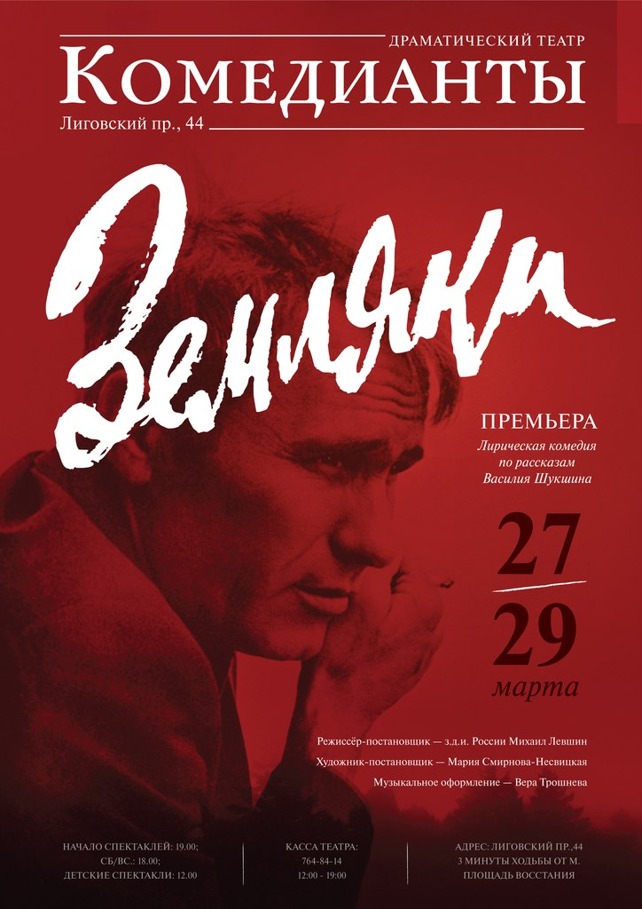

<table style="border-collapse: collapse; width: 607px; height: 4445px;"border="0" cellpadding="3" cellspacing="0">
<tbody>
<tr>
<td></td>
<td><strong><a href="index.php?option=com_content&view=article&id=283:zemlyaki&catid=9:2010-10-22-07-42-48">В. Шукшин «ЗЕМЛЯКИ»</a></strong>

Приглашаем Вас совершить путешествие в настоящую русскую глубинку 60-х годов ХХ века. На время спектакля сцена и зрительный зал превратятся в сельский клуб, где проходит смотр художественной самодеятельности. Участники, наши «земляки», продемонстрируют свои разносторонние таланты. 

</td>
</tr>
<tr>
<td></td>
<td><a href="index.php?option=com_content&view=article&id=282:kompromiss-sdovlatov&catid=9:2010-10-22-07-42-48"> <spandata-mce-mark="1"> <strong>С. Довлатов «КОМПРОМИСС»</strong>  </a>

  Повесть «Компромисс» рассказывает о жизненных перипетиях Сергея Довлатова и его работе в газете «Советская Эстония». Двенадцать эпизодов -компромиссов на нелегком пути превращения правды жизни в «газетную истину». За каждой заметкой — целая история, полная юмора, любви и сочувствия. Но в итоге за фальшивыми газетными строчками официальных советских газет перед нами встает драма целого поколения людей, морально искалеченных советским строем. Спектакль повествует о человеке, который всю свою жизнь пытался найти компромисс — со своей страной, со своей совестью, с окружающей абсурдностью.  

</td>
</tr>
<tr>
<td></td>
<td> <a href="index.php?option=com_content&view=article&id=59"> <spandata-mce-mark="1"> <strong>Э.де Филиппо « СТРАСТИ ПО-ИТАЛЬЯНСКИ» </strong>  </a> 

 «Почти невероятные истории из жизни неаполитанцев, описанные великим итальянским комедиографом», идут на сцене «Комедиантов» уже 20 лет. Этот спектакль наша «Чайка». Сменив 6 составов, постановка, сотканная из трех одноактных пьес, продолжает удивлять зрителя искрометным юмором и уникальным способом общения с залом.

</td>
</tr>
<tr>
<td></td>
<td> <a href="index.php?option=com_content&view=article&id=46"> <strong>И. С. Тургенев  « КРЕПОСТНАЯ ЛЮБОВЬ»</strong> </a> 

Этот спектакль по повести И. С. Тургенева "Муму" практически без слов. В глухоту и немоту погружаются все обитатели усадьбы, и немота Герасима оказывается самой звенящей и пронзительной. Повествование о печальной  судьбе двух одиноких существ – мужика и собаки, в постановке  М.Левшина, наполнено простым  человеческим сопереживанием и грустью. Оригинальная трактовка сочетает в себе  современные пластические формы и очарование народного фольклора.

</td>
</tr>
<tr>
<td> </td>
<td>

 <spandata-mce-mark="1"> <strong> <a target="_blank" href="index.php?option=com_content&view=article&id=91:les&catid=9:2010-10-22-07-42-48&Itemid=24"> А.Н. Островский  « ЛЕС»</a> </strong>

Все герои в маленьком мирке усадьбы «Пеньки» не живут, а красуются, изображают,  строят и поддерживают свое реноме. Это мир, где все чувства и  поступки – напоказ, а такие понятия, как  благородство и бескорыстие - красивы,  театральны, но непременно скрывают под собой корысть и расчет. Ведь и Гурмыжская, и все герои, буквально, живут, страдают и обретают счастье под слепящим светом софитов. Сюда же попадает племянник помещицы – актер Несчастливцев. Его  трагическое благородство заставит действие  привычно-фарсового спектакля придти к неожиданному финалу.

</td>
</tr>
<tr>
<td></td>
<td> <a href="index.php?option=com_content&view=article&id=42"> <strong>А. Н. Островский « ВОЛКИ И ОВЦЫ»</strong> </a> 

Этот спектакль был поставлен в то время, когда театр наконец-то обрел свой родной дом на Лиговском 44 и явился своеобразным подведением первых итогов молодого коллектива. Он стал доказательством профессионализма труппы и оказался знаковым в становлении основной творческой позиции театра, которую можно выразить так – "живая классика".

</td>
</tr>
<tr>
<td></td>
<td> <a href="index.php?option=com_content&view=article&id=60"> <spandata-mce-mark="1"> <strong>Э. Ростан « СИРАНО ДЕ БЕРЖЕРАК»</strong>  </a> 

<spandata-mce-mark="1"> Трепетная, нежная героиня Роксана искренне верит во встречу с "принцем" – красавцем, храбрецом и непременно — с душой поэта. Только вот у красавца и храбреца душа оказывается самая, что ни на есть прозаическая. А редким поэтическим даром, что так дорог сердцу красавицы, обладает не он, а ее странный, нелепый кузен, с огромным уродливым но­сом и такой же огромной гордыней... 

</td>
</tr>
<tr>
<td></td>
<td> <a href="index.php?option=com_content&view=article&id=69"> <spandata-mce-mark="1"> <strong>Н. Гоголь « ЖЕНИТЬБА»</strong>  </a> 

Совершенно невероятное событие в двух действиях. Внимательное и любовное отношение к классике в сочетании с острым ощущением современности дает неожиданный результат.  Сценическая версия «Женитьбы», предложенная режиссером – это «самая поэтическая “Женитьба”» в Петербурге.

</td>
</tr>
<tr>
<td></td>
<td>

 <a href="index.php?option=com_content&view=article&id=44"> <spandata-mce-mark="1"> <strong>Лопе де Вега « ДУРОЧКА»</strong>  </a> 

У богатого испанского гранда две красивые и любимые дочери на выданье. Одна – умница ("учёна так, что оторопь берёт"), к несчастью всех ее обожателей, обделена наследством. Другая богата, но ума в ней, согласно людской молве, как кот наплакал. Дура, и все тут. Интриги опутывают дом старого гранда... Потенциальные женихи обеих невест ведут словесные дуэли, уже готовые перерасти в самые, что ни на есть, настоящие…

</td>
</tr>
<tr>
<td></td>
<td>

 <a href="index.php?option=com_content&view=article&id=73"> <spandata-mce-mark="1"> <strong>Е. Рубина « ПРОГУЛКА В ЛЮ-БЛЁ»</strong>  </a> 

Спектакль - открытая репетиция. Актерские импровизации в присутствии режиссера. Зрители присутствуют при увлекательном процессе создания спектакля, где царит дух свободного творчества и импровизации. Причем такая форма не только не рушит целостности истории, но и помогает выявить содержание пьесы, придает ей ос обенный колорит.

</td>
</tr>
<tr>
<td></td>
<td>

 <a href="index.php?option=com_content&view=article&id=43"> <spandata-mce-mark="1"> <strong>В.Карасёв « ДАЧНИЦЫ»</strong>  </a> 

Фарс-детектив.Как сложно найти современную отечественную комедию,  чтобы  она не была пошлой, и чтобы было смешно.«…Можно сказать, что легкий, с изяществом перелетающий от шутки к шутке диалог играется без претензий на многозначительность. Публика «отдыхает душой», реагирует адекватно, радуясь истории с чудесными метаморфозами, которых так не хватает в жизни».

</td>
</tr>
<tr>
<td></td>
<td>

 <a href="index.php?option=com_content&view=article&id=70"> <strong> <spandata-mce-mark="1">Д. Фо « НЕ ВСЯКИЙ ВОР – ГРАБИТЕЛЬ» </strong> </a> 

 Фарс. Вор проникает в богатую квартиру. Он настолько уверен, что хозяева покинули её надолго, что "орудует" не спеша, "с комфортом", успевая даже ссорится с женой по телефону, "с рабочего места". Только вот хозяева этой квартиры – неверные супруги – оказывается, в тайне друг от друга, задумали использовать опустевшую квартиру для своих любовных утех…    

</td>
</tr>
<tr>
<td></td>
<td>

 <strong><a href="index.php?option=com_content&view=article&id=41">А.П.Чехов «В ПАРИЖ!»</a> </strong> 

Ранние рассказы А. Чехова, впервые напечатанные в 1893-1894 годах под псевдонимом «А.Чехонте», на театральную сцену впервые  попали в театре «Комедианты». «В Париж!» построен на непрерывном движении и пластике. Актеры фактически «станцевали» спектакль, не лишив его чеховской иронии и глубины.  "В Париж!" – это история о том, как все мы мечтаем о Париже, но зачастую дальше Курска уехать не способны. 

</td>
</tr>
<tr>
<td></td>
<td>

 <a href="index.php?option=com_content&view=article&id=71"> <spandata-mce-mark="1"> <strong>А.Вампилов « ПРОВИНЦИАЛЬНЫЕ АНЕКДОТЫ»</strong>  </a> 

 "Провинциальные анекдоты" – это два полноценных миниспектакля: "История с метранпажем" и "Двадцать минут с ангелом". Их действие происходит в маленькой провинциальной гостинице "Тайга", куда по разным причин   ам занесло героев с разных концов Союза    <spandata-mce-mark="1">.    .. 

</td>
</tr>
<tr>
<td></td>
<td>

 <a href="index.php?option=com_content&view=article&id=72"> <spandata-mce-mark="1"> <strong>Т. Уильямс « ЗАПИСНЫЕ КНИЖКИ ТРИГОРИНА»</strong>  </a> 

 У всех героев спектакля есть своя светлая история, ради которой они пытаются жить, которую они стараются укрыть от разрушения за белоснежными занавесками беседки, ставшей однажды сценой для никем не понятого спектакля Нины и Треплева о "людях, львах, орлах и куропатках". Но их мечтам не суждено осуществиться. Их жизнь становится лишь материалом для очередного рассказа знаменитого писателя... 

</td>
</tr>
<tr>
<td></td>
<td>

<strong> <a href="index.php?option=com_content&view=article&id=97:pominalnaia-molitva&catid=9:2010-10-22-07-42-48"> <spandata-mce-mark="1"> Г.Горин«ПОМИНАЛЬНАЯ МОЛИТВА»   </a> </strong>

Трех с тарших дочерей  молочника Тевье-Тевля, из украинской деревушки Анатовка, пора выдавать замуж. А дочери с характером, не хотят следовать вековым традициям – подчиниться выбору отца. Хотят замуж по любви выйти. 
 Нелегко будет принять мудрому Тевье то, что одна его дочь вместо богача выберет бедняка, вторая - революционера, а третья полюбит русского - вопреки вере и традициям...

</td>
</tr>
<tr>
<td></td>
<td>

 <a href="index.php?option=com_content&view=article&id=39"> <strong>В. Соллогуб « БЕДА ОТ НЕЖНОГО СЕРДЦА»</strong> </a> 

Вот, скажите на милость, что делать молодому человеку, симпатичному, доброму, да еще мечтающе­му жениться? Скорей всего вы ответите: "Найти не­весту, предложить ей руку и сердце".И будете со­вершенно правы. Но как поступить юноше, сердце которого буквально тает от любви при виде каждой девушки? Всех позвал замуж незадачливый герой! Здесь и начинаются сложно­сти...

</td>
</tr>
<tr>
<td></td>
<td>

 <a href="index.php?option=com_content&view=article&id=74"> <spandata-mce-mark="1"> <strong>Г. Сапгир, С. Прокофьева  « КОТ В САПОГАХ»</strong>  </a> 

 Жил был на свете Жак – простак, и не было у него ничегошеньки, кроме кота, только кота не простого, а самого, что ни на есть волшебного! Встретил Жак в лесу прекрасную Принцессу и влюбился в нее с первого взгляда. А как быть дальше — простаку и невдомек. Но у него есть верный друг – мудрейший говорящий Кот, да е   ще и в сапогах.    ..     
  

</td>
</tr>
<tr>
<td></td>
<td>

 <a href="index.php?option=com_content&view=article&id=75"> <spandata-mce-mark="1"> <strong>М. Мокиенко « ВОЛШЕБНЫЕ СОСУЛЬКИ»</strong>  </a> 

Театральная фантазия на тему русской сказки Морозко. Сказочный сюжет о падчерице, которую мачеха старается сжить со света, известен каждому. И, тем не менее, он остается одним из самых любимых  у артистов и  зрителей. И актеры нашего театра с удовольствием играют эту пьесу в Новогодние и Рождественские праздники.

</td>
</tr>
<tr>
<td></td>
<td>

 <a href="index.php?option=com_content&view=article&id=40"> <strong>В. Зимин « БРЫСЬ! или ИСТОРИИ КОТА ФИЛОФЕЯ»</strong> </a> 

Сказка для больших и маленьких в одном действии. Этот спектакль ценен тем, что пробуждает в маленьких зрителях чувство сострадания и нежности к маленьким четвероногим существам. Спектакль – лауреат фестиваля «Театры Санкт-Петербурга – детям» - Приз за лучший актерский анса мбль.

</td>
</tr>
<tr>
<td>

</td>
<td>

<a title="Училка из будущего" href="index.php?option=com_content&view=article&id=90:ychilka&catid=9:2010-10-22-07-42-48"> <strong> <spandata-mce-mark="1">В.Ольшанский </strong>  <strong>« УЧИЛКА ИЗ БУДУЩЕГО»</strong>  </a>

В некотором будущем детям больше не нужно ходить в школу! Обучение проходит на дому под руководством индивидуального работа – училки, в котором заложена информация обо всём на свете. А живые учителя стали просто никому не нужны. И вот одна из бывших учительниц – Нэнси Аллен под видом домашнего обучающего работа устраивается в семью четырнадцатилетнего мальчика Марка...

</td>
</tr>
<tr>
<td></td>
<td>

 <a href="index.php?option=com_content&view=article&id=76"> <spandata-mce-mark="1"> <strong>Е. Чеповецкий  « КЫЦИК, МЫЦИК И ТЕТУШКА МАРИ»</strong>  </a> 

Веселая история о необыкновенной дружбе. Эта веселая музыкальная история о мышонке Мыцике, котенке Кыцике и одинокой тетушке Мари, позабавит маленьких зрителей и заставит задуматься о том, что друг может оказаться совсем непохожим на тебя…

</td>
</tr>
<tr>
<td></td>
<td>

<a href="index.php?option=com_content&view=article&id=147:karlson&catid=9:2010-10-22-07-42-48">  <spandata-mce-mark="1"> <strong>Е. Линдгрен  « КАРЛСОН»</strong>   </a>

В одном самом обыкновенном городе, в самой обыкновенной семье, жил-был самый обыкновенный Малыш. И у него были чудесные Папа и Мама, которые его очень любили. Но, к сожалению, Папа и Мама были настолько погружены в свои взрослые заботы, что  Малыш частенько чувствовал себя очень одиноким. Так бы оно всё и продолжалось, если бы в один из самых обыкновенных дней не началась самая необыкновенная в жизни Малыша история - знакомство с бедокуром и озорником Карлсоном, который живёт на крыше!

</td>
</tr>
<tr>
<td></td>
<td>

 <a href="index.php?option=com_content&view=article&id=45"> <spandata-mce-mark="1"> <strong>А.Исполатов « ЕХАЛА ДЕРЕВНЯ МИМО МУЖИКА»</strong>  </a> 

  <spandata-mce-mark="1">Сказка для детей и взрослых.    "Невидальщина, неслыхальщина, небывальщи­на..." – вот с чем встретятся ребята и их родители, если придут на этот веселый спектакль. Молодые актеры азартно и радостно разыграют для зрителей любимые с детства русские народные сказки. В этом спектакле маленькие зрит   ели становится полноправным соучастником театрального действия... 

</td>
</tr>
</tbody>
</table>
